## 第二部分。实际应用

在第二部分中，你将超越基本的机器学习工作流程，了解如何从文本、图像和时间序列数据中提取特征，以进一步提高模型的准确性，并将你的机器学习系统扩展到更大的数据量。此外，你将阅读三个完整的示例章节，以看到一切的实际应用。

在第六章，我们的第一个完整示例章节，你将尝试预测纽约市出租车的打赏行为。

在第七章中，你将了解高级特征工程过程，这些过程允许你从自然语言文本、图像和时间序列数据中提取价值。许多现代机器学习和人工智能应用都基于这些技术。

在第八章中，你将使用这种高级特征工程知识在另一个完整的示例中：预测在线电影评论的情感。

在第九章中，你将学习将机器学习系统扩展到更大数据量、更高预测吞吐量和更低预测延迟的技术。这些都是许多现代机器学习部署的重要方面。

在第十章中，你将逐步构建一个模型——在大量数据上——该模型可以预测在线数字展示广告的点击量。

## 第六章。示例：纽约市出租车数据

*本章涵盖*

+   介绍、可视化和准备关于纽约市出租车行程的真实世界数据集

+   建立一个分类模型来预测乘客打赏习惯

+   通过调整模型参数和工程特征来优化机器学习模型

+   建立和优化回归模型以预测小费金额

+   使用模型来深入理解数据和它所描述的行为

在前五章中，你学习了如何从原始、混乱的数据开始，通过调整参数和工程特征来构建、验证和优化模型。尽管我们在这些章节中使用了各种小例子来阐述各个部分的观点，但现在是你运用所获得的知识并解决一个完整、真实世界例子的时候了。这是三个章节（连同第八章和第十章）中完全致力于一个完整、真实世界例子的第一个。

在本章的第一部分，你将更仔细地查看数据以及各种有用的可视化，这些可视化有助于你更好地理解数据的可能性。我们解释了如何进行初始数据准备，以便数据为后续章节中的建模实验做好准备。在第二部分，你将设置一个分类问题，并通过调整模型参数和工程新特征来提高模型的性能。

### 6.1。数据：纽约市出租车行程和费用信息

随着公司和组织产生越来越多的数据，近年来出现了一大批丰富且有趣的数据集。此外，一些这些组织正在拥抱*开放数据*的概念，允许任何感兴趣的各方公开传播和使用这些数据。

最近，纽约州信息自由法（FOIL）公布了一个极其详细的数据集，包含了 2013 年所有出租车行程的记录。1 这个数据集收集了每个单独出租车行程的各种信息，包括接车和下车位置、行程时间和持续时间、行驶距离和费用金额。您会看到这些数据符合现实世界数据的特征，不仅因为其生成方式，还因为其混乱：存在缺失数据、虚假记录、不重要的列、内置偏见等。

> ¹
> 
> 该数据最初由 Chris Wong 在博客文章中发布：[`chriswhong.com/open-data/foil_nyc_taxi/`](http://chriswhong.com/open-data/foil_nyc_taxi/)。

说到数据，数据量很大！完整的数据集超过 19 GB 的 CSV 数据，这使得许多机器学习实现无法在大多数系统上处理。为了简化，在本章中，您将使用数据的一个较小子集。在第九章和第十章中，您将研究能够扩展到这种大小甚至更大的方法，因此到本书结束时，您将知道如何分析全部 19 GB 的数据。

数据可在[www.andresmh.com/nyctaxitrips/](http://www.andresmh.com/nyctaxitrips/)下载。数据集由 12 对行程/票价压缩 CSV 文件组成。每个文件包含约 1400 万条记录，行程/票价文件是逐行匹配的。

您将遵循我们的基本机器学习工作流程：分析数据；提取特征；构建、评估和优化模型；以及在新的数据上进行预测。在下一小节中，您将通过使用第二章中的一些可视化方法来查看数据。

#### 6.1.1. 可视化数据

在开始解决一个新问题时，第一步是了解数据集包含的内容。我们建议您首先加载数据集，并以表格形式查看它。对于本章，我们将行程/票价数据合并为一个单一的数据集。图 6.1 显示了数据的前六行。

##### 图 6.1. 纽约市出租车行程和票价记录数据的前六行。大多数列都是自解释的，但我们在随后的文本中会详细介绍其中的一些。

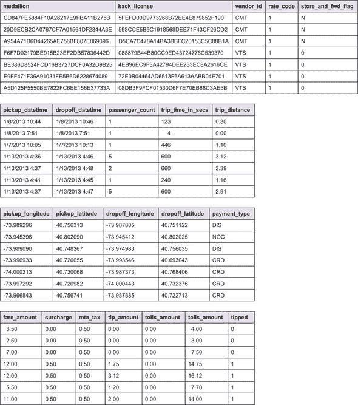

`medallion`和`hack_license`列看起来像简单的 ID 列，对簿记有用，但从机器学习的角度来看不太有趣。从它们的列名来看，一些列看起来像分类数据，如`vendor_id`、`rate_code`、`store_and_fwd_flag`和`payment_type`。对于单个分类变量，我们建议以表格形式或条形图形式可视化它们的分布。图 6.2 使用条形图显示了这些分类列中每个值的分布。

##### 图 6.2. 我们数据集中一些看似分类的列的值分布

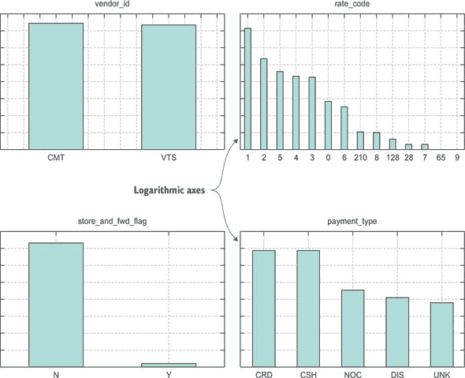

接下来，让我们看看数据集中的一些数值列。例如，验证诸如行程时长(`trip_time_in_secs`)、距离和行程总费用之间存在相关性是有趣的。图 6.3 显示了这些因素相互之间的散点图。

##### 图 6.3. 出租车行程的散点图，分别显示了以秒为单位的时间与行程距离，以及以秒为单位的时间与行程金额（美元）的关系。正如预期的那样，存在一定程度的关联，但散点仍然相对较高。还出现了一些不太合理的簇，例如很多零时间行程，甚至一些昂贵的行程，这可能表明数据条目有误。

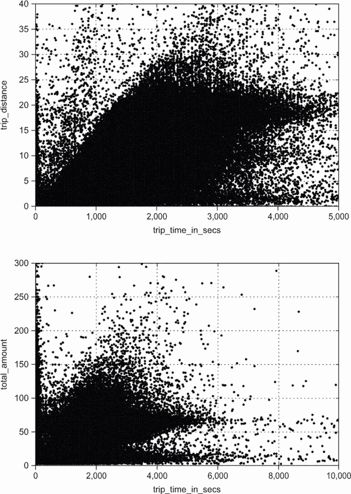

最后，在图 6.4 中，你可以可视化纬度/经度空间中的接车位置，定义纽约市出租车行程的地图。分布看起来是合理的，大多数接车位置发生在曼哈顿市中心，许多发生在其他区，令人惊讶的是，还有少数发生在东河中间！

##### 图 6.4. 接车位置的纬度/经度。请注意，与常规地图相比，x 轴被翻转了。你可以看到曼哈顿有大量的接车点，随着你远离市中心，数量逐渐减少。

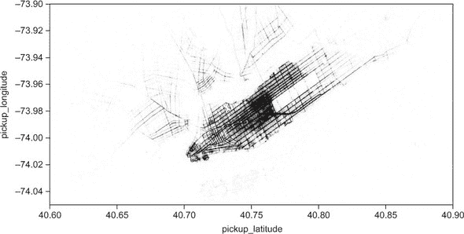

以对所处理数据的全新视角，让我们继续设想一个可以通过使用机器学习解决的现实问题，这个问题可以用这个数据集来解决。

#### 6.1.2. 定义问题和准备数据

当我们最初查看这些数据时，一个特定的列立即引起了我们的注意：`tip_amount`。这个列存储了每次行程给小费的金额（美元）的信息。了解哪些因素最影响任何给定纽约市出租车行程的小费金额将是有趣的。

为了达到这个目的，你可能想要构建一个分类器，该分类器使用所有行程信息来尝试预测乘客是否会给司机小费。有了这样的模型，你可以在每次行程结束时预测是否给小费。出租车司机可以在移动设备上安装这个模型，并在小费未给的情况下收到警报，从而在情况变得太晚之前改变现状。在你等待所有纽约出租车安装你的应用程序获得批准的同时，你可以使用这个模型来了解哪些参数对于小费与否最为重要，或者具有预测性，以便在宏观层面上尝试提高整体小费率。图 6.5 显示了所有出租车行程中小费金额的直方图。

##### 图 6.5。小费金额的分布。大约一半的行程没有小费，这比我们直观上预期的要多。


因此，我们模型的计划是预测哪些行程将导致不给小费，哪些将导致给小费。这是一项二元分类器的工作。有了这样的分类器，你将能够做到以下几点：

+   通过提供预测不给小费情况的警报来帮助出租车司机

+   通过使用数据集来揭示纽约出租车行程中给小费背后的驱动因素（有意为之！），来了解这种情况是如何以及为什么会出现。

##### 一个来自现实世界的故事

在你开始构建这个模型之前，我们将告诉你我们第一次尝试解决这个问题时的真实故事，这个尝试非常不成功，却伪装成非常成功——最糟糕的不成功——以及我们是如何纠正它的。这种类型的偏离在处理真实数据时非常常见，因此包括在这里学到的教训是有帮助的。在处理机器学习时，密切关注两个陷阱至关重要：*过于美好以至于不可能是真的*的场景和基于数据的*过早的假设*。

在机器学习的一般规则中，如果交叉验证的准确率高于你预期的，那么很可能是你的模型在某个地方作弊。现实世界在试图让数据科学家的生活变得困难时非常具有创造性。在构建初始的小费/不给小费分类模型时，我们迅速获得了非常高的交叉验证预测准确率。因为我们对于这个新获得的数据集上的模型性能非常兴奋——我们做到了——我们暂时忽略了作弊模型的警告。但是，由于之前多次被这种事情咬过，过于乐观的结果迫使我们进一步调查。

我们考虑的一件事是输入特征的重要性（你将在后面的章节中更详细地看到）。在我们的案例中，一个特定的特征在模型中的特征重要性方面完全占主导地位：*支付类型*。

从我们自己的出租车经验来看，这可能是有道理的。在 Square 时代之前使用信用卡支付的人可能给小费的可能性较低。如果你用现金支付，你几乎总是会把零钱凑成整数。所以我们开始将使用信用卡支付而不是现金的人的小费与不支付小费的人数进行细分。然而，结果令人惊讶，超过 95%的数百万名使用信用卡支付的车费乘客都给了小费。那么，那个理论就到此为止了。

那么，用现金支付的人有多少人给了小费？*所有人*？

实际上，用现金支付的所有乘客都没有给小费！然后很快就变得很明显。每当乘客用现金支付并给小费时，司机都没有以任何必要的方式将其记录下来，以便将其包含在我们的数据中。通过进行我们的机器学习合理性检查，我们发现了数百万个潜在的欺诈案例，这些案例发生在纽约市出租车系统中！

回到我们机器学习模型的影响：在这种情况下，当数据生成存在问题的时候，我们根本无法相信这部分数据用于构建机器学习模型。如果答案以恶意的方式不正确，那么机器学习模型学到的可能完全错误，与现实脱节。

最终，为了规避这个问题，我们决定从数据集中移除所有用现金支付的车费行程。这改变了目标：只预测非现金支付者的给小费发生率。丢弃数据总是感觉不正确，但在这个案例中，我们决定在新的基于数据支持的假设下，即所有现金支付数据都是不可信的，最佳选择是使用非现金数据来回答一个稍微不同的问题。当然，不能保证其他小费记录也是正确的，但我们至少可以检查小费金额的新分布。图 6.6 显示了过滤掉任何现金支付行程后的小费金额直方图。

##### 图 6.6\. 忽略现金支付时的小费金额分布（在发现现金小费从未在系统中记录后）

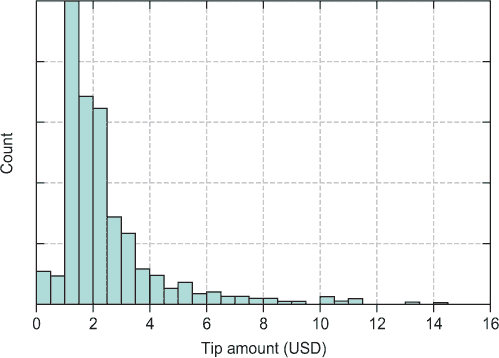

在移除不良数据后，分布看起来要好得多：只有大约 5%的行程没有小费。在下一节中，我们的任务是找出原因。

### 6.2\. 建模

准备好用于建模的数据后，你可以轻松地运用你在第三章中学到的知识来设置和评估模型。在接下来的小节中，你将构建不同版本的模型，并尝试在每次迭代中提高性能。

#### 6.2.1\. 基本线性模型

你将以尽可能简单的方式开始这个建模工作。你将使用一个简单的逻辑回归算法。你最初也将自己限制在数据集中的数值上，因为这些数值可以由逻辑回归算法自然处理，无需任何数据预处理。

你将使用 Python 中的 scikit-learn 和 pandas 库来开发模型。在构建模型之前，我们随机打乱了实例并将它们分成 80%的训练集和 20%的持有样本测试集。你还需要对数据进行缩放，这样就没有任何列在事先被认为是比其他列更重要。如果数据已经被加载到 pandas 的`DataFrame`中，构建和验证此模型的代码看起来如下所示。

##### 列表 6.1。逻辑回归小费预测模型

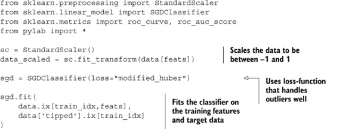

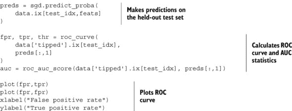

列表 6.1 的最后部分绘制了第一个简单分类器的 ROC 曲线。持有样本的 ROC 曲线显示在图 6.7 中。

##### 图 6.7。逻辑回归小费/无小费分类器的接收者操作特征（ROC）曲线。曲线下的面积（AUC）为 0.5，模型似乎并不比随机猜测表现得好。这对我们的模型来说不是一个好迹象。

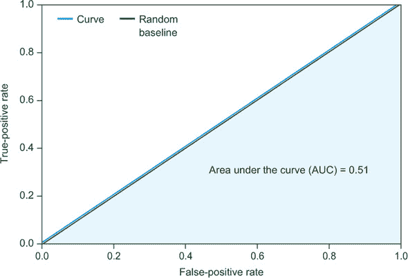

没有办法绕过这个问题：这个分类器的性能并不好！持有样本的 AUC 为 0.51，模型的表现并不比随机猜测（抛一个 95%“小费”和 5%“无小费”的硬币来预测每次行程）好，这显然是没有用的。幸运的是，我们一开始就很简单，有几种方法可以尝试提高这个模型的表现。

#### 6.2.2. 非线性分类器

你首先尝试的是切换到一个不同的算法——一个非线性算法。考虑到第一次尝试的结果很差，似乎线性模型对于这个数据集来说是不够用的；简单来说，小费是一个复杂的过程！相反，你将使用一个名为*随机森林*的非线性算法，它在现实世界数据集上以其高精度而闻名。你可以选择许多其他算法（见附录），但我们将其留给你作为评估和比较不同算法的练习。以下是构建此模型的代码（相对于前一个模型）。

##### 列表 6.2。随机森林小费预测模型

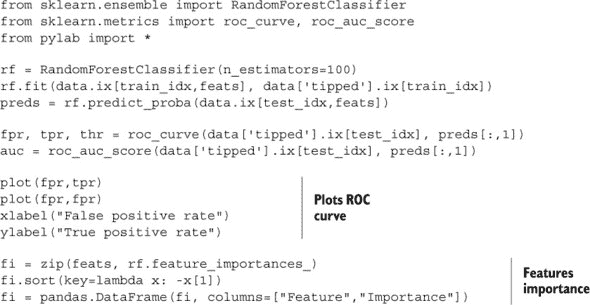

列表 6.2 中运行代码的结果显示在图 6.8 中。你可以看到持有样本准确率有显著提高——持有样本的 AUC 现在为 0.64——清楚地表明数据集中存在预测信号。一些输入特征的组合能够预测出租车行程是否会收到乘客的小费。如果你很幸运，进一步的特征工程和优化甚至能够进一步提高准确率水平。

##### 图 6.8。非线性随机森林模型的 ROC 曲线。AUC 显著提高：达到 0.64，数据集中很可能存在真实信号。

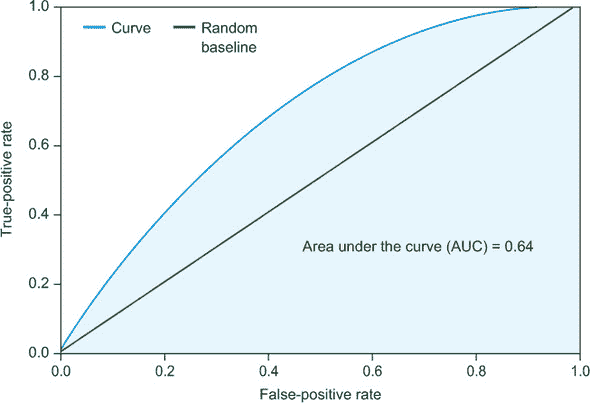

你也可以使用这个模型来了解在这个中等预测模型中哪些特征最重要。这个练习有几个关键原因：

+   它使你能够识别任何作弊特征（例如，非现金支付者的问题），并利用这些作为洞察来纠正任何问题。

+   它作为进一步特征工程的一个起点。例如，如果你将经纬度识别为最重要的特征，你可以考虑从这些指标中推导出其他特征，例如从时代广场的距离。同样，如果你认为某个特征很重要，但它*没有*出现在顶级特征列表中，那么你将想要分析、可视化和可能清理或转换该特征。

图 6.9（由列表 6.2 中的代码生成）显示了随机森林模型的特征列表及其相对重要性。从这张图中，你可以看到位置特征是最重要的，其次是时间、行程距离和车费金额。可能的情况是，城市某些地区的乘客对缓慢、昂贵的行程不太有耐心。你将在第 6.2.5 节中更仔细地研究获得的可能见解。

##### 图 6.9。随机森林模型的重要特征。上下车位置特征似乎主导了模型。

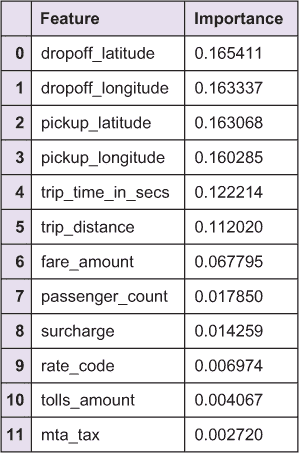

现在你已经选择了算法，让我们确保你正在使用所有原始特征，包括分类列，而不仅仅是普通的数值列。

#### 6.2.3。包括分类特征

在不深入特征工程领域的情况下，你可以执行一些简单的数据预处理来提高准确性。

在第二章中，你学习了如何处理分类特征。一些机器学习算法可以直接处理分类特征，但你将使用常见的“布尔化”分类特征的技巧：为特征中每个可能的类别创建一个值为 0 或 1 的列。这使得任何机器学习算法都能在不改变算法本身的情况下处理分类数据。

转换所有分类特征的代码如下所示。

##### 列表 6.3。将分类列转换为数值特征

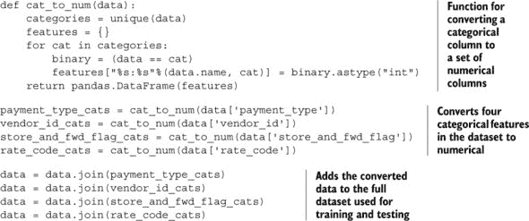

在创建布尔化列之后，你再次将数据通过列表 6.2 运行，并获得图 6.10 中显示的 ROC 曲线和特征重要性列表。请注意，你的保留 AUC 略有上升，从 0.64 上升到 0.656。

##### 图 6.10。将所有分类变量转换为布尔（0/1）列的随机森林模型的 ROC 曲线和特征重要性列表。新特征为表格带来了新的有用信息，因为 AUC 从之前没有分类特征的模型中观察到有所增加。

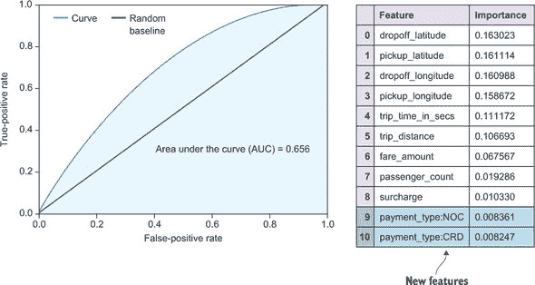

随着模型性能的提高，你可以考虑额外的因素。当然，你还没有进行任何真正的特征工程，因为到目前为止应用的数据转换被认为是基本的数据预处理。

#### 6.2.4\. 包含日期时间特征

到目前为止，是时候开始使用数据来生成新的特征了，你之前所知道的称为*特征工程*。在第五章中，我们介绍了一系列将日期和时间戳转换为数值列的日期时间特征。你可以很容易地想象一天中的时间或一周中的某一天可能会对乘客的小费产生影响。

计算这些特征的代码在下面的列表中给出。

##### 列表 6.4\. 日期时间特征

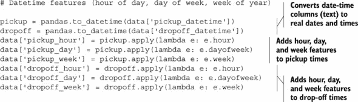

使用这些日期时间特征，你可以构建一个新的模型。你再次将数据通过列表 6.2 中的代码运行，并获取图 6.11 中显示的 ROC 曲线和特征重要性。

##### 图 6.11\. 包含所有分类特征和附加日期时间特征的随机森林模型的 ROC 曲线和特征重要性列表

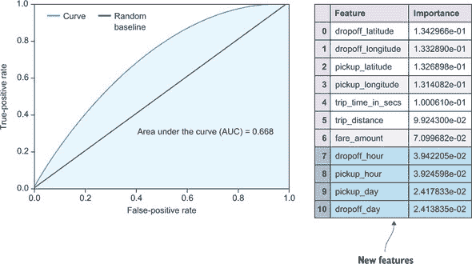

你可以看到，随着额外的数据预处理和特征工程的加入，模型的准确性有所提高。到目前为止，你只关注了改进数据以改进模型，但你还可以尝试以两种其他方式改进这个模型：

+   调整模型参数以查看默认值是否一定是最佳选择

+   增加数据集大小

在本章中，我们为了使算法能够处理数据集，甚至是在 16 GB 内存机器上，对数据集进行了大量子采样。我们将在第九章和第十章中更多地讨论方法的可扩展性，但在此期间，我们将这项工作留给你，以便你使用这些数据进一步提高交叉验证的准确性！

#### 6.2.5\. 模型洞察

通过构建一个预测特定答案的模型来深入了解数据是很有趣的。从特征重要性列表中，你可以了解哪些参数具有最大的预测能力，并利用这一点以新的方式查看数据。在我们最初的失败尝试中，正是因为检查了特征重要性列表，我们发现了数据中的问题。在当前的工作模型中，你也可以使用这个列表来启发一些新的可视化。

在本节中我们模型的每一次迭代中，最重要的特征都是接车和下车的位置特征。图 6.12 绘制了产生小费的乘客的下车地点的地理分布，以及没有产生小费的行程的下车地点。

##### 图 6.12\. 乘客上下车的地理分布

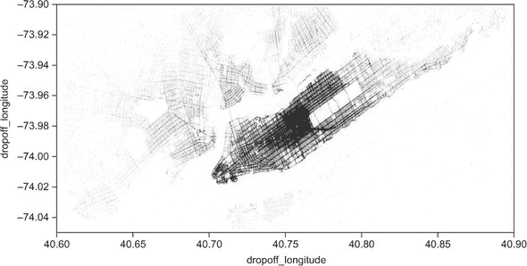

图 6.12 显示了在靠近城市中心下车时不给小费的有趣趋势。为什么会有这种情况？一个可能的原因是交通状况造成了许多缓慢的行程，乘客可能并不满意司机的行为。作为一个非美国公民，我还有另一个理论。这个城市的特定区域金融工作者和游客数量都很多。我们预计金融群体会在曼哈顿南部更远的地方分布。在我看来，游客很可能是造成这种差异的最可能原因：许多国家对于小费的规定与美国大相径庭。一些亚洲国家几乎从不给小费，许多北欧国家小费较少，且很少在出租车中给小费。你可以基于这个数据集进行许多其他有趣的调查。当然，重点是，现实世界的数据经常可以用来对现实世界以及生成数据的人说些有趣的事情。

### 6.3. 概述

本章介绍了一个来自现实世界的数据集，并定义了一个适合你在前五章中积累的机器学习知识的问题。你经历了整个机器学习工作流程，包括初始数据准备、特征工程以及模型构建、评估、优化和预测的多次迭代。本章的主要收获如下：

+   随着更多组织产生大量数据，组织内部可用的数据量也在不断增加，即使不是公开的。

+   2013 年纽约市所有出租车行程的记录已公开发布。纽约市一年中发生的出租车行程数量真是惊人！

+   现实世界的数据可能很混乱。可视化和对领域的了解有帮助。不要陷入过于完美的场景，也不要对数据做出过早的假设。

+   从最简单的模型开始迭代。不要在过早优化上浪费时间。逐渐增加复杂性。

+   做出选择并继续前进；例如，尽早选择一个算法。在理想的世界里，你会在构建模型的迭代过程的每一步都尝试所有组合，但你必须固定一些东西才能取得进展。

+   为了了解领域并可能进一步改进模型，深入了解模型和数据。

### 6.4. 本章术语

| 词汇 | 定义 |
| --- | --- |
| 开放数据 | 由机构和组织公开提供的数据。 |
| FOIL | 信息自由法。（联邦版本被称为信息自由法案，或 FOIA。） |
| 过于完美的场景 | 如果一个模型与你的预期相比极其准确，那么很可能是模型中的某些特征或某些数据特性导致模型“作弊”。 |
| 过早的假设 | 在未经验证的情况下对数据进行假设，可能会使你对结果的看法产生偏差。 |

## 第七章. 高级特征工程

*本章涵盖*

+   使用高级特征工程概念来提高你的机器学习系统的准确性

+   通过使用自然语言处理技术从文本中提取有价值的特征

+   从图像中提取意义并在你的机器学习项目中使用它们作为特征

你在第五章中探索了特征工程的基本概念，并在第六章中应用了简单的特征工程技术到现实世界的数据中。在本章中，你将了解更复杂的技巧，这些技巧可以用于面对当今世界常见的各种数据类型。其中最重要的两种是文本和图像。本章介绍了从文本和图像数据中提取特征的高级技术，以便在机器学习管道中使用这些数据。

### 7.1\. 高级文本特征

你已经在第五章中了解了文本数据的简单特征工程，本节提供了关于这些技术背后的思想的更多细节，并介绍了可以进一步提高模型准确性的更高级概念。

回想一下，从文本中提取特征的任务是将各种长度和单词的文本转换为一种共同的特征集。在第五章中，你学习了词袋表示法，其中你统计了所有文本中单词的出现次数，并使用前 N 个单词的计数作为 N 个新的特征。将自然语言文本转换为机器可用的数据这一工作通常被称为*自然语言处理*，或 NLP。

#### 7.1.1\. 词袋模型

*词袋*是 NLP 中最简单但也是最广泛使用的技术之一。对于任何基于文本的问题，它都是一个很好的起点。它也是本章后面将要探讨的许多其他更高级方法的基础。你将分两部分了解这个模型：首先，标记化和转换，然后是向量化。

##### 标记化和转换

将文本分割成片段的过程称为*标记化*。最常见的分割方式是基于单词，但在某些情况下（例如，在基于字符的语言中），你可能希望基于字符或基于单词对或单词组进行分割，甚至更高级的分割。分割中的单词组称为*n-gram*。两个或三个单词的组合分别称为*bigram*和*trigram*（它们在单词*unigram*之后是最常见的）。图 7.1 中的例子中的 bigram 包括“the lazy”、“brown fox”等等。trigram 包括“brown fox jumps”和“jumps over the”。

##### 图 7.1\. 词袋提取算法的初始步骤


在某些情况下，扩展到多个单词可能有助于你的模型，因为它提供了更多的文本上下文。但使用多个单词通常也会显著增加特征数量。在实践中，你通常只从单词表示开始。如果你想转向更高阶的语法，你必须确保使用能够处理稀疏数据的 ML 算法。你将在下一个小节中了解更多关于这一点。

我们词袋算法的下一步是对从文本中提取的标记进行必要的*转换*。一个很好的转换例子是将所有单词转换为小写，这样你就不会为“fox”和“Fox”产生特征，这可能会增加模型的噪声。然而，在某些情况下，你可能想保留大小写，如果这在你的项目中是有意义的（例如，如果文本中常见的专有名词具有高度预测性，或者如果 ALL CAPS 有意义）。*词干提取*——去除单词后缀——对于从具有相似意义的不同单词中提取更多信号也是一种强大的转换。例如，使用词干提取，单词“jump”、“jumping”、“jumps”和“jumped”在你的字典中都会表示为标记“jump”。其他如自定义处理数字、标点符号和特殊字符的转换也可能很有用，具体取决于文本内容。

接下来，你可以定义你将从中生成文本特征的字典。在机器学习项目中，通常会对字典中的特征数量（即单词数量）设置一个限制。这通常是通过按单词出现次数排序，并仅使用前 N 个单词来完成的。

##### 向量化

你可以使用你的词袋字典来生成用于你的 ML 模型的特征。在定义字典后，你可以将任何文本转换为与文本中每个字典单词出现次数相对应的数字集合。图 7.2 显示了这一过程，这个过程被称为*向量化*。

##### 图 7.2\. 使用词汇表，你现在可以将每个文本表示为一个数字列表。行显示了图 7.1 中两个小文本的计数以及关于句子“The quick brown fox jumps over the lazy dog”的维基百科页面的计数，这是一个英语回文句（它包含了英语字母表中的所有字母）。


但还有一个问题我们尚未讨论。大多数自然语言文本包含许多对理解主题不重要的词，它们只是“填充”的。这些词包括“the”、“is”和“and”等。在自然语言处理研究中，这些被称为*停用词*，通常从字典中移除，因为它们通常不高度预测任何有趣的内容，并且可能会稀释从机器学习角度来看重要的更有意义的词。在我们的单词已经按出现次数排序的情况下，移除停用词的常用方法是丢弃所有出现次数超过某个词数阈值的单词。图 7.2 展示了示例；较大的文本（图中的第三行）中“the”这个词的出现次数比其他任何词都要多。因此，挑战在于定义一个阈值，以确定一个特定的词是停用词而不是有意义的词。大多数自然语言处理库，如 NLTK Python 库，都包含一系列语言的预构建停用词列表，这样你就不必每次都这样做。然而，在某些情况下，停用词列表将因你的特定项目而异，你需要选择一个停用词阈值（一个标准的选择是排除任何在所有文档中出现超过 90%的单词）。

虽然在图 7.2 中不明显，但任何现实的字典都会有许多词，通常只有其中的一小部分会出现在你为生成特征而创建的文本中。这种组合通常会使文本特征包含很多零。在给定的文本中，只有少数字典词会被找到，因此我们称这些词为“词袋”特征*稀疏的*。如果你有很多稀疏特征（通常有 1,000 个特征，只有一小部分非零元素），选择一个可以原生处理稀疏特征的机器学习算法，或者一个可以处理许多低显著性特征而不牺牲准确性的算法是个好主意。scikit-learn Python 库中的朴素贝叶斯算法可以原生处理稀疏数据，因此非常适合文本分类问题。像随机森林这样的算法已知可以很好地处理许多低显著性特征，尽管效果可能会有所不同。你应该始终通过使用第四章中讨论的评估和优化技术来测试不同方法的功效。

#### 7.1.2\. 主题建模

词袋方法简单易懂且易于实现。但其他更高级的方法可能导致机器学习模型准确性的大幅提升。本节介绍了这三种方法中的三种。

词袋模型的一个问题是简单词频的性质。如果某个词（不是停用词）在语料库中很常见——例如，在机器学习论文语料库中的“数据”一词——知道这个词也出现在新文本中并不一定有信息量。相反，你最好关注那些相对罕见且更能预测感兴趣的结果的词。为此，通常通过该词在语料库中的总计数倒数来缩放词频。因为你只想用数字尽可能好地描述文本，而在训练语料库中不常见但在新文档中常见的词可能更能表明新文档的意义，所以你最好优先考虑这个罕见的词。

##### 词频-逆文档频率

一种试图解决这个确切问题的常用算法被称为**词频-逆文档频率**，简称**tf-idf**。这个算法是通过词频（tf）和逆文档频率（idf）的乘积来计算的。

tf 可以用不同的方式计算，但最简单的是使用一个词在特定文档中出现的次数。也常见使用 tf 因子的其他版本，例如二进制（如果词在文档中，则为 1，否则为 0）和对数（1 + log[tf]）。

逆文档频率是通过总数为文档总数的对数除以包含该词的文档数来计算的，这样相对不常见的词就能获得更高的值。在它的最简单形式中，tf-idf 方程看起来是这样的：

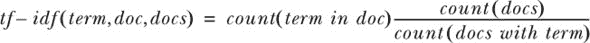

Tf-idf 可以从任何文本语料库中生成好的机器学习特征。它也可以在其他领域有用，例如搜索。因为为任何文档生成一个数字向量，你也可以找到文档之间的“距离”，就像它们 tf-idf 向量表示之间的距离一样。如果用户的搜索查询是一个文档，你可以以这种方式找到数据集中任何其他文档之间的距离，从而根据查询返回文档的排名列表。下一节中的列表 7.1 展示了如何使用 scikit-learn Python 库从文档中生成 tf-idf 向量，以及一种更高级的技术，称为**潜在语义索引**。

##### 隐含语义分析

**潜在语义分析**，或 LSA（也常称为**潜在语义索引**，或 LSI），是一种更复杂的话题建模方法。它在概念上和计算上也都更先进。想法是使用词袋计数来构建一个词-文档矩阵，其中每一行代表一个词，每一列代表一个文档。然后，这个矩阵的元素被规范化，类似于 tf-idf 过程，以避免频繁的词主导矩阵的权重。

LSA 算法的主要技巧在于其对概念的理解。**概念**是文档语料库中相似术语的模式。例如，“dog”的概念可能有关联术语（在这种情况下是单词）如“barking”，“leash”和“kennel”。算法不会标记“dog”这个概念，而是通过分析文档中术语的共现来找出哪些单词相关联，然后确定这些单词通过某种抽象概念相连。单词“dog”本身可能是一个与“dog”概念相关的重要术语。这些主题被认为是数据中的**隐藏**或**潜在**的，因此得名**潜在语义分析**。

LSA 使用**奇异值分解**（SVD）^([1])——一种著名的数学工具——将词-文档矩阵（*A*）分解为三个矩阵（*T*，*S*，*D*）。*T*是词-概念矩阵，它将术语（例如，“barking”和“kennel”）与概念（例如，“dog”）相关联，而*D*是概念-文档矩阵，它将单个文档与你在以后用于从 LSA 模型中提取特征的概念相关联。*S*矩阵持有奇异值。在 LSA 中，这些表示一个术语对一个文档的相对重要性。与你在词袋模型和 tf-idf 算法中限制特征数量相同，你现在可以选择前几个奇异值，并将特征空间限制在更易于管理的范围内；回想一下，词-文档矩阵（*[A]*）可以非常大且稀疏。

> ¹
> 
> 对于熟悉主成分分析（PCA，本章后面将介绍）的读者来说，SVD 是使你能够从数据集中计算 PCA 坐标的相同技术。你可以将 LSA 视为“词袋的 PCA”。

使用 SVD 的前 N 个成分，你可以通过从概念-文档矩阵（*D*）中取出相应的行来为你的机器学习模型生成 N 个特征。当有新的文档用于预测时，你可以通过执行矩阵乘法：*D* = *A^TTS*^(–1)来从先前学习的 LSA 模型中生成一组新的特征。在这里，*A^T*是新文档的词频（或 tf-idf），使用定义的词典，而*T*和*S*是 SVD 中的词-概念和奇异值矩阵。

虽然理解 LSA 的原则很有用，但并不是每个人都足够熟悉线性代数来做这些计算。幸运的是，有很多实现可以方便地用于你的机器学习项目。scikit-learn Python 库包括运行 LSA 所需的功能，通过（1）使用 tf-idf 生成词-文档矩阵，（2）执行矩阵分解，（3）将文档转换为向量，如下所示。

##### 列表 7.1\. 使用 scikit-learn 进行潜在语义分析

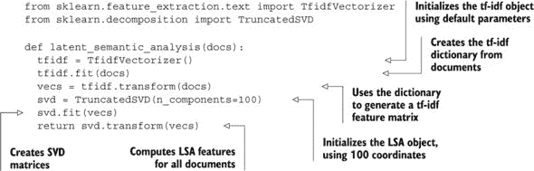

接下来，你将了解一些最近在主题建模领域变得流行的 LSA（潜在语义分析）的高级扩展。

##### 概率方法

LSA 基于线性代数（涉及向量和矩阵的数学），但可以使用对每个文档作为主题分布的统计混合模型进行概率方法的等效分析。这些概念都相对高级，我们在这里不会深入数学细节，但概率方法在某些数据集上可以更好地提高模型精度。

LSA 的概率对应物被称为 pLSA（代表概率）。这种更广泛使用的版本被称为*潜在狄利克雷分析*（LDA），其中对主题的分布做出了特定假设。您假设一个文档可以由一组小的主题来描述，并且任何术语（单词）都可以归因于一个主题。在实践中，LDA 可以在各种数据集上表现良好。以下代码示例突出了如何使用 Gensim 库在 Python 中应用 LDA。

##### 列表 7.2. 使用 Gensim 在 Python 中进行的潜在狄利克雷分析

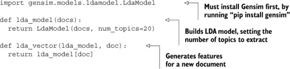

在 LDA 模型中使用的话题数量是一个需要根据数据和问题进行调整的参数。我们鼓励您定义您的性能指标，并使用第四章中的技术来优化您的模型。还值得注意的是，如果新的训练数据持续到来，Gensim 中的 LDA 可以实时更新。我们鼓励您探索 Gensim 中许多其他有趣的自然语言和主题建模算法。在第十章中，您将使用这些高级文本特征提取技术来解决一个实际的机器学习问题。下一节介绍了一种完全不同的文本特征提取方法：扩展文本内容。

#### 7.1.3. 内容扩展

我们现在转向一个完全不同的概念，用于从文本中提取特征。本节的方法不是用数字表示文本，而是扩展文本内容以包含更多文本（然后可以进行特征化）或引入对特定 ML 问题有用的其他信息。以下是一些常见的内容扩展方法。

##### 跟随链接

如果您希望通过从推文中提取文本特征来构建 ML 分类器（例如，用于 Twitter 情感分析，将帖子分类为正面或负面情感），您通常会发现 140 个字符的限制是一个问题。您可能没有足够的信息来获得模型所需的准确度。

许多推文包含指向外部网页的链接，这些网页可以包含更多的文本，您可以用链接中的文本来*扩展*推文，从而提高数据质量。您甚至可以深入网页上的链接，以构建更大的文本语料库。

##### 知识库扩展

一种更高级的文本扩展方法是在文本中检测命名实体，并使用在线知识库（如维基百科）中每个命名实体的信息来扩展原始文本。在这种情况下，命名实体可以是你在维基百科上可以查找的任何东西。然后，你会从该命名实体的维基百科条目中获取文本，并执行第 7.1.2 节中提到的任何文本提取算法。

提取命名实体并非易事，一直是多个研究小组的研究课题。其中一个问题是源于名称的歧义性。如果一个单词有多种含义，你可能会因为包含完全错误的信息而扩大你的特征集。一个可能的解决方案是使用像维基百科这样的知识库再次对命名实体进行消歧。首先，你可以假设推文中出现的任何其他单词，例如，在知识库文本中也很常见。你也可以使用维基百科的链接图来找出两个命名实体在知识库中的接近程度。一个例子是包含命名实体“Tesla”的推文。一些推文会与电子汽车公司相关，而另一些则可能关于发明家尼古拉·特斯拉。如果推文中包含“car”或“model”等单词，那么它很可能是关于特斯拉公司。如果它包含与“Edison”相关的实体，那么它可能是关于这个人（特斯拉和爱迪生在 1884 年纽约市一起工作过）。

##### 文本元特征

另一种通过分析文本以扩展具有价值数据的技巧是分析文本的元特征。与之前讨论的技术不同，这些类型的特征是问题相关的。

让我们再次以推文为例。推文包含所有 sorts of 有价值的数据，这些数据特定于推文并且可以提取，例如标签和提及，以及来自 Twitter 的元信息，例如转发和喜欢的计数。作为基于网络的文本的另一个例子，你可以从链接文本中提取基本信息，例如顶级域名。在一般文本中，你可以提取单词或字符的计数，或不同语言中特殊字符的数量。提取语言本身可能就是一个机器学习分类器，它将答案作为特征提供给另一个分类器。

要选择正确的文本元特征，你应该发挥想象力，并了解手头的问题。记住，机器学习工作流程是一个迭代过程；你可以开发一个新的特征，然后回到管道中，分析随着时间的推移准确率是如何提高的。

你还可以使用文本来获取其他类型的数据。文本可能包含对机器学习模型理解有用的日期和时间，或者文本的元数据中可能包含时间信息。第五章介绍了日期时间特征提取，这些也可以在此背景下使用。

如果你正在分析一个网页，或者文本中有一个 URL，你可能可以访问对理解文本上下文很重要的图像或视频。从图像和视频中提取特征需要更高级的技术，你将在下一节中探讨。

### 7.2\. 图像特征

人类智能的坚强堡垒之一是我们的视觉和空间感，以及我们识别图像和日常生活中导航的 3D 场景中的模式和对象的能力。我们思考的大部分方式都基于这些能力。另一方面，计算机以比特和它们的视觉类比——像素来思考。从历史上看，这一事实严重限制了计算机在视觉模式识别方面达到人类认知水平的能力。只有随着计算机视觉和人工智能中复杂算法的出现——机器学习可以说是由此产生的——研究人员和从业者才越来越接近达到人类水平，尽管大多数情况下是在狭窄指定的领域。另一方面，如果你能通过计算机视觉和机器学习技术接近匹配人类水平的模式识别准确性，你就可以获得大多数计算系统的一些好处：可扩展性、可用性和可重复性。

本节介绍了几种从图像中提取特征的方法，这些特征可以用于你的机器学习工作流程。首先，你将查看简单的图像特征，包括原始像素、颜色和图像元数据。

#### 7.2.1\. 简单图像特征

处理图像的最简单方法值得提及，不仅因为它有时可能足够，而且还因为它展示了机器学习方法的真正力量，与手动或传统统计方法相比。你将图像中像素的值视为进入你的机器学习模型的特征。

在实践中，你将所有像素排成一行，将二维图像转换为一维。如果是一个彩色图像，你基本上有三个图像（红色、蓝色、绿色通道）。正常像素值是 0.0 到 1.0，或者 0 到 255（对于 8 位图像）。你可能已经猜到，对于任何现代图像，这会创建成千上万的特征，这将增加计算需求，并可能导致过拟合，从而影响准确性。这就是为什么这种方法在实践中并不常用。然而，你可能会惊讶地发现，对于某些机器学习问题，如区分室内和室外图像，这种方法在没有任何复杂特征工程的情况下也能很好地工作。

原则上，所有信息都编码在像素中。如果您出于性能原因（计算或准确性方面）不打算使用原始像素，您必须找到一种方法，用更少的特征来表示图像，这些特征对您特定的任务来说足够好。这正是您在前一节关于文本特征和许多其他特征工程技术中解决的问题。在 7.2.2 节的末尾，我们介绍了一些新的自动特征提取方法，但大多数当前的实际图像机器学习项目都使用本节中描述的一些技术。

##### 颜色特征

假设您正在尝试根据图像的风景将图像分类到不同的类别中。例如，类别可以是*天空*、*山脉*或*草地*。在这种情况下，使用构成颜色来表示图像似乎很有用。您可以计算图像每个颜色通道的简单颜色统计信息，例如*平均值*、*中位数*、*众数*、*标准差*、*偏度*和*峰度*。这为常见的 RGB（红-绿-蓝通道）图像产生了 6 x 3 = 18 个特征。

另一组表示图像中颜色的特征是图像的颜色范围。表 7.1 显示了一个可能的颜色范围列表，它将覆盖大部分颜色空间。

##### 表 7.1\. 颜色范围特征示例。您将除数加 1，以避免除以 0 产生缺失值。

| 颜色范围 | 定义 |
| --- | --- |
| 红色范围 | 红色通道最大值减去红色通道最小值 |
| 红到蓝范围 | 红色范围 / (蓝色通道最大值减去蓝色通道最小值加 1) |
| 蓝到绿范围 | (蓝色通道最小值减去蓝色通道最大值) / (绿色通道最小值减去绿色通道最大值加 1) |
| 红到绿范围 | 红色范围 / (绿色通道最大值减去绿色通道最小值加 1) |

##### 图像元数据特征

除了颜色信息外，图像可能包含对您的问题有帮助的元数据。例如，大多数照片都包含相机在拍照时记录的 EXIF 数据。如果您正在构建一个预测用户认为图像是否有趣或美丽的模型，算法可以使用相机的品牌和镜头、光圈值和变焦级别。表 7.2 概述了可能对图像元数据特征有用的内容。

##### 表 7.2\. 可包含在机器学习流程中的图像元数据特征

| 特征 | 定义 |
| --- | --- |
| 制造商 | 制作相机的公司 |
| 方向 | 相机的方向（横向或纵向） |
| 日期时间 | 拍摄时间（使用第五章中介绍的日期时间功能 chapter 5） |
| 压缩 | 图像的压缩方式（通常是 JPEG 或 RAW） |
| 分辨率 | 宽度和高度维度的像素数量 |
| 长宽比 | 通过除以高度和宽度分辨率来表示的测量值 |
| 曝光时间 | 曝光秒数或分数 |
| 光圈 | 表示光圈（例如，2.8 或 4.0）的 f 数 |
| 闪光灯 | 闪光灯是否开启 |
| 焦距 | 从镜头到焦点的距离 |

使用这些简单的特征，你可能能够解决许多具有图像数据部分的机器学习问题。当然，你还没有在图像中表示任何形状或对象，这在许多图像分类问题中显然是重要的！下一节将介绍更多常用的计算机视觉技术，这些技术通常用于表示对象和形状。

#### 7.2.2. 提取对象和形状

到目前为止，你在从图像中提取信息时还没有考虑对象或形状。在本小节中，你将了解几种使用可以通过统计和计算方法自动提取的数值特征来表示形状的方法。

##### 边缘检测

可能表示图像中形状的最简单方法就是找到它们的边缘，并在这些边缘上构建特征。图 7.3 展示了图像中边缘检测的一个示例。

##### 图 7.3. 将 Canny 边缘检测算法应用于女孩的照片（左侧为输入）生成一个新的二值图像（右侧），其中只追踪了边缘。（图片由 JonMcLoone 在英文维基百科提供，CC BY-SA 3.0，[`commons.wikimedia.org/w/index.php?curid=44894482`](https://commons.wikimedia.org/w/index.php?curid=44894482)）


几种著名的算法可以在图像中找到边缘。其中最常用的有 *Sobel* 和 *Canny* 边缘检测算法。图 7.3 展示了 Canny 算法。

|  |
| --- |

**使用 scikit-image 进行 Python 图像处理**

我们在这本书中已经提到了几次 scikit-learn Python 库，因为它提供了一种尝试许多机器学习算法的简单方法。在计算机视觉和图像处理世界中，与此类似的是 scikit-image。这是尝试本节中讨论的算法的同样有用的方法。

如果你使用 Pip，可以使用以下命令轻松安装 scikit-image：

```
$ pip install scikit-image
```

这里有一个使用此库进行边缘检测的简单示例：

```
>>> import skimage
>>> image = skimage.data.camera()
>>> edges = skimage.filter.sobel(image)
```

|  |
| --- |

现在你已经从图像中提取了边缘，你可以从这些边缘中提取特征。最简单的方法是计算一个表示图像中边缘总数的数字。如果`edges`是你的边缘图像，而`res`是图像的分辨率，则方程如下：

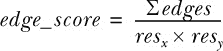

与其他特征一起，这可能有助于确定感兴趣的对象。你可以根据你的用例定义其他基于边缘的特征。例如，你可以在网格中为图像的多个部分计算前面的边缘得分。

##### 高级形状特征

存在更多复杂的特征提取算法，可以用来检测特定的形状和物体。其中之一是*方向梯度直方图*（HOG）。在机器学习中，这些算法可以用来检测图像中的人类面部或特定的动物，例如。

HOG 算法是一系列多步骤的图像处理技术。该算法的目标是在对图像区域中的形状和物体进行描述时，对尺度和小方向变化不太敏感。这是通过以下方式实现的：

1.  计算梯度图像（图像边缘“移动”的方向）

1.  将图像划分为称为*单元格*的小块

1.  计算那些细胞内梯度的方向

1.  计算这些方向在单个细胞中的直方图

通常，较大的图像块是从较小的单元格定义的，并用于单元格中梯度值的归一化。这样，你可以避免对光照或阴影的变化过于敏感。然后，每个单元格可以被展平成一个特征列表，这些特征描述了图像中的形状，并可用于机器学习流程。

通常，你关注的是从实用角度理解算法的有用性，因此你可以继续使用已经实现的 HOG 特征库。scikit-image Python 库提供了一个易于使用的 HOG 版本。以下列表显示了如何计算图像的 HOG 特征。图 7.4 展示了将 HOG 变换应用于美国宇航员 Eileen Collins 照片的结果，她是第一位太空船指挥官女性。

##### 图 7.4\. 应用 HOG 变换。此图像来自 scikit-image 文档中的 HOG 示例页面 ([`scikit-image.org/docs/dev/auto_examples/features_detection/plot_hog.html#sphx-glr-auto-examples-features-detection-plot-hog-py`](http://scikit-image.org/docs/dev/auto_examples/features_detection/plot_hog.html#sphx-glr-auto-examples-features-detection-plot-hog-py))。

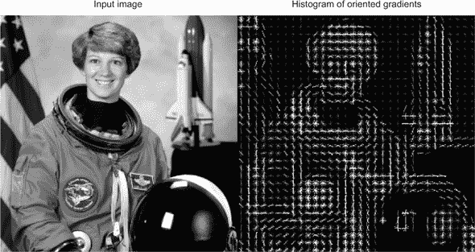

##### 列表 7.3\. 使用 scikit-image 在 Python 中计算方向梯度直方图

```
import skimage

image = skimage.color.rgb2gray(skimage.data.astronaut())
hog = skimage.feature.hog(image, orientations=9, pixels_per_cell=(8,8),
      cells_per_block=(3,3), normalise=True, visualise=True)
```

在这里，你可以看到如何轻松地计算 HOG 特征，同时定义要考虑的方向数量、单元格的像素大小、单元格中块的大小，以及是否对结果进行归一化和可视化。

使用 HOG 特征，你有一个强大的方法在图像中找到物体。就像所有的事情一样，在某些情况下，HOG 并不奏效——例如，当物体显著改变方向时。你应该像往常一样对机器学习系统进行适当的测试，以确定它对当前问题的有用性。

##### 维度降低

在执行特征提取时，我们几乎总是在进行降维的游戏，除了上一节中的内容扩展方法。但有一些技术通常用于一般的降维，其中最广泛使用的是称为*主成分分析*（PCA）。

主成分分析（PCA）允许您从一组图像中找到“典型”图像，这些图像可以用作构建块来表示原始图像。结合前几个主成分可以使您重建大量训练图像，而后续成分将覆盖图像中较少出现的模式。对于新图像的特征是通过找到与主图像的“距离”来生成的，因此每个主图像代表新图像的单个数字。您可以在您的机器学习问题中使用尽可能多的主成分。

主成分分析（PCAs）被认为是线性算法；它们无法表示本质上非线性的数据。PCA 或其他类型的非线性降维方法有几种扩展。我们有过良好经验的例子是*扩散映射*。

##### 自动特征提取

人工神经网络的世界经历了一次复兴。这些网络在 20 世纪 80 年代发明，并受到大脑生物学的启发，曾是人工智能领域（该领域已发展成为我们今天所知的机器学习领域）的中心。几十年来，它们被认为是某些机器学习问题有用的方法。但由于它们难以配置和解释，存在过拟合问题，并且计算扩展性较差，最终成为解决现实世界问题时的一种最后手段。现在，机器学习研究中的几个突破主要解决了这些问题。*深度神经网络*（DNNs）现在被认为是许多机器学习问题的最佳实践，尤其是那些处理图像、视频或声音的问题。图 7.5 显示了神经网络的布局。

##### 图 7.5. 一个简单的人工神经网络。深度神经网络由许多这样的简单网络层组成。（图片来自维基百科。）

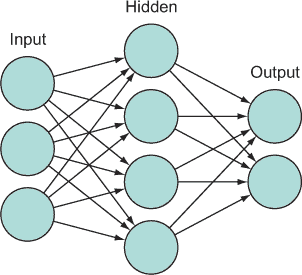

在深度神经网络（DNNs）中，每一层都能够定义一组对当前问题有用的新特征。节点之间的权重定义了这些特征对下一层的重要性，以此类推。这种方法传统上容易过拟合，但最近开发的技术允许以保持准确性的方式移除节点连接，从而降低过拟合的风险。

深度神经网络（DNNs），也称为*深度信念网络*或*深度学习*，仍然是一个相对较新的领域。我们鼓励您关注其发展。

### 7.3. 时间序列特征

许多由现代数据收集系统收集的数据集以*时间序列*的形式出现，这是对过程或一系列过程随时间变化的测量。时间序列数据很有价值，因为它提供了对当前主题随时间变化特性的窗口，并使机器学习从业者能够超越仅使用这些主题的静态快照来做出预测。但完全提取时间序列数据的价值可能很困难。本节描述了两种常见的时间序列数据类型——经典时间序列和点过程（事件数据）——并详细介绍了最广泛使用的时间序列特征。

#### 7.3.1\. 时间序列数据的类型

时间序列数据主要有两种类型：经典时间序列和点过程。*经典时间序列*由随时间进行的数值测量组成。通常，这些测量在时间上是均匀分布的（每小时、每日、每周等），但也可以是不规则采样的数据。以下是一些经典时间序列数据的例子：

+   股票市场的价值，以十亿美元为单位（例如，按小时、每日或每周衡量）

+   商业建筑或住宅的日常能源消耗

+   客户银行账户随时间变化的美元价值

+   在工业制造厂中监控的诊断集（例如，不同部件的物理性能测量或随时间变化的工厂产出测量）

另一方面，*点过程*是随时间发生的事件集合。与在时间上测量数值量不同，点过程由每个离散事件的时间戳组成，加上（可选的）关于事件的元数据，如类别或值。因此，点过程也通常被称为*事件流*。以下是一些点过程的例子：

+   网络用户的活动，衡量每次点击的时间和类型（这通常也称为*点击流数据*）

+   全球地震、飓风、疾病爆发等事件的发生

+   客户在其账户历史中进行的个别购买

+   制造厂中的事件日志，记录每次员工接触系统和每次制造过程步骤完成的时间

一个敏锐的读者可能会注意到，对于某些时间序列，经典时间序列表示和底层点过程之间存在一对一的映射。例如，客户的银行账户可以很容易地看作是账户随时间的变化值（经典时间序列）或一系列个别交易（点过程）。这种对应关系在创建单个数据集上的各种类型的时间序列特征时可能很有用。但转换并不总是可能的。（例如，很难想象与简单网络点击相关的经典时间序列会是什么样子。）

为了使这一点更加具体，让我们看看可以同样容易地被视为点过程或时间序列的时间序列数据。表 7.3 显示了 2003 年至 2014 年间收集的旧金山犯罪数据集的前几行（数据集在[`data.sfgov.org`](https://data.sfgov.org)公开可用）。总的来说，该数据集包括城市中发生的超过 150 万起犯罪事件。对于每起犯罪，数据包括犯罪的确切日期和时间、犯罪类型和地点。

##### 表 7.3\. 旧金山的原始犯罪数据，作为事件序列

| 事件编号 | 日期 | 时间 | 区域 | 类别 |
| --- | --- | --- | --- | --- |
| **80384498** | 04/13/2008 | 00:54 | NORTHERN | 酒精中毒 |
| **80384147** | 04/13/2008 | 00:55 | CENTRAL | 非犯罪 |
| **80384169** | 04/13/2008 | 00:56 | BAYVIEW | 攻击 |
| **80384169** | 04/13/2008 | 00:56 | BAYVIEW | 毒品/麻醉品 |
| **80384153** | 04/13/2008 | 00:57 | BAYVIEW | 其他 |
| **80384175** | 04/13/2008 | 01:00 | CENTRAL | 攻击 |
| **80384943** | 04/13/2008 | 01:00 | CENTRAL | 盗窃/盗窃 |
| **80392532** | 04/13/2008 | 01:00 | INGLESIDE | 盗窃/盗窃 |
| **80384943** | 04/13/2008 | 01:00 | CENTRAL | 诈骗 |
| **80384012** | 04/13/2008 | 01:15 | NORTHERN | 可疑事件 |

你可以通过多种方式将这原始数据聚合为经典的时间序列数据：按年、按月、按星期几等，每个区域或类别可能都有不同的时间序列。列表 7.4 演示了如何将原始事件数据聚合为旧金山每月犯罪数量的时间序列。通过月份整数犯罪计数得到的时间序列在图 7.6 中绘制。数据显示，从 2003 年每月 13,000 起犯罪的比率有显著下降，最近犯罪活动有所上升。

##### 图 7.6\. 旧金山每月犯罪计数的经典时间序列。这些数据是从原始事件数据中处理得到的。对于机器学习建模，你可以从事件数据、经典时间序列或两者中提取特征。

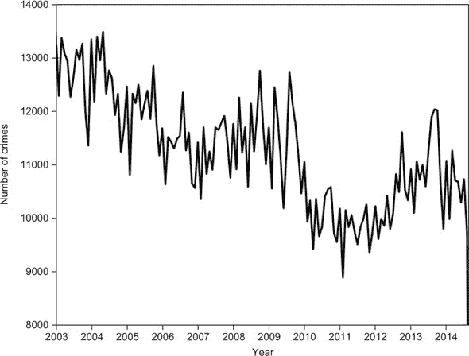

##### 列表 7.4\. 将旧金山犯罪事件数据转换为经典时间序列

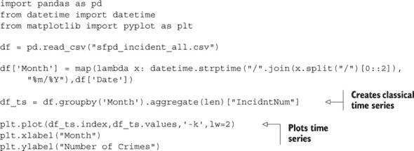

#### 7.3.2\. 时间序列数据预测

正如存在两种常见的时间序列数据类型一样，你也可以从时间序列数据中做出两种常见的预测。第一种是 *时间序列预测*，它试图根据过去的测量值预测时间序列的未来值（或未来事件的时刻）。时间序列预测问题包括以下内容：

+   预测股票明天的价格

+   预测亚利桑那州凤凰城的明天温度

+   预测明年丹麦的能源消耗

+   预测北美下一次主要飓风的日期

这三个任务中的前三个涉及预测经典时间序列的未来值，而第四个是在点过程数据集上的预测。共同点是每个任务都涉及分析单个时间序列的值来预测未来。请注意，关于时间序列预测的大多数文献都属于时间序列分析的分支，而机器学习实践者在这里的关注相对较少（尽管这种情况正在改变）。有关更多详细信息，任何 Google 或 Amazon 搜索都会揭示大量结果！

第二种常见的时间序列预测类型是 *时间序列分类或回归*。这里的目标不是预测单个时间序列的未来值，而是对数百或数千个时间序列进行分类（或预测一个实值输出）。这类问题的例子包括以下内容：

+   使用每个用户的在线点击流来预测每个用户是否会点击特定的广告

+   使用 QA 测量值的时间序列来确定一组制造产品（例如，灯泡）中哪些最有可能在下一个月失效

+   根据用户在注册后第一周内的应用活动流预测每个在线应用的用户的终身价值

+   根据患者的病历预测哪些患者最有可能遭受术后并发症

与时间序列预测不同，机器学习对时间序列分类和回归产生了重大影响。下一节主要关注为分类/回归目的创建时间序列特征，但许多这些方法也可以应用于时间序列预测。

#### 7.3.3\. 经典时间序列特征

本节描述了经典时间序列中最常见的特征工程方法。我们从最简单的时间序列度量开始，并逐步描述更复杂和高级的方法。

##### 简单时间序列特征

这听起来可能有些荒谬，但最简单的时间序列度量可能完全忽略时间轴！在分析测量值的分布时，不考虑时间戳，通常可以提供用于分类、回归或预测的有用信息。为了讨论的目的，我们概述了四个简单（但强大）的度量，这些度量仅涉及时间序列测量值的边缘分布：

+   ***平均—*** 测量值的平均值或中位数可以揭示时间序列平均值的趋势。

+   ***分散—*** 分布的分散度测量，如标准差、中位数绝对偏差或四分位数范围，可以揭示测量值的整体变异趋势。

+   ***异常值—*** 落在典型分布范围之外的时间序列测量值的频率（例如，比平均值大两个、三个或四个标准差），在许多用例中可以携带预测能力，例如预测生产线中断或故障。

+   ***分布—*** 估计时间序列测量值的边缘分布的高阶特征（例如，偏度或峰度），或者更进一步，对命名的分布（例如，正态分布或均匀分布）进行统计检验，在某些情况下可能是预测性的。

您可以通过计算**窗口统计**来使事物更加复杂，这涉及到在指定时间窗口内计算前述汇总指标。例如，仅测量数据的最后一周的平均值或标准差可能具有高度预测性。从那里，您还可以计算**窗口差异**，这将是从一个时间窗口到下一个时间窗口这些指标之间的差异。以下列表展示了计算这些特征的一个代码示例。

##### 列表 7.5\. 窗口统计和差异

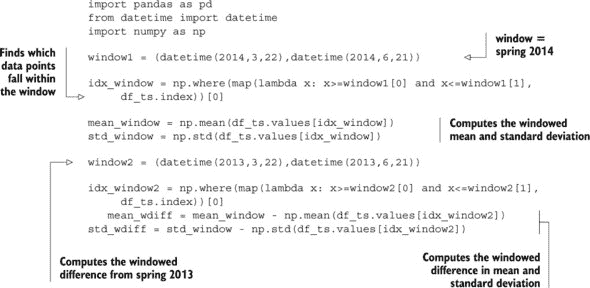

##### 高级时间序列特征

接下来，您将转向更复杂的经典时间序列特征。**自相关**特征衡量时间序列与其**滞后**版本之间的统计相关性。例如，时间序列的一个自相关特征会将原始时间序列与向左移动一个时间间隔的相同时间序列（移除非重叠部分）进行相关性分析。通过以这种方式移动时间序列，您可以捕捉到时间序列中的周期性和其他统计结构的存在。自相关函数的形状（在时间滞后网格上计算的自相关）捕捉了时间序列结构的核心。在 Python 中，`statsmodels`模块包含一个易于使用的自相关函数。图 7.7 展示了自相关是如何计算的，并绘制了 SF 犯罪数据的自相关函数。

##### 图 7.7\. 顶部：原始时间序列与 12 个月滞后时间序列的相关性定义了 12 个月的自相关。底部：SF 犯罪数据的自相关函数。对于短期尺度，自相关较高，表明任何月份的犯罪值对前几个月的值有高度依赖性。

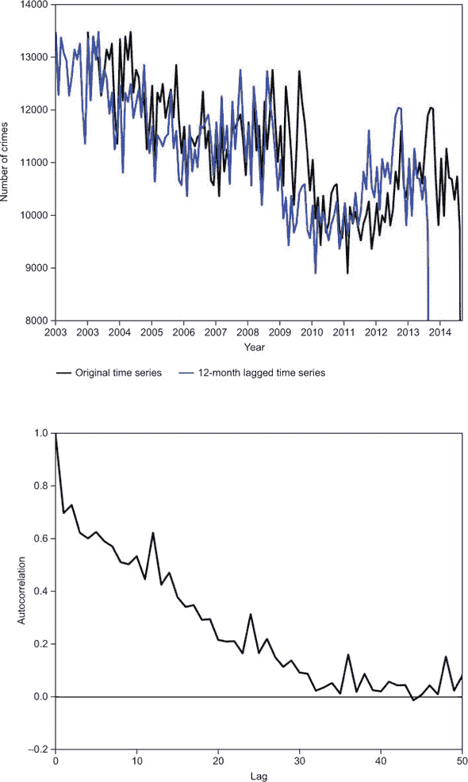

*傅里叶分析*是时间序列特征工程中最常用的工具之一。傅里叶分析的目标是将时间序列分解为一系列频率上的正弦和余弦函数之和，这些频率在许多现实世界的数据集中自然存在。执行这种分解可以使你快速识别时间序列中的周期性结构。傅里叶分解是通过使用离散傅里叶变换来实现的，它计算时间序列的*谱密度*——即它在每个给定频率上与正弦函数的相关程度——作为频率的函数。将时间序列分解为其组成谱密度的结果称为*频谱图*。图 7.8 显示了使用`scipy.signal.periodogram`函数（几个 Python 模块有频谱估计的方法）计算出的旧金山犯罪数据的频谱图。从频谱图中，可以计算各种机器学习特征，如指定频率的谱密度、频率带内谱密度的总和，或最高谱密度的位置（这描述了时间序列振荡的基本频率）。以下列表提供了频谱计算和特征示例代码。

##### 图 7.8. 左：旧金山犯罪数据的频谱图，显示了频率作为函数的谱密度。右：将 x 轴从频率转换为周期的相同频谱图。

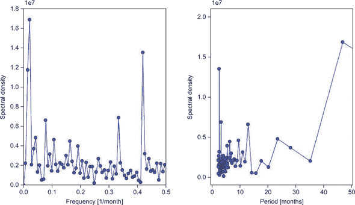

##### 列表 7.6. 频谱特征

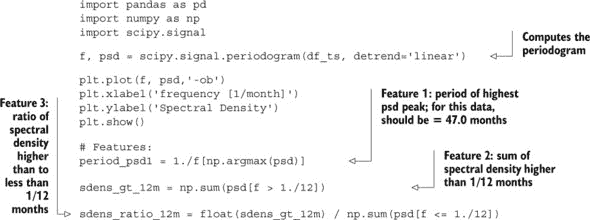

几种经典的时间序列模型在时间序列分析文献中常用。这些模型的目的是将时间序列的每个值描述为时间序列过去值的函数。这些模型本身已经广泛用于数十年的时间序列预测。现在，随着机器学习成为时间序列数据分析的主流，它们通常与更复杂的机器学习模型（如 SVMs、神经网络和随机森林）一起用于预测。时间序列模型的例子包括以下内容：

+   **自回归 (AR) 模型**—时间序列中的每个值被建模为最后*p*个值的线性组合，其中*p*是一个待估计的自由参数。

+   **自回归-移动平均 (ARMA) 模型**—每个值被建模为两个多项式函数的和：AR 模型和一个移动平均（MA）模型，该模型是前*q*个误差项的线性组合。

+   **广义自回归条件异方差 (GARCH) 模型**—一种在金融分析中常用的模型，它使用 ARMA 模型描述时间序列的随机噪声项。

+   **隐马尔可夫模型 (HMM)**—一种概率模型，描述时间序列的观测值是从一系列隐藏状态中抽取的，这些隐藏状态本身遵循马尔可夫过程。

您可以使用这些模型以各种方式计算时间序列特征，包括以下这些：

+   使用每个模型的预测值（以及预测之间的差异）本身作为特征

+   使用模型的最佳拟合参数（例如，ARMA(*p*,*q*)模型中的*p*和*q*的值）作为特征

+   计算模型的统计拟合优度（例如，均方误差）并将其用作特征

通过这种方式，可以实现经典时间序列模型和最先进的机器学习方法的结合。你可以达到两者的最佳效果：如果 ARMA 模型对某个时间序列已经具有高度的预测性，那么使用这些预测的机器学习模型也将是成功的；但如果 ARMA 模型拟合不佳（如大多数实际数据集），机器学习模型提供的灵活性仍然可以产生高度准确的预测。

#### 7.3.4\. 事件流的特征工程

本节简要介绍了事件流的特征工程。正如之前在代码列表 7.4 中所示，事件数据可以转换为经典的时间序列。这使得你可以使用前两节中描述的所有特征工程过程来从点过程数据中提取经典时间序列数据。但由于事件数据的粒度更细，因此可以计算许多额外的特征。

类似于第 7.1.3 节中描述的窗口统计，你可以在事件数据上计算简单的窗口和差异统计。但由于点过程数据允许每个事件都有单独的时间戳，因此你可以在任何你想要的时间窗口上计算这些统计，甚至达到极细的粒度。此外，“自上次事件以来时间”、“过去 48 小时内事件数量”和“事件之间的平均时间长度”等统计信息突然变得可行。

最后，正如经典时间序列通常使用 ARMA 和 HMM 等统计模型进行建模一样，点过程数据通常使用泊松过程和非齐次泊松过程等模型进行描述。简而言之，这些模型将事件到达率描述为时间的函数，并使你能够预测下一次事件发生的预期时间。请随意探索这些方法！就像经典时间序列模型一样，可以从点过程模型中通过三种方式推导出机器学习特征：使用模型的预测、模型的参数以及模型的统计拟合优度。

### 7.4\. 概述

在本章中，你学习了从文本和图像中生成特征的方法。你可以在你的机器学习算法中使用这些特征来构建具有人类水平感知能力的“阅读”或“观察”模型。主要收获如下：

+   对于基于文本的数据集，你需要将可变长度的文档转换为固定长度的特征数量。这些方法包括以下几种：

    +   简单的词袋方法，其中对每个文档中的特定单词进行计数。

    +   tf-idf 算法，它考虑整个语料库中单词的频率，以避免将字典偏向于不重要但常见的单词。

    +   更高级的主题建模算法，如潜在语义分析和潜在狄利克雷分析。

    +   主题建模技术可以将文档描述为一组主题，主题为一组单词。这允许对文档进行复杂的语义理解，并有助于构建高级搜索引擎，例如，除了在机器学习世界中的有用性之外。

    +   你可以使用 scikit-learn 和 Gensim Python 库进行许多有趣的文本提取领域的实验。

+   对于图像，你需要能够用数值特征来表示图像的特征：

    +   你可以通过定义颜色范围和颜色统计来提取图像中关于颜色的信息。

    +   你可以从图像文件本身中提取可能具有价值的图像元数据；例如，通过利用大多数图像文件中可用的 EXIF 元数据。

    +   在某些情况下，你需要能够从图像中提取形状和对象。你可以使用以下方法：

        +   使用 Sobel 或 Canny 边缘检测滤波器进行简单的基于边缘检测的算法

        +   如直方图方向梯度（HOG）等复杂的形状提取算法

        +   如 PCA 之类的降维技术

        +   通过使用深度神经网络进行自动特征提取

+   时间序列数据分为两种类型：经典时间序列和点过程。可以从这些数据中估计出大量的机器学习特征。

    +   在时间序列数据上执行两个主要的机器学习任务：

        +   预测单个时间序列的值

        +   对一组时间序列进行分类

    +   对于经典时间序列，最简单的特征涉及计算时间窗口的汇总统计量和窗口差异。

    +   更复杂的特征涉及使用自相关和傅里叶分析等工具对时间序列进行统计分析。

    +   可以使用各种经典时间序列模型来推导特征。这些包括 AR，ARMA，GARCH 和 HMM。

    +   由于数据的更细粒度，从点过程数据中可以计算所有这些特征以及更多。

    +   点过程数据的常见模型包括泊松过程和非齐次泊松过程。

### 7.5. 本章术语

| 词 | 定义 |
| --- | --- |
| 特征工程 | 将输入数据转换为提取更多价值并提高机器学习模型预测准确性的过程。 |
| 自然语言处理 | 旨在使计算机理解自然语言的领域。 |
| 词袋模型 | 一种将文本转换为数字的方法；计算文档中特定单词出现的次数。 |
| 停用词 | 作为特征不常用但无用的词（例如，“the”，“is”，“and”） |
| sparse data | 当数据主要由 0 组成且数据单元格很少时，我们称数据为稀疏。大多数 NLP 算法产生稀疏数据，你需要使用或转换这些数据以用于你的 ML 算法。 |
| tf-idf | 词频，逆文档频率。一种通过整个语料库中的文本进行归一化的词袋方法。 |
| latent semantic analysis | 一种在文档中寻找感兴趣的主题并将它们与一组单词连接起来的方法。 |
| latent Dirichlet analysis | LSA 思想的扩展，在实际中与许多文本问题表现良好。 |
| content expansion | 将原始内容扩展为更多数据的过程（例如，通过跟随文档中的链接）。 |
| meta-features | 一组不是从内容本身提取，而是从一些相关元数据中提取的特征。 |
| EXIF data | 定义图像元数据的标准。包括有关照片的信息（例如，相机制造商、分辨率、光圈）。 |
| edge detection | 检测图像边缘的过程，以去除大多数图像的噪声。 |
| HOG | 直方图导向梯度。一种理解特定形状和对象图像特征的方法。 |
| PCA | 主成分分析。一种通过更简单、典型的图像来表示图像的方法，从而减少图像的维度数。而不是 100 个像素，一个图像可以通过两个数字来近似：到两个主成分的距离。 |
| deep neural nets | 人工神经网络的扩展，最近在音频视觉数据的机器学习上表现出色。 |
| classical time series | 随时间进行的数值测量序列。 |
| point process | 在时间上收集的事件序列，每个事件都有一个精确的时间戳。 |
| time-series forecasting | 预测单个时间序列的未来值。 |
| periodogram | 时间序列的傅里叶功率谱密度作为振荡频率的函数的图。这项技术可以揭示基本振荡模式，是时间序列数据的有用特征工程工具。 |

## 第八章\. 高级 NLP 示例：电影评论情感

*本章涵盖*

+   使用真实世界数据集预测电影评论的情感

+   探索此数据可能的用例和适当的建模策略

+   使用基本的 NLP 特征构建初始模型并优化参数

+   通过提取更高级的 NLP 特征来提高模型的准确性

+   在生产中使用此模型的扩展和部署方面

在本章中，你将使用在前一章中获得的某些高级特征工程知识来解决一个实际问题。具体来说，你将使用高级文本和 NLP 特征工程过程来构建和优化一个基于用户提交的电影评论的模型。

和往常一样，您将从调查和分析手头的数据集开始，以了解特征和目标列，这样您就可以做出最佳决定，选择使用哪些特征提取和机器学习算法。然后，您将从最简单的特征提取算法开始构建初始模型，看看您如何只用几行代码就能快速得到一个有用的模型。接下来，您将进一步深入研究特征提取和机器学习建模算法的库，以进一步提高模型的准确性。最后，您将探索将模型投入生产的各种部署和可扩展性方面。

### 8.1. 探索数据和用例

在本章中，您将使用来自*Kaggle*竞赛的数据——这是一个数据科学挑战网站，全球的数据科学家在这里解决公司提出的明确问题以赢得奖品。您将使用这些数据，在学习使用前几章开发的工具的同时，通过机器学习解决一个现实世界的问题。

本章中使用的数据来自“单词袋遇见爆米花袋”竞赛([www.kaggle.com/c/word2vec-nlp-tutorial](http://www.kaggle.com/c/word2vec-nlp-tutorial))。您需要在 Kaggle 平台上创建一个账户来下载数据，但这可能是一件好事，因为您可能仍然想在一个大奖竞赛中尝试您新获得的机器学习技能！

在接下来的章节中，我们首先描述数据集，说明各个列的含义以及数据是如何生成的。然后，我们进一步深入，展示数据属性，并对我们拥有的数据进行一些初步观察。从这里，我们头脑风暴可能的用例，这些用例我们可以用手头的数据集来解决，并审查每个潜在用例的数据需求和现实世界影响。最后，我们使用这次讨论来选择一个将在本章剩余部分解决的单一用例。

注意，尽管我们本节的结构是先描述和探索数据，然后找出一个用例来解决问题，但通常步骤是按照相反的顺序进行的。通常，机器学习实践者会从一个用例、假设或要回答的问题集开始，然后寻找并探索数据，以适当地解决手头的问题。这是首选的方法，因为它迫使实践者在深入数据集的细节之前，认真思考用例和所需的数据。尽管如此，接到一个数据集并被要求构建一些酷炫的东西的情况并不少见！

#### 8.1.1. 初步查看数据集

我们的语料库由来自互联网电影数据库（IMDb，[www.imdb.com](http://www.imdb.com)）的书面电影评论组成。训练数据包括 50,000 条评论，选择时确保每部电影在语料库中的评论不超过 30 条。对于每条评论，结果变量被编码为一个二进制特征，如果该评论的手动 IMDb 评分大于 6，则值为 1，如果评分小于 5，则值为 0。介于 5 到 6 之间的中间评分的评论不包括在语料库中。

这个数据集的挑战是设计一个机器学习系统来学习构成正面评论和负面评论的语言模式和结构。关键的是，你需要训练你的模型只从评论的文本中学习，而不是从其他上下文数据中学习，例如电影演员、导演、类型或发行年份。假设这些数据会帮助提高你模型预测的准确性，但在这个数据集中这些数据是不可用的。

除了训练数据集外，还提供了一个包含 25,000 条电影评论的独立测试数据集，这些电影不在训练数据集中。原则上，这组数据可以用来验证你模型的性能，并估计模型在实际部署到现实世界生产环境中的表现。但是 Kaggle 没有提供测试集的标签。因此，你需要通过将 Kaggle 的训练集分成 70%的训练集和 30%的测试集来构建自己的测试集。

注意确保训练集中没有电影出现在测试集中的重要性.^([1]) 例如，如果同一电影的评论同时包含在训练集和测试集中，那么你的模型可能会学习到哪些电影标题是好是坏，而不是专注于构成积极和消极的语言。但在生产中，你将应用这个机器学习模型到新的电影上，这些电影标题是你从未见过的。从训练集到测试集的电影泄露可能会导致你相信你的模型在预测新电影评论的情感时比实际情况更好。因此，我们建议始终使用时间截止点来构建保留测试集，以便测试集包含比训练实例更新的实例。

> ¹
> 
> 在我们的训练集中，我们没有指示每条评论描述的是哪部电影。因此，我们假设训练集是按日期预先排序提供的，并且我们将集合分割，使得同一电影的多个评论在训练集或测试集中聚集在一起。

#### 8.1.2. 检查数据集

这个数据集中的单个评论在长度上有所不同，从一句话到几页的文本。由于评论是从几十位电影评论家那里收集的，因此评论之间的词汇量可能会有很大差异。关键是构建一个机器学习模型，它可以检测和利用正面和负面评论之间的差异，以便它可以准确地预测新评论的情感。

机器学习过程的第一步是查看数据，看看有什么，并开始思考机器学习过程的其他步骤，如模型类型和特征化。为了开始数据审查过程，请查看图 8.1 中的 10 个最短的评论。查看第一行（`id = 10962_3`）。这个特定的评论展示了这个问题有多么微妙：尽管评论明确表示“电影很糟糕”，但它也说有“好的效果”。尽管使用了“好”这个词，但任何人都清楚地同意这是一篇负面电影评论。现在的挑战是教会机器学习模型，即使使用了像“好”这样的积极词汇，短语“电影很糟糕”仍然占上风！

##### 图 8.1. 训练集中的 10 个示例评论，从最短的评论中选择。对于每个评论，你只提供了 ID、二元情感和评论文本。

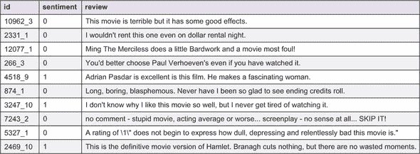

同样，这 10 个样本评论包括几个负面陈述的例子。像“永远不会感到疲倦”和“没有浪费的时刻”这样的短语明显表明了电影的积极品质，即使构成这些短语的单词在本质上都是消极的。这表明，为了在预测情感方面做得好，你必须结合多个（相邻）单词的信息。

翻阅一些其他（较长的）评论，很明显，这些评论通常由冗长、描述性、华丽的语言组成。语言通常是讽刺的、讽刺的、机智的。这使得它成为一个很好的数据集，可以展示机器学习从真实数据中学习细微模式并在不稳定的情况下做出准确预测的能力。

#### 8.1.3. 那么用例有什么用？

经常情况下，(非现实世界)机器学习的实践者在没有深思熟虑他们的机器学习模型的实际用途的情况下就一头扎进了一个问题。这是一个错误，因为用例的选择可以帮助确定你如何构建问题和解决方案，包括以下方面：

+   如何编码目标变量（例如，二元、多类或实值）

+   优化哪个评估标准

+   应考虑哪些学习算法

+   你应该使用和不应该使用哪些数据输入

因此，在你开始机器学习建模之前，你首先需要确定你想要用这个数据集解决哪个现实世界的用例。

对于三个可能的用例中的每一个，你将考虑以下方面：

+   为什么用例会有价值？

+   你需要什么样的训练数据？

+   适当的机器学习建模策略是什么？

+   你应该使用什么评估指标来预测？

+   你拥有的数据是否足够解决这个用例？

根据对这些问题的回答，你将选择一个单一用例，你将在本章的剩余部分解决它。

##### 用例 1：对电影进行排名

对于电影评论数据集的第一个也是最明显的用例是，根据所有评论的文本自动对所有新电影进行排名：

+   *为什么这个用例会有价值？* 这可能是一个决定这个周末要看哪部电影的有力方式。对个别评论进行评分是一回事，但显然更有价值的用例是对每部电影的评论整体积极性进行评分。像 Rotten Tomatoes 这样的网站因其能够可靠地评估每部电影而获得大量流量。

+   *你需要什么样的训练数据？* 基本需求包括评论文本、每个评论的情感指示以及关于每条评论所指电影的了解。有了这三个组成部分，构建一个电影排名系统是可行的。

+   *合适的机器学习建模策略会是什么？* 有几个选择：(a) 你可以将每部电影视为一个机器学习实例，汇总每部电影的个别评论，并将评论情感汇总为平均分数或多类模型。(b) 你可以继续将每条评论视为一个机器学习实例，对每条新评论的积极性进行评分，然后为每部新电影分配其平均积极性分数。我们更喜欢选项 (b)，因为将单一电影的全部评论汇总在一起可能会对机器学习产生一些令人困惑的模式——尤其是如果个别评论高度两极分化！对个别结果进行评分，然后将其平均到“综合评分”中是一个更直接的方法。

+   *你应该使用什么评估指标来预测？* 假设你为每条评论都有一个二元结果变量，并且你的机器学习算法为每条评论分配一个分数，表示其可能是正面评论的可能性，并将其汇总为每部电影的单一分数。你关心的是你的分数与该电影真实平均评分的匹配程度（例如，正面评论的百分比），这可能导致你使用如 R² 这样的指标。但你可以想象使用一个更侧重于排名列表顶部的评估指标。在现实中，你可能对电影排名感兴趣，以便从列表顶部挑选一部电影在本周六观看。因此，你会选择一个侧重于你正确获取排名列表顶部能力的指标。在这种情况下，你会选择一个如小错误正率下的真正正率（例如，5% 或 10%）这样的指标。

+   *你拥有的数据是否足够解决这个用例？* 不幸的是，不是。你拥有所有你需要的东西，除了知道每条评论描述的是哪部电影！

##### 用例 2：对每条评论进行 1 到 10 的评分

第二个可能用例是根据每部电影的用户评论集自动对每个评论进行 1 到 10 级的评分（IMDb 评分）：

+   *为什么这个用例会有价值？* 任何新的评论都可以自动分配一个评分，而无需任何人工阅读或评分。这将减少许多需要用于维护 IMDb 网站 和电影评分的体力劳动；或者，如果用户在他们的评分中提供了分数，它可以根据用户评论的文本提供更客观的评分。

+   *您需要什么样的训练数据？* 只需每个评论的文本和每个评论的分数，从 1 到 10。

+   *合适的机器学习建模策略是什么？* 同样，有两种选择：(a) 将结果变量视为实数值并拟合回归模型。(b) 将结果变量视为分类变量并拟合多类分类模型。在这种情况下，我们更倾向于选择 (a)，因为与分类不同，它考虑了数值尺度上的分数。

+   *您应该使用什么评估指标来评估您的预测？* 如果您选择运行回归模型，典型的回归评估指标，如 R² 或均方误差，是自然的选择。

+   *您拥有的数据是否足够解决这个用例？* 同样，也不够。您只有每个评论的布尔版本（正面与负面），而没有精细的数值分数。

##### 用例 3：区分正面评论和负面评论

需要考虑的最后一个用例是将所有正面评论与其他评论分开：

+   *为什么这个用例会有价值？* 这个用例将代表用例 2 的一个更细粒度的版本，其中每个新的评论可以自动分类为正面或负面（而不是从 1 到 10 进行评分）。这种分类对 IMDb 来说可以用来检测正面评论，然后它可以将其推广到首页或（更好的是）出售给电影制片商，用于电影海报上的引用。

+   *您需要什么样的训练数据？* 只需评论文本和正负二值指示器。

+   *合适的机器学习建模策略是什么？* 您将拟合一个二元分类模型。从那里，您可以为每个新的评论分配一个预测分数，表示它是正面评论的可能性。

+   *您应该使用什么评估指标来评估您的预测？* 这取决于您如何使用您的预测。如果用例是自动提取每周最积极的 10 条评论（例如，用于 IMDb 首页），那么一个好的评估指标将是极低的假阳性率下的真正阳性率（例如，1%）。但如果目标是尝试找到 *所有* 正面评论而忽略负面评论（例如，用于对每条评论进行完整的自动情感标记），那么准确率或曲线下面积（AUC）这样的指标将是合适的。

+   *你拥有的数据是否足够解决这个用例？* 最后，是的！你有一个包含电影评论文本和二元情感变量的训练集。在本章的剩余部分，你将为这个用例构建一个机器学习解决方案。

回顾一下，你首先了解了数据集的基本细节：来自 IMDb 的手写电影评分。然后，你深入探索了一些数据中的模式和趋势。最后，你考虑了可能的机器学习用例。对于每个用例，你探讨了机器学习解决方案对问题的价值、构建机器学习解决方案的基本数据需求以及如何构建解决方案。

接下来，你将构建一个机器学习解决方案来区分正面和负面的电影评论。

### 8.2\. 提取基本 NLP 特征和构建初始模型

由于电影评论数据集仅包含评论文本，你需要使用文本和自然语言特征来构建一个对你的情感模型有意义的数据集。在上一章中，我们介绍了从文本中提取特征的多种方法，我们使用本章来讨论与机器学习和自由文本工作相关的各种实际方面。在这一节中，你将经历的步骤如下：

1.  使用词袋方法从电影评论中提取特征

1.  使用朴素贝叶斯机器学习算法构建初始模型

1.  使用 tf-idf 算法改进你的词袋特征

1.  优化模型参数

#### 8.2.1\. 词袋特征

如您从上一章关于自然语言处理特征的讨论中可能记得，我们最初使用一种简单的技术来对自然语言数据进行特征化：词袋。这种方法分析整个文本语料库，构建一个包含所有单词的词典，并将数据集中的每个实例转换为一个数字列表，统计每个单词在文档中出现的次数。为了刷新您的记忆，让我们回顾一下图 8.2 中的词袋。

##### 图 8.2\. 词袋向量化算法。从一个单词词典中，你可以将任何新的文档（例如图中的文本 1、文本 2）转换为一个数字列表，该列表统计文档中每个单词出现的次数。

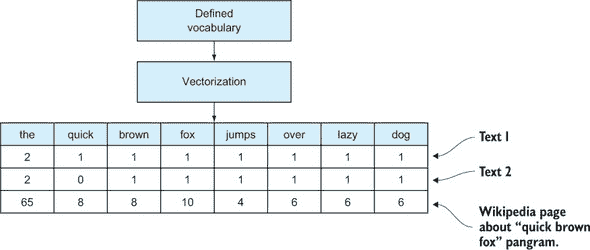

在列表 8.1 中，你加载数据集，创建 70%–30%的训练-测试分割，并使用简单的词频方法提取特征。在这个过程中，一个重要的认识是，你不能用测试集中的单词污染词袋词典。这就是为什么你在构建向量器词典之前将数据集分割成训练集和测试集——为了对模型在之前*未见过*的数据上的准确性进行现实估计。

##### 列表 8.1\. 从电影评论数据集中构建词频特征

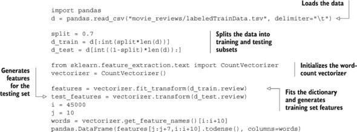

查看在图 8.3 中生成的特征子集。

##### 图 8.3\. 用于构建模型的词频特征的小型 7 × 10 子集视图。完整的数据集是一个大小为 17,500 × 65,005 的稀疏矩阵（训练集中有 17,500 个文档，65,005 个唯一的单词）。当大多数值都是 0 时，稀疏矩阵是有用的，这在大多数基于词袋的特征中都是这种情况；在完整的单词字典中，单个单词不太可能出现在特定的文档中。

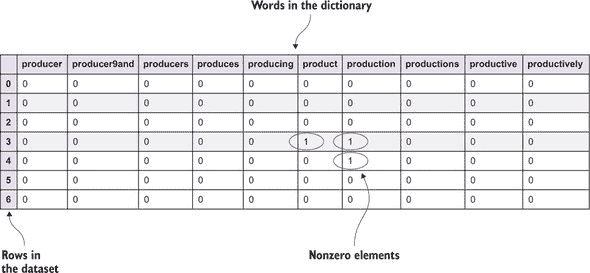

从图 8.3 中可以看出，数据集主要由零组成，只有少数例外。我们称这样的数据集为“稀疏”，这是 NLP 数据集的常见属性。当你想使用数据集作为机器学习模型中的特征时，这会产生影响，我们将在构建实际模型来预测评论情感之前讨论这个问题。

#### 8.2.2\. 使用朴素贝叶斯算法构建模型

现在你已经有一个合适的特征化数据集，你可以像往常一样使用这些特征来构建模型。对于像这样高度稀疏的数据集，一些机器学习算法比其他算法工作得更好。具体来说，一些算法内置了对稀疏数据的支持，这些算法通常在内存使用上，甚至在 CPU 使用和时间上都要高效得多。如果你检查列表 8.1 中生成的特征集，你会发现数据集中只有 0.2%的单元格具有非零元素。使用数据集的密集表示将显著增加内存中数据的大小。

|  |
| --- |

**朴素贝叶斯分类器的基本原理**

基于贝叶斯公式的朴素贝叶斯（NB）分类器算法是一种简单的机器学习算法，它最初是为文本分类而创建的，在机器学习的这个领域中，它仍然可以与更高级的通用算法竞争。这个名字来源于贝叶斯公式应用于数据时，对独立性的假设非常“朴素”。

这种假设通常使得算法对于一般的（密集）问题不太有用，因为特征很少是相互独立的。对于稀疏文本特征，这个假设仍然不成立，但在实践中，这个假设足够准确，使得算法可以出奇地好地工作。朴素贝叶斯分类器是少数几个足够简单，可以在几行中推导出来的机器学习算法之一，我们将在侧边栏中解释一些亮点。

在本章中，我们的目标是通过对实例的特征 x 进行分类，找到评论情感为“差”（k = 0）或“好”（k = 1）的概率 *p*(*C[k]*|*x*)。在概率论中使用贝叶斯公式，这可以写成如下形式：

*p*(*C[k]*|*x*) ~ *p*(*C[k]*)*p*(*x*|*C[k]*)

*p*(*x*|*C[k]*)被称为如果实例属于类别 *C[k]* 的特征的联合概率。由于独立性假设（“朴素”部分），没有交叉特征概率，这变成了每个特征给定类别的概率的乘积：

*p*(*C[k]*|*x*) ~ *p*(*C[k]*)*p*(*x*[1]|*C[k]*)*p*(*x*[2]|*C[k]*)*p*(*x*[3]|*C[k]*)*p*(*x*[4]|*C[k]*)...

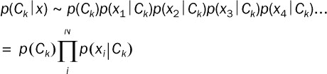

因为 *p*(*C[k]*) 是边缘类别分布——好和坏情感评论的整体分布，你可以很容易地从数据中找到，所以你只需要弄清楚 *p*(*x[i]*|*C[k]*) 是什么。你可以将这个表达式读作“特定类别的特定特征的概率”。例如，你预计在正面情感评论中包含单词 *great* 的概率要高于在负面情感评论中。

你可以想象通过计算每个类别中所有文档中的特征（词）出现次数来从数据中学习这一点。生成这种计数的概率分布称为 *多项式* 分布，*p*(*x[i]*|*C[k]*) 变为

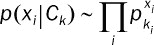

你将这个用于前面的方程，并移动到对数空间以方便计算：

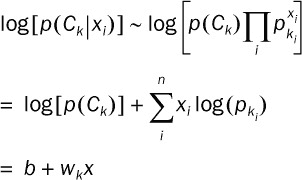

在这里 *b* 是 log[*p*(*C[k]*)]（从数据中得知），*x* 代表你想要预测的实例的特征，而 *w[k]* 是 log(*p[k[i]]*)—一个词在好文档或坏文档中出现的频率，你将在模型构建时学习到。请注意，我们在整个计算中省略了各种常数，当从头开始编写此算法时，需要考虑多个实现细节，但这里概述的基本内容仍然是正确的。

|  |
| --- |

对于具有稀疏自然语言处理（NLP）特征的分类，有一个算法效果很好，那就是朴素贝叶斯算法，特别是多项式（见侧边栏）。在下面的列表中，你将在 列表 8.1 中的特征上构建模型。

##### 列表 8.2\. 使用多项式朴素贝叶斯构建第一个评论情感模型

```
from sklearn.naive_bayes import MultinomialNB

model1 = MultinomialNB()
model1.fit(features, d_train.sentiment)
pred1 = model1.predict_proba(test_features)
```

为了评估模型的性能，你在 列表 8.3 中定义一个函数，并在初始模型预测上调用它。本章中你将报告的准确度指标是通用分类准确率（正确分类的文档比例）、接收者操作特征（ROC）曲线以及相应的曲线下面积（AUC）数值。这些内容都在 第四章 中介绍过，并在我们的大量示例中使用过。

##### 列表 8.3\. 评估初始模型

```
from sklearn.metrics import accuracy_score, roc_auc_score, roc_curve

def performance(y_true, pred, color="g", ann=True):
  acc = accuracy_score(y_true, pred[:,1] > 0.5)
  auc = roc_auc_score(y_true, pred[:,1])
  fpr, tpr, thr = roc_curve(y_true, pred[:,1])
  plot(fpr, tpr, color, linewidth="3")
  xlabel("False positive rate")
  ylabel("True positive rate")
  if ann:
    annotate("Acc: %0.2f" % acc, (0.2,0.7), size=14)
    annotate("AUC: %0.2f" % auc, (0.2,0.6), size=14)

performance(d_test.sentiment, pred1)
```

运行此代码的结果显示在 图 8.4 中。

##### 图 8.4\. 简单词袋模型的分类性能 ROC 曲线。图中的分类准确率——正确分类评论的比例——以及 AUC（ROC 曲线下的面积）指标被打印出来。准确率表明，你预计使用这个模型可以正确分类 88%的评论，但通过使用 ROC 曲线，你可以用假正率（FPR）交换真正正率（TPR），反之亦然。如果有很多评论需要根据这个分类进行人工检查，你可能希望将 FPR 设定在一个较低的水平，这反过来会降低真正正检测率。

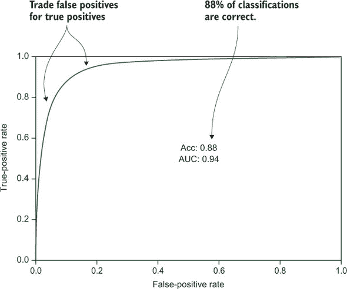

查看图 8.4，你可以看到你的基础模型的表现并不差。你正确分类了 88%的评论，但你可以根据你对更多噪声或更好检测率的偏好，调整假正与真正正的比例。

让我们通过将一些文本通过向量化和模型进行情感预测来尝试几个新的示例评论：

```
>>> review = "I love this movie"
>>> print model1.predict(vectorizer.transform([review]))[0]
1
```

正面情绪表示为 1，所以这听起来很正确。让我们再试一个：

```
>>> review = "This movie is bad"
>>> print model1.predict(vectorizer.transform([review]))[0]
0
```

负面情绪表示为 0，所以这确实是对的。好的，让我们尝试欺骗模型：

```
>>> review = "I was going to say something awesome, but I simply can't because the movie is so bad."
>>> print model1.predict(vectorizer.transform([review]))[0]
0
```

没有成功，预测仍然是正确的。也许如果你在负面评论中引入更多的正面词汇？

```
>>> review = "I was going to say something awesome or great or good, but I simply can't because the movie is so bad."
>>> print model1.predict(vectorizer.transform([review]))[0]
0
```

没错，这是一个聪明的模型。单词*bad*对分类有很强的影响，所以你可能可以通过在正面评论中使用这个词来欺骗模型：

```
>>> review = "It might have bad actors, but everything else is good."
>>> print model1.predict(vectorizer.transform([review]))[0]
0
```

最后，你成功地在某种程度上欺骗了模型。这个小练习很有趣，但也展示了模型在理解电影评论领域任意自然语言方面的力量。在下一节中，你将通过比我们简单的词频特征更进一步，并找到特征和建模算法参数的更好值来尝试改进初始模型。

#### 8.2.3\. 使用 tf-idf 算法对词袋特征进行归一化

在上一章中，我们介绍了 tf-idf 作为简单词频特征的升级。本质上，tf-idf 根据每个单词在文档中出现的频率对词频进行归一化。主要思想是，常见单词获得较小的权重因子，而相对罕见的单词获得较大的权重因子，这使你能够深入挖掘（通常是高度信息丰富的）在数据集中出现频率较低的单词。

在本节中，你将使用 tf-idf 作为你的特征来查看你是否可以获得额外的准确性。使用 scikit-learn 进行更改很容易，因为你只需要将你的`CountVectorizer`替换为`TfidfVectorizer`。代码将在下一列表中展示。

##### 列表 8.4\. 在模型中使用 tf-idf 特征

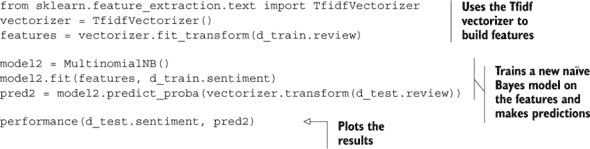

tf-idf 模型的性能在图 8.5 中显示。你可以看到 tf-idf 特征如何略微提高了模型准确度。具体来说，ROC 曲线显示它应该更好地避免误报。想象一下，你有很多评论进来，但想标记出需要人类检查的不良评论。更低的误报率将向审阅者展示更少的实际上是正面的评论，这样他们可以更快地处理队列。

##### 图 8.5\. 在之前的词袋模型之上 tf-idf 模型的 ROC 曲线。你可以看到分类准确性和 AUC（ROC 曲线下的面积）都有轻微的提高。tf-idf 模型曲线特别显示了在低 FPR 范围内的改进；对于相同数量的正确分类评论，模型将产生更少的误报。如果人类在分类审查循环中，你将需要筛选的噪声会更少。


我们的两个 tf-idf NLP 特征提取算法和朴素贝叶斯建模算法都有可以调整以调整算法以适应数据集特定细节的旋钮。我们称这些旋钮为*超参数*。这源于模型变量（特征）也可以被视为参数，而算法参数则工作在更高的层次。在你接受模型性能之前，尝试这些参数的不同值是非常重要的，这也是下一节的主题。

#### 8.2.4\. 优化模型参数

找到模型最佳参数的最简单方法就是尝试构建具有不同参数的一组模型，并查看感兴趣的指标。问题是你不能假设参数之间是独立的——改变一个参数可能会影响另一个参数的最佳值。这可以通过为任何参数组合构建模型的方式来解决。但如果有很多参数，这很快就会变得难以处理，尤其是如果构建模型本身就需要花费一些时间。我们在第四章中讨论了一些解决方案，但你可能会惊讶地发现，ML 从业者仍然经常依赖于这种方法。你需要培养对哪些参数可能更独立以及哪些参数对哪种类型的数据集影响最大的直觉。对于这个练习，你有三个参数需要优化：两个 tf-idf 参数（`max_features`，`min_df`）和一个朴素贝叶斯参数（`nb_alpha`）。

你首先需要的是一个你可以反复调用来构建模型并返回参数和感兴趣指标（在这种情况下，是 AUC）的函数。下面的列表定义了这个函数。

##### 列表 8.5\. 用于参数优化的模型构建方法

```
def build_model(max_features=None, min_df=1, nb_alpha=1.0):
  vectorizer = TfidfVectorizer(max_features=max_features, min_df=min_df)
  features = vectorizer.fit_transform(d_train.review)
  model = MultinomialNB(alpha=nb_alpha)
  model.fit(features, d_train.sentiment)
  pred = model.predict_proba(vectorizer.transform(d_test.review))
  return {
    "max_features": max_features,
    "min_df": min_df,
    "nb_alpha": nb_alpha,
    "auc": roc_auc_score(d_test.sentiment, pred[:,1])
  }
```

使用在列表 8.5 中定义的可重复模型构建函数，你可以通过定义参数的可能值（随机选择或凭直觉选择）并运行循环来运行你的优化管道。这将在下一个列表中完成。

##### 列表 8.6\. 参数优化循环

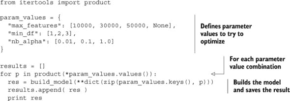

你要优化的参数如下：

+   *`max_features`*—tf-idf 算法要创建的最大词列数。从数据中可以看出，所有词加起来大约有 65,000 列，所以你尝试在类似大小的范围内尝试一些数值。`None`指定使用所有词。

+   *`min_df`*—一个词必须出现在数据集中多少次才能被包含在特征中。这是一个潜在的参数依赖性的例子，因为通过改变`min_df`，字典中的词数（以及`max_features`）可能会改变。

+   *`nb_alpha`*—朴素贝叶斯分类器的 alpha（平滑）参数。这是你可以调整的特定 ML 算法的唯一参数。这里要选择的值需要更多研究参数的含义以及其他人如何在其他情况下使用它。

关于列表 8.6 中的代码的最后一点是使用来自`itertools`模块的`product`函数——一组 Python 函数，使处理数据更加容易。这个函数是一种巧妙的方法来生成一组列表的所有组合（笛卡尔积）。列表 8.6 中代码运行的结果显示在图 8.6 中。

##### 图 8.6\. 参数优化循环的一些结果子集。第 27 次迭代的参数组合总体上产生了最佳模型。

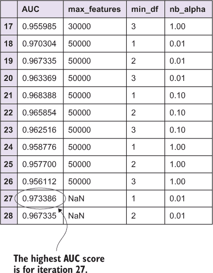

图 8.6 显示了某些优化运行的结果。你只有三个参数，36 种可能的值组合，所以这没有超过 10 分钟，因为朴素贝叶斯训练时间相对较低，但你很容易想象想要尝试更多参数的更多值，优化将需要很长时间。找到最佳参数的另一个技巧是，从广泛的值开始，然后在随后的优化运行中更深入地探索最佳值范围。从表中可以看出，不同的参数似乎提高了模型的 AUC。第 27 次迭代使用这些值取得了最佳结果：

+   *`max_features`*—None（所有词，默认）

+   *`min_df`*—1（默认）

+   *`nb_alpha`*—0.01

因此，有趣的是，你通过找到朴素贝叶斯算法的 alpha 参数的更好值，成功地显著提高了模型性能。让我们看看当改变每个参数（固定其他参数在其最优值）时 AUC 的变化情况（图 8.7）。

##### 图 8.7. 通过改变特征和 ML 算法的三个参数带来的 AUC 改进。您可以看到：(a)更高的`max_features`给出了更好的 AUC，(b)更低的`min_df`给出了更好的 AUC，(c)更低的 alpha 给出了更好的 AUC。这并不意味着每个参数的最佳值必然会产生最佳的组合。我们优化运行中最佳组合参数是`max_features=None`（所有单词，默认值），`min_df=1`（最小值，默认值），`alpha=0.01`（改进的主要原因）。最佳 AUC 是 0.974。所有显示的图表都可以使用附带的 Python 笔记本中的代码重新生成。

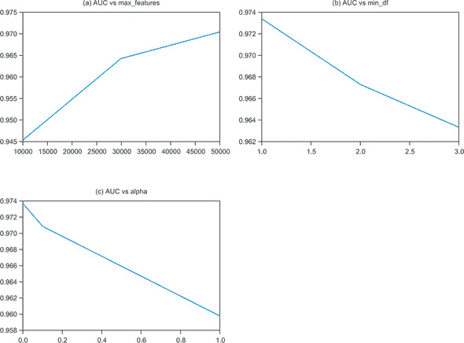

这些图表只是 AUC 演变的单一视角，因为您需要一个四维图表来将 AUC 作为所有参数的函数来绘制。但仍然很有趣地看到模型对每个值的变化的响应。例如，特征数量越多，效果越好（赢得了最大可能值）。`min_df`的数量越小，效果越好（赢得了最小可能值）。然后，`nb_alpha`越小，效果越好。因为这一项没有理论上的下限，这应该会促使您在另一次运行中尝试更低的值。我们将这留作您的练习（但根据经验，我们并没有找到更好的值）。

优化模型的 ROC 曲线与先前模型一起绘制在图 8.8 中。您可以看到模型性能在两个指标和 ROC 曲线的所有点上都有显著提高。这是一个很好的例子，说明调整模型超参数以获得额外的预测能力是有益的。最后要注意的一点是：当然，您可以想象新的模型参数选择可能会反过来影响哪些特征和建模算法（例如，词频与 tf-idf）将表现最好，每种算法都可能有一组新的参数需要优化。为了完全严谨，您需要优化所有算法及其参数的选择，但对于大多数现实世界问题来说这是不可行的，这里的权衡是在里程碑中完成优化。例如，首先确定要使用的 NLP 算法，然后是 ML 模型，然后优化这些参数。您的项目可能需要不同的里程碑——再次强调，您将在构建连续的 ML 模型的过程中对这些事情产生直觉。

##### 图 8.8. 优化模型与先前模型的 ROC 曲线。在我们的测试集评估中，这个模型似乎在所有曲线上都表现得更好，预期准确率显著提高。

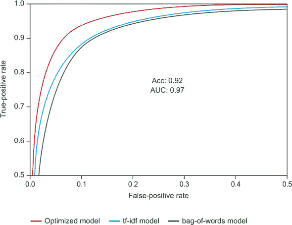

图 8.8 中的 ROC 曲线总结了我们的初步建模实验。仅从基本算法和少量代码中，你就成功地构建了一个在自然语言数据上具有相当高准确性的模型。在下一节中，你将在特征工程和建模工作中更进一步，并了解将此类模型部署到实际生产就绪系统中的各个方面。

### 8.3. 高级算法和模型部署考虑因素

在上一节中，我们关注的是使用相对简单的特征和机器学习算法构建模型。该节中任何模型的准确性可能已经足够满足我们的需求。你可以尝试下一个优化模型的想法，但时间和模型准确度增量改进带来的潜在价值之间总是存在权衡。我们鼓励你掌握每个百分比改进的价值，例如，以节省人工审查时间的形式，以及你愿意前期投入多少。正如你所见，我们的第一个模型在许多情况下确实能够理解审查情感，并且可能一开始就是一个足够好的模型。通常，将略微低精度的模型投入生产并获得系统的实时反馈更有价值。

遵循上述建议后，让我们反其道而行之，尝试进一步优化这个模型。接下来，你将研究从谷歌最初开发的新自然语言建模技术中生成特征：*word2vec*。在提取 word2vec 特征后，你将切换到随机森林算法以更好地支持新特征。

#### 8.3.1. Word2vec 特征

谷歌通过 word2vec 项目引入了一种相对较新的自然语言处理方法。word2vec 模型本身就是一个使用深度神经网络构建的机器学习模型，深度神经网络是机器学习的一个分支，最近在自然语言、语音和图像等与人类相关的领域产生了最先进的结果。

要在训练集上构建 word2vec 模型，你将使用 Python 的 Gensim NLP 库，该库内置了一个很好的 word2vec 实现。你之前在第七章中使用 Gensim 处理 LDA，另一个类似于 word2vec 的主题模型。

在 Gensim 中，您需要做一些额外的工作来准备您的文档以进行建模，因为 Gensim 算法在句子（已经分割成单词的列表）上工作，而不是任意文档。这可能会在前期增加工作量，但它也使您更好地了解模型中包含的内容。在列表 8.7 中，您将构建一个简单的标记化函数，该函数删除停用词和标点符号，并将所有单词转换为小写。请注意，这都是在 scikit-learn 词向量器中自动完成的；我们可以使用相同的功能或类似的功能从 NLTK Python NLP 工具包中，但我们选择在这里自己编写它，以教育目的。

##### 列表 8.7\. 文档标记化

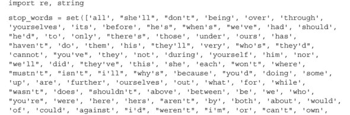

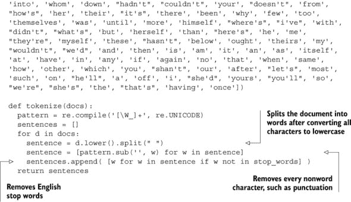

从这个函数中，您可以标记化任何文档列表，并且现在您可以继续构建您的第一个 word2vec 模型。有关算法参数的更多信息，请参阅 Gensim 文档.^([2])

> ²
> 
> [`radimrehurek.com/gensim/models/word2vec.html`](https://radimrehurek.com/gensim/models/word2vec.html)

##### 列表 8.8\. Word2vec 模型

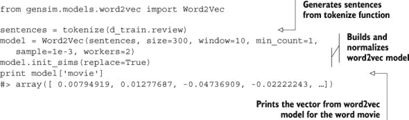

您可以看到单个单词是如何表示为一个向量（在这个例子中是 300 个数字）。为了使用 word2vec 模型为您的人工智能算法生成特征，您需要将您的评论转换为特征向量。您知道如何将单个单词表示为向量，因此一个简单的方法是将评论文档（单词列表）表示为文档中所有单词的平均向量。在下一个列表中，您将构建一个函数来完成这项工作。

##### 列表 8.9\. Word2vec 特征化

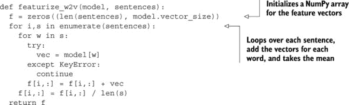

您现在可以构建一个基于您新生成的 word2vec 特征的模型。如您从我们的机器学习算法讨论中回忆起第 8.2.2 节，朴素贝叶斯分类器在稀疏数据上表现良好，但在密集数据上表现不佳。word2vec 特征确实将您的文档从 65,000 个稀疏词频特征转换为仅几百个密集特征。深度学习模型已经学习了模型的高级主题(列表 8.8)，每个文档都可以表示为主题的组合(列表 8.9)。

#### 8.3.2\. 随机森林模型

在上一节中引入的多项式朴素贝叶斯算法与新的 word2vec 特征不兼容，因为它们不能被认为是多项式分布生成的。您可以使用其他分布继续使用朴素贝叶斯算法，但您将依赖我们的一位老朋友：随机森林算法。在下面的列表中，您将在 word2vec 特征上构建一个 100 棵树的随机森林模型，并像往常一样在测试集上分析性能。

##### 列表 8.10\. 在 word2vec 特征上构建随机森林模型

```
features_w2v = featurize_w2v(model, sentences)

model4 = RandomForestClassifier(n_estimators=100, n_jobs=-1)
model4.fit(features_w2v, d_train.sentiment)

test_sentences = tokenize(d_test.review)
test_features_w2v = featurize_w2v(model, test_sentences)
pred4 = model4.predict_proba(test_features_w2v)
performance(d_test.sentiment, pred4, color="c")
```

在图 8.9 中比较了 word2vec 随机森林模型与您之前模型的性能。您可以看到，您的新模型确实在您选择的评估指标和 ROC 曲线的所有点上提高了模型精度。

##### 图 8.9。word2vec 模型及其之前模型的 ROC 曲线。您可以看到 ROC 曲线的所有值都有所改进，这也反映在增加的准确性和 AUC 数值上。

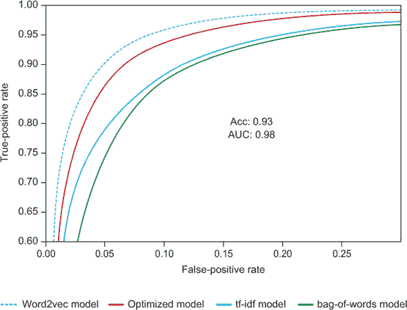

在图 8.9 中展示了您的最终模型后，您对性能感到满意，现在将停止优化工作。您还可以尝试更多的事情来进一步提高准确率。很可能是，即使是人类也无法正确分类所有评论的情感；可能存在一些错误的标签，或者有些评论的情感不容易理解。

但这个模型可能比您迄今为止所取得的成果要好得多。我们将给您，亲爱的读者，一个初步的清单，其中列出了我们打算尝试的一些事情，按照优先级的大致顺序：

+   *使用未标记的数据构建更好的主题模型*。Kaggle 竞赛网站的数据部分包含一组未标记的评论，您可以使用这些评论进行训练。因为您正在构建一个监督模型，它们最初看起来似乎没有用。但是，因为您正在构建一个需要学习 IMDb 电影评论世界细微差别（尤其是不同单词和概念之间的联系）的 word2vec 模型，所以使用这些数据来改进您将要进入训练集特征（带有标签的那个）的 word2vec 模型将是有益的。

+   *优化参数*。您在找到模型超参数的更好值之后，在本章的初始模型中看到了模型性能的显著提升。我们随后引入了一个新的 NLP 模型（word2vec）和 ML 算法（随机森林），因此有许多新的参数需要优化。

+   *检测短语*。Gensim 库包括在文本中检测短语的支持，例如“纽约市”，这在我们的“dump”仅单词标记化函数中可能会被遗漏。英语语言往往包含多词概念，所以这可能是您句子生成函数中一个有趣的东西。

+   *处理多种语言。* 如果你对所有评论是否都使用单一语言（在这种情况下，英语）不确定，你将不得不在建模流程的各个地方处理多种语言。首先，你需要知道评论使用的是哪种语言，或者你需要检测语言（有几种质量各异的库可用）。然后，你需要在分词过程中使用这些信息，以使用不同的停用词和，可能的话，不同的标点符号。如果你真的很不幸，甚至可能不得不处理完全不同的句子结构，例如中文文本，在这种情况下，当存在空白时不能简单地分割单词。

现在，假设你对当前的模型感到满意。如果这是一个现实世界的用例，你将希望将模型投入生产。然后，根据具体用例，你应该考虑以下一些方面：

+   *你有多少训练数据，更多的训练数据是否会使模型变得更好？* 这可能会影响机器学习算法的选择，因为你需要选择一个能够随着更多训练数据而良好扩展的模型。例如，朴素贝叶斯分类器支持部分训练，也称为在线学习，而随机森林算法可能难以扩展到更大的数据集。

+   *预测量有多大，是否需要实时交付？* 我们将在下一章中详细讨论如何通过规模和速度来扩展预测，但关键是要认识到这可能会对算法的选择和部署的基础设施产生影响。

### 8.4. 摘要

在本章中，你学习了如何在真实机器学习用例中从头到尾进行操作，以及自然语言处理和优化模型参数的基础知识。本章的关键要点包括以下内容：

+   专注于正确的问题是至关重要的。你应该始终针对每个可能的用例问自己，“解决这个问题的价值是什么？”

+   对于每个用例，你需要检查数据，并系统地确定数据是否足以解决手头的问题。

+   在可能的情况下，始终从简单的现成算法开始，以构建初始模型。在我们的例子中，我们以几乎 90%的准确率预测了评论的情感。

+   通过测试和评估替代模型和模型参数的组合，可以提高准确性。

+   在不同的模型参数和评估标准之间，常常需要做出权衡。我们研究了电影评论中错误接受率和错误拒绝率之间的权衡是如何通过模型的 ROC 曲线来表示的。

+   如 word2vec 之类的最先进的自然语言和机器学习建模技术是高级特征工程如何帮助你改进模型的例子。

+   你选择的算法可能取决于除了模型准确性之外的其他因素，例如训练时间和需要整合新数据或进行近实时预测的需求。

+   在现实世界中，模型总是可以改进的。

### 8.5\. 本章术语

| Word | 定义 |
| --- | --- |
| word2vec | 一种自然语言处理建模框架，最初由谷歌发布，并被用于许多涉及自然语言的先进机器学习系统中 |
| hyperparameter optimization | 选择控制机器学习算法执行以最大化其性能的参数的各种技术 |

## 第九章\. 扩展机器学习工作流程

*本章涵盖*

+   确定何时扩展工作流程以提高模型准确性和预测吞吐量

+   避免在复杂的扩展策略和重型基础设施上进行不必要的投资

+   将线性机器学习算法扩展到大量训练数据的方法

+   扩展非线性机器学习算法的方法——通常是一个更大的挑战

+   降低预测延迟并提高预测吞吐量

在现实世界的机器学习应用中，可扩展性通常是一个主要关注点。许多基于机器学习的系统需要快速处理新数据并生成预测，因为预测在几毫秒后就会变得无用（例如，考虑实时应用，如股市或点击流数据）。另一方面，其他机器学习应用需要在模型训练期间进行扩展，以便在千兆或太字节的数据上学习（考虑从互联网规模的图像语料库中学习模型）。

在前面的章节中，你主要处理的是足够小，可以单机拟合、处理和建模的数据。对于许多现实世界的问题，这可能足以解决当前的问题，但许多应用需要扩展到多台机器，有时甚至需要扩展到云中的数百台机器。本章是关于决定扩展策略并了解涉及的技术。

在本章的第一部分，我们介绍了面对大数据集或高量预测需求时需要考虑的各种维度。我们展示了你可以避免在完全可扩展的方法上投入大量时间和资源的方法，以及如果无法避免这种情况需要考虑的一些技术。下一节将更深入地探讨扩展机器学习工作流程的过程，以便在大型数据集上训练模型。最后，我们将关注扩展预测工作流程以处理大量数据或降低延迟。

在下一章中，你将能够使用本章中学到的所有知识来解决一个现实世界的海量数据示例，所以请耐心等待，当你完成本章的基础知识后。

### 9.1\. 扩展前的准备

对于任何给定问题所需的可扩展性类型最终取决于用例和存在的计算约束。本节首先描述在现代机器学习应用中通常所需的可扩展性类型。你将逐步了解需要考虑的各种维度，并确定哪些可能是你 ML 代码的瓶颈。在你确定了所需的可扩展性类型之后，你将了解确保你的 ML 应用能够处理现实世界的数据速率和体积的标准技术。

我们不直接深入到具体的方法来扩展 ML 应用，而是从高层次概述开始。以我们的 ML 工作流程为指导，让我们从 ML 可扩展性的系统视角开始。

#### 9.1.1\. 识别重要维度

让我们首先将我们的机器学习工作流程分解为两个主要流程：模型训练和模型预测。对于这两个系统，资源约束如何影响工作流程，以及它们如何抑制或破坏系统？考虑表 9.1。

##### 表 9.1\. 由于缺乏可扩展性可能发生的模型构建问题，以及它们的最终后果

| 可扩展性问题 | 后果 |
| --- | --- |
| 训练数据集太大，无法拟合模型。 | 没有模型被拟合，因此无法进行预测。 |
| 训练数据集太大，模型拟合速度慢。 | 模型优化不可行（或实际不可行），因此使用次优模型，牺牲了准确性。 |

在模型构建过程中，你将面临的可扩展性问题源于大规模的训练集。在一种极端情况下，如果你的训练数据集如此之大以至于你甚至无法拟合一个模型（例如，数据无法适应内存），那么这是一个你必须找到解决方案的问题。你可以选择以下三种方法：（1）找到可以学习的小数据子集，（2）使用具有更多 RAM 的机器，或者（3）使用更内存高效的算法。

在稍后，我们将描述几种快速减少数据集大小的方法，而不会显著影响模型质量。接着，我们将讨论如何通过可扩展的数据系统来扩展计算周期以适应你的问题。在本章的后面部分，我们将介绍可扩展的学习算法，这些算法可以让你在不依赖捷径或额外硬件的情况下将 ML 扩展到你的数据。

对于稍微小一些的数据集，可能只能拟合相对简单的模型（如线性/逻辑回归），而不是更复杂的模型（如提升），因为后者有额外的计算复杂性和内存占用。在这种情况下，你可能通过不拟合更复杂的学习算法而牺牲了准确性，但至少你能够拟合一个模型。在这种情况下，之前提出的相同选项是可行的尝试方法。

在相关场景中，你的训练数据集的巨大规模可能导致模型拟合，进而导致模型优化变慢。与前面的场景一样，这可能导致你使用一个不太准确的模型，因为你被迫采用粗略的调整参数优化策略，或者完全放弃调整。但与前面情况不同，这种困境可以通过启动更多节点（横向扩展）并在不同机器上（使用不同的调整参数选择）拟合模型来解决。我们将在 9.1.3 节中更多地讨论横向扩展。

在预测工作流程中，你面临的扩展性问题源于非常快速到来的数据、CPU 密集型的预测或特征工程过程，或者非常大的预测数据批量。考虑表 9.2。

##### 表 9.2\. 由于缺乏可扩展性可能导致机器学习预测中出现的问题，以及它们的最终后果

| 扩展性问题 | 后果 |
| --- | --- |
| 数据速率（流式）对于机器学习系统来说太快了。 | 预测所需的数据积压不断增长，最终导致崩溃。 |
| 特征工程代码和/或预测过程太慢，无法生成及时的预测。 | 预测的潜在价值丢失，尤其是在实时用例中。 |
| 数据大小（批量）太大，无法用模型处理。 | 预测系统崩溃，无法进行预测。 |

幸运的是，这三个挑战都可以通过相同的策略来解决：增加更多的机器。与模型训练相比，预测的优势在于在绝大多数用例中，预测可以独立地对每个数据实例进行。为了生成预测，在任何时候你只需要在内存中保留单个实例的特征（以及你构建的机器学习模型）。将这种情况与模型训练进行对比：通常，整个训练集需要被加载到内存中。因此，与模型训练期间的扩展性问题不同，预测的扩展性问题不需要更大的机器；只需要更多的机器——当然，还需要一个高效的数据管理系统来控制它们（关于这一点稍后还会详细介绍）。

> ¹
> 
> 注意，在少数机器学习用例中，预测不能独立地对单独的实例进行。例如，一个时间序列预测模型，如金融或气候模型，可能依赖于多个时间戳的预测来生成单个预测。

无论你需要更快地生成预测、处理更高容量的实例，还是处理缓慢的特征工程或预测过程，解决方案都是启动更多机器，并将不同子集的实例发送到每个节点进行处理。然后，假设拟合的模型分布在所有节点上，你可以在所有机器上并行生成预测，并将它们返回到中央数据库。

在第 9.3 节中，你将深入探讨预测系统。在那里，你将探索一些构建快速且可扩展的机器学习预测计算系统的方法。

#### 9.1.2\. 用子采样代替扩展？

在某些情况下，使用整个训练集和可用的 CPU 资源进行模型训练可能不可行。如果你面临这个挑战，且没有其他可行的选择，那么作为最后的手段，你可以在模型构建之前考虑对训练数据进行子采样。

虽然我们通常不鼓励对数据进行子采样（你可能会丢失重要的信号），但某些丢弃数据的方法比其他方法更好。在某些情况下，这些方法甚至可能改善你的模型，这取决于手头的机器学习算法。你可以通过两种方式丢弃数据：丢弃特征或丢弃实例。对于每种选项，我们将描述一种统计上严格的方法来减少你的训练数据量。

##### 特征选择

通常，数据集的广泛性会形成计算瓶颈。例如，在基因组数据中，一个训练集可能包含数百万个基因（特征）的数据，但只有数百个患者（实例）。同样，对于文本分析，将数据特征化为 n-gram 可能会导致包含数百万个特征的训练集。在这些情况下，你可以通过首先在称为*特征选择*的过程中消除不重要的特征来使你的模型训练可扩展。图 9.1 展示了特征选择是如何工作的示意图。

##### 图 9.1\. 使用 Lasso 降低大型数据集的维度以训练机器学习模型

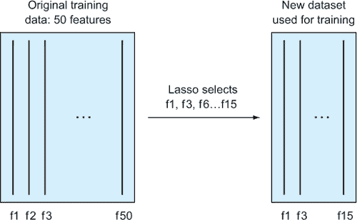

正如我们在第四章和第五章中讨论的那样，特征选择在某些情况下可以导致更好的模型。通过智能地去除特征，你可以让学习算法专注于重要的信号，而不会被那些无关的特征所分散。特征选择的实际损失或收益取决于所选的机器学习模型以及由于你丢弃数据而无意中丢失的信息量，因此你应该始终通过适当验证你的模型来测试你的更改。在本节中，我们主要讨论特征选择作为处理大型数据集的一种方式。

对于大规模的训练集，我们推荐的特征选择方法是*Lasso*。Lasso 是一种高效的线性学习算法，它自动搜索最具预测力的特征子集。计算整个算法的迹是高效的，使用户能够洞察所有特征在线性模型中预测力方面的整个排序。此外，根据线性模型预测，还提供了最佳特征子集。

如果你非常幸运（或不幸运）拥有如此大的数据集，以至于你甚至无法拟合 Lasso 模型，你可以考虑将 Lasso 拟合到训练集中实例的子集（并且可能跨算法运行的平均值）。这可以给你一个很好的感觉，了解哪些特征可以从模型中移除，而不会降低你的机器学习算法的统计性能。

Lasso 特征选择的明显缺点是它使用线性模型来衡量每个特征的重要性。通过 Lasso 选出的特征确实可能与目标变量有非线性关系，这可能无法被 Lasso 适当地捕捉。作为替代，存在非参数特征选择方法，如随机森林特征重要性，但这些方法通常无法扩展到大型数据集。

##### 实例聚类

如果在特征选择后，你的训练数据仍然太大，无法拟合模型，你可以考虑子选择实例。作为最后的绝对方法，你可以使用统计聚类算法来识别并删除训练实例中的冗余。

对于这种数据缩减，我们建议使用聚集层次聚类算法。这种方法将以每个训练集实例作为其自己聚类的唯一成员开始。然后，将最近的两个聚类随后合并（使用预定义的距离度量来确定“接近度”）。这种邻近聚类的合并会一直持续到达到停止标准（例如，聚类数量）为止。我们建议尽可能早地停止这个过程，以免过于大幅度地减少数据的信息内容。最终的缩减训练集由每个结果聚类的单个实例组成。

#### 9.1.3. 可扩展的数据管理系统

无论你打算采取何种策略来扩展你的机器学习工作流程，你首先需要能够处理数据。在过去十年中，我们对所谓的*大数据*技术给予了极大的关注。在这本书中，我们使用“大数据”一词来指代任何在合理时间内无法由单个机器处理的数据。在这里，我们介绍了一些最成功的的大数据项目以及它们如何在机器学习框架中使用。

现代大数据系统中的基本原则是，你需要通过增加更多机器来处理更多的数据。这被称为*水平扩展性*。相比之下，处理更大资源需求的其他方法是*垂直扩展性*，即通过增加磁盘、内存或 CPU 核心来升级你拥有的少量机器。图 9.2 比较了水平和垂直扩展性。

##### 图 9.2\. 大数据系统的水平与垂直可扩展性。在水平系统中，你向你的基础设施添加新的节点（机器）来处理更多的数据或计算，因为负载在节点之间相对均匀地分布。Apache Hadoop 就是这样一个系统的例子。在垂直扩展系统中，你向现有的机器添加更多资源以处理更高的负载。这种方法最初通常更有效，但你可以添加的资源量是有限的。与这种方法很好地工作的数据库示例是 PostgreSQL 这样的 SQL 服务器。

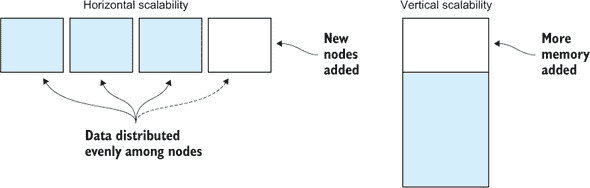

有时候，也许比你想象的更频繁，升级你的机器就足以扩展你的机器学习工作流程。正如前几节所述，在原始数据经过处理并准备好用于分类或回归问题之后，数据可能不足以证明真正大数据系统的复杂性。但在某些情况下，当处理来自流行网站、移动应用、游戏或大量物理传感器的数据时，使用水平可扩展的系统是必要的。从现在开始，我们将假设这一点。

水平可扩展的大数据系统有两个主要层：存储和计算。在*存储层*中，数据被存储并传递到*计算层*，在那里数据被处理。最受欢迎的大数据软件项目之一是 Apache Hadoop，它仍然在科学和工业中得到广泛应用，并基于 2000 年代初谷歌和其他 Web 规模公司在获得前所未有的可扩展性水平时的想法。

Hadoop 中的存储层被称为*Hadoop 分布式文件系统*（HDFS）。数据集被分区并分布在多台机器上，以便可以并行处理。此外，每个分区都被复制，因此数据在硬件或软件故障的情况下不太可能丢失。

Hadoop 的计算层使用一种简单的算法，称为*MapReduce*，在集群中的节点之间分配计算。在 MapReduce 框架中，map 步骤将数据从 HDFS 分布到工人节点上，这些节点以某种方式转换数据，通常保持数据行数不变。这与我们之前章节中的特征工程过程类似，你在输入数据的每一行中添加新的列。在 reduce 步骤中，映射后的数据被过滤并聚合成最终形式。许多数据处理算法可以转换为 MapReduce 作业。当算法转换为这个框架时，系统如 Hadoop 将负责在集群中的任何数量的机器之间分配工作。

在原则上，存储和计算层不需要集成。许多组织使用来自云服务提供商的存储系统，例如亚马逊网络服务 (AWS) 云基础设施中的 S3 服务，与 Hadoop MapReduce 框架结合用于计算。这有一个好处，即 AWS 管理你的大量数据，但你失去了 HDFS 和 MapReduce 之间紧密集成的主要优点：*数据局部性*。有了数据局部性，你的系统变得更加高效，因为计算任务是在数据存储附近的数据子集上执行的。

Hadoop 社区开发了一个名为 *Mahout* 的机器学习库，该库实现了多种流行的 ML 算法，这些算法可以在 Hadoop 框架中的 HDFS 和 MapReduce 上运行。如果你的数据存储在 Hadoop 中，那么 Mahout 可能值得你考虑用于你的机器学习需求。Mahout 正在从简单的 MapReduce 框架转向基于 Apache Spark 的更高级的分布式计算方法。*Apache Spark* 是一个基于 Hadoop 思想的更近和更受欢迎的框架，它通过在内存中处理数据来努力实现更好的性能。Spark 在框架中包含了名为 *MLlib* 的机器学习算法库。图 9.3 展示了 Apache Spark 生态系统的简单图示。

##### 图 9.3\. 基于 Spark 核心的 Apache Spark 生态系统，用于分布式计算。Spark SQL 允许你使用 Python pandas 或 R 数据框来处理表格。Spark Streaming 允许你在数据到达时实时处理数据，与 Hadoop 和经典 Spark 的批处理特性形成对比。MLlib 是一个机器学习库，它包含了一系列针对 Spark 引擎优化的 ML 算法，而 GraphX 是一个允许在大型图（如社交网络的社会图）上进行高效计算的库。

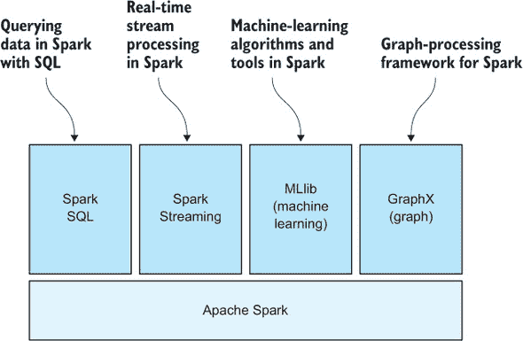

可扩展的 ML 算法通常由于自然原因而通常是线性的。Mahout 和 MLlib 主要包括线性的 ML 算法或非线性算法的近似。在下一节中，你将了解如何使用这两种类型的算法进行扩展。

### 9.2\. 扩展 ML 模型管道

在本章的第一节中，你了解了在投入大量资金扩大你的工作流程以处理更大的数据集之前应该知道的事情。在本节中，我们假设你已经做出了扩大你的 ML 工作流程的决定，并选择了一个大数据处理系统来使用。图 9.4 更新了我们熟悉的 ML 工作流程图，以适应大数据的世界。

##### 图 9.4\. 我们熟悉的 ML 工作流程图中建模部分的扩展组件


在第 9.1.3 节中，我们介绍了一些能够用于管理和处理几乎任何大小数据的大数据系统。由于它们基于实例进行工作，因此我们在这本书中讨论过的特征工程过程可以通过任何这些系统中的简单 map 调用来完成。接下来，您将了解一些流行的线性和非线性机器学习算法如何在大数据面前进行扩展。

#### 9.2.1\. 扩展学习算法

在本章的开头，您看到在学习阶段，基本的可扩展性挑战是处理非常大的训练集在内存中的大小。为了规避这个问题，一个选择是寻找机器学习算法的实现，这些实现要么（a）比相同算法的竞争实现占用更小的内存足迹，要么（b）可以在每个节点只需要整个数据集子集的分布式系统中进行训练。

在野外，存在无数最常见机器学习学习算法的实现。从 scikit-learn 到 mlpack，这些实现不断扩展内存效率的边界（从而增加了可以在固定数量的 RAM 上训练的数据集大小）。然而，数据量仍在超过机器学习软件和计算机硬件的进步。对于某些训练集，唯一的选项是水平可扩展的机器学习。

最常用的分布式学习算法是线性（和逻辑）回归。*Vowpal Wabbit*（VW）库推广了这种方法，并且已经成为跨多台机器可扩展线性学习的主要支柱。分布式线性回归的基本工作方式是首先将训练数据集的子集（按数据集行进行子集划分）发送到集群中的各个机器。然后，以迭代的方式，每台机器对其手头的子集数据进行优化问题求解，并将优化结果发送回中央节点。在那里，这些信息被组合起来，以得出最佳的整体解决方案。经过几次迭代后，最终模型将保证接近整体最优模型（如果一次性将所有数据拟合到一个模型中）。因此，线性模型可以以分布式方式拟合到数太字节或更多的数据！

正如我们在本书中多次讨论的那样，线性算法并不一定足以模拟数据的细微差别以进行准确预测。在这些情况下，转向非线性模型可能会有所帮助。非线性模型通常需要更多的计算资源，并且非线性模型不一定总是可以实现水平可扩展性。这可以通过将非线性模型视为也考虑特征之间的复杂交互来粗略理解，因此需要任何给定节点上更大比例的数据集。

在许多情况下，升级硬件或找到更高效的算法或更高效的算法实现可能更可行。但在其他情况下，需要扩展非线性模型，本节我们将讨论几种处理此问题的方法。

##### 多项式特征

模拟非线性特征交互的最常用技巧之一是创建新的特征，这些特征是现有特征的组合，然后训练一个包含非线性特征的线性模型。组合特征的一种常见方式是将特征以各种组合相乘，例如 *特征 1 乘以特征 2*，*特征 2 的平方*，或 *特征 1 乘以特征 2 乘以特征 5*。假设一个数据集包含两个特征，f1 = 4 和 f2 = 15。除了在模型中使用 f1 和 f2 之外，你还可以生成新的特征 f1 × f2 = 60，f1 ^ ² = 16 和 f2 ^ ² = 225。数据集通常包含远不止两个特征，因此这种技术可以生成大量新的特征。这些特征是现有特征的非线性组合。我们称它们为 *多项式特征*。以下列表展示了如何使用 scikit-learn Python 库实现这一点。此列表中代码的运行结果显示了向标准 Iris 花分类模型添加多项式特征时获得的准确度：

```
Accuracy (linear):     0.95 (+/- 0.12)
Accuracy (nonlinear):  0.98 (+/- 0.09)
```

##### 列表 9.1\. 通过使用多项式特征将线性模型非线性化

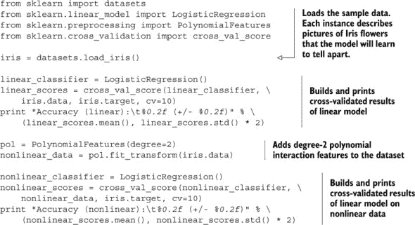

另一个集成了多项式特征提取的机器学习工具包示例是 Vowpal Wabbit 库。VW 可以用于在单机上构建大型数据集上的模型，因为所有计算都是迭代性地并且**离线**完成的，这意味着只需要保留特定迭代中使用的数据。VW 使用随机梯度下降和特征哈希来以可扩展的方式处理非结构化和稀疏数据。VW 可以通过提供 `–q` 和 `–cubic` 标志来生成二次或三次特征，对应于所有特征对或所有特征三联乘积的多项式特征。

##### 数据和算法近似

正如你在前一节中看到的，多项式特征方法能够显著提高模型的准确度，但也以多项式的方式增加了特征数量。这可能对于大量输入特征来说并不可行，因此在这里，你将了解一些具有已知近似值且适用于可扩展实现的非线性算法。其他算法可能有它们自己的可扩展近似，所以我们鼓励你进一步研究你喜欢的算法。

一个广泛使用的非线性学习算法是随机森林，你已经在之前的章节中了解过。随机森林模型由许多决策树组成，乍一看，通过在每个节点上仅构建树的一个子集，似乎可以轻松地将随机森林扩展到多台机器。但请注意，如果每个节点可用的数据子样本不充分相似，模型的准确性可能会受到影响。但构建更多树或更智能地分割数据可以减轻准确性损失。

可以用于扩展随机森林和其他算法的另一个近似方法是*直方图近似*：数据集中的每一列都被替换为该列的直方图，这通常会显著减少列中的值数。如果直方图中的箱数太少，可能会丢失很多细微差别，从而导致模型性能下降。

另一个具有自然近似的方法的算法是 k-最近邻；可以使用特殊的近似树结构来提高模型的可扩展性。支持向量机已经看到了多种近似方法，以使非线性版本更具可扩展性，包括预算随机梯度下降（BSGD）和自适应多超平面机器（AMM）。

##### 深度神经网络

神经网络研究最近的一次革命催生了一个新的领域——深度学习，该领域产生了高度非线性的模型，并且已被证明能够扩展到非常大的数据集。在机器学习的早期，神经网络（NNs）被广泛研究并应用于科学和工业领域。后来，随着易于数学推理的算法的出现，神经网络的使用频率降低。最近，经过几个重要的进化步骤并进入深度学习领域后，神经网络再次在大型和多样化的数据集上产生了最先进的结果。

*深度学习*指的是一系列扩展传统神经网络的算法。通常，这些模型包括神经网络中的许多隐藏层或许多单层网络的组合。图 9.5 展示了示例神经网络。

##### 图 9.5. 具有两个隐藏层的神经网络。松散地模拟人脑，神经元（每层的圆圈）通过在模型训练期间学习的权重相互连接。输出变量可以通过运行输入变量通过加权连接来预测。在深度学习中，这个经典的神经网络概念被扩展到包括更多形状和层间连接程度各异的隐藏层。


深度神经网络的一个缺点是，即使在 GPU 硬件上，构建和优化模型所需的计算资源也可能需要很长时间。在实践中，你可能只需使用其他算法，如随机森林，就能获得几乎相同的表现，同时花费更少的时间和资源。这始终取决于数据集和问题。另一个缺点是，理解这些神经网络模型内部发生的事情可能很困难。有些人称它们为*黑盒模型*，因为你必须相信你对模型进行的统计分析结果，而不需要对其内部进行任何反思。这同样取决于用例。例如，如果你在处理图像，神经元可以承担各种视觉模式的直观表示，这些模式导致特定的预测。

许多深度学习方法已经证明可以扩展到大型数据集，有时通过使用现代图形卡（GPU）来执行某些计算。对于支持 GPU 的 Python 深度学习库，请查看*Theano* ([`deeplearning.net/software/theano/`](http://deeplearning.net/software/theano/))或*Keras* ([`keras.io/`](http://keras.io/))，它基于 Theano)。

### 9.3\. 扩展预测

扩展机器学习不仅仅是扩展到更大的数据集。想象一下你正在构建一个电子邮件服务，突然有数百万用户。你构建了一个很好的垃圾邮件检测模型，它甚至可以扩展到大型数据集，但现在你每天需要做出数亿次的预测。这超过了每秒 10,000 次！图 9.6 说明了这种常见的模式。在本节中，我们讨论了扩展预测量以及当需要实时使用预测时的扩展速度的方法。

##### 图 9.6\. 将机器学习工作流程中的预测部分扩展到高容量或高速预测


首先，你将查看用于通过预测量扩展的基础设施架构，这样你就可以处理电子邮件客户端等的大用户群。接下来，你将了解如何扩展预测速度并保证在给定时间内得到答案。当你的机器学习模型用于例如人类在网页或移动设备上的实时反馈循环时，这一点很重要。

#### 9.3.1\. 扩展预测量

为了处理大量预测，你可以使用来自计算架构中已知的模式来扩展工作节点以支持任意数量的请求。传统的方法是有一个预测作业队列，其中多个工作节点从中提取预测，加载模型（如果需要），进行预测，并以任何对应用程序有意义的方式推送结果。图 9.7 展示了通过容量扩展预测的这种架构可能的样子。

##### 图 9.7. 可扩展预测服务的可能基础设施。预测请求从消费者发送到一个队列，队列将任务委托给预测工人。工人在数据库中存储预测结果，并在完成后将其发送回客户端。如果队列因流入的预测请求多于工人能处理的数量而拥堵，可以启动更多的工人。


这种方法要求模型可以加载到所有工作节点上，当然，还需要有足够的工人（或已部署的自动扩展解决方案）来处理涌入的预测数量。如果你知道一个工人的平均预测时间和请求的速度，你可以轻松计算出所需的工人数量：

```
n_workers = request_velocity * prediction_time
```

例如，如果你每秒有 10 个预测请求进入，而你的工人需要 2 秒来完成，你需要至少 20 个工人来跟上。最佳的自动扩展解决方案是能够在一定时间内根据队列中等待的请求数量启动新的工人。

#### 9.3.2. 扩展预测速度

在某些情况下，你需要预测在客户端发出请求后的一定时间内返回。预测速度可能很重要，例如，当预测是对用户操作的反应时。用户期望实时反馈，等待几秒钟都可能对用户体验产生不利影响。想象一下，一个谷歌搜索需要 20 秒——很可能你已经离开了。或者，如果你正在对金融交易进行预测，仅仅几毫秒可能意味着赚或亏很多钱。

有多种方法可以使预测更快，例如升级硬件或使用更高效的算法或算法的实现。你还可以优化网络，确保客户端尽可能靠近你的服务器。此外，你不应该调用任何可能引入额外延迟的其他服务，例如将预测记录到数据库中，或等待数据被写入磁盘并在集群中复制。在下面的例子中，我们假设你已经考虑了这些点。现在，你将查看两个用于提供实时预测的架构。

快速预测的第一个架构与前面按体积缩放部分中介绍的架构类似，但需要更多的工人。基本思路是，每个预测请求同时发送给多个工人，第一个完成的预测结果被发送回客户。图 9.8 展示了这种架构的一个示例。

##### 图 9.8\. 具有低延迟要求的预测管道的可能架构。预测调度器将预测任务发送到多个工作者，希望至少有一个能及时返回预测。它将返回第一个返回的客户，之后将其记录在日志或数据库中，以供后续检查和分析（在后台，可能在已经处理下一个预测的同时）。


另一种实时预测的方法是将预测分成几部分，以便计算可以在多台机器之间分配。集成方法是一类适合这种方法的算法。我们再次以随机森林为例。

随机森林模型由一系列决策树组成。该算法从每棵树中进行预测，并在分类的情况下，将每棵树的投票计入最终概率。例如，如果有 10 棵树，其中 6 棵树对一个特定的预测实例投赞成票，那么森林返回 6/10，即 60%作为答案。通常，查询的总树数越多，结果越准确、越有信心。这可以用于实时预测系统，以速度换取准确性。如果每个预测节点负责森林中的一棵树或树列表，那么你会要求每个节点进行预测。每当节点完成其树的预测后，结果会返回给收集服务，该服务收集所有节点的结果并做出最终预测。收集器可以观察时间限制，并在必要时在任何时候返回当前状态的预测。例如，如果只有 20 棵树中的 1,000 棵返回了任何内容，用户会得到一个答案，但它的准确性不如所有 1,000 棵树都有时间返回答案的情况。

图 9.9 显示了该架构的实际操作图。

##### 图 9.9\. 确保在特定时间内返回的预测管道的建议架构，如果一些部分预测尚未返回，可能会牺牲预测的准确性和信心。预测请求由生产者发送到工作者，而消费者服务收集准备返回给客户的部分预测，如果时间到了。


一些系统在支持这些可扩展的实时系统方面显示出希望。一个是之前提到的 Apache Spark 生态系统的一部分：Spark Streaming。使用 Spark Streaming，你获得了一套工具和库，使构建实时、面向流的数据处理管道变得更容易。别忘了，任何预测通常都必须经过与模型构建时训练数据相同的特征工程过程。

其他项目包括 Apache Storm、Apache Kafka、AWS Kinesis 和 Turi。每个项目都有针对特定用例的优缺点，所以我们鼓励你调查适合你需求的适当工具。

### 9.4. 摘要

在本章中，你已经研究了通过转换数据或构建水平可扩展的多机基础设施来扩展机器学习系统到大型数据集的各种方法。本章的主要收获如下：

+   扩展你的机器学习系统有时是必要的。以下是一些常见原因：

    +   训练数据无法适应单个机器。

    +   训练模型的时间太长。

    +   进入的数据量太大。

    +   预测的延迟要求很低。

+   有时，你可以通过以下方式避免在可扩展基础设施上花费时间和资源：

    +   选择一个足够快或足够精简的机器学习算法，可以在不牺牲准确性的情况下在单个机器上工作

    +   对数据进行子采样

    +   垂直扩展（升级机器）

    +   如果仍然比扩展更便宜，则可以牺牲准确性或放宽其他约束

+   如果无法避免以横向方式扩展，则广泛使用的系统可用于设置可扩展的数据管理和处理基础设施：

    +   带有 Mahout 机器学习框架的 Hadoop 生态系统

    +   带有 MLlib 机器学习库的 Spark 生态系统

    +   Turi（以前称为 GraphLab）框架

    +   流式技术，如 Spark Streaming、Apache Storm、Apache Kafka 和 AWS Kinesis

+   在扩展模型构建管道时，请考虑以下因素：

    +   选择一个可扩展的算法，如逻辑回归或线性 SVM

    +   通过对数据和算法进行近似来扩展其他（例如，非线性）算法

    +   使用分布式计算基础设施构建你喜欢的算法的可扩展版本

+   预测可以在数量和速度上进行扩展。以下是一些有用的方法：

    +   构建你的基础设施，使其能够随着预测量的增加而扩展工作者的数量

    +   将相同的预测发送到多个工作者，并返回第一个以优化预测速度

    +   选择一个允许你在多台机器上并行化预测的算法

### 9.5. 本章术语

| 词汇 | 定义 |
| --- | --- |
| 大数据 | 一个广泛使用的术语，通常用来表示无法在单个机器上处理的数据管理和处理问题。 |
| 水平/垂直扩展 | 水平扩展意味着添加更多机器来处理更多数据。垂直扩展意味着升级你的机器的硬件。 |
| Hadoop, HDFS, MapReduce, Mahout | Hadoop 生态系统在科学和工业中广泛用于处理和加工大量数据。HDFS 和 MapReduce 分别是分布式存储和并行处理系统，而 Mahout 是 Hadoop 生态系统中的机器学习组件。 |
| Apache Spark, MLlib | Apache Spark 是一个较新的项目，它试图将数据保留在内存中，使其比基于磁盘的 Hadoop 更高效。MLlib 是 Spark 伴随的机器学习库。 |
| 数据局部性 | 在数据所在的位置进行计算。在大数据项目中，数据传输往往成为瓶颈，因此避免数据传输可以大大提高资源需求。 |
| 多项式特征 | 一种技巧，可以将线性模型扩展到包括非线性多项式特征交互项，同时不失去线性学习算法的可扩展性。 |
| Vowpal Wabbit | 一种机器学习工具，可以在大型数据集上高效地构建模型，而不必使用像 Hadoop 这样的完整大数据系统。 |
| 离核计算 | 如果您只需要在内存中保留当前迭代的数据，则进行离核计算。 |
| 直方图近似 | 对训练数据的近似，将所有列转换为学习过程中的直方图。 |
| 特征选择 | 通过选择和保留最佳（最具预测性）的特征子集来减少训练数据大小的过程。 |
| Lasso | 一种线性算法，选择最具预测性的特征子集。在特征选择方面非常有用。 |
| 深度神经网络 | 神经网络的一种演变，可以扩展到更大的数据集并实现最先进的准确性。在实际应用中，相对于其他算法，它需要更多的知识和计算资源，这取决于数据集和问题。 |
| 预测量/速度 | 扩展预测量意味着能够处理大量数据。扩展速度意味着能够足够快地处理特定实时用例。 |
| 准确度与速度 | 对于实时预测，有时可以以预测速度为代价来换取预测的准确性。 |
| Spark Streaming、Apache Storm、Apache Kafka、AWS Kinesis | 建立实时流系统的即将到来的技术。 |

## 第十章。示例：数字展示广告

*本章涵盖*

+   可视化和准备一个现实世界的数据集

+   建立用户点击数字展示广告概率的预测模型

+   比较几个算法在训练和预测阶段的表现

+   通过降维和并行处理进行扩展

第九章介绍了使您能够扩展机器学习工作流程的技术。在本章中，您将应用这些技术来解决一个大规模的实际情况：优化在线广告活动。我们从对在线广告复杂世界的简要介绍开始，包括驱动它的数据，以及广告商用来最大化*广告支出回报率*（ROAS）的一些方式。然后我们展示如何将第九章中的一些技术应用于这个典型的大数据应用。

在我们的示例中，我们使用了几个数据集。不幸的是，此类大型数据集只有少数对公众开放。我们示例中的主要数据集不可下载，即使可以下载，也太大，不适合个人计算机使用。

可以下载并用于非商业目的的一个数据集来自由 Criteo 赞助的 Kaggle 展示广告挑战赛。Criteo 数据集包含超过 4500 万个关于 39 个特征的观测值，其中 13 个是数值型，26 个是分类型。不幸的是，正如在数据科学竞赛中使用的数据集常见的那样，特征的含义是模糊的。变量名称从 V1 到 V40。V1 是标签，V2 到 V40 是特征。在现实世界中，你会知道每个特征衡量或代表什么。但正如比赛证明的那样，你仍然可以探索它们的预测价值并创建有用的模型。

Criteo 数据集可在[`s3-eu-west-1.amazonaws.com/criteo-labs/dac.tar.gz`](https://s3-eu-west-1.amazonaws.com/criteo-labs/dac.tar.gz)获取。

### 10.1. 展示广告

> 我花在广告上的钱有一半是浪费的；麻烦的是，我不知道是哪一半。
> 
> *约翰·万纳梅克*

在 *广告狂人* 时代，这是一个无法避免的事实。但随着数字广告的出现，我们可以通过收集用户与在线广告互动的数据来发现哪些有效，哪些无效。

在线广告通过众多媒体进行传递。*展示广告*出现在浏览器中渲染的网页内，通常在个人电脑或笔记本电脑上。由于移动浏览器上识别用户和处理互联网 cookie 的规则不同，移动广告技术依赖于不同的一套技术，并生成相当不同的历史数据。*原生广告*嵌入在游戏和移动应用中，以及*预播放广告*，它们在在线视频内容之前播放，基于不同的传递技术，并需要针对其独特流程的分析。我们的例子仅限于*传统*展示广告。

展示广告的大部分术语都是从印刷广告业务中继承下来的。可以购买广告的网站被称为 *出版物*，其中的广告空间以尺寸和格式为特征，或称为 *广告单元*，而广告在网站和页面中的位置被称为 *投放位置*。每次广告展示都称为 *印象*。广告以每 1000 次印象的批量出售，这种价格被称为 CPM（每千次成本）。

当用户浏览到网页时——比如说，xyz.com——看起来是 xyz.com 的发布者提供了整个页面。实际上，页面包含由各种广告商通过复杂的中间商网络填充的广告占位符。每个提供广告的 Web 服务器都维护日志，包括有关每次印象的信息，包括发布者、用户的互联网地址以及包含在互联网 *cookies* 中的信息，其中可能存储了来自广告商服务器的先前交付的信息。在下一节中，您将了解在展示广告活动中捕获的数据类型。

### 10.2. 数字广告数据

Web 服务器为每个用户请求捕获数据，包括以下内容：

+   ***客户端地址—*** 发起请求的计算机的 IP 地址。

+   ***请求—*** URL 和参数（例如，[`www.abc.com?x=1234&y=abc01`](http://www.abc.com?x=1234&y=abc01)）。

+   ***状态—*** 服务器发出的响应代码；通常是 200，表示成功响应。

+   ***来源网站—*** 用户链接到当前网页的网页。

+   ***用户代理—*** 识别发起请求的浏览器和操作系统的文本字符串。

+   ***Cookie—*** 当浏览器访问网站时存储的小文件。当再次访问该网站时，文件会随请求一起发送。

此外，许多现代广告都与测量程序一起提供——捕获如下信息的小型 JavaScript 程序：

+   ***可视化—*** 广告是否以及显示了多长时间。

+   ***用户 ID—*** 浏览器 cookies 用于留下唯一标识符，以便在再次遇到时识别用户。

+   ***可视化秒数—*** 广告显示的秒数。

图 10.1 展示了活动样本数据。可视化数据是从查询字符串中提取的，而 `user_id` 是随机生成的标识符，用于将用户与之前的访问关联起来。

##### 图 10.1. 印象数据。域名是随机生成的真实名称的替代品。


### 10.3. 特征工程和建模策略

*点击* 是我们的目标变量。您希望预测印象导致点击的可能性（有时称为 *点击率* 或 *点击通过率*）。更具体地说，给定一个特定用户访问特定网站，您想了解用户点击广告的概率。在制定问题方面，您有几个选择。您可以尝试预测给定用户点击通过的概率，也可以尝试预测每个展示广告的发布者的点击通过率（CTR）。

正如通常情况一样，你模型的具体内容和你努力预测的确切值最终将由提出这些问题来驱动：*预测将如何被使用？它将以何种方式被实施？*在这种情况下，我们的广告商有选择性地将某些出版物列入黑名单的选项，因此广告商的主要关注点是识别最不可能产生点击的出版物。近年来，已经开发出*实时竞价*技术，使广告商能够根据竞价系统提供的用户和出版物特征对单个展示进行竞价，但我们的示例广告商尚未采用实时竞价。

你可能会在这个时候感到疑惑，为什么广告商不直接查看所有出版物的一些历史数据，并将 CTR 低的出版物列入黑名单。问题是，当一场活动的整体 CTR 在 0.1%左右时，只有少量展示的出版物的点击预期值是零。没有点击并不表示 CTR 低。此外，当我们汇总表现最好的低量级出版物时，我们经常观察到高于平均水平的 CTR（因此仅仅将所有低量级出版物列入黑名单并不是一个好的策略）。你正在寻找一个模型，它将使你能够在没有大量性能历史的情况下预测出版物的表现。

初看之下，你可能认为你没有什么可以利用的。你可以统计用户、出版商和操作系统的展示、点击和观看次数。也许一天中的某个时间或一周中的某一天会有一些影响。但进一步思考后，你意识到用户访问的域名是描述用户的功能，访问域名的用户是域名特征。突然之间，你有了大量可以工作的数据，以及一个真实世界的体验*维度诅咒*的机会——这是一个用来描述在高维空间中工作所遇到的困境的短语。当你探索数据时，你会发现大量特征，如果不是诅咒，也是好坏参半的祝福。

你可能会认出在这里应用的逻辑是*推荐系统*的基础，这些系统在 Netflix 上推荐电影，在 Amazon 上推荐产品，在 Yelp 上推荐餐厅。将用户描述为物品集合，将物品描述为用户集合的想法是*协同过滤*的基础，其中用户根据共同物品偏好进行聚类，物品根据共同用户的亲和力进行聚类。当然，推荐系统的动机是向用户提供他们可能购买的项目。广告问题是一个变体；不是许多项目，而是在广泛的上下文中展示相同的广告：出版物。驱动原则是，在类似那些有响应历史记录的出版物上实现用户响应（点击）的可能性最大。而且因为相似性基于共同用户，以这种方式选择的出版物将吸引与过去响应者偏好相似的人。

### 10.4. 数据的大小和形状

你将从 900 万个观测值的样本开始，这是一个足够小的样本，可以放入内存中，这样你就可以做一些关于基数和分布的快速计算。

##### 列表 10.1. 数据的第一印象


幸运的是，大多数用户从未访问过大多数域名，因此用户/项目矩阵是稀疏的，你可以使用工具来处理大型、稀疏的矩阵。没有人说过用户和域名必须是巨大矩阵的行和列，但事实是，当可以在内存中操作用户/项目矩阵时，一些有价值的算法表现得特别出色。

哦，还有一件事：在列表 10.1 中提到的 900 万观测值大约占数据的 0.1%。最终，你需要处理大约 100 亿次的印象，而这只是数据的一周量。我们将 900 万次印象的数据加载到亚马逊网络服务（AWS）实例的约 53%内存中，该实例有 32GB 的 RAM，所以随着你的深入，这肯定会更有趣。

接下来，让我们看看数据如何在分类变量上分布。在列表 10.1 中，我们已经通过计算`pub_domain`和`user_id`的基数开始了这个过程。

##### 列表 10.2. 分布


图 10.2 显示，许多域的印象数量很少，而少数域的印象数量很多。为了你能直观地看到分布图，我们绘制了以 10 为底的对数而不是原始频率（我们使用 10 为底，这样你可以将 x 轴视为 10⁰、10¹、10²...）。

##### 图 10.2. 印象数据的直方图显示，出版域中印象数量的分布严重偏斜。


也许最显著的是，你可以看到点击率相对较低，仅为 0.12%，或者说 0.0012。这是一个令人尊重的整体点击率。但在这个例子中，你需要大量的数据集，以便有足够的目标示例来构建你的模型。这并不罕见。我们经常试图预测相对罕见的现象。通过使用大数据技术处理大量数据集的能力，使得将机器学习应用于许多全新的问题类别成为可能。

同样，按`user_id`计算的印象频率高度倾斜。平均用户有 2.46 次印象，但中位数是 1，所以少数几个高点击量将平均值拉高。

### 10.5. 奇异值分解

第三章和第七章提到了主成分分析，或 PCA，这是一种无监督的机器学习技术，常用于降维和提取特征。如果你将每个用户视为他们互动的出版物的一个特征，那么每个出版物大约有 360 万个特征，你的数据探索样本有 1500 亿个值。显然，你希望使用更少的特征，幸运的是，你可以相当容易地做到这一点。

实际上，PCA 有几个算法，其中之一是*奇异值分解*，或称为 SVD。你可以用各种方式从数学上解释和解释 SVD，数学家会认识到我们在这里的解释忽略了底层线性代数的一些美感。幸运的是，就像在第七章中介绍的潜在语义分析一样，SVD 在 scikit-learn Python 库中有一个出色的实现。但这次，让我们只做一点矩阵代数。如果你做过矩阵乘法，你就会知道维度很重要。如果 A[[n x p]]表示一个 n 行 p 列的矩阵，你可以将 A 与另一个维度为 p 行 q 列的矩阵相乘（例如，B[[p x q]]），结果将具有 n 行 q 列的维度（例如，C[[n x q]]）。实际上，任何矩阵都可以分解为三个组成部分，分别称为左奇异向量、右奇异向量和奇异值。

在这个例子中，n 是用户数量，每个用户由矩阵 A 中的一行表示，p 是出版物数量，每个出版物由矩阵 A 中的一列表示：


使这变得有趣的是，奇异值告诉你关于由左右奇异向量（这些向量是 U 和 V^T 的行）表示的特征的重要性。特别是，奇异值告诉你相应的特征向量独立到什么程度。考虑相互依赖或*协变*特征的含义。或者，为了使它更容易理解，想象两个特征，A 和 B，是相同的。在模型考虑了特征 A 之后，特征 B 就没什么可以贡献的了。它不包含任何新信息。作为预测模型的构建者，你想要的特征是独立的，并且每个特征至少是目标的一个弱预测器。如果你有很多弱预测器，只要它们的预测比随机预测好，结合起来它们就会增强力量。但这种现象，*集成效应*，只有在特征独立时才会起作用。

让我们在我们的广告数据上运行 SVD，并查看产生的奇异值。

##### 列表 10.3\. 广告数据的 SVD


当你运行 SVD 时，你使用了 k = *最大奇异值*参数来限制计算只到 1,550 个最大的奇异值。图 10.3 显示了它们的幅度；你可以看到大约有 1,425 个非零值，并且超过 450 个最独立的特征向量之外，其余的都是高度协变的。这并不奇怪。尽管有超过 300 万用户，但请记住，他们中的大多数只与非常少的 pub 互动。考虑到这些，其中 13.6 万个用户（顺便说一句，在 ebay.com）只被观察过一次。所以如果每个用户向量是 pub 的一个特征，ebay.com 就有 13.6 万个相同的特征。

##### 图 10.3\. 广告数据的奇异值


我们将 SVD 将超过 300 万个特征减少到大约 7 千个，减少了 400:1。了解这一点后，你对所需的资源有了更好的感觉。在下一节中，你将了解如何确定和优化训练模型所需的资源。

### 10.6\. 资源估计和优化

到目前为止，你已经查看了你数据的基数和分布，并进行了某些特征工程。在本节中，你将根据你拥有的资源相对于计算工作量的任务进行评估。

为了估计资源需求，你需要从一些测量开始。首先让我们看看你的可用资源。到目前为止，你一直在使用单个 m4.2xlarge 亚马逊 EC2 实例。让我们快速解码一下。EC2 是亚马逊的弹性计算云。每个实例都是一个具有专用 CPU、随机存取内存（RAM）和磁盘或固态在线存储的虚拟服务器。"m4.2xlarge"标识符意味着一个具有八个核心和 32GB 内存的服务器。磁盘空间是单独配置的。我们的单个实例配备了 1TB 的弹性块存储（EBS）。EBS 是虚拟化存储，设置为看起来你的实例有一个专用的 1TB 磁盘卷。你已经设置了你的实例以运行 Linux。根据你的需求，你可以轻松地将单个实例升级以添加核心或内存，或者你可以配置更多的实例。

接下来，让我们看看你的工作负载。你的原始数据存储在亚马逊的简单存储服务（S3）的交易文件中，S3 旨在以低廉的价格存储大量数据。但访问速度比本地磁盘文件慢得多。每个文件大约包含 100 万条记录。你可以从 S3 中每秒读取大约 30,000 条记录，所以如果你逐个处理它们，10 亿条将需要大约 92 小时。通过并行处理多个下载（在单个实例上），可以从 S3 中加速下载，大约可以提高 75%，这样可以将时间缩短到 23 小时。

但速度并不是你唯一的问题。根据你之前的观察，将 1000 万条记录加载到内存中会消耗你 32GB 内存的 53%，要加载整个数据集需要 1.7TB 的内存。即使你能负担得起，亚马逊也没有那么多 RAM 的实例。

幸运的是，你不需要将所有数据都存储在内存中。此外，你的需求并不仅仅取决于数据的大小，还取决于其形状——我们指的是其主键的基数。结果显示，有 100 亿条记录，但只有大约 1000 万用户和大约 30 万个出版物，这意味着用户/出版物矩阵大约有 3 万亿条条目。但是，当你填充你的稀疏矩阵时，只有大约 0.01%的单元格中有值，所以 3 万亿减少到 3 亿。假设每个值有一个 64 位的浮点数，你的用户/出版物矩阵将大约占用你 32GB 中的 2.5GB。

为了减少处理时间，你需要考虑并行处理。图 10.4 图说明了使用工作节点（额外的 EC2 实例，在这种情况下）并行获取原始数据。

##### 图 10.4。并行处理扩展了初始数据获取。


工作节点不仅从 S3 读取数据。每个节点独立构建用户和物品的稀疏矩阵。当所有工作节点完成他们的工作后，这些矩阵将由你的计算节点组合。

第九章描述了一些大数据技术：Hadoop、MapReduce 和 Apache Spark。这里描述的过程是 MapReduce 作业中发生的事情的高度简化版本。一个大任务被分解成小单元，每个单元被分配（映射）到工作节点。当工作节点完成它们的子任务时，结果被合并（减少），并将结果返回给请求者。Hadoop 通过几种方式优化了这个过程。首先，而不是让工作节点通过网络检索数据，每个工作节点将部分数据存储在本地。Hadoop 优化任务分配，以便尽可能让每个节点处理已经存储在本地卷上的数据。Spark 更进一步，让工作节点将数据加载到内存中，这样它们在处理分配的任务时就不需要进行任何 I/O 操作。

尽管这个示例问题足够大，需要一点并行处理，但实现这些框架之一所付出的努力可能并不值得。你每天只需要运行整个工作流程一次，你很容易增加几个实例，并将整个过程缩短到一小时或更少。但你可以很容易地想象一个需要你以更高频率运行各种过程的应用程序，其中工作节点在多个处理周期中保留原始数据在内存中，将性能提升几个数量级。

### 10.7. 模型构建

你的目标是预测每个出版物的点击率（CTR）。你从用户交互作为特征开始，并使用奇异值分解（SVD）来降低特征空间。从这里，有几种方法可以做出预测。你的第一个模型将是一个 *k-最近邻算法*（KNN）模型。这是一个简单但出奇有效的推荐模型。

你还将训练一个 *随机森林回归器*。随机森林是一种基于决策树的机器学习方法；它选择了数据的多组随机样本和特征集的随机子集，并为每个选择构建决策树。

### 10.8. K-最近邻算法

图 10.5 显示了简化的用户/项目和相似度矩阵。注意，相似度矩阵的对角线都是零，因为每个出版物的用户向量（用户/项目矩阵中的列）与其自身相同，因此与自身之间的距离为零。你可以看到 pub3、pub4 和 pub7 之间的距离为零，正如你所期望的，因为它们在用户/项目矩阵中的相应列是相同的。此外，请注意 pub1 与 pub5 的距离与 pub5 与 pub1 的距离相同。换句话说，不相似性是对称的。有趣的是，一些推荐算法没有定义对称的距离。项目 A 可能类似于项目 B，但项目 B 可能不类似于项目 A。

##### 图 10.5\. 相似度，或距离，矩阵显示了用户交互的相似或不同程度。在这个例子中，用户/项目矩阵是二元的，表示用户是否与 pub 互动。


你使用几种可用的度量之一计算每对 pub 之间的相似度（实际上，*dis*similarity，或距离）。然后你选择最常见的方法，即 *欧几里得距离*。

在计算完成对距离之后，下一步是计算每个 pub 的预测 CTR。在 KNN 中，预测的目标值是通过计算 k 个最近邻的目标值的平均值来得到的，假设每个示例观测值将与其最近的邻居最相似。在这个阶段有几个重要的问题。首先，你应该选择 k 的什么值？应该考虑多少个邻居？此外，通常会给最近的邻居更大的权重，通常是通过将平均目标值的计算加权为 1/*距离*或[1/*距离*]²。

代码列表 10.4 展示了使用 scikit-learn `NearestNeighbors`计算一系列可能的 k 值预测值的计算。在这里，你尝试了三种加权公式，每个公式有 20 个 k 值。图 10.6 显示，最佳预测者是一个或两个最近邻，对更大范围的平均并没有真正的改进。这可能是由于我们的数据稀疏，最近邻通常相当遥远。注意，k 值的变异性也较小。无论如何，我们的测试集预测的标准化 RMSE 在 5%的范围内。还不错！

##### 图 10.6\. 三种加权函数和 k = 1 到 k = 30 的 RMSE 值


##### 代码列表 10.4\. KNN 预测


### 10.9\. 随机森林

在随机森林的训练阶段，数据会通过一个称为 *bagging* 的过程（有时也称为 *bootstrap aggregating*）进行重复采样，并且是有放回的。对于每个样本，使用随机选择的特征子集构建一个决策树。为了对未见过的数据进行预测，每个决策树都是独立评估的，并且结果会被平均（对于回归）或者每个树对分类进行“投票”。对于许多应用来说，随机森林可能不如其他算法（如提升树或支持向量机）表现好，但随机森林有易于应用、结果易于解释和理解、以及多棵树的训练易于并行化的优点。再次强调，你将使用 scikit-learn；参见图 10.7。

##### 图 10.7\. 随机森林回归的变量重要性


##### 代码列表 10.5\. 随机森林回归


优化的随机森林回归提供了有用的点击率预测，但它不如 KNN 预测好。你的下一步可能就是探索将这些模型以及其他模型结合起来的方法。以这种方式结合模型的方法被称为*集成方法*。随机森林本身就是一种集成方法，因为袋装是一种生成多个模型的方式。为了结合完全不同的模型，例如本例中的两个模型，你可能需要采用*堆叠*或堆叠泛化，在这种方法中，多个模型的预测成为由另一个机器学习模型（通常是逻辑回归）训练和预测时结合的特征。

### 10.10\. 其他现实世界的考虑因素

你考虑了大数据带来的现实世界问题：高维度、计算资源、存储和网络数据传输限制。正如我们简要提到的，整个过程可能适用于几种数字广告类型：移动、视频和原生。实时竞价和用户级个性化有一套完全不同的关注点。你拥有的数据可能因程序而异，而在一种情况下完美工作的模型可能在另一种情况下完全失败。

在我们的例子中，我们一开始有一个庞大的历史数据集。但我们的推荐系统方法存在一个被称为*冷启动问题*的问题。当一个新用户或新产品进入系统而没有历史记录可依赖时，你没有任何基础来建立关联。对我们来说，一些未知因素并不重要，但当一个新的活动从头开始时，你完全没有历史记录可以工作。基于其他类似活动的模型构建的模型可能有效也可能无效。

在现实世界中，拥有各种可以使用的工具和模型具有很大的优势。环境越大、越复杂，拥有这样一套特征构建、数据减少、训练、预测和评估工具的好处就越大，这些工具应该组织良好并集成到一个连贯的自动化工作流程中。

广告是一个很好的例子，说明外部性可能会降低你的预测模型的有效性。随着技术和商业实践的变革，行为也在改变。移动设备的增长极大地改变了数字景观。实时竞价完全改变了你应用优化的层级。新的欺诈形式、广告拦截器、新的浏览器和新的网络技术都改变了你正在建模的动态。在现实世界中，模型被构建、测试、部署、衡量、重建、重新测试、重新部署，并再次衡量。

数字广告是一个价值数十亿美元的业务，对于依赖它的品牌来说，即使是减少一点浪费支出，也能带来显著的回报。你可以消除的每一处浪费印象都能节省金钱，但当你用能带来客户获取的印象替换时，其好处将远远大于成本节省，并且将远远超过克服这个动态业务众多挑战的努力。

### 10.11\. 摘要

本章不仅涵盖了选择算法、训练和测试模型等机器学习问题的要素，而且比仅仅选择算法、训练和测试模型更为广泛。尽管这些是机器学习学科的核心，但它们的成功往往取决于周围的实践性和权衡。以下是本章示例中的关键点：

+   第一步始终是理解你正在建模的业务或活动，其目标以及如何衡量它们。考虑你的预测如何被采取行动也很重要——预测基于你提供的洞察力可以做出哪些调整或优化。

+   不同的特征工程策略可能会产生非常不同的工作数据集。撒大网并考虑多种可能性是有益的。在第一个模型中，你大大扩展了特征集，然后使用奇异值分解（SVD）进行缩减。在第二个模型中，你使用了简单的聚合。哪种方法最有效取决于问题和数据。

+   在探索数据子样本之后，你能够估计执行分析所需的计算资源。在我们的例子中，瓶颈不是机器学习算法本身，而是将原始数据收集和汇总成适合建模的形式。这种情况并不少见，当你考虑资源需求时，考虑先决条件和下游工作流程任务同样重要。

+   通常，最好的模型不是一个单一的模型，而是一系列模型，这些模型的预测由另一个预测模型汇总。在许多现实世界的问题中，最佳可能的集成与创建、操作和维护复杂工作流程的实用性之间存在实际权衡。

+   在现实世界中，往往只有少数，有时很多，对当前问题的变体。我们讨论了其中一些用于广告的变体，它们在任何复杂学科中都很常见。

+   你所建模的现象的潜在动态通常不是恒定的。商业、市场、行为和条件都在变化。当你在现实世界中使用机器学习模型时，你必须不断监控它们的性能，有时甚至需要回到起点重新设计。

### 10.12\. 本章术语

| 单词 | 定义 |
| --- | --- |
| 推荐算法 | 一类用于预测用户对各种物品亲和力的机器学习算法。 |
| 协同过滤 | 通过描述用户的物品偏好和物品的常见用户偏好来工作的推荐算法。 |
| 集成方法 | 一种机器学习策略，其中多个模型的独立预测被组合在一起。 |
| 集成效应 | 多个组合模型倾向于产生比单个组件更好的预测性能的趋势。 |
| k 最近邻 | 一种基于训练空间中最近观察值的预测算法。 |
| 欧几里得距离 | 在特征空间中测量距离的许多方法之一。在二维空间中，它是熟悉的距离公式。 |
| 随机森林 | 一种集成学习方法，它将多个决策树分类器或回归器拟合到训练数据的子集和特征中，并根据组合模型进行预测。 |
| 折叠法 | 随机森林和其他算法使用的重复有放回抽样的过程。 |
| 堆叠 | 使用机器学习算法（通常是逻辑回归）结合其他算法的预测，以创建最终的“共识”预测。 |

### 10.13. 回顾与结论

写这本书的第一个目标是以一种可理解且有趣的方式解释现实世界中实践中的机器学习。另一个目标是让你能够识别出机器学习何时可以解决你的现实世界问题。以下是一些关键点：

+   机器学习方法在解决某些数据驱动问题方面确实具有优势。

+   基本的机器学习工作流程包括数据准备、模型构建、模型评估、优化和预测。

+   数据准备包括确保收集了足够数量的正确数据，可视化数据，探索数据，处理缺失数据，重新编码分类特征，执行特征工程，并始终注意偏差。

+   机器学习使用了许多模型。广泛的类别包括线性和非线性、参数和非参数、监督和非监督，以及分类和回归。

+   模型评估和优化涉及迭代交叉验证、性能测量和参数调整。

+   特征工程使得应用领域知识和使用非结构化数据成为可能。它通常可以显著提高模型的性能。

+   规模不仅仅是关于大数据。它涉及工作划分、新数据摄入速率、训练时间和预测时间，所有这些都在业务或任务需求背景下进行。

机器学习的数学和计算机科学已经伴随着我们 50 年，但直到最近，它们都局限于学术界和一些神秘的应用。随着大型互联网公司的增长和世界上网的数据传播，大门已经打开。企业、政府和研究人员每天都在发现和发展机器学习的新应用。这本书主要关于这些应用，只包含足够的基础数学和计算机科学知识，不仅解释了从业者做什么，还解释了他们是如何做的。我们强调了无论算法、规模或应用如何，都适用的基本技术和流程。我们希望我们已经帮助消除了机器学习的神秘感，并在这样做的同时，帮助推进了其解决重要问题的应用。

进步如同波浪般涌现。计算机自动化浪潮改变了我们的机构。互联网的浪潮改变了我们的生活和文化。有充分的理由预期，今天的机器学习只是下一波浪潮的预览。它将是一个可预测的涨潮，还是一场狂风暴雨，或者是一场海啸？现在说还为时尚早，但采用率不仅正在推进，而且正在加速。与此同时，机器学习工具的进步令人印象深刻。我们编程让计算机系统以全新的方式进步，它们正在学习看、听、说话、翻译语言、驾驶我们的汽车，并预测我们对商品、服务、知识和关系的需求和欲望。

亚瑟·C·克拉克曾说，任何足够先进的技术都与魔法无异（克拉克第三定律）。当机器学习最初被提出时，确实听起来像是魔法。但随着它变得越来越普遍，我们开始将其视为一种工具。当我们看到许多它的应用实例时，我们可以从人类的角度进行概括，并想象其他用途，而无需了解其内部运作的所有细节。像其他曾经被视为魔法的先进技术一样，机器学习正在成为自然现象，最终比魔法更加微妙和美丽。

|  |
| --- |

**进一步阅读**

对于那些想了解如何在 Python 语言中使用 ML 工具的人来说，我们推荐 Peter Harrington 的《机器学习实战》（Manning，2012 年）。

如果你想在 R 语言中深入了解示例，可以考虑 Max Kuhn 和 Kjell Johnson 合著的《应用预测建模》（Springer，2013 年）。

凯西·奥尼尔描述她和雷切尔·舒特的书籍《做数据科学：前线直言》（O'Reilly Media，2013 年）为“我上大学时希望存在的课程。”我们同意。

如果你感兴趣于大数据和机器学习对商业和社会的影响，可以考虑维克托·迈尔-舍恩伯格和肯尼思·库克耶合著的《大数据：一场将改变我们生活、工作和思考方式的革命》（Houghton Mifflin Harcourt，2013 年）。

网络资源包括以下内容：

+   [www.predictiveanalyticstoday.com](http://www.predictiveanalyticstoday.com)—行业新闻

+   [www.analyticbridge.com](http://www.analyticbridge.com) 及其母站 [www.datasciencecentral.com](http://www.datasciencecentral.com)

+   [www.analyticsvidhya.com](http://www.analyticsvidhya.com)—专注于学习的分析新闻

+   [www.reddit.com/r/machinelearning](http://www.reddit.com/r/machinelearning)—机器学习讨论

+   [www.kaggle.com](http://www.kaggle.com)—竞赛、社区、脚本、招聘板

|  |
| --- |
