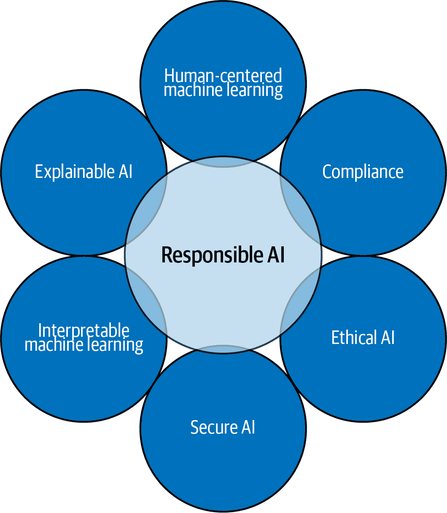
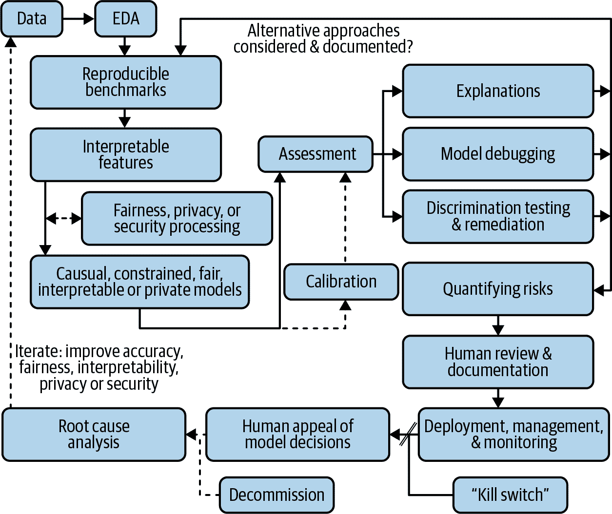

# 第一章：介绍负责任的机器学习

> “成功地创造出有效的人工智能可能是我们文明史上最重大的事件。或者是最糟糕的。”
> 
> 斯蒂芬·霍金

机器学习（ML）系统可以为各行各业的组织节省和赚取资金，它们是许多组织数字转型计划的关键方面。因此，[ML 的投资在 COVID-19 危机前增长迅速](https://oreil.ly/aARnT)，而且在情况发展过程中它们的增长预期[依然健康](https://oreil.ly/15_1l)。然而，ML 系统对操作者、消费者和公众都存在风险。在很多方面，这与旧一代变革性商业技术（如喷气客机和核反应堆）相似。像这些技术一样，ML 可以自行失败，或者被对手攻击。与一些旧的变革性技术不同的是，尽管[越来越多的证据表明 ML 可能造成严重危害](https://oreil.ly/zy35H)，ML 从业者似乎并不认为风险缓解是他们工作的主要指令¹。

常见的 ML 故障模式包括不可解释的黑盒机制、社会歧视、安全漏洞、隐私危害以及系统质量随时间的衰退。大多数 ML 攻击涉及内部人员操纵训练数据和模型机制；外部对手操纵预测或知识产权抽取；或隐藏在第三方数据、模型或其他工件中的特洛伊木马。当故障或攻击失控时，它们会演变成全面的 AI 事件，对操作者或公众造成重大不利后果。到目前为止，已有超过 1,000 起 AI 事故报告。

虽然 AI 事故最近在新闻和技术媒体上受到了更多关注，但围绕 ML 的炒作似乎主要集中在 ML 的成功上，而不是 ML 的风险上。因此，一些决策者和从业者在没有理性评估其危险性的情况下实施 ML。本报告将消除炒作，提供 ML 新兴风险缓解实践的高层概述，通常被称为“负责任的机器学习”。本章将提供负责任人工智能和 ML 的定义，第 2、3 和 4 章将分别讨论人员、流程和技术的可行 ML 风险缓解步骤。第五章以业务驱动的视角结束本报告，关于风险和信任的问题。

# 什么是负责任的机器学习？

什么是负责任的机器学习？它还没有严格的定义，本报告的作者也不打算精确定义它。负责任机器学习的概念需要时间与来自不同从业者、研究人员和决策者的输入共同演化和发展。我们希望，就像今天的商业航空和能源生产一样，风险缓解最终将成为机器学习实践的核心，不再需要区分机器学习的一般实践和负责任机器学习的实践。因此，我们没有提出一个单一的定义，而是提出了几个潜在的定义，并讨论了它们之间的一些主要相似性和差异，以增强社区对这一重要概念的意识。

## 负责人工智能

几位研究人员和组织提出了有关“负责任人工智能”的有帮助的相关定义，特别是因为机器学习是人工智能的一个分支学科，而且这两个术语常常可以互换使用，这些定义似乎是一个很好的起点。

在她的书《*负责任的人工智能*》（Springer）中，Virginia Dignum 定义了这一概念：“负责任的人工智能是关于人类按照基本的人类原则和价值观来发展智能系统的责任，以确保在可持续的世界中人类的繁荣和福祉。”

[伦理人工智能与机器学习研究所](https://oreil.ly/XwK_T) 提出了八项原则，“为技术人员在设计、开发或维护从数据中学习的系统时提供一个实用的框架”。这些原则包括：

人类增强

人类审查和风险评估

偏见评估

理解、记录和监测社会歧视

解释性通过理由

透明度和解释性

可复制的操作

过程和结果应该是可复制的

替代策略

考虑人类工作替代

实际准确性

实际世界的准确性以及测试数据的准确性

信任与隐私

处理培训数据和消费者数据隐私

数据风险意识

对数据和模型采取合理的安全预防措施

谷歌也提出了[负责任的 AI 实践](https://oreil.ly/TYcIx)。这些包括使用以人为中心的设计原则，对任何 AI 系统使用多种评估指标，审查原始数据，了解所选方法的限制，并对 AI 系统进行彻底的测试和监控。谷歌只是众多组织中公布此类指导的一个例子，而这些负责任的 AI 准则的简要总结可归结为使用透明的技术机制来创建可上诉的决策或结果，长期可靠的执行，展现最小的社会歧视，并由具有不同人口统计和专业背景经验的人类设计。

本文的作者最近提出了另外两个相关定义。其中一个是高层次概念摘要，另一个是面向一线从业者的。高层次描述使用了一个 Venn 图，显示在图 1-1 中，将负责任的 AI 描述为几个现有和不断发展的学科的结合。

###### 图 1-1\. 一个负责任的 AI Venn 图（由本杰明·考克斯和 H2O.ai 提供）。

图 1-1 声称，负责任的 AI 是以下几个方面的结合：

道德人工智能

ML 预测中的社会公平性（即某一类别的人是否被不平等或不利地权衡）

可解释人工智能

开发后能解释模型的能力

以人为中心的机器学习

与 AI 和 ML 系统的有意义用户交互

可解释的机器学习

透明的模型架构以及提高 ML 模型直观性和可理解性的方式

安全的人工智能

与传统软件类似的内部和网络威胁的 ML 模型调试和部署对策

合规性

将您的 ML 系统与领先的合规指南（如欧盟 GDPR、平等信贷机会法案（ECOA）或美国联邦储备委员会的 SR 11-7 模型治理指导）对齐

在接下来的部分，以一种更为技术的定义作为图 1-2 中的工作流程呈现，并从最近的论文[*A Responsible Machine Learning Workflow with Focus on Interpretable Models, Post-hoc Explanation, and Discrimination Testing.*](https://oreil.ly/-6fXG)进行了调整。它专门详述了负责任的 ML 的细节。

## 负责任的机器学习定义

当今世界上大多数 AI 可能基于 ML。为了尽可能谨慎和现实，图 1-2 的工作流程专门设计用于当今的 ML 系统。它指导从业者执行减少与 ML 相关的许多已知风险所需的流程。除了传统的 ML 工作流步骤外，该图强调透明度、人工审查、模型寿命问题以及评估多个关键绩效指标（KPI），包括公平性、隐私和安全性。

对于负责任的人工智能（AI）和机器学习（ML），有许多其他可用的定义涉及广泛的主题，包括从环境影响到未来失业等各种议题。大多数定义中共同的主题包括对风险的人类考虑和审查，使人类能有效地与 ML 系统进行交互，增强透明度以及对歧视、隐私损害和安全漏洞的处理。特别值得注意的是，《负责任的机器学习工作流程》论文和图 1-1 中的 Venn 图，将合规性和法律性纳入负责任的 ML 范畴。根据我们作为行业从业者的经验，我们发现法规和法律可以为在 ML 系统实施过程中出现的困难伦理问题提供一些最清晰的指导。此外，法律性通常是许多高风险 ML 应用的底线关注点。ML 的合规性、法律性和法规，以及负责任的 AI 和 ML 定义中提出的其他几个概念，将在以下章节中讨论。

###### 图 1-2\. 一个负责任的机器学习工作流程图（根据作者许可改编）。

¹ 另请参见[*https://oreil.ly/9hzwC*](https://oreil.ly/9hzwC)，[*https://oreil.ly/hFjRY*](https://oreil.ly/hFjRY)和[*https://oreil.ly/2T8Kt*](https://oreil.ly/JPGpV)。
