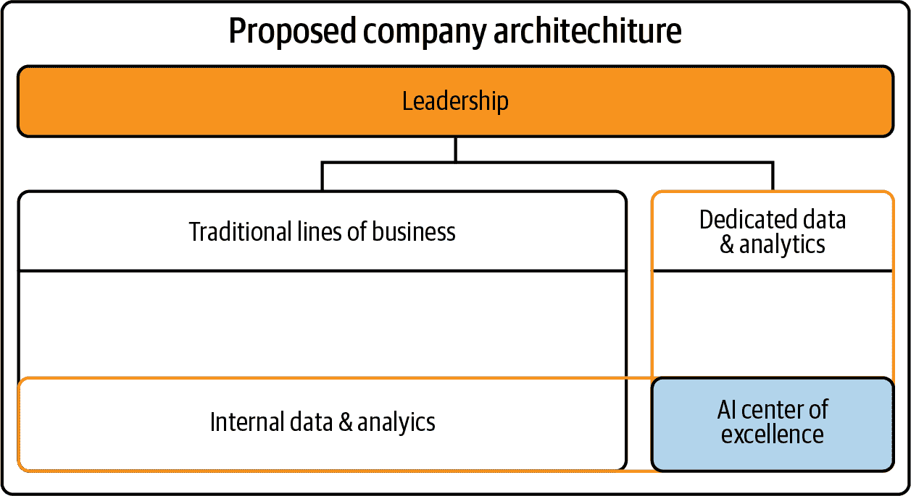
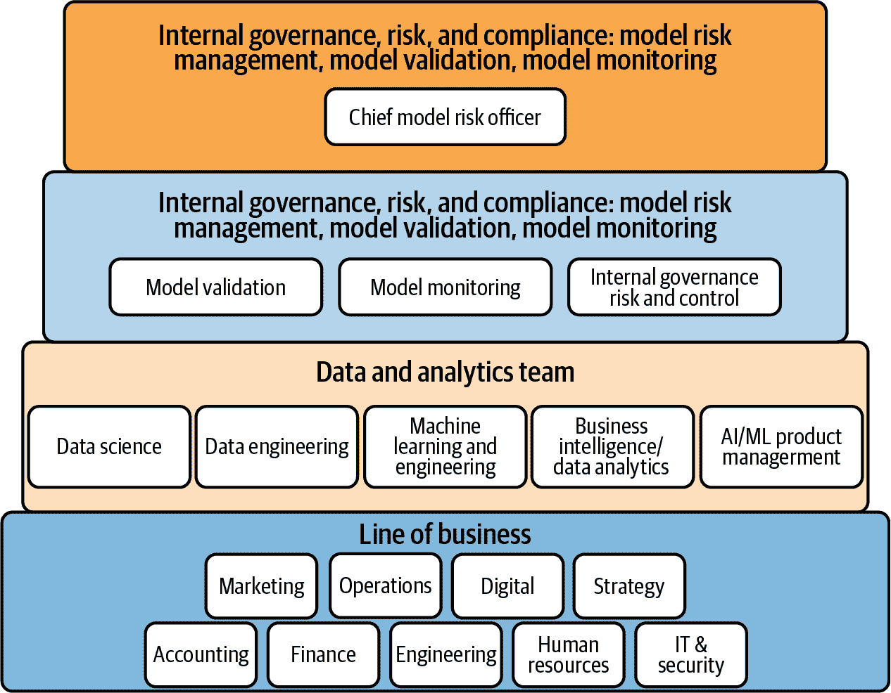
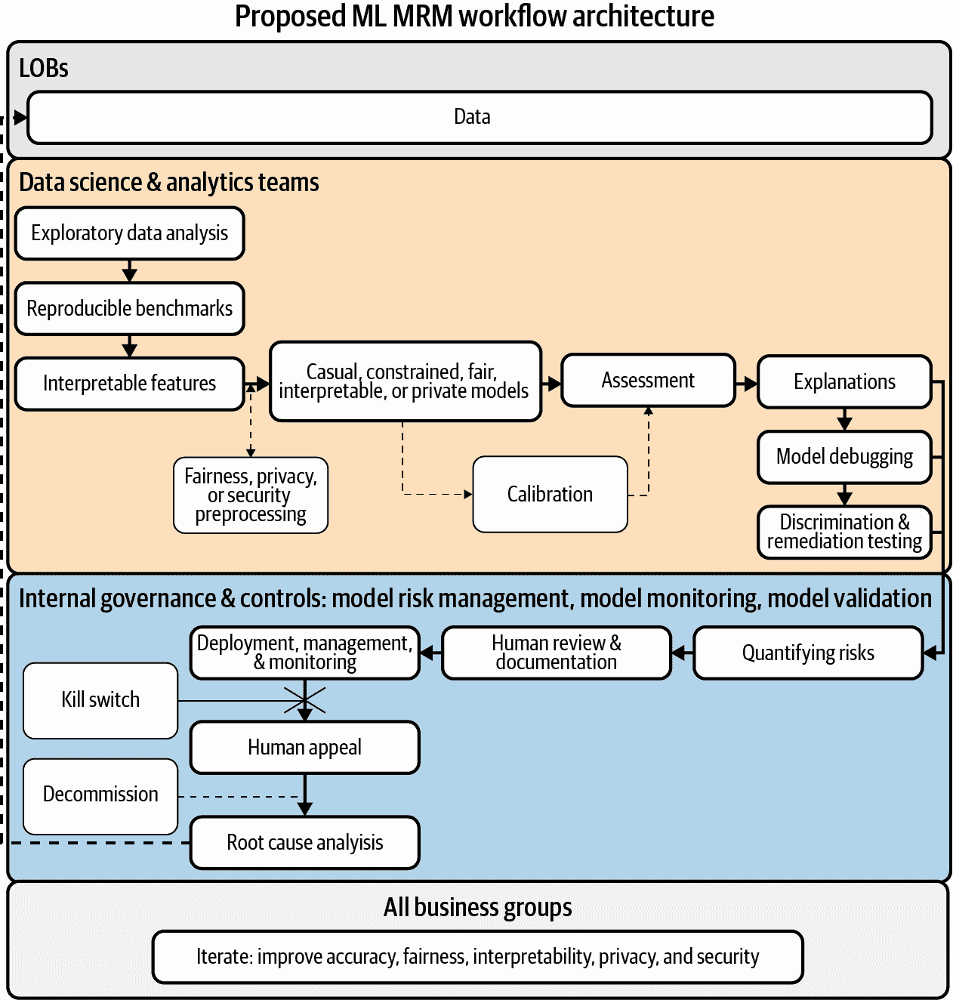

# 第三章：流程：驯服机器学习工作流的荒野

> “AI 正处于这个关键时刻，人类正在决定这项技术对我们是否有益。”
> 
> 被金（Been Kim）

尽管机器学习的长期前景令人期待，但今天的炒作可能与过去其他形式的人工智能一样被过度炒作（例如，请参见[第一](https://oreil.ly/KWrci)和[第二](https://oreil.ly/K3rgr)次 AI 寒冬）。美国的炒作、草率态度和松散的监管导致了粗糙的机器学习系统实施，这些系统经常引发歧视和隐私危害。然而，我们知道，从根本上讲，机器学习是软件。为了帮助避免未来的失败，组织在现有软件资产上所做的所有文档、测试、管理和监控工作，也应该用于他们的机器学习项目。而这只是开始。组织还必须考虑机器学习的特定风险：歧视、隐私危害、安全漏洞、向失败漂移和不稳定的结果。在介绍这些 AI 事件的主要驱动因素并提出一些较低级别的流程解决方案后，本章还触及了法律责任和合规性的新兴问题。然后我们提出了与模型治理、AI 事件响应计划、组织机器学习原则和企业社会责任（CSR）相关的更高级别的风险缓解建议。尽管本章侧重于组织如何更新其流程以更好地应对机器学习的特殊风险考虑，但请记住，机器学习也需要基本的软件治理。

# 歧视输入，歧视输出

现在我们经常听到许多具有歧视性的算法，但歧视往往是通过糟糕的实验设计或偏见、不典型或错误标记的训练数据最常进入机器学习系统的方式。这是一个关键的过程问题，因为业务目标通常会定义机器学习模型固有的实验，并且训练数据通常是作为某种更广泛的组织机制的一部分收集或购买的。当一个组织正在设计机器学习系统或为机器学习项目选择数据时，歧视可以通过[多种方式](https://oreil.ly/jaOT3)进入系统，包括：

问题框架（例如，关联或标签偏见）

在机器学习中，我们基本上使用数据集来提出问题：X 是否预测 y？有时仅仅提出这个问题就可能建立一个歧视性的前提。例如，基于面部特征（X）预测犯罪风险（y），或者使用个人医疗费用（y）作为医疗需求的固有有偏替代品。换句话说，仅仅因为你可以访问不同主题的数据，并不意味着机器学习可以在不引入或持续歧视的情况下将这两个主题联系起来。

标记或注释（例如，排除、采样、报告、标签或非响应偏见）

数据在传递给机器学习算法之前通常会经过清理或预处理。如果处理不当，这些过程可能会引入歧视。例如，将种族转换为数值代码，误解特定人口群体的编码值，或由于无意识的人类偏见而错误地标记声音或图像，这些都是歧视可能渗入数据清理或预处理的几种方式。

非代表性数据（例如，选择性或覆盖偏差）

机器学习模型需要高度代表性的训练数据。例如，考虑在一个国家（如美国）收集的面部图像训练面部识别分类器，然后将其应用于另一个国家（如日本或肯尼亚）。在训练期间学习较少信息的人群，模型的准确性可能会降低。这是机器学习可能具有歧视性的另一种方式。

准确的数据与人口统计群体成员资格相关联（例如，历史或偏见偏差）

像传统信用评分这样的数据是信用违约的准确预测因子，但由于美国长期存在的系统性不平等，一些少数族裔的信用评分平均低于白人或亚裔。在机器学习系统中使用传统信用评分并不一定错误，但必须意识到，这类数据将关于人口统计群体的信息编码到您的机器学习模型中，并可能导致歧视性机器学习系统的结果。

准确的数据编码包含歧视（例如，历史或偏见偏差）

例如，从警察或法院记录中抽样的数据可能非常准确，但很可能也包含历史和当前的种族主义。模型仅仅从训练数据中学习做出决策，因此这类数据在机器学习系统中必须非常小心地使用。

###### 注意

这些主题通常在“机器学习公平性”下讨论。当然，从数学上定义公平性已被证明非常棘手，而“公平性”的概念受政治、文化和伦理解释的影响也不同。在本文中，由于其看似更狭窄和明确的负面解释，我们更频繁地使用“歧视”这个术语。¹

一旦歧视性数据进入机器学习系统，歧视性预测很快就会出现。机器学习与人类决策之间的真正差异在于速度。机器学习系统可以非常快速地对大量人做出决策。此外，机器学习模型的复杂性可能会使在传统线性模型中发现歧视变得更加困难。所有这些因素加起来可能导致灾难性的人工智能事件，就像最近《科学》文章中描述的那种情况，一家美国主要保险公司无意中使用了一种据称具有歧视性的算法来分配医疗资源，可能涉及数百万患者。这种歧视可能对消费者造成重大伤害，并对组织的监管和声誉造成问题。幸运的是，在部署之前，您可以测试机器学习系统输出中许多类型的歧视。机器学习系统输出中歧视可能表现出的主要方式包括：

明示性歧视

人口统计群体成员身份或直接代理人被直接用于机器学习系统中，导致历史上处于劣势的群体遭受不利结果。这有时被称为“差异对待”，通常是非法的商业做法。

群体结果差异

学习不同的人口统计群体与有利的模型结果之间的相关性，导致历史上处于劣势的群体遭受不成比例的不利结果。这有时被称为“不同影响”，在某些情况下也可能是非法的。

群体准确性差异

在机器学习系统对历史上处于劣势的群体不太准确时，尤其是在人口统计群体之间展示不同准确度时。有时被称为“差异有效性”，这种歧视也引起了美国某些监管机构的关注。

个体差异

一个机器学习系统在处理类似情况下的个体时，仅根据人口统计群体成员身份的差异而在结果或准确性上有所不同。

由于歧视可以影响机器学习系统的不同向量，因此始终最安全地测试这些类型的歧视，并尝试纠正发现的任何歧视。第四章将详细介绍如何测试机器学习系统中的歧视以及如何解决发现的歧视问题。

## 美国法规中的算法歧视

在进入数据隐私和安全之前，有必要提到当前已有的涉及人工智能（AI）、机器学习（ML）和歧视的法律法规。最近关于 AI 和 ML 歧视的头条新闻涌现，你可能会误以为这是一个新问题。但事实并非如此。在测试和决策中的歧视问题可能一直存在，并且已经研究了数十年。事实上，特定的歧视测试和补救策略已经几乎成为美国法律和法规的一部分。关键在于从业者要理解这些法律和法规何时适用，以及何时可以更自由地进行歧视测试和补救策略，超出法规框架之外。对于像消费信贷、医疗保健、就业或教育等行业的从业者（可能还有其他行业），如果使用一个闪亮新的开源包进行歧视测试，而不是使用法律要求的方法，可能会给你的组织带来很多麻烦。就像接下来章节中的数据隐私和安全主题一样，反歧视的法规和合规问题是在 ML 项目中纳入法律人员的一个很好理由。

# 数据隐私和安全

成功的 ML 实施需要训练数据，通常需要大量的数据。这意味着与消费和生成数据相关的 ML 工作流程需要关注数据隐私和安全问题。ML 工程师和管理者应该了解他们组织安全和隐私政策的基本内容，以及适用的主要隐私和安全法规的主要特点。尽管在美国尚无全国性统一的数据隐私法规，但数据安全要求、欧盟 GDPR、加州 CCPA 以及许多行业特定、地方性或新兴法律的结合，使美国成为数据隐私和安全方面的[重度监管地区](https://oreil.ly/f8lWK)。对于 ML 从业者来说，数据隐私的关键概念包括：

使用同意

尽管有时对消费者来说可能是负担，大多数当前的隐私法律提出了数据使用的消费者同意的概念。在没有适当考虑同意的情况下训练 ML 系统或添加新的 ML 系统功能，可能会引发重大问题。

数据收集的法律基础

GDPR 明确列出了六种合法收集和使用消费者个人数据的理由：消费者同意、合同义务、法律义务、公共利益（例如公共或政府任务）、生命安全（例如拯救消费者生命）或合法商业利益（例如适当的营销活动）。ML 训练数据很可能也应该基于这些理由之一收集，否则 ML 系统可能会在未来引发不愉快的问题。

与隐私政策的一致性

许多组织都有隐私政策，如果您或您的机器学习系统违反了该隐私政策，可能会给您的组织带来监管或声誉方面的麻烦。

匿名化要求

像 HIPAA 和 GDPR 这样的法律包含适用于机器学习培训数据的数据匿名化要求。如果在机器学习项目中处理个人或敏感数据，可能需要对其进行匿名化处理（尽管在实践中真正的匿名化被证明很困难）。

保留要求和限制

敏感消费者数据通常伴随着存储期限或销毁时间的条件。这些要求和限制可能会成为机器学习系统中数据选择和生成的考虑因素。

从数据安全的角度来看，目标和失败通常以机密性、完整性和可用性（CIA）三元组来定义。CIA 三元组可以简要总结为：数据只能供授权用户使用，数据应正确且及时更新，需要时数据应能迅速获得。如果其中一项原则被违反，通常会发生安全事件。为避免涉及机器学习相关数据的事件，以下基本最佳实践可能会有所帮助：

访问控制

限制对培训数据的访问权限，特别是个人或敏感数据。

身份验证

对于访问机器学习相关数据的人员，要求使用强密码或其他身份验证方式来访问培训数据。

用户权限

定期审查和更新用户权限。采用“最小权限”概念，确保所有人员获得最低可能的访问级别。严格限制管理或“根”用户的数量。

远程访问

限制和监控与机器学习相关数据的远程访问。

第三方

确保第三方数据提供者和消费者遵循合理的安全标准。

物理介质

保护文件、闪存驱动器、备份介质和其他可移动数据源。

上述原则及更多内容可能属于[FTC 合理安全监管范围](https://oreil.ly/AELq3)。这意味着对您的组织来说，违规可能是个大问题。此外，隐私和安全违规通常需要向适当的管理机构报告。当然，违规报告和其他事件响应步骤应包括在书面事件响应计划中。发生事件时应遵循这些计划，并定期重新评估和更新。稍后在第三章中，我们将具体讨论 AI 事件响应。接下来，我们将介绍攻击者提取机器学习培训数据的危险新向量及其可能引发的问题。

# 机器学习安全

如果"[安全的最大敌人是复杂性](https://oreil.ly/Jpfwe)，" 根据[Bruce Schneier](https://oreil.ly/Jpfwe)，ML 可能天生不安全。其他研究人员还发布了大量描述和证实[ML 系统的具体安全漏洞](https://oreil.ly/bi__1)的研究。现在我们开始看到现实世界中的攻击是如何发生的，比如[伊斯兰国的操作人员在在线内容中模糊其标志](https://oreil.ly/btXxC)以逃避社交媒体过滤器。由于组织通常会采取措施保护宝贵的软件和数据资产，ML 系统也应该不例外。除了具体的事件响应计划外，还应该将几种额外的信息安全流程应用于 ML 系统，包括安全审核、漏洞赏金和红队攻击。

当今 ML 的主要安全威胁似乎是：

+   内部人员操纵 ML 系统的训练数据或软件

+   外部对 ML 系统结果的操控

+   外部对 ML 系统逻辑或训练数据的提取

+   嵌入第三方 ML 软件、模型、数据或其他工件中的特洛伊木马

对于那些使命关键或者具有高风险的 ML 部署，系统应至少审核这些已知的漏洞。审核可以由内部进行，也可以由专业团队进行，这就是所谓的*红队攻击*，就像[Facebook](https://oreil.ly/NgXLg)所做的那样。漏洞赏金，即组织向公众提供金钱奖励以发现漏洞，是另一种来自一般信息安全的实践，可能也应用于 ML 系统。此外，审核、红队攻击和漏洞赏金不仅仅局限于安全问题。这些类型的过程还可以用来发现其他 ML 系统问题，比如歧视或不稳定性，并在其发展为 AI 事件之前予以发现。

# 合法性与合规性

ML 可以为组织创造大量价值。但考虑到真正的歧视、隐私和安全问题等，它也可能带来严重的声誉损害或法律责任。这些问题包括导致您的组织被起诉或违反地方、联邦或国际法规。合规性和法律问题常常使得 ML 产品和项目在最终阶段遭遇阻碍，因为监管人员很少参与 ML 事业的建设阶段。此外，像许多先前的强大商业技术一样，ML 未来可能会受到高度监管。随着国际监管的增加，美国政府的监管机构，如 CFPB、FINRA 和 FTC 发布有关 ML 指导的公告，以及州监管机构发布各种 ML 歧视调查的公告，现在是考虑您的 ML 系统在当前和不断发展的 ML 法律和合规性环境中的良好时机。

正如前面提到的，某些法规今天可能会对你的机器学习系统产生影响，特别是在医疗保健、金融服务和就业领域。根据 ECOA、FCRA、FHA、SR 11-7 等法律和法规，以及根据 EEOC 指南，机器学习系统通常被期望是数学上健全和稳定的，表现出最小的歧视，并且具有解释性。在这些垂直领域之外，你的机器学习系统仍可能受到当地的反歧视法、合理的安全标准、不公平和欺骗行为（UDAP）法律以及与其服务条款或保证（或其缺乏）相关的审查的影响。今天，违反这些法律和法规可能会导致你的组织面临监管罚款、诉讼成本、声誉损害以及对消费者造成伤害。此外，政府机构已经预示未来对机器学习的监管将会增加，或者在美国以外开始实施此类法规。关于美国和国际机器学习指导文件的更详细清单，请参阅[Awesome Machine Learning Interpretability](https://oreil.ly/TIe_U)元目录。

截至今天，美国政府机构一般建议你的机器学习应当是有文档记录的、可以解释的、被管理的、被监控的，并且具有最小的歧视性。当然，我们不是律师或监管机构，不应该提供法律建议或确定什么符合法规。因此，请查看下面突出显示的文件，自行了解一些美国监管机构和机构对机器学习的看法：

+   [*证券行业中的人工智能（AI）*](https://oreil.ly/3kWpK)

+   [*证券市场中人工智能入门*](https://oreil.ly/8AyeM)

+   [*创新聚焦：使用 AI/ML 模型时提供不利行动通知*](https://oreil.ly/-A7PQ)

+   [“管理与预算办公室关于人工智能应用监管的草案指导”](https://oreil.ly/WcgLJ)

+   [*使用人工智能和算法*](https://oreil.ly/DMp1p)

如果你对机器学习、法律和监管的结合感到不知所措，这里有一些当前的例子，可以作为你的组织未来机器学习努力的模式。那些在当前与机器学习相关的法规下运作，或者已经吸取了在机器学习上玩快和松的教训的组织，通常会遵循一种被称为模型治理的实践。接下来的章节将试图总结该领域的实践。

# 模型治理

要进入机器学习的世界并不是简单的事情，聪明的领导者可能会问：“我如何减轻组织面临的风险呢？”幸运的是，一些成熟的模型治理实践由[政府机构](https://oreil.ly/380Gy)和[私营公司](https://oreil.ly/myISS)精心制定，您的组织可以利用这些实践来开始。本节将重点介绍您的组织可以采用的一些治理结构和流程，以确保机器学习功能的公平性、问责性和透明度。本讨论分为三个主要部分：模型监控、模型文档化和组织关注事项。我们将通过一些简短的建议来结束模型治理的讨论，这些建议适用于寻求开始基本模型治理所需的基本要素的从业者。

## 模型监控

模型监控是机器学习生命周期中的一个阶段，涉及在模型基于新的实时数据进行预测或决策时对其进行监视。在监控机器学习模型时，有很多需要注意的地方。首先是模型衰退。模型衰退是机器学习系统的常见故障模式。当实时数据的特征与训练数据的特征偏离时，会导致基础机器学习模型的准确性下降。模型漂移通常描述为模型准确性下降，但也可能影响机器学习系统的公平性或安全性。通常通过监控模型输入和预测的统计特性，并将其与训练时记录的统计数据进行比较来检测模型漂移。对于公平性和安全性，监控可能涉及实时歧视测试以及对已部署的机器学习系统进行持续的红队测试或安全审计。一旦检测到重大漂移，应立即通知系统的利益相关者。为了解决准确性漂移，通常会在检测到漂移时使用新数据对机器学习系统进行重新训练，或者在频繁的时间间隔内进行重新训练，以避免漂移。解决公平性或安全性方面的漂移是一项较新的探索，尚未建立标准做法。但是，本报告中讨论的歧视测试和红队测试以及安全对策也可能在这方面提供帮助。

模型监控中的另一个主要话题是异常检测。ML 系统的奇怪输入或输出值可能表明稳定性问题或安全性和隐私漏洞。可以使用统计、ML 和业务规则来监控输入和输出的异常行为，以及整个 ML 系统。就像检测到模型漂移时一样，必须让系统相关方了解 ML 系统输入和输出的异常情况。还有两种额外且令人担忧的监测场景是错误传播和反馈环路。错误传播是指某些数据或 ML 系统输出中的问题导致消费 ML 系统或后续下游流程中错误恶化。反馈环路可能发生在预测性执法或算法交易等应用中，可能导致严重的外部风险。每当 ML 系统能够影响现实世界，并且其结果作为 ML 系统再次输入时，就可能发生反馈环路和 AI 事件。

在生产环境中监控您的 ML 是非常重要的，因为这可以迅速捕捉精度下降或系统公正性、安全性和稳定性特征变化之前的情况，防止它们成为 AI 事件。为了充分利用模型监控，您需要了解在训练时系统的状态以及在出现问题时该联系谁。这些详细信息的最佳存放地点是模型文档，接下来我们将讨论它。

## 模型文档

所有组织的预测模型都应进行清单和文档化。如果做得正确，模型文档应提供有关模型的所有相关技术、业务和人员信息，支持详细的人工审查、维护连续性以及某种程度的事件响应。此外，在一些行业中，模型文档已经是法规要求的一部分。模型文档的主要缺点是繁琐和耗时，有时编写文档的时间甚至比训练 ML 模型本身还要长。Google 研究在他们最近的模型卡和数据表工作中提供了解决此问题的一种方案。模型卡和数据表分别提供关于 ML 系统中使用的模型和数据的快速摘要信息。在商业分析市场上，另一个有前景的解决方案已经开始出现：自动模型文档化。购买或构建能够在 ML 模型训练时同时创建模型文档的 ML 软件，对于希望为其模型文档化工作节省时间的 ML 团队来说是一个很好的解决方案。当然，即使模型文档是自动生成的，人类仍然必须阅读文档，并在必要时提出关注。

## 模型治理的层次结构和团队

为了确保模型的设计、部署和管理负责任，正确定义将执行这些职责的组织结构至关重要。在 图 3-1 中，我们提出了一种适合希望将机器学习融入其运营流程的组织简单结构。此图使用了“D&A”这一行业常用缩写，特别是在过去几年中。

###### 图 3-1\. 提议的数据与分析（D&A）团队组织结构的基本概述（由 Ben Cox 和 H2O.ai 提供）。

数据与分析采纳的早期问题之一是公司倾向于不完美的两种结构之一：

数据与分析作为每个业务线内的独特群体（横向）。

每个业务单元的数据与分析资源花费过多时间构建其他部门已有的冗余工具，因为团队分散，组织未能利用跨职能协同效应，并经常产生妨碍运营的重复客户或交易数据。

数据与分析作为所有其他业务线（纵向）的报告部门（LOB）。

系统性隔离效应迫使数据与分析部门花费过多时间纠正各业务线之间的脱节，并响应临时要求，以便专注于新的驱动价值的机会。此外，各领域的机器学习专业知识（例如信用风险）与系统性隔离之间可能存在摩擦。

通过让分析、数据科学和机器学习职能在组织内不同组之间的交叉点运作，可以最小化经典的数据管理障碍和技术债务，通过增加透明度和协作。此外，交叉部门选项还包括一个集中的人工智能和机器学习卓越中心，专注于跨组织和能力的最高价值或新型机器学习追求。

图 3-2 提出了一个现代化数据与分析团队的理想操作架构，以负责任地采纳机器学习。在 图 3-2 中，我们可以看到技术职能向单个负责的执行官汇报，同时也为所有业务线提供服务。

###### 图 3-2\. 提出的机器学习模型治理报告组织层次结构（由 Ben Cox 和 H2O.ai 提供）。

最后，图 3-3 展示了技术上负责的机器学习功能如何融入图 1-2 中定义的更大的组织层次结构，该结构提出在图 3-2 中。正如在模型治理中普遍存在的那样，数据科学和分析团队训练机器学习模型，而其他团队则作为防线挑战、验证和监视这些模型。

###### 图 3-3\. 建议的模型治理工作流程和组织责任架构（由 Ben Cox 和 H2O.ai 提供）。

## 初学者的模型治理

如果您在一家小型或年轻的组织中，您可能只需要最基本的模型治理。两个最关键的模型治理流程是模型文档和模型监控：

基础模型文档

模型文档应包含任何人员、硬件、数据或算法在机器学习系统中的使用情况的“谁、什么、何时、何地、以及如何”。这些文档应使新员工能够理解机器学习系统的工作原理，以便他们可以接管维护，或者应在失败和攻击发生时促使第三方进行详细调查。是的，这些文档可能会非常长。

基础模型监控

即使您从未接触过您的机器学习系统的代码，它的输出也会随着其遇到的新数据而变化。这种情况很少对机器学习系统有利，而且可悲的是，大多数机器学习系统注定会朝着失败的方向漂移。因此，机器学习系统必须进行监控。通常，监控用于观察机器学习系统的输入或输出随时间的变化，特别是模型的准确性。但是，对公平性或安全特性的漂移进行监控也无妨。

如果您的组织没有足够的资源投入模型治理，那么全心全意投入以下两项实践，以及按下面讨论的方式准备 AI 事故，可以大大减少机器学习风险。

# AI 事故响应

就像前面的几乎所有商业技术一样，ML 系统会失败并且可能受到攻击。迄今为止，已经有超过 1,000 起此类事件的公开报告。即使是我们最安全、受监管和监控的商业技术，如客机和核反应堆，也会遭受攻击和故障。鉴于很少有组织像同样严格审计和监控 ML 系统，而且[ML 系统的监管兴趣正在上升](https://oreil.ly/QVC4t)，我们可能在未来几年听到更多关于 AI 事件的消息。此外，当一项技术对组织的使命至关重要时，内置冗余和事件响应计划并不罕见。ML 系统也应该如此。对 ML 系统故障或攻击制定计划可以成为区分系统行为故障和对组织及公众产生负面后果的严重 AI 事件之间的区别。

在活跃的 AI 事件中，压力和混乱会使事件响应变得困难。谁有权作出响应？谁有预算？关闭 ML 系统的商业后果是什么？这些基本问题及更多问题是为什么 AI 事件响应需要提前规划的原因。为计算机系统或甚至预测建模做好准备的想法并不新鲜。像[SANS](https://oreil.ly/fzJos)和[NIST](https://oreil.ly/2Y1bp)这样的尊重机构已经发布了计算机安全事件响应计划。模型治理实践通常包括 ML 系统清单及详细文档，旨在帮助应对 ML 系统故障等目标之一。虽然传统的事件响应计划和模型治理是减少 AI 事件风险的好方法，但两者都不完全适用于 AI 事件响应。许多传统的事件响应计划尚未涵盖专门的 ML 攻击，而模型治理通常并未明确涉及事件响应或 ML 安全性。要查看一个以传统事件响应和模型治理为基础，并结合 ML 所需特定细节的样本 AI 事件响应计划，请参阅免费开放的[*样本 AI 事件清单*](https://oreil.ly/YLe0g)。不要等到为时已晚才制定自己的 AI 事件响应计划！

# 机构化机器学习原则

如果您的组织正在使用机器学习，组织机器学习原则出于许多原因至关重要。其中一个主要原因是，机器学习系统提供了扩展、自动化和推迟责任的机会。当您将这些能力与根深蒂固的企业或政府权力结构相结合时，历史告诉我们会发生不好的事情。具体可行的公开机器学习原则至少提供了一种机制，以便追究那些试图将组织和机器学习力量结合用于不良目的的人的责任。还有一个问题是，公开设计用于造成伤害的机器学习。组织机器学习原则可以作为困难决策的指南。想象一下，如果您公司的机器学习系统运行得非常出色，以至于吸引了军方客户的关注。您是否愿意在可能使用机器学习大规模杀人的情况下出售？在此类情况发生之前对如何处理这些情况有一些想法可能有助于您的组织做出最佳决策。无论决策是什么，基于事先达成的负责任、以人为中心的机器学习原则可能比基于当时的冲动倾向更好。组织机器学习原则的另一个好处是，它们可以教育非技术员工了解机器学习的风险。想象一下，如果您组织中一个对机器学习不熟悉的团队部署了一个没有进行歧视测试的黑箱图像分类器会发生什么？如果组织中有一项机器学习原则规定：“所有可能用于人类的机器学习产品都将进行歧视测试”，那么也许组织中的某个地方会更有可能在发布之前发现这个疏忽。

需要一些示例原则来开始吗？AlgorithmWatch 维护了一个[目录](https://oreil.ly/XdwyI)，其中包含许多企业和政府的机器学习和人工智能原则。几乎所有这些原则看起来都是出于善意且可操作的。然而，通常缺少的是如何实施这些原则的具体路线图。因此，如果你制定了机器学习原则，请记住要避免的一个常见陷阱是无效性。很容易制定出过于高层或抽象的组织机器学习原则，以至于无法实施或强制执行。AlgorithmWatch 最近发表的[报告](https://oreil.ly/soU7W)指出，在审查的 160 套原则中，只有 10 套是可执行的。因此，将技术人员与伦理、法律、监督和领导层的视角融入组织机器学习原则可能是最佳实践。在下一节中，我们将引用作为公开交易银行年度报告的一部分发布的一组示例机器学习原则，以探讨更广泛的企业社会责任话题。

# 企业社会责任和外部风险

众所周知，无论是私营还是公共公司，近年来都面临着优先考虑道德和可持续商业实践的压力。在思考这对 ML 的影响时，我们必须注意，ML 处于工人、消费者和公众关注的多个关键领域的交汇点：自动化、歧视和不平等的持续、隐私伤害、缺乏问责制等等。正因为如此，对 ML 的负责任部署和严格的内部问责制应该是采用 ML 的组织成功的支柱。本节将简要介绍 ML 的企业社会责任的重要性。它还将快速讨论减轻组织、消费者和公众的广泛和一般风险，即通过不负责任使用 ML 而造成的外部风险。

## 企业社会责任

新闻和技术媒体充满了为何组织在采用机器学习时应考虑社会责任的例子。让我们考虑以下内容：

+   根据[Forbes](https://oreil.ly/OA3Tv)，“81%的千禧一代期望公司公开承诺良好的企业公民责任。”

+   根据[Cone Communications](https://oreil.ly/Y1aMz)，“75%的千禧一代愿意为了在社会上负责任的公司工作而减薪。”

+   根据[Crunchbase News](https://oreil.ly/QJv3l)，“越来越多的投资者认识到，赚钱和对世界产生积极影响并不是互斥的。”

+   根据[Capgemini](https://oreil.ly/hfZZX)，“62%的消费者将更信任公司，如果他们认为启用 AI 的互动是道德的。”

正如前面所述，负责任的 ML 可以最小化因法规不合规或大额法律和解导致的长期罚款。但正如这里的引用所暗示的那样，负责任的 ML 和 CSR 流程不仅仅是保护品牌声誉或作为免受法规惩罚的屏障。它们还可以影响组织获取客户、资本、资金和人才的能力，并影响员工的满意度和留任率。一个典型的例子是，一家公司在其 AI 转型早期合理结合了负责任的 ML 与企业社会责任，参见 Regions Bank 2019 年[年度审查和环境、社会与治理报告](https://oreil.ly/d-82z)。

## 减轻外部风险

对于许多公司来说，回答“如果模型出现问题，我的哪些客户会受到伤害？”并不简单。假设一家公司具有系统重要性，对周围地区造成重大健康风险，或者销售具有网络效应的产品或服务，那么他们必须意识到他们的 IT 系统可能会引发超出其自身收入和客户范围的问题。这类严重危害的最突出例子之一是 2007-2008 年全球金融危机，当时主要金融机构鲁莽地创建了数学上掩盖了这些产品风险的合成金融工具。最终，当多米诺骨牌倒下时，结果是造成全球范围内的大规模经济衰退，严重影响金融和房地产市场，并对世界经济的大部分造成了严重和持久的损害。

在机器学习（ML）领域，我们刚开始看到这些广泛的外部风险出现。例如，在美国，健康保险公司有时使用算法来分配整个被保人群体的资源——数亿人口。不幸的是，至少有一个这样的算法被发现对大量黑人群体的[医疗保健造成伤害](https://oreil.ly/KWWmR)。另一个外部算法风险的例子是 2016 年英镑闪崩事件，据称算法交易导致货币市场崩溃。考虑到这类大规模事件的可能性，显然，机器学习和算法决策必须被视为商业航空或核能一样重要。在这些行业中，操作者不仅对公司内部的成功和失败负责，还必须对其决策对客户和相关第三方造成的影响负责。或许有一点需要记住的是，尽管 ML 领域已经有严格的监管垂直领域，但组织和负责的高管们可能会因其失败而受到惩罚。无论你的行业是否有严格的监管监督，如果你正在进行大规模的 ML 项目，现在可能是开始考虑 ML 外部风险的好时机。要帮助你的组织开始追踪这类 ML 风险，可以查阅由未来隐私论坛和 bnh.ai 制作的高级文档，名为[Ten Questions on AI Risk](https://oreil.ly/qjOgW)。

¹ 参见：[*https://oreil.ly/K4HMW*](https://oreil.ly/K4HMW)；有关该主题更广泛接受的学术处理，请参见：[*https://fairmlbook.org*](https://fairmlbook.org)。
