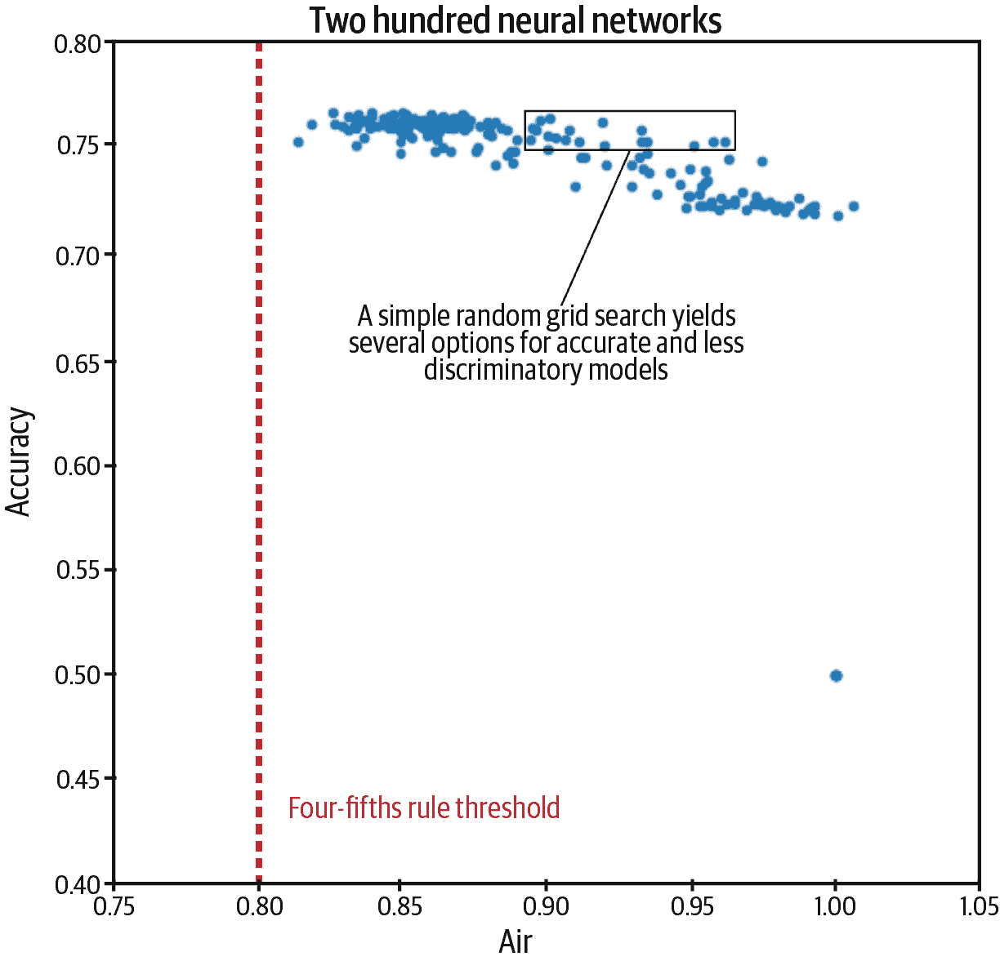

# 第四章：技术：工程化机器学习以获取人类信任和理解

> “如果建筑师建造房子的方式像程序员建造程序一样，那么第一个啄木鸟来临将毁灭文明。”
> 
> Gerald M. Weinberg

机器学习的人类用户需要相信，任何由 ML 系统做出的决策都是最大限度地准确、安全和稳定的，并且尽可能少歧视性。我们可能还需要理解 ML 系统做出的任何决策，用于合规性、好奇心、调试、上诉或覆盖的目的。本章讨论了许多技术，可以帮助组织在其 ML 系统中建立人类信任和理解。我们将首先触及可重现性，因为没有可重现性，你将永远不会知道你的 ML 系统今天是否比过去更好或更差。然后，我们将继续讨论可解释模型和事后解释，因为对 ML 系统机制的解释能力使得能够调试质量、歧视、安全性和隐私问题。在介绍了一些这些调试技术之后，我们将用简要讨论 ML 中的因果关系来结束本章。

# 可重现性

建立可重现的基准来衡量在准确性、公平性、可解释性、隐私性或安全性方面的改进（或退化），对于应用科学方法至关重要。在某些情况下，可重现性也可能是法规遵从的必要条件。不幸的是，ML 工作流程的复杂性使得可重现性成为一个真正的挑战。本节介绍了一些增加组织 ML 系统可重现性的指导方针。

## 元数据

ML 系统的元数据允许数据科学家跟踪导致部署模型的所有模型工件（例如数据集、预处理步骤、模型、数据和模型验证结果、人类签署和部署细节）。下面介绍的许多额外的可重现性步骤只是跟踪 ML 系统元数据的特定方式。跟踪元数据还允许在发生 AI 事件时追溯出问题所在，贯穿整个 ML 生命周期。关于用于跟踪元数据的一个开源示例，请查看[TensorFlow 的 MLMD](https://oreil.ly/BXUa8)。

## 随机种子

ML 模型受到所谓的“优秀模型的多样性”或“拉书门效应”的影响。与更传统的线性模型不同，这意味着对于任何给定的数据集，可以有大量可接受的 ML 模型。ML 模型还利用随机性，这可能导致意外结果。这些因素共同导致在 ML 模型中实现可重现结果比传统统计学和软件工程更加困难。幸运的是，几乎所有现代化、高质量的 ML 软件都带有一个“种子”参数，可以帮助提高可重现性。种子通常在每次算法内部的随机数生成器中的相同位置开始。种子的关键在于了解它们在不同软件包中的工作方式，然后保持一致地使用它们。

## 版本控制

ML 代码通常非常复杂，并且通常依赖于许多第三方库或软件包。当然，您的代码以及第三方代码的更改可能会改变 ML 系统的结果。系统地跟踪这些变化是提高可重复性、透明性和您的理智的另一种好方法。Git 和 GitHub 是免费且无处不在的软件版本控制资源，但还有很多其他探索的选择。确保正确版本的某些 ML 库在任何 ML 应用中也非常重要，因为不同版本的 ML 库可能导致性能和准确性的差异。因此，确保记录和控制使用的每个库的版本通常会导致更好的可重复性。还要记住，跟踪大型数据集和其他与 ML 相关的工件的变化与跟踪代码变化是不同的。除了我们在下一小节讨论的一些环境工具之外，还可以查看 [Pachyderm](https://oreil.ly/_rW-F) 或 [DVC](https://dvc.org) 进行数据版本管理。

## 环境

ML 模型在由软件、硬件和运行程序确定的环境中进行训练、测试和部署。确保在训练、测试和部署 ML 模型期间保持一致的环境至关重要。不同的环境很可能对可重复性有害（并且手动处理将非常痛苦）。幸运的是，现在有许多工具可供数据科学家和 ML 工程师保留他们的计算环境。例如，被称为 ML 的通用语言的 [Python](https://oreil.ly/Z4aSC) 现在包括用于保留编码环境的虚拟环境。

虚拟机和最近的容器提供了一个机制，可以复制整个软件环境，这是 ML 系统运行的环境。在 ML 方面，容器框架非常流行。它可以保留模型训练时的确切环境，并且可以在不同硬件上运行，这对于可重复性和简化 ML 系统部署非常有利！此外，甚至专门开发了专用软件来处理数据和 ML 工作流程中的环境可重复性问题。请查看 [Domino Data Lab](https://oreil.ly/Hv_bJ)，[Gigantum](https://gigantum.com)，[KubeFlow Pipelines](https://oreil.ly/8KYIC)，以及 [TensorFlow Extended](https://oreil.ly/GeRpb)，了解这些专业产品的样貌。

## 硬件

硬件是不同物理组件的集合，使计算机能够运行，从而允许 ML 代码运行，最终实现 ML 系统的训练和部署。当然，硬件对 ML 系统的可重复性有重大影响。硬件和 ML 可重复性的基本考虑包括确保在训练和部署 ML 系统之间使用的硬件的相似性，并通过关注可重复性来测试不同硬件上的 ML 系统。

综合考虑这些因素以及稍后在第四章讨论的基准模型，数据科学家、机器学习和数据工程师以及其他 IT 人员应该能够增强组织的机器学习可重现性能力。这只是提高机器学习责任性的第一步，但也应该导致更快乐的客户和在机器学习系统生命周期内更快速的机器学习产品交付。一旦你知道你的机器学习系统站在稳固的基础上，接下来的重要技术步骤就是开始应用可解释和可解释的机器学习技术，以便你能够确切地了解你的系统如何工作。

# 可解释的机器学习模型和可解释的人工智能

可解释性是减少机器学习风险的另一个基本要求。在一个你不理解的黑箱系统中，要减少风险就更加困难。因此，解释性能够完全调试。解释性还对于人类从机器学习结果中学习、使人类能够申诉和覆盖机器学习结果以及通常用于合规性方面至关重要。如今，有许多增强机器学习解释性的方法，但它们通常可以分为两大类：可解释机器学习模型和事后解释技术。

## 可解释模型

几十年来，所谓的“准确性-可解释性的权衡”非正式信念使得大多数机器学习的研究者和从业者将他们的模型视为准确但晦涩难懂的黑匣子。近年来，来自领先机器学习学者的论文和几项实证研究开始严重质疑这种被认知的权衡。¹ 出现了大量关于新机器学习算法的论文和软件，这些算法是非线性的、高度准确的，并且直接可解释。而且，“可解释性”作为一个术语，越来越多地与这类新模型联系在一起。

新的可解释模型通常是旧的机器学习算法的贝叶斯或受约束的变体，例如附带本报告的[在线资源](https://oreil.ly/Vpi8m)中展示的可解释神经网络（XNN）。在这个例子中，模型的架构受限以使其更易于人类操作员理解。

解释性的另一个关键概念是，它不是一个二进制的开关。而 XNN 可能是一些最复杂的可解释模型之一。可扩展的贝叶斯规则列表，就像其他一些可解释模型一样，可以创建对业务决策者来说可能足够可解释的模型架构和结果。这些可解释机器学习模型的其他有趣示例包括：

+   可解释提升机（EBMs，也称为 GA2M）

+   单调约束梯度提升机

+   Skope-rules

+   超稀疏线性整数模型（SLIMs）

+   RuleFit

下次开始机器学习项目时，特别是涉及标准结构化数据源时，请评估其中一种准确和可解释的算法。希望您会感到愉快惊讶。

## 后验解释

**后验解释**是在机器学习模型训练后生成的模型机制和结果摘要。有时这些技术也被称为可解释人工智能（XAI）。这些技术可以大致分为：

本地特征重要性测量

例如，**Shapley values**、**integrated gradients** 和 **counterfactual explanations**。有时也被称为“本地”解释，这些解释可以告诉用户每行数据中每个输入特征对模型结果的贡献。这些度量方法在美国金融服务行业中生成不利行动通知也至关重要。

代理模型

例如，局部可解释模型无关解释（LIME）或锚点。这些技术是更复杂的机器学习模型的简化模型，可用于推理更复杂的机器学习模型。

机器学习模型结果的可视化

例如，变量重要性、累积局部效应、个体条件期望和部分依赖图。这些图表帮助将机器学习模型结果的许多不同方面总结为可消化的可视化。它们对美国金融服务应用程序中的模型文档要求也很有帮助。

这些后验解释技术中的许多技术可以应用于传统的机器学习黑盒模型，以增加其可解释性，但使用这些技术时也必须小心。它们已知的缺点包括忠实度、一致性和可理解性。忠实度指的是解释的准确性。一致性指的是如果对训练数据或模型规格进行小的更改，解释会发生多大变化。可理解性指人类理解生成的解释的程度。在使用 XAI 技术时必须仔细考虑所有这些缺点。可能最好的使用后验解释的方式之一是使用受限和可解释的机器学习模型。约束和固有的可解释性可以平衡与后验解释有效性相关的问题。将可解释的模型架构与后验解释配对还为有效的模型调试和机器学习系统测试奠定了基础。

# 模型调试和测试机器学习系统

尽管存在很多正面宣传，但机器学习系统并没有让它们免受影响传统软件系统的漏洞和攻击。事实上，由于其复杂性、漂移特性和固有的随机性质，机器学习系统可能比传统软件更容易遭受此类事件的影响。直截了当地说，当前的模型评估技术，如交叉验证或接收器操作特性（ROC）和提升曲线，仅仅不能充分告诉我们在公共面向、组织性信息技术系统中部署机器学习模型时可能发生的所有事件。

这就是模型调试的关键。模型调试是一种专注于发现和修复机器学习系统问题的实践。除了一些新颖的方法外，这一学科还借鉴了模型治理、传统模型诊断和软件测试的技术。模型调试试图像测试计算机代码一样测试机器学习系统，因为机器学习模型几乎总是由代码构成的。它使用诊断方法来跟踪复杂的机器学习模型响应函数和决策边界，以便发现和解决机器学习系统中的准确性、公平性、安全性和其他问题。本节将讨论两种模型调试方法：将软件质量保证（QA）技术迁移到机器学习领域，以及需要专门技术来找到和修复机器学习系统复杂内部运作中的问题。

## 机器学习的软件质量保证

机器学习就是软件。通常情况下，在传统企业软件资产上进行的所有测试也应该在机器学习上进行。

###### 注意

这只是一个起点！在这份报告的其他部分，我们充分考虑了机器学习特殊风险。本小节旨在澄清，我们建议贵组织在传统软件资产上进行的所有测试也应该在机器学习系统上进行，并继续解决机器学习系统所面临的各种风险。是的，这是一项艰巨的工作。伴随着巨大的力量，必然伴随着巨大的责任。

单元测试应该针对数据处理、优化和训练代码编写。集成测试应用于机器学习系统的 API 和接口，以发现不匹配和其他问题。功能测试技术应用于机器学习系统的用户界面和端点，以确保系统行为符合预期。将部分测试流程和基准测试整合到持续集成/持续部署（CI/CD）过程中，可以实现效率提升，甚至提高机器学习软件的质量。要了解更多关于简单质量保证和模型调试的信息，请参阅 Google 的免费课程，[机器学习中的测试和调试](https://oreil.ly/jTAeg)。

## 机器学习的专业调试技术

机器学习确实提出了超越传统软件的一些问题。正如其他报告部分所讨论的，机器学习带来了一些非常专业的歧视、隐私和安全问题。机器学习系统也可能出错。在一个[著名的案例](https://oreil.ly/SCR0v)中，一个医疗风险系统断言哮喘患者死于肺炎的风险比其他人低。在[另一个令人震惊的例子](https://oreil.ly/Gwo6P)中，一辆自动驾驶汽车被发现无法处理横穿马路的情况。它导致了一起人身伤亡事故。

发现这些类型的错误确实需要一些专门的方法，但对于高风险的机器学习部署来说是绝对必要的。在机器学习系统中找到错误的实用技术往往是敏感性分析和残差分析的变体。敏感性分析涉及模拟数据并测试模型在该数据上的性能。残差分析是对训练时模型错误的仔细研究。这两种技术与基准模型、歧视测试和安全审计结合使用，可以找出机器学习系统中的逻辑错误、盲点和其他问题。当然，一旦发现了错误，就必须加以修复。在这方面也有很多好的选择，包括数据增强和[model assertions](https://oreil.ly/tRxp9)以及[editing](https://oreil.ly/WxbZy)等。有关当代模型调试技术的摘要，请参阅[*Why You Should Care About Debugging Machine Learning Models*](https://oreil.ly/e4EW9)。有关调试消费信贷模型的代码和示例，请查看[*Real-World Strategies for Model Debugging*](https://oreil.ly/oZpez)。下一节将继续探讨模型调试的主题，并更详细地介绍基准模型。

# 基准模型

基准模型是简单、可信或透明的模型，可以用来与机器学习系统进行比较。它们在典型的机器学习工作流程中服务于多种风险缓解目的，包括在模型调试和模型监控中的使用。

## 模型调试

首先，检查一个新的复杂机器学习模型是否优于一个更简单的基准模型总是一个好主意。一旦机器学习模型通过了这个基准测试，基准模型可以作为调试工具。使用它们来通过问问题的方式测试你的机器学习模型，比如，“我的机器学习模型犯了什么错误，而我的基准模型没有犯错？我能看到原因吗？”基准模型还可以用于追踪复杂机器学习管道中的变化。在新的训练过程开始时运行基准模型可以帮助确认你正在稳定的基础上开始。在进行更改后再次运行相同的基准模型可以帮助确认这些更改是否真正改进了机器学习模型或管道。此外，将基准模型作为 CI/CD 流程的一部分自动运行，可以帮助理解代码更改如何影响复杂的机器学习系统。

## 模型监控

作为模型监控的一部分，将简单的基准模型与机器学习系统预测进行比较，可以帮助及时捕捉稳定性、公平性或安全性异常。由于其简单的机制，一个可解释的基准模型应该更加稳定，更容易确认为最小歧视，并且更难以被攻击。因此，想法是在对新数据进行评分和您的更复杂的机器学习系统时使用高度透明的基准模型。然后将您的机器学习系统的预测结果与一个可信的基准模型进行比较。如果您的更复杂的机器学习系统与基准模型之间的差异超过了某个合理的阈值，那么就退回到发布基准模型的预测结果或者将该数据行发送到手动处理。同时记录此事件。这可能在以后会变得有意义。（应当提到，在生产环境中比较机器学习模型与基准模型的一个问题是评分新数据所需的时间，即增加的延迟。）

鉴于基准模型能够提供的众多好处，我们希望您考虑将它们加入到您的训练或部署技术栈中。

# 歧视测试和补救

另一个关键的模型调试步骤是歧视测试和补救。在过去几十年中，已经投入了大量的工作来进行这些实践。歧视测试的方法涵盖了从简单的算术运算到具有长期法律先例的测试，再到前沿的机器学习研究。用于补救歧视的方法通常可以分为两大类：

1.  作为标准机器学习模型选择的一部分，跨可能的算法和特征规格进行搜索。

1.  尝试在训练数据、机器学习算法以及机器学习系统输出中尽量减少歧视。

这些内容将在下面更详细地讨论。虽然在选择用于歧视测试和补救的合适工具时通常很困难且具有上下文敏感性，但机器学习从业者必须付出这种努力。如果你正在使用有关人员的数据，那么这些数据可能编码了历史上的歧视，这将在你的机器学习系统结果中得到体现，除非你找到并修复它。本节将介绍歧视测试和补救的基础知识，希望能帮助您的组织在对抗这个严重问题上迈出第一步。

## 歧视测试

在进行机器学习歧视测试时，需要注意的两个主要问题是：群体差异和个体差异。群体差异发生在某种度量上模型的结果在不同人口群体之间是不公平的，或者当模型在不同的人口群体之间展示出不同的准确率或错误特征时。大多数开源软件包测试这些类型的差异。

个体不平等是一个更加棘手的概念，如果您刚开始测试 ML 中的歧视，可能不是您的首要任务。基本上，个体不平等是指模型在所有方面都相似但某些人口统计信息不同的个体间有不同对待的情况。在 ML 中，这可能出现的原因有很多，例如过于复杂的决策边界，导致历史上被边缘化的人口统计群体的个体被置于 ML 决策结果的有害一侧而没有充分理由。当 ML 系统学习将某些输入数据特征组合起来创建某人独特的人口统计信息的代理特征时，也可能发生这种情况。

虽然寻找反事实或对抗性示例的功能变得越来越普遍（例如，谷歌的“什么如果”工具），测试个体不平等通常比测试群体不平等更为复杂。今天，需要做一些侦察工作，查看数据中的许多个体，训练对手模型或使用特殊训练约束条件，跟踪决策边界，并使用事后解释技术来理解模型中的特征是否是人口统计变量的局部代理。当然，做所有这些额外的工作绝对是个好主意，因为它可以帮助您了解 ML 系统中歧视的驱动因素，无论是群体不平等还是局部不平等。这些额外步骤后续可以用于您的 ML 训练过程，以确认任何应用的纠正措施是否真正成功。

## 修复发现的歧视问题

如果您在您的 ML 系统中发现歧视问题，您该怎么办？好消息是，您至少有两种主要的纠正策略可供应用——一种是经过验证的传统策略，另一种则更具前沿性，但在受监管行业中也可能稍显风险。我们将在下面详细介绍这些策略。

### 第一种策略

第一种策略是传统策略（从美国监管的角度来看也是最安全的）。确保在模型训练中不使用任何人口统计特征，并简单地检查各种候选 ML 模型的标准歧视度量（如不利影响比例或标准化均差）。然后选择最不歧视的且足够准确以满足业务需求的模型。这通常是今天在像贷款和保险这样高度受监管的领域中使用的策略。

图 4-1 展示了在 ML 模型选择过程中考虑歧视度量（例如在本例中非裔美国人与白人之间的不利影响比例）如何帮助找到准确且较少歧视的模型。在 AIR 通常伴随四分之五规则的实际显著性检验，即历史上被边缘化的人口统计群体的正面结果与参考群体（通常是白人或男性）的正面结果比例应大于 0.8 或四分之五。

###### 图 4-1\. 用于神经网络模型的随机网格搜索，结果在质量和公平性维度上绘制（Patrick Hall 提供）。结果显示，在这种情况下，可以找到高质量、低歧视的模型。我们只需要去寻找它们。

### 策略 2

策略 2 包括机器学习、计算机科学和公平性研究社区的最新方法。

#### 修复你的数据

今天，在监管较少的工业部门，你可能会能够使用软件包，帮助您重新采样或重新加权数据，以减少在机器学习模型训练中带入的歧视性。另一个关键考虑因素是简单地收集代表性数据；如果计划在某一人群中使用机器学习系统，应收集准确代表该人群的数据。

#### 修正你的模型

机器学习研究人员已经开发出许多有趣的方法来减少机器学习模型训练过程中的歧视。其中一些方法甚至可能在高度监管的环境中是可接受的，但在深入投资某种技术之前，请务必与您的合规或法律部门协商。

正则化

从监管角度来看，最激进且可能最冒险的方法是保留人口统计特征在机器学习模型的训练和决策过程中，但使用专门的方法试图规范化或降低其在模型中的重要性。

双重优化

在双重优化方法中，人口统计特征通常不用于机器学习系统的决策过程。但是，在机器学习模型训练过程中，它们被用来降低可能导致更多歧视结果的模型机制的权重。如果你小心的话，双重优化方法可能在一些受美国监管的环境中是可以接受的，因为人口统计信息在技术上并未用于决策过程中。

对抗去偏差

在对抗性去偏见中，两个模型相互竞争。一个机器学习模型将成为您的机器学习系统内部用于决策的模型。这个模型通常不能访问任何显式的人口统计信息。另一个模型是一个对手模型，在训练后被丢弃，它可以访问显式的人口统计信息。训练过程首先适应主模型，然后查看对手是否能准确预测出来自主模型预测的人口统计信息。如果对手可以，主模型使用来自对手的信息（但不是显式的人口统计信息）来降低其训练数据中任何隐藏的人口统计信息的权重。这种来回交互将继续，直到对手不能再基于主模型的预测来预测人口统计信息为止。像双目标方法一样，对抗性去偏见在一些受美国监管的环境中可能是可以接受的。

#### 修正你的预测

基于低置信度预测或影响历史上被边缘化的人口群体的有害决策可以提交进行人工审查。也可以直接更改您的机器学习预测，以通过某种措施减少机器学习系统的歧视性。这可能适用于已在运行中的存在歧视问题的机器学习系统，因为在某些情况下，可以在不重新训练系统的情况下减少歧视。但这种过激的干预措施也可能在美国消费金融垂直领域引起监管关注。

如您所见，有许多方法可以发现和修正您的机器学习系统中的歧视问题。使用它们，但要小心。没有歧视测试和纠正，您的机器学习系统可能会持续进行有害的、不准确的，甚至是非法的歧视。使用这些技术，您仍然需要监视系统在不断变化的实时数据中的结果，以及注意意外副作用。正如在下一节讨论的那样，机器学习系统可能会遭受攻击，在一个著名的例子中，[被黑客攻击以产生歧视性](https://oreil.ly/0PwIl)。或者旨在减少歧视的干预最终可能会[在长远中造成伤害](https://oreil.ly/88evP)。

# 保护机器学习

各种机器学习软件工件，机器学习预测 API 和其他机器学习端点现在可以成为网络和内部人员攻击的向量。这些机器学习攻击可以抵消**所有**机器学习团队为减少风险所做的努力。毕竟，一旦你的模型受到攻击，它就不再是你的模型了。攻击者可能对准确性、歧视、隐私或稳定性有自己的议程。本节将简要概述目前已知的机器学习攻击以及团队可以采取的一些基本防御措施来保护您的人工智能投资。

## 机器学习攻击

当今的机器学习系统面临一般攻击，这些攻击可能影响任何公共面向 IT 系统；专门攻击利用内部人员对数据和机器学习代码的访问权；外部访问机器学习预测 API 和端点；以及可以隐藏在第三方机器学习工件中的特洛伊木马。

### 一般攻击

机器学习系统面临分布式拒绝服务（DDOS）攻击和中间人攻击等黑客攻击。

### 内部攻击

恶意或勒索的内部人员可以更改机器学习训练数据以操纵机器学习系统的结果。这被称为数据污染。他们还可以修改用于评分新数据的代码，包括创建后门，以影响机器学习系统的输出。（这些攻击也可以由未经授权的外部对手执行，但通常被视为内部人员更现实的攻击向量。）

### 外部攻击

几种类型的外部攻击涉及使用奇怪的数据命中机器学习端点，以更改系统的输出。这可以简单地使用奇怪的输入数据，即所谓的对抗性示例，来操纵机器学习系统的结果。或者这些攻击可以更具体，比如冒充他人的数据，或使用调整自己的数据以逃避某些基于机器学习的安全措施。另一种外部机器学习攻击类型涉及按设计使用机器学习预测端点，即简单地向机器学习端点提交数据，并接收预测结果。但是，与将提交的数据和接收的预测用于合法业务目的不同，这些信息被用于窃取机器学习模型逻辑并推理、甚至复制敏感的机器学习训练数据。

### 特洛伊木马

机器学习系统通常依赖于许多第三方和开源软件包，以及近期大型预训练架构。这些都可能包含恶意载荷。

伴随本报告的[在线资源](https://oreil.ly/Vpi8m)提供了一些机器学习攻击的示例图解。这些示例是讨论的内部和外部机器学习攻击的视觉总结。要获取大多数已知攻击的优秀概述，请参阅[Berryville Machine Learning Institute’s Interactive Machine Learning Risk Framework](https://oreil.ly/EXYuN)。

## 防范措施

鉴于机器学习系统的攻击多样性，您现在可能想知道如何保护您的组织的机器学习和人工智能模型。您可以采取几种对策，并与第三章中提议的流程——漏洞赏金、安全审计和红队测试——配对使用，这些措施更有可能有效。此外，还有对抗性机器学习和强健机器学习等新的子学科正在对这些主题进行全面学术研究。

本报告的这一部分将概述一些最基本的防御措施，以帮助您使您的 ML 系统更加安全，包括一般措施、安全模型监控以及内部攻击的防御措施。此外，请务必关注安全、对抗性和强健性 ML 领域的新工作，因为这一主题正在迅速发展。

### 基础知识

尽可能要求消费者进行身份验证以访问预测结果或使用 ML 系统。此外，针对大规模或异常请求，限制系统响应时间也非常重要。这两项基本的 IT 安全措施在阻碍外部攻击方面发挥了重要作用。

### 模型调试

使用敏感性分析和对抗性示例搜索来分析您的 ML 系统对不同类型数据的响应方式。如果发现您的模型可能受某些输入数据影响而被操纵，要么重新用更多数据、约束和正则化重新训练您的模型，要么警告负责模型监控的人员注意发现的漏洞。

### 模型监控

正如报告中其他地方所讨论的，模型通常会因准确性下降而进行监控。但是，模型也应该监控对抗性攻击。因为模型可能会遭到攻击以使其具有歧视性，所以如果可能的话，应进行实时歧视性测试。除了监控准确性和歧视性外，还应注意异常输入，例如不现实的数据、随机数据、重复数据和训练数据，以帮助捕捉外部对抗性攻击。最后，还讨论了在其他章节中也讨论过的一般策略，即实时比较 ML 系统结果与更简单基准模型结果。

### 阻挠恶意内部人员

严格应用[最低权限概念](https://oreil.ly/EZ_d4)，即确保所有人员——甚至“摇滚巨星”数据科学家和机器学习工程师——仅获得最低限度的 IT 系统权限，是防范内部机器学习攻击的最佳方式之一。其他策略包括对 ML 系统的数据和代码进行仔细控制和文档化，以及残留分析，以发现内部人员或其密切关联者的奇怪预测。

ML 安全的其他关键点包括隐私增强技术（PETs），用于模糊和保护训练数据，并准备 AI 事件响应计划的组织。如第三章中提到的，将一些防御策略并培训如何及何时使用它们，纳入组织的 AI 事件响应计划中，可以提高整体 ML 安全性。至于 PETs，下一节将详细介绍它们。

# 用于机器学习的隐私增强技术

保护隐私的 ML 是另一个研究子学科，对 ML 的负责实践有直接影响。从这一领域中一些最有前景和实用的技术包括联邦学习和差分隐私。

## 联邦学习

联邦学习是一种跨多个分散的边缘设备或服务器进行机器学习算法训练的方法，这些设备或服务器保存本地数据样本，而无需交换原始数据。这种方法不同于传统的集中式机器学习技术，后者要求所有数据集上传到单个服务器。联邦学习的主要好处在于，它能够在不共享数据的情况下构建强大的机器学习模型。联邦学习通过在本地数据样本上训练本地模型，并在服务器或边缘设备之间交换参数来生成全局模型，然后所有服务器或边缘设备共享这个全局模型。假设采用安全的聚合过程，联邦学习有助于解决基本的数据隐私和数据安全问题。

## 差分隐私

差分隐私是一种通过描述数据集中群组的模式来共享信息的系统，而不披露特定个体的信息。在机器学习工具中，通常使用专门的类型的[differentially private learning algorithms](https://oreil.ly/QLeQM).²来实现这一点。这使得从训练数据或训练模型中提取敏感数据变得更加困难。事实上，如果外部观察者无法确定个体信息是否被用于训练模型，那么一个机器学习模型被称为差分隐私模型。（这听起来非常适合防止前一节描述的数据提取攻击！）

联邦学习、差分隐私和机器学习安全措施可以共同发挥作用，为您的机器学习系统增加额外的隐私和安全层。尽管它们会增加额外的工作量，但对于高风险或关键任务的机器学习部署来说，它们很可能是值得考虑的。

## 因果关系

我们将结束我们对负责任的 ML 技术讨论，并谈到因果关系，因为建模某种现象的因果驱动因素，而不是复杂的相关性，可能有助于解决我们提出的许多风险。相关性并非因果关系。几乎所有当今流行的 ML 方法都依赖于相关性，或者是该概念的某种更局部化的变体，从数据中学习。然而，数据既可以相关又可能误导。例如，在前面讨论的著名哮喘患者例子中，患哮喘与更多的医疗关注相关，而不是低风险死于肺炎。此外，在歧视测试和修复中的一个主要关注点是 ML 模型学习与人口统计特征的复杂相关性，而不是真实关系。直到 ML 算法能够学习这样的因果关系，它们将受到这类基本逻辑缺陷和其他问题的影响。幸运的是，像马尔可夫链蒙特卡洛（MCMC）抽样、贝叶斯网络以及各种因果推断框架开始出现在商业和开源软件的 ML 包中。更多创新可能正在路上，因此请关注数据世界的这一重要领域。

除了严格的因果推断方法之外，您现在可以采取的步骤是将因果概念纳入您的 ML 项目中。例如，增强可解释性和模型调试可以导致一种“穷人的因果关系”，其中调试用于查找 ML 模型中的逻辑缺陷，并使用模型断言、模型编辑、单调性约束或交互约束等修复技术来修复缺陷，配合人类领域知识。根本原因分析也是高风险 ML 工作流程的重要补充。可解释的 ML 模型和事后解释技术现在可以指示 ML 模型行为的原因，这些可以由人类案件工作者确认或否认。然后，这些发现可以纳入下一次迭代的 ML 系统中，希望改进多个系统 KPI。当然，所有这些不同的建议都不能替代真正的因果推断方法，但它们可以帮助您朝着这个目标取得进展。

¹ 请参阅[*https://oreil.ly/gDhzh*](https://oreil.ly/gDhzh)和[*https://oreil.ly/Fzilg*](https://oreil.ly/Fzilg)。

² 另请参阅[*https://oreil.ly/ESyqR*](https://oreil.ly/ESyqR)。
