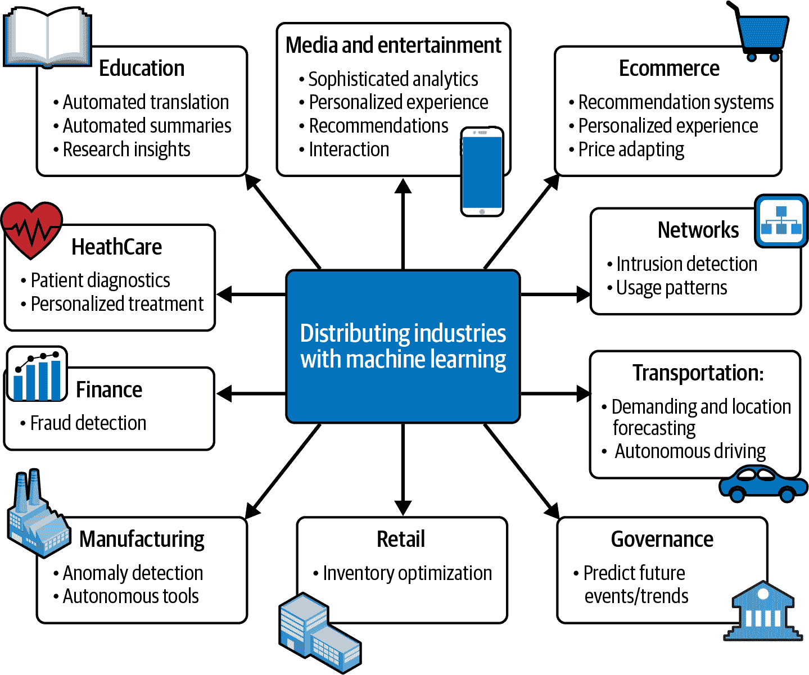
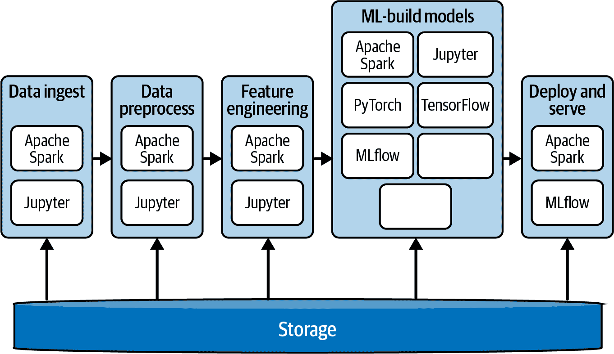
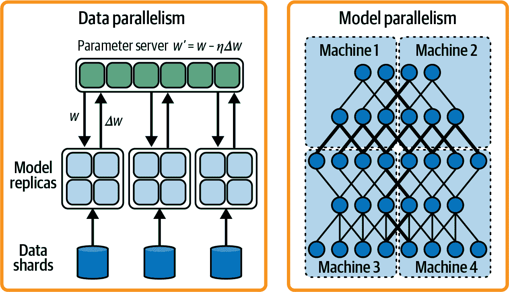
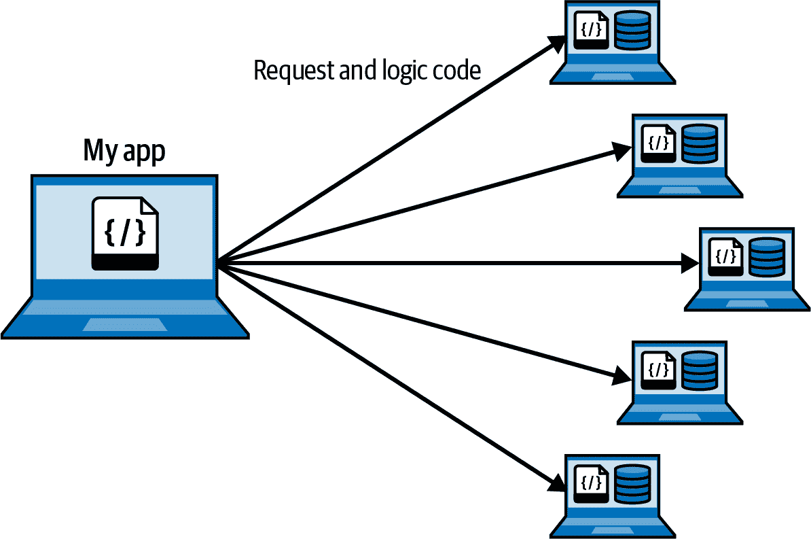
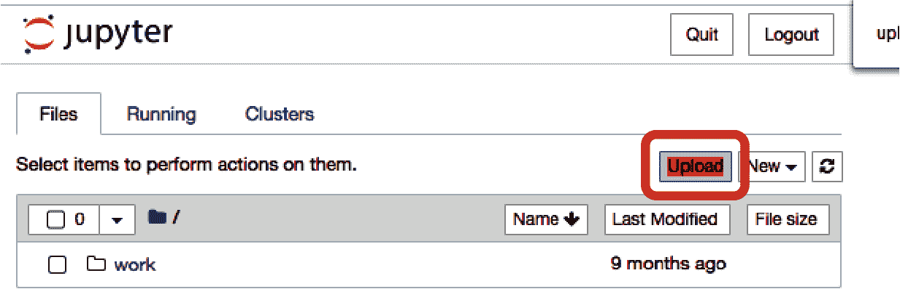
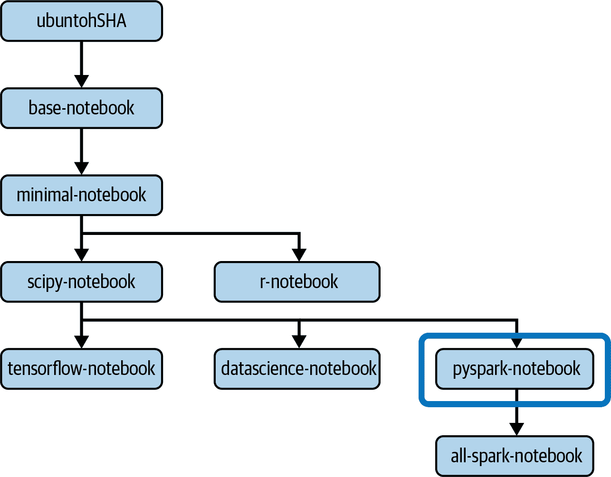
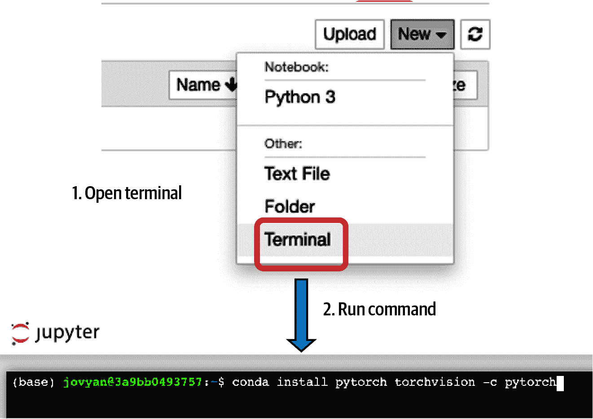

# 第一章：分布式机器学习术语和概念

记得以前数据科学家在笔记本电脑内存中运行他们的机器学习算法吗？或者生成他们自己的数据？这并不是因为世界上缺乏数据；我们已经进入了赛博字节时代。¹ 对于许多人来说，数据是存在的，但它被锁在生产系统中，这些系统以大规模创建、捕获、复制和处理数据。数据科学家知道，获得这些数据将使他们能够产生更好、更深刻的机器学习模型。但这不是唯一的问题——计算呢？在许多情况下，数据科学家没有足够的计算能力或工具来支持在大数据集上运行机器学习算法。因此，他们不得不对数据进行抽样，并使用 CSV 或文本文件进行工作。

当公共云革命在 2016 年至 2017 年左右爆发时，我们终于能够获得所需的计算能力。我们只需要一张信用卡和一只鼠标。按下一个按钮，哇哦，数百台机器都可以使用了！但是，我们仍然缺乏适当的开源工具来处理大量数据。需要分布式计算和具有健全生态系统的自动化工具。

数字化增长，即企业利用数字技术改变其业务模式并创造新的收入流和价值产生机会，增加了数据科学家的挫折感。数字化导致更多的数据可用，但由于缺乏工具，数据科学家无法快速处理这些数据。长时间等待尝试一个机器学习算法或获取生产数据样本的繁琐过程阻碍了许多人实现其全部潜力。改进和自动化的需求日益增加。

小公司看到更大公司通过为客户提供自动化、个性化解决方案对其业务产生了积极影响，改善了情感并增加了收入。从幻想到现实，机器学习成为了一种热门商品。公司们意识到，要利用它，他们需要更多的工具，并且需要内部团队来构建这些工具，这反过来增加了对工程师的需求，以构建可靠、可扩展、加速和高性能的工具来支持机器学习工作负载。

Netflix，全球领先的互联网电视网络，每天流传数亿小时的内容，表示它在业务的各个方面广泛使用机器学习。这包括为客户推荐个性化内容，在 Netflix 工作室优化电影和节目制作过程，优化视频和音频编码，以及改进广告支出和广告创意，以触及新的潜在客户。

机器学习不仅在技术型企业中找到了应用，而且在广泛的行业中都有应用。Shell plc 跨国石油和天然气公司的数据科学家和分析团队利用大规模数据集上的机器学习来支持业务，提供关于产品机会和流程优化的见解，并测试不同行动方案的有效性。其中一个例子是他们的库存预测模型，该模型在所有零件和设施上运行了[超过 10,000 次模拟](https://oreil.ly/pgrJZ)，预测需求并改善库存。Shell 还利用机器学习为其客户忠诚计划 Go+提供推荐引擎，为个体客户提供个性化的优惠和奖励。这种方法为 Shell 提供了一个增强的参与模型，通过满足客户的特定需求来帮助保留客户。

其他行业利用机器学习进行欺诈检测、推荐系统、患者诊断等。查看图 1-1 可以了解如何在您的行业中利用机器学习推动创新。

正如这些例子所示，利用大数据集来创建具有实证业务影响力的解决方案，对许多寻求业务增长和提高收入的公司来说是一种启发。



###### 图 1-1\. 机器学习在各行业中的众多应用示例

计算机科学和工程研究社区在实现可扩展机器学习方面发挥了重要作用。近年来，学术研究人员已经进行了数百甚至数千项关于使用机器学习、分布式计算和数据库以及构建更智能、更高效算法的研究。因此，通用的分布式平台应运而生，比如极其流行的 Apache Spark。Apache Spark 提供了一个可扩展的通用引擎，用于分析和机器学习工作负载。与此同时，为了在分布式环境中执行工作负载，各种支持单机器工作负载的机器学习库团队不断增加了后端支持能力。举几个例子，Google 的 TensorFlow 已经增加了支持分布式机器学习的额外功能，用于简化深度神经网络工作负载，而 Facebook 的 PyTorch 用于计算机视觉和自然语言处理，也在不断增强其支持分布式机器学习的后端支持能力。

在本书的整个过程中，我们将专注于使用 Apache Spark，并向您展示如何通过它进入基于 TensorFlow 和 PyTorch 的分布式机器学习。本书最后讨论了机器学习部署模式在第十章。为了让您快速入门，本章介绍了分布式机器学习的基本概念、术语和构建模块。我们将涵盖以下基础知识：

+   机器学习工作流程

+   Spark MLlib

+   分布式计算

+   分布式系统

对这些概念熟悉了吗？我们将在第二章中介绍 Spark 和 PySpark，以及在第三章中管理机器学习生命周期。

兴奋了吗？让我们开始吧！

# 机器学习工作流程的阶段

如今许多应用程序是由机器学习驱动的，使用机器学习模型来回答诸如：如何让我的应用程序自动适应客户的需求？如何自动化这个繁琐的流程，让我的员工能够更有效地利用他们的时间？如何在不花费整年时间的情况下理解我的数据堆？然而，作为数据从业者，我们只需回答一个问题：如何使整个过程能够回答这些问题？

简短的答案是机器学习。更全面的回答是机器学习工作流程。

机器学习工作流程包括一系列阶段，帮助我们实现将机器学习模型投入生产并解决业务问题的目标。什么是机器学习模型？好问题！机器学习模型是机器学习算法的输出。从现在开始，我们将简称其为模型。这个工作流程的自动化被称为机器学习管道。为了提高模型的准确性，工作流程是迭代的。这使得我们能够对模型——包括自动化、监控和部署——进行全面控制。

机器学习工作流程包括多个阶段，其中一些可以跳过，而另一些可能需要重复执行：

1.  *收集和加载/摄取数据。* 第一个阶段是收集所需的数据，并将其加载到执行机器学习实验的环境中。

1.  *探索和验证数据。* 接下来，探索您收集的数据并评估其质量。这个阶段通常涉及统计测试，测试训练数据如何代表真实世界事件，以及数据集的分布和多样性。这也被称为*探索性数据分析*（EDA）。

1.  *清理/预处理数据*。在第 2 阶段之后，您可能会得出结论，数据存在*噪音*。噪声数据集是指不对训练有任何贡献的列，例如具有空值或长字符串值的行。它们需要更多的处理能力，但并不提高模型的准确性。在这个阶段，数据科学家将对数据进行统计测试，验证特征之间的相关性，并分析哪些特征原样提供价值，哪些需要更多预处理或工程处理，以及哪些是多余的。

1.  *提取特征/执行特征工程*。前一阶段将数据列作为特征输出。这些是数据的描述符，作为机器学习模型的输入使用。机器学习中的特征通常是原始数据之外的内容，意味着我们需要用来自其他来源的数据丰富现有数据。这要求我们开发代码来计算和生成这些特征，并在训练模型之前用它们丰富数据集。有许多方法可以做到这一点，通常需要领域专业知识。或者，这些特征可能已经存在于另一个数据集中，这种情况下，我们只需将两个数据集合并成一个，然后再训练模型。

1.  *将数据分成训练集和验证集*。训练集用于训练机器学习模型，验证集用于评估模型在未见数据上的表现。

1.  *训练和调整模型*。将训练数据提供给机器学习算法，并调整参数以提高性能。使用专门的验证数据集验证结果。验证过程在开发环境中进行，可以是在本地机器上或云中的开发/实验环境中。这一阶段的结果是模型。

1.  *使用测试数据评估模型*。这是模型推向生产之前的最后测试阶段。在这个阶段，再次测量模型在之前未见数据上的表现，在生产环境中进行测试。在这一阶段之后，您可能需要返回并重新审视第 6 阶段。

1.  *部署模型*。在这个阶段，数据科学家与机器学习和生产工程师一起打包模型，并将其部署到生产环境中，并满足其所有要求。

1.  *监控模型*。在生产中，必须持续监控模型是否存在漂移（关于不同类型漂移的讨论详见第十章）。持续评估模型对业务的价值，并知道何时替换模型至关重要。

每个阶段都可以单独重复，并且可能会根据特定结果需要完成整个过程。例如，在模型漂移的情况下，数据和模型不再代表业务问题，您需要从头开始执行该流程。

每个阶段都是独特的，并且高度依赖于数据、系统需求、您的知识、使用的算法、现有基础设施和期望的结果。

阶段 3 到 6 通常被视为机器学习的实验阶段。您将希望反复迭代并生成数据和模型的多个版本，直到找到最佳版本的模型。

要了解更多关于使用 TensorFlow 和 TensorBoard 构建机器学习流水线并自动化它们的信息，请阅读《[*Building Machine Learning Pipelines*](https://oreil.ly/building-ml)》（由 Hannes Hapke 和 Catherine Nelson 撰写，O’Reilly 出版）。

# 机器学习流水线中的工具和技术

图 1-2 显示了机器学习流水线的概览以及可能在每个阶段使用的一些工具。



###### 图 1-2\. 机器学习流水线的高层视图及每个阶段使用的工具

在本书的教程中，我们将使用各种工具和平台来完成不同阶段的任务（当然，您可以选择用您选择的其他工具替换其中任何工具）。为了实验数据摄取、预处理和特征工程，我们将使用提供 UI 和后端服务器的 Jupyter。我们将在 UI 中的笔记本中编写代码，后端将其打包并发送到 Spark 引擎。

在模型构建阶段（对应于先前描述的机器学习工作流程中的第 6 和第 7 阶段），我们会训练、验证和调整模型。在此阶段，我们将使用多个服务器和后端，包括 Jupyter、PyTorch、TensorFlow、Horovod、Petastorm 和 MLflow，来编排操作、缓存数据，并将工作流从 Spark 集群转换为深度学习集群。

最后，为了部署和提供我们的模型，我们将使用 Spark 和 MLflow。我们将从 MLflow 存储服务器加载模型，并使用 Spark 或作为 Python 函数的 REST API 提供服务。

###### 注意

在大多数组织中，开发端到端的机器学习流水线需要一个专门的团队，团队成员具有各种技能集，以及一个集成开发环境（IDE）如 PyCharm，提供丰富的开发者工具和代码自动完成，专门用于持续集成/持续部署（CI/CD）的脚本等。出于本书的教育目的，我们将坚持使用 Jupyter 笔记本。

# 分布式计算模型

*分布式计算* 是使用*分布式系统*解决计算问题的技术，多台机器共同作为一个单一单位工作。在这样的系统中运行的程序称为*分布式程序*，编写这样的程序的过程称为*分布式编程*。这正是我们在本书中要做的事情。我们的目标是找到将问题划分为多个任务的最佳方法，这些任务可以通过消息通信并行解决。机器学习的不同分布式计算模型可以分为两类：可以调整以支持分布式机器学习应用的*通用*模型，以及专门设计用于运行机器学习算法的*专用*计算模型。

## 通用模型

通用分布式计算模型允许用户使用定义的抽象编写自定义数据处理流。Apache Spark 是一种通用分布式计算引擎，其核心实现了 MapReduce 编程模型，并最近扩展支持屏障模型。在本节中，您将了解这两种模型，以及一些其他分布式计算模型（MPI [消息传递接口] 和共享内存），这些模型在 TensorFlow 和 PyTorch 中都有提供。

### MapReduce

MapReduce 编程模型的灵感来自[函数式编程范式](https://oreil.ly/YrPPz)。Google 在 2004 年引入了 MapReduce 算法，该算法在研究论文中讨论了其搜索引擎如何处理大规模数据。作为开发人员或数据科学从业者，我们指定一个*映射*函数来处理键/值对，生成一组中间键/值对，以及一个*减少*函数来合并与同一中间键相关联的所有中间值。这种方法是数据分析中分割-应用-合并策略的扩展。在实践中，每个任务都被分成多个映射和减少函数。数据被分区和分布在各个节点/机器上，每个数据块在专用节点上进行处理。许多解决方案旨在尽可能保持数据的本地性，其中分区数据对于处理它的节点是本地的。在该节点上应用逻辑函数，然后执行网络上移动数据的洗牌操作，将来自不同节点的数据组合在一起，并对来自映射器的组合输出执行减少操作。

如果需要，可以对减少器的输出进行另一个分割-应用-合并循环。实现这些概念的开源解决方案的示例包括 Apache Spark、Hadoop MapReduce 和 Apache Flink。我们将在整本书中更详细地讨论 MapReduce 模型。

### MPI

另一个有趣的通用分布式计算模型是消息传递接口（Message Passing Interface，MPI）编程模型。这是目前最灵活的模型，旨在实现高性能、可伸缩和便携的分布式计算。MPI 是一种消息传递接口，用于在分布式内存系统上模拟并行程序的运行。它通过定义可在处理器之间发送的数据类型来标准化处理器集之间的通信。每个处理器都有唯一的标识符，而每个*通信器*是按特定拓扑顺序排序的一组处理器。MPI 是一个低级标准，可以在硬件、编译器、包装器等中实现。HP、Intel、Microsoft 等公司都已经商业化实现了不同版本的 MPI。

MPI 提供了像 `MPI_Bcast`（广播消息到通信器中的所有处理器，共享数据）、`MPI_Alltoall`（将所有数据发送到所有节点）、`MPI_Reduce` 和 `MPI_Allreduce`（类似于 MapReduce 和 Apache Spark 的 `reduce` 函数）等函数。您可以将这个接口视为分布式框架的构建块，提供了分布式机器学习功能。

MPI 的缺点在于其低级别的宽容性。使用 MPI 执行和实现复杂操作可能非常费力且容易出错；它要求显式管理数据类型分布、发送和接收功能以及容错，通常要求开发者考虑分布式数组、数据框架、哈希表、树等。MPI 经常用于深度学习工作负载。Horovod 的核心功能基于 MPI 概念，如 `size`、`rank`、`local_rank`、`allreduce`、`allgather` 和 `broadcast`。对于分布式计算，TensorFlow 提供了 MPI 的支持作为其通信协议的一部分。

### 屏障

屏障（barrier）是一种在并行计算中常用的同步方法，被实现在诸如 Apache Spark 等分布式计算框架中。任务或作业被分割成依赖阶段或子任务，在处理可以继续到下一个阶段之前需要完成这些阶段或子任务。屏障使得一组机器在某一点停止，并等待其他机器完成计算，然后它们可以共同前进到计算逻辑的下一个阶段。屏障模型可以在硬件和软件中实现，阶段可以采用许多形状，从有向无环图（DAG）到树形结构或顺序操作。

虽然它是一个通用的分布式计算模型，但屏障模型使得各种分布式机器学习算法得以实现。例如，在深度学习中，堆叠的人工神经网络中的每一层都是一个阶段，每个阶段的计算依赖于前一阶段的输出。屏障模型在这种情况下可以管理许多层次的训练。

### 共享内存

共享内存模型有着悠久的历史：它们起源于像 POSIX 和 Windows 这样的操作系统，这些操作系统中运行在同一台机器上的进程需要通过共享地址空间进行通信。分布式共享内存模型试图在分布式环境中满足同样的需求，当多个节点/用户在网络上通信并需要从各种机器上访问相同的数据时。今天，并不存在一个分区全局地址空间，而是提供强一致性的内存或快速数据库。

在分布式共享内存环境中，强一致性意味着所有进程和节点对数据的访问都是一致的。确保这一点并不容易。TensorFlow 的一个分布式策略实现了一个共享内存模型；你将在第八章中详细了解它及其优缺点。

## 专用分布式计算模型

专用的分布式计算模型是为支持机器学习开发周期中的特定需求而开发的模型。通常，它们利用通用模型作为构建块，以构建更易于使用的框架，数据科学从业者可以直接使用。您可以在 TensorFlow 和 PyTorch 中使用它们。

一个专用于机器学习工作负载的分布式计算模型示例是*参数服务器*。TensorFlow 作为其模型训练分布策略的一部分实现了这一点。参数服务器利用了共享内存的方法：您有一组专用的服务器来保证为工作节点提供一致的数据信息。这些参数是机器学习算法在其训练和重新训练生命周期中所需的权重和预计算特征。在某些情况下，这些参数可以适应一台机器的内存，但在实际应用场景中，当存在数十亿个参数时，需要一组参数服务器的集群。在我们讨论不同的 TensorFlow 分布式计算策略时，我们将详细讨论这一点，这将在第八章中进行。

随着研究和行业在分布式机器学习上的大量投资，更多的模型开发只是时间问题。随时关注新的发展始终是一个良好的实践。希望通过本书的结尾，您将拥有所有必要的工具和信息，以便对使用哪种分布式计算模型以及如何利用它来满足您企业的技术需求做出明智的决策。

现在您已经熟悉了这些概念，让我们来看看分布式机器学习架构的整体情况以及这些概念如何发挥作用。

# 分布式系统架构简介

我们将从简要讨论网络拓扑开始。*拓扑*是我们组织计算机形成分布式系统的方式。我们可以将其分为两种类型：*物理*拓扑描述了计算机如何排列和连接，而*逻辑*拓扑描述了数据在系统中的流动方式以及计算机如何通过网络交换信息。多节点计算机拓扑通常通过增加更多计算机（也称为节点）来物理扩展。

工程师们通常在最终架构讨论中讨论拓扑。架构需求源于项目的目标、数据、系统的行为以及正在使用的现有软件工具。对于数据科学家来说，主要目标是定义分布式模型训练方法以及模型将如何部署和提供服务。

###### 注意

在某些情况下，您可能会发现现有软件工具未能很好地满足项目需求，或者过于复杂而无法整合到解决方案中，因此您需要寻找或开发新的工具。这是一个我们在本书中不会探讨的高级场景。

形成分布式系统拓扑的节点通过网络连接在一起，这种特定的架构模式旨在提高负载处理能力并优化速度和资源使用。在设计阶段做出的架构选择将影响每个节点在拓扑中的角色，它们如何通信以及整个系统对故障的韧性。

除了理解分布式系统的物理拓扑外，您还应了解集中式和分散式系统之间的区别，计算机如何交互，支持的通信模式以及系统如何处理安全性和故障。在设计系统时，您可以将这些视为构建块。

## 集中式与分散式系统

在*集中式*系统中，所有节点依赖于单一节点做出决策。这样的系统在控制决策方面具有更大的优势，但由于决策节点成为单点故障，系统更容易遭受故障而导致整个系统崩溃。

在*分散式*系统拓扑中，节点是独立的并且自行做出决策。每个节点存储和操作自己的数据，因此没有单一的故障点。这意味着系统更能容忍故障；然而，这也意味着需要协调和调解各个节点做出的决策。

去中心化系统可以受益于多云/混合云架构，其中机器节点位于不同地区并与不同的云提供商合作。一个例子是连接的物联网（IoT）设备网络：每个设备是独立的，但根据其互联网连接，在网络上与其他设备和/或云共享数据。您选择的拓扑结构将影响设备可以使用的通信方法以及它们在网络中可能扮演的角色。当涉及训练模型时，去中心化方法意味着每个模型都在进行自己的训练。在本章后面，当我们研究整合方法时，我们将更多地讨论这种设计决策的影响。

## 交互模型

交互模型的架构定义了系统中的节点如何通过网络通信、他们在系统中的角色以及这些角色所带来的责任。在本节中，我们将介绍三种可能的架构：客户端/服务器、点对点和地理分布式。这里没有涉及的其他正在使用和开发中的架构，但这些是您最有可能遇到的。

### 客户端/服务器

在客户端/服务器交互模型中，责任有明确定义。任务在客户端之间分配，客户端发出请求，服务器提供对这些请求的响应。一个节点的角色可以根据系统的结构和需求而改变，但这取决于服务器是无状态的（不存储状态）还是有状态的（存储下一个操作所依赖的状态）。

### 点对点

在点对点（P2P）交互模型中，工作负载在节点或对等体之间分割。所有节点具有相同的特权，并且可以直接共享信息，而无需依赖于专用的中央服务器。每个对等节点既可以是客户端也可以是服务器。这种拓扑更加宽容且更便宜实现，因为不需要将机器绑定到特定的责任。但是，它也有一些缺点：每个节点都需要具有数据的完整副本，并且因为所有数据都是通过网络交换而没有专用协调员，多个副本可能到达同一节点。

### 地理分布式

地理分布式交互模型最常见于地理分布式云数据中心。它旨在解决与数据隐私和资源分配等问题相关的挑战。一个问题是，地理分布模型中点对点通信的延迟可能会很高，这取决于节点之间的距离。因此，在基于此交互模型开发分布式机器学习工作负载时，我们需要清晰定义节点如何通信以及在哪些情况下。地理分布式交互模型是一个良好选择的示例是启用物联网/边缘设备的联邦学习，其中数据无法集中在一个数据中心。开发一个系统，在多个分布式节点上对每个设备训练模型并组装输出以创建一个统一的模型，使我们能够从所有设备的数据洞察中受益，而不用交换私密信息。

## 分布设置中的通信

我们的节点在分布式环境中的通信方式对故障机制、安全性和吞吐量有重要影响。通信可以是同步的或异步的，取决于分布式计算模型的需求。例如，参数服务器（本章前面提到的一种专用机器学习计算模型）可以采用异步或同步通信实现，而 TensorFlow 支持使用数据并行进行同步和异步训练。

在多台机器上分发机器学习工作负载需要对数据和/或程序本身进行分区，以便将工作负载均匀地分布在所有机器上。决定使用机器之间的异步或同步通信方式会影响计算时间，并可能导致瓶颈。例如，通过网络洗牌数据可以提高准确性并帮助减少过拟合。然而，洗牌通常涉及将数据写入本地磁盘后再发送到网络，这会导致更多的输入/输出（I/O）操作，增加总体计算时间并在本地磁盘上造成瓶颈，以及大量的通信开销。对于这样的任务，您需要仔细考虑采取的通信方法。

### 异步

异步通信的基本机制是*队列*。对特定节点的请求被放置在队列中执行，并最终可能返回结果或者不返回。在信息交换不依赖于时间的系统中，这种机制非常有用，因为无需立即接收响应。你可以将其想象成发送短信给朋友询问下周六晚餐计划，知道你可能最终会收到回复，但你并不急需它。异步通信允许在分布式系统中传递消息流，而不会阻塞任何等待回复的进程；通常情况下，尽可能使用它是更好的选择。

### 同步

需要同步通信的要求源于计算机科学的函数堆栈，其中函数必须按特定顺序执行 — 意味着如果一个节点发送请求给另一个节点，在等待响应期间无法继续处理后续函数逻辑。在特定的分布式机器学习案例中，可以使用同步通信，并在必要时利用专用硬件如特殊网络电缆（一些云供应商允许您配置网络带宽²）。假设你想和朋友今晚安排晚餐计划。你的行动将取决于朋友的食物偏好和可用性，以及你选择的餐厅的可用性。你知道如果选择一家热门餐厅并且现在不预订桌子，那么可能就没有位置了。你会怎么做？你不会发短信，而是打电话给朋友，同步收集信息；你们两个现在都在电话中阻塞。你获取必要的信息并继续到下一个阶段，即联系餐厅。

现在您对分布式机器学习拓扑结构的一些主要架构考虑有了一些了解，让我们来看看近年来在机器学习应用中日益流行的一种技术：集成学习。

# 集成方法介绍

*集成*机器学习方法利用多个机器学习算法生成一个性能更好、偏差和方差较少的单一模型。集成方法通常围绕监督学习设计，并要求在预测时有明确的模型聚合定义。我们将从探讨这些方法为何有用开始，然后看看机器学习中主要类型的集成方法及一些具体示例。

## 高偏差与低偏差

偏差是机器学习中的一个主要问题，减少偏差是机器学习工程师的主要目标之一。高偏差的模型对结果做出太多假设，导致*过拟合*训练数据。这样的模型往往难以对新数据进行准确预测，因为新数据可能与已经观察到的数据不完全一致，在测试数据和生产环境中表现不佳。相反，低偏差的模型对数据做出的假设较少。如果过度，这也可能是一个问题，因为它可能导致*欠拟合*，即模型未能充分学习数据以进行准确分类。高偏差的模型往往具有低方差，反之亦然。方差可以被看作是机器学习算法处理数据波动能力的指标。³

常见的情况是，偏差也可能来自机器学习算法本身。例如，线性回归是一种简单的算法，学习速度快，但往往存在较高的偏差，特别是在用于模拟两个变量之间没有真实的线性（或接近线性）相关性的关系时。所有这些都取决于特征之间的潜在关系。

## 集成方法的类型

在许多情况下，集成方法的准确性比单一模型更高；通过结合所有组件模型的个体预测，它们能够产生更健壮的结果。在集成中，每个模型被称为一个*学习器*。我们根据期望的目标定义学习器之间的关系。

当我们想要减少方差时，通常通过依次训练学习器来建立它们之间的依赖关系。例如，我们可以一次训练一棵决策树，每棵新树都根据系列中先前树的错误进行训练修正。这种构建多个学习器以减少先前学习器错误的策略被称为*提升*。集成模型通过加权投票、计算多数投票或计算作为预测或分类的总体总和来进行最终预测。一个例子是在 Spark MLlib 中实现的梯度提升树分类器（`GBTClassifier`）。这是一种集成技术，通过确定性平均过程迭代地组合决策树；该算法的目标是在训练中最小化信息损失/错误（更多信息请参阅第五章）。然而，需要注意的是，树的迭代组合有时可能导致过拟合。

为了避免过拟合，我们可能更喜欢并行独立训练学习者，并使用*装袋*或*叠加*来组合它们的预测。使用装袋技术（即*自助聚合*），我们在数据集的不同部分上训练每个学习者（通常都使用相同的机器学习算法），目的是减少方差和过拟合，提高对之前未见数据的预测准确性。这种集成方法的结果是一个组合模型，其中每个学习者都独立作出预测，算法收集所有投票并产生最终预测。一个例子是在 Spark MLlib 中实现的`Random​Forest​Classi⁠fier`（随机森林是一种结合独立决策树的集成技术）。

叠加类似于装袋，它涉及构建一组独立的学习者，并使用一个集成函数来组合它们的预测，该函数将所有学习者的输出减少为单一分数。然而，叠加中的学习者通常是不同类型的，而不是都使用相同的学习算法，这意味着它们做出不同的假设，更不可能出现相同类型的错误。您可以使用任何类型的机器学习模型作为组合器来聚合预测。通常使用线性模型，但也可以是非线性的，将学习者的分数与给定数据一起输入，例如基础学习者是决策树的神经网络。这种方法更加先进，可以帮助揭示变量之间更深的关系。

###### 小贴士

集成方法在学习者使用相同基础学习算法时被称为*同质*。而学习者使用不同基础学习算法时，则称为*异质*集成。提升（Boosting）和装袋（Bagging）被认为是同质集成方法，而叠加（Stacking）是一种异质方法。

## 分布式训练拓扑结构

您可以利用集群拓扑结构来改善集成模型的训练和服务。让我们看几个例子。

### 集中式集成学习

集中式系统通常使用客户端/服务器架构，其中客户端节点直接与集中式服务器节点通信。这类似于计算机网络中的星型拓扑。在分布式机器学习部署方法中，这意味着来自分布式模型的所有预测、分类等请求都通过主服务器进行。

无论是否有一个或多个充当最终决策者的服务器节点，服务器级别的聚合都有严格的层次逻辑，在集中的位置进行。这种拓扑结构专门用于分布式模型工作负载，并非通用。例如，考虑随机森林集成学习方法。`RandomForest`是一种装袋算法，可以根据数据的性质用于分类或回归，并旨在减少过拟合，如前所述。随机森林包含一组决策树。当你决定将`RandomForest`作为你的算法时，程序将作为客户端与主服务器节点交互。这些服务器节点将查询发送到树节点，收集来自树的答案（模型的输出），根据集成逻辑聚合输出，并将答案返回给客户端。集成中的各个树可以在完全不同或重叠的数据集上训练。

### 分散的决策树

决策树也可以在分散的拓扑结构中部署。当你希望在边缘设备上提供答案，并受到数据隐私、互联网带宽和响应时间严格要求的限制时，可以采用这种方法。分散的决策树对边缘人工智能很有用，其中算法在设备上本地处理并提供模型服务。每个节点不需要永久连接到网络，但可以利用网络提高预测的准确性并避免过度拟合。在这种情况下，当边缘节点收到一个请求进行预测时，它将查询发送给其父节点和子节点，这些节点又将查询发送给它们的父节点和子节点，每个节点计算并广播其响应。每个节点都有自己的聚合函数，并根据其响应是否在指定时间限制内可用来决定是否使用它。为了将通信开销降到最低，可以限制“跳数”，定义查询可以传播的最远距离。这个约束强制执行一个*节点邻域*。节点的邻域可以根据网络和边缘设备的可用性而变化。

### 使用参数服务器进行集中式、分布式训练

在集中式分布式训练拓扑结构中，整个工作负载在一个数据中心中处理。机器之间连接良好，并通过共享网络进行通信。数据集和训练工作负载分布在客户端节点中，服务器节点维护全局共享参数。服务器节点充当参数服务器，所有客户端节点共享对其访问并从中获取信息的权限—即全局共享内存。它们必须快速访问信息，并经常利用内存中的数据结构。可以利用这种拓扑结构的一类机器学习算法是深度学习算法。采用这种方法，参数在所有机器上广播和复制，并且每个客户端节点分别计算其主函数的一部分。变量在参数服务器上创建，并由客户端或工作节点在每个步骤中共享和更新。

第八章详细讨论了这一策略，代码示例说明了如何利用 TensorFlow 与这种拓扑结构。

### 集中式、分布式训练在点对点拓扑中

在点对点拓扑结构中，没有客户端和服务器角色。所有节点可以与其他节点通信，并且每个节点都有自己的参数副本。当节点的内存能容纳的参数数量固定时，逻辑本身不会改变，并且节点可以以点对点的方式共享其结果时，利用数据并行性非常有用。*传话学习* 是使用这种方法的一个例子。每个节点根据其可用的数据集计算其模型，并独立地调用网络上的同行以与它们分享其模型。然后每个节点将其当前模型与其邻居的模型结合起来。在去中心化部署环境中，就像决策树一样，应该限制这种拓扑结构的时间约束，并定义每个节点将广播信息到的最大边数。使用 P2P 拓扑结构时，您可能还希望指定诸如 MPI 之类的协议以标准化工作负载。

# 分布式机器学习系统的挑战

> 罗马并非一日建成，但每小时都在砌砖。
> 
> —约翰·海伍德

尽管您刚刚开始涉足分布式机器学习的旅程，但重要的是要意识到前方可能存在的一些挑战。与开发在单台机器上运行的机器学习工作负载不同，处理分布式机器学习工作负载是显著不同的，最终您有责任构建符合定义要求的系统。然而，经验丰富的从业者会告诉您*所有要求都是可以协商的*，*可能失败的事情最终会失败*。这两点都是真实的，您在权衡整个过程中应该记在心里。

## 性能

提升性能是实施分布式系统的基本目标。实现更高的吞吐量和更快的端到端机器学习计算对于分布式机器学习系统至关重要。根据您的目标、数据和系统行为，有许多方法可以提高性能。让我们看看您应该考虑的一些事项以及您可能会遇到的一些问题。

### 数据并行与模型并行

在计算机科学中，分布式计算通常与并行计算相辅相成。在单个节点/计算机上的并行计算意味着利用该单个节点的多个处理器同时执行各种任务。这也被称为*任务并行处理*。相比之下，在分布式计算的背景下，并行计算指的是使用多个节点来执行任务，每个节点都并行操作。在讨论分布式计算时，并行计算是一种基本的概念，不会被显式提及。

当涉及分布式机器学习时，最显著的困惑源之一是对节点间分布的确切理解不清楚。在机器学习工作流/生命周期中，您预处理数据，进行特征工程以提取相关特征，丰富数据，最终将其与一组*超参数*（用于控制学习过程的参数值，也称为机器学习算法的调优参数）一同输入到机器学习算法中。在学习过程中，输入的值/数据受超参数的影响，因此建议您尝试广泛的超参数范围，以确保找到在生产中使用的最佳模型。

处理大量数据和大量调优参数带来了如何有效管理资源和训练过程的问题。一般来说，有两种训练机器学习算法的方法。你可以在所有节点上复制相同的算法和相同的超参数，每台机器在自己的数据片段上运行相同的逻辑。相反，你也可以让每个节点运行算法的不同部分，但在同一组数据上运行。图 1-3 展示了这些方法的不同之处：*数据并行*将数据分割成碎片或分区，并将这些分区分布在节点之间，而*模型并行*则将模型本身分割成片段，并分布在多台机器上。



###### 图 1-3\. 数据并行和模型并行

使用数据并行化，每个节点运行相同的计算逻辑，这意味着代码也必须分布到所有节点。从一个节点到另一个节点，数据输入发生变化，但所有节点都运行相同的代码，如图 1-4 所示。



###### 图 1-4\. 数据并行化：相同的逻辑分布到所有机器上，每台机器使用本地数据运行该逻辑。

使用模型并行化，多个节点分别执行机器学习算法的不同部分，然后将分布式输出组装起来生成模型本身。这种方法适用于可以通过有向无环图表示并行化的算法，其中顶点代表计算，边代表数据流。

在提供现有模型时的一个挑战是，有时模型本身无法适应单台机器的内存，并且需要进行调整以实现最佳服务。想想随机森林集成方法。也许整个森林可以适应单台机器的内存，但如果森林有数十亿棵树呢？一种选项（需要专用工具和硬件）是将模型分割成子集，将每个子集放置在不同的机器上，并以定义良好的方式使机器有效地进行通信以提供模型。这种方法通常被深度学习框架（如 PyTorch 和 TensorFlow）采用。

### 结合数据并行化和模型并行化

结合数据并行化和模型并行化并不是一件简单的事，这是因为现有开源工具的性质以及构建利用这两者的专用系统的复杂性。然而，过去我们不得不在数据并行化工具（如 Apache Spark）和模型并行化工具（如 PyTorch）之间做选择，如今许多这些工具通过原生支持或通过 Petastorm、Horovod 等扩展支持彼此。

需要同时结合这两种并行方式会显著影响生成新模型、提供服务和开始用于预测所需的时间。例如，由 OpenAI 开发的 GPT-3（生成式预训练转换器 3）使用深度学习生成类似人类的文本。在其最大容量的 1750 亿个参数的情况下，估计使用 Tesla v100 GPU 训练这个模型需要 355 年，并且成本高达 460 万美元。对于大多数公司来说，即使参数远少于此，这都是一种昂贵且极其缓慢的选项。不仅如此，还需要多次尝试以找到能产生准确结果的合适超参数。我们不会在本书中进一步讨论这个 GPT-3，但重要的是知道它的存在。

### 深度学习

深度学习算法对分布式机器学习性能提出了特殊挑战。深度学习基于具有特征学习的人工神经网络（ANN），这意味着系统可以自动从原始数据中发现特征。训练深度学习模型需要进行前向计算和/或反向传播。*前向计算*是将数据前向馈送到神经网络（NN）中以计算结果。*反向传播*是将精度损失向后馈送到神经网络中，通过各层了解每个节点对该损失的贡献，并相应地更新神经网络层的权重。简单来说，可以将其视为将不准确性反馈到模型中以修正它们。

前向计算和反向传播本质上需要顺序计算。每个层或阶段必须等待前一个阶段的输入。虽然我们可以将每个阶段分布在各自的机器上，但整个模型的训练仍然是顺序的。因此，在训练期间我们仍然需要协调以强制执行顺序或某种形式的自动化流水线。一种调度算法可以使我们运行分布式深度学习工作负载，即团体调度。基于此算法，社区在 Apache Spark 2.4 中引入了*屏障执行模式*，允许我们创建一组机器，它们在一个阶段上共同工作，并且只有当它们全部完成后才能继续下一个阶段。屏障执行模式是 Project Hydrogen 的一部分，旨在在通用 Apache Spark 框架上启用更多样化的分布式机器学习工作负载。

## 资源管理

决定如何分配集群资源是分布式系统中最大的挑战之一。当你还要考虑分布式机器学习工作负载时，情况变得更加复杂。其原因在于需要通过将软件与专用硬件配对来提高性能。而不仅仅是 GPU 与 CPU 的讨论 —— 今天，英特尔、NVIDIA、谷歌和其他公司正在生产配备专用硬件芯片的机器，用于 AI。这些*AI 加速器*专为高性能大规模并行计算而构建，超越了传统的线程算法。此外，许多机器学习算法仍在不断发展。这就是为什么微软在其云中引入可编程门阵列（FPGA）芯片的原因，作为 Project Catapult 的一部分，以便在软件更新后实现快速实时深度学习 AI 服务。FPGA 具有可重新配置的设计，使其能够根据需要调整硬件配置。

在分布环境中，资源共享也是一个挑战，特别是在有竞争工作负载时。例如，需要 10 台机器，但只有 5 台可用时，软件可以选择使用现有资源或等待更多机器可用。这会导致瓶颈，并可能造成严重问题。想象一下，在生产环境中运行机器学习训练以节省资源，而你的训练工作负载与产品的实时工作负载竞争资源。在这种情况下，你可能会遇到客户的问题。因此，最好为关键工作负载和长期/离线工作负载准备多个环境。但如果你的模型非常关键，现在使用新数据进行训练可能会帮助你发现行业中未预料到的实时趋势（而错过这一点可能会导致收入损失）。也许你需要为关键工作负载维护两个环境，尽管这可能成本高昂且投资回报率低。

重新配置和资源共享只是问题的一部分。另一个挑战是自动化决定何时使用 GPU 与 CPU 或 FPGA 等市场上其他可用的硬件选项。在有足够预算的情况下，我们可以获取所有需要的硬件，但同样需要考虑投资回报率。我们应该怎么做？如何自动化这个决策？对于这个问题还没有明确的答案，但好消息是，越来越多的软件和硬件解决方案开始相互支持。例如，NVIDIA 创建了 RAPIDS，这是一套在 NVIDIA CUDA 处理器之上的开源库。CUDA 可以加速数据科学过程的 GPU 加速。有了 RAPIDS 对 Apache Spark 3.0 的支持，不仅可以加速数据科学工作负载，还可以加速 ETL/数据准备，我们可以构建一个基于它的集群，用于数据准备、模型训练和服务，从而无需自动化切换资源（尽管投资回报率的问题仍然存在）。

## 容错性

在分布式系统中，容错性是指在发生故障时仍能保证系统正常运行的能力。在分布式机器学习中，故障可以采取两种形式：

+   可检测和缓解的典型机器故障

+   未检测到机器故障导致产生错误输出

让我们从第一个问题开始。为了更好地理解容错程序的必要性，请问自己：如果我们将工作负载分布到 1,000 个计算节点的集群中，如果其中一个节点崩溃会发生什么？除了重新从头开始重新启动作业之外，还有其他解决方法吗？

当其中一个阶段失败时，我们需要重新计算所有内容吗？答案是否定的。如今，许多分布式计算框架都具有内置的容错程序：它们通过复制数据并在阶段之间将信息写入磁盘以实现更快的恢复。其他框架将定义这种机制的任务交给我们。例如，在 TensorFlow 中进行同步训练时，如果一个工作节点失败而我们没有提供容错程序，整个集群将失败。这就是为什么在决定 TensorFlow 分布策略时，我们需要注意容错机制。另一方面，Apache Spark 不向我们公开这个决定。相反，它有一个内置的隐藏机制，我们无法从机器学习 API 本身调整。在 Spark 中坚持使用自动数据并行工作负载容错机制可以节省大量时间，因为我们无需考虑可能的失败案例和解决方案。

第二种失败类型特定于分布式机器学习，直接影响机器学习算法本身的性能。在这种情况下，我们可以将其视为存在拜占庭对手机或故意或无意地存在故障代理。故障代理（或对手）可以通过暴露错误数据来损害机器学习模型的性能。很难减轻这种行为的影响，而这种影响高度依赖于我们使用的算法。检测这类失败是监控机器学习模型的重要原因之一，正如在第十章中讨论的那样。

## 隐私

机器学习中关于隐私的讨论通常集中在保护从用户/客户收集的数据或保护模型和参数本身。模型及其参数可以是公司的知识产权，保持它们的私密性可能很重要（例如，在金融市场系统中）。

实施数据隐私的一种选择是避免集中数据的限制。也就是说，我们希望构建一个模型，而无需将成员的训练数据上传到集中服务器。为此，我们可以利用*federated learning*等技术。采用这种方法，我们在边缘设备上训练算法，每个设备使用自己的数据。然后，设备将他们构建的模型摘要与其他设备或专用服务器交换。然而，这种方法并非万无一失。在训练过程中可能会发生对抗性攻击，攻击者获取一部分或全部数据或训练结果。这在联合学习中很容易发生，当攻击者通过他们的边缘设备积极参与训练过程时。

假设我们已找到一种安全地集中数据或训练模型而无需这样做的方法。仍存在一个可能性，即恶意行为者通过与模型本身交互，可以恢复关于数据（关于特定人群的统计数据、分类类别等）的信息，这些信息被用于训练模型。正如您现在可能已经注意到的那样，在确保机器学习中的隐私性方面，并没有一种适合所有情况的解决方案——这需要专用的技术和架构。虽然分布式机器学习中的隐私性是一个引人入胜的话题，但它也是一个庞大的话题，本书不会进一步讨论它。

## 可移植性

可移植性与分布式系统的一般挑战相关。当我们添加专用的计算硬件，如多种类型的 GPU，与我们构建的软件配对时，将工作负载从一个集群移动到另一个集群就变得更加困难。在云计算的早期阶段，许多公司采用了“提起和转移”迁移策略，将其工作负载和应用程序迁移到云端而无需重新设计它们。然而，在许多情况下，这导致了更高的成本，因为它们未能充分利用环境的特性。特别是在云中，本地功能是专为特定工作负载优化而构建的。分布式机器学习方法也是如此：各种类型的硬件、需求以及通过降低开发、存储和计算成本来提高投资回报率的需求，都可能影响可移植性。

分布式系统固有的其他挑战与机器学习无直接关系，但仍可能对机器学习工作负载产生影响，比如信任或零信任系统、网络开销、确保一致性等。本书不会涵盖这些问题，但在设计产品策略时，您应考虑它们。

# 设置您的本地环境

现在您对局势有了更好的了解，让我们为您成功设定！本书中的许多代码示例都可以在书籍的 [GitHub 仓库](https://oreil.ly/smls-git) 中找到。为了亲自体验它们，您应设置一个学习环境，在本地机器上运行它们。

您需要两次完成此设置过程，首先是为第 2–6 章节中的教程，然后是为第 7–10 章节中的教程。

## 第 2–6 章节教程环境

要跟随第 2 到 6 章节的教程，请确保您的机器上已安装最新版本的 Docker，并按照以下步骤操作：

1.  运行 Docker。

1.  在终端窗口/命令行中运行以下命令：

    ```
    $ **docker run -it -p 8888:8888 adipolak/ml-with-apache-spark**
    ```

    这将拉取一个带有 Apache Spark 3.1.1 的 PySpark Jupyter 笔记本镜像，其中包含大部分我们将使用的库。稍后您将学会如何添加其余部分。执行此命令后，您将获得如下响应：

    ```
    [I 13:50:03.885 NotebookApp] Serving notebooks from local directory: 
    /home/jovyan
    [I 13:50:03.885 NotebookApp] Jupyter Notebook 6.3.0 is running at:
    [I 13:50:03.885 NotebookApp] http://6cb805089793:8888/?token=e14171684af
    c305b4702cbda99ae879d3faecf5db6bea37d
    [I 13:50:03.885 NotebookApp] or http://127.0.0.1:8888/?token=e14171684af
    c305b4702cbda99ae879d3faecf5db6bea37d
    [I 13:50:03.885 NotebookApp] Use Control-C to stop this server and shut 
    down all kernels (twice to skip confirmation).
    [C 13:50:03.891 NotebookApp]

        To access the notebook, open this file in a browser:
            file:///home/jovyan/.local/share/jupyter/runtime/nbserver-8-open
    		.xhtml
        Or copy and paste one of these URLs:
            http://6cb805089793:8888/?token=e14171684afc305b4702cbda99ae879d
    		3faecf5db6bea37d
         or http://127.0.0.1:8888/?token=e14171684afc305b4702cbda99ae879d3fa
    	 ecf5db6bea37d
    **^C**[I 13:50:27.037 NotebookApp] interrupted
    Serving notebooks from local directory: /home/jovyan
    0 active kernels
    Jupyter Notebook 6.3.0 is running at:
    http://6cb805089793:8888/?token=e14171684afc305b4702cbda99ae879d3faecf5d
    b6bea37d
     or
    http://127.0.0.1:8888/?token=e14171684afc305b4702cbda99ae879d3faecf5db6b
    ea37d
    ```

    ###### 提示

    遇到 AMD 的错误？请改用以下命令：

    ```
    $ **docker run -p 8888:8888 \ 
    	adipolak/amd-ml-with-apache-spark**
    ```

1.  复制带有`token`参数的最后一个 URL。它看起来像这样，但您将拥有自己的令牌：

    ```
    http://127.0.0.1:8888/?token=43143a485357351ef522a1840f8c8c141a1be2bcf5f
    9b4de
    ```

    将其粘贴到浏览器中。这将成为您的 Jupyter 教程环境。

1.  克隆或下载本书的仓库。

1.  解压文件并使用上传按钮将笔记本和数据文件上传到 Jupyter（参见图 1-5）。



###### 图 1-5\. Jupyter 上传按钮

在目前的阶段，`pyspark-notebook` Docker 镜像非常简单：它仅包含本书中使用的主要工具 Jupyter 和 PySpark。图 1-6 展示了[Jupyter Docker Stacks](https://oreil.ly/SdkSP)中的镜像堆叠。



###### 图 1-6\. Jupyter Docker Stacks 镜像

## 第 7 至 10 章教程环境

第七章至第十章的教程需要 PySpark、PyTorch、Petastorm、TensorFlow 以及与机器学习生命周期中的构建、部署和服务相关的一切内容。您可以按照前一节中概述的相同步骤设置这些章节的环境。此外，为了使用 PyTorch，您需要直接从 Jupyter 终端安装它。图 1-7 展示了如何在 macOS 上使用以下 conda 命令进行此操作（在此过程中，您可能需要回答一些关于安装的问题）：

```
$ **conda install pytorch==1.12.1 torchvision==0.13.1 -c pytorch**
```



###### 图 1-7\. 在您的环境中安装 PyTorch

这些章节的教程可能需要额外的资源，例如，你可能需要更多的 RAM 来加快执行速度。为了配置这些，你可以使用`docker`命令，并使用`--memory`和`--memory-swap`标签。请根据你的计算机性能定义适当的内存量：

```
$ **sudo docker run -it --memory="16g" --memory-swap="24g" -p 8888:8888 \ 
	adipolak/amd-ml-with-apache-spark**
```

# 总结

在本章中，我们介绍了分布式机器学习的基础知识，轻描淡写地涉及了许多复杂的主题：机器学习工作流程、分布式计算模型、网络拓扑、分布式训练和服务等等。正如您所知，Apache Spark 支持跨集群或计算机处理器的并行数据处理。该框架基于 MapReduce 范式，在处理数据、分析和机器学习算法方面具有众多优势。然而，它在处理深度学习工作负载方面也存在一些限制（因此，我将向您展示如何在第七章中从 Spark 过渡到深度学习框架）。

下一章提供了 PySpark 的快速介绍，帮助您快速上手或者帮助您复习基础知识。第三章将带您开始使用 MLflow 进行机器学习生命周期管理，并展示如何打包您的实验，以便您可以跟随本书其余部分的教程。在第四章，第五章和第六章中，您将学习如何利用 PySpark 进行机器学习需求的数据摄入，预处理和特征工程，以及训练模型。

¹ 根据您的定义方式，计算机科学历史的这个时代始于 2012 年或 2016 年——据估计，世界上存在的数字数据量在 2012 年超过了 1 ZB，并且 Cisco Systems 宣布，全球 IP 流量在 2016 年达到了 1.2 ZB。

² 带宽指示了在有线或无线连接中，在给定时间内可以传输多少数据。

³ 如果模型的方差较低，则采样数据会接近模型的预测结果。如果方差较高，则模型在训练数据上表现良好，但在新数据上表现可能不佳。
