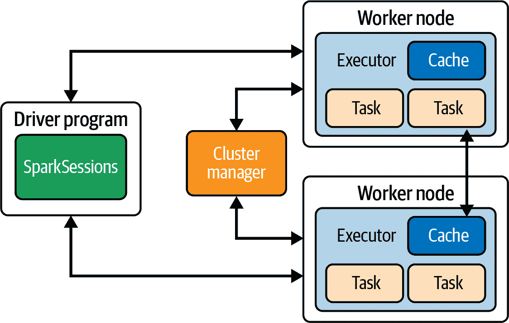
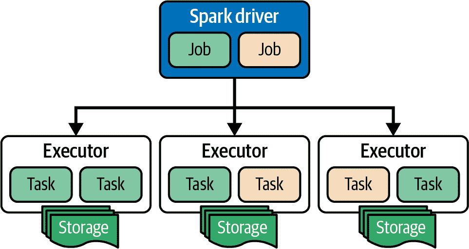
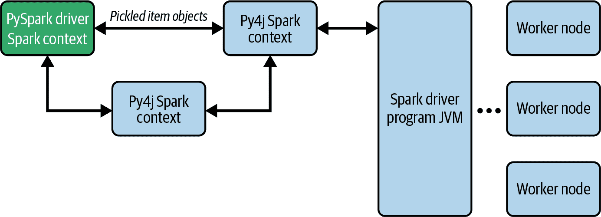
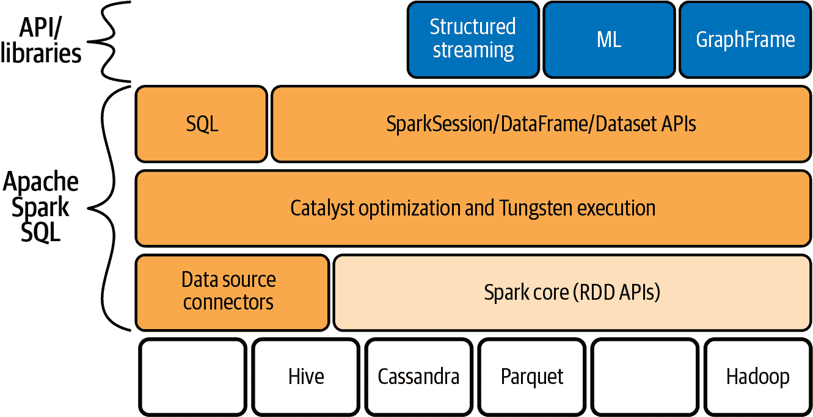

# 第二章：Spark 和 PySpark 简介

本章的目标是让您快速了解 PySpark 和 Spark，为您提供足够的信息，以便您在本书的其他教程中感到舒适。让我们从开始说起。究竟什么是 Spark？Spark 最初是在 2009 年由加州大学伯克利分校开发的，是一个用于大数据和机器学习的开源分析引擎。它在发布后很快被企业广泛采用，并且由像 Netflix、Yahoo 和 eBay 这样的强大力量在成千上万的节点集群上部署来处理 exabytes 级别的数据。Spark 社区也迅速增长，包括来自 250 多个组织的 1,000 多名贡献者。

###### 注意

深入了解 Spark 本身，请阅读 [*Spark: The Definitive Guide*](https://oreil.ly/sparkTDG)，作者是 Bill Chambers 和 Matei Zaharia（O'Reilly）。

为了让您对本书的剩余部分有所了解，本章将涵盖以下领域：

+   Apache Spark 的分布式架构

+   Apache Spark 基础（软件架构和数据结构）

+   DataFrame 的不可变性

+   PySpark 的函数式编程范式

+   pandas 的 DataFrame 与 Spark 的 DataFrame 有何不同

+   用于机器学习的 Scikit-learn 与 PySpark 的比较

# Apache Spark 架构

Spark 架构由以下主要组件组成：

驱动程序

驱动程序（也称为 Spark 驱动程序）是在驱动机器上运行的专用进程。它负责执行和持有 `SparkSession`，其中封装了 `SparkContext` —— 这被认为是应用程序的入口点，或者称为“真正的程序”。`SparkContext` 包含所有基本函数、在启动时传递的上下文以及有关集群的信息。驱动程序还持有 DAG 调度器、任务调度器、块管理器以及将代码转换为工作单位和执行器可以在集群上执行的所有内容。驱动程序与集群管理器协同工作，找到现有的机器并分配资源。

执行器

执行器是在工作节点上为特定的 Spark 应用程序启动的进程。每个执行器可以分配多个任务。JVM 进程与集群管理器通信并接收要执行的任务。同一执行器上的任务可以从共享内存（例如缓存）和全局参数中获益，这使得任务运行更快。

###### 注意

任务是 Spark 中可调度工作的最小单位。它运行分配给它的代码，并处理分配给它的数据片段。

工作节点

Worker 节点，顾名思义，负责执行工作。多个执行器可以在单个工作节点上运行，并为多个 Spark 应用程序提供服务。

集群管理器

与驱动程序一起，集群管理器负责编排分布式系统。它将执行器分配给工作节点，分配资源，并将有关资源可用性的信息传达给驱动程序。除了 Spark 的独立集群管理器外，这也可以是任何其他能够管理机器和网络容量的集群管理器，如 Kubernetes¹、Apache Mesos²或 Hadoop YARN³。

图 2-1 展示了这些不同组件如何互相配合。



###### 图 2-1\. Spark 的分布式架构

这些组件各自在大规模编排 Spark 程序中发挥关键作用。Spark 驱动程序可以在一个应用程序内启动多个作业，每个作业包含多个任务。但是，它不能在同一应用程序中启动多个应用程序，因为 Spark 资源管理是基于每个应用程序而不是每个作业的基础进行的。任务在一个或多个执行器上运行，通常处理数据的不同部分（见图 2-2）。请注意，执行器没有分配专用存储，尽管在图 2-2 中可以看到存储已连接到执行器。在某些部署中，例如本地 Hadoop 集群，存储可以是执行器本地的，但通常在云解决方案中，情况并非如此；在云部署（AWS、Azure 等）中，存储与计算是分离的。通常情况下，Spark 更喜欢调度访问本地数据的任务，但将任务和执行器分配给本地数据并非必需。



###### 图 2-2\. Spark 启动两个作业

# PySpark 简介

我之前提到过 Python 是一种不同类型的语言——它不是 JVM 家族的一部分。Python 是一种*解释型*语言，这意味着（与 JVM 不同）Python 代码不经过编译。您还知道，在 Spark 的核心部分，它运行基于 JVM 的进程，并且基于 Scala 和 Java。那么 Spark 如何与 Python 一起工作呢？让我们来看一下。

在最基本的层面上，Spark 应用程序组件通过共享网络通过 API 进行通信。这意味着，如果我有一个运行 JVM 进程的任务，它可以利用进程间通信（IPC）与 Python 一起工作。

假设您编写了一个 PySpark 应用程序。它如何与 Spark 一起工作呢？基本上，每次启动 PySpark 作业时，它在幕后创建两个进程：Python 和 JVM。Python 是定义代码的主程序，而 JVM 是负责 Spark 查询优化、计算、将任务分发到集群等的程序。在 PySpark 应用程序中，`SparkContext`本身有一个名为`_gateway`的参数，负责保存上下文以将 Py4J 应用程序传递给 JVM Spark 服务器。

等等，什么是 Py4J 应用程序？[Py4J](https://www.py4j.org) 是一个用 Python 和 Java 编写的库，允许在 Python 解释器中运行的 Python 程序通过标准的 Python 方法动态访问 JVM 中的 Java 对象和集合，就像它们驻留在 Python 解释器中一样。换句话说，它使得 Python 代码能够与 JVM 通信，对用户透明。图 2-3 展示了它的工作原理。当 PySpark 驱动程序启动时，它会使用配置好的 Py4J 服务器启动一个 Spark JVM 应用程序，以便与 Spark JVM 直接通信。信息在 PySpark 驱动程序和 Py4J 之间以序列化或“pickled”形式传输。⁴



###### 图 2-3\. Py4J 充当 Python 应用程序和 Spark JVM 之间的中介

因为 Python 是解释器，并且代码不会提前编译，所以每个工作节点都有一个包含 Python 代码的执行器。执行器在需要执行逻辑时启动一个 Python 应用程序。当然，在这里我是在简化事情——多年来添加了一些例外和优化。你也应该知道，相比传统的 Scala/Java 代码，PySpark 在运行时间上通常效率较低。

# Apache Spark 基础知识

在本节中，我们将简要介绍 Spark 本身的基础知识，从软件架构和关键编程抽象开始。

## 软件架构

由于 Spark 被构建为一个通用引擎，可以支持各种分布式计算工作负载，其软件架构是分层的，正如你可以在 图 2-4 中看到的那样。



###### 图 2-4\. Spark 软件架构

底层通过 *弹性分布式数据集*（RDD）API 和数据源连接器抽象出存储。Spark 中的存储可以是任何具有可读格式的内容（更多内容请参阅 第四章）。

顶层包含我们利用的 API 和库。这些 API 直接与 Spark 的 DataFrame 或 Dataset API 一起工作，抽象出所有的 Spark 内部细节。在 Spark 中，*DataFrame* 是一个分布式的按列组织的数据集合，类似于数据库中的表。它有一个专用的结构和格式，可以对其运行特定的操作。它还有一个模式（schema），其中每列支持特定的 [数据类型](https://oreil.ly/NE8r5)（数值、字符串、二进制、布尔、日期时间、间隔等）。Dataset 和 DataFrame 的主要区别在于 Dataset 对列的类型安全性，这意味着我们不会将某列误认为是 `string` 类型而实际上是 `int` 类型。然而，我们为此付出了代价：操作 Dataset 通常比操作 DataFrame 慢。

请注意，模式是 DataFrame 的一个重要部分。Spark 可能会尝试根据文件格式自动推断给定数据集的模式——例如，对 Parquet 文件执行此操作（更多详细信息请参见第四章）。它也会尝试从 CSV 文件中推断模式，但可能由于特定字符编码（如 UTF 格式）或问题（例如额外的空格/制表符），以及偶尔推断分隔符时出错。

要将 CSV 文件读取到 DataFrame 中，您只需调用带有专用格式函数的 `read` 操作：

```
df = spark.read.csv("some_file")
```

在这种情况下，PySpark 将尝试从文件中推断模式。

在执行 `df.printSchema()` 后，会执行 `read` 函数并打印模式，以供您查看。如果希望，还可以使用 `option` 函数更改分隔符。例如，您可以在前一行后添加以下内容将分隔符设置为逗号：

```
 .option(delimiter=',')
```

### 创建自定义模式

通常情况下，您会想要控制流程并提供自定义模式。这样可以促进代码本身的协作和可重现性。这也可以节省后期调试问题的宝贵时间。

那么，如何在 PySpark 中做到这一点呢？您需要创建一个 `StructType` 并在读取时将其作为所需模式传递给读取器。在 `StructType` 中，使用专用 API 添加所有列名和类型，就像下面的代码示例中所示：

```
schema = StructType([ 
    StructField("Number",IntegerType(),True), 
    StructField("City",StringType(),True), 
    StructField("Age",DoubleType(),True), 
    StructField("Decommissioned",BooleanType(),True)
])

df_with_schema = spark.read.format("csv") 
                      .schema(schema) 
                      .load("{some_file_path}.csv")
```

将 `True` 传递给 `StructField` 对象表示该值可以为空。

如何将 Python 数据类型转换为 Spark 数据类型？或者更确切地说，PySpark 如何解释这些类型？表 2-1 提供了一些最常见转换的指南。

表 2-1\. 基本 Python 数据类型及其在设计模式时的初始化方式

| Python 中的值 | Spark 类型 |
| --- | --- |
| `int` (1 字节) | `DataTypes.ByteType()` |
| `int` (2 字节) | `DataTypes.ShortType()` |
| `int` (4 字节) | `DataTypes.IntegerType()` |
| `int` (8 字节) | `DataTypes.LongType()` |
| `float` (4 字节，单精度) | `DataTypes.FloatType()` |
| `float` (8 字节，双精度) | `DataTypes.DoubleType()` |
| `str` | `DataTypes.StringType()` |
| `bool` | `DataTypes.BooleanType()` |
| `decimal.Decimal` | `DataTypes.DecimalType()` |

请注意，虽然 Python 中有许多类型，在定义模式时，有些类型会重复出现，比如 `int` 和 `float`。Spark 提供了不同的类型，例如，`int` 值可能会转换成不同大小的字节数表示（`ShortType` 是 2 字节，`IntegerType` 是 4 字节等）。这是您在使用 PySpark 时需要解决的挑战之一。

### 关键的 Spark 数据抽象和 API

RDD 究竟抽象了什么？这是一个很棒的问题，对其进行全面考虑将使我们深入到分布式存储和数据源连接器的概念中。RDD 本质上是 JVM 对象的只读分布式集合。然而，Spark 在这里隐藏了许多复杂性：RDD 结合了应用程序的依赖关系、分区和 `iterator[T] =>` 计算函数。分区是数据本身的逻辑划分 —— 您可以将其视为分布式数据的一个块。RDD 的目的是将每个分区连接到逻辑迭代器，根据执行器可以迭代的应用程序依赖关系。分区至关重要，因为它们提供了 Spark 能够轻松地跨执行器分割工作的能力。

Spark 的其他核心数据抽象是 DataFrames 和 Datasets。DataFrame 类似于 RDD，但它将数据组织成具有命名列的形式，类似于关系数据库中的表。Datasets 是 DataFrame API 的扩展，提供类型安全性。DataFrames 和 Datasets 都受益于由 Spark Catalyst 引擎提供的查询优化。这种优化非常重要，因为它使得运行 Spark 更快更便宜。因此，尽可能利用顶层 API 并避免使用 RDD 是明智的选择。

许多创新被用于 Catalyst，这真是一个令人着迷的世界。然而，考虑到它对机器学习工作负载几乎没有影响，我将不在这里进一步深入探讨它。

如图 Figure 2-4 所示，Spark 提供了许多 API/库。让我们来看看一些在 PySpark 中支持的 API*:*。

MLlib

这个库用于在规模上运行机器学习工作负载。在底层，有两个库，MLlib 本身和机器学习（更多内容请参见 Chapter 6）。

GraphFrames

这个库使得可以在具有边和节点的数据上运行图操作。它在原始数据类型 (`int`, `double` 等) 的顶点和边类型表示优化方面，通过将它们存储在专用数组中，减少了内存占用。尽管机器学习与图计算有很多关系，但 MLlib 和 GraphFrames 是分开的，用于不同的目的。然而，GraphFrames 有一些有趣的算法（如 PageRank），可以帮助您丰富数据并进行预处理和特征工程。

结构化流处理

此 API 启动一个处理微批数据的不间断 Spark 作业。还有一个用于低延迟的改进引擎称为连续处理。Spark 应用程序本身创建一个侦听器，等待收集新数据。当新的微批数据到达时，Spark SQL 处理并相应地更新最终结果。

### DataFrames 是不可变的。

需要注意的是，DataFrame、Dataset 和 RDD 被视为*不可变*存储。不可变性意味着对象创建后其状态不可更改。在编写 PySpark 代码时，我们必须牢记这一点。每次在 DataFrame 上执行操作时，由于它不能改变原始对象（不可变性），为了存储结果，它会创建一个新的 DataFrame。考虑以下代码示例，我们在 DataFrame 上读取并运行 `select` 操作：

```
train_df = spark.read.csv('training_data.csv', header = True)
train_df.select('bot')
```

请注意，在第一行中，我们将 DataFrame 分配给了 `train_df` 变量。`select` 操作后 `train_df` 发生了什么？什么也没有！是的，绝对没有任何变化。这就是不可变性的威力：对象本身不会改变。本质上，`train_df` 现在指向内存中表示 DataFrame 的位置。表示本身不会改变。通过选择 bot 数据，我们只是创建了对数据子集的新指针。因为我们没有将新指针分配给变量，所以代码的最后一行实际上什么也没做。底层 DataFrame 仍然是相同的，`train_df` 仍然指向表示 DataFrame 的内存中的相同位置。

你还应该注意，Spark 使用*惰性执行*。这意味着它不会启动进程的执行，直到调用*动作*类型的操作为止。动作可以是任何返回不是 DataFrame 的值的操作，例如获取 DataFrame 中行数的计数或执行写操作。另一种操作类型是*转换*。转换操作从现有的 DataFrame 创建新的 DataFrame。Spark 将所有转换累积成 DAG 并优化它们，但只有在需要它们的动作发生时才对其执行。

回到我们的例子，Spark 甚至没有将数据加载到内存中。它创建了一个操作图，其中包含 `read` 和 `select`。如果稍后在由 `select` 创建的 DataFrame 上没有动作操作，Spark 将对其进行修剪，并且根本不执行它。Spark 的惰性执行和不可变数据结构有助于防止我们犯错和执行不必要的计算；请注意这些特性。

那么，我们该如何纠正之前的错误呢？我们可以从简单地将 `select` 操作的 DataFrame 分配到实例中开始，如下所示：

```
train_df = spark.read.csv('training_data.csv', header = True)
tmp_df = train_df.select('bot')
```

这样保存了对 `tmp_df` 的引用。如果我们稍后继续在其上执行并有*动作*操作，Spark 将执行此 `select` 操作（获取结果并将其保存到 `tmp_df` 变量中），作为其操作图的一部分，只有在需要返回结果到驱动程序的动作发生时才会执行。否则，它将被修剪。

你可能在问自己，*为什么不可变性很重要呢？* 操作的不可变性是*函数式编程*的支柱之一，这种编程范式旨在使我们能够构建更可靠和可维护的应用程序（你将在下一节学到更多关于函数式编程的知识）。确保对象在创建后其状态不能改变，使开发人员能够跟踪所有对该对象执行的操作，从而保留事件链。这反过来使应用程序具有可伸缩性。

在处理 Spark 时也适用相同的概念：实质上，每个 DataFrame 都是特定操作的结果，这是可重现和可跟踪的。这在分布式系统中尤为重要和具有挑战性。选择不可变性使我们能够实现弹性，尽管为了节省内存，Spark 并不会自动保存我们生成的每个 DataFrame。考虑这一点，并学会如何以一种使你能够重现机器学习实验的方式来使用 Spark（关于此更多内容请参见第三章）。

## PySpark 和函数式编程

我在前一节提到了函数式编程，这并非偶然。Spark 除了不可变性外，还从函数式编程中借鉴了许多概念，从*匿名函数*开始。这些函数在没有状态的情况下执行，但并非无名。这个想法起源于数学中的λ演算，你经常会听到这些被称为*λ函数*。

你可以将匿名函数传递给 RDD 来在数据上执行。看下面的代码片段：

```
rdd2 = rdd.map(lambda x: (x,1))
```

在这里，我们对 RDD 实例调用`map`函数。在该函数内部，我们调用一个匿名函数。对于每个`x`——也就是 RDD 中的每一行——该函数返回一对`(x,1)`。例如，如果我们的原始 RDD 包含值为`(1,2,3)`的行，该函数将返回`((1,1),(2,1),(3,1))`。这是一个转换操作，`rdd2`保存了具有将每个`x`转换为`(x,1)`的图操作的要求。

在这个例子中，`map`函数利用了将独立函数传递给 RDD 来执行的功能，这是可重复且独立于状态的。这种能力使并行执行变得轻而易举。想象一下：每个执行器在其数据分区上运行操作并返回答案。无需交换信息，这使得系统极其可伸缩和弹性。如果一个节点宕机，无需重新计算所有内容——只需处理它负责的部分数据。最终的结果与在单个节点上执行操作时完全一致。

举个更高级的例子，假设客户请求您找出所有值中的最大值。您可以通过使用`reduce`操作和`max`操作来实现这一点，如下面的代码片段所示：

```
rdd3 = rdd2.reduce((a,b)=> (("max",a._2 max b._2)._2))
```

`reduce`将计算所有值中的最大值，从而从本地值开始，通过比较每对来找到本地最大值。每个节点找到其本地最大值后，数据将被移动到专用执行器，该执行器将计算最终结果。在我们的案例中，`((1,1),(2,1),(3,1))`将返回`3`。

尽管函数式编程有更多的核心原则，Spark 并不一定完全遵循所有这些原则。主要原则如下：

+   不变性

+   有纪律的状态（最大程度地减少对状态的依赖）

## 执行 PySpark 代码

如果您想在配置了集群的情况下运行 PySpark 代码，请确保您可以访问具有正确库的集群，并且具有必要的权限。对于云安装，如果您不是 IT 专业人士，最好利用托管的 Spark 解决方案或咨询您的 IT 部门。执行代码本身非常类似于 JVM 进程。如前所述，PySpark 代码将处理其余的部分。

要在专用笔记本上本地执行，请按照书籍的 README 文件中的[GitHub repo](https://oreil.ly/smls-git)中的快速入门指南中的说明操作。这应该足以跟随教程进行学习。

Spark 也支持 shell 命令，通过 PySpark shell（一种交互式 shell，可以使用命令行尝试 PySpark）。PySpark shell 负责将 Python API 链接到 Spark 核心并初始化`SparkSession`和`SparkContext`。它基于 Scala 概念称为 REPL（Read-Eval-Print Loop）。有关更多信息，请查阅 Spark 文档中的[快速入门指南](https://oreil.ly/0NB-X)。

# pandas DataFrames 与 Spark DataFrames 的比较

Spark DataFrames 的灵感来自[pandas](https://oreil.ly/ADLio)，它也提供了一个称为 DataFrame 的数据抽象层。pandas 是一个广泛采用的用于数据操作和分析的库。许多开发人员使用它来使用 Python 来推断数据。读取 pandas DataFrame 非常简单——下面是一个展示如何做到这一点的代码示例：

```
import pandas as pd
df = pd.read_csv(....)
```

起初可能很容易混淆这两者，但 pandas 和 Spark 之间有许多关键区别。最重要的是，pandas 不是为大规模设计的；它是为操作适合一个机器内存的数据而构建的。因此，它没有我们在章节开头讨论的分布式 Spark 架构。它也不遵循函数式编程原则：pandas 的 DataFrame 是可变的。

###### 注意

它在内存中保留的数据的多个排列可能导致 pandas 在原始数据集轻松适合单个机器内存的情况下失败。

表 2-2 提供了 Spark 和 pandas DataFrame 一些关键特性的快速比较。

表 2-2\. Spark DataFrame 与 pandas DataFrame

|   | Spark DataFrame | pandas DataFrame |
| --- | --- | --- |
| **并行操作** | 是 | 不是现成的 |
| **延迟评估** | 是 | 否 |
| **不可变** | 是 | 否 |

尽管如此，正如你所见，没有现成的方法可以在 pandas DataFrame 上并行操作，但这并不意味着完全不可能。这只是意味着你必须创建一个解决方案，并考虑可能遇到的问题（线程锁定，竞态条件等）及其对最终结果的影响。其他区别包括 Spark 支持延迟评估，而 pandas 中的操作在 Python 代码行执行时立即发生，pandas 中的 DataFrame 不是不可变的。这使得在 pandas DataFrame 上操作变得更容易，因为你不需要记住或意识到延迟执行的方法——当你调用函数时，它会立即执行，并且你可以立即与结果交互。但是，这也使得使用并行或分布式计算进行扩展变得具有挑战性。

###### 提示

Spark 社区创建了一个名为 Koalas 的开源库，它在 Spark 上提供了类似 pandas 的 API。它也被称为 pandas-on-Spark。虽然这不同于并行化 pandas，但从用户的角度来看，该 API 在模仿 pandas API 方面做得很好。这个库是官方 Spark API 的一部分，这也使得你可以立即更容易地使用它。要了解更多信息，请在 Spark 文档中搜索“pandas API”。从 Spark 版本 3.2 开始，你可以像这样直接从 PySpark 中导入它：

```
import pyspark.pandas as ps
```

# Scikit-Learn 与 MLlib 的比较

Scikit-learn (`sklearn`) 和 Spark MLlib 有时也会被混淆。Scikit-learn 是一个用 Python 编写的机器学习库，利用了众所周知的 Python 库，如 NumPy、SciPy 和 matplotlib。虽然它在处理适合 RAM 的数据时表现出色，但它以非分布式的方式进行操作。Spark 添加了配置集群以在更大规模上运行的开销，但提供了针对并行/分布式执行进行调整的算法。

在什么情况下应该选择每个工具？以下是一些提示：

+   对于处理大型数据集（GB、TB 甚至 PB 规模），最好使用 Spark，并使用 MLlib 对其进行机器学习。

+   当你的所有数据都适合机器内存时，使用 Python 中的 scikit-learn 与 pandas 和其他库一起构建算法更有效。此外，这种方式使得在生产中提供模型不受特定配置的限制（关于在第 10 章中的模型部署模式更多信息）。

Scikit-learn 使用数据集的概念，与 Spark 和其他 Python 库（如 pandas）类似。数据集是可变的，但直接扩展受限，需要与其他工具配合使用。模型部署与 Spark 类似（取决于您的服务模式），模型可以保存到磁盘，并使用多个 API 进行重新加载。Scikit-learn 可以操作 pandas DataFrames 和 NumPy 数组。

表格 2-3 快速比较了 scikit-learn 和 MLlib 的一些关键特性。当您到达 第六章，讨论 Spark 的机器学习流水线时，这种相似性将更加明显。这是因为 Spark 中管道的概念受到了 scikit-learn 项目的启发；Spark 社区决定使用类似的概念（就像设计 DataFrames 时一样），尽可能地简化 Spark 的学习曲线。

表格 2-3\. scikit-learn 对比 Spark MLlib

|   | Scikit-learn | MLlib |
| --- | --- | --- |
| **数据集** | 可变的（可以原地更新列） | 不可变的（必须创建新列） |
| **可伸缩性** | 数据必须适合单机内存 | 分布式（支持大数据分析） |
| **模型部署** |

+   模型可以通过 REST API 进行“pickling”到磁盘并重新加载。

+   受 MLflow 支持。

+   提供许多部署选项。

|

+   支持 Parquet 和 Snappy 文件格式以及其他开放文件格式。

+   受 MLflow 支持。

|

# 总结

本章介绍了 Spark 的基础知识，为您提供了架构和 API 的高层次见解，并将其与其他流行的 Python 工具进行了比较。在此基础上，您应该准备好开始使用 Spark 和端到端的机器学习流水线，并积累一些实践经验。要记住的一点是，机器学习项目是长期的，需要时间、精力和合作。为了提高代码的可维护性，保持可重用性、友好性和模块化是很重要的。

¹ [Kubernetes (K8s)](https://kubernetes.io) 是一个自动化容器化应用程序部署、扩展和管理的工具。

² [Apache Mesos](https://mesos.apache.org) 是一个开源的集群管理器。

³ 在 Hadoop 的分布式处理框架中，[YARN](https://oreil.ly/F-3bR) 是资源管理和作业调度技术。

⁴ *Pickling* 是将 Python 对象转换为字节流的过程。

⁵ Spark 还提供 GraphX 库；在高层次上，它们的功能类似，但 GraphFrames 基于 DataFrames，而 GraphX 基于 RDDs。在 PySpark 中支持的是 GraphFrames。
