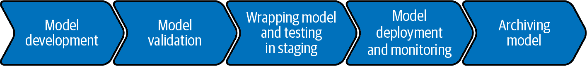
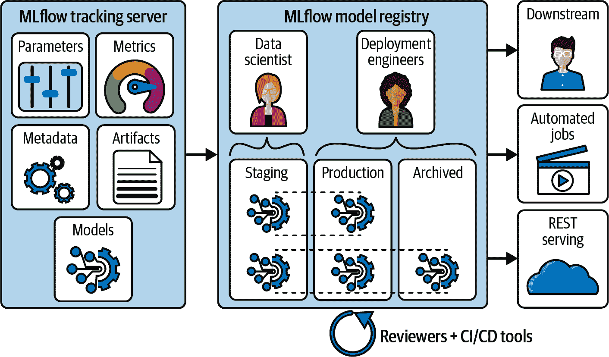
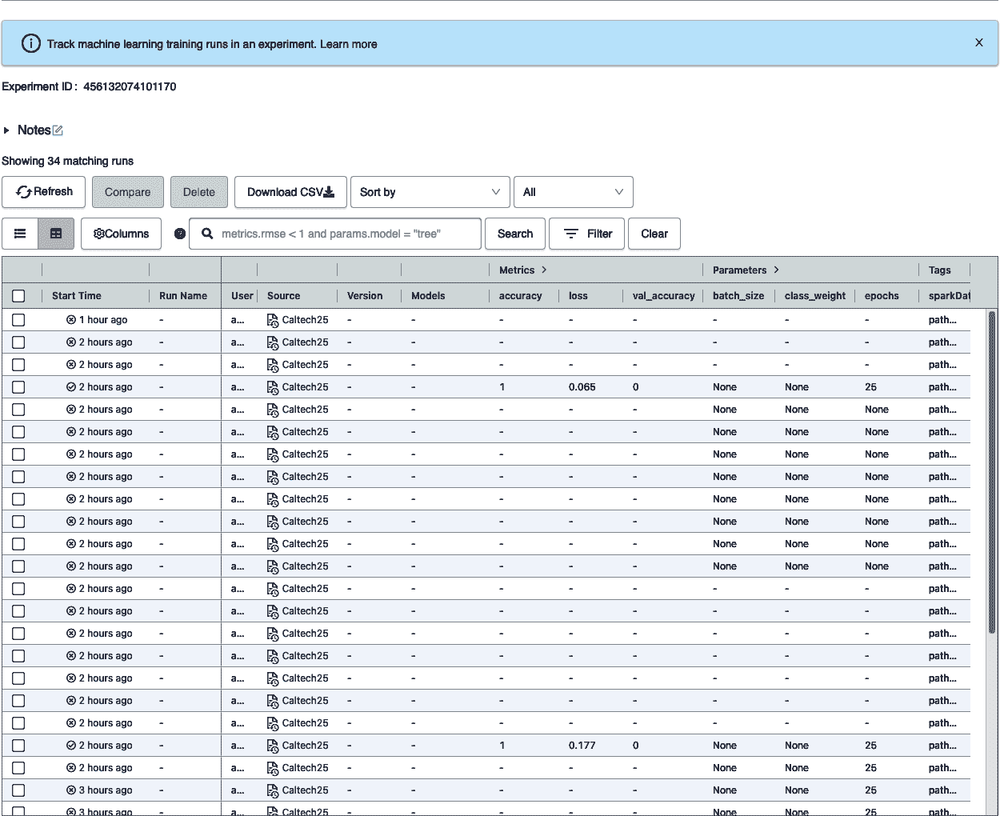
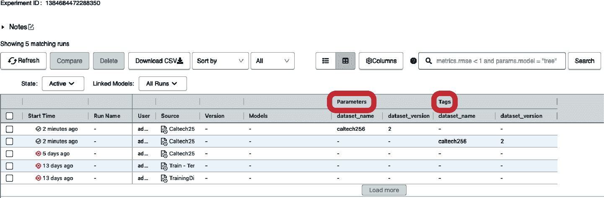
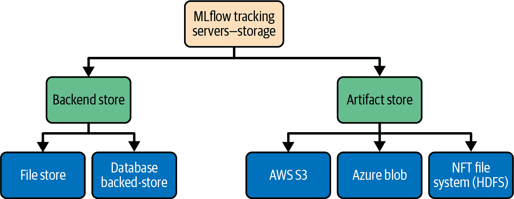
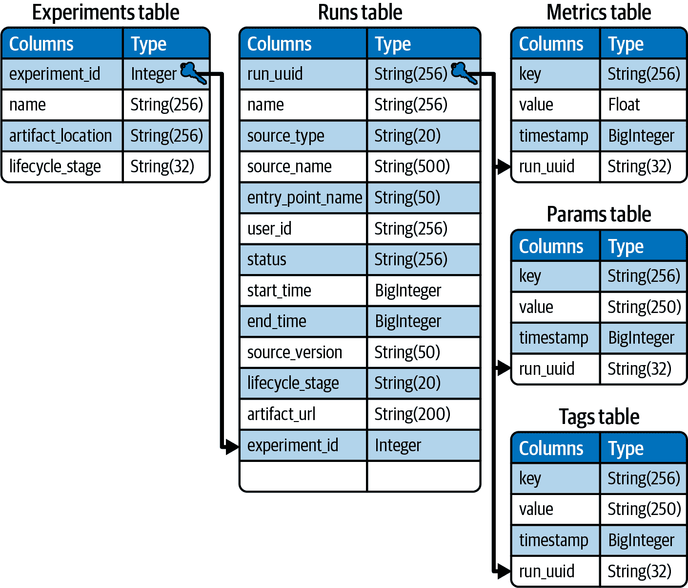
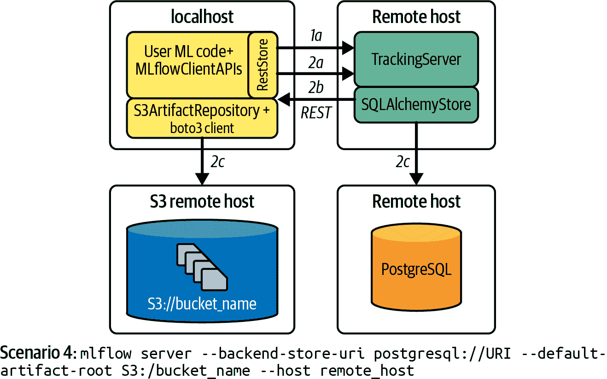

# 第三章：使用 MLflow 管理机器学习实验生命周期

机器学习开发和数据科学通常是协作进行的，但在尝试大量特征组合、标准化技术和超参数的组合的同时共同构建模型，是一个复杂的任务。部分原因在于追踪实验、复现结果、打包模型以便部署以及以确保其良好文档记录并提供所需准确性的方式存储和管理模型，这本身就是一项复杂的任务。

为了促进这一过程，需要演进机器学习开发工作流程，使其更加健壮、可预测和标准化。为此，许多组织已开始构建内部机器学习平台来管理机器学习生命周期。然而，这些平台通常仅支持一小部分内置算法，由公司基础设施和可用软件决定，对于支持新软件可能存在较大复杂性。此外，这些平台通常不是开源的，用户难以轻松利用新的机器学习库或与社区中其他人分享其工作。

管理机器学习实验生命周期，有时被称为*MLOps*，是机器学习、开发和运维的结合体。机器学习部分涉及实验本身：训练、调整和找到最优模型。开发则是开发流水线和工具，将机器学习模型从开发/实验阶段进入分阶段和生产阶段。最后，运维则涉及 CI/CD 工具和监控，管理和扩展规模化服务模型。Figure 3-1 描绘了机器学习模型生命周期的步骤，MLOps 团队必须支持每一个步骤。



###### 图 3-1。机器学习模型的生命周期，从开发到归档

机器学习实验可以通过机器学习流水线代码或存储在仓库中的机器学习模块来组织，例如 Git 分支。它们包含了*代码*、*数据*和*模型*，是机器学习软件生命周期的一个组成部分。

# 机器学习生命周期管理需求

大多数机器学习项目的目标是达到涵盖所有要求并开发所有需要解决的业务问题或问题的能力的位置。然而，定义（更不用说满足）机器学习生命周期的所有要求通常说起来比做起来更容易。此外，有时这些要求可能来自外部实体。例如，如果我为新药进行机器学习研究，可能需要我的项目和结果符合美国食品和药物管理局（FDA）的要求。要获得 FDA 批准，必须已经审查了药物效果的数据，并且确定该药物对预期人群的已知和潜在风险的益处大于其风险。这意味着至少需要使机器学习实验具有*可重现性*。当然，这只是其中的一个要求。许多其他要求来自称为*软件开发生命周期*（SDLC）的软件工程过程。一般来说，SDLC 包括七个阶段：*规划*、*分析*、*设计*、*开发*、*测试*、*实施*和*维护*。我们可以将这些阶段转化为机器学习生命周期阶段，专注于与机器学习相关的领域。也就是说，仔细研究这些阶段涉及的内容，我们可以决定如何实施它们，并采纳对机器学习相关的概念，利用现有的 SDLC 工具和方法论。

在技术方面，我们可以概括出以下核心要求：

**可重现性**

这指的是能够在不同数据集上重复运行算法并获得相同（或相似）结果的能力。分析、报告、审计和解释数据都是这一过程的方面，意味着生命周期的每个步骤都需要进行跟踪和保存。

代码版本控制

软件开发人员通常会为他们的代码使用版本控制，机器学习开发人员也应该如此。维护代码、参数和数据的所有不同版本历史可以帮助我们与他人合作，并跟踪我们进行的各种实验变体。

数据版本控制

正如之前提到的，机器学习实验包括代码、数据和模型。在进行这类实验时，跟踪和记录生成特定模型的代码和数据是至关重要的。就像我们的代码会变化一样，我们的数据也会变化。我们可能会从数据中提取新特征或对数据本身进行不同种类的预处理，导致数据集的变化需要记录以备将来使用。支持数据版本控制的工具为我们提供了这些能力。需要注意的是，MLflow（本章讨论的工具）并未提供数据版本控制；然而，有其他开源工具可以提供这样的功能，比如[lakeFS](https://oreil.ly/AzqiF)，[DVC](https://oreil.ly/HQJCE)等。

有多种工具可用于管理机器学习实验生命周期，以确保满足这三个要求。对于本书，我选择了 MLflow，因为它是开源的，与 Apache Spark 原生集成，并且在抽象复杂功能的同时允许灵活协作和扩展到其他工具。在本章的其余部分，我将介绍此工具及其如何帮助我们管理机器学习实验。

# MLflow 是什么？

MLflow 是一个简化整个机器学习生命周期管理的平台。它使您能够跟踪实验及其结果，部署和管理模型，并将机器学习代码打包成可重复使用的格式。它提供了支持版本控制和注释的中央模型注册表，以及模型服务功能。它通过重新定义实验日志和模块结构来实现这一点。

从高层次来看，主要组件是跟踪服务器和模型注册表，如图 3-2 所示。我们稍后会更详细地查看其他支持流程的组件。在模型注册后，团队可以构建自动化作业，并使用 REST 服务 API 将其向下移动。请注意，开源平台本身不支持模型监控等功能，这需要专门的工程工作。



###### 图 3-2\. MLflow 的两个主要组件（由[Databricks](https://oreil.ly/iUkGX)提供）

## MLflow 平台的软件组件

为了更好地理解其工作原理，让我们来看看 MLflow 的软件组件：

存储

MLflow 提供支持连接到多种存储类型（文件目录、数据库等）并利用它们来跟踪机器学习工作流程。存储包含有关实验、参数、不同运行结果等的所有信息。

后端服务器

此组件负责将来自数据库/存储、UI、SDK 和 CLI 的信息传递给其他组件，捕获实验日志等。

前端

这是 UI 界面，我们可以以可视化的方式与不同运行的实验及其结果进行交互和跟踪。

API 和 CLI

MLflow 还具有用于交互和实验跟踪的 Python API 和命令行界面。

我们可以通过 API、CLI 或 UI 与 MLflow 平台进行交互。在幕后，它跟踪我们提供的所有信息。使用 API/CLI 会生成专用目录，您可以将其推送到 Git 存储库以便协作。图 3-3 展示了管理实验多次运行时 UI 的示例。



###### 图 3-3\. 跟踪实验中多次运行

## MLflow 平台的用户

正如您所想象的那样，许多团队和个人参与到机器学习的产品化过程中，并进行端到端的生命周期开发和管理。因此，MLflow 具有广泛的潜在用户，包括以下几类：

个人用户

作为个人，您可以使用 MLflow 在本地跟踪实验，组织代码以备将来使用，并输出模型，稍后可以使用新数据进行测试。您还可以将其用于组织您的研究工作。

数据科学团队

处理同一问题并尝试不同模型的数据科学团队可以轻松使用 MLflow 共享和比较他们的结果。团队通常会创建一个共享的 Git 仓库来保存这些成果。团队中的每个人都可以保存、跟踪、下载并运行自己或其他团队成员的模型，或者使用界面来跟踪各种参数，更好地理解实验阶段。

组织

从组织角度来看，您可以为团队协作打包训练和数据准备步骤，并比较各个团队在同一任务上的结果。MLflow 允许您简化和标准化从研究和开发到暂存和生产的流程。

机器学习工程师/开发者

数据科学家经常与机器学习/人工智能工程师合作。使用 MLflow，数据科学家和工程师可以以 MLflow 项目格式发布代码到 GitHub，使任何人都可以运行他们的代码。此外，机器学习工程师可以以 MLflow 模型格式输出模型，以自动支持使用 MLflow 内置工具进行部署。机器学习工程师还可以与 DevOps 团队合作，在 MLflow 数据库中定义 Webhook，用于在开发阶段之间移动模型（从开发、验证、暂存、生产到归档）。

# MLflow 组件

MLflow 主要分为四个组件：*MLflow 追踪* 用于捕获实验相关的参数和信息，并记录结果，*MLflow 项目* 用于将项目代码打包到目录或 Git 仓库中，*MLflow 模型* 用于以不同格式打包和部署模型，以及 *MLflow 模型注册表*，提供一个集中存储和跟踪所有模型不同版本的库。让我们详细看看每个组件。

## MLflow 追踪

[MLflow 追踪](https://oreil.ly/uiJ87) 可以在独立脚本（不绑定到任何特定框架）或笔记本中使用。它提供了 API、界面和 CLI，用于记录实验参数、代码本身及其版本、机器学习指标以及在运行机器学习代码时生成的输出文件，以便稍后可视化。它还使您能够使用 Python 和其他一些 API 记录和查询实验。

MLflow Tracking 基于记录*运行*或某些数据科学代码的单独执行的概念。记录的数据包括代码版本、开始和结束时间、源文件或项目、参数和指标，以及生成的任何工件（如图像、模型或数据文件）。您可以使用 MLflow 的 Python、R、Java 和 REST API 从任何地方记录运行您的代码，并且可以定义它们的记录位置：到本地文件、数据库或远程跟踪服务器。默认情况下，MLflow Python API 将运行记录到*mlruns*目录中的本地文件中。运行可以组织成*实验*，为特定任务将所有运行组合在一起并提供简单访问。

可以在独立程序、远程云机器或笔记本中记录运行。如果您在一个 MLflow 项目中记录您的运行（在“MLflow Projects”中讨论），MLflow 会跟踪项目 URI 和源版本。稍后，您可以使用[Tracking UI](https://oreil.ly/N_qBg)或 MLflow API 查询所有记录的运行。

### 使用 MLflow Tracking 记录运行

假设我们有一个 TensorFlow 实验，我们想要使用 MLflow 运行和跟踪。根据我们想要跟踪的模型的类型，我们将作为第一步导入相关的库。这将是`mlflow.tensorflow`或`mlflow.keras`之一；使用支持您正在使用的训练算法的库。随后，我们可以利用平台的自动记录功能或以编程方式记录参数和指标 — 我将展示如何两者都做。

要启动运行，在 Python 中我们可以使用`with`运算符和`mlflow.start_run`。这个 API 调用在实验中启动一个新的运行，如果存在的话。如果没有实验存在，它会自动创建一个新的实验。您可以使用`mlflow.create_experiment` API 或通过 UI 创建您自己的实验。在运行中，您开发您的训练代码，并利用`log_param`和`log_metric`跟踪重要信息。最后，您记录您的模型和所有必要的工件（稍后详述）。查看以下代码片段，以更好地理解流程如何工作：

```
import mlflow
import mlflow.tensorflow
# Enable MLflow autologging to log the metrics, parameters, and artifacts
mlflow.tensorflow.autolog() 

# Launch a run in a new experiment (or an existing one if one is passed in)
with mlflow.start_run(): 
    # Log parameters (key/value pairs)
    mlflow.log_param("num_dimensions", 8)

    # Log metrics that can be updated throughout the run
    mlflow.log_metric("alpha", 0.1)
    # ... some machine learning training code

    # Log artifacts (output files)
    mlflow.log_artifact("model.pkl")
    # Log the model
    mlflow.log_model("ml_model_path")
```

在撰写本文时，`mlflow.tensorflow.autolog`是版本 1.20.2 中的一个实验性方法。它使用 TensorFlow 的*回调*机制在训练过程的特定阶段执行不同的操作。回调可以传递给 TensorFlow 的方法，如`fit`、`evaluate`和`predict`，以便在模型训练和推断生命周期的各个阶段进行钩子操作。例如，您可以利用它们在 epoch 结束时执行某些操作，或者通过配置参数在运行期间达到所需的精度时停止训练以减少计算成本。

*Epoch*是对整个数据集的单次遍历。在每个 epoch 中，您可以访问日志并使用回调进行程序化决策。TensorFlow 中的回调是 Keras 库`tf.keras.callbacks.Callback`的一部分，而在 PyTorch 中它们是`pytorch_lightning.callbacks`的一部分。在 PyTorch 中，回调通常是通过扩展实现的，例如由 Grid.AI 开发的开源 PyTorch Lightning 库。

在训练开始时，`autolog`函数记录所有与训练相关的配置。然后，在每个 epoch 结束时，它捕获日志指标。在训练结束时，通过调用`mlflow.log_model`记录模型。因此，它覆盖了整个生命周期的日志记录，并且您可以使用可用函数（`mlflow.log_param`、`mlflow.log_metric`、`mlflow.log_artifact`等）添加任何其他参数和工件。

对于 PyTorch，也可以使用自动记录，如下面的代码片段所示：

```
import mlflow.pytorch
# Autolog all MLflow entities
mlflow.pytorch.autolog()
```

MLflow 还支持其他框架和机器学习的变体，但并非所有都作为开源解决方案的一部分受支持。有关详细信息，请查看由[Databricks](https://oreil.ly/sN3i0)提供的 MLflow 的完全托管和托管版本。

###### 提示

目前建议您按照一般规则将参数、指标、模型和工件进行程序化记录，因为在 MLflow 的开源版本中当前不完全支持自动记录。在使用 Spark MLlib 时也适用相同的建议。

### 记录您的数据集路径和版本

出于实验跟踪、可重现性和协作目的，我建议在训练阶段同时记录数据集路径和版本以及模型名称和路径。将来，这将使您能够在必要时重现模型，并区分使用相同算法但不同输入版本训练的模型。确保跟踪所有超参数、参数和种子数据！

为此，我建议使用`mlflow.log_param`函数，因为它可以让您在一次调用中记录所有参数。这将生成一个批量日志，稍后跟踪更简单：

```
dataset_params = {"dataset_name": "twitter-accounts", "dataset_version": 2.1}
# Log a batch of parameters
with mlflow.start_run():
    mlflow.log_params(dataset_params)
```

另一个推荐的选项是通过将`tags`参数传递给`start_run`来动态设置标签：

```
with mlflow.start_run(tags=dataset_params):
```

MLflow 提供了一个灵活的 API。根据这些建议，您可以自行决定如何结构化您的实验日志。图 3-4 展示了 MLflow 仪表板，您可以在其中跟踪您的实验并查看参数和标签等其他元素。



###### 图 3-4\. MLflow 实验仪表板

###### 提示

MLflow 提供了一个选项，可以将本地目录的所有内容作为运行的工件进行记录，如果没有运行则创建一个新的活动运行：`mlflow.log_artifacts(local_dir, artifact_path=None)`。但是，我建议避免使用这个选项，因为它会复制给定 `local_dir` 中的所有内容并将其写入 `artifact_path`。当我处理大规模数据进行训练时，除非确实需要，我更倾向于避免复制数据。

现在，您已经了解了 MLflow Tracking 组件的责任：记录所有打包项目所需的信息。接下来，让我们来看看 MLflow 项目。

## MLflow 项目

[MLflow 项目](https://oreil.ly/jIfya) 是一种将代码打包成可重复使用和可重现的标准格式。MLflow 项目组件包括用于执行项目的 API 和命令行工具，并使得将项目链接成工作流成为可能。

每个项目只是一个包含一组代码文件和一个描述文件（一个名为 *MLproject* 的 YAML 文件）的目录或 Git 仓库，用于指定其依赖关系和如何运行代码。MLflow 项目格式捕捉了所有复制和部署模型所需的相关数据，包括环境数据。根据文档，在编写时，MLflow 支持四种不同的项目环境：virtualenv 环境（支持 Python 包，可通过 Python 包索引（PyPI）获取），*conda 环境*（支持 Python 包和本地库），Docker 容器环境（允许非 Python 依赖项，如 Java 库），以及系统环境。系统环境在运行时提供，并且必须在项目执行之前安装所有项目依赖项。使用 conda 环境时，默认情况下 MLflow 使用系统路径来查找和运行 conda 二进制文件。您可以通过更改 `MLFLOW_CONDA_HOME` 环境变量来决定使用不同的 conda 安装位置。

您的项目可能有多个入口点，可以通过命名参数调用运行。由于 MLflow 项目支持 conda，您可以通过利用 MLflow CLI 在 conda 环境中指定代码依赖：

```
$ **mlflow run example/conda-env/project -P alpha=0.5**
```

使用 `-P` 命令行参数运行实验使我们能够使用 CLI 更改参数。在这里，我们覆盖了传递给 `log_metric` 函数的参数（`mlflow.log_metric("alpha", 0.1)`），将其值更改为 `0.5`。

## MLflow 模型

[MLflow Models 组件](https://oreil.ly/0SMx0)用于将机器学习模型打包成多种格式，称为*flavors*。部署工具可以使用这些*flavors*来理解模型，从而可以编写适用于任何机器学习库模型的工具。MLflow Models 提供了几种标准的*flavors*，MLflow 内置的部署工具支持这些*flavors*，例如 `python_function` *flavor* 描述了如何将模型作为 Python 函数运行。使用这种*flavor*的模型可以部署到基于 Docker 的 REST 服务器、云服务器或作为用户定义函数。由于在运行期间使用跟踪 API 输出 MLflow Models 作为工件，MLFlow 将自动标记正确的项目。

在 “MLflow Tracking” 中运行实验将记录运行并输出一个带有以下大纲的模型目录：

```
--- 58dc6db17fb5471a9a46d87506da983f
------- artifacts
------------ model
------------  MLmodel
------------- conda.yaml
------------- input_example.json
------------- model.pkl
------- meta.yaml
------- metrics
------------  training_score
------- params
------------  A
------------  ...
------- tags
------------ mlflow.source.type
------------ mlflow.user
```

这个目录包含了我们复现实验所需的所有信息。让我们来看看结构。输出的第一行，`58dc6db17fb5471a9a46d​87506da983f`，是实验的 128 位全局唯一标识符（UUID）。在目录的根目录下，有一个名为 *meta.yaml* 的 YAML 文件，其中包含有关实验的元数据。有了这个，我们已经有了丰富的可追溯信息以及继续实验的坚实基础。还有四个子目录：*artifacts* 包含记录的任何工件；*metrics* 包含记录的度量；*params* 和 *tags* 包含运行设置的参数和标签。*MLmodel* 文件可以定义模型支持的多个*flavors*以及有关模型的其他信息。

## MLflow 模型注册表

在实验过程中，我们可能会生成大量的模型。[MLflow Model Registry](https://oreil.ly/zKGAn) 提供了一个集中存储这些模型的地方，以及用于与它们交互的一组 API 和专用 UI 进行可视化。它还允许我们通过 CLI 管理 MLflow Model 的整个生命周期。模型注册表使我们能够访问关于所有模型的广泛元数据，包括创建模型的实验和运行（其“血统”）、模型版本和阶段（例如，暂存、生产、存档），以及描述模型的任何注释。我们还可以在注册表中为模型添加评论、重命名它们、在不同阶段之间转换并从注册表中提供服务。

### 注册模型

在训练周期中，我们生成多个模型，以便最终选择最合适的模型。正如您在 第十章 中学到的那样，这些模型可以使用 `autolog` 隐式记录，也可以使用 `log_model` 函数显式记录。此时，模型尚未注册到注册表中；要添加它，我们需要 *注册* 它。有几种不同的方法可以做到这一点。要在运行过程中注册模型，可以包含 `regis⁠tered​_model_name` 参数，如下所示：

```
mlflow.keras.log_model(keras_model=model, registered_model_name='tfmodel', 
                       artifact_path="path")
```

如果注册表中不存在具有该名称的模型，则将此模型注册为新模型的版本 1；如果已经存在具有该名称的模型，则将其注册为新版本。您还可以在完成实验并决定要注册哪个模型后，使用 `register_model` 方法，传递模型的 `run_id` 和要注册的名称。有关此及其他注册选项的详细信息，请参阅 [文档](https://oreil.ly/1T-0O)。

### 在模型阶段之间过渡

在高层次上，机器学习模型的生命周期有五个阶段：开发、验证、暂存、生产和存档。MLflow 允许我们连接到 CI/CD 工具，以在这些阶段之间转换我们的模型。为此，我们需要编写专用脚本来监听模型状态变更事件，并在更新时触发所需的脚本。您还可以利用 Webhooks 或其他您喜欢的机制。

当我们首次使用对应模型风格（Keras 或 TensorFlow）的 `log_model` API 记录模型时，它被赋予 `None` 状态，表示它处于开发阶段。要将模型从开发阶段提升到数据库中的暂存阶段，可以使用 `MlflowClient` API：

```
client = MlflowClient()
Model_version = client.transition_model_version_stage(
    name='tfmodel',
    version=3,
    stage="Staging"
)
```

`MlflowClient` 是与跟踪服务器交互的 Python 客户端。`transition_model_version_stage` 函数允许我们更新模型阶段并调用所需的 CI/CD 脚本。`stage` 参数接受以下值：`Staging|Archived|Production|None`。将此参数设置为 `Staging`，在配置了跟踪模型状态的环境中，将打开一个请求，将模型从 `None` 状态转换为 `Staging` 状态，以进行在暂存环境中的集成测试。我们将在 第十章 中更详细地讨论这个问题。

# 大规模使用 MLflow

正如前面提到的，MLflow Tracking 存储实验和运行相关的信息以及与运行相关的工件（模型相关文件）。它使用两个组件进行存储，可以是本地或远程的：一个*后端存储*用于实验的信息（运行、参数、指标、标签、注释等），还有一个*工件存储*用于存储模型本身以及任何相关的文件、对象、模型摘要等。像大多数框架一样，MLflow 提供了各种配置选项，包括存储选项。如果您在本地机器上工作，可以将工件和实验信息保存到本地磁盘。如果您在云端笔记本或其他远程服务器上工作，可以将项目保存到可用的存储空间上。图 3-5 展示了不同的存储选项。



###### 图 3-5\. MLflow Tracking 存储选项

工件存储可以是任何本地或远程文件存储（尽管请注意本地文件存储不是可扩展的选项）。后端存储可以是本地或远程文件存储，也可以是数据库。当在本地机器上运行 MLflow 时，后端和工件存储可以共享本地文件系统上的单个目录，或者您可以选择将与实验相关的实体存储在诸如 PostgreSQL 或 SQLite 等数据库中。图 3-6 展示了在这种情况下表层次结构可能看起来如何。



###### 图 3-6\. MLflow 跟踪服务器 SQL 表层次结构

让我们深入探讨一个潜在的可扩展解决方案。MLflow 支持分布式架构，在此架构中，跟踪服务器、后端存储和工件存储位于远程主机上。为了扩展和团队协作，这种配置优于在*localhost*上运行。图 3-7 展示了这种情况可能的外观。正如您所见，这里可以有多个主机。在这里，用户在其本地机器上运行 MLflow，而跟踪服务器本身和两个存储则位于远程。



###### 图 3-7\. 分布式配置示例

后端存储可以是文件存储或数据库支持的存储，但为了实现可扩展性，我们将使用 PostgreSQL（一个由社区广泛支持的开源数据库）。MLflow 在 Python 中使用[SQLAlchemy](https://www.sqlalchemy.org)与之连接。对于我们的工件存储，我们应选择一个适合大数据的位置。我们可以在从命令行运行跟踪服务器时使用`artifact-root`参数来配置这一点。

###### 警告

开发人员和数据科学家之间经常存在巨大的知识差距；前者是软件构建的专家，后者则是构建机器学习模型和解决业务问题的专家。这有时会导致编码最佳实践与数据科学最佳实践之间的不和谐，尤其是在处理大规模数据或复杂系统时。例如，如果我们的数据集相对较小（比如，100 MB），我们可以选择将数据集与机器学习实验代码和输出一起保存在 Git 存储库中。然而，随着我们逐步推进机器学习的生产化阶段——开发、验证、在测试环境中测试等——为了遵循围绕隐私、访问控制等的组织规则，我们通常需要使用云存储解决方案（通常是基于云的对象存储服务，如 Azure Blob、AWS S3 等）。重要的是：*不要将大型数据文件作为 MLflow 的产物存储*。

# 总结

在这一点上，您已经对 MLflow 有了相当不错的理解，并且知道如何使用它来管理您的机器学习实验。这是一项重要的任务，也是进行机器学习实验与将其作为组织研发生命周期的一部分实际使用之间的区别。在我们讨论部署时，我们将在第十章中进一步讨论 MLflow。在下一章中，我们将深入探讨与数据本身的工作：摄取它，预处理它，并探索它。
