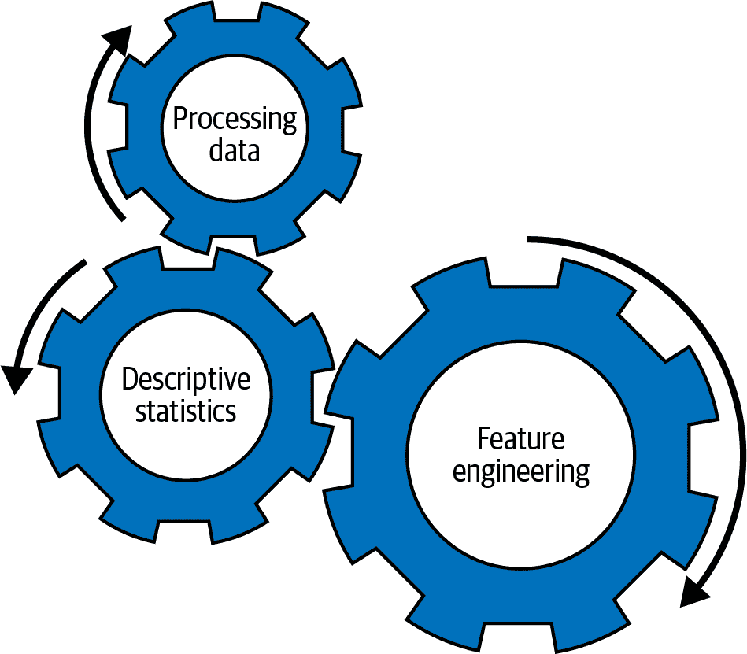
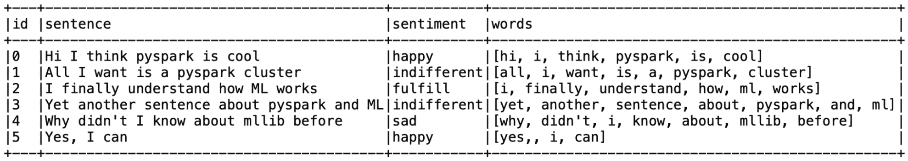
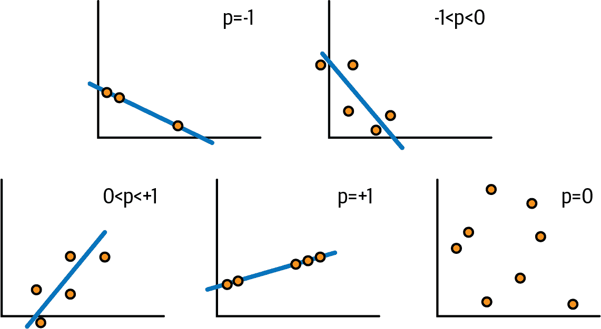
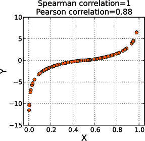

# 第四章：数据摄取、预处理和描述性统计

您很可能熟悉“垃圾进、垃圾出”的说法。这很好地捕捉了错误、不正确或荒谬的数据输入将始终产生错误输出的概念。在机器学习的背景下，它还强调了我们对数据摄取、预处理和统计理解（探索和准备数据）所付出的注意将对整个过程的成功产生影响。有错误的数据摄取直接影响数据质量，而错误的预处理也是如此。为了了解手头的数据及其正确性，我们利用描述性统计；这是过程的一个重要部分，因为它帮助我们验证我们使用的数据质量良好。数据科学家、机器学习工程师和数据工程师通常会花费大量时间在这些关键步骤上工作、研究和改进，我将在本章中为您详细介绍这些步骤。

在我们开始之前，让我们理解一下流程。假设最初，我们的数据存储在磁盘上、数据库中或云数据湖中。以下是我们将遵循的步骤，以了解我们的数据：

1.  *摄取*。我们首先将数据以其当前形式移入 DataFrame 实例中。这也称为数据的*反序列化*。更准确地说，在 Spark 中，在这一步骤中，我们定义了一个计划来反序列化数据，将其转换为 DataFrame。这一步通常会根据现有数据推断出一个基本的模式。

1.  *预处理*。这涉及将数据编组以适应我们期望的模式。如果我们将数据加载为字符串，而我们需要它作为浮点数，则将转换数据类型并根据需要调整值以适应期望的模式。这可能是一个复杂且容易出错的过程，特别是在多个来源的数据以多 TB 规模同步时，需要提前规划。

1.  *资格认证*。这一步骤包括使用描述性统计来理解数据及其处理方法。

步骤 2 和步骤 3 可能会重叠，因为我们可能会根据步骤 3 中计算出的统计信息对数据进行更多预处理。

现在，您对步骤有了一个大致的了解，让我们更深入地了解每一个步骤。

# 使用 Spark 进行数据摄取

Apache Spark 足够通用，允许我们扩展其 API 并开发专用连接器，以便使用连接器机制摄取（和持久化/存储）数据到任何类型的存储中。开箱即用，它支持各种文件格式，如 Parquet、CSV、二进制文件、JSON、ORC、图像文件等。

Spark 还使我们能够处理批处理和流处理数据。Spark 的*批处理 API*用于处理存储在文件存储或数据库中的离线数据。使用批处理数据时，数据集大小固定且不变化，我们不会获得任何新数据来处理。对于处理流数据，Spark 有一个称为 DStream 或简称 Streaming 的旧 API，以及一个更新、改进的称为*结构化流处理*的 API。结构化流处理提供了一个用于分布式连续处理结构化数据流的 API。它允许您一次处理多个数据记录，将输入流分成微批次。请记住，如果您的数据不是结构化的，或者格式不同，您将需要使用旧的 DStream API，或构建一个解决方案来自动化模式变化而不会失败。

在本章中，我们将专注于离线、冷数据的批处理。使用冷数据构建机器学习模型是各种用例中最常见的方法，例如视频制作、金融建模、药物发现、基因组研究、推荐引擎等等。我们将在第十章中讨论处理具有流数据的情况。

使用 `format` 函数指定具有定义数据格式的批量读取，例如：

```
df = spark.read.format("image")
```

可以通过[`DataFrameReader 类`](https://oreil.ly/NTjyk)来实现这一点。您可以通过其 `options` API 配置它，定义如何加载数据并推断模式（如果文件格式尚未提供），或者提取元数据（如果已提供）。

不同的文件格式可能具有模式，也可能没有，这取决于数据是*结构化*、*半结构化*还是*非结构化*，当然也取决于格式本身的实现。例如，JSON 格式被认为是半结构化的，开箱即用时它不维护关于行、列和特征的元数据。因此，在 JSON 中，模式是*推断*的。

另一方面，诸如 Avro 和 Parquet 这样的结构化数据格式具有描述数据模式的元数据部分。这使得可以*提取*模式。

## 处理图像

图像文件可以以未压缩、压缩或矢量格式存储数据。例如，JPEG 是一种压缩格式，TIFF 是一种未压缩格式。

我们保存数字数据以便于将其轻松转换为计算机显示器或打印机。这是[*光栅化*](https://oreil.ly/ezVss)的结果。光栅化的主要任务是将图像数据转换为像素网格，其中每个像素具有定义其颜色和透明度的若干位。为特定设备光栅化图像文件时，需要考虑设备设计用于处理的每像素位数（颜色深度）情况。当我们处理图像时，需要关注文件格式并了解它是压缩还是未压缩（在“图像压缩和 Parquet”中详细了解）。

在本章中，我们将使用一个名为[Caltech 256](https://oreil.ly/8Pi_w)的 Kaggle 图像数据集，其中包含使用 JPEG 压缩格式的图像文件。我们的第一步将是将它们加载到一个 Spark DataFrame 实例中。为此，我们可以在图像或二进制两种格式选项之间进行选择。

###### 注意

当您的程序处理 DataFrame 的`load`操作时，Spark 引擎不会立即将图像加载到内存中。如第二章所述，Spark 使用惰性评估，这意味着它不会实际加载图像，而是创建一个计划，以便在必要时加载。该计划包含有关实际数据的信息，例如表字段/列、格式、文件地址等。

### 图像格式

Spark MLlib 具有专用的图像数据源，使我们能够从目录中加载图像到 DataFrame 中，并使用 OpenCV 类型读取和处理图像数据。在本节中，您将了解更多相关信息。

[*OpenCV*](https://opencv.org)是用于计算机视觉工作负载的基于 C/C++的工具。MLlib 功能允许您将压缩图像（*.jpeg*、*.png*等）转换为 OpenCV 数据格式。加载到 Spark DataFrame 时，每个图像都存储为单独的行。

下列是支持的未压缩 OpenCV 类型：

+   CV_8U

+   CV_8UC1

+   CV_8UC3

+   CV_8UC4

其中`8`表示位深度，`U`表示无符号，`C``*x*`表示通道数。

###### 警告

自 Spark 3.1.1 起，图像大小限制为 1 GB。由于 Spark 是开源的，您可以在其源代码中跟踪图像大小支持的更新：在`ImageSchema.scala`对象的`decode`函数定义中，`assert(imageSize < 1e9, "image is too large")`这一行告诉我们，限制是 1 GB。

要探索相对较小的文件，Spark 提供的图像格式是开始处理图像并实际查看渲染输出的绝佳方式。但是，对于通用工作流程，在处理过程中实际上不需要查看图像本身的情况下，建议使用二进制格式，因为它更高效，能够更快地处理较大的图像文件。此外，对于较大的图像文件（≥1 GB），二进制格式是唯一的处理方式。而 Spark 的默认行为是对数据进行分区，但图像并不分区。对于像图像这样的空间对象，我们可以使用 *tiling* 来代替分区，即将图像分解成一组具有所需形状的片段（瓦片）。图像的分瓦处理可以作为数据预处理的一部分。未来，为了与语言保持一致，即使在讨论图像或空间对象时，我也会提到分区。

### 二进制格式

Spark 从版本 3.0 开始支持 [二进制文件数据源](https://oreil.ly/VSQ7a)¹，这使得它能够读取二进制文件并将其转换为表中的单个记录。记录包含原始内容作为 `BinaryType` 和一些元数据列。使用二进制格式读取数据会生成一个包含以下列的 DataFrame：

+   `path: StringType`

+   `modificationTime: TimestampType`

+   `length: LongType`

+   `content: BinaryType`

我们将使用这种格式来加载 Caltech 256 数据，如下面的代码片段所示：

```
from pyspark.sql.types import BinaryType
spark.sql("set spark.sql.files.ignoreCorruptFiles=true")

df = spark.read.format("binaryFile")
               .option("pathGlobFilter", "*.jpg")
               .option("recursiveFileLookup", "true")
               .load(*file_path*)
```

如 第二章 中所讨论的，我们数据集中的数据位于嵌套的文件夹层次结构中。`recursiveFileLookup` 可以使我们读取嵌套的文件夹*，* 而 `pathGlob​Fil⁠ter` 选项允许我们过滤文件，并仅读取扩展名为 *.jpg* 的文件。

再次注意，这段代码实际上并不会将数据加载到执行器中进行计算。正如之前讨论的那样，由于 Spark 的惰性评估机制，执行不会在触发动作之前开始——驱动程序会积累各种转换请求和查询，优化它们，并仅在有特定的动作请求时才执行。这使我们能够节省计算成本，优化查询，并增加代码的整体可管理性。

## 处理表格数据

由于 Spark 提供了各种文件格式的开箱即用连接器，因此处理表格数据变得非常简单。例如，在书籍的 [GitHub 仓库](https://oreil.ly/smls-git) 中，*datasets* 下你会找到 CO[2] 由车辆排放的数据集，数据以 CSV 格式存储。使用连接器函数 `.for⁠mat("csv")` 或直接使用 `.csv(*file_path*)`，我们可以轻松地将其加载到 DataFrame 实例中。

虽然即使使用`Infer​Schema`选项，Spark 在定义 CSV 文件中的列时往往会将其视为包含字符串，即使它们包含整数、布尔值等等，也需要注意模式。因此，在开始时，我们的主要工作是检查和校正列的数据类型。例如，如果输入 CSV 文件中的某列包含 JSON 字符串，则需要编写专用代码来处理此 JSON。

请注意，每个 Spark 数据源连接器都具有独特的属性，为您提供处理损坏数据的一系列选项。例如，通过将`spark.sql.csv​.parser​.column​Prun⁠ing​.enabled`设置为`False`，您可以控制列修剪行为，以避免修剪格式或数据损坏的列，或者设置为`True`以进行相反的行为。您还可以利用`mode`参数使修剪更具体，例如使用`PERMISSIVE`将字段设置为`null`，使用`DROPMALFORMED`来忽略整个记录，或使用`FAILFAST`在处理损坏记录时抛出异常。请参见以下代码片段的示例：

```
df = spark.read.option("mode","FAILFAST")
               .option("delimiter","\t")
               .csv(*file_path*)
```

加载数据并将其反序列化为 DataFrame 后，现在是预处理它的时候了。在继续之前，我建议将数据保存为具有类型化模式和明确定义列名和类型的格式，例如 Parquet 或 Avro。

# 数据预处理

预处理是将数据转换为所需状态的艺术，无论是强类型模式还是算法所需的特定数据类型。

## 预处理与处理对比

当您刚开始学习机器学习时，区分预处理和处理可能会很困难。*预处理*指的是我们在验证数据集本身之前所做的所有工作。在尝试使用描述性统计分析数据或进行特征工程之前，这项工作已完成，而这两者都属于*处理*的范畴。这些程序是相互交织的（见图 4-1），我们可能会一遍又一遍地重复执行它们，直到将数据达到所需状态。Spark 为我们提供了完成这些任务所需的所有工具，无论是通过 MLlib 库还是 SQL API。



###### 图 4-1\. 机器学习期间的交织过程

## 为什么要预处理数据？

预处理数据或将其整理成所需的模式是必不可少的步骤，在我们甚至开始探索数据之前，更别说进行特征工程了。它如此重要的原因在于，机器学习算法通常有专门的输入要求，例如特定的数据结构和/或数据类型。在一些学术研究论文中，您可能会发现这个过程被称为*数据编组*。

为了让您了解在将数据传递给 MLlib 算法之前可能需要执行的预处理类型，让我们快速查看不同种类算法的高级需求：

分类和/或回归算法

对于分类和回归，您需要将数据转换为一个类型为`vector`（密集或稀疏）且值为`double`或`float`的列。通常将此列命名为`features`，但稍后您可以灵活设置输入列的名称。

推荐算法

对于推荐，您会希望有一个`userCol`列，其值为`integer`，表示用户 ID；一个`itemCol`列，其值为`integer`，表示项目 ID；以及一个`ratingCol`列，其值为`double`或`float`，表示用户对项目的评分。

无监督学习

在处理需要无监督学习方法的数据时，您通常需要一个类型为`vector`的列来表示您的特征。

## 数据结构

根据其结构，数据通常需要处理才能完全利用。数据可分为三类：

结构化

结构化数据具有高度的组织性。它以预定义的模式格式存储，如逗号分隔值（*.csv*）文件或数据库中的表格。有时也称为*表格*数据。

半结构化

半结构化数据具有一定的组织性，但结构不太严格，模式不固定。可能存在标签以分隔元素并强制层次结构，例如 JSON 文件中的情况。这类数据可能需要在用于机器学习算法之前进行预处理。

无结构化

无结构化数据没有定义的组织和特定的格式——比如*.jpeg*图像、*.mp4*视频文件、音频文件等。这些数据通常需要在建模之前进行重要的预处理。今天我们创建的大多数数据都是无结构化数据。

## MLlib 数据类型

MLlib 具有自己专用的数据类型，用作机器学习算法的输入。要使用 Spark MLlib，您需要将列转换为这些类型之一——这就是为什么预处理和转换数据是您将以互锁方式执行的过程。在底层，Spark 使用私有对象`VectorUDT`和`MatrixUDF`，这些对象抽象了多种类型的本地向量（密集、稀疏、带标签点）和矩阵（本地和分布式）。这些对象允许与`spark.sql.Dataset`功能轻松交互。从高层次来看，这两种类型的对象如下所示：

向量

向量对象表示数值向量。您可以将其视为数组，就像在 Python 中一样，只是这里的索引类型为`integer`，值类型为`double`。

矩阵

矩阵对象表示一个数值矩阵。它可以是本地的一台机器上的矩阵，也可以分布在多台机器上。本地版本中，索引类型为`integer`，值类型为`double`。分布式版本中，索引类型为`long`，值类型为`double`。所有矩阵类型都由向量表示。

###### 注意

为了简化我们使用 Python 工具的工作，MLlib 将 NumPy 数组和 Python 列表识别为密集向量，并将 SciPy 的[`csc_matrix`](https://oreil.ly/Tw5L3)识别为只有一列的稀疏向量。这使我们能够更轻松地在不同工具之间进行转换。在使用多个工具时请记住这一点。

理解 MLlib 中稀疏和密集向量的表示方式是很有必要的，因为你会在文档和实验中经常遇到它们。Spark 会根据任务自动决定创建哪种类型的向量。

###### 注意

第三种向量类型是带标签的点；它表示数据点的特征和标签，可以是密集的或稀疏的。在 MLlib 中，带标签的点用于监督学习算法。

让我们从一个密集向量开始。这里是一个例子：

```
Row(features=DenseVector([1.2, 543.5, 0.0, 0.0, 0.0, 1.0, 0.0]))]
```

一个`DenseVector`由一个固定大小的值数组组成。在内存消耗方面，它比`SparseVector`要低效，因为它明确地为指定的向量大小创建内存空间，包括任何空/默认值。在我们的例子中，`DenseVector`有七个值，但其中四个是空的（`0.0`是默认值，所以这些被视为空值）。

一个`SparseVector`是对具有空/默认值的`DenseVector`的优化。让我们看一下我们的例子`DenseVector`如何被转换成`SparseVector`：

```
Row(features=SparseVector(7,{0:1.2, 1: 543.5, 5:1.0}))
```

第一个数字表示向量的大小（`7`），而映射（`{...}`）表示索引及其值。在这个向量中，只有三个值需要存储：索引 0 处的值为`1.2`，索引 2 处的值为`543.5`，索引 5 处的值为`1`。其他索引处的值不需要存储，因为它们都是默认值。

让我们看一个更大的向量示例：

```
[Row(features=SparseVector(50, {48: 9.9, 49: 6.7}))]
```

在这种情况下，向量大小为 50，我们只有两个值需要存储：索引 48 处的`9.9`和索引 49 处的`6.7`。

一个`SparseVector`也可以看起来像这样：

```
(50,[48,49],[9.9,6.7])
```

其中第一个数字（这里是`50`）表示大小，第一个数组（`[48,49]`）表示存储在`SparseVector`中的索引，第二个数组（`[9.9,6.7]`）表示这些索引处的值。因此，在这个例子中，索引 48 处的值是`9.9`，索引 49 处的值是`6.7`。其余的向量索引都是`0.0`。

为什么我们需要这两种类型的向量？在机器学习中，一些算法（例如朴素贝叶斯分类器）对密集向量特征的处理效果更好，因此可能在使用稀疏向量特征时表现较差。

如果你的机器学习算法不能很好地处理你拥有的特征，你可以做些什么呢？首先，接下来描述的过程将帮助你了解数据并使其适应你的机器学习目标。如果需要，你可以尝试收集更多数据。你还可以选择在稀疏向量上表现更好的算法。毕竟，这是构建机器学习模型过程的一部分！

###### 提示

请确保收藏并使用[MLlib 文档](https://oreil.ly/DfP7R)。有一个专注于改进 Spark 文档的社区项目，每天都在进步变得更好。

## 使用 MLlib 变换器进行预处理

*变换器*是 Apache Spark MLlib 库中命名为`pyspark.ml.feature`的一部分。除了变换器外，它还提供*提取器*和*选择器*。其中许多基于机器学习算法以及统计或数学计算。对于预处理，我们将利用变换器 API，但在不同情况下，你可能会发现其他 API 也很有帮助。

Spark 中的变换器是接受 DataFrame 作为输入并输出具有所需列的新 DataFrame 的算法或函数。换句话说，你可以把它们看作将给定输入转换为相应输出的工具。变换器使我们能够扩展、转换或修改现有列。我们可以大致分为以下几类：*文本数据变换器*、*分类特征变换器*、*连续数值变换器*和*其他*。

以下各节的表格将指导你何时使用每个变换器。你应该知道，由于变换器的统计性质，某些 API 可能需要更长的时间才能完成。

### 处理文本数据

文本数据通常包括代表单词、句子或任何形式自由流动文本的文档。这是固有的非结构化数据，通常具有噪声。在机器学习中，*噪声*数据是指影响模型性能的无关或无意义数据。例如，停用词如*a*、*the*、*is*和*are*。在 MLlib 中，你会找到专门用于提取停用词等功能，以及更多！MLlib 为处理文本数据输入提供了丰富的功能集。

对于文本，我们希望将其输入并转换为可以轻松馈送到机器学习算法中的格式。MLlib 中的大多数算法期望输入为结构化数据，以表格形式呈现，带有行、列等。此外，为了在内存消耗方面高效率，我们通常会对字符串进行哈希处理，因为字符串值占用的空间比整数、浮点数或布尔值多。在将文本数据添加到你的机器学习项目之前，你首先需要使用文本数据变换器清理它。要了解常见 API 及其用法，请查看表格 4-1。

表格 4-1\. 文本数据变换器

| API | 用法 |
| --- | --- |
| `Tokenizer` | 通过空格分割文本列为单词列表。基于正则表达式（regex）`\\s`，匹配单个空格字符。`Tokenizer` API 内部使用`java.lang.String.split`函数。 |
| `Regex​Tokenizer` | 根据输入的正则表达式（默认为`\\s+`，匹配一个或多个空白字符）分割文本。通常用于在空白字符和/或逗号以及其他支持的分隔符上分割。`RegexTokenizer`比`Tokenizer`更耗费计算资源，因为它使用`scala.util.matching`正则表达式函数。提供的正则表达式应符合 Java 正则表达式语法。 |
| `HashingTF` | 接受一个字符串数组并从中生成哈希。在许多自由文本场景中，您需要先运行`Tokenizer`函数。这是最常用的转换器之一。 |
| `NGram` | 给定整数 `*n*`，提取一个`*n*`个标记的序列。输入列只能是字符串数组。要将文本字符串转换为字符串数组，请先使用`Tokenizer`函数。 |
| `StopWordsRemover` | 接受一系列文本并删除默认的停用词。您可以指定语言、大小写敏感性并提供自己的停用词列表。 |

在我们继续之前，让我们生成一个合成数据集，用于接下来的示例：

```
sentence_data_frame = spark.createDataFrame([
    (0, "Hi I think pyspark is cool ","happy"),
    (1, "All I want is a pyspark cluster","indifferent"),
    (2, "I finally understand how ML works","fulfilled"),
    (3, "Yet another sentence about pyspark and ML","indifferent"),
    (4, "Why didn’t I know about mllib before","sad"),
    (5, "Yes, I can","happy")
], ["id", "sentence", "sentiment"])
```

我们的数据集有三列：`id`，类型为`int`，以及`sentence`和`sentiment`，类型为`string`。

转换包括以下步骤：

1.  自由文本 → 单词列表

1.  单词列表 → 有意义单词列表

1.  选择有意义的值

准备好了吗？开始转换吧！我们的第一步是将自由文本转换为单词列表。为此，我们可以使用`Tokenizer`或`RegexTokenizer` API，如下所示：

```
from pyspark.ml.feature import Tokenizer

tokenizer = Tokenizer(inputCol="sentence", outputCol="words")
tokenized = tokenizer.transform(sentence_data_frame)
```

这告诉`Tokenizer`将`sentence`列作为输入，并生成一个新的 DataFrame，添加一个名为`words`的输出列。请注意，我们使用了`transform`函数——转换器始终具有此函数。图 4-2 显示了我们带有新增`words`列的新 DataFrame。



###### 图 4-2\. 带有`words`列的新 DataFrame

下一步是移除停用词，即在我们的机器学习过程中可能提供的价值不大的词语。为此，我们将使用`StopWordsRemover`：

```
from pyspark.ml.feature import StopWordsRemover

remover = StopWordsRemover(inputCol="words", outputCol="meaningful_words")
meaningful_data_frame = remover.transform(tokenized)
*`# I use the show function here for educational purposes only; with a large`* 
*`# dataset, you should avoid it.`*
meaningful_data_frame.select("words","meaningful_words").show(5,truncate=False)
```

示例 4-1 显示了带有新`meaningful_words`列的 DataFrame。

##### 示例 4-1\. 带有`meaningful_words`列的新 DataFrame

```
+-------------------------------------------------+-------------------------------------+
|words                                            |meaningful_words                     |
+-------------------------------------------------+-------------------------------------+
|[hi, i, think, pyspark, is, cool]                |[hi, think, pyspark, cool]           |
|[all, i, want, is, a, pyspark, cluster]          |[want, pyspark, cluster]             |
|[i, finally, understand, how, ml, works]         |[finally, understand, ml, works]     |
|[yet, another, sentence, about, pyspark, and, ml]|[yet, another, sentence, pyspark, ml]|
|[why, didn't, i, know, about, ml lib, before]    |[know, mllib]                        |
|[yes,, i, can]                                   |[yes,]                               |
+-------------------------------------------------+-------------------------------------+

```

### 从名义分类特征到索引

我们可以使用的策略之一是将以`string`格式表示的离散分类值转换为数字形式的索引，以加快机器学习过程。这些值可以是离散的或连续的，具体取决于我们计划使用的机器学习模型。表 4-2 列出了最常见的 API 并描述了它们的使用情况。

表 4-2\. 分类特征转换器

| API | 使用方法 |
| --- | --- |
| `String​Indexer` | 将字符串列编码为索引，其中第一个（从索引 0 开始）是列中最频繁的值，依此类推。用于使用监督数据进行更快速训练，其中列是类别/标签。 |
| `IndexTo​String` | `StringIndexer`的反向操作：将标签索引列映射回包含原始标签的列。通常在训练过程后用于检索标签类别。 |
| `OneHot​Encoder` | 将表示为标签索引的列的分类特征映射到二进制向量列中，每行最多有一个值为 1，表示该类别。这允许期望连续特征的机器学习算法（如逻辑回归）使用分类特征，通过将其映射到连续特征中。 |
| `Vector​Indexer` | 类似于`StringIndexer`，接受向量列作为输入并将其转换为类别索引。 |

我们生成的 DataFrame 包括一个表示文本情感的列。我们的情感类别是`happy`、`fulfilled`、`sad`和`indifferent`。让我们使用`StringIndexer`将它们转换为索引：

```
from pyspark.ml.feature import StringIndexer
indexer = StringIndexer(inputCol="sentiment", outputCol="categoryIndex")
indexed = indexer.fit(meaningful_data_frame).transform(meaningful_data_frame)
indexed.show(5)
```

在这段代码片段中，我们创建了一个新的`StringIndexer`实例，它以`sentiment`列作为输入，并创建了一个类型为`double`的新 DataFrame，其中包含一个`categoryIndex`列。我们首先调用`fit`函数，并提供我们 DataFrame 的名称。这一步骤是训练索引器必不可少的，它通过扫描`sentiment`列来构建索引和类别之间的映射。这个函数由另一个预处理工具执行，称为*估计器*，我们将在第六章中更详细地讨论它。在拟合估计器之后，我们调用`transform`函数来计算新的索引。示例 4-2 展示了包含新`cate⁠gory​Index`列的 DataFrame。

##### 示例 4-2\. 包含`categoryIndex`列的 DataFrame

```
+---+--------------------+-----------+--------------------+--------------------+-------------+ 
| id|            sentence|  sentiment|               words|    meaningful_words|categoryIndex|
+---+--------------------+-----------+--------------------+--------------------+-------------+
|  O|Hi I think pyspar...|      happy|[hi, i, think, py...|[i, think, pyspa... |          0.0|
|  1|All I want is a p...|indifferent|[all, i, want, is...|[want, pyspark, c...|          1.0|
|  2|I finally underst...|  fulfilled|[i, finally, unde...|[finally, underst...|          2.0|
|  3|Yet another sente...|indifferent|[yet, another, se...|[yet, another, se...|          1.0|
|  4|Why didn't I know...|        sad|[why, didn't, i, ...|       [know, mllib]|          3.0|
|  5|          Yes, I can|      happy|      [yes,, i, can]|              [yes,]|          0.0|
+---+--------------------+-----------+--------------------+--------------------+-------------+

```

### 结构化连续数值数据

在某些情况下，我们可能有连续的数值数据需要进行结构化。我们通过提供阈值或多个阈值来采取行动或进行分类决策。

###### 注意

连续的数值通常以向量形式表示，常见的数据类型包括`integer`、`float`和`double`。

例如，当我们拥有特定情感的分数时，如示例 4-3 所示，我们可以在给定分数落入定义范围时采取行动。想象一下一个客户满意度系统——我们希望我们的机器学习模型基于客户情感分数推荐一个行动。假设我们的最大客户有一个`sad`分数为`0.75`，我们调用客户讨论如何改善其体验的阈值为`sad`分数超过`0.7`。在这种情况下，我们会希望联系客户。阈值本身可以通过手动定义或使用机器学习算法或纯统计方法来定义。未来，假设我们拥有一个 DataFrame，其中每种情感都有一个专门的分数。该分数是一个连续数字，范围在`[0,1]`内，指定情感类别的相关性。我们想要实现的业务目标将决定使用的阈值和为未来推荐数据指定的结构。

##### 示例 4-3\. 每个类别的情感分数的 DataFrame

```
+-----------+-----+-----------+---------+----+
|sentence_id|happy|indifferent|fulfilled| sad|
+-----------+-----+-----------+---------+----+
|          0| 0.01|       0.43|      0.3| 0.5|
|          1|0.097|       0.21|      0.2| 0.9|
|          2|  0.4|      0.329|     0.97| 0.4|
|          3|  0.7|        0.4|      0.3|0.87|
|          4| 0.34|        0.4|      0.3|0.78|
|          5|  0.1|        0.3|     0.31|0.29|
+-----------+-----+-----------+---------+----+

```

在处理数据类型时，请根据需要进行类型转换。您可以利用 Spark SQL API，如下所示：

```
cast_data_frame = sentiment_data_frame.selectExpr("cast(happy as double)")
```

以下是处理连续数值数据的一些常见策略：

固定分桶/分箱

这是通过手动方式完成的，可以通过提供特定的阈值或提供一系列桶来对数据进行二值化。这个过程类似于我们之前讨论的关于结构化连续数据的内容。

自适应分桶/分箱

整体数据可能存在偏斜，某些值频繁出现，而其他值则较少。这可能会使得手动为每个桶指定范围变得困难。自适应分桶是一种更高级的技术，其中转换器计算数据的分布，并设置桶的大小，使得每个桶大致包含相同数量的值。

表 4-3 列出了 MLlib 中最常用的连续数值转换器。根据您的需求选择最适合项目的转换器。

表 4-3\. 常见的连续数值转换器

| API | 用法 |
| --- | --- |
| `Binarizer` | 将数值特征转换为二进制特征，给定一个阈值。例如，当阈值为 0.7 时，5.1 会转换为 1，而 0.6 则会转换为 0。 |
| `Bucketizer` | 获取一个连续数值列，并将其转换为桶的列，其中每个桶表示数值范围的一部分，例如，0 到 1，1 到 2 等。 |
| `MaxAbsScaler` | 获取一个`float`值向量，并将每个值除以输入列中的最大绝对值。 |
| `MinMaxScaler` | 将数据缩放到期望的`min`和`max`值，其中默认范围为`[0,1]`。 |
| `Normalizer` | 将`double`值的向量转换为归一化的非负实数值，范围在 0 到 1 之间。默认的*p*-范数为 2，实现欧几里德范数用于计算距离并将`float`范围减少到`[0,1]`。 |
| `Quantile​Dis⁠cre⁠tizer` | 接受连续数值值的列，并将其转换为包含分箱分类值的列，输入最大箱数可选地确定近似分位值。 |
| `RobustScaler` | 类似于`StandardScaler`，接受`float`值的向量并生成给定输入分位数范围的特征缩放后的向量。 |
| `StandardScaler` | 估计器，接受`float`值的向量，并旨在根据输入的标准偏差和均值来居中数据。 |

### 额外的转换器

MLlib 提供许多额外的转换器，使用统计数据或抽象其他 Spark 功能。Table 4-4 列出了其中一些并描述了它们的用途。请注意，更多转换器会定期添加，代码示例可在[Apache Spark GitHub 存储库](https://oreil.ly/SQxG9)的*examples/src/main/python/ml/*目录中找到。

表 4-4\. 额外的转换器

| API | 使用 |
| --- | --- |
| `DCT` | 实现离散余弦变换，接受时间域数据点的向量，并将其转换为频率域。用于信号处理和数据压缩（例如图像、音频、无线电和数字电视）。 |
| `Elementwise​Product` | 接受带有数据向量的列和相同大小的变换向量，并输出它们的乘积，该乘积是可结合、可分配和可交换的（基于 Hadamard 乘积）。用于缩放现有向量。 |
| `Imputer` | 接受数值类型的列，并使用列均值或中位数值来填充数据集中的缺失值。在使用不能处理缺失值的估算器时很有用。 |
| `Interaction` | 接受一个不同的向量或`double`值列，并输出一个包含所有可能值组合的向量列的乘积。 |
| `PCA` | 实现主成分分析，将潜在相关值的向量转换为非相关值，输出数据的主要组成部分（主成分）。这在预测模型和降维中很有用，但可能牺牲解释性。 |
| `Polynomial​Expansion` | 接受特征向量并将其扩展为*n*次多项式空间。值为 1 表示不扩展。 |
| `SQL​Trans⁠for⁠mer` | 接受一个 SQL 语句（Spark 支持的任何`SELECT`子句）并根据语句转换输入。 |
| `Vector​Assem⁠bler` | 接受向量列列表并将它们连接成数据集中的一列。对于仅接受单列的各种估计器很有用。 |

## 图像数据预处理

图像数据在机器学习应用中很常见，也需要预处理才能在机器学习工作流中继续前进。但图像与我们之前看到的数据类型不同，它们需要不同类型的处理过程。根据实际数据的情况，可能会涉及更多或更少的步骤，但最常见的路径包括以下三个动作：

1.  提取标签

1.  将标签转换为索引

1.  提取图像大小

让我们使用我们的示例数据集来走一遍这些步骤，看看它们涉及到什么。

### 提取标签

我们的图像数据集具有嵌套结构，其中目录名指示图像的分类。因此，每个图像在文件系统上的路径包含其标签。我们需要提取这些数据，以便稍后使用。大多数原始图像数据集遵循这种模式，这是我们将要对图像进行的预处理的重要部分。在将图像加载为`BinaryType`后，我们得到一个包含名为`path`的`String`类型列的表。这包含我们的标签。现在，是时候利用字符串操作来提取这些数据了。让我们看一个例子路径：`.../256_Object​Cat⁠egories/198.spider/198_0089.jpg`。

在这种情况下，标签实际上是一个索引和一个名称：`198.spider`。这是我们需要从字符串中提取的部分。幸运的是，PySpark SQL 函数为我们提供了`regexp_extract` API，可以根据我们的需求轻松操作字符串。

让我们定义一个函数，它将获取`path_col`并使用正则表达式`"256_ObjectCategories/([^/]+)"`来提取标签：

```
from pyspark.sql.functions import col, regexp_extract

def extract_label(path_col):
    """Extract label from file path using built-in SQL function"""
    return regexp_extract(path_col,"256_ObjectCategories/([^/]+)",1)
```

现在我们可以通过从 Spark SQL 查询中调用这个函数来创建一个带有标签的新 DataFrame：

```
images_with_label = df_result.select( 
    col("path"),
    extract_label(col("path")).alias("label"),
    col("content"))
```

我们的`images_with_label` DataFrame 由三列组成：两个名为`path`和`label`的字符串列，以及一个名为`content`的二进制列。

现在我们有了标签，是时候将它们转换为索引了。

### 将标签转换为索引

如前所述，我们的`label`列是一个字符串列*。这对于机器学习模型可能构成挑战，因为字符串在内存使用上较重。理想情况下，我们表中的每个字符串在被输入机器学习算法之前都应转换为更高效的表示，除非这是真正必要的。由于我们的标签的格式是`*{index.name}*`，我们有三个选项：

1.  从字符串本身中提取索引，利用字符串操作。

1.  使用 Spark 的`StringIndexer`提供一个新的索引，如“从名义分类特征到索引”中所讨论的。

1.  使用 Python 定义一个索引（在 Caltech 256 数据集中，只有 257 个索引，范围在`[1,257]`内）。

在我们的情况下，第一种选项是处理这个问题最干净的方式。这种方法将允许我们避免在原始文件的索引和数据集中的索引之间维护映射。

### 提取图像大小

最后一步是提取图像大小。我们在预处理过程中执行此操作，因为我们确切地知道我们的数据集包含不同大小的图像，但了解数据并为我们决定算法提供信息通常是有用的操作。某些机器学习算法需要我们对图像有一个统一的大小，提前知道我们正在处理的图像大小可以帮助我们做出更好的优化决策。

由于 Spark 尚未提供此功能，我们将使用[Pillow](https://oreil.ly/kfoQR)（也称为 PIL），这是一个友好的 Python 库，用于处理图像。为了高效地提取所有图像的宽度和高度，我们将定义一个 pandas 用户定义的函数（UDF），可以在我们的 Spark 执行器上以分布方式运行。使用`pandas_udf`作为装饰器定义的 pandas UDF 使用 Apache Arrow 进行了优化，并且对于分组操作（例如，在`groupBy`之后应用时）更快。

分组允许 pandas 执行向量化操作。对于这些用例，Spark 上的 pandas UDF 会更高效。对于像`a*b`这样的简单操作，Spark UDF 就足够了，并且会更快，因为它的开销更少。

我们的 UDF 将接收一系列行并并行操作它们，使其比传统的逐行操作快得多：

```
from pyspark.sql.functions import col, pandas_udf
from PIL import Image
import pandas as pd
@pandas_udf("width: int, height: int")
def extract_size_udf(content_series):
    sizes = content_series.apply(extract_size)
return pd.DataFrame(list(sizes))
```

现在我们有了这个函数，我们可以将它传递给 Spark 的`select`函数来提取图像大小信息：

```
images_df = images_with_label.select( 
    col("path"),
    col("label"),
    extract_size_udf(col("content")).alias("size"),
    col("content"))
```

图像大小数据将被提取到一个新的 DataFrame 中，该 DataFrame 包含一个`size`列，其类型为`struct`，包含`width`和`height`：

```
size:struct
    width:integer
    height:integer
```

###### 警告

请注意，使用`extract_size_udf`函数将所有图像从 JVM（Spark 在内部使用 Scala）传输到 Python 运行时使用 Arrow 计算大小，然后将大小再传输回 JVM。在处理大型数据集时尤其如此，特别是如果您不使用分组时，可能值得在 JVM/Scala 级别实现大小的提取。在实现各个阶段的机器学习数据预处理时，请牢记这样的考虑因素。

## 保存数据并避免小文件问题

当你完成所有预处理工作后，将数据保存到冷热存储可能是个好主意，然后再继续下一步。有时这被称为*检查点*，或者在我们对数据版本满意时保存数据的时间点。保存数据的一个原因是为了实现*快速恢复*：如果我们的 Spark 集群彻底崩溃，而不是需要从头开始重新计算一切，我们可以从上次的检查点恢复。第二个原因是促进协作。如果您的预处理数据持久保存在存储中并可供同事使用，他们可以利用它开发自己的流程。在处理大型数据集和需要大量计算资源和时间的任务时，这尤为有用。Spark 为我们提供了在多种格式中接收和保存数据的功能。请注意，如果决定保存数据用于协作目的，重要的是记录所有步骤：您进行的预处理、用于实施它的代码、当前的用例、执行的任何调整以及创建的任何外部资源，例如停用词列表。

### 避免小文件

*小文件*指的是明显小于存储块大小的任何文件。是的，在像 Amazon S3、Azure Blob 等对象存储中，都有最小块大小！由于存储会使用整个块来保存该文件，无论它有多小，因此比块大小显著小的文件可能会导致磁盘空间浪费。这是一种我们应该避免的额外开销。此外，存储优化为按块大小支持快速读写。但别担心——Spark API 来帮忙！我们可以利用 Spark 的`repartition`或`coalesce`函数轻松避免浪费宝贵空间并支付高额的小文件存储成本。

在我们的情况下，由于我们正在处理离线数据，没有特定要求需要在毫秒级完成计算，我们在选择使用哪种方法时更具灵活性。`repartition`创建全新的分区，通过网络对数据进行重分布，目的是均匀分布在指定数量的分区上（可以高于或低于现有数量）。因此，它的初始成本很高，但后续，Spark 功能将因数据的最佳分布而执行得更快——实际上，在机器学习工作流的任何阶段执行`repartition`操作时，可以帮助加快计算速度，特别是当我们注意到计算相对缓慢时。另一方面，`coalesce`函数首先检测现有的分区，然后仅重分布必要的数据。它只能用于减少分区数量，而不能用于增加分区数量，并且因最小化通过网络进行数据传输量而被认为比`repartition`运行得更快。在某些情况下，`coalesce`可能根本不会进行数据重分布，并且会默认为批处理本地分区，这使得它对于减少功能非常高效。

由于我们希望精确控制分区的确切数量，并且不需要极快的执行速度，在我们的情况下使用较慢的`repartition`函数是可以接受的，如下所示：

```
output_df = output_df.repartition(NUM_EXECUTERS)
```

请记住，如果时间、效率和最小化网络负载至关重要，则应选择`coalesce`函数。

### 图像压缩和 Parquet

假设我们想要将图像数据集保存为 Parquet 格式（如果您对此不熟悉，Parquet 是一种开源的面向列的数据文件格式，旨在实现高效的存储和检索）。在保存为此格式时，默认情况下 Spark 使用名为 Snappy 的压缩编解码器。然而，由于图像已经经过压缩（例如，使用 JPEG、PNG 等），再次压缩它们就没有意义了。我们该如何避免这种情况？

我们保存现有配置的压缩编解码器为字符串实例，将 Spark 配置为使用*未压缩*编解码器写入 Parquet，保存数据以 Parquet 格式，并将编解码器实例重新分配给 Spark 配置以供未来使用。以下代码片段示例：

```
# Image data is already compressed, so we turn off Parquet compression
compression = spark.conf.get("spark.sql.parquet.compression.codec")
spark.conf.set("spark.sql.parquet.compression.codec", "uncompressed")

# Save the data stored in binary format as Parquet
output_df.write.mode("overwrite").parquet(save_path)
spark.conf.set("spark.sql.parquet.compression.codec", compression)
```

# 描述性统计：了解数据的感觉

机器学习并非魔法——您需要深入了解数据，以便有效地处理它。在开始训练算法之前对数据有扎实的理解，将为您节省大量的时间和精力。幸运的是，MLlib 提供了一个名为`pyspark.ml.stat`的专用库，其中包含从数据中提取基本统计信息所需的所有功能。

如果这听起来令人生畏，不要担心——您不需要完全理解统计学就能使用 MLlib，尽管一定程度上的熟悉肯定会在您的机器学习之旅中有所帮助。使用统计数据了解数据使我们能够更好地决定选择哪种机器学习算法，识别偏差，并估计数据的质量——如前所述，如果你输入的是垃圾数据，那么输出也将是垃圾。将低质量数据输入到机器学习算法中将导致性能低下的模型。因此，这部分内容是必不可少的！

话虽如此，只要我们对数据的外观建立有意识的假设，知道我们可以接受什么，不能接受什么，我们就能进行更好的实验，并更好地了解需要去除什么，需要输入什么，以及我们可以对什么宽容。请考虑，在数据探索阶段对数据输入、质量测量和构成“坏”或低质量数据的假设的不匹配可能会产生重大后果，尤其是在生产中（例如，在大量行中丢弃所有空值或填充太多默认值，这将完全破坏熵）。要警惕假设之间的不匹配！

###### 提示

对于给定数据集的深入统计分析，许多数据科学家使用 [pandas](https://oreil.ly/eZ8o9) 库。如 第二章 所述，pandas 是一个用于处理能够放入一台机器内存（RAM）中相对较小数据的 Python 分析库。在 Apache Spark 生态系统中的对应物是 [Koalas](https://oreil.ly/HVzc9)，它已经演变成了 Spark 上的 pandas API。虽然原始 pandas 和 Spark 上的 pandas API 并非完全特性对齐，但这个 API 扩展了 Spark 的能力，使其更加强大，因此值得一试。

在这一部分，我们将从直接的流程转向使用 Spark MLlib 功能来计算统计数据，以便对数据有一个感性的了解。

## 计算统计数据

欢迎来到机器学习动物园项目！

要学习 MLlib 的统计功能，我们将使用来自 [Kaggle 仓库](https://oreil.ly/RHuSJ) 的动物分类数据集。这个数据集创建于 1990 年，包含了 101 个动物示例，由 16 个布尔值属性描述，捕捉了各种特征。这些动物可以被分类为七种类型：哺乳动物、鸟类、爬行动物、鱼类、两栖动物、昆虫和无脊椎动物。

要了解数据并更好地规划机器学习之旅的第一步是计算特征统计信息。知道数据的分布情况将为您提供宝贵的见解，帮助您确定选择哪些算法、如何评估模型，以及整体需要投入多少工作。

## 使用 Spark Summarizer 进行描述性统计

[*描述统计*](https://oreil.ly/Y174f)是[摘要统计](https://oreil.ly/6RFxO)，它定量描述或总结了来自一组[信息](https://oreil.ly/iINTU)的特征。MLlib 为我们提供了一个专用的`Summarizer`对象，用于从特定列计算统计指标。这个功能是 MLlib 的`LinearRegression`算法用于构建`Line​ar​Regression​Summary`的一部分。在构建 Summarizer 时，我们需要指定所需的指标。表 4-5 列出了 Spark API 中可用的功能。

表 4-5\. Summarizer 指标选项

| 指标 | 描述 |
| --- | --- |
| `mean` | 计算给定数值列的平均值 |
| `sum` | 计算数值列的总和 |
| `variance` | 计算列的方差（列中一组数字平均偏离其均值的程度） |
| `std` | 计算列的标准差（方差值的平方根），以更加重视列中的异常值 |
| `count` | 计算数据集中项目/行的数量 |
| `numNonZeros` | 找到列中非零值的数量 |
| `max` | 在列中找到最大值 |
| `min` | 在列中找到最小值 |
| `normL1` | 计算列的 L1 范数（数值之间的相似性） |
| `normL2` | 计算列的欧几里得范数 |

###### 注意

L1 和 L2（也称为欧几里得）范数是计算*N*维空间中数值点之间距离的工具。它们通常作为度量衡量数据点之间相似性的指标，在几何学、数据挖掘和深度学习等领域中广泛使用。

这段代码片段说明了如何创建具有指标的`Summarizer`实例：

```
from pyspark.ml.stat import Summarizer
summarizer = Summarizer.metrics("mean","sum","variance","std")
```

与 MLlib 的其他功能类似，Summarizer.metrics 函数期望将数值特征的向量作为输入。您可以使用 MLlib 的`Vector​Assembler`函数来组装向量。

尽管动物园动物分类数据集中有许多特征，我们将仅检查以下列：

+   `羽毛`

+   `牛奶`

+   `鳍`

+   `国内的`

正如在“使用 Spark 进行数据摄取”中讨论的那样，我们将数据加载到名为`zoo_data_for_statistics`的 DataFrame 实例中。

在下一个代码示例中，您可以看到如何构建向量。请注意，我们将输出列名设置为`features`，正如摘要器所预期的那样：

```
from pyspark.ml.feature import VectorAssembler
*`# set the output col to features as expected as input for the summarizer`*
vecAssembler = VectorAssembler(outputCol="features")
*`# assemble only part of the columns for the example`*
vecAssembler.setInputCols(["feathers","milk","fins","domestic"])
vector_df = vecAssembler.transform(zoo_data_for_statistics)
```

我们的向量利用了 Apache Spark 的 Dataset 功能。在 Spark 中，Dataset 是一种强类型的对象集合，封装了 DataFrame。如果需要，您仍然可以从 Dataset 中调用 DataFrame，但 Dataset API 使您能够访问特定列，而无需专门的列功能：

```
Vector_df.features
```

现在我们有了一个专用的向量列和一个汇总器，让我们提取一些统计数据。我们可以调用`summarizer.summary`函数来绘制所有指标或计算特定指标，如下例所示：

```
*`# compute statistics for multiple metrics`*
statistics_df = vector_df.select(summarizer.summary(vector_df.features))
*`# statistics_df will plot all the metrics`*
statistics_df.show(truncate=False)

*`# compute statistics for single metric (here, std) without the rest`*
vector_df.select(Summarizer.std(vector_df.features)).show(truncate=False)
```

例子 4-4 显示了在特征向量上调用`std`的输出。

##### 例子 4-4\. `features`列的`std`

```
+-------------------------------------------------------------------------------+
|std(features)                                                                  |
+-------------------------------------------------------------------------------+
|[0.4004947435409863,0.4935223970962651,0.37601348195757744,0.33655211592363116]|
+-------------------------------------------------------------------------------+

```

标准差（STD）是一组值变化的指示器。低 STD 表明值倾向于接近集合的均值（也称为期望值），而高 STD 表明值分布在更广的范围内。

###### 注意

`Summarizer.std`是一个全局函数，你可以在不创建`Summarizer`实例的情况下使用。

由于`feathers`、`milk`、`fins`和`domestic`特征本质上是布尔类型——`milk`可以是`1`表示真或`0`表示假，`fins`也是如此——计算 STD 并不会为我们提供太多见解——结果总是在 0 到 1 之间的小数。这忽略了在计算数据“分布”程度时 STD 的价值。相反，让我们尝试使用`sum`函数。此函数将告诉我们数据集中有多少只动物具有羽毛、牛奶或鳍，或者是家养动物：

```
*`# compute statistics for single metric "sum" without the rest`*
vector_df.select(Summarizer.sum(vector_df.features)).show(truncate=False)
```

查看`sum`的输出，示例见例子 4-5。

```
+---------------------+
|sum(features)        |
+---------------------+
|[20.0,41.0,17.0,13.0]|
+---------------------+

```

这告诉我们，有 20 只带羽毛的动物（向量的第一个值），41 只能提供牛奶的动物（向量的第二个值），17 只有鳍的动物（第三个值），以及 13 只家养动物（最后一个值）。由于数据的布尔特性，`sum`函数为我们提供了关于数据本身更多的见解，胜过于`std`函数。然而，数据集越复杂/多样化，查看各种指标将会更有帮助。

## 数据偏斜

*偏斜度* 在统计学中是概率分布不对称性的一种度量。想象一个钟形曲线，其中数据点不对称地分布在曲线均值的左右两侧。假设数据集遵循正态分布曲线，偏斜度意味着它在一端有短尾巴，在另一端有长尾巴。偏斜度值越高，数据分布越不均匀，数据点越多会落在钟形曲线的一侧。

要衡量偏斜或围绕均值的值的不对称性，我们需要提取均值并计算标准差。已经在 Spark 中为我们实现了完成此操作的统计方程；看看下一个代码片段，看看如何利用它：

```
from pyspark.sql.functions import skewness 
df_with_skew = df.select(skewness("*{column_name}*"))
```

此代码返回一个新的 DataFrame，其中有一个专用列来测量我们请求的列的偏斜度。Spark 还实现了其他统计函数，例如 *峰度*，它测量数据的尾部。在基于随机变量分布构建模型时，这两者都很重要，并且假设数据遵循正态分布；它们可以帮助您检测偏差、数据拓扑变化，甚至数据漂移。我们将在 第十章 中更详细地讨论数据漂移，当我们查看在生产环境中监控机器学习模型时。

## 相关性

两个特征之间的 *相关性* 意味着如果特征 A 增加或减少，特征 B 也会同样变化（*正相关*），或者完全相反（*负相关*）。因此，确定相关性涉及测量两个变量/特征之间的线性关系。由于机器学习算法的目标是从数据中学习，因此完全相关的特征不太可能提供改进模型精度的见解。这就是为什么在保持结果质量的同时，过滤这些特征可以显著提高我们算法的性能。MLlib 中 [`ChiSquareTest` 类](https://oreil.ly/SmC6A) 的 `test` 方法是一个统计测试，通过对所有成对进行 Pearson 相关性分析来帮助我们评估分类数据和标签，并输出具有相关性分数的矩阵。

###### 警告

要注意相关性并不一定意味着因果关系。当两个变量的值以相关方式变化时，并不能保证一个变量的变化导致另一个变量的变化。证明因果关系需要更多的努力。

在本节中，您将学习有关 Spark MLlib 中 Pearson 和 Spearman 相关性的内容。

### Pearson 相关性

在研究相关性时，我们寻找正向或负向关联。Pearson 相关性度量两个变量之间线性关系的强度。它生成一个系数 `r`，表示数据点与描述线的距离。`r` 的范围是 `[–1, 1]`，其中：

+   `r=1` 是完全正相关。两个变量以相同的方式行动。

+   `r=–1` 表示完全负相关/反相关，这意味着当一个变量增加时，另一个变量减少。

+   `r=0` 表示没有相关性。

图 4-3 在图表上展示了一些示例。



###### 图 4-3\. Pearson 相关性图表示例

Pearson 是 MLlib 中 `Correlation` 对象的默认相关性测试。让我们看一些示例代码及其结果：

```
from pyspark.ml.stat import Correlation

# compute r1 0 Pearson correlation
r1 = Correlation.corr(vector_df, "features").head()
print("Pearson correlation matrix:\n" + str(r1[0])+ "\n")
```

输出是一个行，其中第一个值是 `DenseMatrix`，如示例 4-6 所示。

##### 示例 4-6\. Pearson 相关性矩阵

```
Pearson correlation matrix:
DenseMatrix([[ 1\.        , -0.41076061, -0.22354106,  0.03158624],
             [-0.41076061,  1\.        , -0.15632771,  0.16392762],
             [-0.22354106, -0.15632771,  1\.        , -0.09388671],
             [ 0.03158624,  0.16392762, -0.09388671,  1\.        ]])

```

每行代表一个特征与其他特征的相关性，成对出现：例如，`r1[0][0,1]`代表`feathers`与`milk`之间的相关性，这是一个负值（`-0.41076061`），表明产奶动物和有羽毛动物之间存在负相关。

表 4-6 显示了相关性表的外观，以便更清楚地了解。

表 4-6\. 皮尔逊相关性表

|   | `feathers` | `milk` | `fins` | `domestic` |
| --- | --- | --- | --- | --- |
| `feathers` | `1` | `-.41076061` | `-0.22354106` | `0.03158624` |
| `milk` | `-0.41076061` | `1` | `-0.15632771` | `0.16392762` |
| `fins` | `-0.22354106` | `-0.15632771` | `1` | `-0.09388671` |
| `domestic` | `0.03158624` | `0.16392762` | `-0.09388671` | `1` |

这个表格可以轻松地发现负相关和正相关：例如，`fins`和`milk`之间有负相关，而`domestic`和`milk`之间有正相关。

### 斯皮尔曼相关性

斯皮尔曼相关性，也称为斯皮尔曼等级相关，衡量了两个变量之间单调关系的强度和方向。与皮尔逊相反，后者衡量线性关系，这是一种曲线关系，这意味着两个变量之间的关联随着值的变化（增加或减少）而变化。斯皮尔曼相关性应用于数据离散且数据点之间的关系不一定是线性的情况，如图 4-4 所示，并且在排名时特别有用。要确定哪种方法更适合您的数据，您需要了解数据本身的性质：如果数据在顺序尺度上，² 使用斯皮尔曼；如果数据在区间尺度上，³ 使用皮尔逊。要进一步了解这一点，建议阅读 Peter Bruce、Andrew Bruce 和 Peter Gedeck 的《*数据科学实战*》（[O’Reilly](https://oreil.ly/prac-stats)）。



###### 图 4-4\. 一个示例表明斯皮尔曼相关性图不会生成线性图（图片来源：[维基百科](https://oreil.ly/p0lFT)，CC BY-SA 3.0）

注意，要使用斯皮尔曼，您必须指定它（默认是皮尔逊）：

```
from pyspark.ml.stat import Correlation

# compute r2 0 Spearman correlation
r2 = Correlation.corr(vector_df, "features", "spearman").head()
print("Spearman correlation matrix:\n" + str(r2[0]))
```

与之前一样，输出是一行，其中第一个值是`DenseMatrix`，并且遵循先前描述的相同规则和顺序（参见示例 4-7）。

##### 示例 4-7\. 斯皮尔曼相关性矩阵

```
Spearman correlation matrix:
DenseMatrix([[ 1\.        , -0.41076061, -0.22354106,  0.03158624],
			 [-0.41076061,  1\.        , -0.15632771,  0.16392762],
			 [-0.22354106, -0.15632771,  1\.        , -0.09388671],
			 [ 0.03158624,  0.16392762, -0.09388671,  1\.        ]])

```

###### 小贴士

Spark 具有基于相关性和假设检验（如卡方检验、ANOVA F 检验和 F 值）的特征选择器的自动化功能（`UnivariateFeatureSelector`；见表 5-2 在第五章）。 为了加快进程，最好使用现有的、已实现的测试，而不是自己计算每个假设。 如果在特征选择过程中确定了不足的特征集，应使用假设检验，如`ChiSquareTest`，来评估是否需要丰富数据或找到更大的数据集。 我在书的[GitHub 存储库](https://oreil.ly/smls-git)中为您提供了一个代码示例，演示如何做到这一点。 统计假设检验具有零假设（H0）和备择假设（H1），其中：

+   H0：样本数据符合假设分布。

+   H1：样本数据不符合假设分布。

测试的结果是*p*-值，它显示了 H0 为真的可能性。

# 摘要

在本章中，我们讨论了机器学习工作流程中的三个关键步骤：数据摄取、预处理文本和图像，以及收集描述性统计数据。 数据科学家和机器学习工程师通常会在这些任务上花费大量时间，认真执行这些任务可以为我们带来更大的成功和更深刻地满足业务目标的机器学习模型。 作为一个经验法则，最好与同事合作验证和工程这些步骤，以确保生成的洞察和数据可以在多个实验中重复使用。 本章介绍的工具将在整个机器学习过程中再次伴随我们。 在下一章中，我们将深入研究特征工程，并建立在本章的成果基础上。

¹ 二进制数据源架构可能会随着 Apache Spark 的新版本发布或在使用诸如 Databricks 之类的托管环境中发生变化。

² 顺序等级标度将所有变量按特定顺序排列，而不仅仅是命名它们。

³ 区间标度标签和顺序其变量，并指定它们之间的定义、均匀间隔。
