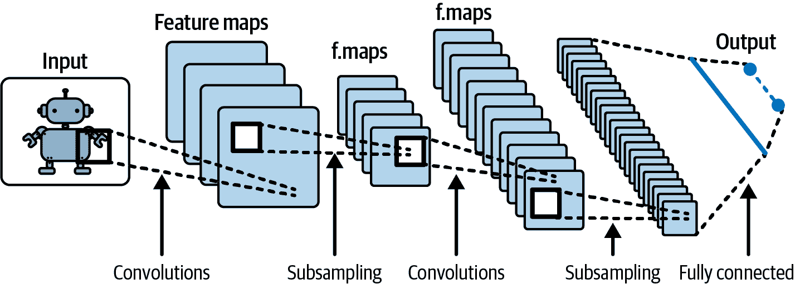
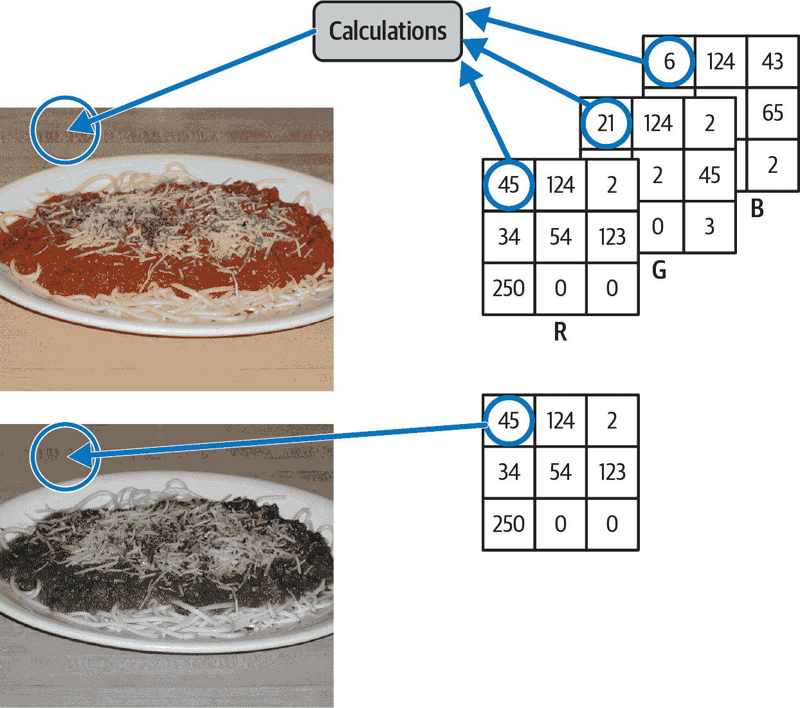
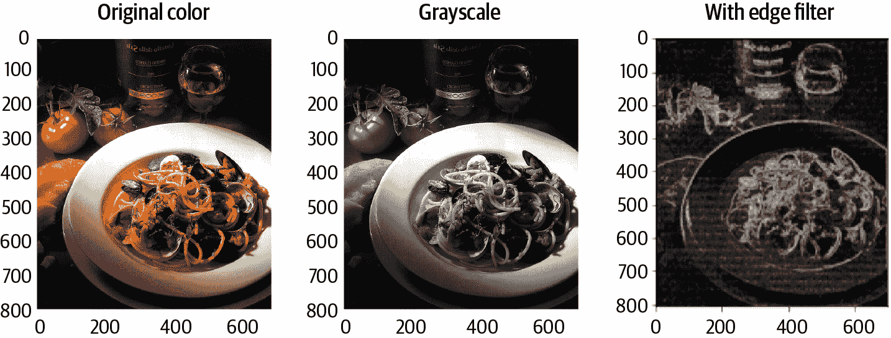

# 第五章：特征工程

在机器学习中，*特征工程*是使用领域知识来选择和转换数据中最相关变量的过程，以达到机器学习过程的目标。这里的*领域知识*指的是对数据及其来源的理解。在数据科学中，关注的不是工具本身，而是数据和问题本身，涵盖特定领域或垂直领域的一般背景。例如，在金融领域，可能涉及对金融术语的熟悉以及数据的各种可能应用，如贷款评分。根据项目团队的经验，可能需要咨询金融专家来创建一个代表性特征，以解决当前的问题。同样，在医疗技术领域，您可能需要与医生合作设计特征，需要了解解剖学、生物系统和医疗状况的知识。

特征工程的目标是使最终的特征充当数据对世界或问题所包含信息的代理。领域经验使您能够直观地建立这些联系。使用领域知识可以帮助简化机器学习中固有的挑战，提高实现业务目标的成功率。的确，要成功，您必须对问题及其相关数据有深入的理解。

这里再举一个例子。假设您有一组车辆的图像，并且负责从这些图像中检测出车辆的品牌、型号和年份。这可能是一个难以解决的问题！毕竟，一辆车的照片可以从多个角度拍摄，您需要根据非常具体的特征区分和缩小选项。与其要求您的机器学习模型评估许多单独的特征，不如直接检测车辆的注册牌照并将像素转化为数字和字母。一旦获得这些信息，您可以与其他数据集匹配以提取所需信息。由于从图像中提取数字/字母是一个解决了的机器学习问题，您已经利用领域知识与特征工程来达到您的业务目标。

正如这个例子所示，您的目标和数据将决定您需要用来训练模型的特征。有趣的是，鉴于机器学习算法在不同场景下可能相同，例如将电子邮件分类为垃圾邮件或非垃圾邮件，或将 Twitter 账号分类为机器人或真实用户，*高质量的特征*可能是模型性能的主要驱动因素。这里所说的“好”的特征是指那些能提供关于数据大量信息、解释最大差异并与目标变量有强关系的特征。

大多数机器学习算法并不智能到可以自动从原始数据中提取有意义的特征。因此，通过在执行链中堆叠多个算法，同时使用*提取器*和*转换器*以及智能*选择器*，可以帮助我们识别显著的特征。这个过程也被称为*特征化*，是处理机器学习管道中数据的关键部分。

在本章中，我们将探讨 Spark 提供的一些特征提取工具和技术。在我们继续之前，这里有几个您应该了解的术语：

估计器

可以在 DataFrame 上拟合以生成转换器的算法

哈希函数

用于将任意大小的数据映射到固定大小值的函数

派生特征

通过特征工程获得的特征

原始特征

直接从数据集中获取的特征，无需额外的数据操作或工程化

在高层次上，本章涵盖以下内容：

+   特征及其对机器学习模型的影响

+   MLlib 特征化工具

+   图像特征化过程

+   文本特征化过程

+   如何丰富您的数据集

让我们从更深入地了解特征及其对我们模型的影响开始。

# 特征及其对模型的影响

由于我们的模型是从数据空间中（估计为）抽取/生成的数学和统计表示，它们可能受到异常值的影响，或者受到内部偏差或其他我们宁愿避免的问题的困扰。假设您的数据包含缺失值，但您的算法不支持这些缺失值。您必须决定如何处理：是填补缺失值？还是完全删除具有缺失值的列？尝试使用其他算法？您做出的决定可能会对线性模型、支持向量机（SVM）、神经网络、主成分分析（PCA）和最近邻等算法的结果产生显著影响，因为每个数据点都会改变结果。简单来说：*如果缺失值比实际值多，则用默认值填充它们可能会完全倾斜方程以偏向默认值*。

要更好地理解这一点，让我们看一下支持向量机（SVM）算法，如图 5-1 所示，我们需要开发一个线性向量/函数（H[1]，H[2]，H[3]），来区分两个类别，即空心圆或实心圆，给定 X[1]和 X[2]作为输入。如果我们在空心圆类别的大多数 X[2]数据点上有缺失值，并且我们用默认值填充它们，那将完全改变我们线性向量的方向和程度。因此，我们必须仔细考虑如何填补缺失数据以及我们的特征如何影响模型。


###### 图 5-1。线性硬边界支持向量机（SVM），描述（H1，H2，H3）为假设，点为实际数据值

另一个特征提取的重要方面是能够识别和减少噪声，特别是在使用具有内置特征提取机制的自动化机器学习模型时。算法中的噪声数据会导致产生不正确的模式，算法开始从中进行泛化，从而产生不符合业务领域的不良模型结果。理解数据以及特征提取在这里至关重要。

如图 5-2 所示，特征工程是一个丰富的工具和技术世界。


###### 图 5-2\. 特征工程需求和技术的高层视图

最佳选择取决于您正在处理的数据类型和需求。没有硬性规定，但根据您处理的问题，有一些需要牢记的事项：

处理缺失数据

我是否将这些数据用于特定案例分析？整列/行删除与填充默认数据的“价格”是多少？我的数据集中缺失数据的百分比是多少？数据是整行缺失还是特定列？回答这些问题，您就有了一个计划！

从文本中提取特征

我是否只有非结构化文本数据？我该如何理解它？我的数据的性质是什么？文本有多长——是一个限制字符数的推文，还是书中的特征工程章节？（有关详细信息，请参阅“文本特征提取过程”。）

分类编码

这是将分类变量转换为一组二进制变量的过程——是或否，真或假，0 或 1。这里的目标是提升模型的性能。分类数据的一个例子是一个人居住的城市：旧金山、纽约、柏林、特拉维夫等。这些是名义分类，因为它们之间没有具体的顺序。类别也可以有固有的顺序，例如学生的成绩：A+、A、A-、B+等。我们将在第六章中探讨分类；许多算法将分类特征作为输入。

特征缩放

我们使用这种技术，也称为*数据归一化*，以标准化数据集中的独立特征，使它们都在一个相似的尺度上。我们在预处理阶段或在出现新的高度变化值时，作为特征工程的一部分处理它。特征缩放在使用梯度下降算法时很常见，因为它有助于加快收敛速度。图 5-3 演示了*x*在每次梯度下降算法迭代中如何朝向最小可能值的理想轨迹，直到找到最小值或达到允许的最大迭代次数—这就是归一化促进收敛的含义。如果没有归一化，特征的范围差异会导致每个特征具有不同的步长，这意味着它们以不同的速度更新，需要更长时间才能达到总体优化。归一化使事情变得平稳并加快了过程。你可以把它想象成一个人困在树林中，试图找回自己的车；这个人会四处走动，收集信息，尝试优化路线。但如果大部分树木都是透明的，这个人能够透过它们看到外面？这就是特征缩放的效果。特征缩放也对基于距离的算法和回归很有用。为了实现它，我们可以利用 PCA，这是一种无监督技术，使我们能够过滤嘈杂的数据集并减少数据的维度。


###### 图 5-3\. 梯度下降在每次迭代中朝向函数的最小值移动，从 x[1] 到 x[2] 等等

# MLlib 特征化工具

在其`pyspark.ml.feature`包中，MLlib 提供了许多特征化函数（基于 Scala 的 API 在`spark.ml.feature`中）。最新的 API 列表可以在[Apache Spark MLlib 文档](https://oreil.ly/8rrMh)中找到，并且代码示例可以在[Apache Spark GitHub 仓库](https://oreil.ly/SQxG9)的*examples/src/main/python/ml/*目录下找到。

在本节中，我们将涵盖 MLlib 提取器和选择器。

## 提取器

提取器是 MLlib 的 API，用于提取那些单独来看可能没有意义但可以帮助我们进行探索的特征。还记得上一章节中的 Figure 4-1 吗？预处理、特征工程和统计描述是相互交织的过程。转换器（如果需要复习，请参考 “使用 MLlib 转换器进行预处理”）可以用作提取器，反之亦然。有些提取器要求我们先使用转换器，例如 `TF-IDF`，它无法直接在原始数据上操作，需要使用 `Tokenizer` API 提取单词，以及 `HashingTF` 或 `CountVectorizer` 将单词集合转换为标记计数的向量。

Table 5-1 展示了可用的提取器 API 及其使用情况。

Table 5-1\. Spark MLlib 提取器 API

| API | 用法 |
| --- | --- |
| `TF-IDF` | 计算词频-逆文档频率，其中词频是术语在语料库中出现在文档中的次数，文档频率是术语出现在的文档数。在文本挖掘中用于衡量术语对文档的重要性。 |
| `Word2Vec` | 将单词序列转换为固定大小的向量。用于自然语言处理。 |
| `CountVectorizer` | 将固定大小的单词序列转换为标记计数的向量，用于文本分类。当序列大小不同时，将使用最小大小作为词汇表大小。 |
| `FeatureHasher` | 接受一组分类或数值特征并将它们哈希为一个特征向量。通常用于减少特征数目而不显著损失其价值。 |

## 选择器

当我们使用转换器和提取器开发出一堆特征后，就到了选择想要保留的特征的时候了。为此，我们使用选择器，这些是从大量特征集中选择子集的 API。这可以手动完成，也可以使用估算特征重要性并旨在提高我们的机器学习模型性能的算法自适应地完成；这很重要，因为过多的特征可能导致过度拟合。

Spark 提供了在 Table 5-2 中列出的简单选项。

Table 5-2\. Spark MLlib 选择器 API

| API | 用法 |
| --- | --- |
| `VectorSlicer` | 接受特征向量列并输出一个由我们传入的索引决定的原始特征子集的新列。 |
| `RFormula` | 使用一组基本支持的操作选择具有 R 模型公式（供 R 编程语言用户使用）的列，并生成一个特征向量列和一个双精度或字符串标签列。 |
| `ChiSq​Selec⁠tor` | 接受一个包含所有特征向量和一个标签列的列，并生成一个带有选定特征向量的新列的 DataFrame。使用基于卡方统计检验的特征选择，根据五种选择方法之一进行（预测性能最高的前*x*个特征、预测性能最高的前%特征、误报率低于阈值的特征等）。 |
| `Univariate​Fea⁠ture​Selector` | 接受带有分类/连续标签和分类/连续向量特征的输入，并生成一个带有选定特征向量的新列的 DataFrame。Spark 根据指定的标签和特征类型选择用于特征选择的评分函数（卡方检验、ANOVA F 检验或 F 值）；选择方法与`ChiSqSelector`相同。 |
| `Variance​Thres​hold​Selector` | 接受特征向量列，并输出一个新列，移除所有低于提供的方差阈值的特征。 |

## 示例：Word2Vec

许多选择器和后续的机器学习模型将特征向量表示为 DataFrame 中的一个列。这也是为什么使用列存储格式如 Parquet 并不总是更高效的原因，因为所有特征都以一个列的形式表示。然而，当给定具有许多列的大型 DataFrame 时，其中每一列表示不同的转换或特征集时，它可能更有效。为了适应这种用法，Spark MLlib API 生成一个与前一个 DataFrame 具有相同列的新 DataFrame，并添加一个新列来表示选定的特征。

许多转换器的输出可以持久化到磁盘并在以后重复使用。以下代码片段展示了如何堆叠多个转换器、将它们持久化到磁盘并从磁盘加载它们：

```
from pyspark.ml.feature import Word2Vec, Word2VecModel
from pyspark.ml.feature import Tokenizer

# Input data: Each row is a bag of words from a sentence or document.
sentence_data_frame = spark.createDataFrame([
    (0, "Hi I think pyspark is cool ","happy"),
    (1, "All I want is a pyspark cluster","indifferent"),
    (2, "I finally understand how ML works","fulfilled"),
    (3, "Yet another sentence about pyspark and ML","indifferent"),
    (4, "Why didn’t I know about mllib before","sad"),
    (5, "Yes, I can","happy")
], ["id", "sentence", "sentiment"]) 

tokenizer = Tokenizer(inputCol="sentence", outputCol="words")
tokenized = tokenizer.transform(sentence_data_frame) 

word2Vec = Word2Vec(inputCol="words", outputCol="result")
model = word2Vec.fit(tokenized)
model.write().overwrite().save("some_path")
model_from_disk = Word2VecModel.load("some_path")

df_with_word_vec = model_from_disk.transform(tokenized)
df_with_word_vec.show()
selector = VarianceThresholdSelector(varianceThreshold=0.0, 
                                     outputCol="selectedFeatures")
result = selector.fit(df_with_word_vec).transform(df_with_word_vec)
```

在此代码中：

+   `sentence_data_frame` 是一个模拟 DataFrame，用于展示功能。

+   `Tokenizer` 创建一个`Tokenizer`实例，提供输入列和输出列名称。

+   `transform` 转换 DataFrame 并生成一个名为`token⁠ized`的新 DataFrame。

+   `Word2Vec` 创建一个具有指定输入列、输出列和向量大小的`Word2Vec`实例。`Word2Vec`是一个估算器，因此在使用其进行转换之前，我们需要对数据运行`fit`。更多详情见第六章。

+   `.save` 使用`write`函数将`Word2Vec`模型持久化到磁盘。

+   `Word2VecModel.load` 从磁盘加载`Word2Vec`模型。

+   `model_from_disk.transform` 使用加载的模型转换标记化数据。

+   `VarianceThresholdSelector` 创建一个`VarianceThresholdSelector`实例，用于选择特征，阈值为`0`，表示过滤掉所有样本中具有相同值的特征。`VarianceThresholdSelector`期望输入名为`features`的列。我们调用`fit`来拟合数据上的`VarianceThresholdSelector`，并使用模型来选择特征。

示例 5-1 展示了最终 DataFrame 的外观。

##### 示例 5-1\. 具有所有新列的 DataFrame

```
Output: Features with variance lower than 0.000000 are removed.
+---+--------------------+-----------+--------------------+--------------------+--------------------+
| id|            sentence|  sentiment|               words|            features|    selectedFeatures|
+---+--------------------+-----------+--------------------+--------------------+--------------------+
|  O|Hi I think pyspar...|      happy|[hi, i, think, py...|[-6.2237260863184...|[-6.2237260863184...|
|  1|All I want is a p...|indifferent|[all, i, want, is...|[-7.1128298129354...|[-7.1128298129354...|
|  2|I finally underst...|    fulfill|[i, finally, unde...|[-8.2983014484246...|[-8.2983014484246...|
|  3|Yet another sente...|indifferent|[yet, another, se...|[0.0,0.0,0.0,0.0,...|[0.0,0.0,0.0,0.0,...|
|  4|Why didn't I know...|        sad|[why, didn't, i, ...|[-7.1128298129354...|[-7.1128298129354...|
|  5|          Yes, I can|      happy|      [yes,, i, can]|[-0.0016596602896...|[-0.0016596602896...|
+---+--------------------+-----------+--------------------+--------------------+--------------------+

```

简单起见，我们没有将特征向量归一化到`[0,1]`范围内，尽管这样做可能有助于后续的选择过程。这是特征工程过程中你应该探索的另一条路。顺便说一句，虽然在这个示例中我们将模型保存到了磁盘上，但你可以将它保存到任何你有连接器并支持 Parquet 格式的存储中（因为模型本身是以 Parquet 格式保存的，除非你另有指定）。我们将在第十章进一步讨论这个问题。

# 图像特征化过程

在处理图像时，业界存在一个关于特征工程的误解。许多人认为这是没有必要的，但实际上，即使我们使用了像卷积神经网络（CNN）这样的神经网络算法来提取和映射特征，如图 5-4 所示，仍然有可能引入噪声和计算开销，并且可能会漏掉一些特征，因为算法本身并不具备给定问题的业务知识或领域理解。



###### 图 5-4\. 典型的 CNN 架构描述卷积、子采样等直到输出的过程

我们可以从图像数据中提取许多特征，这取决于我们所处的领域。我们的 Caltech 256 图像分类数据集非常多样化，我们可以尝试多种技术，直到找到最佳特征。还要记住，当涉及到图像和分层神经网络模型时，我们可以利用现有模型，只需添加最后一层。我稍后会详细讨论这个问题，但我在这里提到它是因为该模型可能需要特定的图像特征，比如特定的宽度、高度和通道数：

宽度和高度

这些代表了图像中的像素数。例如，一个尺寸为 180 × 200 的图像宽度为 180 像素，高度为 200 像素。

通道

这是组成图像的传统主要颜色层的数量。例如，RGB（红色，绿色，蓝色）图像实际上由三个图像（像素矩阵）组成：一个红色通道，一个绿色通道和一个蓝色通道。灰度图像通常只有一个通道。用于编码卫星图像的 GeoTIFF 和其他格式可以具有多达 13 个层（或通道），其中 3 个是 RGB，即人眼可见的层。

所以对于 RGB 格式的全彩色图像，我们实际上需要三个矩阵（或通道），其值在 0 到 255 之间，较小的数字代表暗色，较大的数字表示亮色（0 为黑色，255 为白色）。

###### 注

存储图像数据的其他格式还有很多，但是 RGB 是最流行的格式，所以这里我将重点放在这里。

我们应该如何思考和定义我们的特征？让我们先大致了解一下我们可以通过图像处理做些什么。

## 理解图像处理

最佳处理方式取决于图像的复杂性——图像中有多少对象、图像背景、通道数、颜色是否提供可操作的价值等。基于这些考虑，我们有多种选项来处理现有数据并提取特征。

如图 5-5 所示，彩色图像有三层矩阵可以进行操作。我们可以添加滤镜、改变像素、分组像素，或者仅提取一个通道以获得灰度图像（如图底部所示）。



###### 图 5-5\. 带有三个矩阵的 RGB 图像（顶部）和一个矩阵的灰度图像（底部）

### 灰度

当 RGB 图像中的颜色没有意义时，将其转换为灰度图像可以帮助消除数据中的噪音。灰度图像是单通道图像，每个像素点的光强信息使用介于 0 到 255 之间的整数值来表示。这些图像完全由灰度色调组成，覆盖了从白色到黑色的连续范围。

### 使用图像梯度定义图像边界

让我们再看看仓库中的另一张图片，图像 196_0070\. 这张图片被归类为意大利面，但在左侧的彩色版本中，我们还可以看到图片中的一些其他物品，如番茄、面包、罐子、玻璃杯、碗以及看起来像是贻贝。如果不定义特征，比如图像边界，这样的图片可能会给我们的算法引入大量噪音，导致模型错误地将番茄、贻贝和其他物品的图片分类为意大利面！



###### 图 5-6\. 一张具有多个滤镜的图像，在我们的数据集中简单分类为意大利面，尽管它包含了几个其他物品

利用梯度计算提取图像边缘可以通过利用诸如拉普拉斯这样的矢量运算符来完成，它突出显示快速强度变化的区域。使用 Pillow，我们可以使用`Kernel`方法定义自己的卷积核进行边缘检测¹，或者使用库提供的内置`FIND_EDGES`滤镜。以下代码示例展示了这两种方法：

```
from PIL import Image, ImageFilter

img = Image.open(r"sample.png")
# Input image to be of mode grayscale (L)
img = img.convert("L")
# Calculating edges by providing a kernel manually
final = img.filter(ImageFilter.Kernel((3, 3), 
                   (-1, -1, -1, -1, 8, -1, -1, -1, -1), 1, 0))
# Calculating edges by leveraging Pillow filter defaults
edges = img.filter(ImageFilter.FIND_EDGES)
```

Pillow 还为我们提供了许多其他预设滤镜，如`BLUR`、`SMOOTH`和`EDGE_ENHANCE`，所有这些都基于对图像进行像素梯度操作的滤镜添加。图 5-6 展示了灰度和边缘滤镜的渲染效果。

## 使用 Spark API 提取特征

我们可以同时在 Caltech 256 数据集上使用多种技术来提取数据的特征。在第四章中，我们简要讨论了 UDF 及其如何用于提取图像大小。让我们深入探讨这个主题，因为这是我们从图像中提取特征的主要工具。

直到 2017 年，PySpark 支持的 UDF 一次处理一行。这些函数错过了 Spark 查询引擎的优化能力，因为在幕后 PySpark 被转换成 Scala 代码，许多在 PySpark 中编写的 UDF 具有高的序列化和调用开销。为了解决这些问题，数据工程师和数据科学家们合作，在 Java 和 Scala 中定义了可以从 Python 调用的 UDF。然而，这使得代码变得混乱，难以导航和维护。幸运的是，Spark 2.3 引入了 pandas UDFs，允许向量化操作并利用 Apache Arrow 优化来减少序列化和反序列化操作。这个新增功能不仅使数据科学家能够扩展他们的工作负载，还可以在 Spark 中使用 pandas API。

### pyspark.sql.functions：pandas_udf 和 Python 类型提示

如第四章所述，pandas UDFs 是使用`pandas_udf`装饰器定义的，它是`pyspark.sql.functions`库的一部分。在 Apache Spark 3.0 之前，使用 Python 类型提示来指定创建的 pandas UDF 的类型（根据转换类型）是必要的，如表格 5-3 所示。每种类型都期望特定类型的输入，并产生特定类型的输出。推荐使用 Python 类型提示，因为它清楚地指示了函数的预期功能，并且使得静态分析更加容易；在未来的版本中，可能会弃用使用`PandasUDFType`来指定类型的做法。现在可以使用专用函数`applyInPandas`和`mapInPandas`执行某些类型的转换，这些函数将在下一节讨论。

表格 5-3。Spark pandas UDF 类型详细信息

| Spark PandasUDFType | 输入和输出 | Python 类型提示 |
| --- | --- | --- |
| `SCALAR`（默认） | pandas Series | 不需要指定特定的标量 pandas 数据类型；可以使用`long`、`double`、`float`、`int`或`boolean` |
| `SCALAR_ITER` | pandas Series 的迭代器 | 函数签名中需要指定 pandas 数据类型，以便编译器和运行时引擎创建正确的迭代器 |
| `GROUPED_MAP` | pandas DataFrame | 不需要特定的 pandas 数据类型；可以在 Spark DataFrame 上使用`mapInPandas`或`applyInPandas`函数 |
| `GROUPED_AGG` | pandas DataFrame | 类似于`GROUPED_MAP`，不需要特定的 pandas 数据类型；可以使用`applyInPandas`替代 |

在第四章中，我们使用了一个 pandas UDF 来计算数据集中每个图像的大小。现在让我们计算每个图像类别的平均大小，以便决定是否要相应地调整图像大小。

首先，我们将把 `size` 结构展平为两列：

```
flattened = df.withColumn('width', col('size')['width'])
flattened = flattened.withColumn('height', col('size')['height'])
```

展示了生成的展平 DataFrame 的一部分摘录，如示例 5-2 所示。

##### 示例 5-2\. 展平的宽度和高度列

```
+-----+------+
|width|height|
+-----+------+
|1500 |1500  |
|630  |537   |
|1792 |1200  |
+-----+------+

```

接下来，我们将提取每列的平均宽度和高度，利用带有 Python 类型提示的 pandas UDF：

```
@pandas_udf("int")
def pandas_mean(size: pd.Series) -> (int):
    return size.sum()

flattened.select(pandas_mean(flattened['width'])).show()
flattened.groupby("label").agg(pandas_mean(flattened['width'])).show()
flattened.select(pandas_mean(flattened['width'])
                     .over(Window.partitionBy('label'))).show()
```

在 Python 函数中，`@pandas_udf("int")` 开头和 `-> (int)` 给 PySpark 提供了关于我们正在使用的数据类型的提示。这个示例展示了如何计算一列的平均宽度，但我们也可以用同样的函数来计算高度。

示例 5-3 展示了一些示例输出。

##### 示例 5-3\. 示例平均宽度和高度值

```
+-------------+------------------+-------------------+
|        label|pandas_mean(width)|pandas_mean(height)|
+-------------+------------------+-------------------+
|196.spaghetti|             39019|              33160|
|    249.yo-yo|             40944|              37326|
|  234.tweezer|             34513|              27628|
|   212.teapot|             51516|              45729|
+-------------+------------------+-------------------+

```

我们的最后一步是根据结果决定是否要调整图像大小。在我们的情况下，我们可以跳过此步骤，因为我们将利用 PyTorch 和 TensorFlow 的机器学习算法，并根据算法的要求调整图像大小。

### pyspark.sql.GroupedData: applyInPandas 和 mapInPandas

`applyInPandas` 和 `mapInPandas` 是操作分组 Spark DataFrame 并返回带有结果的新 DataFrame 的函数。当我们定义一个 `pandas_udf` 来处理它们时，它接收一个 pandas DataFrame 作为输入，并返回一个 pandas DataFrame 作为输出。

尽管它们有相同的名称，但 pandas DataFrame 和 Spark DataFrame 不是同一回事，不要混淆它们是非常重要的。表 5-4 强调了两者之间的主要区别。

表 5-4\. Spark 和 pandas DataFrame 的主要特性

|   | Spark DataFrame | pandas DataFrame |
| --- | --- | --- |
| **支持并行执行** | 是 | 否 |
| **惰性操作** | 是 | 否 |
| **不可变** | 是 | 否 |

举个例子，让我们看看如何使用 `applyInPandas` 函数提取我们图像的灰度版本。以下是我们将要遵循的步骤：

1.  定义函数 `add_grayscale_img`：

    ```
    def add_grayscale_img(input_df):
        input_df['grayscale_image'] = input_df.content.apply(lambda image: 
                get_image_bytes(Image.open(io.BytesIO(image)).convert('L')))
        input_df['grayscale_format'] = "png"
        return input_df

    def get_image_bytes(image):
        img_bytes = io.BytesIO()
        image.save(img_bytes,format="png")
        return img_bytes.getvalue()
    ```

    在这个函数内部，我们调用 PIL 库的 `convert` 函数来提取图像的灰度版本。`get_image_bytes` 是一个辅助函数，帮助我们获取与 `.convert('L')` 一起使用的正确对象类。

1.  测试这个函数。图像处理通常是一个昂贵的过程，因为它需要 Spark 应用程序迭代所有数据并处理图像。因此，在图像数据的子集上测试函数是最佳实践，这样你可以调整和优化它，并确保在整个数据集上达到期望效果之前进行测试。

1.  通过利用现有的 DataFrame 并添加专用的空（`None`）列，指定输出 DataFrame 的模式是非常容易的：

    ```
    rtn_schema = (df.select('content','label','path')
                    .withColumn('grayscale_image', 
                                lit(None).cast(BinaryType()))
                    .withColumn('grayscale_format', 
                                lit(None).cast(StringType()))
                 )
    ```

    然后我们可以通过调用 `DataFrame.schema` 来提取模式。这个过程使得在函数调用中定义模式变得简单，并减少了模式不匹配的可能性。

1.  减少 DataFrame 的列到最小必需的数量，因为（如下面的侧边栏所述）`groupBy` 和 `applyInPandas` 是比较昂贵的操作：

    ```
    limited_df = df.select('label','content','path')
    ```

1.  在 Spark 执行器上运行 Python 函数。首先调用 `groupby` 来对数据进行分组（您可以使用任何函数来执行此操作，但这是运行下一个函数的前提）。我们可以使用任何列来对数据进行分组，并使用指向要执行的函数和模式的指针来调用 `applyInPandas` 函数。在我们的示例中，`add_grayscale_img` 是我们要执行的函数，`rtn_schema.schema` 是我们的模式：

    ```
    augmented_df = limited_df.groupBy('label')
                             .applyInPandas(add_grayscale_img, 
                                            schema=rtn_schema.schema)
    ```

1.  最后，利用 `leftouter` 将原始 DataFrame 中的数据与增强的 DataFrame 重新连接，以防止图像转换需要跳过某些行：

    ```
    output_df = df.join(augmented_df.select('path','grayscale_image'),
                                            ['path'],"leftouter")
    ```

这六个步骤为我们提供了两个新特征：一个类型为 `Array[Byte]` 的名为 `grayscale_image` 的特征，以及一个类型为 `String` 的名为 `grayscale_format` 的特征。

图 5-9 显示了 `output_df` 表的结构和一些数据样本行。


###### 图 5-9\. 带有新列的输出示例

# 文本特征化过程

在 “示例：Word2Vec” 中，您学习了如何使用 `Tokenizer`、`Word2Vec` 和其他工具。在本节中，我们将使用 [Bot or Not 数据集](https://oreil.ly/v_Rba) 来了解如何对短自由文本字符串（例如 Twitter 用户描述（简介））进行特征化处理。

由于我们的数据是有监督的（即有标签的），我们可以探索现有特征与标签的组合以开发新的特征。当然，这可能导致特征高度相关，这意味着我们需要超越传统思维。诚然，可解释的特征（我们已经组合的特征，我们基本上理解它们之间的关系）和模型比复杂的模型更容易调试。然而，可解释性并不总是能够导致最准确的模型。

我们的数据集有一个 `description` 列和一个 `label` 列。示例 5-4 展示了这些列的一些例子。

##### 示例 5-4\. Twitter Bot 或 Not `description` 和 `label` 列

```
+--------------------+-----+
|         description|label|
+--------------------+-----+
|Contributing Edit...|    1|
|     I live in Texas|    0|
|Fresh E3 rumours ...|    0|
|''The 'Hello Worl...|    0|
|Proud West Belcon...|    1|
|Hello, I am here ...|    0|
|Meow! I want to t...|    0|
|I have something ...|    0|
|I have more than ...|    0|
|If you have to st...|   13|
|I am a twitterbot...|    1|
|Designing and mak...|    0|
|Host of Vleeties ...|    0|
|Benefiting Refuge...|    0|
|Access Hollywood ...|    0|
|Producer/Songwrit...|    0|
|CEO @Shapeways. I...|    0|
|Two division UFC ...|    0|
|Moderator of @mee...|    0|
|Tweeting every le...|    0|
+--------------------+-----+
only showing top 20 rows

```

让我们看看我们从这些数据中提取特征的一些选项。

## 词袋模型

词袋法是将文本转换为平面向量的“bag-of-*x*”方法之一。在这种方法中，文本（在我们的情况下是 Twitter 个人简介）被表示为其组成单词的“袋子”（多重集合），忽略语法甚至单词顺序。通常，最终的表示将是术语及其计数。因此，在构建词袋法的过程中，我们还提取包含给定文本中单词及其频率（出现次数）的 *术语频率向量*。MLlib 提供了这样做的功能，例如 `Tokenizer`（用于拆分文本）与 `HashingTF` 转换器或 `CountVectorizer` 选择器。

举个例子，假设我们有以下 Twitter 帐户描述：

> Tweets on programming best practices, open-source, distributed systems, data & machine learning, dataops, Apache Spark, MLlib, PyTorch & TensorFlow.

在这种情况下，没有真正的必要生成词频向量，因为每个词的频率都是 1。然而，如果我们将所有标记为机器人的帐户的描述分组，几乎肯定会发现许多术语出现超过一次，这可能会带来一些有趣的见解。这将我们带到第二个选项：TF-IDF。

## TF-IDF

TF-IDF 是信息检索领域中广泛使用的一种方法，用于文本挖掘。它允许我们量化术语在给定文档或语料库中的重要性。作为提醒，*术语频率* (`TF(t,d)`) 是术语 `t` 在文档 `d` 中出现的次数，而 *文档频率* (`DF(t,D)`) 是语料库 `D` 中包含术语 `t` 的文档数。

IDF 是 *逆* 文档频率，它为我们提供了一个数值度量，根据术语在语料库中的稀有或频繁程度，来衡量术语提供的信息量；使用越频繁，得分越低。

TF-IDF 将这些输出相乘：

```
TFIDF(t,d,D)=TF(t,d)•IDF(t,D)
```

MLlib 中的 TF 和 IDF 功能是分开的，这为我们提供了灵活性，可以决定如何处理它们，以及是否要一起使用它们或分开使用。

让我们使用 `Tokenizer` API 提取单词并使用 `HashingTF` 函数将术语映射到它们的频率来计算我们数据集的 TF：

```
from pyspark.ml.feature import HashingTF, IDF, Tokenizer

tokenizer = Tokenizer(inputCol="description", outputCol="words")
wordsData = tokenizer.transform(data)

hashingTF = HashingTF(inputCol="words", outputCol="frequencyFeatures", 
                      numFeatures=20)
featurizedData = hashingTF.transform(wordsData)
```

`HashingTF` 创建一个名为 `frequencyFeatures` 的新列，其中包含一组哈希词的稀疏向量及其出现在文档中的情况，如 示例 5-5 所示。

##### 示例 5-5\. 哈希术语频率

```
+-----+--------------------+
|label|   frequencyFeatures|
+-----+--------------------+
|    1|(20,[0,2,3,4,5,7,...|
|    0|(20,[3,13,16,17],...|
|    0|(20,[1,2,4,5,6,7,...|
|    0|(20,[0,1,4,5,7,8,...|
|    1|(20,[0,1,3,4,5,6,...|
+-----+--------------------+
only showing top 5 rows

```

我们的第二步是计算逆文档频率。由于 Spark 的 `IDF` 是一个估计器，我们首先需要使用 `fit` 方法来构建它：

```
idf = IDF(inputCol="frequencyFeatures", outputCol="features")
idfModel = idf.fit(featurizedData)
```

这创建了一个名为 `idfModel` 的 `IDFModel` 对象实例。现在，我们可以使用该模型来转换数据：

```
rescaledData = idfModel.transform(featurizedData)
```

`rescaledData` DataFrame 实例具有名为`features`的列，该列显示了在整个数据集中给定描述中术语的重要性。尽管这些信息很有用，但 TF-IDF 是一种无监督方法，完全忽视了数据中的标签。接下来，我们将看看一种监督方法。

## N-Gram

MLlib 的 `NGram` 转换器允许我们将字符串数组（单词）转换为 *n*-grams 数组，其中 *n* 是我们可以在 `NGram` 函数中定义的参数：

```
from pyspark.ml.feature import NGram

ngram = NGram(n=2, inputCol="words", outputCol="ngrams")
ngramDataFrame = ngram.transform(wordsData)
```

如果我们知道如何处理后续的`NGram`输出并且该输出具有价值，`NGram`可以生成一个不错的特征。例如：

```
[I, live, in, texas]
```

给定 `n=2`，我们得到以下字符串数组：

```
[I live, live in, in texas]
```

从输出中可以看出，`NGram`作为一个滑动窗口来重复单词。在构建自动完成句子、检查拼写或语法、提取主题等工具时非常有用。

## 额外技术

还有许多其他技术可以利用从文本中提取特征。例如，*主题提取旨在识别*给定文档的主题，通过扫描已知的有影响力的术语或术语组合来实现。您还可以利用 MLlib 中提供的 FP-growth 和 PrefixSpan 算法的频繁模式挖掘功能。所有这些方法，在其核心上都是基于先前讨论的特征提取方法：词袋模型、识别语料库中术语或模式在给定文档中的频率、N-gram 等。要了解更多信息，请查阅 O’Reilly 的以下可靠资源：

+   [*使用 Python 进行应用文本分析*](https://oreil.ly/ata-py) 由 Benjamin Bengfort、Rebecca Bilbro 和 Tony Ojeda 撰写。

+   [*使用 Spark NLP 进行自然语言处理*](https://oreil.ly/nlp-spark) 由 Alex Thomas 撰写。

+   [*实用自然语言处理*](https://oreil.ly/prac-nlp) 由 Sowmya Vajjala 等人撰写。

# 丰富数据集

通常，我们的数据集需要更多的数据点和新特征。找到正确的特征是机器学习工作流程的核心，通常更多的是艺术而不是科学。我们有几种方法可以丰富我们的数据集。例如，使用 Bot or Not 机器人检测数据集时，如果需要更多数据，我们可以利用 Twitter API 提取新的推文和更新。我们还可以利用*迁移学习*，这是利用解决一个问题时获得的知识来解决另一个问题的过程。

我们如何利用迁移学习解决我们的 Twitter 机器人检测问题？一个选项是从其他社交媒体中获取类似帐户名称的数据，例如 LinkedIn。了解 LinkedIn 上的帐户是否真实可以为我们提供另一个数据点来利用。

# 总结

Spark 和 Spark MLlib 实现了许多额外的特征提取功能，您在构建模型时可能会感兴趣。有很多特征可以提高模型的准确性；例如，在处理图像时，您可能希望尝试一种只保留图像轮廓和图像非常独特特征描述符的方法，以区分图像的一个特征与另一个特征。

您可以利用 Spark 的通用函数来处理任何您需要的代码，但请注意所涉及的资源和计算成本。领域知识是成功特征化过程的关键，因此在进行特征工程时务必小心处理。接下来，我们将介绍如何使用 Spark MLlib 构建机器学习模型。

¹ *核*是一个像图像滤波器一样操作的矩阵。它在图像上滑动，并将核值与输入数据相乘，从输入图像中提取特定的“特征”。
