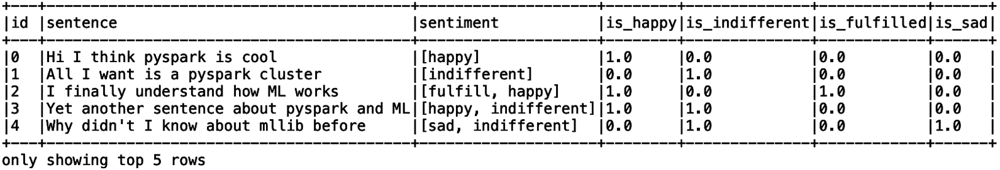
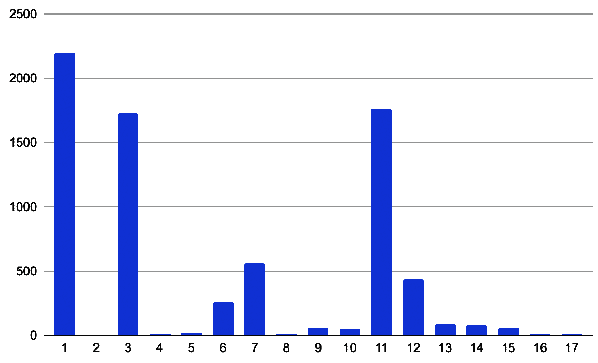
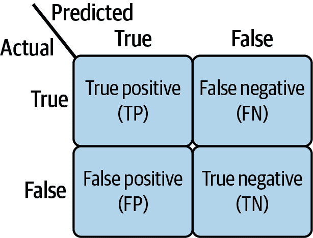
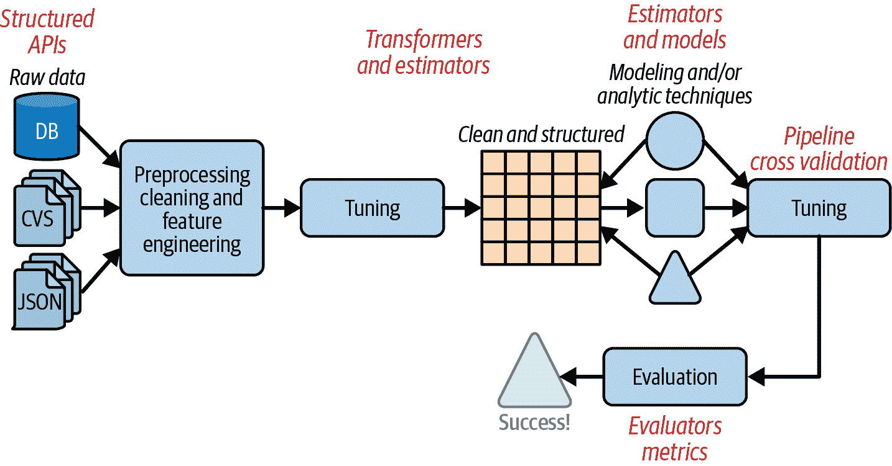

# 第六章：使用 Spark MLlib 训练模型

现在您已经了解了管理机器学习实验、感受数据和特征工程*，* 是时候开始训练一些模型了。

这究竟涉及什么？*训练*模型是调整或更改模型参数的过程，以提高其性能。这里的思想是向您的机器学习模型提供训练数据，教它如何解决特定任务，例如通过识别其“猫”属性将照片中的对象分类为猫。

在本章中，您将学习机器学习算法的工作原理，何时使用哪个工具，如何验证您的模型，以及最重要的是如何使用 Spark MLlib 管道 API 自动化这一过程。

在高层次上，本章涵盖以下内容：

+   基本的 Spark 机器学习算法

+   使用 Spark 机器学习进行监督学习

+   使用 Spark 机器学习进行无监督学习

+   评估您的模型并对其进行测试

+   超参数和调整您的模型

+   使用 Spark 机器学习管道

+   将模型和管道持久化到磁盘

# 算法

让我们从算法开始，这是您模型训练活动中不可或缺的部分。机器学习算法的输入是样本数据，输出是模型。算法的目标是泛化问题，并提取一组逻辑，用于进行预测和决策，而无需明确编程。算法可以基于统计学、数学优化、模式检测等。Spark MLlib 为我们提供了经典*监督*机器学习算法的分布式训练实现，例如分类、回归和推荐。它还包括了*无监督*机器学习算法的实现，例如聚类和模式挖掘，这些算法通常用于检测异常。

###### 注意

值得注意的是，在撰写本文时，MLlib 的 RDD-based 和 DataFrame-based API 尚未具备功能平等性，因此可能存在只能在 RDD-based API 中找到所需功能的情况。奇异值分解（SVD）就是一个例子。

如何选择适合任务的算法？您的选择始终取决于您的目标和数据。

虽然本章将涵盖许多算法及其各自的用例，但深度学习、与 PyTorch 集成以及 TensorFlow 分布式策略的主题将在第七章和第八章讨论。

我想提醒您，MLlib 模型实例具有专门的参数文档功能。以下代码示例说明了一旦创建了模型实例，如何立即访问各个参数的文档：

```
import pprint 
pp = pprint.PrettyPrinter(indent=4)
params = model.explainParams() 
pp.pprint(params)
```

示例 6-1 展示了`model.explainParams`函数的一些样本输出*.* 由于这是一个`GaussianMixture`模型（在“高斯混合”讨论中），它包含可用于调整此类型模型的参数的描述。这是一个很好的工具，可以帮助您在探索 MLlib 算法并了解每个算法及其模型输出时进行教育性的旅程。

##### 示例 6-1\. 漂亮地打印`GaussianMixture`模型参数的示例

```
('aggregationDepth: suggested depth for treeAggregate (>= 2). (default: 2)\n'
 'featuresCol: features column name. (default: features, current: '
 'selectedFeatures)\n'
 'k: Number of independent Gaussians in the mixture model. Must be > 1\. '
 '(default: 2, current: 42)\n'
 'maxIter: max number of iterations (>= 0). (default: 100, current: 100)\n'
 'predictionCol: prediction column name. (default: prediction)\n'
 'probabilityCol: Column name for predicted class conditional probabilities. '
 'Note: Not all models output well-calibrated probability estimates! These '
 'probabilities should be treated as confidences, not precise probabilities. '
 '(default: probability)\n'
 'seed: random seed. (default: 4621526457424974748, current: 10)\n'
 'tol: the convergence tolerance for iterative algorithms (>= 0). (default: '
 '0.01, current: 0.01)\n'
 'weightCol: weight column name. If this is not set or empty, we treat all '
 'instance weights as 1.0\. (undefined)')

```

现在我们已经介绍了基础知识，本章的学习之旅从监督机器学习开始。让我们深入探讨。

# 监督机器学习

所有监督算法都期望数据中有一个`label`列。这允许算法在训练阶段“验证”自己的表现并估计其表现如何。换句话说，在测试阶段，我们使用它来通过比较模型的预测与真实结果来评估算法的质量。标签可以是离散/分类变量，即在所有可能值的集合中的具体值，例如在分类苹果和橙子时是`apple`，或者连续变量，例如一个人的身高或年龄。这种差异定义了我们希望我们的模型解决的任务类型：分类还是回归。

在某些情况下，标签本身可能是一组标签；我们将在下一节讨论这种可能性。

## 分类

*分类* 是通过检查输入特征来计算数据点属于离散类别或类别的概率的任务。这个过程的输出是对数据点属于每个可能类别的概率的预测。许多实践者因为存在*逻辑回归*算法而混淆回归和分类。虽然逻辑回归输出离散类的概率，类似于分类算法，其他回归算法用于预测连续数值。请注意这种区别！

有三种类型的分类：

二进制

每个输入被分类到两个类别中的一个（是或否，真或假等）。

多类

每个输入被分类到一组超过两个类别中的一个。

多标签

在实践中，每个给定的输入可以有多个标签。例如，一句话可能有两个情感分类，如*开心*和*满足*。Spark 不支持此功能；您需要分别训练每个分类器并组合结果。

此外，训练数据中类的分布影响分类过程。当输入数据在类别之间分布不均匀时，数据标签被称为*不平衡*。在欺诈检测和医学诊断用例中经常见到这种情况，面对这些场景时，您需要考虑并根据可能的情况对特征加权。在训练、验证和测试集中也可能出现不平衡：为了提供期望的结果，这三者都需要平衡。在接下来的小节中，我们将更详细地探讨这个问题，以及如何处理多标签分类场景。

### MLlib 分类算法

分类算法期望一个索引标签（通常在 `[0,1]` 范围内）和一个索引特征向量。用于将分类特征转换为索引的 API，例如 `StringIndexer` 和 `VectorIndexer`，在第 4 章中已经讨论过。

MLlib 实现了几种流行的分类算法，列在表 6-1 中。类名模式通常为 `*{name}*``Classifier` 或仅为 `*{name}*`，训练后，分类器会生成一个相应名称的模型：`*{name}*``Classification​Model` 或 `*{name}*``Model`。例如，MLlib 的 `GBTClassifier` 拟合一个 `GBT​Classifica⁠tion​Model`，而 `NaiveBayes` 拟合一个 `NaiveBayesModel`。

表 6-1\. MLlib 分类算法

| API | 用法 |
| --- | --- |
| `Logistic​Re⁠gression` | 二元和多类分类器。可以使用基于 RDD 的 API 在流数据上训练。期望一个索引标签和一个索引特征向量。 |
| `DecisionTree​Classifier` | 二元和多类决策树分类器。期望一个索引标签和一个索引特征向量。 |
| `RandomForest​Classifier` | 二元和多类分类器。随机森林是由多个单独的决策树组成的集合或集成，每棵树都训练有离散值。期望一个索引标签和一个索引特征向量。 |
| `GBTClassifier` | 二元梯度提升树分类器（在 Spark v3.1.1 及更高版本中支持）。与 `RandomForestClassifier` 类似，这是一组决策树的集合。然而，其训练过程不同；因此，它也可用于回归问题。期望一个索引标签和一个索引特征向量。 |
| `Multilayer​Per⁠ceptron Clas⁠sifier` | 基于前馈人工神经网络的多类分类器。期望层大小、一个索引特征向量和索引标签。 |
| `LinearSVC` | 线性支持向量机分类器（二元）。期望一个索引标签和一个索引特征向量。 |
| `OneVsRest` | 用于将多类分类减少为二元分类，采用一对多策略。期望一个二元分类器，一个索引特征向量和索引标签。 |
| `NaiveBayes` | 多类分类器，由于仅在训练数据上运行一次，因此被认为效率高。期望数据点的`Double`权重（用于校正偏斜的标签分布）、索引标签和索引特征的向量。返回每个标签的概率。 |
| `FMClassifier` | 二元因子化机器分类器。期望索引标签和索引特征的向量。 |

### 实现多标签分类支持

MLlib 不直接支持多标签分类，但我们可以采取几种方法来解决这个问题：

1.  寻找另一个可以在大型数据集上训练的工具。

1.  为每个标签训练二元分类器，并通过运行相关/不相关预测来输出多标签分类。

1.  想出一种方法，通过将任务分解成几个部分，分别解决每个子任务，然后使用代码将结果合并，以利用现有工具。

就第一个选项而言的好消息是，PyTorch 和 TensorFlow 都支持多标签分类算法，因此我们可以利用它们在多标签用例中的功能。

至于第二个选项，如果您是 AI 工程师或经验丰富的 Spark 开发人员，Spark 提供了丰富的 API，您可以使用它来执行以下步骤：

1.  向现有 DataFrame 添加多个列，每个列代表一个给定的标签。例如，如果您的原始 DataFrame 只有`id`、`sentence`和`sentiment`列，您将为每个情绪类别添加自己的列。在`sentiment`列中值为`[happy]`的行将在名为`is_happy`的新列中获得值`1.0`，在`is_indifferent`、`is_fulfilled`和`is_sad`列中获得值`0.0`；在`sentiment`列中值为`[happy, indifferent]`的行将在`is_happy`和`is_indifferent`列中获得值`1.0`，其他列中获得值`0.0`。这样，一个句子可以被分类为属于多个类别。图 6-1 说明了这是什么样子。

    

    ###### 图 6-1\. 多标签分类的 DataFrame 输出示例

1.  继续为每个标签进行特征化处理。该书的[GitHub 仓库](https://oreil.ly/smls-git)包含使用`HashingTF`、`IDF`和其他方法准备 DataFrame 以训练分类器的代码，如示例 6-2 所示。

    ##### 示例 6-2\. 为`happy`标签准备的 DataFrame，用于训练第一个分类器

    ```
    +-----------------------------------------+-----------+
    |features                                 |happy_label|
    +-----------------------------------------+-----------+
    |(65536,[16887,26010],[0.0,0.0])          |0.0        |
    |(65536,[575871,[0.0])                    |1.0        |
    |(65536,[34782,397581,[0.0,0.0])          |0.0        |
    |(65536,[11730,34744,49304],[0.0,0.0,0.0])|0.0        |
    |(65536,[],[])                            |1.0        |
    +-----------------------------------------+-----------+
    only showing top 5 rows

    ```

1.  在为每个标签构建二元分类器。此代码片段显示了如何在添加列和索引转换后构建`LogisticRegression`分类器：

    ```
    from pyspark.ml.classification import LogisticRegression

    happy_lr = LogisticRegression(maxIter=10, labelCol="happy_label")
    happy_lr_model = happy_lr.fit(train_df)
    ```

    您需要将相同的过程应用于其余所有标签。

请记住，机器学习流水线还有更多步骤，例如使用测试数据集评估结果，并使用刚刚构建的分类器。

要测试模型，请在您的测试 DataFrame 上调用`transform`函数：

```
result = happy_lr_model.transform(test_dataframe)
```

示例 6-3 展示了对模型进行测试的输出。

##### 示例 6-3\. 斯皮尔曼相关矩阵

```
Spearman correlation matrix:
DenseMatrix([[ 1\.        , -0.41076061, -0.22354106,  0.03158624],
			 [-0.41076061,  1\.        , -0.15632771,  0.16392762],
			 [-0.22354106, -0.15632771,  1\.        , -0.09388671],
			 [ 0.03158624,  0.16392762, -0.09388671,  1\.        ]])

```

正如在第四章中讨论的那样，这是一个`DenseMatrix`，它能让我们理解`LogisticRegression`预测的结果。您可以在预测 DataFrame 的`rawPrediction`列中找到它（一个包含对每个可能标签的置信度测量的双精度向量），接着是`probability`列中的概率向量（每个类别的条件概率）和`prediction`列中的预测结果。请注意，并非所有模型都能准确输出概率，因此应谨慎使用概率向量。

### 那么不平衡的类标签怎么办？

正如前面提到的，不平衡的数据在分类任务中可能会造成问题。如果一个类别的观测数量非常高，而另一个类别的观测数量非常低，这可能会产生一个有偏见的模型。偏见将倾向于训练数据集中观测数量更多的类别标签，因为在统计上它在训练数据集中更占主导地位。

在模型开发的各个阶段可能会引入偏见。数据不足、数据收集不一致和数据管理不当都可能导致模型决策中的偏见。我们在这里不会深入探讨如何解决现有的模型偏见问题，而是将专注于处理数据集以减少潜在偏见来源的策略。这些策略包括以下几点：

1.  筛选更具代表性的类别并对其进行采样，以减少整体数据集中的条目数量。

1.  使用基于决策树的集成算法，如`GBTClassifier`、`GBTRegressor`和`RandomForestClassifier`。在训练过程中，这些算法有一个专用的`featureSubsetStrategy`参数，您可以设置为`auto`、`all`、`sqrt`、`log2`和`onethird`。默认情况下，算法根据给定的特征选择最佳策略。在每个树节点中，算法处理特征的随机子集，并使用结果构建下一个节点。它重复同样的过程，直到使用完所有数据集。这是因为它对参数的随机方法很有用，但是根据观察值的分布，仍然可能存在模型结果的偏差。假设您有一个包含 99 个苹果和 1 个橙子的数据集。假设在随机过程中，算法选择了一个批次包含 10 个单位。它将包含最多 1 个橙子和 9 或 10 个苹果。分布仍然严重偏向苹果，因此模型很可能会始终预测`apple`—这对于训练数据集来说是正确的，但在实际世界中可能完全不准确。您可以在[文档](https://oreil.ly/6sFNX)中详细了解此问题。

下面是设置策略的方法：

```
from pyspark.ml.classification import RandomForestClassifier
# Train a RandomForestClassifier model with a dedicated feature 
# subset strategy
rf = RandomForestClassifier(labelCol="label", featuresCol="features",
                            featureSubsetStrategy="log2")
model = rf.fit(train_df)
```

## 回归

是时候学习回归了！这个任务也被称为*回归分析*—估计一个或多个因变量与一个或多个自变量之间关系的过程。自变量的值应允许我们预测因变量的值。如果情况不是这样，您可以使用第五章讨论的 API 选择仅添加价值的特征。

从俯视角度看，有三种类型的回归：

简单

只有一个自变量和一个因变量：一个值用于训练，一个值用于预测。

多重

这里我们有一个因变量需要使用多个独立变量进行训练和输入预测。

多元

与多标签分类类似，有多个变量需要使用多个独立变量进行训练和输入预测。因此，输入和输出都是数值向量。

许多用于分类的算法也用于简单和多重回归任务。这是因为它们支持离散和连续数值预测。

在撰写本文时，尚无专用的 API 可用于多元回归，因此您需要设计系统以支持此用例。这个过程类似于我们为多标签分类所做的：准备数据，独立训练每个变体，测试和调整多个模型，最后组装预测结果。

要了解回归，我们将尝试使用[Kaggle](https://oreil.ly/GND1E)上的 CO[2]排放数据集来预测车辆的 CO[2]排放量。为此，我们将查看诸如公司、车型、发动机尺寸、燃料类型、消耗量等特征！

正如你将看到的，处理数据来解决这样的问题需要对其进行特征化、清理和格式化，以适应算法。

在数据集中有 13 列。为了加快索引和散列的速度，我们只会对连续特征使用`FeatureHasher`。该选择器要求我们指定数值特征的性质，是离散的还是连续的：

```
from pyspark.ml.feature import FeatureHasher

cols_only_continuous = ["Fuel Consumption City (L/100 km)", 
                        "Fuel Consumption Hwy (L/100 km)",
                        "Fuel Consumption Comb (L/100 km)"]
hasher = FeatureHasher(outputCol="hashed_features", 
                       inputCols=cols_only_continuous)
co2_data = hasher.transform(co2_data)
```

注意`inputCols`如何很好地接受一个列表——这使得重用我们的代码和开发更干净的代码变得更容易！

`hashed_features`的类型是`SparseVector`。查看示例 6-4。由于散列函数的复杂性，我们最终得到了大小为 262,144 的向量。

##### 示例 6-4\. `hashed_features`稀疏向量

```
+---------------------------------------------+
|hashed_features                              |
+---------------------------------------------+
|(262144,[38607,109231,228390],[0.0,9.9,6.7]) |
|(262144,[38607,109231,228390],[0.0,11.2,7.7])|
|(262144,[38607,109231,228390],[0.0,6.0,5.8]) |
|(262144,[38607,109231,228390],[0.0,12.7,9.1])|
|(262144,[38607,109231,228390],[0.0,12.1,8.7])|
+---------------------------------------------+
only showing top 5 rows

```

这里有很大的改进空间，因为大多数向量都是稀疏的，对我们可能没有意义。所以现在是自动选择特征的时候了：

```
from pyspark.ml.feature import UnivariateFeatureSelector

selector = UnivariateFeatureSelector(outputCol="selectedFeatures", 
                                     featuresCol="hashed_features", 
                                     labelCol="co2")

selector.setFeatureType("continuous")
selector.setLabelType("continuous")

model = selector.fit(co2_data_train)
output = model.transform(co2_data_test)
```

这个选择器将特征数量从 262,144 个减少到 50 个。

###### 注意

注意我们实际上使用`FeatureHasher`增加了维度。这是因为我们没有首先对数据进行归一化，以使我们更容易回溯实验。对于实际用例，最好在散列之前对数据进行归一化。

下一步是构建机器学习模型。MLlib 提供了多种算法供我们选择，例如`AFTSurvival​Re⁠gression`、`DecisionTreeRegressor`和`GBT​Re⁠gressor`（完整列表请参见[文档](https://oreil.ly/IYkDB)）。AFT 代表*加速失效时间*；这种算法可用于发现工厂中机器的使用寿命。`DecisionTreeRegressor`在分类特征上表现最佳，这些特征具有有限的类别数。因此，它无法预测看不见的值，就像其他回归器一样。`GBTRegres⁠sor`是一个梯度增强树回归器，它使用串行方式训练的一组决策树集成。它将训练数据拆分为训练数据集和验证数据集，并在算法的每次迭代中使用验证集来减少训练数据的误差。

如果你想知道它与我们之前看到的`RandomForestClassifier`有何不同，主要区别在于 GBT 算法一次构建一个树，帮助修正前一个树的错误，而随机森林算法并行地随机构建树：每个工作节点的子集形成自己的树，然后这些树被收集到主节点上，主节点将工作节点的输出汇总成最终模型。`GBTRegressor`和`RandomForestClassifier`都支持连续和分类特征。

在下一个示例中，我们将尝试使用 MLlib 的`GBTRegressor`来查看它是否表现更好。虽然由于其顺序性质而可能需要更长时间来训练，但优化函数应该有助于产生更精确的结果：

```
from pyspark.ml.regression import GBTRegressor
# define the classifier
gbtr = GBTRegressor(maxDepth=3, featuresCol="selectedFeatures", labelCol="co2")
# build the model
model = gbtr.fit(input_data)
# use the model
test01 = model.transform(test_data)
```

现在我们有了一个模型，可以输入用于训练的数据。我们还需要验证没有过拟合的情况。如果`test01`的预测是 100%准确的，那么很可能是过拟合——这种情况也可能发生在低准确率下，但是每当您看到准确率接近或达到 100%时，都应该持怀疑态度。我们将在“机器学习流水线”中更详细地讨论评估模型的问题。现在，让我们看一下在`prediction`列中显示的示例，如示例 6-5 所示。

##### 示例 6-5\. 车辆二氧化碳排放的预测与实际情况

```
+---------+----------+-------------+----+------------------+
|Fuel Type|     Model|Vehicle Class| co2|        prediction|
+---------+----------+-------------+----+------------------+
|      AS5|       ILX| 	    COMPACT|33.0| 32.87984310695771|
|       M6|       ILX|      COMPACT|29.0|28.261976730819185|
|      AV7|ILX HYBRID|      COMPACT|48.0| 49.88632059287859|
|      AS6|   MDX 4WD|  SUV - SMALL|25.0|24.864078951152344|
|      AS6|   RDX 4WD|  SUV - SMALL|27.0| 26.95552579785164|
+---------+----------+-------------+----+------------------+
only showing top 5 rows

```

如您所见，`prediction`列输出的数据点与`co2`列中的实际数据非常相似。例如，在第一行中，预测值为 32.879...，而实际的`co2`值为 33.0。这里的误差是可以管理的，对于其余的行也是如此。这个事实充当了算法训练正确方向的一个主要指标，因为预测结果与实际值并非完全相同（这意味着过拟合的可能性较低），但它们非常接近。如前所述，我们仍然需要运行统计评估测试来衡量模型的整体有效性。

MLlib 还支持其他可以解决这个问题的机器学习算法，例如`FMRegression`（FM 代表*因子分解机*）。这种算法基于梯度下降算法，具有专用的损失函数，也称为*优化函数*。梯度下降是一种迭代优化算法，它遍历数据，搜索能够使精度损失最小化的规则或定义。理论上，其性能随着每次迭代的进行而改善，直到达到损失函数的最佳值。

`FMRegression`算法的最大迭代次数默认设置为 100，但我们可以使用`setMaxIter`函数进行调整。这里使用的优化函数是`SquaredError`。`SquaredError`实现了`MSE`函数，用于计算每次迭代中的平均平方误差。这是算法试图减少的内容：在给定迭代中实际值与预测值之间的“距离”的平方和。在标准线性模型的假设下，MSE 被认为是误差方差的无偏估计量。

如果 FM 听起来很熟悉，那是因为也有一个`FMClassifier`。它们之间的主要区别在于损失函数。分类器使用`LogisticLoss`，有时称为*熵损失*或*对数损失*。`LogisticLoss`函数也用于`Logistic​Regression`中。我们不会深入探讨它背后的理论数学，因为有很多介绍性的机器学习书籍涵盖了这一点（例如哈拉·尼尔森的[*Essential Math for AI*](https://oreil.ly/ess-math-ai)，同样出自 O’Reilly）。但重要的是，您要掌握分类和回归算法之间的相似性和差异。

### 推荐系统

推荐系统通常使用电影数据集来教授，例如[MovieLens](https://movielens.org)，其目标是根据其他用户喜欢的内容和/或用户偏好（如流派）向用户推荐电影。您可以在许多在线平台上找到实施推荐系统的例子，例如亚马逊的电子商务系统或 Netflix 等流媒体平台。它们基于*关联规则学习*，算法旨在学习电影和用户之间的关联。

从高层次来看，我们可以根据可用的数据（关于用户和内容的元数据以及用户与内容之间的互动数据）将它们分为三类：

基于内容

算法利用关于内容和用户的可用元数据，包括用户以前观看和评分的内容，喜爱的流派，电影流派等，并根据这些信息生成推荐。这可以通过基于规则的功能来实现，并不一定需要机器学习。

协同过滤

在这种情况下，电影和用户没有可用的元数据；我们只有定义用户与内容之间互动的*互动矩阵*（即每个用户观看或评分的电影）。该算法搜索用户互动之间的相似性来提供推荐。

神经网络

考虑到用户和内容的元数据以及互动矩阵，您可以利用神经网络进行推荐。

### 协同过滤的 ALS

MLlib 为协同过滤提供了一个文档完善的解决方案，称为`ALS`（交替最小二乘）。其目标是填补用户-项目互动矩阵中的缺失值。它还提供了解决冷启动场景的解决方案，即用户对系统是新的，没有之前的数据可用来进行准确的推荐。您可以在[MLlib 文档](https://oreil.ly/66Vyt)中了解更多信息。

# 无监督机器学习

无监督算法用于当数据没有标签但我们仍然希望自动发现有趣的模式、预测行为或计算相似性时。这些算法可以与监督算法交替使用作为特征提取过程的一部分。常见的无监督机器学习任务包括频繁模式挖掘和聚类。让我们看看 MLlib 如何支持这些任务。

## 频繁模式挖掘

频繁模式挖掘属于*关联规则学习*的范畴，其基于识别规则来揭示数据中变量之间的关系。关联规则挖掘算法通常首先在数据集中查找频繁项，然后查找频繁对或项集（例如，经常一起查看或购买的项目）。规则遵循*前件*（if）和*后件*（then）的基本结构。

MLlib 提供两个频繁模式挖掘函数，可以用作推荐引擎的预处理过程，例如从文本语料库中提取有意义的模式以检测用户对电影的情感：`FPGrowth` 和 `PrefixSpan`。我将重点介绍这里的聚类算法，因为这些可以单独使用，而通常您需要将多个频繁模式挖掘算法堆叠在一起才能达到最终结果。您可以在[MLlib 文档](https://oreil.ly/VQQCQ)中进一步了解频繁模式挖掘算法。

## 聚类

*聚类*是一种发现数据点之间隐藏关系的分组技术。聚类经常用于客户分割、图像处理和检测、垃圾邮件过滤、异常检测等领域。

在聚类过程中，每个项目被分配到一个由其中心定义的组中。项目属于某个组的可能性通过其与中心的距离计算得出。算法通常尝试通过改变组的中心点来优化模型。

聚类算法的名称通常包含字母*k*，例如*k*-最近邻 (*k*-NN) 和 *k*-均值 (*k*-means)。其含义取决于算法本身。通常代表预定义的簇/主题数目。MLlib 算法有一个默认整数*k*值，并且您可以使用`setK`方法或作为参数传递它。一些算法要求数据具有一个`weightCol`——特别是 MLlib 的`KMeans`、`GaussianMixture`、`PowerIterationClustering` 和 `BisectingMeans` 预期在训练数据集中有一个非负`weightCol`，表示数据点相对于簇中心的权重。如果特定数据点的权重很高且相对于簇中心距离较远，则它对优化函数（换句话说，该点的损失）施加的“成本”将很高。算法将尝试通过将簇中心移动到这样的数据点附近（如果可能的话）来减少整体损失。

几乎所有的聚类算法都需要种子值（唯一的例外是 `Power​Itera⁠tion​Clustering`）。种子值用于随机初始化一组聚类中心点（类似于 *x* 和 *y* 坐标），并且随着算法的每次迭代，中心点根据优化函数进行更新。

现在您了解了聚类是什么，我们可以回到我们的 CO[2] 排放预测目标，看看是否可以识别诸如燃料类型、消耗、汽缸等列之间的共性。MLlib 提供五种聚类算法。让我们来看看这些算法，看看哪些可能适合这个任务：

`LDA`

`LDA`（Latent Dirichlet Allocation）是一种通用的统计算法，用于进化生物学、生物医学和自然语言处理。它期望一个向量，表示文档中每个单词的计数；由于我们的场景专注于诸如燃料类型之类的变量，LDA 不适合我们的数据。

`GaussianMixture`

`GaussianMixture` 算法通常用于识别更大组内的子组的存在。在我们的上下文中，它可以用于识别每个汽车制造商组内不同类别的子组，例如奥迪组中的紧凑型车类别和宾利组。然而，`GaussianMixture` 在高维数据上表现不佳，这使得算法难以收敛到令人满意的结论。当特征/列的数量接近或大于观察/行的数量时，数据被认为是高维的。例如，如果我有五列和四行，我的数据就被认为是高维的。在大数据集的世界中，这种情况不太可能发生。

`KMeans`

`KMeans` 是最流行的聚类算法，因其简单和高效而广受欢迎。它将一组类别作为输入，创建随机中心点，并开始迭代数据点和中心点，旨在将相似的数据点分组在一起，并找到最优的中心点。该算法始终收敛，但结果的质量取决于聚类数（*k*）和迭代次数。

`BisectingKMeans`

`BisectingKMeans` 基于 `KMeans` 算法，具有分层组的层次结构。它支持两种方式计算距离：`euclidean` 或 `cosine`。模型可以被视为一棵树，具有叶子聚类；当训练开始时，只有一个根节点，并且每次迭代时节点分为两个以优化模型。如果您想要表示组和子组，这是一个很好的选择。

`PowerIterationClustering`

`PowerIterationClustering`（PIC）实现了[Lin and Cohen 算法](https://oreil.ly/-Gu9c)。它是一个可扩展和高效的选项，用于根据边属性的成对相似性来聚类图的顶点。请注意，此算法不能在 Spark 管道中使用，因为它尚未实现`Estimator`/`Transformer`模式（关于此的更多信息请见“机器学习管道”）。

酷，酷，酷！现在我们了解了我们的选项，让我们尝试其中一个。我们将选择`GaussianMixture`，因为我们的数据集仅有 11 列，比这多得多的数据。我们将使用经过预处理和特征工程处理后的 CO[2]排放汽车数据集，其中包括`label`列（要了解端到端教程，请查看书籍的[GitHub 仓库](https://oreil.ly/Dl9nO)中的*ch06_gm_pipeline.ipynb*文件）。

在这种情况下，`k`的值将是我们数据集中的汽车制造商数量。要提取它，我们使用`distinct().count()`：

```
dataset.select("Make").distinct().count()
```

结果是`42`。多么有趣的数字啊。 :) 我们将其传递给构造函数，同时设置了几个其他参数：

```
from pyspark.ml.clustering import GaussianMixture
gm = GaussianMixture(k=42, tol=0.01, seed=10, 
                     featuresCol="selectedFeatures", maxIter=100)
model = gm.fit(dataset)
```

现在我们有了模型，我们可以获取表示模型的摘要对象：

```
summary = model.summary
```

所有的聚类和分类算法都有一个摘要对象。在聚类中，它包含了预测的集群中心、转换后的预测、集群大小（即每个集群中的对象数）以及基于特定算法的专用参数。

例如，通过在摘要上运行`distinct().count()`，我们可以了解算法在最后收敛到了多少个群组：

```
summary.cluster.select("prediction").distinct().count()
```

在我们的案例中，我们得到了`17`。现在，我们可以尝试减少`k`的值，看看是否能获得更好的收敛性，或者尝试增加迭代次数，看看这是否对那个数字有影响。当然，算法执行的迭代次数越多，处理时间就越长，因此在大数据集上运行时，您应该对此数量保持谨慎。确定需要多少次迭代是一个试错过程。务必将其添加到您的实验测试中，同时尝试不同的性能指标。

另一种衡量模型性能的方法是查看`logLikelihood`，它代表模型发现的群组之间差异的统计显著性：

```
summary.logLikelihood
```

通过 200 次迭代，我们得到约 508,076 个可能性评分。这些评分没有被标准化，因此直接比较它们是困难的；然而，较高的评分表示实例与其簇之间的相关性可能性更大。我们只知道较高的评分意味着实例更可能与它们的簇相关联。因此，这是比较同一数据上一个模型与另一个模型性能的好方法，但不一定能评估模型本身的性能。这也是为什么提前定义实验目标如此重要的一个原因。如果你想了解更多关于统计和可能性测量的知识，我建议阅读《[*数据科学实用统计*](https://oreil.ly/prac-stats)》，作者是彼得·布鲁斯、安德鲁·布鲁斯和彼得·格德克（O’Reilly）。

假设我们继续使用 maxIter = 200 进行探索，并获得相同数量的不同预测：17\. 基于此，我们决定将 *k* 改为 17。

我们的下一步可能是检查簇的大小，以确保没有包含零数据点的组：

```
summary.clusterSizes
```

这产生了以下输出，其中索引表示组索引：

```
[2200, 7, 1733, 11, 17, 259, 562, 12, 63, 56, 1765, 441, 89, 88, 61, 13, 8]
```

由于 `clusterSizes` 是 `Array` 类型，您可以使用 `numpy` 和 `matplotlib` 等工具创建值的直方图。图 6-2 显示了组/簇大小的分布结果。



###### 图 6-2\. 组或簇大小的直方图

# 评估

评估阶段是机器学习过程中的一个重要部分——这是我们估计模型性能的方式。MLlib 有六个评估器，它们都实现了 Spark 抽象类 `Evaluator`。它们大致可以分为两组：监督和无监督。

###### 注意

`Evaluator` 是一个类，允许我们根据特定的机器学习评估标准来查看给定模型的表现。

## 监督评估器

在监督学习中，我们有测试数据的标签，因此我们可以生成多个指标来估计性能。为了能够做到这一点，评估器首先计算*混淆矩阵*，它比较了预测标签和实际标签。对于二元分类任务，从概念上来说，结果看起来会像 图 6-3，每个方框的范围为 `[0,``*数据集大小*``]`。



###### 图 6-3\. 二元混淆矩阵

真实和虚假代表预测的准确性，正和负代表二元预测（也可以是 1 和 0）。有四个类别：

真阳性（TP）

预测为正的正标签

真阴性（TN）

预测为负的负标签

假阳性（FP）

预测为正的负标签

假阴性（FN）

预测为负的正标签

基于这些数值，Spark 的估算器可以提供许多指标；您可以在[文档](https://oreil.ly/knYwj)中找到详细信息。

当我们希望对*多类*和*多标签*分类使用相同的流程时，混淆矩阵将相应增长，以捕获所有的标签可能性。在数据不平衡的情况下，您可能需要编写自己的评估器。您可以使用 Spark 的广泛 API 来完成这一点。

除了基本的`Evaluator`，Spark 还提供以下 API 来计算性能指标：

`BinaryClassificationEvaluator`

一个二元评估器，期望输入列为`rawPrediction`、`label`和`weight`（可选）。它可以用于输出接收器操作特征曲线（ROC）和精确率-召回率（PR）曲线下面积。

`MulticlassClassificationEvaluator`

一个用于多类分类的评估器，期望输入列为`prediction`、`label`、`weight`（可选）、以及`probabilityCol`（仅适用于`logLoss`）。它具有专用指标，如`precisionByLabel`、`recallByLabel`等，以及一个特殊的矩阵`hammingLoss`，用于计算错误预测的标签比例。当比较二元和多类分类模型时，请记住精确度、召回率和 F1 分数是设计用于二元分类模型的；因此，最好将`hammingLoss`与`accuracy`进行比较。

`MultilabelClassificationEvaluator`

用于多标签分类的评估器（在 Spark 3.0 中添加）。在撰写本文时，此评估器仍处于实验阶段。它期望两个输入列，即`prediction`和`label`，并提供专用指标，如`microPrecision`、`microRecall`等，这些指标是跨所有预测类别的平均值。

###### 注意

实验阶段中的功能通常仍在开发中，尚未完全准备好实施。在大多数情况下，这些功能仅限于少数模块，并主要用于允许开发人员获取未来软件开发的知识和见解。开源技术经常引入实验性功能，可以在生产代码中加以利用，但这些功能可能会在软件的未来版本中进行更改，并且贡献者并不承诺继续支持它们或将它们转变为成熟的功能。

`RegressionEvaluator`

此评估器期望输入列为`prediction`、`label`和`weight`（可选），并生成指标，如`mse`（预测与实际标签之间距离的均方误差）和`rmse`（前述值的平方根）。

`RankingEvaluator`

此评估器（在写作时添加到 Spark 3.0 中，并且仍处于实验阶段）期望输入列`prediction`和`label`。它通常用于评估搜索结果的排名。它有一个变量`k`，你可以设置以获取*前 k 个*结果的矩阵平均值。想象一个电影推荐系统，可以输出 5 或 10 个推荐：平均值将根据返回的推荐数量而改变，评估结果可以帮助你做出选择。此评估器的输出基于 MLlib 的基于 RDD 的`RankingMetrics`API；你可以在[文档](https://oreil.ly/vobZH)中详细了解它。

## 无监督评估器

MLlib 还为无监督学习提供了一个评估器，我们可以通过与 TensorFlow、PyTorch 或其他能处理 Spark DataFrames 的库建立桥接来访问更多选项。MLlib 的聚类结果评估器是`ClusteringEvalua⁠tor`。它期望两个输入列`prediction`和`features`，以及一个可选的`weight`列。它计算*轮廓系数*，你可以在两种距离度量`平方欧氏`和`余弦`之间进行选择。轮廓系数是一种评估聚类一致性和有效性的方法；它通过计算每个数据点与其所在簇中其他数据点的距离，并将其与其与其他簇中点的距离进行比较来实现这一点。输出是基于点权重的所有点的平均轮廓值。

回顾我们使用`GaussianMixture`和`KMeans`进行分类的示例，我们可以评估这些模型以做出更好的决策。你可以在本书的[GitHub 仓库](https://oreil.ly/smls-git6)中找到本章节的代码以及其他内容：

```
from pyspark.ml.evaluation import ClusteringEvaluator
evaluator = ClusteringEvaluator(featuresCol='selectedFeatures')
evaluator.setPredictionCol("prediction")

print("kmeans: "+str(evaluator.evaluate(kmeans_predictions)))
print("GM: "+ str(evaluator.evaluate(gm_predictions)))
```

默认的距离计算方法是平方欧氏距离。它给出以下输出：

```
kmeans: 0.7264903574632652
GM: -0.1517797715036008
```

我们如何判断哪一个更好？评估器有一个专门的函数名为`isLargerBetter`，可以帮助我们确定这一点：

```
evaluator.isLargerBetter()
```

在我们的案例中，它返回`True`，表明`KMeans`在我们的数据上表现更好。不过，我们还没有结束，让我们看看`余弦`距离：

```
evaluator.setDistanceMeasure("cosine")
print("kmeans: "+str(evaluator.evaluate(kmeans_predictions)))
print("GM: "+ str(evaluator.evaluate(gm_predictions)))
```

其输出是：

```
kmeans: 0.05987140304400901
GM: -0.19012403274289733
```

`KMeans`仍然表现更好，但在这种情况下，差异要小得多。这可能是因为模型本身的实现方式不同；例如，`KMeans`将欧氏距离作为聚类的默认距离度量，因此在基于平方欧氏距离评估时通常表现更好。换句话说，需要谨慎解释这样的指标。为了更加清晰，我们可以将评估过程与对测试和训练数据集、算法和评估器的调整结合起来。是时候进行调优了！

# 超参数和调优实验

如果我告诉您，有工具可以让我们运行多个实验，生成多个模型，并以自动化方式提取最佳模型，您会怎么想？这正是我们将在本节中介绍的内容！

所有的机器学习过程在能够准确预测现实世界事件之前都需要调整和实验。这是通过将数据集分割为多个训练和测试集和/或调整算法参数来完成的。

## 构建参数网格

在下面的代码中，例如，我们使用`Param​Grid​Builder().addGrid`来定义多个最大迭代值，以使用两种可用的距离度量构建*k*-means 模型的参数（param）网格：

```
from pyspark.ml.tuning import ParamGridBuilder

grid = ParamGridBuilder().addGrid(kmeans.maxIter, [20,50,100]) 
        .addGrid(kmeans.distanceMeasure, ['euclidean','cosine']).build()
```

参数网格是一种包含每个参数离散数值的网格或表格，可用于在训练过程中迭代不同的参数值组合，以寻找最优值。`ParamGridBuilder`只是一个工具，允许我们更快地构建它。您可以将其与任何接受参数数组的 MLlib 函数一起使用。在继续之前，让我们也通过为其添加专用网格来调整我们评估器的参数：

```
grid = ParamGridBuilder().addGrid(kmeans.maxIter, [20,50,100]) 
        .addGrid(kmeans.distanceMeasure, ['euclidean','cosine']) 
        .addGrid(evaluator.distanceMeasure, ['euclidean','cosine']).build()
```

## 将数据分割为训练集和测试集

接下来，我们将使用`Train​Val⁠ida⁠tion​Split`来随机将数据分为训练集和测试集，用于评估每个参数组合：

```
from pyspark.ml.tuning import TrainValidationSplit
tvs = TrainValidationSplit(estimator=kmeans, estimatorParamMaps=grid, 
                           evaluator=evaluator, collectSubModels=True, seed=42)
tvs_model = tvs.fit(data)
```

默认情况下，`TrainValidationSplit`使用数据的 75%进行训练和 25%进行测试。您可以通过初始化时设置参数`trainRatio`来更改这一比例。`Train​Val⁠ida⁠tion​Split`是一个估计器，因此它实现了`fit`并输出一个转换器。`tvs_model`表示在验证各种参数组合后识别出的最佳模型。我们还可以告诉`TrainValidationSplit`收集所有表现不佳的子模型，而不是仅保留最佳模型；我们可以通过将参数`collectSubModels`设置为`True`来实现，就像这个示例中展示的那样。

###### 警告

使用`collectSubModels`时请谨慎。当您希望将多个机器学习模型堆叠作为工作负载的一部分，或者当您对验证指标获得类似结果并希望保留所有模型以继续实验以确定最佳模型时，考虑此选项。有关访问子模型的详细信息以及在执行此操作时需要小心的原因，请参见“如何访问各种模型？”。

如何确定它选择了最佳模型？让我们看看验证指标：

```
tvs_model.validationMetrics
```

这让我们能够查看在我们的评估器下各种实验的表现，如示例 6-6 所示。

##### 示例 6-6\. 验证指标输出

```
[0.04353869289393124,
 0.04353869289393124,
 0.6226612814858505,
 0.6226612814858505,
 0.04353869289393124,
 0.04353869289393124,
 0.6226612814858505,
 0.6226612814858505,
 0.04353869289393124,
 0.04353869289393124,
 0.6226612814858505,
 0.6226612814858505]

```

请记住，流程中的每个参数都可以添加到 `ParamGridBuilder` 中。您还可以使用该函数设置标签和特征的具体列。如果您有参数字典或`(``*parameter*``,` `*value*``)` 对的列表，可以使用 `baseOn` 函数，它在后台为您运行 `foreach` 循环，而不是使用 `addGrid` 逐个添加。

## 交叉验证：测试模型的更好方法

使用 `TrainValidationSplit` 无法尝试多个数据拆分的组合。为此，MLlib 提供了 `CrossValidator`，它是一个实现了*k*-折交叉验证的评估器。这是一种将数据集拆分成一组非重叠随机分区“折叠”，分别用作训练和测试集的技术。

由于使用该操作时需要进行大量计算，因此我们会训练*k*倍于参数映射模型的数量。换句话说，如果 `numFolds` 是 `3`，并且我们有一个包含 2 个值的参数网格，则会训练 6 个机器学习模型。当 `num⁠Folds=3` 并且用于评估器和算法的先前参数网格时，我们将训练 `numFolds` 倍于网格大小的模型，即 12 个，¹ 机器学习模型——总共 36 个。

这是我们如何定义它的方式：

```
from pyspark.ml.tuning import CrossValidator
cv = CrossValidator(estimator=kmeans, estimatorParamMaps=grid, 
                    evaluator=evaluator, collectSubModels=True, 
                    parallelism=2, numFolds=3)
cv_model = cv.fit(data)
```

与 `TrainValidationSplit` 的 `validationMetrics` 类似，`CrossValidatorModel` 具有 `avgMetrics` 参数，可用于获取训练指标。对于每个参数网格组合，它保存了 `numFold​.par⁠al⁠lel⁠ism` 用于并行评估模型；当设置为 `1` 时，执行顺序评估。`parallelism` 在 `TrainValidationSplit` 中具有相同的含义。

执行 `cv_model.avgMetrics` 将会得到如 示例 6-7 所示的输出。

##### 示例 6-7\. 模型训练平均评估指标输出

```
[0.057746040674997036,
 0.057746040674997036,
 0.5811536043895275,
 0.5811536043895275,
 0.057746040674997036,
 0.057746040674997036,
 0.5811536043895275,
 0.5811536043895275,
 0.057746040674997036,
 0.057746040674997036,
 0.5811536043895275,
 0.5811536043895275]

```

`avgMetrics` 数组中的每个单元格都是使用以下方程计算得出的：

<math alttext="a v e r a g e upper E v a l equals StartFraction sum left-parenthesis upper E v a l upper F o r upper F o l d right-parenthesis Over upper N u m upper O f upper F o l d EndFraction"><mrow><mi>a</mi> <mi>v</mi> <mi>e</mi> <mi>r</mi> <mi>a</mi> <mi>g</mi> <mi>e</mi> <mi>E</mi> <mi>v</mi> <mi>a</mi> <mi>l</mi> <mo>=</mo> <mfrac><mrow><mtext>sum</mtext><mo>(</mo><mi>E</mi><mi>v</mi><mi>a</mi><mi>l</mi><mi>F</mi><mi>o</mi><mi>r</mi><mi>F</mi><mi>o</mi><mi>l</mi><mi>d</mi><mo>)</mo></mrow> <mrow><mi>N</mi><mi>u</mi><mi>m</mi><mi>O</mi><mi>f</mi><mi>F</mi><mi>o</mi><mi>l</mi><mi>d</mi></mrow></mfrac></mrow></math>

# 机器学习流水线

本节介绍了机器学习流水线的概念，它由您到目前为止学到的各种构建模块组成：特征处理、模型训练、模型评估和模型调优。图 6-5 可视化了端到端的过程：数据摄取、预处理和清理、数据转换、模型构建和调优，以及模型评估。



###### 图 6-5\. Spark 中的机器学习工作流程

管道 API 提供了基于 DataFrame 和 Dataset 的两个主要组件：

转换器

一个以某种方式转换数据的函数。正如您在第四章中学到的那样，转换器接收一个 DataFrame，并输出一个修改后的新 DataFrame。转换器还可以接收 Spark 参数，正如您将在接下来的示例中看到的那样；这允许我们影响函数本身，包括指定输入和输出列的名称。提供临时参数使我们能够评估和测试使用同一对象的多种变体。

所有转换器实现函数`Transformer.transform`。

估计器

抽象任何适合或训练数据的算法概念的对象。估计器输出模型或转换器。例如，像`GaussianMixture`这样的学习算法是一个估计器，调用其`fit`方法训练`GaussianMixtureModel`，这是一个模型，因此也是一个转换器。与转换器一样，估计器可以接收输入参数。

所有估计器实现函数`Estimator.fit`。

回到我们的 CO[2]排放预测示例，我们的`UnivariateFeatureSelector`是一个估计器。正如我们在`outputCol`和`featuresCol`参数中指定的那样，它接收一个名为`hashed_features`的列，并生成一个新的 DataFrame，其中附加了一个名为`selectedFeatures`的新列：

```
selector = UnivariateFeatureSelector(outputCol="selectedFeatures", 
                                     featuresCol="hashed_features",
                                     labelCol="CO2")
model_select = selector.fit(data)
transformed_data = model_select.transform(data)
```

对估计器调用`fit`会创建一个`UnivariateFeatureSelectorModel`的实例，我们将其分配给`model_select`。`model_select`现在是一个转换器，我们可以使用它来创建一个新的 DataFrame，并附加一个名为`selectedFeatures`的列。

估计器和转换器本身都是无状态的。这意味着一旦我们使用它们创建模型或另一个转换器实例，它们不会更改或保留关于输入数据的任何信息。它们仅保留参数和模型表示。

对于机器学习而言，这意味着模型的状态随时间不变。因此，在在线/自适应机器学习中，新的实时数据按顺序变得可用并用于更新模型时，您需要使用 PyTorch、TensorFlow 或支持此功能的另一个框架。

## 构建管道

在机器学习中，通常会按顺序运行多个步骤来生成和评估模型。MLlib 提供了一个专用的`Pipeline`对象，用于构建作为单元运行的一系列阶段。MLlib 管道是一个估计器，具有专用的`stages`参数；每个阶段都是一个转换器或估计器。

在本章的前面，我们定义了一个哈希器、一个选择器和一个高斯混合算法。现在，我们将通过将数组分配给`stages`参数将它们全部放在管道中：

```
from pyspark.ml import Pipeline
pipeline = Pipeline(stages=[hasher, selector, gm])
# Fit the pipeline to training data
model = pipeline.fit(data)
```

记得根据阶段的顺序设置输入和输出列！例如，`hasher`的输出列可以作为`selector`或`gm`阶段的输入。尽量只生成您将使用的列。

###### 警告

如果您未正确初始化管道，您的管道可能会因各种异常而失败。如果您正在动态添加阶段，请确保用空列表初始化 `stages` 属性，如下所示：

```
Pipeline(stages=[])
```

## 管道 API 如何分割工作？

由于管道实例是一个评估器，我们可以将管道传递给任何接受评估器作为参数的函数。这包括我们之前学习的所有用于数据集拆分的函数，例如 `CrossValidator`。

这里是这个工作的一个示例：

```
from pyspark.ml import Pipeline
pipeline = Pipeline(stages=[hasher,selector, gm])

cv = CrossValidator(estimator=pipeline, estimatorParamMaps=grid, 
                    evaluator=evaluator, collectSubModels=True, 
                    numFolds=3)
```

如您所见，这非常简单明了！

# 持久化

机器学习管道的一个重要部分是通过将其保存到磁盘来持久化输出。这将使您能够将模型部署到暂存或生产环境中，与同事分享以进行协作工作，或仅仅为将来参考而保存。MLlib 提供了使用 `.write().save(``*model_path*``)` 将其所有模型（包括 `PipelineModel`）保存到磁盘的功能：

```
path = "/cv_model"
cv_model.write().save(path)
```

要从磁盘加载 MLlib 模型，您必须知道用于保存模型的模型类。在我们的情况下，`CrossValidator` 生成 `CrossValidatorModel`，这是我们通过 `load` 函数加载模型所使用的内容：

```
from pyspark.ml.tuning import CrossValidatorModel
read_model_from_disk = CrossValidatorModel.load(path)
```

现在我们已经将模型加载到内存中，并且已经准备好供使用。

您还可以将模型导出为像 ONNX 这样的可移植格式，然后使用 ONNX 运行时来运行模型，尽管并非所有 MLlib 模型都支持此功能。我们将在第八章中讨论这个及其他格式。

# 摘要

本章介绍了 MLlib 的监督和无监督机器学习算法，训练和评估这些算法，并构建用于协作结构化工作的管道。它包含了许多关于使用 MLlib 工作的信息和见解，您在学习更多有关机器学习和 Spark 的知识时可能会想要重新访问。

接下来的章节将向您展示如何利用迄今为止所做的所有工作，并通过与其他框架（如 PyTorch 和 TensorFlow）的桥接来扩展 Spark 的机器学习能力。

¹ 我们为 `evaluator.distanceMeasure` 指定了 2 个选项，为 `kmeans.distanceMeasure` 指定了 2 个选项，并为 `kmeans.maxIter` 指定了 3 个选项，因此网格大小为 2 * 2 * 3 = 12。
