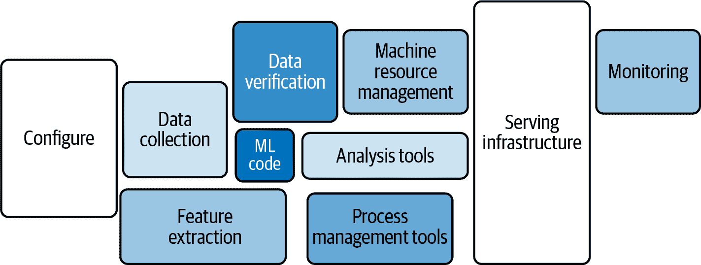
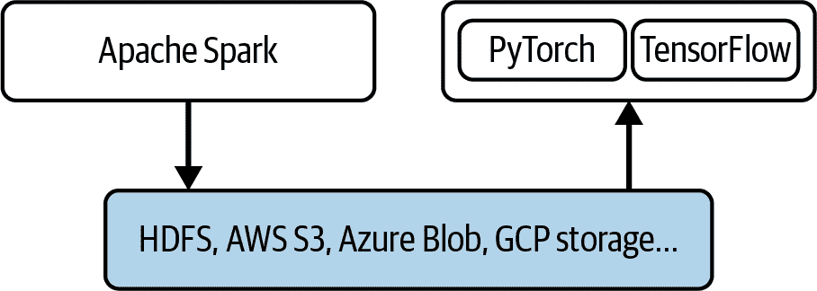
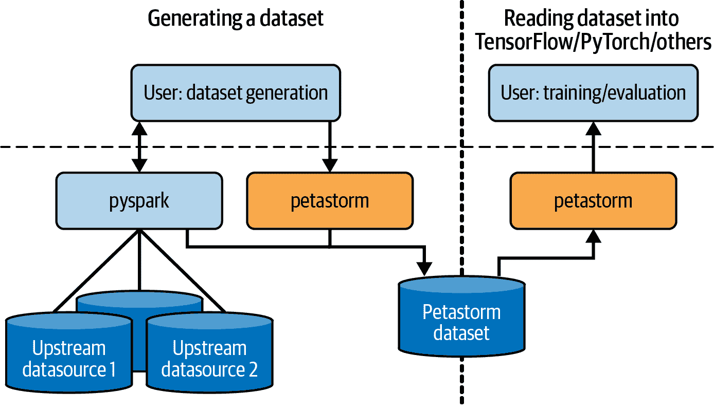
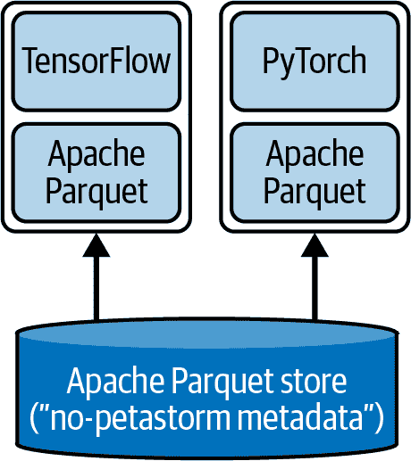
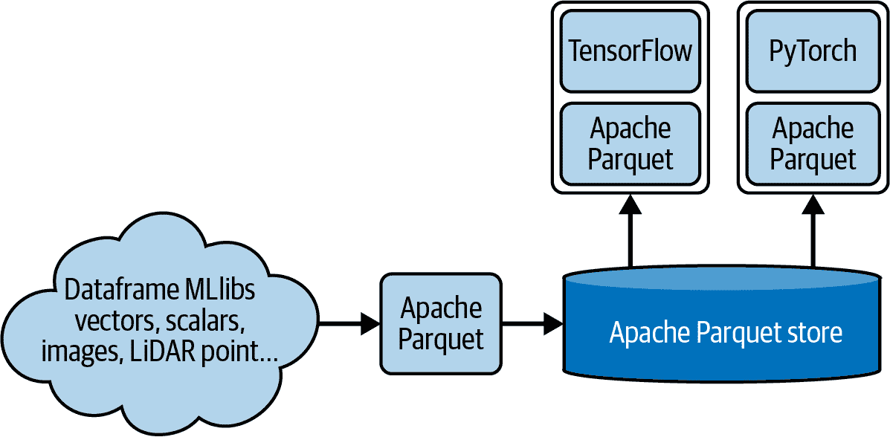
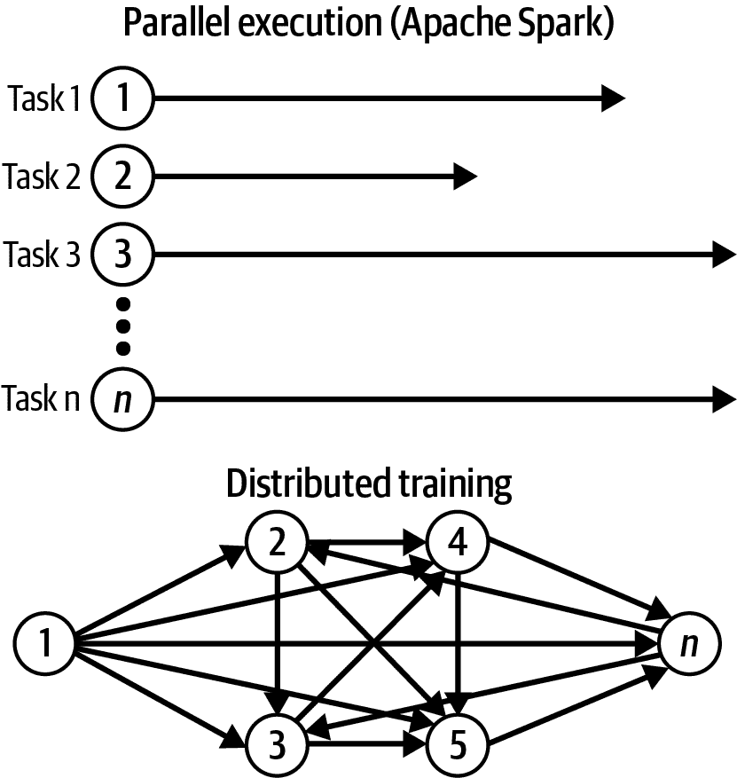

# 第七章：连接 Spark 和深度学习框架

到目前为止，本书的主要重点是利用 Spark 在扩展机器学习工作负载方面的能力。但是 Spark 通常是可扩展分析工作负载的自然选择，在许多组织中，数据科学家可以利用支持它的现有团队。在这种情况下，数据科学家、数据工程师、机器学习工程师和分析工程师都是数据的消费者和/或创建者，并共同承担机器学习基础设施的责任。使用像 Apache Spark 这样的可扩展、多用途、通用工具有助于促进这种协作工作。

但是尽管 Spark 是一个功能强大的通用引擎，具有丰富的功能，但它缺乏一些完全支持可扩展深度学习工作流所需的关键特性。这是开发框架的自然诅咒：在分布式世界中，每个框架都需要在基础设施级别做出决策，这些决策后来限制了 API 的可能性并限制了其性能。Spark 的限制主要与其基础前提相关，即所有算法实现必须能够无限扩展，这要求模型能够在规模上执行其学习过程，使每个步骤/迭代分布在多台机器上。这与 Spark 框架的哲学一致，即*集群的大小改变作业的持续时间，而不是运行算法的能力*。这意味着部分训练必须以幺半群的方式实现，这意味着数据集上的操作是一个封闭集，实现了结合二元操作的规则，这在特别是深度学习算法中并不总是容易保证。

对于深度学习算法来说，很难将每个学习步骤分解为可以后续聚合的子任务，这是传统的 MapReduce 范式 Spark 构建的难点。这些算法不容易分布，因为它们的激活函数需要看到整个数据集，或者接受一定程度的不精确性。这有时会使在深度学习应用（如自然语言处理和图像处理）上工作的数据科学家难以充分利用 Spark 的优势。这些系统也可以使用各种技术对大型数据集进行训练，这意味着为了有效地开发深度学习模型，您可能必须依赖更广泛的算法。

本章将讨论如何从 Spark 框架过渡到深度学习框架，而不是完全使用其他工具。为什么呢？在组织中，当存在一个良好支持的分布式系统来处理和消化数据时，最佳实践是利用已有的工具并充分利用它，而不是引入新的复杂框架。引入一个新的分布式框架可能需要几个月甚至几年的时间，这取决于团队规模、工作负载、任务对业务目标的重要性以及短期与长期投入的努力。如果你的组织已经在使用 Spark，你可以利用对该工具的熟悉程度更快地实现解决方案运行起来。

谷歌的文章[“机器学习系统中的隐藏技术债务”](https://oreil.ly/E2NBJ)告诉我们，训练机器学习模型只是问题的一部分，而且相对较小。基于这篇文章的图 7-1，展示了机器学习/训练代码本身与系统的各个其他部分之间的关系，它们为支持提供了依赖。所有这些元素的功能影响机器学习代码的可行性；这些组件中的任何错误都会在某个时刻影响机器学习代码。例如，如果我的数据收集过程存在缺陷，并提供了与机器学习代码期望的完全不同的模式的数据集，那么在尝试训练模型时就会遇到问题。



###### 图 7-1\. 机器学习代码所需的周边基础设施

确保机器学习系统的所有单独部分状态良好，并且能够良好协同工作，需要更多的工程师、更多的框架和更多的整体组织投资，而不仅仅是开发模型本身。通过利用已在您的组织中使用的工具，而不是通过引入新的工具来增加复杂性，可以更容易地克服实现分布式集群所需的工程支持的挑战。在我们的案例中，我们可以使用 Apache Spark 进行数据收集、验证、特征提取、分析等工作，然后再过渡到其他框架，只是为了 Spark 无法提供的功能，从而利用这些框架中存在的算法，同时更容易获得整个组织的支持。

现在你对为什么这么做有了更好的理解，让我们探讨一些使我们能够执行分布式训练工作流的技术。我在这里重点介绍两个在行业中有良好影响力并受到可靠组织信任的工具：PyTorch 和 TensorFlow。这两者提供了摄入和预处理大型数据集的能力，但与 Spark 相比，这通常更难实现，而你所合作的团队可能没有这些专用于机器学习的框架的经验。

即使你的团队同意投入时间和精力来学习这些工具，要求同行团队将其数据摄入、数据处理、特征提取等过程转移到新框架，需要对其余工作负载的基础设施进行重大改变，这将影响你执行手头任务的能力。更高效的解决方案是找出如何将我们已经在大部分工作中使用的工具与提供我们需要解决深度学习要求的额外功能的工具结合起来，充分利用它们功能的子集。这降低了学习曲线，使事情保持简单。

为了帮助你实现这一目标，本章涵盖以下主题：

+   数据和两个集群方法

+   数据访问层是什么，为什么以及何时使用它。

+   Petastorm 的介绍和使用示例

+   Spark 的 Project Hydrogen 和障碍执行模式

+   Horovod 估算器 API 简介

# 两个集群方法

当你的应用需要使用在 MLlib 中未实现的深度学习算法时，“两个集群方法”会非常有用。正如其名称所示，采用这种方法可以保持一个专用于运行所有 Spark 工作负载（如数据清洗、预处理、处理和特征工程）的集群。如图 7-2 所示，数据随后保存到分布式文件系统（如 Hadoop）或对象存储（如 S3 或 Azure Blob），并可供第二个集群——专用的深度学习集群加载并用于构建和测试模型。



###### 图 7-2\. 两个集群方法：一个专用于 Spark，一个专用于 PyTorch 和/或 TensorFlow，带有分布式存储层来保存数据。

TensorFlow（TF）具有专用的数据 API，允许您创建一个`Dataset`对象，并告诉它在 TF 集群中摄取数据时数据的来源。它可以读取文本文件（如 CSV 文件）、具有固定大小记录的二进制文件，以及专用的 TFRecord 格式，用于记录大小不同的数据。这些都是面向行的格式；TFRecords 是 TensorFlow 的默认数据格式，并使用 Google 的 Protocol Buffers 进行了优化。¹ 从 Spark 中读取和写入 TFRecord 数据是可能的，但在 Spark 中，最佳实践是使用列格式。在使用 TFRecords 时，最好还是坚持使用 TensorFlow。

这让我们回到一个问题：在何时适当或必要时使用多个机器学习工具。仅仅 TensorFlow 就足够满足您的需求吗？PyTorch 会更好吗？作为数据科学家，如果您需要从另一个库实现算法会发生什么？

要在多个平台上工作，我们需要重新思考我们的数据格式，并调整它们以适应每个平台的独立需求。此外，我们需要调整数据类型。正如您在第四章中学到的，Spark 具有专用的 MLlib 数据类型。当与 PyTorch 或 TensorFlow 进行桥接时，例如，将 MLlib 的稀疏向量保存到 Parquet 中，然后尝试直接加载到 PyTorch 等价数据类型中，我们可能会遇到类型和格式不匹配的问题。虽然我们可以通过 Apache Arrow 的`pyarrow.parquet`²克服这类问题，并构建我们自己的翻译层，但这将要求我们了解 Arrow 的工作原理，定义批处理并自行处理。这个过程容易出错，并且可能变得非常繁琐。相反，我们应考虑引入一个独立的翻译/数据访问层，支持 Parquet，并通过统一不同类型的机器学习框架的文件格式来简化数据管理。我们将在下面详细讨论这个问题。

# 实施专用数据访问层

数据访问层（DAL）是应用程序中的一个专用层，独立于业务逻辑和表示层，提供对存储在某种持久存储中的数据的简化访问。这个概念由微软引入，但也可以在微软环境之外使用。实际存储可以各不相同，DAL 可以支持多个存储连接器，并提供诸如数据转换、缓存等功能。

数据访问层并不负责存储本身的*可靠性*，而仅负责*可访问性*——即使不同应用程序也能访问数据。它提供了一个抽象层，使我们更容易消费使用其他工具写入的数据。在与多个机器学习训练平台一起工作时，它可以帮助我们弥合数据类型、格式、访问控制等方面的差距。我们不需要关注底层数据存储的复杂性，因为 DAL 将其隐藏起来。

## DAL 的特点

我们的数据访问层（DAL）应具备可扩展性并支持分布式系统——也就是说，它应能够将数据保存到分布式存储中，并利用现有的分布式服务器架构以分布方式写入和读取数据。它应支持各种数据类型，以填补 Spark 与其他分布式机器学习框架之间的差距，并且理想情况下，它应具备支持新兴机器学习框架的丰富软件生态系统。另外，应考虑到对数据进行缓存，因为机器学习算法会多次迭代数据以提高模型的准确性和降低损失（我们将在下一节讨论 Petastorm 时详细讨论缓存）。

拥有专门的 DAL 的另一个巨大好处是*可发现性*。DAL 应具有专用的数据目录，包含其存储的数据信息。这使得多个团队能够轻松独立地发现和与数据交互。一个众所周知且经常使用的数据目录是 Hive Metastore。有时被称为*元数据目录*，它保存有关数据的数据，Hive Metastore 实质上是所有 Hive 表的中央仓库；它包括有关它们的模式、位置、分区等信息，以便用户能够高效访问数据。

无论我们使用何种数据存储解决方案，我们的数据访问层应该都应该是一致的：它应该作为一个集中的元数据仓库，使我们能够访问和了解我们的数据。在机器学习中，这一点至关重要，因为我们经常需要协作工作，并且需要找到丰富我们的训练数据和开发可能存储在其他数据集中的新特性的创造性方法。类似地，在预处理和特征工程之后，我们需要我们的数据以一种能够加速学习过程的方式进行索引和保存。例如，如果我们在机器学习实验中对特定字段进行过滤，我们的 DAL 应该能够支持*列式格式*。这使我们能够创建一个供所有人使用的单一表，并在每个实验中仅使用所需的列进行过滤。自动驾驶数据集就是一个很好的例子，其中数据与来自传感器（如雷达和激光雷达传感器）的信息耦合，这些传感器主动发射信号并测量其响应。我们可能不希望在每次训练迭代中加载传感器信息，而列支持使我们能够更加高效。

如果我们使用在训练周期中对数据进行采样的机器学习算法，我们的 DAL 还应该支持*行过滤*。一些机器学习算法在训练周期中多次对数据进行采样，并不一次性读取所有数据。例如，长短期记忆（LSTM）是一种用于时间序列预测的深度学习算法。在 LSTM 中，模型需要从一系列过去的观察中学习，以预测序列中的下一个值。在这里，可能需要根据时间序列中的时间步骤在每次迭代中过滤行。可以将其想象为在时间线上滑动窗口，每个步骤计算由时间范围界定的观察值窗口，并尝试预测下一个值。然后根据预测的成功程度更新损失函数。这要求我们设计我们的数据以便模型能够相对快速地提取时间窗口的信息。一种选择是将这一部分作为实际文件层次结构的一部分。我们可以通过将时间步骤集成为文件路径的一部分来实现这一点，例如*../table_name/ts=1342428418/partition-...*，其中*ts=*代表此文件夹保存的时间步骤。

我们的 DAL 应该支持的另一个特性是*数据版本控制*。如在第三章中所讨论的，生成基于机器学习的应用程序的要求之一是能够重现模型构建实验。为此，我们的 DAL 需要能够支持随时间访问各个数据版本的能力。

综上所述，以下是我们的数据访问层（DAL）应该支持的关键特性回顾：

分布式系统

它应该能够利用现有系统来实现扩展。

丰富的软件生态系统

这使得它可以不断发展，包括新的机器学习框架的整合和确保持续支持、修复错误和开发新功能。

列式文件格式

列式文件格式按列而非行存储数据，这样在训练和测试过程中针对特定字段进行过滤时可以实现更高效率。

行过滤

一些机器学习算法需要对特定行进行抽样，因此我们需要一种机制来对行进行过滤，而不仅仅是对列进行过滤。

数据版本管理

应该可以回溯到过去，以支持实验的可重现性。

## 选择数据访问层（DAL）

现在我们知道我们需要一个数据访问层，那么我们如何选择呢？有多种解决方案可供选择，包括专有和开源的。您需要进行一些研究来了解您的具体需求，优先考虑它们，然后比较各种选项，找出哪些可能最适合您。在选择数据访问层之前，如果您计划将其用于工作，请确保在真实工作负载上进行测试。人们经常犯的一个大错误是仅运行供应商提供的基准测试，而不验证工具在他们自己的工作负载上的表现，这可能会有很大不同。还要记住计算潜在风险和成本。

在本书中，我专注于开源解决方案。有许多这样的解决方案，比如从 Spark 到 TensorFlow 或 PyTorch 的支持桥接，以丰富我们的机器学习算法的功能。我们将在下一节中介绍的 Petastorm 是其中之一。

# 什么是 Petastorm？

Petastorm 是由 Uber ATG 开发的开源数据访问库，允许我们直接使用 Apache Parquet 格式的多 TB 数据集进行深度学习模型的训练和评估。它通过使我们能够使用 TensorFlow、PyTorch 和其他基于 Python 的机器学习训练框架读写 Parquet 文件来实现这一点。Petastorm 的几个功能支持深度学习算法的训练，包括高效的行过滤、数据分片、洗牌和访问子集字段以及处理时间序列数据。图 7-3 展示了它如何融入机器学习系统的整体架构中。



###### 图 7-3\. 使用 Petastorm 数据集的架构图

这个图实际上讲述了两个过程的故事：数据集生成和训练/评估。基本上，我们有数据的生产者和消费者（这是许多机器学习工作负载中常见的模式）。来自各种来源的数据通过 PySpark 组合和处理，然后以 Parquet 列格式提供给分布式训练框架，如 PyTorch 和 TensorFlow，在模型训练和评估中可以多次使用。

图 7-4 和图 7-5，在接下来的几节中，展示了如何使用 Petastorm 的两种不同选项。第一种是简单地利用 Petastorm 作为转换器或翻译器，并将数据保留在严格的 Parquet 格式中。第二种方法是将 Petastorm 格式集成到 Apache Parquet 存储中；这利用了翻译器，并将数据保存到专用的 Petastorm 数据集中。

###### 警告

截至 v.0.12.0，Petastorm 仅支持转换/翻译和保存大小统一的图像。它不能处理图像大小的任何变化。因此，在处理此类数据时，考虑图像大小是非常重要的预处理部分。

根据我们如何使用数据集，这两个选项都可能很有用。在选择它们之间时，取决于我们的系统有多复杂：如果我们只使用 TensorFlow、PyTorch 和 Spark 框架，那么使用 Petastorm 作为存储可能是有意义的；但如果我们的数据系统更复杂，最好将数据保留在非 Petastorm 存储中，并仅利用 Petastorm 作为转换器/翻译器。

让我们来看看使用 Petastorm 的`SparkDatasetConverter`从现有的非 Petastorm Parquet 存储中训练模型的第一种方法。

## SparkDatasetConverter

`SparkDatasetConverter`是一个 API，可以为我们完成保存、加载和解析中间文件的“乏味”工作，这样我们就可以专注于深度学习项目的独特部分。它是如何工作的呢？想象一下，数据之前是使用 Spark DataFrame 处理的。它存储在内存中，尚未保存在任何特定的离线存储或文件中。我们可以利用这一点，将其保存到专用存储或中间文件中，Petastorm 管理这些文件。有趣的是，Petastorm 本身具有缓存机制，它将数据持久化到暂存存储中。当使用 Petastorm 的`SparkDatasetConverter`转换 DataFrame 时，每次访问数据时，Petastorm 将检查数据是否已经存在缓存并持久化到分布式文件系统中。如果是，它将从缓存中读取；如果不是，它将持久化到 Parquet 文件格式中。然后，转换器将加载持久化的文件到 TensorFlow 数据集或 PyTorch 数据加载器中，如图 7-4 所示。



###### 图 7-4. 使用 Petastorm 作为转换器

要实现这一点，在实践中，我们首先需要定义缓存路径（一个`cache_path`类型为`String`的实例），以指定中间文件的目录路径：

```
from petastorm.spark import SparkDatasetConverter
# Set a cache directory on DBFS FUSE for intermediate data
spark.conf.set(SparkDatasetConverter.PARENT_CACHE_DIR_URL_CONF,cache_path)
```

后来，`SparkDatasetConverter`（独立）能够通过分析 Spark 的 DataFrame 查询计划来识别 DataFrame 是否已缓存。最终，数据将以这种目录格式持久化在路径中：

```
*{datetime}*-*{appid}*-*{spark_application_id}*-*{uuid4}*
```

要读取缓存目录中的文件路径，您需要理解每个元素表示什么：

+   `*{datetime}*` 是一个形如`’%Y%m%d%H%M%S’`的字符串，表示 DataFrame 物化的时间（DataFrame 被处理的时间）。

+   `*{appid}*` 是应用程序 ID。

+   `*{spark_application_id}*` 是 Spark 应用程序 ID。我们可以通过`.sparkContext.applicationId`直接从运行中的 Spark 会话中获取这个信息。

+   `*{uuid4}*` 是一个随机数，用作唯一标识符。

使用 Petastorm 作为转换器具有许多好处。它缓存中间文件，并在程序退出时清除缓存。此外，它还自动将 Spark 独特的 MLlib 向量转换为 1D 数组。这种方法提供了解耦，消除了必须使用特定于 MLlib 的 Spark 来训练机器学习模型的必要性。

###### 警告

如果缓存功能失败，您需要管理可能在操作失败后仍然存在的短暂持久化文件。在再次写入之前，请确保所有创建的文件和目录已被验证、删除或安全存储在其他位置。

设置缓存后，现在是创建简单转换器的时候。转换器的输入如下：

`parquet_row_group_size_bytes`

这是定义转换器性能的关键组件（即其操作速度），也可以帮助防止内存溢出错误。它是`Int`类型，并定义了 Parquet 中物化后的行组大小，单位为字节。官方 Parquet 文档建议在 HDFS 上使用 512 到 1,024 MB 的行组大小。最佳块大小取决于您拥有的数据类型以及您是使用云存储还是本地存储。在像 Amazon S3 或 Azure Blob 这样的云存储中，对象大小通常会针对较小的块进行优化：Azure 为 64 KB 到 100 MB 之间，S3 为大约 5 MB 到 100 MB 之间（这些数字可能会变化，建议始终与云服务提供商核实）。例如，对于图像，您需要计算它们在磁盘上占用多少空间。请记住，此参数的单位为字节，因此在 HDFS 上优化为 512 MB 等同于 512 * 1,024 * 1,024 = 536,870,912 字节。如果我们在云中运行示例，则可能希望使用 1,000,000 字节或 1 MB，因为这个大小与我们的 Caltech 图像数据集很好地配合。

`compression_codec`

正如在第四章中讨论的，Parquet 支持多种压缩编解码器，由于 Petastorm 与 Parquet 一起工作，允许我们也定义编解码器。默认值为`None`。不要将图像数据压缩编解码器（JPEG、PNG）与 Spark 转换器功能的`compression_codec`混淆；后者指的是 Parquet 压缩。

`dtype`

这定义了我们数据中浮点元素的精度。在机器学习中，当我们将数据从一种状态转换为另一种状态时，总会有信息丢失的风险。特别是当我们将字符串转换为数字并稍后四舍五入或再次更改其表示时。转换器允许我们对此定义非常具体；默认类型为`float32`。

###### 提示

所有这些配置应该是全局变量，这样你可以更容易记住它们，团队也更容易合作。您可以定义一个单独的配置文件来定义操作和转换中的数据类型。在必要时，它们也可以作为 Spark 配置或*.env*文件的一部分定义。

一旦您理解了配置选项，代码本身就很简单：

```
# TIP: Use a low value for parquet_row_group_size_bytes. The default of 32 MiB
# can be too high for our image use case if we run it in the cloud.
# Convert the training DataFrame:
converter_train = make_spark_converter(df_train, 
                                       parquet_row_group_size_bytes=32000000)
# Convert the test DataFrame:
converter_test_val = make_spark_converter(df_val, 
                                          parquet_row_group_size_bytes=32000000)
```

在这个阶段，DataFrame 被实现。

Petastorm 使我们能够使用`TransformSpec`定义额外的预处理函数。我们在这里定义的所有转换都将应用于 Spark 工作者处理的每一行。我们需要注意我们想要保留的列，它们的数据类型，列的顺序以及最终模式。以下代码示例说明了如何定义`TransformSpec`：

```
# The output shape of the TransformSpec is not automatically known by Petastorm, 
# so you need to specify the shape for new columns in edit_fields and specify 
# the order of the output columns in selected_fields.
transform_spec_fn = TransformSpec(
    func=transform_row, 
    edit_fields=[('features', np.uint8, IMG_SHAPE, False)], 
    selected_fields=['features', 'label_index']
)
```

在此代码片段中，我们定义了一个将在 Spark 工作者中运行的函数，名为`transform_row`。这个可调用函数执行*pre-transform-schema*数据集到*post-transform-schema*数据集的转换。

在这里，我们使用这个函数准备要注入到专用 TensorFlow MobileNetV2 神经网络中的数据（有关 MobileNetV2 的更多信息请参见第八章）：

```
def preprocess(grayscale_image):
    """
 Preprocess an image file's bytes for MobileNetV2 (ImageNet).
 """
    image = Image.open(io.BytesIO(grayscale_image)).resize([224, 224])
    image_array = keras.preprocessing.image.img_to_array(image)
    return preprocess_input(image_array)

def transform_row(pd_batch):
    """
 The input and output of this function are pandas DataFrames.
 """
    pd_batch['features'] = pd_batch['content'].map(lambda x: preprocess(x))
    pd_batch = pd_batch.drop(labels=['content'], axis=1)
    return pd_batch
```

使用 Python 的映射功能，`transform_row`遍历`content`列中的数据，并将其转换为 MobileNetV2 请求的处理图像数据。虽然这在我们的示例中是这样，但`transform_row`不必以 pandas DataFrame 作为输入；它可以是任何其他类型。如果您还记得，在第五章中，我们使用了 Spark 的 pandas API 将 Spark DataFrame 的行批量转换为 pandas DataFrame 以对其进行迭代并提取特征。那是我首次介绍 pandas DataFrame 实例的地方。这是我们可以使用这些 API 做的事情的一个例子，使用它们来转换行。这也是我们使用的机器学习算法可能产生影响的一个很好的例子：这个算法不允许有任何缺失值，并且调整图像的大小是必要的，因为原始数据集中的图像尺寸不同，并且算法要求统一的大小和形状（大多数情况下也是如此）。我们可以通过运行`transform_row`同时处理这两个要求。

如果未正确定义`transform_row`，在实际转换过程中我们可能会遇到以下错误：

```
File "/opt/conda/lib/python3.9/site-packages/petastorm/arrow_reader_worker.py", 
	line 176, in _check_shape_and_ravel
    raise ValueError('field {name} must be the shape {shape}'

ValueError: field features must be the shape (224, 224, 3)
```

直到我们运行转换器并创建所需的数据集时，这个错误都不会显示出来。这意味着我们需要决定要使用哪种训练框架，并将数据转换为所需的实例类型。

注意我们处理 pandas DataFrame 的 Python 风格。我们将行处理成 *tuples*，⁴ 而不是 *namedtuples*，⁵ 因为这是 TensorFlow 在我们的场景中预期的方式。

最后，`selected_fields` 参数 (`selected_fields=['features', 'label_​index'])` 决定了列的顺序和名称。

接下来，让我们看看如何将它们与 TensorFlow 连接在一起。以下是一个代码片段，演示了通过调用 `make_tf_dataset` 函数并提供先前描述的 `transform_spec_fn` 和 `batch_size` 来创建实际的 TensorFlow 数据集：

```
with converter_train.make_tf_dataset(transform_spec=transform_spec_fn, 
                                     batch_size=BATCH_SIZE) as train_dataset, 
        converter_test_val.make_tf_dataset(transform_spec=transform_spec_fn,
                                           batch_size=BATCH_SIZE) as val_dataset:
```

此代码片段创建了以 TF 数据集格式表示的 `train_dataset` 和 `val_dataset`，可以在后续与 Keras 和 TensorFlow 一起使用。我们将深入探讨在 第八章 中使用此数据加载方法进行训练的可能性。

## Petastorm 作为 Parquet 存储

与仅使用 Petastorm 作为转换器不同的第二个选项是，使用 Petastorm 作为 Parquet 数据格式的存储构建 Petastorm 存储。这是 DAL 的经典变体。它要求我们在所有服务中引入 Petastorm 代码，并将使用 Petastorm 与所有数据使用者耦合在一起，正如 图 7-5 所示。



###### 图 7-5\. 使用 Petastorm 作为 Parquet 存储的专用存储，其顶部带有元数据

Petastorm 本身并不是一个完整的存储系统。它通过保存关于字段的额外元数据来支持存储以 Parquet 格式存储的张量（数组），这些字段被转换为 NumPy 数据类型。要创建 Petastorm 存储，您可以通过创建一个具有专用字段的 Petastorm `Unischema` 实例，并利用 `dict_to_spark_row` 函数来定义一个新的模式：

```
from petastorm.unischema import Unischema, UnischemaField
imageSchema = Unischema('caltech256schema', [
    UnischemaField('content', np.uint8, (224, 224, 3), False),
    UnischemaField('label_index', np.int32, (), ScalarCodec(LongType()), False)])
```

`UnischemaField` 是用于描述模式中单个不可变字段的类型。您必须为其提供名称、`numpy_dtype` 和形状。正如您从此示例中看到的那样，您还可以指定编解码器。Petastorm 支持各种编解码器类型，用于图像、标量数据等，如 `ScalarCodec`（将标量编码为 Spark DataFrame 字段）、`NdarrayCodec`（将 NumPy `ndarray` 编码/解码为 Spark DataFrame 字段）、`CompressedImageCodec`（压缩/解压缩图像）等。总的来说，所有编解码器定义了在序列化过程中使用的编码/解码过程。有时 Petastorm 可以自行确定所需的编解码器，就像本例中的 `content` 字段一样，但有时它会需要您的帮助，例如 `label_index` 字段。

让我们深入了解我们的字段。`content`字段是 Spark SQL 的`BinaryType`类型，`label_index`字段是`LongType`类型。尽管将后者映射到`numpy_dtype`很简单，但对于第一个字段来说却不是这样。在 Spark 中，`BinaryType`被实现为 Scala 字节数组。选择`numpy_dtype`时，我们需要回顾并评估数据的来源。`content`字段基于图像。它们的数值表示范围是`[0,255]`。对于这个范围，`np.uint8`非常合适。`uint`代表*无符号整数*，这种类型只能容纳正数。

在定义架构后，您可以利用`dict_to_spark_row`函数与 Spark RDD 验证数据是否符合`Unischema`定义的类型，并使用指定的编解码器对数据进行编码。在我们的示例中，我们提供了一个`ScalarCodec`。稍后，我们可以使用`spark.write`函数将数据写入存储。

本节内容密集：您了解了缓存是什么，Petastorm 是什么，以及如何利用它将处理过的 Spark 数据与 TensorFlow 和 PyTorch 结合使用，从而提高可访问性。接下来的部分将讨论 Hydrogen 项目，旨在通过启用更适合机器学习的调度来促进 Spark 与其他框架的连接。让我们直接开始吧！

# Hydrogen 项目

Hydrogen 项目是一个由社区驱动的项目，旨在改善 Apache Spark 对深度学习/神经网络分布式训练的支持。之前，我们讨论了两个集群方法，即使用 Spark 处理数据和进行深度学习的专用集群。设置这种方式的原因是 Spark MapReduce 调度程序的方法并不总是适合具有周期性训练过程的深度学习。算法的任务必须进行协调和优化，以支持反向传播和正向传播。为此，Hydrogen 项目作为其障碍执行模式的一部分提供了另一种调度原语，称为 Gang 调度程序，以及支持加速器的调度（对于深度学习训练性能至关重要）。

## 执行障碍模式

在神经网络中，*反向传播*意味着“错误的向后传播”。在对数据子集进行每次迭代时，神经网络计算损失函数相对于网络中权重的梯度。随后，它将误差传播回上一层网络，并调整该层的参数，旨在提高预测的准确性。反向传播从输出层一直传播到输入层。与之相反的是前向传播（有时称为*前馈*），在这种情况下，损失函数的计算梯度传播到其后的层。

###### 注意

这些是复杂的话题，我在这本书中只能浅尝辄止；要深入了解深度学习的数学和行为，请查阅 Josh Patterson 和 Adam Gibson 的[*Deep Learning*](https://oreil.ly/dp-learn)（O’Reilly）。

要更好地理解调度器的挑战，请看 Figure 7-6。顶部显示了 Spark 遵循的并行执行模型。虽然任务之间可能存在依赖关系，但由于 Spark 的特性及其使用单子操作的关联操作，任务是线性的，并且 Spark 在并行执行它们。另一方面，在分布式训练中，任务的依赖树更加复杂，不能保证并行执行。例如，在分布式训练过程中，任务 3 可能依赖于任务 2、1 和 *n*，而任务 *n* 则依赖于任务 5，任务 5 又依赖于任务 3。这意味着这里存在一圈操作，不再是一个有向图了。我们需要支持所有这些依赖关系，并决定何时以及如何计算每个任务。



###### 图 7-6\. 线性/并行执行与分布式训练

为了解决调度器的挑战，Project Hydrogen 引入了*障碍执行模式*。这允许我们定义一个特定的代码块，在这里使用障碍执行。障碍模型使我们能够在操作集之间创建门或障碍，并使跨障碍的操作变成顺序执行。这意味着每组操作可以并行执行，并且整个过程可以作为一个有向图运行，没有循环。通过建立跨障碍操作的固定顺序，该模型还允许我们将信息传递给依赖任务。

为了使用障碍执行模式，我们需要使用带有障碍上下文和 Spark 的 RDD 函数，比如`mapPartitions`来操作障碍 RDD。使用障碍 RDD 表示在这个 RDD 上执行的所有任务将使用障碍上下文运行。任务内的障碍上下文使我们能够决定哪些操作应该进行协调。首先，我们使用`BarrierTaskContext`定义阶段逻辑本身：

```
from pyspark import BarrierTaskContext

def stage_logic(row):
    context = BarrierTaskContext.get()
    # some logic that needs to be coordinated
    context.barrier()
    return row
```

然后我们定义障碍 RDD，并使用`mapPartitions`调用`stage_logic`：

```
barrierRdd = df.rdd.barrier()
rdd = barrierRdd.mapPartitions(lambda x: stage_logic(x))
```

就这样。直到`context​.bar⁠rier`调用之前我们在阶段逻辑中定义的所有功能都将在障碍执行模式下执行。这种模式利用了在第一章中讨论的 MPI 编程模型，以允许更好的通信和在 Spark 集群上协调循环训练过程。

现在我们能够定义阶段和障碍，让我们升级一下，看看 Project Hydrogen 所要解决的下一个挑战。

## 加速器感知调度

加速器感知调度的目标是验证分布式系统调度程序是否意识到可用资源和操作的管理，并了解 GPU 的可用性以进行硬件加速。基本上，这是一个功能，允许我们公开集群的 GPU 地址，以便 Spark 可以利用它们。我们已经知道在预处理时运行在 CPU 上的数据执行程序足够了，而在训练时我们通常需要 GPU。为了以编程方式找到 GPU，我们必须配置 Spark 属性以及提供发现脚本。表 7-1 演示了启用 Spark 加速器感知调度的一些配置选项。

表 7-1\. GPU 调度感知配置

| 配置键 | 配置值示例 |
| --- | --- |
| `spark.executor.resource.gpu.amount` | `5` |
| `spark.executor.resource.gpu.discoveryScript` | `/home/ubuntu/getGpusResources.sh` |
| `spark.driver.resource.gpu.amount` | `1` |
| `spark.driver.resource.gpu.discoveryScript` | `/home/ubuntu/getGpusResourcesDriver.sh` |
| `spark.task.resource.gpu.amount` | `1` |

发现脚本也可以用于将 NVIDIA 的 RAPIDS 加速器配置为 Apache Spark 的插件/附加组件（要了解更多，请查看[教程](https://oreil.ly/FFO_R)中的文档）。RAPIDS 为诸如连接、聚合等操作提供了更好的性能。基本上，让 Spark 意识到 RAPIDS 将允许它用 GPU 加速版本替换某些 SQL 操作。虽然这是解决方案中的一个重要部分，但其角色实际上是优化硬件本身，而不是操作。还要注意，Kubernetes 集群的行为可能与由 YARN 或独立集群控制资源的集群不同。

使用加速器感知调度，我们从执行器中运行的任务中获取 GPU 地址，使用[`TaskContext`](https://oreil.ly/FBPpI)：

```
context = TaskContext.get()
resources = context.resources()
gpus = resources['gpu'].addresses
# feed the GPU addresses into a dedicated program
```

从驱动程序中，我们可以利用`SparkContext`以前类似的逻辑：

```
sc = spark.sparkContext
gpus = sc.resources['gpu'].addresses
# feed the GPU addresses into a dedicated program
```

我们已经看到了如何获取 GPU 地址本身；现在我们可以将它们提供给 TensorFlow 或其他 AI 程序。

这里我们只覆盖了基础知识；有关优化资源的进一步提示，请查看 Spark 文档中的[“资源管理”](https://oreil.ly/t_dRI)部分。

# Horovod 估算器 API 简介

与机器学习的大多数方面一样，我们今天可以使用的工具和资源明天可能会发生变化。因此，本节将介绍一些标准，帮助您评估哪种专用管理平台能够最适合您，以便将软件和硬件有效地集成以适应规模，并为未来做好准备。为此，我们需要我们的软件充当一个层，在训练设计的软件和调整硬件的软件之间起到桥梁作用。这意味着除了支持该软件外，还需要支持我们目前正在使用的硬件以及未来可能想要集成的任何硬件。

为了以自动化方式将本书中使用的工具整合在一起，我们可以利用*Horovod*。Horovod 与 Petastorm 类似，是一个用于分布式深度学习训练的开源框架。它也是由 Uber 开发，并后来捐赠给 Linux 的[LF AI & Data Foundation](https://lfdl.io)。Horovod 的核心目标是允许单 GPU 训练在多个 GPU 上进行分布式训练。由于 Uber 广泛使用 Spark，工程师们还引入了*Estimator API*。Horovod Estimator 隐藏了将 Spark DataFrames 与深度学习训练脚本粘合在一起的复杂性。这是另一个帮助我们按照训练框架可解释的格式读取数据，并且我们可以使用 Horovod 分布训练的工具。作为用户，我们需要提供一个 TensorFlow、Keras 或 PyTorch 模型，而 Estimator 则负责将其适配到 DataFrame 上。训练模型后，Estimator 返回一个表示已训练模型的 Spark `Transformer`实例。稍后，这可以像任何 Spark 机器学习转换器一样用于对输入 DataFrame 进行预测，如第六章所讨论的。

Horovod 帮助我们配置 GPU 并定义分布式训练策略。它还通过`BroadcastGlobalVariablesHook`处理 Spark 的广播机制，支持在计算开始之前在所有进程上初始化专用值。这使得当我们希望从相同的随机权重开始训练时，能够保持一致性。与 Horovod 一起工作（即使只是作为练习）需要超出本书范围的专用硬件；如果您希望进一步探索这一点，请查阅[Horovod 文档](https://oreil.ly/p9PS3)。

# 总结

本章的目标是展示一种创造性的方法，以弥合诸如 Spark 和 TensorFlow/PyTorch 之间的技术差距，并开始思考可能实现的新方式。我们讨论了如何利用 Spark DataFrame 中保存的 Parquet 格式数据以及如何创建一个桥接来管理和加载到 TensorFlow 和 PyTorch 中。我们涵盖了双集群方法，使用专用数据访问层 Petastorm 和其他可能有助于桥接 Spark 和深度学习集群的工具。我们还讨论了如何将硬件和软件组合到软件意识到硬件的程度，以及如何配置的示例。

记住，这个世界仍在发展，并正在经历一场巨大的变革。没有一种方法适用于所有场景，每个组织都会有稍微不同的要求。基本的概念和需求将保持不变，但技术本身可能会发生变化；因此，评估您自己的专用数据管理平台的具体标准非常重要。即使这本书不会涉及数据管理和硬件环境的每一个方面，也要记住代码、数据和环境是密不可分的。

本章还应该为您准备好第八章，在那里您将学习使用 TensorFlow 进行分布式训练——我们将从基础知识开始，介绍 TensorFlow 独特的各种模式和架构，最后以使用 Petastorm 处理 Parquet 数据和运行分布式训练作业的逐步教程结束。

¹ Protocol Buffers，也称为 Protobufs，是一种开源的、语言和平台中立的可扩展机制，用于序列化结构化数据，类似于 JSON。

² Spark 大量利用 Arrow，但它是抽象的，我们很少直接与其一起工作。

³ *数据管理*指的是输入、存储、组织和维护组织创建和收集的数据的过程。

⁴ *元组*是 Python 用于存储数据集合的四种数据类型之一。数据以固定的、不可变的顺序存储，允许重复的值。

⁵ Python 中的*命名元组*是带有命名字段的元组，其中数据存储为键和值。要了解更多关于这种集合类型的信息，请查阅[Python 文档](https://oreil.ly/nFcKA)。
