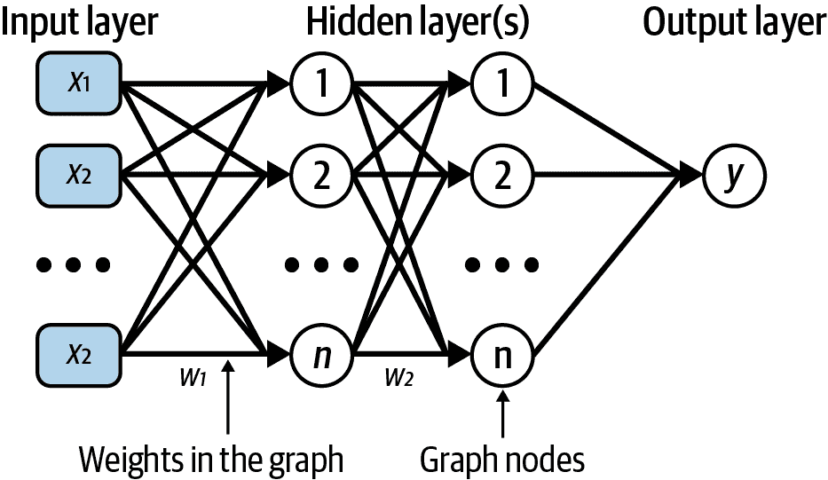
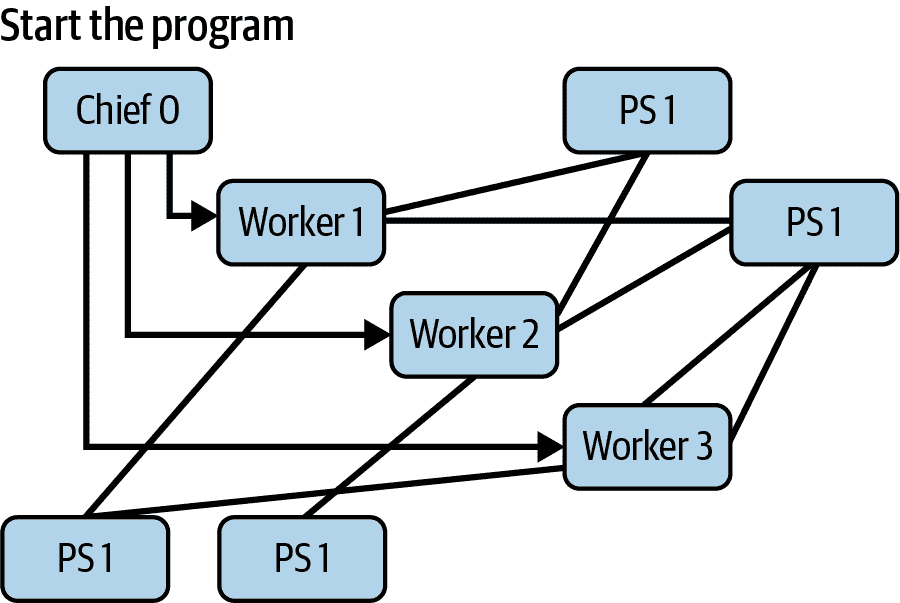
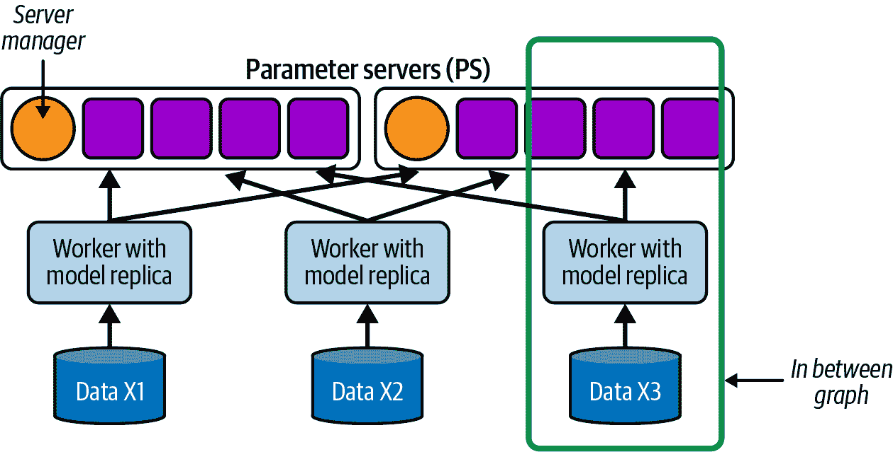
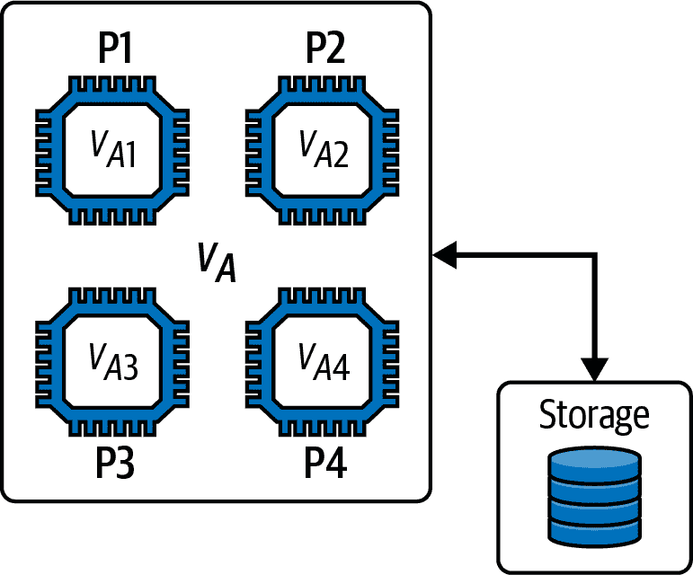
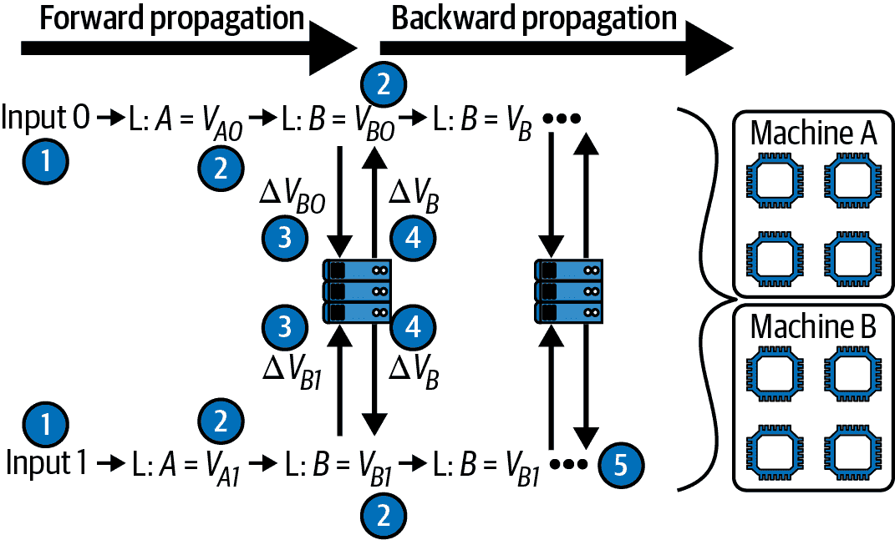
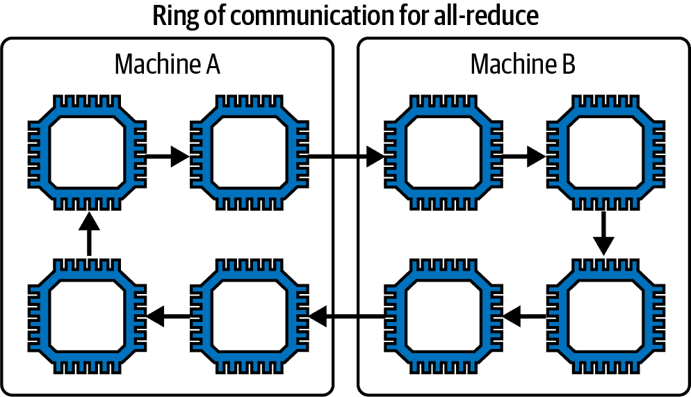

# 第八章：TensorFlow 分布式机器学习方法

TensorFlow（TF）是由谷歌大脑团队开发的开源软件库，旨在推动行业中的深度学习进展。他们的目标是缩小研究和实践之间的差距。

当 TF 在 2015 年发布时，它震惊了数据科学界。如今，它是深度学习中使用最广泛的库之一。为了提供一个完整的生产流水线解决方案，TF 团队在 2019 年向公众发布了 TensorFlow Extended (TFX)。除此之外，谷歌还创建了自己的处理单元，称为*张量处理单元*（TPUs），用于加速使用 TF 开发的机器学习工作负载。如果这个缩写看起来很熟悉，那是因为它有意与 GPU 相似，GPU 代表*图形处理单元*。虽然 TPUs 提供了一些先进的功能，但主要使用它们会将技术堆栈紧密地绑定到谷歌技术上。GPU 更为通用和灵活，因此使用它们作为加速器将使您的应用硬件计划更具跨平台性。

TF 提供了各种分布式训练策略，适用于 GPU、CPU 和 TPU。使用 TF，您可以丰富您的机器学习能力，超越 Apache Spark 的默认功能。要连接数据预处理和使用 TF 训练模型的机器学习工作流程，您可以使用 MLflow（在第三章中讨论）。

在上一章中，我们讨论了如何通过使用 Petastorm 将 Spark 和 TensorFlow 连接起来，以使 TF 能够处理 Parquet 数据。本章继续沿着这条路径，向您展示如何使用 TF 训练大量数据集。基本上，我们用 Spark 处理并保存到 Parquet 中的同一组数据现在可以用 TF 来训练模型了！

本章涵盖以下内容：

+   TF 基础知识的快速概述

+   如何将 Parquet 数据加载到 TensorFlow 数据集中

+   TF 用于训练模型的分布式策略

+   TF 训练 API 及其使用时机

+   将 Petastorm 到使用 TF 构建模型的所有内容整合在一起

让我们从看一下 TensorFlow 的主要组成部分开始。

# TensorFlow 的快速概述

TensorFlow 的基础包括张量、变量、操作、函数、图形和模块。让我们快速概述一下它们：

`tf.Tensor`

与 Spark DataFrame 类似，这是一个不可变对象：一旦创建，其状态就无法更改。`tf.Tensor` 表示一个多维数组。它有两个属性，`shape` 表示张量沿其轴的大小（例如 `(2, 3)`），`dtype` 是张量中元素的数据类型（例如 `float32`）。张量中的所有元素必须是相同的类型。

`tf.Variable`

与 `tf.Tensor` 不同，`tf.Variable` 是可变对象，其状态可以随时修改。变量是共享的，并表示数据的当前状态——你可以把它们看作是可变的多维数组，类似于张量，其值可以通过在其上运行操作来更改。TF 在机器学习训练中使用变量来存储模型的参数（例如，权重或其他可变状态）。

`tf.Operation`

`tf.Operation` 是图中执行一些计算的节点，例如添加标量值。它以零个或多个 `Tensor` 对象作为输入，并产生零个或多个 `Tensor` 对象作为输出。

`tf.function`

注意到**function**是小写的，而列表中其他项的名称（`Tensor` 等）是大写的。这是因为 `tf.function` 是一个*注解*，而不是 TF 对象：它将一个函数编译为可调用的 TF 图。这种注解为我们提供了一种 Pythonic 的方法来构建自定义的 `tf.Operation`，作用于张量上。以下代码示例展示了一个简单的 `add` 函数：

```
@tf.function
def add(x):
     return x + 1
```

`tf.Graph`

在 TensorFlow 中，有两种执行模型：*即时执行*，TF 函数会立即执行操作；*图执行*，操作被添加到一个 `tf.Graph` 中以便稍后执行。图包含执行计划，它包含数据（张量）和操作。类似于 Spark 的 DAGs，TF 图可以被优化。TF 运行时的默认图优化系统是 *Grappler*。它提供了各种优化器，可以按需启用，包括修剪优化器——如果你的计算图有不影响输出的节点，修剪优化器将通过修剪未使用的节点来减小图的大小，因此 TF 不会执行这些计算。这类似于 Spark Catalyst 引擎执行的优化，见 第二章，该引擎修剪节点并优化操作。

`tf.Module`

`tf.Module` 是 TF 机器学习层和模型的基类。模块是变量（包括训练过程中或训练后可以修改的变量，以及可以修改但不用于训练的变量——基本上是任何用户输入的变量）、其他模块和应用于用户输入的函数的容器。

###### 注意

变量可能包括在整个过程中会改变的训练参数和不会改变的超参数。例如，在线性回归模型中，参数可以是正在计算的加权系数。*k*-means 聚类中的超参数示例是簇的数量。

还有一些其他重要概念需要了解，如`tf.keras`库中的 `model.compile` 方法和 TensorBoard，这是 TF 用于机器学习实验的可视化工具包。`model.compile` 配置模型以进行训练，指定损失函数、图优化器和指标。关于 TensorBoard，TF 集群收集和记录数据，稍后在此处可视化。TensorBoard 还利用 TF 回调机制，该机制（如第三章讨论的）使我们能够将函数注入训练过程中，例如捕获训练的性能。这称为*分析*。分析过程量化了机器学习应用的性能，以确保其运行优化版本。由于算法通常计算量大，分析能力至关重要。要启用它，请确保在集群中安装 TensorFlow Profiler。您可以使用以下`pip`命令执行此操作：

```
pip install -U tensorboard_plugin_profile
```

之后，定义回调函数并将其整合到 `model.fit` 调用中，如下所示的代码片段：

```
tboard_callback = tf.keras.callbacks.TensorBoard(log_dir = logs,
                        histogram_freq = 1,
                        profile_batch = '500,520')

model.fit(df_train,
          epochs=8,
          validation_data=df_test,
          callbacks = [tboard_callback])
```

本书不会详细介绍 TF 回调机制及如何使用 TensorBoard 的工作原理；如需更多信息，请参考类似 Aurélien Géron 的入门文本 [*《Python 机器学习实战：基于 Scikit-Learn、Keras 和 TensorFlow》第三版*](https://oreil.ly/ml-slktf)（O'Reilly）。

在我们深入探讨 TensorFlow 的机制之前，让我们更加仔细地看一看它设计的主要目的——与神经网络一起进行深度学习——以及 TF 集群中的不同角色和职责。

## 什么是神经网络？

很好的问题！让我们快速过一遍，因为对这个概念的理解在接下来的章节中也会很有用！

神经网络，有时称为*人工神经网络*（ANN）或模拟神经网络，是一种试图模仿人脑运作方式的系统。该算法创建多层节点或“神经元”，通过输入数据进行通信和训练权重。它包括一个输入层和一个输出层，之间有一个或多个*隐藏层*负责数据转换、执行特征提取等。每层的大小和隐藏层数量取决于我们如何配置算法。图 8-1 是神经网络的抽象表示，包括一个输入层 *x*，两个隐藏层和一个输出层 *y*。



###### 图 8-1\. 神经网络图示例

假设我们的输入层中只有一个神经元，并且我们用输入数据来喂它。神经元内的函数根据一些预先配置的权重（可训练参数）、一个偏差函数和一些额外信息来计算输出。然后这个神经元产生一个输出，可以馈送到下一个神经元。正如前一章节中提到的，这被称为*前向传播*；信息只在这个方向上流动的神经网络称为*前馈网络*。训练通过根据*损失函数*调整每个神经元的权重来进行。因为预期的结果已知，这是一种监督学习方法。

在计算损失（或梯度）之后，可以将这些信息反馈给前面的神经元，以便调整其权重以改善性能。这被称为*反向传播*或*反向传递*。在 TensorFlow 中处理神经网络时，我们通常会使用其专用的 Keras API。Keras（本章后面将详细讨论）是内置于 Python 中的神经网络库，提供了用于训练模型的高级 API。TensorFlow 的 Keras API，`tf.keras`，已经实现并准备好使用多种机器学习算法。该 API 中的两个关键类是`Layer`类和`Model`类：

`tf.keras.layers.Layer`

这是所有层继承的基类。每一层接受一个或多个张量作为输入，运行指定的操作，并输出一个或多个张量。它有一个`call`方法，将该层应用于输入和状态（其权重变量）。

`tf.keras.Model`

这是用于定义模型架构的基类。其主要目标是在张量上运行一组操作。一个`Model`将多个层组合成一个对象，同时提供训练和推断的特性。例如，要对图 8-1 中的模型进行预测，我们只需要使用给定的数据输入（*x1*，*x2*，…）进行前向传递，以获取预测结果（*y*）。

###### 注意

对于全面学习如何使用 TensorFlow，我建议阅读 Aurélien Géron 的书《*Python 编程：从入门到实践*》中的[“Getting Started with TensorFlow”](https://oreil.ly/LT23z)章节。

## TensorFlow 集群过程的角色和责任

TensorFlow 集群遵循客户端/服务器模型。与 Spark 类似，您可以利用多台机器来完成计算需求的繁重工作。当运行 TensorFlow 任务时，在这些机器中的一台上创建一个会话，并且图被优化和计算，其中的部分可能分布在集群中的不同机器上。

一般来说，在 TensorFlow 集群中，有多个进程运行，可以是在同一台机器上（作为线程）或多台机器上。它们每个都有不同的角色和责任，因为它们各自负责完成大型处理计划的某一活动。与 Spark 集群类似，每个进程运行一个任务或 TF 服务器，并有自己的 IP 地址和端口号。这些角色包括以下内容：

工作进程

工作进程代表应用程序执行计算。

参数服务器（PS）

参数服务器跟踪变量的值和状态。更多信息请参阅 “深入了解 TensorFlow 的分布式机器学习策略”。

Chief

Chief 类似于工作进程，但它还承担额外的责任，如与集群健康相关的工作，比如写入 TensorBoard 日志或保存检查点。

评估器

这个进程负责对模型进行评估。

图 8-2 展示了各个进程之间的通信。Chief 负责启动程序；同时它还负责为其他工作进程提供配置和上下文。



###### 图 8-2\. TF 分布式计算及各进程的责任

进程的角色和责任通过集群的 `TF_CONFIG` 配置属性进行配置。我稍后会在本章节中分享配置示例。

现在你对 TensorFlow 的基本组件有了更好的理解，是时候学习如何将 Parquet 数据加载到 TF 数据集中了。

# 将 Parquet 数据加载到 TensorFlow 数据集中

就像每个机器学习过程一样，这个过程始于加载数据。在 TensorFlow 中，可以使用 `tf.data.Dataset` 对象的 load 函数来完成这一过程。

TF 数据集充当实际数据的抽象（类似于 Spark DataFrame），无论数据位于磁盘上还是内存中。这使你可以迭代分布式数据。你可以从多个来源获取数据，然后与任何 TF 模型一起使用。

如果单独使用 TensorFlow，load 函数就是你所需要的。它会从源迭代地获取数据；稍后，你可以对其进行预处理，使其符合标准格式，而 TF 引擎本身会收集数据统计信息。预处理完成后，TF 可以让你将数据保存到磁盘。一旦数据保存到磁盘，就可以准备进行下一步操作：由 TF 使用来构建模型。

不过，需要注意的是：虽然对于 CSV 和其他文件格式（比如图像）是这样，但对于 Parquet 并非如此。TF 不原生支持加载 Parquet 文件。

如何解决这个问题？为什么它是个问题？正如在第四章中描述的，通常您会希望利用您、您的团队或组织中其他团队准备的现有预处理数据。而数据通常会使用 Spark 预处理并保存为 Parquet 格式，这种情况下 TF datasets 的`load`函数无法准确加载。

在前一章中，我们将 Petastorm 用作框架之间的桥梁。Petastorm 有一个`make_petastorm_dataset`函数，它创建一个`tf.data.Dataset`实例，使用一个`petastorm.reader.Reader`的实例。

作为开发者，在创建 Petastorm 读取器之后，我们有责任以编程方式将其传递给`make_petastorm_dataset`函数。正如在第七章中讨论的，我们可以选择以 Parquet 格式保存数据，而不依赖于 Petastorm 存储直接操作。在这种情况下，为了创建读取器，我们使用`make_batch_reader`函数（而不是`make_reader`）。它创建一个非 Petastorm 的 Parquet 读取器，这正是我们需要的。

`make_batch_reader`函数执行以下步骤：

1.  根据其运行位置和我们提供的内容，规范化数据集的 URL。

1.  定位数据片段的文件系统路径。

1.  分析 Parquet 元数据以确定模式。此函数支持所有标准 Parquet 类型。

1.  如果有缓存格式，请验证它。

1.  确定读取器池的类型。可以是以下之一：

    +   `'thread'`（线程池）

    +   `'process'`（通常是专用的`ArrowTableSeralizer`）

    +   `'dummy'`（在主线程中执行所有`read`调用）

1.  返回已配置文件系统并准备就绪的读取器实例。

此逻辑返回一个从 Petastorm 数据集读取数据并封装`ArrowReaderWorker`的读取器实例。`ArrowReaderWorker`是一个 Petastorm 对象，反过来封装了`pyarrow`，使我们能够使用标准的 Arrow 互连格式处理 Parquet 数据（在第五章中讨论）。

现在您理解了这个逻辑，让我们写一些代码吧！下一个代码片段显示了如何导入函数并在 Python 语法中使用它。第二行创建了一个准备在 Python 函数范围内使用的读取器：

```
from petastorm import make_batch_reader
with make_batch_reader(petastorm_dataset_url) as reader:
    ...
```

现在我们有了一个 Parquet 读取器，但它有一些限制——不是所有`Dataset`的特性都能正常工作。为了消除这些限制，我们可以通过向构造函数提供以下参数来构建`petastorm.reader.Reader`本身：

1.  `Dataset`有一个专门的`repeat`函数，允许我们选择数据集运行的迭代次数。在构建读取器时，不要使用`repeat`，而是使用`num_epochs`，因为 Petastorm 不支持像 TensorFlow 那样的`repeat`方式。

1.  不要使用`filter`函数，而是使用`predicate`函数来充分利用 Parquet 作为列式数据格式的优势，仅在加载和解码其他列之前加载`predicate`函数已操作的列。

现在我们有了读取器，让我们创建数据集实例吧！为此，我们将使用`make_petastorm_dataset`函数。它将创建一个`tensorflow.data.Dataset`实例，我们可以用它来训练 TensorFlow 模型。记得从`petastorm.tf_utils`导入这个函数，如下面的代码片段所示。然后我们可以稍后调用这个函数，提供刚刚创建的读取器。以下是代码的一个示例，其中`num_epochs`作为读取器的一部分进行配置：

```
from petastorm.tf_utils import make_petastorm_dataset
...
with make_batch_reader(petastorm_dataset_url, num_epochs=100) as reader:
    dataset = make_petastorm_dataset(reader)
```

现在您知道如何将 Parquet 格式的数据加载到 TF 数据集实例中了。`make_petastorm_dataset`使用了 TF 的`tf.data.Dataset.from_generator`函数，它从数据集的 URL 和文件系统获取下一块数据。有了这个数据集实例，我们可以开始训练分布式机器学习模型了。

下一节将讨论多个分布式 TF 训练策略。这也将帮助您理解 TensorFlow 分布式方法与 Spark 的区别。

# 深入了解 TensorFlow 的分布式机器学习策略

TF 支持多种封装策略进行分布式训练：同步与异步、全局归约与参数服务器、图内与图间，以及 CPU/GPU 与 TPU。所有策略都可以通过 *tf.distribute.Strategy* 库使用。

TF 支持数据并行 ism，因此我们的数据集分布在多台机器上，在训练过程中，我们集群中的每台机器处理数据的不同部分。训练操作逻辑在多个设备上复制，并且算法的变量在它们之间共享。每个操作逻辑的副本通过特定于所使用的策略的机制更新这些变量。因此，在训练过程中，机器学习算法正在更改模型的变量（已经训练过的变量），直到巩固。为了支持算法的高效巩固，我们需要根据数据大小、集群资源等选择合适的策略。

TF 分布式策略设计的优点在于它使我们能够编写模块化代码，将训练模型的功能与定义训练策略分开。这允许我们在同一策略中合并多个训练函数，并在训练时使用不同的策略。下面的代码片段展示了在不同策略之间切换是多么容易。每个策略实例可以从`tf.distribute`创建：

```
import tensorflow as tf
strategy = tf.distribute.MirroredStrategy()

with strategy.scope():
    some_model = ...
    some_model.compile([...])
    ...
```

训练策略与模型训练代码的解耦允许进行更多的实验。请注意`scope`函数的使用范围定义了策略执行的位置。在我们的示例中，在此范围内，训练正在利用`tf.distribute.MirroredStrategy`策略。

TF 支持五种分布式训练策略和三种不同的 API 用于训练机器学习模型——你可以使用`tf.Keras`或者 TF Estimator API 或者构建自定义训练循环。表 8-1（来自 TensorFlow 文档）详细介绍了这些不同训练 API 在各个策略上的支持情况，更多细节见“训练 API”。在本章节中，你可以参考此表格，并帮助你决定哪种组合最适合你的项目。请注意，一些策略目前仅具有有限或实验性支持，这意味着这些功能尚未完全验证并仍在开发中；要获取最新的支持信息，请参阅[文档](https://oreil.ly/NsUs0)。

表 8-1\. TF 的分布式训练能力及其在各种训练 API 中的支持情况

| **训练 API** | `Mirrored Strategy` | `TPU⁠Strategy` | `MultiWorkerMirror Strat⁠egy` | `Central⁠Storage Strategy` | `ParameterServer Strat⁠egy` |
| --- | --- | --- | --- | --- | --- |
| **Keras Model.fit** | 支持 | 支持 | 支持 | 实验性支持 | 实验性支持 |
| **自定义训练循环** | 支持 | 支持 | 支持 | 实验性支持 | 实验性支持 |
| **Estimator API** | 有限支持 | 不支持 | 有限支持 | 有限支持 | 有限支持 |

在本节的剩余部分，我们将依次详细介绍这些策略，从最初的方法开始。

## 参数服务器策略

`ParameterServerStrategy`（有时称为“参数服务器和工作器”）是最古老的方法，TF 从一开始就支持。每台机器承担工作器或参数服务器的角色，TF 将任务分为工作器任务和参数服务器任务。工作器任务可以是从读取输入到更新变量，计算前向和反向传播，以及发送更新等任何任务。参数服务器任务包括在训练期间存储机器学习模型的参数（即神经网络的权重），保持参数值在服务器之间的强一致性，并根据请求向处理数据和计算参数更新的工作器提供信息。

规则很简单：

+   变量存储在参数服务器上，并且在每个训练步骤中由工作器读取和更新。

+   每个变量存储在单个参数服务器上。

+   工作人员独立执行其任务，不与其他工作人员通信。工作人员仅与参数服务器通信。

+   根据变量的数量，可能会有一个或多个参数服务器。

当存在许多 CPU/GPU、大量计算矩阵和稀疏查找时，这种模型效果很好。它被视为*中间图策略*。这是 TensorFlow 1 的一个概念，意味着每个工作人员都独立运行自己的函数，读取变量，执行操作并更新参数服务器。这使得工作人员可以异步运行，并且容易从故障中恢复。

使用这种策略，工作人员使用异步远程过程调用（RPCs）¹与参数服务器通信，以读取和更新每个变量。这使得工作人员可以独立操作，并以自己的速度处理输入。

这种方法的一个潜在缺点是，在每个训练步骤的开始阶段可能会出现网络瓶颈，当工作人员都尝试联系参数服务器以读取变量时，而运行时并未提供特定的顺序。在计算第一个神经网络层的第一步时经常会出现这个问题。

图 8-3 显示了该策略架构的高级图表。根据参数服务器的数量、可用性需求等，参数服务器本身可以是分布式的。每个工作人员都有模型的一个副本，并且正在处理数据的特定部分（X[1]、X[2]、X[3]等）。图表中的箭头显示了工作人员与参数服务器之间的通信。根据参数服务器的数量和分布，可能会有一个专用的服务器管理器（“首席”在图 8-2 中）来管理每组参数服务器。



###### 图 8-3\. `ParameterServerStrategy`架构

`ParameterServerStrategy`是一种通用策略：所有函数/操作都可以在一个工作人员上运行，因此任何可以分解为一系列独立函数的机器学习算法都可以利用它。随着 TensorFlow 2 的推出，这种策略发展了，引入了一个专门的[*集群协调器*](https://oreil.ly/GLZpk)。集群协调器负责创建工作人员和参数服务器所需的资源，同时协调训练本身。这种方法有助于减轻初始阶段 RPC 的开销。

以下代码片段展示了如何定义策略和协调器。这两个函数接受多个参数，例如`cluster_resolver`，其中包含集群规范：

```
# define the strategy
strategy = tf.distribute.experimental.ParameterServerStrategy(
    tf.distribute.cluster_resolver.TFConfigClusterResolver())
# define the coordinator
coordinator = tf.distribute.experimental.coordinator.ClusterCoordinator(
    strategy)
```

现在您了解了`ParameterServerStrategy`，让我们继续学习下一个策略，并了解 TF 策略如何发展以克服迄今为止出现的挑战。

## CentralStorageStrategy: 一台机器，多个处理器

`CentralStorageStrategy`是对 RPC 问题的早期解决方案。使用这种策略，您可以在一台具有多个 CPU 和 GPU 的机器上计算图内操作：

+   CPU 持有变量（类似于 PS）。

+   GPU 执行操作（类似于工作器）。

+   所有设备上的通信都是同步的，这意味着它们在锁步中共同工作。

每个 CPU 持有变量的子集，并在每一步更新它们。这些变量不在处理器之间共享；每个处理器执行其更新，然后它们交换信息以在每一步同步梯度（模型的训练变量）。这可以很容易地完成，因为所有处理器都在同一台机器上。每个训练步骤涉及一次完整的图运行（一个完整的时代）。所有这些都由单个客户端，即主线程协调。这种策略使得在单台机器上进行训练更加高效，这在只有一台机器可用的嵌入式场景中非常有用。

您可以使用以下代码片段创建一个`CentralStorageStrategy`实例：

```
central_storage_strategy = tf.distribute.experimental.CentralStorageStrategy()
```

虽然这种方法克服了网络瓶颈的问题，但引入了不同的困难：一台机器只有一个中央存储，任务共享相同的磁盘空间和 RAM。这意味着每个变量和操作在内存中只表示一次；在 CPU 上有一个变量的单个副本，并且每个进程（GPU）有一个模型的副本。还需要注意的是，当只有一个处理器时，不会加速发生。

为了解决这些问题，TF 引入了`MirroredStrategy`方法。我们接下来将看看这个方法。

## MirroredStrategy：一台机器，多处理器，本地副本

与`CentralStorageStrategy`类似，`MirroredStrategy`支持在一台机器上运行多个 CPU/GPU。然而，每个持有训练操作逻辑副本的处理器也会持有每个变量的本地副本。这些变量会在所有处理器之间复制并保持同步（即*镜像*），通过在所有处理器上应用相同的更新来实现，如图 8-4 所示。这种方法与`ParameterServerStrategy`和`CentralStorageStrategy`不同，因为后者每个处理器/机器只持有训练变量的子集，而不是整体集合。



###### 图 8-4。`MirroredStrategy`架构

为确保在处理器之间进行相同的更新，该策略使用了*全归约*算法，在计算机科学领域很常见。每个处理器与所有其他处理器进行通信以交换更新（“全”部分），并使用`reduce`函数来聚合这些值，将它们减少到一个单一值，并将结果返回给所有处理器。

减少操作通常在并行编程中用于将数组的每个元素减少为单个结果。它们必须是可结合的操作。换句话说，对数据的操作顺序不应该影响结果。例如，求和操作中，操作数的顺序无关紧要；无论是计算*a* + *b*还是*b* + *a*，结果都是相同的。对于 max、min、mean 以及许多其他操作也是如此，这些操作能够在变量之间进行同步。

###### 提示

全局减少方法的优势在于可以在硬件上进行优化。例如，如果您的机器使用 NVIDIA 处理器，您可以配置集群以使用 NVIDIA 的全局减少通信功能来加速变量的同步。我不会在这里讨论具体的硬件优化，因为这些优化因供应商而异，但知道这一点并据此采取行动是很好的。

下面的代码片段显示如何创建`MirroredStrategy`实例——为了指定机器，您可以更新 TensorFlow 集群配置文件（很快就会详细讨论！）或将此信息传递给函数：

```
mirrored_strategy = tf.distribute.MirroredStrategy()
```

虽然这种策略在特定场景下非常有效，例如在使用嵌入式设备时，有时我们需要在多台机器上进行训练。这种能力由`MultiWorkerMirroredStrategy`提供，我将在下文中详细介绍。

## MultiWorkerMirroredStrategy：多台机器，同步

`MultiWorkerMirroredStrategy`与`MirroredStrategy`非常相似：它提供了一个跨多台机器进行同步训练的实现，每台机器可以有多个处理器。每个变量在机器和处理器之间都被复制和同步。当机器之间的连接良好时，这种方法效果很好。由于它依赖于全局减少算法，所有机器都需要通信以同步变量。

那么在这种情况下，同步训练实际上是什么样子呢？假设我们有一个算法，包含两个神经网络层，并在训练过程中有两个要训练的变量。如图 8-5 所示，层 A 和 B 被复制到两台机器 A 和 B 上。您可以看到每台机器都有所有变量的副本，每个变量都有其自己的数据片段作为输入：input 0 和 input 1。



###### 图 8-5\. 使用`MultiWorkerMirrorStrategy`进行同步计算

让我们看一下同步本身是如何工作的。我们有四个组件：

+   两个变量组件，因为我们在每台机器上都保留了各自的变量副本

+   由于每台机器都在其自己的训练数据子集（input 0 和 input 1）上操作，所以有两个数据组件。

逻辑如下：

+   每台机器都会接收自己的输入（1），然后仅使用其本地变量的副本进行前向传播（2）。机器 A 使用输入 0 计算层 A 和层 B，机器 B 使用输入 1 计算层 A 和层 B。

+   在开始反向传播之前，我们希望优化训练变量，因此使用本地变量的副本计算梯度（3）。机器 A 计算 V[A0]和 V[B0]，机器 B 计算 V[A1]和 V[B1]。

+   现在我们想要聚合训练变量以确保它们同步。我们使用全局归约方法来做到这一点：我们通过网络发送梯度的副本并将它们聚合（4）。也就是说，每台机器将 V[A1]和 V[A0]聚合为∆V[A]，将 V[B1]和 V[B0]聚合为∆V[B]。或者，这种聚合可能在不同的机器/处理器上进行，例如，一台优化运行归约操作的 NVIDIA GPU，可能将此作为其唯一任务。聚合完成后，它会将更新后的梯度∆V[A]和∆V[B]广播回机器。

+   最后，我们进行反向传播（5）。

在此过程中，我们使用了全局归约方法，将单个聚合梯度值通信到所有机器（V[A0]，V[A1]等）。然后，每台机器将该梯度应用于其本地变量。如果您参考图 8-5，您会发现每台机器都有四个处理器，这意味着梯度在四个处理器中本地复制。由于全局归约在所有副本中产生相同的值，更新都是相同的，这些值在所有不同的机器和副本中保持同步。

一旦此过程完成，下一个前向传播可以立即开始；不需要等待值，因为在步骤结束时，所有副本都已更新并具有同步的完整变量集的本地副本。

此外，我们可以通过在计算其他层的梯度时同时对一个层进行全局归约来实现一些并行化（例如，在计算层 B 的梯度的同时，交换层 A 的梯度以同步副本。这种方法在存在反向传播时效果很好；通过适当的同步，我们可以充分利用硬件，同时保持网络通信和计算部分的忙碌状态。这对吞吐量和性能非常有益。

###### 注意

*分层全局归约*是全局归约过程的一种实现，其中聚合和梯度计算在每台机器内部完成，然后以分层方式跨机器传输信息。因此，如果一台机器是工作节点，并且每个工作节点有多个处理器，则它们可以在每一步同步梯度时同时运行多个任务。然后，可以稍后将结果与网络中其他机器的结果同步。这种方法通常表现更好，更具可伸缩性。它减少了对参数服务器的依赖，并允许立即开始训练的下一步（第二个 epoch），而不必等待工作节点将其结果与其他工作节点同步。请注意，与每台机器只有一个处理器的四台机器相比，拥有每台机器有两个处理器的两台机器将导致更快的执行（因为需要更少的网络通信），同时仍然确保集群的容错性。

`MultiWorkerMirroredStrategy`还支持*环形全局归约*或*环形归约*算法。这里的通信方式不同：每个处理器不是与所有其他处理器通信和接收消息，而是每个处理器只从一个处理器接收信息，更新它，并将信息发送给另一个处理器。处理器连接成圆形或环形结构，如图 8-6 所示。环形全局归约通常比全局归约更有效，因为它在网络上发送的消息更少。



###### 图 8-6\. 同步梯度计算的环形全局归约通信架构

###### Tip

存在其他变体的全局归约通信结构，例如树形全局归约、轮换全局归约等等。TensorFlow 支持各种跨设备通信（或*设备操作*）的实现，包括`tf​.distribute.CrossDeviceOps`、`tf.dis⁠tri⁠bute​.Hierarchical​Copy​All​Reduce`、`tf​.distribute​.Reduction​ToOneDevice`和`tf​.dis⁠tri⁠bute​.Nccl​All​Reduce`，适用于 NVIDIA 处理器。在选择时，请务必验证其在您的硬件上的支持。

请注意，要启用这种策略，您必须确保设置`TF_CONFIG`环境变量，以指定 TF 集群中每台机器的角色。以下是配置文件中的示例：

```
os.environ["TF_CONFIG"] = json.dumps({
    "cluster": {
        "worker": ["host1:port", "host2:port", "host3:port"],
        "ps": ["host4:port", "host5:port"]
    },
   "task": {"type": "worker", "index": 1}
})
```

使用`MultiWorkerMirroredStrategy`，有一个指定的工作节点来协调集群的活动。这个节点负责生成用于进一步日志记录和失败恢复的摘要文件，还负责处理其数据片段。它被称为*主节点*，在`TF_CONFIG`中的集群工作节点数组中的索引为 0（在我们的示例中，主节点是*host1*）。

首席工作节点的最重要任务是保存检查点，捕获模型在特定时间点使用的所有参数的确切值。在机器、网络通信或任何其他可能的集群故障情况下，它们可用于快速恢复，使应用具有弹性和容错性。假设您正在执行一项大量计算以训练机器学习模型的任务，可能需要数天甚至数周时间。突然间，数据中心停电，所有机器都宕机了。重新启动整个训练过程可能会延迟数周或数月建立模型——但通过检查点机制，首席工作节点负责定期将变量状态和值保存到文件系统。这意味着，借助代码和检查点数据，我们可以从上次检查点恢复进程，而不必再次从头开始整个计算过程。这节省了大量时间。（顺便说一句，这些情景并不少见——在具有许多活动部件的大型集群中，它们非常常见。）Spark 和 TensorFlow 都允许在计算过程中保存检查点。TensorFlow 使用`tf.train.Checkpoint`持久化模型及其数据的状态。稍后，可以通过高级 API 进行构建。Spark 将节点元数据与数据状态一起保存，使得从检查点加载并继续计算变得简单。

###### 注意

集群中的每个任务可能与其他机器上的任务通信。确保配置防火墙或虚拟网络安全协议，以便在定义的端口上所有集群机器之间的通信都被授权。为了减少配置开销，通常更方便地使用相同的端口用于所有集群机器。

## TPUStrategy

TensorFlow 提供的最终分布式训练策略是`TPUStrategy`，用于 TPU 和 TPU Pod 上的同步训练。与两个镜像策略类似，它支持单个处理器之间的通信，以及机器之间的通信。如前所述，TPU 是由 Google 创建的，并且可以在多个 Google 平台上找到。使用`TPUStrategy`需要访问专用的 Google 平台和硬件，因此我们在本书中不会深入讨论它。

## 切换策略时会发生哪些变化？

如本节开头所述，TF 提供了一种模块化的代码方法来在不同策略之间切换。选择训练策略时，以下是您需要牢记的一些因素：

+   通信方式（同步或异步）

+   变量复制（是否在每个工作节点上保留所有变量的本地副本）

+   梯度聚合在机器内和/或跨机器进行，以及如何将结果传送给工作节点

+   反向传播的进行方式以及变量同步的时间点（是在全过程中进行，还是仅在全过程结束后进行）

+   度量如何累积，这受到全归约算法和通信方法的影响

现在您已经熟悉了各种 TF 分布式训练策略，接下来我们将关注它提供的 API 来训练机器学习模型。

# 训练 API

选择训练策略是一个关键步骤，但正如我们在 表 8-1 中看到的，我们选择策略可能会受到我们想要使用的训练 API 的影响。TensorFlow 提供了三个选项：

Keras API

`tf.keras` API 提供了各种内置算法和模型，可用于构建机器学习模型。

自定义训练循环

我们可以使用 TF Core API 来构建自己的训练循环、层、操作等。

Estimator API

Estimator API 使用类似于我们在 第六章 中讨论过的 Spark MLlib 估计器的方法。估计器支持各种图形架构；它们是 TensorFlow v1 库的一部分，抽象了 TensorFlow 的计算 API。根据我们的需求，我们可以选择使用预制的估计器或创建定制的估计器以满足我们的需求。

在接下来的几页中，您将看到这些 API 提供了不同程度的灵活性，因此需要不同水平的机器学习专业知识。其中最简单的 API 之一是 Keras API，这也是我们将从中开始的地方。

## Keras API

Keras 是一个用 Python 编写的高级深度学习 API，运行在 TensorFlow 之上。Keras API 提供了一种 Pythonic 的方式来训练新的机器学习模型并与现有模型一起工作。Keras 提供了广泛的功能，还包括许多内置的公共 [数据集](https://oreil.ly/ZGBs0)，如波士顿房价数据集、MNIST、CIFAR10 等。

使用内置数据集是开始的绝佳方式。如果您想了解如何使用 API，您无需搜索或创建专用数据集，因为您已经可以立即将几个准备好的数据集导入到训练 API 中了，这些数据集已经过预处理。

Keras 还提供了许多预训练模型。这些是该训练 API 的最大优势之一：因为模型本身由层构成（如前文所示，在 图 8-1 中），我们可以决定是否要按照现有层的形式重用它们或更改它们。例如，我们可以将现有模型用作基础模型，然后在末尾添加一个预测层，这将是给定现有数据的输出层。这样做可以节省大量从头开始训练模型所需的工作量。

为什么会有效？或者说能否生成一个好的模型？这是一个很好的问题。在研究使用神经网络的各种情景时，通常存在一个共同的基准，例如图像分类。大部分训练涉及检测颜色、边缘、形状等，并不依赖于确切的输入数据。这意味着您可以使用预训练模型的权重作为在基于业务需求处理自己数据时的起点。

如在第五章中所述，这种方法有时被称为 *迁移学习*。在迁移学习中，通过解决一个问题获得的知识被应用于一个不同但相关的问题。Keras API 使我们能够轻松实现这一点——我将向您展示如何使用 MobileNetV2。

### MobileNetV2 迁移学习案例研究

MobileNetV2 是一个由 53 层组成的深度卷积神经网络，使用 ImageNet 数据集进行训练，该数据集包含超过一百万张图像，涵盖了 1,000 个不同的类别（例如键盘、鼠标、铅笔以及多种动物）。您可以通过 `tf.keras` API 加载预训练版本的网络。

让我们从导入开始：

```
from tensorflow.keras.applications.mobilenet_v2 import MobileNetV2
```

导入神经网络后，我们可以通过调用 `summary` 函数来简单查看其摘要。我们还可以定义如何加载模型。这是通过指定我们处理的数据的输入形状（例如 `(``*height*``,` `*width*``,` `*channels*``)`）、我们是否要包含顶部（分类）层以及要使用的权重来完成的。如果我们打算避免使用随机权重从头开始训练整个模型，重要的是定义权重。如果我们不为此变量提供值或指定为 None，则会发生这种情况。在我们的情况下，我们希望利用基于 ImageNet 数据集的现有权重（或者，您可以传递路径到要加载的权重文件）。以下代码片段将加载模型：

```
# define params
IMG_SHAPE = (224, 224, 3)
# Load the model as base_model
base_model = MobileNetV2(input_shape=IMG_SHAPE, include_top=False, 
                         weights='imagenet')
```

使用模型需要理解其层及其用法。例如，某些层用于特征提取。如果我们不想提取新特征，我们可以冻结参数并将 `base_model` 自身定义为不可训练。这将强化迁移学习的效果，我们只需添加一个新的分类层来对图像进行分类。下一个代码片段演示了这一点：

```
# Freeze parameters in the feature extraction layers
base_model.trainable = False

# Add a new classification layer for transfer learning
global_average_layer = keras.layers.GlobalAveragePooling2D()
prediction_layer = keras.layers.Dense(num_classes)
```

请注意，我还添加了一个 `GlobalAveragePooling2D` 层，用于空间数据的池化操作。在图像中，池化与像素的池相关。此层的目标是逐渐减少表示的空间大小以及网络中的参数数量和计算量。当您希望最终模型适合较小的设备（例如嵌入式或物联网设备）时，这是必不可少的。

###### 注意

虽然分布式训练通常使用的数据集太大，无法放入单个机器的内存中，但这并不意味着我们无法使用一个可以的小型模型来解决这个问题。减小神经网络或其他机器学习模型的大小，使其能够在内存或功耗受限设备上运行，包括日常物联网设备，如电视、冰箱、汽车等，是 TinyML 的主要目标。如果您对此主题感兴趣，可以看看[Pete Warden 和 Daniel Situnayake](https://oreil.ly/tinyML)的《TinyML》（O'Reilly）。

现在我们有了`base_model`和两个层，我们希望将它们堆叠到一起形成最终模型。为此，我们使用`Sequential`函数，它允许我们指定如何堆叠这些层。该函数接受一个层的数组，这使我们能够按照希望模型操作的顺序排列层，正如您可以在以下代码片段中看到的那样：

```
from tensorflow.keras.models import Sequential
 model = keras.Sequential([
    base_model,
    global_average_layer,
    prediction_layer
  ])
```

结果是一个模型，其中添加的层尚未训练（只有基础模型已经设置了其权重），我们需要训练它们以获取正确的权重。为了训练最后两层，我们将训练数据集输入模型，确保将其分成训练集和验证集（出于训练目的，我们的模型需要两者）：

```
new_model = model.fit(train_dataset, 
                      steps_per_epoch=steps_per_epoch,
                      epochs=NUM_EPOCHS,
                      validation_data=val_dataset,
                      validation_steps=validation_steps,
                      verbose=2).model
```

在这个代码片段中，我们对模型调用`model.fit`函数，提供所有必要的输入，包括训练数据集。这将训练最后两层并生成完全训练好的模型。您还可以配置每个 epoch 的步数、epoch 的数量和验证步数，以定制训练过程中发生的事情。

现在我们已经创建了模型，我们可以通过添加损失函数、指标和/或专用的 Grappler 优化器来配置它。在这里保持简单，我将保持模型的现状，但在实际情况中，您可能希望根据解决的业务问题来配置它。如果决定配置模型，请在`fit`之前和之后使用`model.compile`函数。

一旦准备好，我们可以使用`model.predict`函数对模型进行预测：

```
predictions = new_model.predict(val_dataset)
```

这将使用验证数据集项作为输入，通过神经网络进行前向传递，并提供预测结果。

此示例说明了您如何利用 Keras 中现有模型的力量来解决业务问题，通过将这些模型作为基础。请注意，在幕后，`tf.keras` API 本身是分布感知的。因此，根据您选择的策略，它们知道如何复制变量和操作。要使它们作为策略范围的一部分运行，请记住使用`strategy.scope`函数指定范围。在该范围内，您只需定义模型并调用`model.compile`即可。要训练模型，我们调用`model.fit`（可以在策略范围之外调用）。

整体看起来是这样的：

```
strategy = tf.distribute.MultiWorkerMirroredStrategy(...)
with strategy.scope():
    # Model building/compiling must be within strategy.scope()
    Model = tf.keras.Sequential(...)
    model.compile(...)

batch_size = 50  # Must be divisible by the number of replicas
new_model = model.fit(...)
tf.saved_model.save(new_model, some_path)
```

在这段代码中，我们创建了`MultiWorkerMirroredStrategy`实例，这个实例会在各个机器上复制模型，然后使用它的作用域来定义模型并对其进行编译。接下来，与模型相关的所有操作，比如顺序堆叠、编译、拟合，以及保存，都发生在相关作用域内。

保存的模型是作为普通模型保存的（不附带训练策略），所以当你加载它时，它将在单个设备上作为普通模型运行。这种灵活性使我们能够决定如何加载训练好的模型并对其进行预测（有关更多信息，请参阅第十章）。

现在你知道如何利用现有模型作为基础，并添加层来构建解决方案，让我们看看如何使用 Keras 从头构建模型。

### 从头训练 Keras MobileNetV2 算法

前面方法与我们将在这里采用的方法之间的主要区别在于神经网络本身的训练权重。在不使用预训练权重的现有深度学习算法中，层已经定义好了，而改变的是连接图层和特征提取过程的权重。

要获得没有经过训练权重的神经网络本身，我们只需在创建基础模型时指定`weights='None'`，而不是像前面的例子中所做的`weights='imagenet'`。这会导致权重的随机初始化，在训练过程中会进行调整：

```
 # Create the base model from the pretrained MobileNetV2 model
base_model = MobileNetV2(input_shape=IMG_SHAPE, include_top=False, 
                         weights='None')
```

然后，为了训练模型的特征提取层中的新参数，我们需要将`base_model.trainable`参数设置为`True`，就像这样：

```
# Enable parameter training in the feature extraction layers
base_model.trainable = True
```

就是这样！其余的流程与前面的例子基本相同。接下来，我们将看一种更加低级的解决方案：从头开始构建自定义训练循环（CTL）。

## 自定义训练循环

TF 的自定义训练循环 API 提供了对从头构建的训练和评估循环的细粒度控制。它允许您逐步构建训练循环，并提供对框架低级 API 的访问。如果您希望自定义模型的学习算法，这将非常棒。请注意，通过 CTL，我们需要通过创建的策略实例来负责数据集的分发。在这里，我们将以`MultiWorkerMirroredStrategy`为例：

```
strategy = tf.distribute.MultiWorkerMirroredStrategy()
```

当我们编写 CTL 时，必须注意训练过程中的每一步。这包括以下内容：

1.  提供数据源以从中加载数据（跨副本拆分和共享的数据集，以及副本在训练过程中将更新的变量）

1.  定义每个副本将在其数据集片段上运行的计算，使用其分配的资源

1.  组合副本的输出（应用哪些减少操作，例如*sum*、*mean*、*max*等）

1.  决定如何使用上一步骤的输出更新变量（例如全局减少或在边缘情况下更少地使用串联）

1.  将结果广播到所有副本，对于全局减少（您也可以使用 MPI 或其他更适合您用例的函数）

1.  给定更新后的变量，执行下一轮训练（达到指定的 epoch 数）

这种方法存在于 TF 中，允许为研究目的开发更复杂的算法——我在这里讨论的是没有现成算法可用或研究人员希望调查每个层如何影响其他层、采用新颖运算符使用方法等场景。由于这种 API 在研究环境中更常见，我不会详细讨论它；我邀请您在[Google Brain 团队的网站](https://oreil.ly/Zgm7y)上了解更多。

现在我将向您展示如何使用策略意识构建自定义循环。正如您已经知道的那样，我们必须在开始时设置策略，并且与 Keras API 一样，我们可以使用`scope`函数：

```
with strategy.scope()
    reader = ...
    dataset = make_petastorm_dataset(reader) 
        # provide TF with information on how to split the dataset
        dataset = strategy.experimental_distribute_dataset(dataset)
        ...
        model = create_model()
```

注意，并非所有运算符都需要放在范围内，但将所有内容放在范围内会更简单，可以避免错误。这也使得您的代码更具模块化。

我们将 `make_petastorm_dataset` 函数传递给使用 `make_batch_reader` 函数创建的 Petastorm 读取器实例，详见“将 Parquet 数据加载到 TensorFlow Dataset”。当我们提供定义的 `batch_size` 时，此函数负责批量读取数据。然后，`strategy​.experi⁠men⁠tal​_​distribute_dataset` 函数根据批大小决定如何拆分数据。如果愿意，您可以提供 TF 不同的拆分函数，例如一个接受输入上下文并返回每个副本批大小数据集的函数；然而，除非您有处理分布式数据的经验，否则我不建议这样做。最后，我们在策略的范围内调用 `create_model`，以便任何变量都将按策略规定的策略创建。

使用 CTL，您可以利用 Keras API 定义优化器、损失函数等——所有这些都应在范围内进行。接下来，我们将快速浏览第三个训练 API，TF Estimator API。

## 估算器 API

###### 警告

这是一个不应用于新代码的旧 API。我将简要介绍它，以帮助您处理遗留代码并需要配置训练分布式策略。如果您正在开发新代码，应使用前几节讨论的其中一个训练 API。

Estimator API 在 TF v2 中对所有分布式训练策略的支持有限。这是因为它是一个较旧的 API（来自 TF v1）并处于维护模式。与 Keras API 类似，它具有策略感知功能，这意味着在定义训练策略后，我们只需创建一个配置实例并将其传递给 `Estimator` 实例即可。以下是使用 `Estimator` 进行分布式训练的示例：

```
strategy = tf.distributed.MirroredStrategy()
run_config = tf.estimator.RunConfig(train_distributed=strategy)

estimator = tf.estimator.Estimator(model_fn=model_function)
estimator.train(input_fn=input_fn_train)
```

首先，我们创建策略，然后我们为 `Estimator` 运行指定配置。`tf.estimator.RunConfig` 定义了 `Estimator` 的操作方式，因此将策略传递给构造函数并使用 `train_distributed` 参数是必须的。

第三行创建了 `Estimator` 本身，第四行按照 `run_config` 中描述的方式运行训练。

注意，使用此代码时，提供给 `Estimator` 的 `model_function` 每个副本会调用一次。`Estimator` 本身已经知道如何将模型函数的结果合并为一个统一的答案。

这段代码与之前的方法有何不同？我们没有使用 `strategy.scope` 函数！这使得我们对选择策略和在其中执行的整个过程有点隐晦。

现在我们有了一个分布式模型，我们可以使用 TensorFlow API 来保存和加载它，类似于我们在 MLlib 中的操作。以下是我们如何实现这一点的示例：

```
tf.saved_model.save(model, model_path)
uploaded_model = tf.saved_model.load(model_path)
```

要了解更多信息，包括不同变体、编程语言支持等，请参阅 [TensorFlow 文档](https://oreil.ly/MjGCO)。我们将在 第十章 进一步讨论加载和部署模型。

# 将所有内容整合在一起

您现在已经对 TF 提供的各种训练策略及其工作原理有了很好的了解。现在是时候使用 Caltech 256 图像数据集将所有内容整合起来了。

在 第五章 中，您学习了如何从 Caltech 256 数据集中提取特征，创建图像的灰度版本，提取标签等。要将此数据集与 Keras MobileNetV2 模型一起使用，我们需要进行一些额外的数据处理。我们将使用 Petastorm 进行此操作，并利用 TensorFlow 的迁移学习能力仅训练部分层。

首先，我们将定义一个支持函数，将数据集架构转换为可与 MobileNetV2 一起使用的架构。我们的 `preprocess` 函数使用 Pillow API 调整每个图像的大小并创建一个 Keras 图像数组，如下面的代码片段所示：

```
from tensorflow.keras.applications.mobilenet_v2 import MobileNetV2, 
    preprocess_input
def preprocess(grayscale_image):
    """
 Preprocess an image file's bytes for MobileNetV2 (ImageNet).
 """
    image = Image.open(io.BytesIO(grayscale_image)).resize([224, 224])
    image_array = keras.preprocessing.image.img_to_array(image)
    return preprocess_input(image_array)
```

要运行此功能，我们需要使用 pandas DataFrame 迭代我们的数据集。如前几章所述，Spark 对 pandas DataFrame 的支持比 Spark UDF 更优化。

下面的支持函数将以 pandas DataFrame 作为输入，并返回一个 pandas DataFrame 作为输出：

```
def transform_row(pd_batch):
    """
 The input and output of this function are pandas DataFrames.
 """
    pd_batch['features'] = pd_batch['content'].map(lambda x: preprocess(x))
    pd_batch = pd_batch.drop(labels=['content'], axis=1)
    return pd_batch
```

在这里，我们使用 `map` 函数遍历 `content` 列并在其上执行 `preprocess` 函数。 我们将结果保存在名为 `features` 的新列中；然后，我们使用 `drop(labels=['content'], axis=1)` 删除原始的 `content` 列，因为它不再需要。 函数返回更新后的 `pd_batch`。

`transform_row` 用于 Petastorm 的 `TransformSpec` 实例。 `TransformSpec` 在构造函数中使用此函数来定义如何将 Parquet 中的数据转换为适合算法（在我们的情况下是 MobileNetV2）的格式。 `TransformSpec` 还接受可选参数 `edit_fields` 和 `selected_fields`，指定转换操作的字段以及最终需要生成的字段。以下代码片段展示了如何使用它：

```
from petastorm import TransformSpec
IMG_SHAPE = (224, 224, 3)

transform_spec_fn = TransformSpec(
    func=transform_row, 
    edit_fields=[('features', np.uint8, IMG_SHAPE, False)], 
    selected_fields=['features', 'label_index'])
```

请注意，我们必须为每一列提供模式信息，用 4 元组表示，包含以下信息： `(name, numpy_dtype, shape, is_​nulla⁠ble)`。 在我们的情况下，我们只转换一个字段 `features`，其类型为 `np.uint8`。 我们为其提供了 `(224,224,3)` 的 `IMG_SHAPE`，并指定字段不能为 `nullable`，即 `False`。

现在我们已经定义了 `transform_spec_fn`，我们需要定义 Petastorm 转换器。 我们使用 `make_spark_converter` 函数进行此操作（如 第七章 中讨论的那样），该函数将利用 Spark 集群构建转换器并将数据转换为 TF 数据集：

```
# training dataset
converter_train = make_spark_converter(df_train, 
                                       parquet_row_group_size_bytes=32000000)
# validation dataset
converter_val = make_spark_converter(df_val, 
                                     parquet_row_group_size_bytes=32000000)
```

###### 注意

当我们已经有一个具体化的 Spark DataFrame 并希望将其转换为 TF 数据集时，我们使用 `make_spark_converter` 函数。 这种方法与我们之前讨论的方法不同，后者包括将数据写入磁盘并使用 Petastorm 加载它。

现在我们可以使用 `make_tf_dataset` 转换 DataFrame，配置 `transform_spec=transform_spec_fn` 和 `batch_size=BATCH_SIZE`。 在这里，我们创建了两个 TensorFlow 数据集，一个用于训练，另一个用于验证：

```
def within_strategy_scope(...):
    with converter_train.make_tf_dataset(transform_spec=transform_spec_fn, 
                                      batch_size=BATCH_SIZE) as train_dataset, 
         converter_val.make_tf_dataset(transform_spec=transform_spec_fn,
                                      batch_size=BATCH_SIZE) as val_dataset:

    model = get_model(lr=0.001)
    model.compile(optimizer="SGD",
              loss=keras.losses.SparseCategoricalCrossentropy(from_logits=True), 
              metrics=["accuracy"])
    # tf.keras only accepts tuples, not namedtuples
    train_dataset = train_dataset.map(lambda x: (x.features, x.label_index))
    steps_per_epoch = len(converter_train) // (BATCH_SIZE)

    val_dataset = val_dataset.map(lambda x: (x.features, x.label_index))
    validation_steps = max(1, len(converter_val)) // (BATCH_SIZE)

hist = model.fit(train_dataset, 
                 steps_per_epoch=steps_per_epoch,
                 epochs=NUM_EPOCHS,
                 validation_data=val_dataset,
                 validation_steps=validation_steps,
                 verbose=2)

strategy = tf.distribute.MultiWorkerMirroredStrategy()
with strategy.scope():
    within_strategy_scope(...)
```

此代码示例使用了支持函数 `get_model`，该函数返回模型。 我们使用 `model.compile` 函数进行编译，该函数在 “MobileNetV2 迁移学习案例研究” 中讨论，然后使用 TF 的 `map` 函数映射数据集以适应 Keras 的输入要求，因为它只接受元组而不接受命名元组。 `steps_per_epoch` 通过将训练数据集大小除以批处理大小来计算。 例如，如果训练数据集中有 100 万条目，批处理大小为 1,000，则 `steps_per_epoch` 将为 1,000,000/1,000 = 1,000（即每个 epoch 将有 1,000 步）。 `validation_steps` 也是如此。 最后，我们使用 `model.fit` 函数训练模型。 此函数返回的 `hist` 实例保存了每个 epoch/迭代的历史记录。 您可以稍后检查此信息以更好地评估模型的准确性。

# 故障排除

在从 Spark 转换到 Petastorm 再到 TensorFlow 的过程中可能会出现错误。例如，你可能会看到如下异常：

```
raise ValueError(f'All dimensions of a shape: {field.shape} in: {field.name}
field must be constant. '
ValueError: All dimensions of a shape: (None, None) in: features field must be
constant. If a dimension is variable, we won’t be able to coalesce rows when
preparing a batch.
```

要解决这个问题，你需要回到你的`transform_spec`定义。Petastorm 将此规范转换为`arrow_reader_worker`，它要求 TensorFlow 张量具有固定的形状。如果你尝试提供一个`None`值来表示张量形状，你将遇到这个错误。

要解决问题，`Unischema`变量必须具有固定的长度；否则，它在幕后执行的数据聚合逻辑将无法工作。换句话说，在预处理数据时，你需要确保你的变量具有固定的长度。

此外，你需要确保你的图像大小都相同，否则你将会遇到以下错误消息：

```
Input element must have the same batch size in each component.
```

# 总结

本章介绍了几个新概念，重点讨论了 TF 的分布策略。我们深入探讨了这个框架在分布式机器学习中的方法，并通过一个完整的端到端示例演示了如何使用它来训练模型。你现在应该了解 TF 的策略如何工作，以及它们与 Spark 的比较。正如你所见，尽管 TF 和 Apache Spark 之间有许多相似之处，但它们在命名约定和操作上也存在一些差异。

重要的是要记住，建立分布式系统没有单一的权威方法，而是基于相邻概念、结构和优化的许多不同方法。TF 和 Spark 之间的主要区别在于，Spark 是作为通用分布式分析引擎构建的，而 TF 是作为深度学习引擎构建的。

接下来，我们将探讨 PyTorch 的分布式训练方法及其与 TensorFlow 的区别。

¹ 这种模型将远程过程调用与其返回值分离，克服了传统 RPC 模型（客户端在调用返回前被阻塞）的一些缺点。
