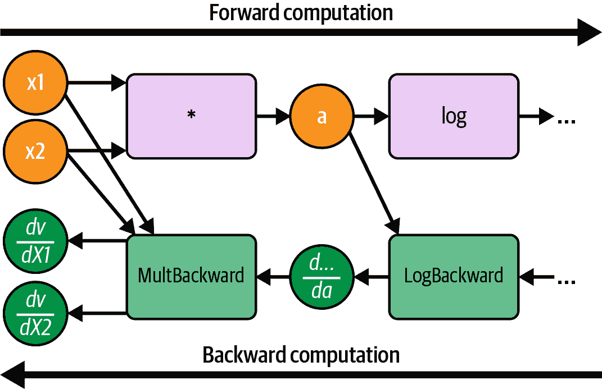

# 第九章：PyTorch 分布式机器学习方法

PyTorch 是由 Facebook 的人工智能研究（FAIR）团队开发的开源机器学习库，后来捐赠给了 Linux 基金会。它旨在简化人工神经网络的创建，并支持计算机视觉、自然语言处理等应用。PyTorch 的主要接口是 Python，但其底层是基于 C 和 C++的代码。这与 Spark 大不相同，Spark 的核心是 Scala 和 Java（基于 JVM 的编程语言）。

在前几章，你已经了解了机器学习工作流的构建模块。我们从 Spark 开始，然后扩展到探索 TensorFlow 的分布式训练能力。在本章中，我们将把注意力转向 PyTorch。我们的目标是帮助你更好地理解 PyTorch 是什么以及其分布式机器学习训练如何工作，从架构和概念的角度，以便你在分布式环境中结合多个框架时能做出更好的决策。

我们还将逐步介绍如何在分布式 PyTorch 中使用之前在第四章和第五章中与 Spark 以及在第七章中与 Petastorm 所做的工作。 

本章涵盖以下内容：

+   PyTorch 基础知识快速概述

+   PyTorch 分布式训练模型的策略

+   如何将 Parquet 数据加载到 PyTorch 中

+   将所有内容整合在一起——从 Petastorm 到 PyTorch 模型

+   与 Petastorm 和分布式 PyTorch 一起工作的故障排除指南

+   PyTorch 与 TensorFlow 的不同之处

###### 注意

如果你是 PyTorch 的新手，我建议你首先阅读像 Joe Papa 的[*PyTorch Pocket Reference*](https://oreil.ly/pytorch-pr)（O’Reilly）这样的入门文本。本章节快速概述了基础知识；重点主要放在分布式训练策略上以及如何将 PyTorch 与 Spark 连接起来。

# PyTorch 基础知识快速概述

在本书中，你学到了很多技术概念，重要的是你要为手头的工具使用正确的术语，并理解各种机器学习框架之间的区别。如果你是 PyTorch 的新手，并希望熟悉其术语，本节适合你。虽然许多命名约定相同，但有些完全不同。本节将突出一些 PyTorch 中的关键术语和概念，从其计算图开始。

## 计算图

像 TensorFlow 和 Spark 一样，PyTorch 使用计算图。示例显示在 Figure 9-1 中；正如你所见，它强调通过神经网络本身的前向计算，同时在训练运行期间支持反向计算梯度。

在这个图中，圆圈（*x1*、*x2*等）表示*张量*，矩形表示数据上的*操作*，如*Log*、*Sin*和**（用于乘法）。图的计算从左下角开始，通过计算*x1* * *x2*——生成张量*a*的操作。在此操作期间，图还保存了未来的反向乘法梯度操作的信息（在图 9-1 中称为*MultBackward*）。此信息稍后将支持损失的反向传播（作为提醒，在神经网络中，算法使用此信息计算图上的增量并改进训练过程）。PyTorch 通过自动求导过程计算相对于输入的梯度，并由自动求导引擎执行计算图。


###### 图 9-1\. 带有反向传递的计算图示例（来自[PyTorch 博客](https://oreil.ly/9WnNf))

图 9-2 展示了计算图的一个子集，重点是仅向前计算。


###### 图 9-2\. 解析向前计算方法

我们对*x1*和*x2*进行乘法运算，得到值*a*。然后我们对该值运行另一个操作（*Log*(*a*)），依此类推。由于这是神经网络的一个子集，我们知道将会有一个反向传播过程来调整权重的值并训练模型。图 9-3 展示了维护反向传播所需的增量值的机制。



###### 图 9-3\. 图支持向前和向后计算

在每次向前迭代中，都有一个计算梯度以供将来向后迭代使用的过程。换句话说，PyTorch 的自动求导引擎在后向计算开始前自动计算梯度。

在 PyTorch 中，与 TensorFlow 不同，计算图是*动态*的，TensorFlow 中计算图是*静态*的。在静态方法中，程序首先构建图，只有在完成后才执行。动态方法中，图是在运行时构建的，执行开始前即使图未完成；程序根据需要动态构建计算图。

## PyTorch 机制与概念

这些是在使用 PyTorch 时应熟悉的基本概念，以理解其神经网络实现及其如何解释计算图：

`torch.Tensor`

PyTorch 张量类似于 TF 张量；它们是包含标量类型（如 `float`、`int` 等）的多维矩阵。类型可以是 NumPy 类型，优化用于 CPU 或 GPU。张量还有一个*步幅*，表示机器在内存中达到下一个连续数组元素所需的步长。想象一下在内存中的矩阵表示；为了到达下一个值，机器需要读取多少位？这就是步幅。张量的步幅取决于其物理表示，由机器的配置（硬件、内存等）决定（例如，GPU 的行为与 CPU 不同）。

`torch.autograd`

自动求导是 PyTorch 内置的自动微分引擎。当你声明张量时，若设置 `requires_grad=True`，它会收集张量上每个操作的输入和输出梯度。之后，PyTorch 引擎在反向传播过程中利用这些信息自动计算梯度。换句话说，autograd 图在前向计算时构建，在反向计算时使用。为了更好地理解，可以看下面的 Python 代码片段，展示了从本地训练到分布式训练的过渡：

```
import torch
import torch.nn as nn
import torch.optim as optim

# set up model 
net = nn.Linear(10, 10) 

# load input and target
input = torch.randn(20, 10) 
tgt = torch.randn(20, 10) 

# forward pass
output = net(input) 

# compute loss using input and target
mselss = nn.MSELoss() 
lss = mselss(output, tgt) 

# backward pass
lss.backward() 
```


首先，我们使用以下数学公式创建线性层：*y* = *x* * *A^T* + *b*。输入 `(10, 10)` 表示该层期望有 10 个输入特征，同时输出 10 个特征。在内部，有两个函数：第一个是乘法器 (*x* * *A^T*)，第二个是偏置函数 (+ *b*)。


接下来，我们生成给定大小为 20×10 的虚拟输入和虚拟标签/目标张量。


现在我们应用线性模型到输入上生成输出。在执行过程中，PyTorch 隐式构建 autograd 图。Autograd 记录函数的输入和输出 (*y*)，用于计算梯度。由于线性模型由两个操作组成，它将记录两个节点：一个用于乘法器，存储操作的输入 (*x*) 和权重 (*A^T*)，另一个用于偏置，存储乘法过程的输出 (*x* * *A^T*) 和偏置。


我们使用 MSE（均方误差）损失函数计算输出与期望目标标签/输出之间的误差。


最后，我们对损失张量调用`backward`，它遍历了在前向传播期间构建的自动求导图，为每个参数计算梯度。之后，模型中的所有`Parameter`实例都将有一个`graph_view`参数，用于存储在反向传播期间计算的梯度。接下来的层可能是优化器；它将引用先前计算的参数，并将梯度应用于它们。此操作将更新参数的值以修正它们并减少损失。（这个概念在 TensorFlow 中也存在，但不是该框架的主要特性，并且需要进行大量调整。）

`AutogradMeta`

这个对象保存了为支持自动求导图中的反向传播生成的元数据。它在 PyTorch 的 C++源代码中定义如下：

```
struct TORCH_API AutogradMeta : public c10::AutogradMetaInterface {
  std`:``:`string name_;

  Variable grad_;
  std::shared_ptr<Node> grad_fn_;
  std::weak_ptr<Node> grad_accumulator_;
  // other fields and methods
  ...
};
```

`AutogradMeta`包含一个名为`grad_fn_`的 C++共享指针实例，用于计算实际梯度。还有一个名为`grad_accumulator_`的 C++弱指针实例，当可用时会累积梯度。

`Variable`

在 PyTorch 中，`Variable`是围绕张量的一个包装器，它封装了额外的信息，例如`AutogradMeta`对象、张量的值和梯度。从计算图的角度看，`Variable`在图中表示为节点。

`torch.layout`

此对象表示张量内存的结构方式，根据张量的要求，可以是密集的或稀疏的。

`torch.mm`

这是一个在两个输入矩阵/张量上执行矩阵乘法的函数。

`torch.utils.data.DataLoader`

PyTorch 中的数据加载器遍历数据集并生成数据批次，以在一台机器上训练模型。在“使用 PyTorch 和 Petastorm 加载数据”中，您将了解 Petastorm 如何与 PyTorch 数据加载器配合使用。

`torch.optim.Optimizer`

PyTorch 的`torch.optim`包实现了多种优化算法。优化器的目标与机器学习中的所有算法相似：降低损失并提高准确性。在神经网络中，这涉及调整节点权重和学习率。每个 PyTorch 优化器都有一个`state_dict`方法，返回一个包含有关优化器状态的`dict`，包括需要优化的参数和模型的超参数。

###### 注意

作为快速提醒，模型参数是从训练数据中自动计算的，而模型超参数是手动设置的，并在计算模型参数的过程中使用。超参数在训练过程中不会更改；参数会随着算法和超参数的影响而改变。

Autograd 收集有关图中操作的信息，在向后计算期间优化神经网络。它不会在前向传递期间立即执行优化，而是在向后传递的损失计算步骤期间同步优化参数（有关详细信息，请参见前面的代码片段）。这是因为在网络通信方面，向后传播更昂贵。

在这一步中，PyTorch 会逐步计算梯度，这为计算参数提供了一个良好的机会，通过这样做，避免了另一次昂贵的通信运行（更多详情请见下一节）。稍后，为了更新参数，我们需要明确调用`optimizer`的`step`。以下代码片段展示了计算损失以及后续运行优化器步骤更新参数的过程：

```
# compute loss function
loss.backward()
# update the training parameters according to the loss function outcome
optimizer.step()
```

根据您使用的优化器类型，您可能需要提供其他输入。

# PyTorch 用于训练模型的分布式策略

PyTorch 的好处在于它能让应用从简单到复杂逐步增长，在你有原型时在一台机器上运行，并根据需要在生产或暂存/开发环境中扩展到多台机器。`torch.distributed`包提供了一组 PyTorch 功能，允许跨多台机器（即分布式数据并行训练）训练机器学习模型。

让我们从一个故事开始。2020 年，FAIR 研究员沈黎决定研究如何加速使用 PyTorch 的数据并行训练。他和他的团队进行了[研究](https://oreil.ly/UjGcR)，以检查多种配置，试验优化器、参数等。这使他们得出一个有趣的结论——在分布式数据并行（DDP）训练领域，没有一种大小适合所有的解决方案：

> 有多种技术可以提高其速度，创建一个复杂的配置空间。根据我们的观察，没有单一的配置适用于所有用例，因为这高度依赖于模型大小、模型结构、网络链接带宽等。

现在您对这个领域有了更好的理解，本节将提供一些指导，您可以用来做出决策，并熟悉不同的 PyTorch 抽象。您将从过程和进程通信的角度了解各种分布式策略，这将增加您的机器学习训练工具包。

## PyTorch 的分布式方法介绍

PyTorch 的分布式基础库是`torch.distributed`，它处理来自硬件和网络视角的分布式通信的所有方面，例如用于 GPU/CPU 的 InfiniBand 互连。在任何分布式系统中，硬件是基础，你应该优化应用程序以匹配硬件。`torch.distributed`允许你做到这一点，无论你正在使用的设置的具体细节如何。

我们可以将`torch.distributed`中的功能分为三个主要组件：

分布式数据并行训练（DDP）

PyTorch 的`DistributedDataParallel`类基于模块级别的`torch.distributed`包实现了分布式数据并行。这两者有什么不同，为什么我们需要同时使用？这是一个很好的问题。简短的答案是，`DistributedDataParallel`仅处理应用本身——即应用级别算法的训练，而`torch.distributed`处理硬件层面。

作为 DDP 的一部分，PyTorch 引入了多个抽象概念，将在下一节中介绍。

基于 RPC 的分布式训练（RPC）

PyTorch 的分布式 RPC 框架（`torch.distributed.rpc`）支持更高级别的训练过程，并提供机制来实现机器之间的远程通信。它支持诸如分布式管道并行、参数服务器范式（类似于 TensorFlow 中讨论的第八章）等功能。它还为模型并行训练提供了分布式自动求导框架。

集体通信（c10d）

该库提供了扩展通信结构并支持在组内跨进程发送张量的额外功能。它提供了集体和点对点通信的 API，如`all_reduce`、`all_gather`、`send`和`isend`。DDP 和 RPC 框架都是在其之上构建的。作为开发者，我们很少与这个库交互，但熟悉这些概念是一种良好的实践。

在决定使用哪种策略并实施后的最后一步，您将通过调用初始化方法来初始化分布式环境：

```
torch.distributed.init_process_group()
```

我们将在接下来的几节中更详细地研究这些方法。

## 分布式数据并行训练

作为 DDP 的一部分，PyTorch 引入了多个抽象概念，将在本节中介绍。我们将从 buckets 开始。

与查看特定神经网络层不同，PyTorch 将通信划分为*桶*。一个桶保存了 `input` 中每个值所属的索引。桶的边界由称为 `boundaries` 的张量实例设置。如图 9-4 所示，桶可以包含多个层或一个层，具体取决于我们如何使用 `torch.bucketize` 来定义它们。桶在架构中是一个关键组成部分，因为它们在反向传播过程中定义了梯度计算的边界。这就是为什么 *bucket1* 位于图 9-4 的底部的原因。


###### 图 9-4\. PyTorch 中的层桶抽象

根据机器的通信策略，桶也可以帮助定义何时启动下一个梯度计算过程。当所有桶完成后，会使用全局归约操作来累积各个桶中的值。PyTorch 引擎以贪婪方式工作，这意味着并非所有层和梯度总能适应同一桶中。这使得分布式桶抽象成为一个随机系统，允许 PyTorch 引擎在运行时决定哪种计算操作更有效，根据已知信息。

###### 小贴士

DDP 在开始时也需要接受一个种子值，用于注入到模型参数中。在分布式设置中，提供种子值非常重要。如果不提供种子值，每台机器将生成自己的种子，这些种子很可能不同于其他机器使用的种子。这将导致模型参数也不同，从而影响覆盖过程。

## 基于 RPC 的分布式训练

远程过程调用（RPC）允许本地机器上的程序启动另一台机器上的程序，只要它们共享相同的地址空间。这就像公寓 A 的居民可以通过提供洗衣机的地址来启动公寓 B 中的洗衣机一样。这就是 RPC 背后的概念。

在 PyTorch 中，RPC 框架允许数据科学家使用远程通信的原语以及更高级别的 API 来训练跨多台机器的模型。有哪些主要用例需要注意？如前所述，PyTorch 的 RPC 框架使以下范例的实现成为可能：

+   *参数服务器*（类似于 TensorFlow），其中一个或多个服务器存储参数，并且分布式训练器与它们通信以获取和更新这些值

+   *模型并行*，允许将无法放在单个 GPU 上的大型模型的不同部分放置在不同的 GPU 上

+   *管道并行*（一种实验性特性），其中每个输入小批量被分割成可以在所有 GPU 上并发执行的微批量

###### 警告

这是一个通用分布式训练的低级框架。在那些不适用于 DDP 的场景中，利用它是有意义的。

框架提供的 API 可以根据它们支持的功能分成四类：

远程执行

您可以远程运行任意函数并获取返回值，或者创建对返回值的引用。这是我们可以从任何 RPC 系统中期待的功能。

远程引用 (RRefs)

RRef 是一个分布式共享指针，用于指向远程工作器上的对象。它允许您访问和引用一个值，而不需要从该对象获取实际数据。由于其结构和实现，它提供自动引用计数，这对于理解远程数据对象被引用的频率非常有用，例如。

分布式自动求导

自动求导引擎在每个参与前向传播的工作器上本地运行；默认情况下，它不具备扩展性。分布式自动求导将其扩展到单台机器的边界之外，将所有机器上的本地自动求导引擎串联在一起，以便可以以分布式方式运行反向传播。

分布式优化器

分布式优化器收集所有参数的 RRef，并在每个参数所在的工作器上创建本地优化器。然后它使用 RPC 在本地执行优化器。根据所使用的优化器，它周期性地在工作器之间对结果进行平均。

让我们深入探讨每一个问题，这样您就能更好地理解它们在代码和执行图中的表现。

### 远程执行

PyTorch 的远程执行 API 允许我们远程运行用户函数。我们需要做的第一件事是通过调用 `init_rpc` 函数来启动 RPC。此函数需要三个参数：机器的名称、其在组内的全局唯一 ID/等级，以及一个代表组中工作器数量的整数 (`world_size`)。请看下面的代码片段：

```
init_rpc("w0", rank=0, world_size=32)
```

`init_rpc` 函数在这里有两个作用。首先，它启动一个在后台运行的代理。当代理准备就绪时，它可以开始接收并处理来自其他对等节点的请求。其次，它启动了 rendezvous¹ 通信，与对等节点建立连接。在此阶段结束时，代理已经知道正在运行的所有 RPC 进程，而此 RPC 组中的所有对等节点也互相知晓。

注意这里没有客户端/服务器架构；所有通信都是点对点的（我们将在“PyTorch 中的点对点通信”中详细讨论这是如何工作的）。默认后端利用了 TensorPipe 库，该库提供了一种特别设计用于机器学习的张量感知点对点通信原语。要更改这一点，您可以提供一个专用的`BackendType`函数；这允许您更改配置的某些元素，例如对等方回复的超时和使用的`init_method`。在本例中（机器的名称），`w0`代表 worker zero。从现在开始，我们将使用`w0`、`w1`、`w2`、`w3`等表示 worker 0、worker 1、worker 2、worker 3 等等。

现在机器准备就绪，我们可以开始向组内的对等体发送远程函数调用，如图 9-5 所示。为此，应该有一个张量和我们想要执行的远程操作，以及操作所需的其余参数。


###### 图 9-5\. PyTorch 远程执行图示

在讨论通信时，重要的是要区分两个关键概念：

+   *通信拓扑*，指示机器在组中的组织方式以及谁与谁通信（例如点对点或客户端/服务器）

+   *通信类型*，定义了机器之间如何通信

PyTorch 使我们能够选择每个操作之间所需的精确通信类型。您可以从三个选项中选择：`rpc_sync`、`rpc_async`和`remote`。以下代码片段演示了这三种用法：

```
# initialize RPC and a torch
rpc.init_rpc("w0", rank=0, world_size=32)
x = torch.zeros(32) 

# synchronous – returns the result
ret = rpc_sync("w1", torch.add, args=(x,1) 

# asynchronous, returns future
fut = rpc_async("w1", torch.add, args=(x,1)) 

# asynchronous, returns reference to result
@torch.jit.script 
def script_add(x,y):
    return x+y

rref = remote("w1", script_add, args=(x,1)) 
```


我们初始化了一个大小为 32 且值为零的 torch 张量。目标是模拟一个张量。


当我们需要等待返回值再继续时，我们使用同步 API。使用`rpc_sync`，我们在通信建立、操作执行并返回值之前无法进行下一步。这是一个*阻塞函数*；²它会阻塞程序，直到调用者收到响应为止。`rpc_sync`的第一个输入参数是要连接的进程名称；第二个是我们想要在目标进程上运行的操作。在这种情况下，我们使用已经实现的 PyTorch 函数`torch.add`。第三个参数`args`是我们希望提供给`torch.add`函数的输入参数列表。该函数返回更新后的张量。


当我们想要在目标进程上运行操作但不需要立即获取结果时，我们使用异步 API。这里的 `rpc_async` 调用类似于前面的 `rpc_sync` 调用（它接受相同的参数），但在这种情况下，该函数不会阻塞程序继续执行下一个命令。异步调用返回一个 *future* —— 一个作为结果代理的对象，因为其计算尚未完成，当前时间结果未知。要在需要结果时检索结果，我们需要调用 `fut.wait` 并将其保存到变量中。`wait` 是一个阻塞函数，它将阻塞程序，直到结果返回。这种功能使我们能够并行执行多个未来操作。例如，如果我们希望在同一工作器上执行 `add` 和 `max` 操作，我们可以同时运行它们，然后对两个 torch 向量使用 `+` 运算符进行求和：

```
fut_add = rpc.rpc_async("w1", torch.add, args=(x, 3))
fut_max = rpc.rpc_async("w1", torch.max, args=(x))
result = fut_add.wait() + fut_max.wait()
```

这使得对操作进行并发控制成为可能。


`remote` 函数（第三个 API）并不获取值；它的目的是远程执行一个创建某物的函数。它接受要运行函数的进程名称、要运行的函数，以及必要时的 `args` 或 `kwargs`。您还可以提供一个可选的 `timeout` 参数。在这个示例中，我们运行一个 TorchScript 函数 `script_add` 的注释版本。TorchScript 允许我们在本地编译程序，稍后在一个没有 Python 依赖的进程中加载它。我们可以利用这个功能来执行远程函数。`@torch.jit.script` 是定义它的 Python 注释；每当我们使用这个注释时，Python 解释器与 PyTorch 一起检查源代码，并将其转换为 TorchScript。`remote` 函数是异步的，这意味着程序不会被阻塞。然而，`remote` 和 `rpc_async` API 的主要区别在于，`remote` API 返回一个远程引用，指向另一台机器上的值（RRefs 在下一节中讨论）。返回值存在于目标进程中，并不会被传回触发它的原始进程。总结这个例子，`script_add` 函数与参数 `x`（torch）和 `1` 一起发送到 `w1`。

###### 提示

您还可以在训练后使用 TorchScript 方法。假设我们在 Python 环境中使用 PyTorch 训练了一个模型。现在，我们希望将训练好的模型导出到一个环境中，由于 Python 语言在多线程世界中的性能较低，使用 Python 程序不利。TorchScript 创建了一个独立的 C++ 程序，可以在没有 Python 环境的不同进程/机器上运行。

你如何在三种可用的远程执行选项之间进行选择？就与所有与机器学习和构建分布式执行图有关的事物一样，答案是：要看情况。这里的指导是要分解网络层并考虑每个功能的功能。某个操作是否需要等待另一个操作完成？它们是否彼此依赖？如果是这样，`rpc_sync`在这里将是一个不错的选择。我们是否可以并行一些操作，使它们同时进行？我们是否可以在所有信息可用之前继续训练？在这种情况下，我们可以使用`rpc_async`。我们是否想在远程服务器上执行一个函数而不返回值？例如，当我们有一个带有参数服务器和训练器的拓扑结构时，我们可以在 PS 上创建参数表，而不需要将表取回，因为运行主程序时不需要它。在这种情况下，`remote`函数是最佳选择。

### 远程引用

在分布式系统中的训练过程中，通常会有一个驱动节点来驱动训练循环的执行，以及在数据上操作的工作节点。因此，在某些情况下，我们可能需要创建远程引用，例如用于用户定义的函数。在这种场景中，UDF 在驱动程序上定义并被传输到工作节点，每个节点并行操作其数据块，而不将结果发送回驱动程序。工作节点保持结果，而驱动程序只持有对它们的引用。这类似于计算机科学中分布式共享指针的概念，其中指针存储数据存储的地址，但不存储实际数据本身。具有引用副本（称为*用户*）的任何机器都可以从其创建者（*所有者*）请求对象。

#### 使用 RRefs 来编排分布式算法

在前一节介绍的`remote`函数在指定的工作节点上创建了一个 RRef。该函数通过协调工作进程上的操作和可调用函数来支持 PyTorch 分布式算法。让我们看以下代码片段和图 9-6，以更好地理解其工作原理：

```
@torch.jit.script
def some_add(rref_x, rref_y)
    return rref_x.to_here() + rref_y.to_here()

# these functions run on worker process "w0"
ra = remote("w1", load_data_a)
rb = remote("w2", load_data_b)
rc = remote("w3", some_add, args=(ra,rb))
rd = remote("w4", *{some function that takes rc as input}*)
```


###### 图 9-6\. 简单加法函数的远程编排，为许多分布式训练算法提供支持

该代码片段在`w0`上运行，并在`w1`、`w2`、`w3`和`w4`（图 9-6 的操作 1）创建了四个远程引用。对`w1`和`w2`的`remote`调用要求它们分别加载数据的不同分块并返回指向该数据的 RRefs。`w1`加载数据块`a`，而`w2`加载数据块`b`。在图 9-6 中，init 是动作编号 1。

`w3`被分配了使用`some_add`函数添加两个数据块的功能，该函数以两个`RRef`对象作为输入并对它们调用`to_here`。这个调用开始获取数据，因此从`w1`和`w2`获取结果到`w3`。`w3`在本地添加结果并将结果的一个 RRef 返回给`w0`（在 Figure 9-6 中的操作 2）。`w4`现在可以使用`w3`的结果执行一些额外的功能（在 Figure 9-6 中的操作 3）。

请注意，由于程序的主入口在工作进程 0 上运行，所有通信都通过它进行。然而，这种通信相对轻量级，因为它仅包含远程引用本身的控制消息。从`w1`和`w2`获取数据的调用仅在`w3`上执行。在这里，远程引用帮助我们实现了两个目标：

1.  代码留在我们的驱动器`w0`上的一个进程中，它充当主编排器。

1.  避免将数据从工作进程传输到编排器，以避免这一费用。（在 Spark 中，这是我们在处理无法容纳在一台机器内存中的可伸缩数据时要尽力避免使用的`collect`函数。）

编排器是使用 RRefs 的一个重要方面；另一个是通过引用标识对象的能力。

#### 通过引用标识对象

正如前面的例子所示，PyTorch 的远程引用也旨在在分布式环境中唯一标识对象，并且可以将其作为 RPC 参数传递，避免传输真实数据。当`w0`调用`remote`函数时，在本地创建一个`UserRRef`对象。`w0`可以将此对象作为参数发送给其他工作进程，并通过这样做使它们能够获取结果或传递引用。同时，对`remote`的调用在命名的工作进程上创建了一个`OwnerRRef`对象实例，其中包含执行函数的实际结果。简而言之，`w0`创建了由`w1`和`w2`拥有的`UserRRef`并将它们发送给了`w3`。

用户机器可以在三种情况下获取一个`UserRRef`：

1.  它可以从所有者那里接收一个`UserRRef`。

1.  它可以从另一个用户那里接收一个`UserRRef`。

1.  它可以创建一个由另一个工作进程拥有的新`UserRRef`。

所有者跟踪引用计数，以便在垃圾回收操作中更好地评估何时可以删除数据本身。我们不会深入探讨这一点，但如果您想了解更多，请查看 GitHub 上的[RRef 设计说明](https://oreil.ly/uYzCh)。

关于 RRef 的关键是，它们允许数据科学家设计更复杂的分布式机器学习算法，这些算法在 PyTorch 中并没有直接实现。这一功能通常由推动机器学习算法创新的研究人员使用。在深入研究 PyTorch 和分布式机器学习以及故障排除时，理解这一点非常重要。

### 分布式自动求导

在本章的早些时候，您已经了解了 PyTorch 自动求导引擎在本地工作的一瞥。现在，我们准备升级并探索其在分布式数据集上的工作方式。在分布式环境中，模型在多台机器上复制，每台机器处理数据集的一部分。这意味着每台机器将根据其输入计算自己的梯度值。尽管操作是相同的，但输入在这里起到了重要作用。

PyTorch 基于 RPC 的分布式自动求导框架利用远程执行和远程引用来在训练期间收集和计算梯度，之前已经讨论过。为了分布式目的，自动求导引擎使用函数/操作上下文进行扩展，这种方法类似于之前在第八章中讨论的 TensorFlow 方法。指向上下文的共享指针具有全局唯一标识符，并分发给参与训练的每个节点。潜在地，每个工作节点都可以检索上下文信息（`send` 和 `recv` 函数、梯度等）。

此外，每次 RPC 调用都会将不同机器上的自动求导函数连接起来，这使得我们能够在分布式系统中跟踪梯度的变化。分布式自动求导的目标是提供类似于在本地机器上运行反向传播的体验。这意味着对于每次前向传播，机器还会存储`send`和`recv`信息（分别标识发送机器和接收机器）。这确保了在分布式自动求导图中始终有节点的参考，并推动了反向传播的执行。

下面的代码片段启动了一个分布式自动求导上下文：

```
import torch.distributed.autograd
with autograd.context() as ctx:
    # some functionality within the context
```

所有调用开始前向和后向传播的分布式优化器都应在此上下文中调用。

### 分布式优化器

到目前为止，我们已经看到了各种框架中使用的优化器：Spark、TensorFlow 和 PyTorch。为什么我们需要一个分布式优化器来处理 PyTorch？在分布式训练中，模型参数分散在多台机器上，我们需要优化所有这些参数。如果没有分布式优化器，数据并行训练将要求每台机器从所有其他机器收集参数，然后运行本地优化器。这会在通信（多对多或*n*：*n*通信）和计算方面产生大量开销，因为每台机器都需要运行优化函数。同时，这也会导致瓶颈和在某些机器上运行优化时错过消息或无法收集所有数据的风险。

PyTorch 通过实现一个名为`Distributed​Optimizer`的薄包装器来解决这些问题。该包装器仅接收这些参数的远程引用而不是收集所有参数。在优化函数初始化期间，它会联系这些参数的所有者并在这些机器上本地运行优化。采用这种方法仍然存在多对多通信，但它非常轻量级，因为数据无需传输；它只是一个调用，用于收集、计算和优化参数。稍后，在自动求导上下文中运行`step`函数时，此函数将联系所有参与的优化器在本地执行`step`。

以下代码片段展示了如何使用分布式优化器：

```
# within the autograd distributed context
dist_optim = DistributedOptimizer(
    optim.SGD, 
    [rref1, rref2], 
    lr=0.05
)
```

如果你决定开发自己的分布式训练算法，请注意`torch.distributed`中支持的优化器。请注意，并非所有功能都受支持，可能需要自己实现某些功能。

TorchServe，一个用于提供 PyTorch 模型的流行工具，还支持 gRPC（Google 的高性能 RPC 框架）作为通信协议。但与 gRPC 相反，PyTorch 的 RPC 实现能理解张量对象。如果你尝试将 PyTorch 训练算法与 gRPC 连接起来，第三方库将期望 JSON、字符串或另一种用户定义的数据类型来处理张量。这将迫使你处理已在 PyTorch RPC 库中实现并优化的序列化工作。虽然这可以成功实现，并且已经成功实现过，但这会增加更多的工作量——我们都希望能让工作更轻松，而不是更难，对吧？

## PyTorch 中的通信拓扑结构（c10d）

PyTorch 支持两种通信方式：集体通信和点对点（也称为点对点）通信。这两种 API 都可以定义和调整拓扑结构。在底层，DDP 使用集体通信，而 RPC 使用点对点通信。两者都支持同步和异步操作。

###### 注意

端到端和集体通信 API 是使用 C++在`torch.distributed.distributed_c10d`库中实现的，出于性能考虑。与 RPC API 类似，这些是低级 API，如果您正在尝试排查现有应用程序或构建自己的分布式算法，那么您应该了解这些 API。

### PyTorch 中的集体通信

在计算机科学中，*集体通信*被定义为涉及一组进程/机器的任何通信。最常用的操作包括*广播*、*屏障同步*、*减少*、*聚集*、*分散*、*全对全完整交换*和*扫描*。PyTorch 的 c10d 库提供了多种集体通信的 API，包括`all_reduce`和`all_gather`，以及端到端通信 API（在以下部分讨论）。它支持在组内的机器之间发送张量，这是许多算法所需的操作。例如，`reduce`是至关重要的；它将所有进程中的目标张量减少为单个张量，并将结果返回给所有进程。

图 9-7 展示了如何保存参数及其梯度（如“分布式自动求导”中讨论的），并使用全归约操作在进程之间交换信息。请注意，每个进程中的参数被分割成桶，如 DDP 部分所述。全归约操作按桶索引顺序运行，以维护执行顺序，这有助于避免跨进程和机器之间出现不一致的结果。


###### 图 9-7\. PyTorch 中的全归约操作

`all_reduce`函数收集所有张量并启动一个将它们减少为单个结果张量的操作。完成后，它将结果返回给各个进程/机器。在 PyTorch 中，`all_reduce`被实现为支持张量的操作。在幕后，它支持使用三种内置后端协议（Gloo、MPI 和 NCCL）进行分布式 CPU 和/或 GPU 训练。请注意，并非所有后端协议都支持所有硬件处理器，这意味着并非所有操作都支持 CUDA。

`all_gather`也是如此，尽管这是一个更昂贵的函数。其使用示例是用于评估张量的大小：PyTorch 引擎将收集所有张量的大小，并基于最大的大小定义一个默认大小。您可以在 c10d 库中找到此函数的多种用途。

集体通信如何影响我们的开发？当我们开始使用 PyTorch 编写分布式应用程序时，我们的第一个任务是定义环境、启动工作进程并开始进程。在初始化过程中，我们需要指定后端通信协议。在群集机器的设置工作中，应与系统管理员一起完成或使用协调工具，以避免错误。

集体通信适用于组中的所有进程（集群中进程的子集）。因此，我们首先需要启动一个组。这是我们如何做到的：

```
dist.init_process_group(*backend*, init_method='tcp://10.0.0.20:23456',
                        world_size=4, rank=args.rank)
```

`init_process_group`的第一个参数是后端类型：`mpi`、`gloo`或`nccl`之一。其他参数是可选的；它们包括`init_method`，它指定如何启动进程组（通常是指向共享文件系统上脚本的 URL）；`world_size`，即组中的进程/机器数；以及`rank`，即当前正在运行的进程的等级（0 到`world_size - 1`之间的数字）。

PyTorch 的贡献者提供了一些[指导](https://oreil.ly/EkdQ0)，关于我们应该根据硬件使用哪种后端：

+   经验法则

    +   使用 NCCL 后端进行分布式 GPU 训练。

    +   使用 Gloo 后端进行分布式 CPU 训练。

+   使用 InfiniBand 互连的 GPU 主机。

    +   使用 NCCL，因为它是当前唯一支持 InfiniBand 和 GPUDirect 的后端。

+   使用以太网互连的 GPU 主机。

    +   使用 NCCL，因为它目前为分布式 GPU 训练提供了最佳性能，特别是对于多进程单节点或多节点分布式训练。如果使用 NCCL 遇到任何问题，请使用 Gloo 作为备选选项。（请注意，目前 Gloo 在 GPU 上的运行速度比 NCCL 慢。）

+   使用 InfiniBand 互连的 CPU 主机

    +   如果您的 InfiniBand 启用了 IP over IB，请使用 Gloo，否则请改用 MPI。

+   使用以太网互连的 CPU 主机。

    +   使用 Gloo，除非您有特定原因使用 MPI。

利用这些指导，并咨询您的系统管理员，确定最佳的后端用于工作。

一旦您初始化了进程组，就可以连接并启动集群本身。从主函数开始，我们可以启动一个迭代过程，遍历所有机器并在每台机器上初始化进程。让我们看一下以下模板代码（来自[文档](https://oreil.ly/l4Ia4)），以更好地理解如何开始：

```
"""run.py:"""
*`#!/usr/bin/env python`*
import os
import torch
import torch.distributed as dist
import torch.multiprocessing as mp

def run(rank, size):
    """ Distributed function to be implemented later. """
    pass

def init_process(rank, size, fn, backend='gloo'):
    """ Initialize the distributed environment. """
    os.environ['MASTER_ADDR'] = '127.0.0.1'
    os.environ['MASTER_PORT'] = '29500'
    dist.init_process_group(backend, rank=rank, world_size=size)
    fn(rank, size)

if __name__ == "__main__":
    size = 2
    processes = []
    mp.set_start_method("spawn")
    for rank in range(size):
        p = mp.Process(target=init_process, args=(rank, size, run))
        p.start()
        processes.append(p)

    for p in processes:
        p.join()
```

如您在此处所见，有一个具有定义`size`的主函数，它是我们要初始化的机器/进程上的机器数。主函数中的`for`循环遍历指定的`rank`值范围，从 0 开始，以`rank - 1`结束。请回想一下，这里的`rank`指的是我们在其上启动进程的机器的编号，这也是其在系统中的 ID。在循环内部，我们调用`mp.Process`，它返回一个名为`p`的进程实例，然后是`p.start`和`processes.append(p)`。`mp`是 PyTorch 中可用的多进程功能。在所有机器上的迭代过程中，它在每台机器上启动进程，目标函数是`init_process`。这是一个非阻塞操作，仅定义进程本身。稍后，`start`函数启动它。脚本还将这些进程保存在一个数组中，我们可以访问该数组以进行进一步的计算和对集群的操作。

在 `init_process` 中，脚本定义了环境及其所属的组。该进程了解世界大小、其秩以及应用于通信的后端。它还接收了 `run` 函数（在函数签名中，这是 `fn` 参数）。此函数实现了此进程需要运行的内容。

下面是来自文档的所有减少 `run` 函数的示例：

```
""" All-Reduce example."""
def run(rank, size):
    """ Simple collective communication. """
    group = dist.new_group([0, 1])
    tensor = torch.ones(1)
    dist.all_reduce(tensor, op=dist.ReduceOp.SUM, group=group)
    print('Rank ', rank, ' has data ', tensor[0])
```

此代码为所有减少分布操作创建一个新组，该组包含成员列表 `[0,1]`。这意味着进程 0 和 1 现在是将运行此操作的组的一部分。它还定义了一个大小为 1 的张量，其值为 1。这是模板目的上的模拟张量；您应该使用要在其上运行减少操作的真实张量。最后，它调用 `dist.all_reduce`，传递张量、要运行的减少操作（在模板的情况下为 `SUM`）和将参与其中的组。PyTorch 提供以下操作的开箱即用功能：⁴

```
dist.ReduceOp.SUM
dist.ReduceOp.PRODUCT # stored API in the configuration
dist.ReduceOp.MAX
dist.ReduceOp.MIN
dist.ReduceOp.BAND # Bitwise AND 
dist.ReduceOp.BOR  # Bitwise OR
dist.ReduceOp.BXOR # Bitwise XOR
```

PyTorch 提供以下集体通信 API：

`scatter`

将张量列表在根秩级别（默认情况下为秩 0）分发到组中的所有秩/进程，如图 9-8 所示。⁵ 在此示例中，在执行 `scatter` 之前，秩 0 具有张量列表 `[t0, t1, t2, t3]`；执行此函数后，秩 0 具有 `t0`，秩 1 具有 `t1`，依此类推。


###### 图 9-8\. 分散功能

`gather`

与 `scatter` 相反，此功能从组中收集张量并将它们存储在秩为 0 的位置。秩 1 传递 `t1`，秩 2 传递 `t2`，依此类推，如图 9-9 所示。


###### 图 9-9\. 聚集功能

`reduce`

此功能类似于 `gather`，但会将张量附加到最终的张量中，最终得到代表已收集张量的一个张量。在本例中，秩 0 最终将得到 `T=t0+t1+t2+t3`，如图 9-10 所示。


###### 图 9-10\. 减少功能

`all_reduce`

使用 `all_reduce` 函数，组中的每个进程与其余组中的所有进程共享信息，并收集信息，如图 9-11 所示。这类似于 `reduce`，但所有机器参与发送和接收，在过程结束时，所有机器将具有相同的张量。如前所述，如果网络通信中出现任何故障，这可能导致错误。


###### 图 9-11\. 全部减少功能

`all_gather`

这与 `all_reduce` 类似，只是这里的进程都在向整个组发送和接收张量，而不对接收到的张量进行操作。相反，接收到的张量保存在一个数组中，如 图 9-12 所示。顾名思义，所有进程执行 gather 功能。


###### 图 9-12\. All-gather 功能

`broadcast`

`broadcast` 函数将一个张量复制到多台机器上，如 图 9-13 所示。当你有适合内存的信息并且所有等级都需要使用时，这非常有用。


###### 图 9-13\. 广播功能

现在你对 PyTorch 提供的集体通信 API 有了更好的理解，是时候转向另一种通信类型，即点对点通信。

### PyTorch 中的点对点通信

PyTorch 提供了四种用于点对点（P2P）通信的 API，也称为点到点通信。这些包括在 “分布式自动微分” 中提到的 `send` 和 `recv` 函数，用于同步通信，以及用于异步发送和接收张量数据的类似函数：`isend` 和 `irecv`。

我们可以使用在前一节中展示的相同模板代码来分发张量并初始化集群；唯一变化的是 `run` 函数。以下代码片段展示了如何使用 `torch.distributed` 中可用的 P2P API 实现 `run` 的简化示例：

```
def run(rank, size):
    tensor = torch.zeros(32)
    if rank == 0:
        tensor += 1
        *`# Send the tensor to process 1`*
        dist.send(tensor=tensor, dst=1)
    else:
        *`# Receive tensor from process 0`*
        dist.recv(tensor=tensor, src=0)
    print('Rank ', rank, ' has data ', tensor[0])
```

这是经典的阻塞式 P2P 通信示例。在 `run` 函数中，我们有一个大小为 32 的张量，值为零（充当模拟张量）。`if` 语句检查当前进程的等级。如果它是等级 0，我们会更新张量并将其发送到等级 1，正如 `send` 函数中的 `dst=1` 参数指定的那样。

如果等级不是 0，如 `else` 子句中所定义的那样，进程将使用 `dist.recv` 函数接收张量。此处仅使用 `print` 函数提供信息，用于调试和故障排除过程中的问题。对于实际应用程序，最好利用 Python 的日志记录机制；这样可以通过严重性级别（调试、信息、错误等）对日志消息进行分类，并稍后按严重性级别搜索问题。

要实现非阻塞（异步）P2P 通信，我们只需在 `run` 函数定义中用 `dist.isend` 和 `dist.irecv` 替换 `dist.send` 和 `dist.recv` 函数。使用异步通信时，需要调用从操作中接收到的请求对象的 `wait` 方法来等待执行完成，然后再进行下一个操作。如果没有依赖操作，仍需在 `run` 函数结束前调用 `wait`。

图 9-14 展示了点对点通信，其中 rank 0 向 rank 3 发送信息。


###### 图 9-14\. rank 0 和 rank 3 之间的点对点通信

此处异步和同步通信的讨论可能会让您想起 RPC 协议，原因是 PyTorch 的 RPC 框架建立在点对点通信 API 之上，充当 `remote` 函数的启用器。如 “Remote execution” 中所述，此函数在指定的工作进程上使用后台线程运行用户函数。它不是通过网络返回数据，而是返回一个作为指针的轻量引用。

## 我们能用 PyTorch 的低级 API 做什么？

研究、优化和故障排除！在处理分布式系统的低级 API 时，通常需要对系统本身有深刻理解，但在现实世界的高级 API 故障排除中可能会很有帮助。让我们看一个例子。2021 年，Chaoyang He 等人决定构建一个自动化弹性管道，作为分布式训练的一部分，他们创建了 [PipeTransformer](https://oreil.ly/MEJfx)，如 图 9-15 所示。在训练阶段，管道根据参数数量进行转换。请记住，在神经网络中，每个网络层的参数数量都可能会改变。因此，在开始时可能有数十亿个参数，随着训练的进行，参数数量也会相应变化。您可以看到，管道 0 在时间步骤 0 使用的机器和核心比时间步骤 1 更多。


###### 图 9-15\. PipeTransformer 训练系统概述图

在这里，研究人员特别使用了冻结算法，该算法能够在训练过程中逐渐识别和冻结某些层，这有助于参数的收敛并提供更多训练控制。冻结算法通知 AutoPipe 模块有关参数数量、梯度等的变化。AutoPipe 再通知 AutoDP 有关管道长度的信息，通知 AutoCache 冻结层的情况，并在管道本身上调用 `transform` 来执行它。PyTorch 的低级 API 结合专用硬件和高级 API，使团队能够构建此系统并测试他们的研究成果。

# 使用 PyTorch 和 Petastorm 加载数据

在第七章中，我们讨论了从 Spark 到 PyTorch 的桥接。如你所知，对于大多数机器学习工作流所需的数据转换，软件是在 Spark 框架下开发并保存为 Parquet 文件的，但 PyTorch 并没有为 Parquet 格式提供开箱即用的数据加载器，因此如果需要使用 PyTorch API，你需要引入专门的工具来加载这些数据。本书侧重于利用 Uber 的开源项目 Petastorm 来实现这一目的，但你应该对其他工具保持开放态度，并关注市场上的新进展。

作为数据科学家，在 PyTorch 中加载数据时，通常会使用`DataLoader`与`Dataset`类。但是，使用 Petastorm，你可以完全避免它们，并改用 Petastorm 转换器库。第一步是创建转换器本身——这就是使你能够使用`converter_train.make_torch_dataloader`将 Spark DataFrame 转换为 PyTorch 数据加载器的功能。该函数将生成所需的`DataLoader`，以便你可以继续使用 PyTorch 分布式 API 进行工作。

让我们看一些代码，以更好地理解 API。与 TensorFlow 一样，首先要做的是为训练数据集和评估数据集创建转换器：

```
# Set a cache directory on DBFS FUSE for intermediate data
spark.conf.set(SparkDatasetConverter.PARENT_CACHE_DIR_URL_CONF,tmp_path)

# TIP: Use a low value for parquet_row_group_bytes. The default of 32 MiB 
# can be too high for larger datasets. Use 1 MB instead.
# train
converter_train = make_spark_converter(df_train, 
                                       parquet_row_group_size_bytes=32000000)
# test
converter_test = make_spark_converter(df_test, 
                                      parquet_row_group_size_bytes=32000000)
```

`make_spark_converter`函数是一个通用函数，因此与我们用于 TensorFlow 的函数相同。一旦 Petastorm 转换器准备好，我们就可以利用它来转换为我们希望使用的加载机制。

正如你在下面的代码片段中所见，我们使用`converter_train.make_torch_dataloader`函数创建了一个 PyTorch 数据加载器。我们传递了一个`trans⁠form_​spec_fn`，该函数详细说明了如何处理数据。这个函数提供了在训练模型本身之前预处理数据的另一个机会；例如，可以在这里调整图像的大小：

```
with converter_train.make_torch_dataloader(
        transform_spec=transform_spec_fn) as loader:
    model = train(loader)

with converter_test.make_torch_dataloader(
        transform_spec=transform_spec_fn,num_epochs=1) as loader:
    accuracy = test(model, loader)
    return accuracy
```

`make_torch_dataloader`函数创建一个`TorchDatasetContextManager`，用于管理 Petastorm 阅读器的创建和终止。在内部，`TorchDatasetContextManager`利用`make_batch_reader`函数来创建阅读器。你可以向该函数提供`petastorm_reader_kwargs`参数，Petastorm 将其传递给`make_batch_reader`。

总结其行为，它做了两件事：

1.  使用`make_batch_reader`函数在 Parquet 文件目录 URL 上打开 Petastorm 阅读器

1.  基于此阅读器创建 PyTorch `DataLoader`

Petastorm 中的`DataLoader`是`torch.utils.data.DataLoader`的数据加载器适配器，使用 PyTorch 的汇集功能来合并批次中的数据。默认情况下，它使用`default_collate`，该函数检查`Dataset`返回的数据类型并尝试组合它们。

读者还可以*洗牌*队列。这会使每次迭代中完全随机地向队列中添加来自不同文件的实例，从而完全随机化批处理数据。如果您希望使用此功能，请在调用`make_torch_dataloader`时使用`shuffling_queue_capacity`参数，并传递您希望具有的队列大小。请注意，默认情况下此参数设置为`0`，此时不进行洗牌。如果您的数据已排序，洗牌队列是一个很棒的功能，因为对于排序数据集，算法可能会对遇到的第一批数据产生偏见（当然这取决于算法和数据的统计行为）。

整个操作会分批迭代并从读者返回项目。它还会将多个 Spark 类型提升和清理为 PyTorch 友好的类型⁶，如表 9-1 所详述。

表 9-1\. 提升为 PyTorch 类型的 Spark 类型

| 需要提升的 Spark 类型 | Petastorm 提升为的 PyTorch 类型 |
| --- | --- |
| `int8`，`uint16` | `int32` |
| `uint32` | `int64` |
| `布尔值` | `uint8` |
| `时间戳` | `float32`，通过 Petastorm 的`decimal.Decimal`类型^(a) |
| ^(a) 这里有两个数据类型转换阶段：首先将 Spark 的`时间戳`值转换为 Petastorm 的`decimal.Decimal`类型，然后将这些值转换为`float32`。 |

有哪些限制？好问题。NumPy 字符串、字符串数组、对象数组和对象类不受支持。`None`呢？PyTorch 不支持可空字段，这意味着作为过滤过程的一部分，我们必须过滤掉或为任何值为`None`的特征提供默认值。

在处理不支持的数据类型时，大多数冲突导致以下异常：`PyTorch 不支持字符串数组或对象类`。如果遇到此异常，请注意，Petastorm 无法在这里填补空白的原因是因为 PyTorch 本身也不支持此数据类型。因此，在设计流程时要慎重考虑。要解决这个问题，您需要更改数据的设计或使用解决方法。一个不错的选择是使用`transform_spec=transform_spec_fn`来处理数据，正如第八章末尾所讨论的那样。

当我们准备好 PyTorch 的`DataLoader`之后，下一步是将其用于训练、验证和测试。

###### 提示

`DataLoader` 构造函数接受一个参数，用于定义要用于加载数据的工作线程数。然而，在其实现中存在一个问题。在幕后，Petastorm 的 PyTorch DataLoader 实现使用 `mp.spawn`，它会将模型和参数进行序列化并保存到磁盘。如果沿途有任何翻译问题，这将导致程序崩溃，因此您需要避免使用它。这也可能会显著减慢处理过程并创建瓶颈。

# Petastorm 和分布式 PyTorch 的故障排除指南

在使用多个计算引擎时可能会遇到各种挑战，由于上一节提到的类型不匹配和错误等。我们将在这里看到一些例子，首先是类型不匹配的问题。

## 数据类型不匹配的谜题

在处理数据时，类型是一个巨大的谜团。为什么每个平台都决定引入和支持自己的类型？我想我们永远也无法解决这个问题！

除了存在的问题，如果您记得，在第二章中的表 2-1 展示了 Spark 中的数据类型如何映射到 Python 中的数据类型。自从第二章以来，我们的数据经历了多次迭代和格式化。稍作反思我们示例中的数据流动情况，您会发现这段旅程令人着迷，途中进行了许多类型更改：

+   文件 → Spark 转换 → Spark 处理 → 保存为 Parquet → Petastorm → PyTorch

对于您和您的团队来说，通过使用审核机制来跟踪数据版本和更改是一个好的实践。可以记录文件格式和编码（如 UTF-8、UTF-18 等）的详细信息，以及生成和保存它的库。跟踪所有这些信息可以为您提供一切您需要的全面和系统化的故障排除过程。

例如，在使用普通的 Python 列表（或任何 Spark 数组格式，在 PySpark 中转换为普通的 Python 列表）和 Petastorm 进行工作时存在已知的挑战。虽然写入可以使用数组，但在 PyTorch 中加载数据时通常会因为模式不匹配而失败。一种解决方法是采用 RDD 方法，摆脱 Spark DataFrame 的抽象。这样做可以确保您使用符合 Petastorm 和后续 PyTorch 的数据类型。

下面的代码示例演示了如何强制 Petastorm 将数据转换为特定的模式。如果你还记得表 9-1 后面的讨论，PyTorch 不支持字符串或对象类的数组。然而，你经常需要处理数组或列表。为了解决这个问题，你可以通过提供一个`Unischema`定义来将列表/数组转换为支持的类型，例如将数组转换为`np.array`，然后再将其转换为 PyTorch 张量：

```
Schema = Unischema('Schema', [UnischemaField('id', np.string_, (1, None), 
                                             NdarrayCodec(), False),])

def row_to_dict(schema, row):
    def type_check(k,v):
        if isinstance(v, list):
            return np.array([v], dtype=schema._fields[k].numpy_dtype)
        else:
            return v
    return {k:type_check(k,v) for (k,v) in row.asDict().items()}

def generate_dataset(output_url='*{path_to_petastorm_data}*/petastorm/'):

    with materialize_dataset(spark, output_url, Schema):
        rows_rdd = df.rdd.map(lambda x: row_to_dict(Schema, x))
                         .map(lambda x: dict_to_spark_row(Schema, x))
        spark.createDataFrame(rows_rdd, Schema.as_spark_schema()) 
                         .write 
                         .mode('overwrite')
                         .parquet(output_url)

generate_dataset()
```

在这段代码中，我们首先定义了所需的模式：一个名为`id`的字段，类型为`Ndarray​Co⁠dec`。接下来，我们创建了一个`row_to_dict`函数，它对定义的模式进行类型检查。如果是列表/数组的实例，它将强制执行类型和 NumPy 值。它遍历 Spark DataFrame 中的每一行，通过调用`_fields[k].numpy_dtype`操作来确保其符合模式。

接下来我们定义一个`generate_dataset`函数，通过使用`df.rdd`来去掉 Spark DataFrame。这调用了 DataFrame 的内部 RDD，现在我们可以在其上轻松执行 RDD 功能，例如映射。请注意，这里采用了*两个映射函数*的方法：一个映射用于必要时强制类型，另一个(`dict_to_spark_row`)是 Petastorm API 所需的 Petastorm 函数。

最后，我们将数据保存到专用的 Petastorm 位置。

在将数据转换为所需类型和状态后，我们可以使用之前定义的专用 Petastorm 转换器从`output_url`加载数据，在“使用 PyTorch 和 Petastorm 加载数据”中我们已经定义了。现在让我们来看看在使用 Petastorm 和分布式 PyTorch 时可能需要解决的另一个问题。

## **迟到的工作人员**

*迟到的工作人员*是指比集群其他部分跑得慢的工作人员。他们可能已经失败并重新启动，或者可能出现了网络问题导致他们接收数据延迟，或者其他可能在分布式系统中出现的问题导致他们速度变慢。在同步训练中，迟到的工作人员问题尤为突出，因为他们产生的数据变得过时和无关紧要。

这些过程在添加更多用于分布式处理的机器时也可能会造成瓶颈。如果系统中有 25%的机器出现了迟钝现象，随着机器数量的增加，受影响的机器会越来越多。如果你只有 4 台机器，这可能看起来并不是什么大问题，但是如果你扩展到 32 或 128 台，这将成为一个不能忽视的问题，并且可能需要重新考虑操作和通信结构。当然，这个问题与模型相关，并且很难提供处理它的最佳实践。最好的方法是保持警惕，注意水平扩展时训练完成时间的变化。常常需要在模型的准确性上做出权衡——使用异步通信来获得高水平的准确性没有最佳解决方案。因此，最好记住并理解你想要优先考虑的结果：在模型构建过程中更好的准确性，还是更快的收敛/训练模型？

# PyTorch 与 TensorFlow 有何不同？

现在你对 PyTorch 及其分布式训练机制有了更好的理解，可能会问自己一个问题：它与 TensorFlow 有何不同？我们已经讨论了功能和术语，但从运行和操作的角度来看，你还应该了解更多内容。

表 9-2 详细解析了 TensorFlow 和 PyTorch 在几个关键领域的差异。

表 9-2\. PyTorch 与 TensorFlow

|   | PyTorch | TensorFlow |
| --- | --- | --- |
| **可视化和调试** | 工业界的新秀，因此可视化和调试工具较少。 | 工业界成熟工具，提供更好的可视化和调试工具。 |
| **计算图** | 构建是动态的，在运行时更新。图包含张量、操作和反向传播所需的信息，并由自动求导引擎执行。支持使用继承等命令式编程。 | 构建是静态的。`tf.Graph`数据结构包含一组张量和`tf.Operation`对象，代表计算单元。支持符号操作；适合代数表达式。同时支持使用继承等命令式编程。 |
| **编程限制** | 被认为不够通用。 | 有大量样板代码。 |
| **模型加载的语言支持** | 除了 Python 以外的语言中加载模型被认为更为复杂。 | 模型可以在其他支持的语言中加载，如 Java 和 C++。 |
| **支持的部署选项** | TorchScript —— 使用专用脚本并根据所需模式封装机器学习模型（部署模式在 第十章 进一步讨论）。 | TensorFlow Serving（通常用于小规模应用）、Flask Web 服务器、移动端（Android/iOS；模型本身可以优化以适应移动或物联网设备的内存）。 |

TF 和 PyTorch 的分布式机器学习能力的一般区别在于，PyTorch 的方法更具体，旨在为实际的机器学习实验提供细粒度的控制。您的工具选择最终取决于您的组织实际需要和可以负担的内容。您需要考虑哪些工具已得到支持，机器学习生命周期如何与这些工具配合工作，它们是否可以轻松替换等。

要确定使用哪个框架来丰富您的分布式机器学习能力，审视和评估其生态系统提供是一个好主意。虽然相对较新，PyTorch 的生态系统正在增长，拥有超过 50 个库和项目。一些专注于特定领域，如自然语言处理或计算机视觉解决方案，而其他支持机器学习过程本身（如加速器）或提供增强的安全性和隐私保护（如 [PySyft](https://oreil.ly/c7Da7)）。例如，假设您需要在训练机器学习模型时与私人用户数据分离。了解每个工具生态系统中存在的内容是一个很好的起点，以实现这一目标。这种理解将极大地促进决策过程。您可以选择采用现有框架或开发自己的框架。

# 概要

在本章中，您了解了分布式 PyTorch 的所有主要组件，并深入探讨了其 RPC 框架。您还更好地理解了 PyTorch 在分布式系统和机器学习流程方面与 TensorFlow 的不同之处。往往情况下，您需要考虑等待时间方面的因素。使用单个 GPU 训练模型可能需要四天时间。如果您想缩短到一个小时，可以利用具有 64 个 GPU 的机器 —— 但如果您无法访问这样的机器，而又想加速训练过程怎么办？多节点训练可能是一个选择：每个具有 8 个 GPU 的 8 个节点可以满足 64 个 GPU 的需求。这就是 PyTorch 的分布式优化发挥作用的地方，因为它在如何分配事物方面提供了比 Spark 或 TensorFlow 更大的灵活性。

到目前为止，我们已经涵盖了在规模上训练机器学习模型以及如何进行优化和从一个框架过渡到另一个框架的内容。在下一章，也是最后一章中，您将学习有关部署您的机器学习模型及在生产环境中进行监控的各种主题，包括何时归档模型。

¹ 在 PyTorch 中，*rendezvous* 指的是对等机器发现和分布式原语同步的过程。

² 在计算机科学中，这是一个函数，它阻止程序处理下一个操作，直到接收到响应。通常涉及输入/输出、与远程机器的通信或其他进程。

³ 在内存管理中，垃圾回收尝试回收由程序分配但不再引用的内存。

⁴ `BAND`、`BOR` 和 `BXOR` 在 NCCL 后端不受支持。

⁵ 图 9-8 到 9-13 是由 PyTorch 文档的贡献者提供，并可在 [*https://pytorch.org/tutorials/intermediate/dist_tuto.xhtml*](https://pytorch.org/tutorials/intermediate/dist_tuto.xhtml) 上找到。

⁶ PyTorch 支持的数据类型有 `double`、`float`、`float16`、`float32`、`int64`、`int32` 和 `uint8`。
