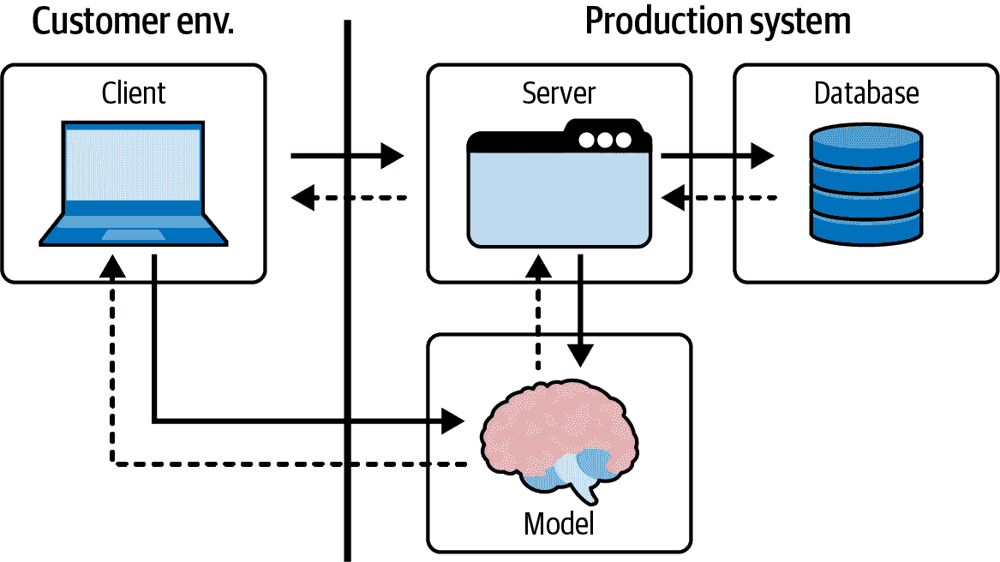

# 第十章：机器学习模型的部署模式

在整本书中，我们讨论了机器学习生命周期。作为一个快速提醒，在高层次上，机器学习系统的生命周期类似于软件开发生命周期。这意味着它包括多个阶段，我们可以总结如下：

开发

训练模型

验证

验证模型

分阶段

在类似生产环境的环境中测试模型

部署

将机器学习系统投入生产

存档

淘汰模型，必要时用新版本替换

在前面的章节中，我们深入探讨了生命周期的前几个阶段，包括分布式训练的各种工具和方法。在本章的最后，我将提供关于如何思考部署过程以及需要注意的考虑事项的指导。部署发生在你拥有一个产生准确结果并且你对其满意的模型后，你准备好将其提供并投入到生产中。如果情况不是这样的话，最好继续探索使用额外的算法和参数，也许还需要新的数据。

在考虑部署模型时，我们需要定义在整个生产系统工作流程中模型将在何时何地使用。它可能是更大数据流的一部分，也可能是一个独立的应用程序，为用户提供交互的 API。该模型还可以作为 Spark 流的一部分封装并作为 UDF 提供服务（稍后详述）。

本章涵盖以下内容：

+   部署模式

+   监控策略

+   生产反馈循环

+   使用 MLlib 进行部署

+   使用 MLflow 进行部署

+   迭代开发

# 部署模式

你有多种选项可以部署你的机器学习模型。我们将在本章中详细探讨其中一些，并且我也会提供实际的例子。每种模式都需要不同的代码和组件，以保证模型在生产环境中的良好表现。那么，你如何知道哪一种模式最适合你的用例呢？

在考虑部署模型的最佳模式时，重点应放在业务需求上。模型将用于批处理还是流处理？它将在哪里使用？例如，对于运行在用户本地机器上的高级客户端应用程序，通常会将模型加载到内存中，以便用户可以直接与之交互。这种情况在像智能汽车这样的物联网设备中很常见，例如，模型可能被部署到汽车上以减少通信和网络开销。

另一个需要考虑的事项是生产环境是否与开发和测试环境不同。通常情况下是这样的。

让我们看看一些部署模式，这些模式可能根据你特定的业务需求而使用，帮助你了解在评估选项时需要考虑的事项。

## 模式 1: 批量预测

在使用批量预测时，您会在新数据上运行模型，并将结果缓存到数据库或其他持久存储中。当您希望一次为一组观测值生成预测，并且结果对延迟不敏感时，这种模式非常有用。如果您希望每天为每个用户生成一个预测，可以离线运行预测并缓存结果，效果很好。

这种方法的优点很明显。首先，使用 Spark 很容易实现：只需使用 Spark API 加载模型。其次，它很容易扩展到大量数据，并且是一种经过验证的方法。它还能够快速为用户提供结果，因为预测已经完成。

这种方法的缺点是什么？首先，对于复杂输入，它可能更难扩展，这会为批量预测过程带来大量开销，因为需要覆盖所有特征的所有排列。因此，在给定时间内可能无法计算所有可能的输出。

第二个问题是用户可能会得到过时或“陈旧”的预测—尽管它们仍然准确，但不会是最新的。例如，如果新电影每天发布，但批量预测每 48 小时运行一次，那么电影推荐系统可能无法向客户推荐最新的电影。模型不知道新电影的存在，因此会推荐较旧的电影。

因为处理和缓存模型的新输出需要时间，也很难检测处理管道中的问题，比如批处理作业的失败。这可能导致模型本身变得陈旧和无关紧要。我们将在监控部分更详细地讨论这个问题。

## 模式 2：模型服务化

在这种模式下，模型与面向客户端的应用程序捆绑在一起，并部署到 Web 服务器上。如图 10-1 所示，服务器加载模型并调用它以实时进行预测，响应来自客户端的 API 调用。根据需要，模型可以访问数据库。


###### 图 10-1\. 一个生产系统，模型部署在服务器上，客户端与之交互

尽管这种方法非常适合重用现有的生产基础设施，但您必须考虑许多潜在的问题和妥协。例如：

+   Web 服务器的后端本身可能是用不同的语言编写的，比如 Java，而您的模型和库则是用 Python 编写的。

+   应用程序与模型部署耦合意味着它们需要共享相同的发布时间表。由于模型可能需要更频繁地更新，管理这个过程可能会对工程团队的其他部分构成挑战和负担。

+   如果你提供一个大型模型，它可能与 Web 服务器的其他功能竞争资源。这可能会降低服务器的响应速度和总吞吐量。

+   Web 服务器的硬件通常未经过优化以适应机器学习模型。例如，CPU 对于 Web 服务器来说效果很好，而模型可能需要 GPU 来快速处理并返回预测结果。

+   最后，还有规模的问题。你的 Web 服务器如何扩展以应对更多的 API 请求？这与模型的扩展策略是否匹配？这里的冲突可能会限制整个系统的性能。

## 模式 3：模型即服务

这是另一种实时模式，其中你将模型本身部署为一个服务（也称为机器学习微服务），以避免与后端服务器硬件的耦合和可能冲突的扩展要求。这意味着上一节中的缺点列表几乎会消失。通过这种方法，模型组件有自己的部署周期、代码、版本、扩展策略等，并且模型托管在自己独立的服务器上。后端服务器通过管理预测请求与模型交互，如图 10-2 所示。



###### 图 10-2\. 生产系统，机器学习应用和模型分开部署

将系统解耦有很多好处，比如：

可靠性

模型中的错误不太可能使整个应用程序崩溃。

可扩展性

你可以为你的机器学习应用选择最优的硬件，而不必与模型本身的扩展策略耦合。

灵活性

模型可以轻松地被多个应用程序重复使用；它是一个独立的服务，也可以部署在其他系统中。

不过，这种方法也有其缺点。特别是，作为服务的模型模式会在每次调用时增加延迟，因为信息必须传输到模型服务本身，然后需要发送回响应。此外，从生产基础设施的角度来看，这种方法增加了部署新服务和管理与之交互的复杂性。最后，从数据科学的角度来看，这意味着你需要监控和管理你的机器学习模型服务，并在出现问题时负责这个组件。

## 确定使用哪种模式

我们刚讨论的这三种模式各自设计用于不同的业务需求，这转化为不同的计算需求，比如延迟、吞吐量、请求大小等。所有这些考虑因素都影响了选择哪种部署模式最适合手头的任务。

从高层次来看，我们可以区分两种方法：*实时*和*批处理*，其中批处理方法具有最高的吞吐量¹和最高的延迟（取决于处理计划，从几分钟到几周），而实时方法具有最低的吞吐量和最低的延迟（毫秒级）。并发请求的数量、请求的大小以及所需的解决方案都会影响选择哪种模式。

在实时方法中，系统的具体需求可能会有所不同，对于延迟的容忍度可能更多或更少。在交换信息时，无论是在团队内部还是跨团队之间，最好总是用延迟和吞吐量来交流，因为这些术语并不严格相关，机器学习团队可能会使用不同的术语来表达相同的需求。

硬

错过截止日期是绝对的系统失败。

确定

偶尔错过截止日期是可以容忍的，但可能会降低系统提供的服务质量。一旦错过截止日期，结果就不再有用。

软

超过截止日期后，结果的价值降低，影响系统质量。

如果你与数据工程师合作或具有数据工程背景，可能会看到另一种分类，即*实时*与*准实时*：

+   实时解决方案优先考虑延迟而不是吞吐量，并在几毫秒内生成结果。

+   准实时解决方案需要快速的推断/预测，但结果可能会在百毫秒到一分钟的延迟内交付。例如，Spark 的结构化流处理引擎在微批处理上运行，几乎实时地处理数据；我们稍后在本章讨论使用 MLlib 部署时会看到这一点。

遗憾的是，这些术语并不严格对应，机器学习团队可能会使用不同的术语来表达相同的需求。因此，在交换信息时，最好总是用延迟和吞吐量来交流。


###### 图 10-3\. 不同类型的机器学习应用程序的延迟需求的巨大范围

## 生产软件要求

部署模型的主要目标是使其可供用户、程序、应用程序或其他模型进行交互。但是，要将模型推向世界，除了简单地将模型发布外，还有许多要考虑的事情。无论您选择哪种部署模式，都需要建立一个过程框架。为了帮助您做到这一点，在准备部署完整模型时，以下是一些应尽力回答的问题，按主题组织：

模型应用部署

您将如何推出您的机器学习应用程序？一旦投入生产，您将如何管理和更新它？在发生故障时，您将怎么做？与软件一样，您希望能够将模型转变为响应请求的东西。通常在部署过程（例如逐步推出、立即回滚）和监控过程中会设置硬性要求。

模型包部署

如何将模型与其运行时环境、预处理和后处理打包在一起？部署周期是什么，如何处理版本控制、存档等？今天，您可以选择多种部署框架和解决方案——TensorFlow 和 PyTorch 都提供了它们自己的部署选项，还有许多其他可能性，如 KFServing。本书不会进一步讨论它们，但知道它们的存在非常重要。

依赖管理

模型本身的即时依赖是什么？它需要什么来运行？您的服务或软件还需要什么？代码、模型权重和依赖项都需要成为打包部署的一部分，以便模型进行预测。但是*依赖项会带来麻烦*。软件中的依赖项很难保持一致；新版本通常会引入可能破坏用于打包和构建模型的 API 或逻辑的更改。为了克服这个问题，软件工程师采用了两种主要策略：

+   限制服务模型的依赖项

+   使用容器来完全控制版本和运行时环境（下面讨论）

两种知名的容器技术是 Docker 和 Linux。容器包含可执行代码及其运行所需的一切，包括运行时、工具、库和设置（统称为*镜像*）。一个机器学习系统可能需要各种容器来满足所有的需求：例如，您可能需要用于 Web 服务器、数据库和作业队列的容器，以及用于工作节点本身的容器。

模型运行时环境

模型在哪里和如何运行？例如，环境可能需要 Python 安装；在这种情况下，模型操作还需要一个特定于 Python 的运行时。这就是为什么使用容器管理依赖项和运行时环境是最佳实践的原因。

REST API

REST API 通常用于根据规范格式的 HTTP 请求提供预测响应——它们的行为如何，您如何设计它们？您将如何将这些 API 与您的模型打包？今天的最佳选择仍然是使用容器。您还需要考虑这些 API 的版本控制。

###### 注意

还有一些替代 REST API 的选项，比如 gRPC，它们提供了类似的接收和响应请求的体验。没有一致的标准用于服务机器学习模型，因此每个实现可能略有不同。

这个清单为您在思考如何打包和部署模型时提供了一个起点。一旦您建立了这个框架，您需要考虑生产环境以及如何优化和扩展部署。以下是一些提示，帮助您更好地理解这些主题之间的关系，以及在达到优化和扩展阶段时需要注意的内容：

性能优化

性能是每个软件解决方案的关键部分。机器学习特别需要额外的要求和考虑因素。例如，*使用 GPU 还是不使用 GPU？*在生产系统中为模型服务有使用 GPU 的利与弊。积极的一面是它可以提高吞吐量，而且很可能是您用来训练模型的相同硬件。缺点是 GPU 的设置更加复杂，通常比 CPU 更昂贵。让 GPU 多次运行以构建模型的成本远远低于在生产中持续运行。

优化的另一个方面是*并发性*。这意味着我们在系统的不同核心上运行多个模型副本，无论是 GPU 还是 CPU。这种方法支持大量的预测请求，但增加了使用软件线程的复杂性。使用线程池需要在调整时特别小心，以便进行预测。如果每天需要服务数十亿的请求，正确调整非常关键。如果您对线程和并发性没有经验，最好咨询专家。

模型压缩与精简

这与您的模型打包和运行环境相关。当您需要模型具有更小的占用空间时，这是必需的。在训练完模型后，您会将其保存为某种文件格式，特定大小。此文件需要加载到机器的 RAM 并执行。如果信息量过大而无法适应机器内存，您将需要找到一些创造性的方法来进行压缩，或者训练一个模仿较大模型的较小模型。这个研究领域受深度学习驱动，往往导致非常大的模型。您可以尝试的一种技术是使用较小的数值表示再次训练模型，例如，您可以使用`int8`而不是`float`，在准确性上进行权衡。这被称为*量化*²。PyTorch 和 TensorFlow 都内置了量化：训练过程中已经考虑到它，通常会导致更高的准确性。

缓存层

根据模型的不同，某些输入可能比其他输入更常见。对于这些情况，您可以建立一个专门存储结果的缓存层，而不是反复调用模型进行推断。当收到请求时，您首先在缓存中搜索查询，如果之前未保存过答案，则将其传递给模型进行处理。在处理数据时，缓存方法非常常见，对于机器学习系统也是一种有用的方法。

横向扩展

在某些时候，您实施的所有优化技术可能会证明不够用——您可能需要处理更频繁的 API 调用并实现更高的吞吐量。您要怎么做？当单个机器无法处理太多流量时，您可能需要将流量分配到多台机器上。为此，您需要启动多个模型服务的副本，并使用负载均衡器分流流量。在这种情况下，您通常会利用容器编排工具，比如带有 Docker 的 Kubernetes。

管理选项

您可能还希望考虑采用托管解决方案来部署模型作为服务，而无需使团队负担管理责任。您可以在云平台上将其作为无服务器函数运行，其中应用代码及其依赖项部署到具有明确定义入口点函数的容器中。大多数云解决方案的好处在于您只需支付计算时间。挑战在于限制的部署包大小、无法访问 GPU、缓存的状态管理不足以及有限的部署工具。

重要的是要牢记所有这些话题，因为它们将指导您决定模型的最佳部署选项。

# 在生产中监控机器学习模型

当然，部署模型后您的工作并没有结束。在生产环境中可能会出现很多问题！为了更好地理解这些问题，考虑机器学习生命周期中的两个测试阶段：在开发过程中测试模型（*验证*），以及在类似于生产环境的阶段测试模型。

当我们的模型表现不如预期时，应首先查看哪些问题？以下是在将训练问题排除之前到生产环境部署之前可能遇到的一些问题示例：

+   验证损失低于目标性能，这意味着您训练的机器学习模型在先前未见数据上表现不如预期。

+   测试损失与验证损失过于相似（即结果“太好以至于难以置信”）。

在将模型从分阶段移至生产之前，请务必执行以下操作：

+   确保您的模型在验证集和测试集上的关键指标表现良好。

+   定性验证预测结果确保其合理。

+   验证生产模型具有与开发模型相同的性能特征。

+   如果您正在更新或替换现有模型，请验证新模型的表现是否优于之前的模型。您可能需要运行几个比较测试来确保对新模型改进的信心。

遵循这些建议应该有助于确保您有一个良好的开端，当然，在测试和部署后还可能出现许多其他问题。

众所周知，机器学习模型在部署后往往会出现退化，原因有多种。例如，数据或业务问题可能发生变化；当数据中存在许多异常值时可能会遇到“长尾”问题；或者我们可能经历完全的领域转变。让我们更详细地看看在部署模型后可能遇到的一些问题以及如何处理它们。

## 数据漂移

模型退化主要是由*数据漂移*引起的。这意味着您向在线算法提供的数据相对于训练数据发生了某种方式的变化。通常通过比较生产数据和训练数据的分布来进行统计测试。

现代数据架构允许数据结构和架构动态变化。数据漂移可能会在数据结构、语义或基础设施意外改变时发生。这种行为可能会破坏流程并损坏数据。因为数据漂移涉及应用程序消耗的数据的变化，它也可能是由于在培训过程中未知或未捕获真实世界数据的全面变化引起的。它还可能是由上游数据管道中的错误引起的。为了避免这种情况，我们需要在将数据投入到生产模型之前检查数据的变化，例如，当我们知道整数值应该是正数时，我们可能会突然看到负整数值，如–1 或–5。

或者，也可能是系统用户之一出于恶意目的而改变数据，决定用人工值轰炸系统以影响数据的平衡。监控数据分布及其准确性非常重要，以防范此类攻击。在大多数情况下，您需要引入领域专家来处理这个问题。

数据分布的变化也可能是自然发生的。假设我们增加了具有不同人口统计特征的新用户。我们的机器学习模型不了解这些用户的具体特征，因此为了对他们进行准确预测，我们需要使用反映这些人口统计特征的训练数据重新训练模型。数据也可能受到大规模事件的影响，例如全球大流行和金融变化。根据手头的业务问题，您可能需要考虑如何更好地组织模型的特征以应对这些不可预见的事件。同样，这通常需要领域专家的参与。

模型输入数据的变化可能会快速或逐渐发生，可以是永久的或临时的。从时间的角度来看，我们可以区分以下数据漂移类别：

即时漂移

这种类型的漂移会导致数据分布立即发生可检测的变化，如图 10-4 所示。例如，当在新领域部署模型时，比如在新城市部署自动驾驶汽车时，可能会发生这种情况。这也可能是由于预处理流水线中的错误或大事件（如大流行）引起的。


###### 图 10-4\. 即时数据漂移

渐变漂移

特征值随时间可能会缓慢变化，如图 10-5 所示。在渐变漂移中，没有可以检测到的数据分布的立即变化。例如，用户偏好可能因用户群体年龄增长或周围文化变化而改变。


###### 图 10-5\. 渐变数据漂移

周期性漂移

这种类型的漂移不太直观。如图 10-6 所示，数据随时间定期发生变化，可能在一天甚至一年的过程中发生。这种变化可能看起来类似于方向性漂移，但一段时间后会进行修正，值会回到漂移前的状态。这些变化往往是循环的，基于季节变化或节假日期间的变化，或者白天与夜晚的使用情况，或者不同时区的用户。


###### 图 10-6\. 周期性数据漂移

临时漂移

临时漂移通常是最难检测的一种。各种事件可能导致数据分布显著变化，例如恶意用户攻击模型，或者黑色星期五促销，或者新用户以模型未曾训练处理的方式使用系统。我们数据中的这种波动表现为临时漂移，如图 10-7 所示。由于数据分布在一段（通常很短的）时间后恢复正常，因此很容易忽略这种问题。


###### 图 10-7\. 临时数据漂移

检测数据漂移的各种表现方式，围绕着识别特征值随时间变化的变化。这是一个在实践中已知有巨大影响的真实世界机器学习问题。新用户收到过时推荐，可能是由于重新训练流水线中的错误导致的，这可能导致大量用户流失，并且可能对组织造成收入损失。

## 模型漂移，概念漂移

有些情况下，整个模型都必须更改。现实世界环境的变化经常导致*模型漂移*，从而降低了模型的预测能力。这可能由许多因素引起，从数字环境的变化（导致模型变量之间的关系变化）到用户人口统计或行为的变化。

假设我们正在追踪在线打车服务的用户行为。我们根据应用在不同时间使用情况构建了一个模型，考虑因素包括公共交通的可用性和道路上的车辆数量。然而，由于大流行，公共交通线路已关闭，人们不再通勤上班。由于现实世界情况的改变，用户行为发生了变化，因此应用概念和模型已不再适用。我们需要重新训练和调整模型以适应新的现实情况，并随着用户偏好继续演变而不断重新校准。这些条件可能也会影响整体业务模型，因此还需要更新系统和模型。

另一个例子是电影推荐系统。假设我们为用户构建了一个系统，并且用户在我们创建系统时根本不看的一个新流派（比如无声电影）突然变得流行起来。系统不涵盖这种流派，但由于用户偏好已经改变，我们需要重新训练模型，包括这一类别的数据。

模型漂移的检测被认为是一个难题，通常需要人工干预。重要的是与用户、客户、产品经理和数据分析师合作，更好地理解可能影响模型有效性的变化。

## 分布领域偏移（长尾）

毫无疑问，这种类型的转变通常是最难检测到的。它也是许多组织意识不到的重要问题。

*领域偏移*是指训练数据集分布与模型在部署时遇到的数据之间的差异——即生产数据的分布。这可能是因为机器学习算法使用的近似函数，结合了从基础分布中抽样的数据训练模型。由于抽样过程引入了可能存在的人为影响，以及由于数据分布存在长尾而完全忽略的影响。当异常值对模型和业务目标有显著影响时，这一点就显得至关重要。另一种看待这个问题的方式是承认抽样数据可能无法代表我们关心的分布的所有部分。

在实际应用人工智能中，域漂移经常发生，而机器学习算法往往难以适应这些变化。域漂移可能是由于训练数据管道中的错误或抽样过程中的偏差引起的。这种情况可能发生在训练数据中某些群体被低估或训练数据的分布不再准确地代表现实世界数据时。

举例来说，假设我们正在建立一个银行系统，用于预测贷款违约，其中一个特征是性别。如果我们使用过时或不足的数据训练模型，那些数据可能会对特定性别产生偏见。在现实生活中，由于社会变化，我们的模型需要处理更多种类的数据，而训练数据与生产数据之间的不匹配可能导致错误的结果。

为了避免这些问题，我们需要关注训练分布与生产数据分布之间的差异。

## 我在生产环境中应该监控哪些指标？

现在你已经了解了生产中可能发生的各种潜在数据、模型和分布变化，我们可以讨论监控哪些指标来检测这些变化。

总体上说，我们构建的任何机器学习系统都具有四个特征，这些特征将决定我们监控和测量哪些内容：

模型指标

这些包括准确性、鲁棒性和性能。在生产系统中测量这些指标通常比训练期间更加困难，因为我们通常无法访问所有必需的数据。

业务指标

这些指标展示了机器学习系统对业务的影响。例如，对于推荐系统，我们将监控与用户流失和用户参与相关的各种指标：有多少人在使用系统，使用频率如何，每次互动多长时间。我们甚至可以将用户群体分成多个用户组，并在生产中运行不同模型的 A/B 测试。监控业务指标通常相对直接，因为许多组织已经有业务智能（BI）或分析团队来测量它们。但是，可能存在影响这些指标的冲突或隐藏因素，因此最好将它们与其他措施结合起来。

模型预测与实际行为

这些指标展示了模型的预测与实际用户或系统行为的相关性。通常，测量它们需要一些创造力和量身定制的解决方案，因为它涉及捕捉实际行为而不是预测行为。通常，我们会希望创建一个单独的数据管道来捕捉和保存实际行为到数据集中。这将告诉我们模型在模型指标之外的表现如何。

硬件/网络指标

这些显示系统在硬件/网络层面的表现如何。例如包括 CPU/GPU 利用率，请求的平均延迟，服务器响应时间，服务器停机时间等。跟踪这些指标非常关键，因为它们为我们提供了关于底层硬件对系统影响的详细图景。它们相对容易测量，因为大多数生产系统已经具备必要的工具，并且有各种商业解决方案可供选择。

## 如何使用我的监控系统测量变化？

有多种策略可用于测量机器学习系统的变化。然而，主要方法类似。我们希望能够随时间检测变化，因此首先需要一个用作比较点的参考。

### 定义一个参考点

为了建立一个参考基准，我们查看认为良好的不同时间窗口的数据。这将为我们提供要进行比较的数据点。在这些时间窗口内，我们寻找数据及其分布的变化。正如在第 4、5 和 6 章讨论的那样，Spark 为我们提供了收集关于我们数据统计信息的工具。这是一个很好的利用机会，以建立一个基线，这样您就可以监控可能表明漂移的变化。

此时您可能在想，“这听起来都很好，但我该如何选择一个参考窗口？”一种选择是从您认为健康的生产数据开始使用固定窗口——一个小时、一天或适合您业务问题的任何时间。收集您的指标，并开始迭代。一些系统将利用滑动窗口方法，其中时间窗口线性前进，每个（可能重叠的）段与前一个段进行比较。例如，如果我有一个数组[1,2,3]，大小为两个的滑动窗口将生成以下数组列表：[[1,2]，[2,3]]。虽然这是一个搜索的好技术，但可能会产生高计算成本，并且对于我们当前的目的效率不高。考虑一个 5 小时的时间轴，滑动窗口为 1 小时，大小为 2。您将在四个时间窗口内计算指标：[[1,2]，[2,3]，[3,4]，[4,5]]。

一个更好的解决方案——也是行业最佳实践——是使用训练或验证数据和指标作为参考。这是一种更具成本效益和简单直接的做法，易于实施。

### 将参考点与新鲜指标值进行比较

在定义参考点并计算指标之后，下一步是选择一个窗口来对比参考点。这在很大程度上取决于具体问题；它直接与业务目标相关，并且由您希望监视机器学习系统的频率以及可能根据需要替换或重新训练它的方式决定。您可能希望在一小时、一天或一个月的时间段内监视您的数据。

为了更加实用，选择几个合理大小的窗口，并比较它们。例如，有 1 小时、12 小时和 1 天的窗口大小，并将它们滑动到最近的数据上以监控系统的行为。请注意，根据窗口大小的不同，您可能会错过检测到一些异常值的机会。您可能希望监视不同的窗口大小以衡量不同的方面。

### 用于衡量的算法

在统计学中，您会发现多种算法用于衡量两个数据集之间的差异。经典且最为知名的算法是距离度量。作为一名数据科学家，您可能对以下算法较为熟悉：

基于规则的距离度量

这些算法根据一组规则测量数据与参考数据的距离。它们非常适合确定数据的质量。我们可以比较最小值、最大值和均值，并确保它们在可接受的范围内。我们还可以检查数据点的数量，以确认数据没有丢失或被丢弃（例如由于错误的预处理），检查空值的存在，并监测数据漂移。

D1 距离

这是一个经典的距离度量，计算了固定数据值之间的距离之和。易于解释，并简化了一般的监控工作。

科尔莫哥洛夫–斯米尔诺夫统计量

这找到了经验和累积分布函数之间的距离。这是一个常用的指标，相对容易理解并绘制在图表上。

库尔巴赫–莱布勒散度

这种方法衡量了两个相同变量*x*上的两个概率分布之间的差异。它是一种统计学的基于对数的方程，对分布的尾部敏感。它可以检测异常值，但有点难以理解和解释。当您完全了解如何使用时，这种指标可能会很有用，但在大多数情况下并不会提供太多见解。

还有许多其他的指标，但这个列表足以让您开始了解。

## 生产环境下的实际表现

要监测数据漂移，应该使用已存在于生产系统中的简单工具。通常情况下，您需要设计一个数据管道，并为您想要测量的每种漂移类型编写专用逻辑。例如，如图 10-8 所示，您可以开发两个数据管道，每个管道返回一个信号指示漂移的存在或不存在。顶部的数据管道将最近的数据与参考数据进行比较，如前所述，可以用来检测数据漂移。底部的管道则通过比较模型的预测与系统实际结果来检测模型本身的漂移。这将告诉我们是否需要重新训练机器学习模型。这可以是一个自动化的过程，也可以是团队根据系统警报手动执行的过程。这种方法也称为*生产反馈循环*，我们将在下一节更详细地讨论这个问题。


###### 图 10-8。监控漂移

当然，重要的是要记住，您开发的模型将有其自身的敏感性，没有一种适合所有情况的解决方案。

# 生产反馈循环

在生产中，反馈循环是指系统将模型的输出和相应的最终用户操作保存为观察数据，并使用这些数据随时间重新训练和改进模型。预测/推荐本身将与用户或系统的行为进行比较，并提供有关模型性能的反馈。一个知名的案例研究是付宇鹏和 Chinmay Soman 的[《Uber 的实时数据基础设施》](https://oreil.ly/srOdn)，该案例展示了 Uber 如何利用实时生产数据通过实施两条流水线来改进其机器学习系统：

+   嵌入机器学习模型并用于预测乘车成本的流水线。

+   捕获真实结果的流水线。

Uber 使用这种方法来随时间监控性能。根据文章描述的实时数据基础设施的消费者包括负责自动动态定价乘车、仪表板、警报、分析应用等系统。正如你所见，机器学习系统只是更大故事的一部分。然而，系统确实考虑了这些信息并实时更新下一轮预测的特征。数据反馈循环是关键的系统组成部分，因为它将信息反馈到生产系统并触发警报。

请记住，尽管这种方法对 Uber 的用例非常有效，但可能不适用于其他组织。设计基于真实结果的反馈循环将需要您跳出思维定势，理解如何将其与更大的系统集成以及何种度量是有意义的。

现在您对理论有了更好的理解——部署模式、监控、反馈循环等——是时候通过一些实际的示例更加实践了。

# 使用 MLlib 进行部署。

第六章介绍了如何利用 Spark 的机器学习库 MLlib。您了解了其各种能力，包括训练、评估和调整模型；构建流水线；并将模型保存到磁盘，以便部署使用。

MLlib 的模型格式是一个专用格式，包含模型的元数据以及实际数据。元数据可以包括不同的元素，具体取决于机器学习算法。

例如，当使用 MLlib 的`RandomForestClassifier`时，数据将包括关于每棵树（由`treeID`参数标识）中权重、分区数等的信息。另一方面，元数据将包含有关模型创建的信息，例如：

```
("timestamp" -> System.currentTimeMillis())
("sparkVersion" -> sc.version)
("uid" -> uid)
("paramMap" -> jsonParams)
("defaultParamMap" -> jsonDefaultParams)
```

以及模型本身：

```
"numFeatures"
"numClasses"
"numTrees"
```

此信息帮助您在不同环境中加载模型。这对于部署非常有帮助，因为我们可以将 MLlib 的`load`函数与 Spark 工作流的其余应用程序逻辑一起包装。要加载和处理的数据可以是批处理或流处理两种形式。在下一节中，我们将通过一个示例来构建一个部署具有流数据的模型的流水线。

###### 提示

不要忘记使用与保存（通常也是训练）模型时使用的确切类来加载模型。否则，对于高度耦合的 MLlib 格式，它根本不会工作。

## 使用结构化流的生产机器学习管道

在我们深入讨论之前，快速提醒一下：在结构化流处理中，数据的模式在读取时不会发生变化。这简化了我们的工作，因为模式检测发生在数据流到达模型之前的早期阶段。

要设置管道，您需要提供以下内容：

模式

流数据中列的规范。

流读取器

流数据的来源规范。对于测试，这也可以是静态数据集。

机器学习模型

您希望训练的模型。

下面的代码片段演示了：

```
schema = StructType([ StructField(’id’, IntegerType(), True), 
                      StructField(....) ]

streaming_data = spark.readStream.schema(schema) 
                                 .option("maxFilesPerTrigger", 1)
                                 .parquet(*some_path*)

streaming_prediction = pipelinesModel.transform(streaming_data) 
                                     .groupBy(’label’) \
                                     .agg(*some_aggregations*)

# do something with the streaming prediction data
```

流预测可用于聚合、决策、自动化或机器学习模型设计的任何业务任务。

假设这个模型被设计用于预测点击率。它捕捉用户对网站的印象，并尝试预测用户是否会点击特定链接。对于这个特定的用例，我们可以捕捉用户的实际行为——他们是否点击——以比较预测结果和实际结果。由于可以保存数据并将其作为批处理处理，我们可以决定采用批处理还是流处理方法。

使用流数据始终是一个更复杂的解决方案。但是，对于运行 A/B 测试并需要实时更新的网站来说，这可能会产生更好的结果。

使用流处理解决方案，可以使用两个数据流捕获点击和预测，并运行*流-流连接*。这个功能在 Spark 2.3 中添加，允许我们连接两个流数据框。这种方法的缺点是表的视图对于连接的两侧始终是不完整的，这可能使匹配变得更加困难。

在数据处理的世界中，流-流连接被认为是难以高效执行的，因为它们通常需要在实时处理过程中通过网络进行数据洗牌。想象一下，您有一个无尽的数据流进入系统，并且需要与另一个无尽的数据流进行连接。如何确保流正确对齐？为了解决这个问题，您可以考虑执行一系列微批次连接。由于数据可能无序到达，因此在使用 Spark 进行流-流连接时，您应确保定义水印延迟（事件时间和处理时间之间的最大延迟）。这让引擎知道数据可以有多晚，以及何时安全地处理每个微批次—即，它定义了等待的时间范围，直到洗牌和连接操作可以开始处理给定的微批次。可以通过时间戳或微批次大小（即批次中的行数）进行限制。

若要了解如何使用结构化流和批处理 API、流-流连接等更多信息，请访问[Spark 文档](https://oreil.ly/_MdEz)。

# 使用 MLflow 部署

我们在第三章中讨论了 MLflow。作为提醒，MLflow 是一个用于管理机器学习生命周期的平台，使您能够记录和检查机器学习实验的结果。它具有跟踪实验、打包项目代码、打包和部署模型以及模型注册的组件。

MLflow 提供了两种不同的部署选项：

+   作为微服务

+   作为 Spark 流中的 UDF

使用 MLflow 部署机器学习模型需要您创建一个 MLflow 包装器。接下来我们将看看这一点，然后深入探讨两种部署选项。

## 定义 MLflow 包装器

MLflow 包装器——*mlflow.pyfunc.PyFuncModel*的一个实例——包装了模型及其元数据（*MLmodel*文件），使它们可以轻松地一起发布。这里是 MLflow 创建的模型目录结构的提醒：

```
--- 58dc6db17fb5471a9a46d87506da983f
------- artifacts
------------ model
------------ MLmodel
------------- conda.yaml
------------- input_example.json
------------- model.pkl
------- meta.yaml
------- metrics
------------ training_score
------- params
------------ A
------------ ...
------- tags
------------ mlflow.source.type
------------ mlflow.user
```

因为这个机器学习模型是在 Anaconda 环境中创建的，所以*MLmodel*文件夹包含*conda.yaml*文件和*model.pkl*文件。

包装器本身是一个类，我们与模型一起保存，这样后续加载模型的程序就知道如何加载它并用于预测。要连接训练、部署和使用模型，您必须在保存模型之前定义包装器类，并使用 MLflow 的`log_model`函数记录它。以下代码片段显示了如何执行：

```
model_path = ".../mlruns/*{experiment_id}*/*{run_id}*/artifacts/models"
wrappedModel = *{some_class}*(model_path)
mlflow.pyfunc.log_model("pyfunc_model_v2", python_model=wrappedModel)
```

请注意，当您创建类的实例并记录模型和包装器实例时，需要提供`model_path`本身，包括`experiment_id`和`run_id`。这提供了连接两者之间的纽带。

让我们进一步分解一下。您的包装类需要实现`PythonModel`。这使您能够使用`python_function`（`pyfunc`）模型风格创建 MLflow 模型，该模型可以利用 MLflow 为您管理的自定义推理逻辑和文物依赖关系。接口具有三个函数：`__init__`，`load_context`和`predict`。为了利用它，您的微服务必须实现`predict`函数；但是，您可以根据需要重写前两个函数。让我们看看它们各自的作用：

`__init__`

这是一个 Python 私有函数，负责设置全局参数。它被称为“init”，因为它执行了后续使用的服务所需的初始化。这是 MLflow 在调用`load_model`函数时调用的第一个函数，用于加载以`pyfunc`格式存储的模型。它接受一个包含 MLflow 在后台管理的可以用于进行预测的文物的`PythonModelContext`作为输入。`PythonModelContext`后续也可用，但为了效率，最好将上下文和文物加载到内存中作为实现服务的全局参数的一部分。

`load_context`

此函数负责从`PythonModelContext`中加载文物。当使用`load_model`加载模型时，MLflow 在构造`PythonModel`时立即调用它。

`predict`

MLflow 调用此函数从模型获取预测。它接受一个`PythonModelContext`实例和一个`pyfunc`兼容的输入以评估并返回一个`pyfunc`兼容的输出。请注意，模型可能需要很长时间才能返回结果；您应该为此做好准备，并且可能也希望在此处处理错误。您还应该保留日志以便将来进行警报和审计。

让我们来看看使用 TensorFlow 构建的模型的一些示例代码。在本练习中，我们的类称为`KerasCNNModelWrapper`。它包装了我们的数据科学家训练和测试过的`KerasCNN` TensorFlow 模型。

首先，我们需要确保将`model_path`参数保存到内存中：

```
def __init__(self, model_path):
    self`.`model_path `=` model_path
```

请注意，我们不需要实现`__init__`，但是为了练习的目的，我们将实现所有函数。

接下来，让我们实现`load_context`函数。在这里，我们将从 Keras 本机表示中加载模型并将其保存到内存中：

```
def load_context(self, context):
    log(self.model_path)
    self.model = mlflow.keras.load_model(model_uri=self.model_path)
```

###### 注意

使用`mlflow.keras.load_model`加载模型仅在您使用 MLflow 训练和保存模型时才可能。`load_model`函数负责加载预测所需的文物以及运行模型所需的一切。

最后，我们将实现`predict`。 如前所述，每次使用 MLflow 都必须实现此功能。 `predict` 函数负责丰富输入数据并预处理以适应模型期望的格式，如第四章所述。 由于在此练习中我们正在对图像进行分类，因此数据预处理涉及调整和重塑图像以适应模型期望的尺寸。 输入为 pandas DataFrame，大小可为 1 到 *N*。 `class_def` 是一个 Python 字典，表示模型的分类选项。 我们的模型根据图像中出现的内容对图像进行分类：茶壶、镊子、意大利面或溜溜球。 `for` 循环迭代所有输入，预处理数据，并运行 `predict` 函数本身，为每个类选项提供概率。

函数实现在以下代码示例中提供：

```
def predict(self, context, model_input):
    import tensorflow as tf
    import json

    class_def = {
        0: '212.teapot', 
        1: '234.tweezer', 
        2: '196.spaghetti', 
        3: '249.yo-yo', 
    }

    rtn_df = model_input.iloc[:,0:1]
    rtn_df['prediction'] = None
    rtn_df['probabilities'] = None

    for index, row in model_input.iterrows():
        # resize and reshape the image
        image = np.round(np.array(Image.open(row['origin']).resize((224,224)),
                                  dtype=np.float32))
        img = tf.reshape(image, shape=[-1, 224, 224, 3])

        # predict
        class_probs = self.model.predict(img)

        # take the class with the highest probability
        classes = np.argmax(class_probs, axis=1)
        class_prob_dict = dict()

        # calculate probability for each class option:
        for key, val in class_def.items():
            class_prob_dict[val] = np.round(np.float(class_probs[0][int(key)]), 
                                                     3).tolist()

        rtn_df.loc[index,'prediction'] = classes[0]
        rtn_df.loc[index,'probabilities'] = json.dumps(class_prob_dict)

    return rtn_df[['prediction', 'probabilities']].values.tolist()
```

最后，该函数返回一个包含每个输入预测的 Python 列表，以及表示所有类的概率的 JSON 对象作为字典。

为了将所有内容连接在一起，我们必须定义包装器类并记录模型（如本节前面的代码片段所示），然后保存它。 下面是我们为此模型执行此操作的方式：

```
model_path = ".../mlruns/*{experiment_id}*/*{run_id}*/artifacts/models"
wrappedModel = KerasCNNModelWrapper(model_path)
mlflow.pyfunc.log_model("pyfunc_model_v2", python_model=wrappedModel)
```

## 将模型部署为微服务

在本节中，我们将探讨如何实现本章开头讨论的模型即服务模式。 MLflow 提供了一个名为`mlflow.deployments.BaseDeploymentClient`的通用类，该类提供了 API，可用于部署到自定义服务工具。 您只需将函数包装为通过您选择的 API 提供服务的微服务。 API 定义了计算机程序之间的通信方式。 在这里，我们进入了管理和版本控制 API 的世界。

为了简化事情，如前一节所述，MLflow 开发了一个名为`PythonModel`的基类，表示评估输入并生成 API 兼容输出的通用 Python 模型。 您只需利用此类和已使用包装器类和工件路径记录的模型再次加载它。 您将`load_model`函数提供给`model_path`本身，并指定正确的`experiment_id`和`run_id`：

```
model_path = ".../mlruns/*{experiment_id}*/*{run_id}*/artifacts/models"
model = mlflow.pyfunc.load_model(model_path)
model.predict(model_input)
```

有许多运行服务器的方法； 我不会在本书中探讨这个主题，因为它取决于您的云提供商，生产环境，风险评估，技能集等。

## 将模型作为 Spark UDF 加载

如前所述，MLflow 使我们能够在生产环境中训练和加载模型并管理工件。 在前一节中，您学习了如何将模型加载为独立服务。 在本节中，您将看到如何将模型加载为 Spark UDF，遵循本章早期的批量预测和模型服务模式。

从编码的角度来看，将数据输入 Spark 中的流处理或批处理都取决于如何加载 DataFrame。对于批处理数据，我们使用`read`函数，对于流处理数据，我们使用`readStream`。使用`readStream`的 Spark 应用可能永远不会结束。它会监听特定的通道并不断从中拉取新数据。相比之下，批处理作业有一个开始和结束时间；作业在某个时刻完成并关闭。

那么，如何使用 MLflow 将您的模型转换为 UDF 呢？使用 MLflow 提供的`spark_udf`函数非常简单：

```
# Load model as a Spark UDF
loaded_model = mlflow.pyfunc.spark_udf(spark, mlflow_model_path, 
                                       result_type=ArrayType(StringType()))
```

要将 UDF 与您正在处理的 Spark DataFrame 结合起来，您只需调用`loaded_model`即可：

```
# Predict on a Spark DataFrame
scored_df = (images_df
             `.`withColumn('origin', col("content"))
             `.`withColumn('my_predictions', loaded_model(struct("origin")))
             `.`drop("origin"))
```

创建一个名为`images_df`的新 Spark DataFrame，其中包含两列：第一列`origin`包含图像的原始内容，第二列`my_predictions`包含模型的预测结果。我们使用`struct("origin")`来确保该列的数据类型符合`pyfunc`在输入中期望的格式。至此，`scored_df`可以用于后续检查预测结果或基于预测结果采取行动。最后我们移除`origin`字段，因为在新的`scored_df`中这个字段是不必要的，这有助于减少内存占用。

# 如何迭代开发您的系统

现在您很可能已经理解，每当有新的更适合您需求或在某些方面优于当前正在生产中运行的模型时，您都会希望触发新的部署。

那么，如何知道何时替换现有模型？有多种方法可以解决这个问题。最常见的方法是在测试值上设置阈值。假设我们的目标是房地产成本预测的准确率达到 80%。将实际数据与我们的预测进行比较，我们确定我们的模型的准确率为 75%。我们是否应该采取行动？可能是的，因为这低于我们的目标准确率阈值。

我们能够生产出更好的模型吗？这是一个棘手的问题。我们怎么知道新模型肯定比现有模型表现更好呢？我们不知道。因此，我们需要能够跟踪和监控其性能，并在必要时回退到先前的版本。

当然，替换模型并不是唯一的可能解决方案。当我们确定模型表现不佳时，我们可以采取多种行动，包括调试生产系统本身。您选择采取的行动将取决于您的业务目标。

本节介绍了一种策略，您可以应用该策略从头开始使生产系统上线，并在之后（按阶段）进行迭代开发。这种框架被称为爬行、行走、奔跑、飞翔方法，还可以使您更好地评估您的工作及团队的期望，以及您的生产系统的状态。

起初，您将*爬行*——部署操作将是手动的，每次进行更改或出现错误时，您都会与您的团队一起评估和检查所有内容。

随着你对系统及其需求的了解增加，你将进入*步行*阶段。此时，您将向系统添加自动化测试和其他自动化工具。这里的目标是增强信心，并开始朝着可能实现完全自动化的系统迈进。

一旦您对手动部署和自动化测试程序感到满意，您将开始编写脚本以连接这两者。这时您进入*运行*阶段。您将在生产中为您的模型添加更多测试，微调警报，捕捉流入您机器学习模型的数据的任何变化，并监视吞吐量和结果。

最终，你将达到*飞行*阶段，在这个阶段，你对系统、代码、脚本和测试有了极高的信心，能够将警报的反馈循环与生产中数据漂移和变化的捕捉以及触发新的训练流程联系在一起。飞行状态是许多构建和使用机器学习系统的团队梦寐以求的境界。然而，一步一个脚印，保持敏捷至关重要。在你能步行或跑之前，你必须爬行，从手动将模型投入生产并监控其行为开始，但最终你会飞行：你的系统将在自动驾驶模式下稳定运行，你只需修复错误并引入新功能。此时，你将完全接入组织中的部署系统。

# 总结

在本书的最后一章中，我们深入探讨了机器学习生命周期的最后部分：部署、监控和退役现有模型。在整本书中，您已经了解了涉及机器学习工作流程的各种策略，从将数据输入系统，清理和组织数据，提取特征，构建模型，到利用 Spark 与 PyTorch 和 TensorFlow 进行迭代。本书还深入讨论了构建机器学习系统时可能遇到的一些问题。虽然机器学习世界仍在不断发展，仍有许多需要探索的内容，如保障系统、特征存储、更复杂的缓存技术、可观察性等等，但我希望本书达到了其主要目标，帮助您更好地理解 Spark 生态系统，以及如何与其他框架集成并利用其进行分布式训练。

¹ 因为预测是提前完成的，批处理模型可以通过利用缓存机制和其他方法快速处理大量请求。

² *量化*是将大（通常连续的）输入值映射到小（通常有限的）输出值集合的过程。它支持生成一个压缩模型**。**
