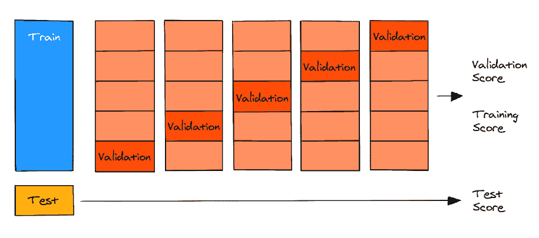
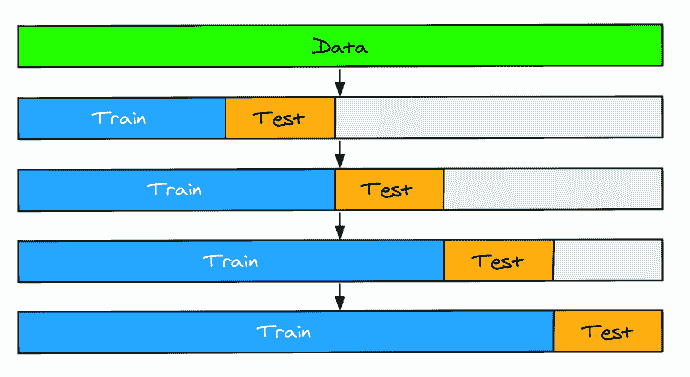
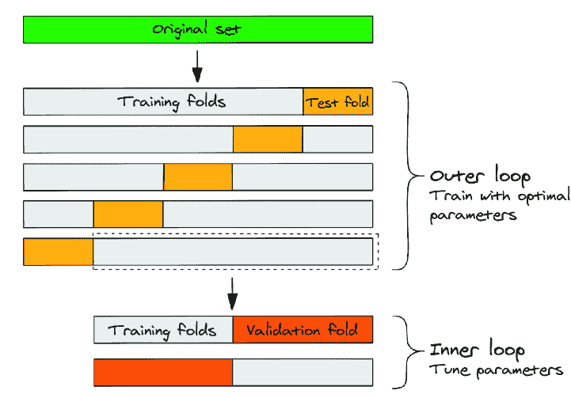
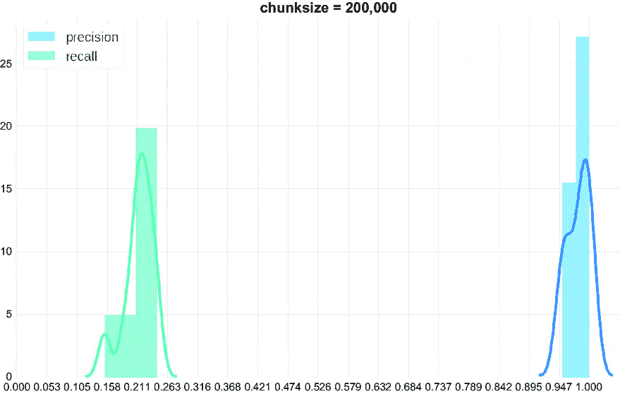
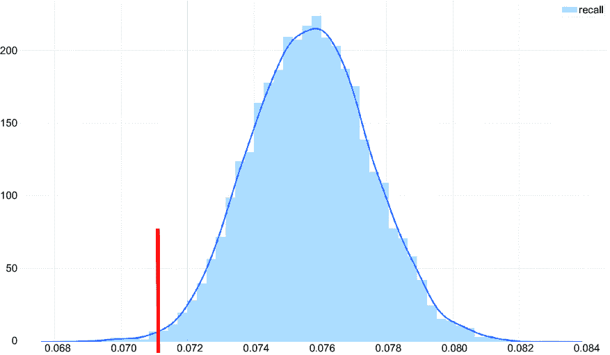
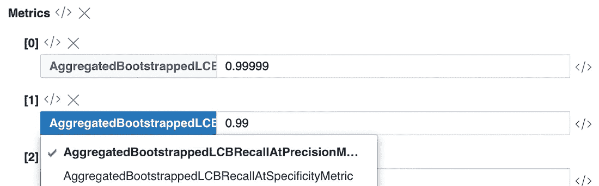

# 第七章：7 验证方案

### 本章涵盖

+   确保可靠的评估

+   标准验证方案

+   非平凡验证方案

+   分割更新程序

+   验证方案作为设计文档的一部分

构建一个稳健的评估过程对于机器学习（ML）系统至关重要，在本章中，我们将介绍构建适当的验证方案以实现系统性能自信估计的过程。我们将涉及典型的验证方案，以及如何根据给定问题的具体情况进行适当的验证选择，以及在设计野外评估过程时需要考虑哪些因素。

适当的验证程序旨在模仿我们在实际操作环境中应该拥有的知识，以及可以丢弃的知识。这与过度拟合问题或泛化问题有关，我们将在第九章中详细讨论。

它还提供了一个可靠且稳健的系统性能估计，理想情况下带有一些理论保证。例如，我们保证在 100 次中有 95 次真实值将在下限置信区间和上限置信区间之间（这种情况将在本章后面的篝火故事中介绍）。它还有助于检测和防止数据泄露、过度拟合以及离线和在线性能之间的差异。

性能估计是验证的主要目标。我们使用验证来估计模型在未见数据上的预测能力，通常首选的方案是具有最高可靠性和稳健性的方案（即低偏差/低方差）。

只要我们有一个可靠且稳健的性能评估，我们就可以用它来做各种事情，比如超参数优化、架构、算法和特征选择。在某种程度上，它与 A/B 测试相似，其中产生较低方差的模式提供更高的敏感性，这一点我们将在本章后面进行讨论。

## 7.1 可靠的评估

当验证任何事物时，几乎总是一个好的主意，建立一个稳定可靠的流水线，产生可重复的结果（见图 7.1）。你很可能在文献中找到的标准建议归结为以下三个经典条件：你所需要做的就是将数据分为训练集、验证集和测试集。训练集用于模型训练，验证集旨在评估训练过程中的性能，测试集用于计算最终指标。这种三集方法对于那些熟悉竞争性机器学习（例如，Kaggle 举办的活动）或学术界的人来说是众所周知的。同时，在应用机器学习（ML）中存在一些微妙但重要的区别，我们将在本章中进一步讨论。


##### 图 7.1 基本高级模型开发周期

有几点需要注意：

+   简单的训练-验证-测试分割假设所有三个数据集都来自相同的分布，并且这种分布在未来将保持不变。这是一个必须自己验证的强假设。如果这个假设不成立，就无法保证未来的性能。

+   验证集必须能够重复使用来估计模型性能。基于验证集高估模型性能会导致偏差和过度拟合。停下来思考一下：当我们从高层次的角度谈论超参数优化、特征选择或模型选择时，这基本上也是学习过程的一部分。通过归纳，测试集也可能被以同样的方式滥用。

正因如此，反复使用相同的验证分割进行评估和寻找最优超参数或其他任何东西会导致偏差/过度拟合和非鲁棒的结果。因此，我们不是将验证视为一开始就完成的事情，而是将其视为在系统环境发生变化（例如，有新的数据来源、新特征、模型使用可能引起的潜在反馈循环等）后需要反复进行的持续过程。

我们永远无法 100%确定世界会带来什么；这就是为什么我们必须预料到意外。

## 7.2 标准模式

实践表明，在选择机器学习系统的验证模式时，你不需要重新发明轮子。大多数标准模式都是经过时间考验且表现良好的解决方案，主要需要你选择一个适合你项目需求的模式。我们将在几个子节中简要介绍这些模式。

经典的验证模式在永不过时的 Python 机器学习库 scikit-learn 中得到了很好的实现，如果你对材料的了解有疑问，所有相关文档都值得一读。信息可在[`mng.bz/aV6B`](https://mng.bz/aV6B)找到。

### 7.2.1 保留集

我们将首先将数据集分为两个或更多部分。可能是在几乎所有关于机器学习的书籍中提到的黄金经典——我们之前讨论过的训练/验证/测试分割。

采用这种方法，我们将数据分为三个集合（可能是随机的，也可能基于特定的标准或层），具有不同的比例——例如，60/20/20（见图 7.2）。百分比可能根据样本数量和指标（数据量、指标方差、敏感性、鲁棒性和可靠性要求）而变化。经验上，整个数据集越大，分配给验证和测试的部分就越小，因此训练集增长得更快。测试集（即外部验证）用于最终模型评估，绝不应用于其他任何目的。同时，我们可以主要使用验证集（即内部验证）进行模型比较或调整超参数。


##### 图 7.2 标准的按部就班的数据分割

### 7.2.2 交叉验证

对于计算成本高的模型，如深度学习模型，保留法验证是一个不错的选择。它易于实现，并且不会给学习循环增加太多时间。

但让我们记住，我们从所有数据中抽取一个单独的随机子样本。我们并没有重用所有可能的数据，这可能导致评估偏差或未充分利用可用数据。最糟糕的部分是什么？我们得到一个单一的数字，它不允许我们了解估计值的分布。

统计学中解决此类问题的银弹是自助法。在验证情况下，它看起来像是多次随机采样训练验证分割，每次迭代训练和评估模型。训练模型是耗时的，我们希望快速迭代以进行一般参数调整和实验。那么我们如何做呢？

我们可以使用一个类似但简化的采样过程，称为*交叉验证*。我们可以将数据分成 K 折（通常为五折），逐个排除它们，将模型拟合到 K-1 折的数据，并在排除的折上测量性能。因此，我们得到 K 个估计值，可以计算它们的平均值和标准差。结果，我们得到五个数字而不是一个，这更具代表性（见图 7.3）。



##### 图 7.3 K 折分割：每个样本被分配到一个折，每个折在剩余的训练轮次中提供一次验证和一次训练。

交叉验证有几种变体，包括：

+   *分层交叉验证*（我们需要保持类别的平衡）。

+   *重复交叉验证*（我们将数据分成 K 折 N 次，这样每个对象参与评估 N 次）。

+   *分组交叉验证*（当组内对象相似时，我们可能希望避免泄露；整个组必须完全包含在训练样本或验证样本中）。

假设我们预测数百个油井的油流量。油井根据其位置进行分组：相邻的油井从同一油田提取石油，因此它们的产量相互影响。在这种情况下，分组 K 折交叉验证是一个合理的选择。在将样本分配到折时找到一个合适的分组标准是验证过程中的一个关键决策，这里的错误会极大地影响结果。

### 7.2.3 K 的选择

剩下的唯一问题是选择多少折。K 的选择受三个变量的影响：偏差、方差和计算时间。经验法则是使用 K=5，它在偏差和方差之间提供了良好的平衡。

K 的一个极端情况是留一法交叉验证，其中每个折包含一个数据样本；因此 K 等于数据集中样本的总数。这种方案在计算时间和方差方面是最差的，但在偏差方面是最好的。

Ron Kohavi 在 1995 年发表了一篇经典论文，题为“关于交叉验证和自助法在准确度估计和模型选择中的应用研究”（[`mng.bz/4pn5`](https://mng.bz/4pn5)），其中提供了以下指导原则：

+   增加折叠数量可以减少偏差并提高性能估计。

+   同时，由于每个验证折叠中的样本数量减少（估计变得过于嘈杂），随着折叠数量的增加，方差也会增加。在假设偏差一致的情况下，验证方案敏感性由方差决定。

+   对于模型比较目标，使用重复交叉验证（K = 2 或 K = 3，重复 10 到 20 次）是一个好主意。然而，对于偏差优化，重复 K 折叠并不有帮助，因为不同重复之间的估计已经共享一致的偏差。

+   随着数据集大小的增长，所需的折叠数量自然会减少。每个折叠中的数据越多，它就越具有代表性。

+   对于更简单的模型（在处理基线解决方案时通常是这种情况）和表现良好的数据集，你期望偏差和方差随着折叠数量的增加而减少。

重要的是要记住，验证方案的高敏感性（即低方差）只有在我们试图捕捉模型性能变化很小的情况下才有意义。

### 7.2.4 时间序列验证

当处理时间敏感数据时，我们不能随机采样数据。相邻日期的产品销售之间共享一些信息。同样，最近的用户行为为他们的后续行为提供了一些线索。但我们不能根据未来的数据预测过去。在时间序列中，模式分布沿数据集不是均匀的，我们必须找出其他类型的验证方案。在这种情况下，我们如何评估模型？

在时间序列数据中使用的验证方案类似于保留集和交叉验证，但通过时间戳进行非随机分割。在滚动交叉验证中选择折叠数量及其大小的建议类似于有序 K 折叠。

时间序列验证增加了需要考虑的额外自由度。一篇优秀的论文，“评估时间序列预测模型”由 Cerqueira 等人撰写（[`arxiv.org/pdf/1905.11744.pdf`](https://arxiv.org/pdf/1905.11744.pdf)），详细阐述了以下观点：

+   *窗口大小*—测试集的大小应该反映我们预测的距离以及模型在重新训练之前将保持生产状态的时间。

+   *训练大小*—关于用于训练的数据量，有两种选择：我们要么使用所有可用的历史数据，要么将训练大小限制在一到两个前期（这些可以是周、月或年，具体取决于给定的季节性）并丢弃所有以前的历史数据，因为它们是不相关的。

+   *季节性*—数据中存在依赖于日、周、月、季度或年循环的模式。我们应该相应地选择测试集和训练集的大小，以捕捉这些模式。例如，为了捕捉年度模式，训练数据应至少包含 2 年的历史数据。另一个例子是测试集中的每周季节性：为了最小化折叠之间的方差，每个折叠应包含相同的日子（因此我们在每个折叠中取整个周）。

+   *差距*—训练数据和测试数据之间可能存在差距，这追求两个目标。首先，它使我们为接收新数据的延迟（导致特征的延迟）做好准备，其次，它使训练数据和测试数据的相关性降低，从而最小化泄露的风险。例如，在两种情况下，我们可能在训练集和测试集之间跳过 2 到 3 天。

虽然时间序列验证是最敏感的验证方法之一，但仅仅依靠简单的“训练时不要看未来数据”规则将会过于短视。遵循这个规则可以让你避免 95%的典型错误；然而，仍然有一些情况下你可能需要打破这个规则。例如，应用于金融数据（如股市时间序列）的机器学习因其对精确验证要求的高标准而闻名。同时，该领域的某些专家强调，如图 7.4 所示，简单的时序验证可能导致由数据子集有限引起的过拟合（更多细节，请参阅 Marcos Lopez de Prado 的《金融机器学习进展》第十二章“通过交叉验证进行回测”； Wiley）。违反此规则的一个类似原因可能源于你需要估计模型在异常情况下的表现。为了获得这个信号，你可以在 2017 年至 2019 年和 2021 年至 2023 年的数据上训练模型，然后在该 2020 年 COVID 时期的数据上进行测试。这种分割几乎作为默认的验证方案不起作用，但作为辅助信息仍然可能有用。



##### 图 7.4 标准基于时间的分割。测试数据集始终跟随训练数据集，因此训练样本是“过去”，测试是“未来”。

有时你需要使用不同方案的组合。在早期流量预测的例子中，我们可能会结合分组 K 折验证和时间序列验证：

```py
import numpy as np
from sklearn.model_selection import GroupKFold

import numpy as np
from sklearn.model_selection import GroupKFold
from sklearn.exceptions import NotFittedError

def grouped_time_series_kfold(model, X, y, groups, n_folds=5, 
n_repeats=10, seed=0):
    scores = []
    np.random.seed(seed)
    unique_groups = np.unique(groups)

    for i in range(n_repeats):
        gkf = GroupKFold(n_splits=n_folds)
        shuffled_groups = np.random.permutation(unique_groups)

        for train_group_idx, test_group_idx in gkf.split(X, y,
        groups=shuffled_groups):
            train_groups = shuffled_groups[train_group_idx]
            test_groups = shuffled_groups[test_group_idx]

            # Find the earliest and latest indices for train and test groups
            train_indices = np.where(np.isin(groups, train_groups))[0]
            test_indices = np.where(np.isin(groups, test_groups))[0]
            train_end = np.min(test_indices)

            # Ensure temporal order
            train_mask = np.isin(groups, train_groups) &
            (np.arange(len(groups)) < train_end)
            test_mask = np.isin(groups, test_groups)

            model.fit(X[train_mask], y[train_mask])
            score = model.score(X[test_mask], y[test_mask])
            scores.append(score)

    return np.array(scores)
```

##### Valerii 的篝火故事

当我在一家大型在线零售商的动态定价服务部门工作时，我们旨在构建一个销售预测模型，该模型可以预测一周后的销售量，并处理预测的后处理以确定最佳价格。

最初，我们将上一周用于验证。随着新的每日数据变得可用，验证周被向前推进了 1 天。然而，观察到验证集上的性能指标每天都会出现显著的波动。这使得在周期性特征添加和调整以及预测后处理变化的背景下，很难确定模型质量的变化。

我们想了解指标波动的原因，经过彻底调查这个问题后，我们发现产品的种类每周变化了 15%，每月变化了 40%。此外，发现单个产品的销售动态高度异质（例如，今天售出 10 个单位，但在接下来的 2 天内售出 0 个单位）。因此，我们依赖于由每日更新的验证集引起的指标变化，而不是模型质量的实际变化。

为了解决这个问题，我们实施了一种“延迟移动”验证方法。我们不是每天更新验证集，而是每月更新一次，同时仍然使用一周的验证期。这确保了用于计算指标的数据保持相对新鲜（不超过 1 个月），同时在整个月份内保持验证集固定。因此，两个模型之间的比较变得更加有意义，性能指标也变得远不那么嘈杂。

## 7.3 非平凡模式

我们已经审查了覆盖大多数机器学习应用的常规验证模式。有时，即使你使用它们的组合（例如，基于时间的验证与组 K 折交叉验证），它们也不足以反映已见和未见数据之间的实际差异。正如你所知，不充分的验证会导致数据泄露，从而导致模型性能估计过于乐观（如果不是随机的！）。

这种情况需要你寻找非常规的过程。让我们回顾一些。

### 7.3.1 嵌套验证

嵌套验证是在我们希望在学习过程中运行超参数优化（或任何其他模型选择过程）时使用的一种方法。我们不能仅仅使用排除的折或保留集，这些我们将需要用于最终评估来估计给定参数集的好坏。在拟合任何参数的同时访问测试数据的分数是直接导致过拟合的方式。

相反，我们使用折叠内折叠的架构。在每个外部分割中添加一个“内部”的训练数据分割来首先调整参数。然后，我们使用选定的超参数在所有可用的训练折叠上拟合模型，并对在超参数调整期间未见过的数据进行预测。因此，我们得到两层验证，每一层都可以有其特定的属性（例如，我们可能更喜欢内部层具有较低的方差，而外部层具有较低的偏差）。我们不仅可以应用嵌套到交叉验证中，还可以应用到时间序列验证和有序保留分割（或不同性质的混合架构）中（见图 7.5 和 7.6）。



##### 图 7.5 嵌套交叉验证的示例


##### 图 7.6 嵌套验证与混合架构的示例：外部循环的保留分割和内部循环的 K 折

### 7.3.2 对抗验证

与在标准保留集使用随机子样本数据不同，你可能更倾向于选择不同的路径。有一种称为对抗验证的技术，在像 Kaggle 这样的机器学习竞赛平台上非常流行。它通过应用一个机器学习模型来更好地验证另一个机器学习模型。

对抗验证数值估计两个给定的数据集是否不同（这两个可能是有标签和无标签数据的集合）。如果确实如此，它甚至可以在样本级别上量化它，这使得构建任意数量的彼此代表的数据集成为可能，提供了一种完美的估计工具。一个额外的优点是它不需要对数据进行标记。

算法很简单：

1.  我们将感兴趣的数据库集合并（如果存在，则截断目标变量），将锚定数据集（我们想要表示的数据集）标记为 1，其余标记为 0。

1.  我们在这个连接的数据集上拟合一个辅助模型来解决二元分类任务（因此 0 和 1 标记）。

1.  如果数据集彼此代表，并且来自相同的分布，我们预计接收者操作特征曲线下面积（ROC AUC）接近 0.5。如果它们是可分离的（例如，ROC AUC 大于 0.6），那么我们可以使用模型的输出作为邻近度的度量。

注意，尽管这个技巧在机器学习竞赛中已经使用了很长时间（我们找到的第一个提及是在 2016 年，[`fastml.com/adversarial-validation-part-one/`](http://fastml.com/adversarial-validation-part-one/)），但它直到 2020 年才成为更正式研究的一部分，当时它出现在 Pan 等人撰写的论文“Adversarial Validation Approach to Concept Drift Problem in User Targeting Automation Systems at Uber”中（[`arxiv.org/abs/2004.03045`](https://arxiv.org/abs/2004.03045)）。

我们可以在许多情况下使用这种分割。当我们检查标记和无标记数据集的相似性时，有一些问题我们应该记住。它们的分布有多不同？哪些特征是这种差异的最佳预测因子？分析由对抗性验证创建的模型可能回答这些问题。我们还将在此章节的第九部分中重用这项技术。

### 7.3.3 量化数据集泄露利用

我们在一篇由 DeepMind 撰写的论文中找到了一个有趣的验证技术，标题为“通过检索万亿个标记改进语言模型（2021；[`arxiv.org/abs/2112.04426`](https://arxiv.org/abs/2112.04426)），该论文提出了一种在下一个单词预测任务上训练的生成模型。

论文的作者通过将语言模型条件化于从大型语料库中检索到的上下文（基于与先前标记的局部相似性）来增强语言模型。该系统记忆整个数据集，并执行最近邻搜索以找到与最近句子相关的历史文本块。但如果我们尝试继续的句子几乎与模型在训练集中看到的句子相同呢？这似乎有很大的可能性会遇到数据集泄露。

作者们提前讨论了这个问题，并提出了一种值得注意的评估程序。他们开发了一种特定的度量来量化泄露利用。

通用思想如下：

1.  将数据集划分为训练集和验证集，如通常的保留验证。

1.  将两者都分割成固定长度的块。

1.  对于验证集中的每个块，根据块嵌入从训练集中检索 N 个最近的邻居（这里我们将省略块如何转换为嵌入空间，但你可以找到论文中的详细信息）。

1.  计算两个块中共同出现的标记的比例（他们使用与 Jaccard 指数类似的分数）；这给我们一个从 0（块完全不同）到 1（块是重复的）的分数。

1.  如果这个分数超过某个阈值，则从训练集中过滤掉这个块。

这种方法迫使模型从类似文本中检索有用信息并进行释义，而不是复制粘贴。你可以使用这个程序与任何现代语言模型一起使用。这是一个允许最小化数据泄露并增加数据集代表性的异国情调技术的良好例子。对模型如何应用有清晰的理解将帮助你开发自己的非平凡验证方案，如果标准方法不适用。

## 7.4 分割更新程序

> 我们在测试数据上花费的时间与在训练数据上花费的时间一样多。—— 安德烈·卡帕西

无论我们使用哪种模式，我们可能都会将其应用于动态变化的数据库。定期我们会得到新的数据，这些数据可能在分布上有所不同，并包含新的模式。我们应该多久更新一次测试集以确保我们的评估始终相关？

在为新数据设计分割更新程序时，我们可能希望达到至少两个目标。首先，我们希望我们的测试集能够代表这些新模式。从这个角度来看，评估过程应该是自适应的。

第二，我们想看到评估动态：模型在时间上是如何随着架构或特征的所有更新而变化的？为此，估计必须稳健。

以下是一些最常见的选项（见图 7.7）：


##### 图 7.7 更新训练/验证集的常见选项。浅色数据块用于训练，而深色数据块用于验证。

+   *固定偏移量*——当处理对时间和新颖性有强烈依赖的数据时，由于目标分布的剧烈变化，我们不会对一年前或更早的数据的性能感兴趣。相反，我们只想使用最近的数据进行验证。

    例如，我们将最后两周作为验证集（从最后完成的那天开始）并每天更新这个集合并重新训练用于评估的模型。

+   *固定比例*——当处理图像或文本时，我们不会定期为新数据收集标签。与第一种情况相比，我们可能对数据的时效性没有强烈的依赖，这意味着新添加的数据可能并不比旧数据更重要。通常，我们在收到额外部分标签后，会扩展可用数据集。

    如果我们只将新标记的数据包含在训练集中，由于模型可用的数据更多，我们将增加指标。如果我们只将此数据包含在验证集中，模型可能会错过一些未见过的模式。最佳解决方案是保持训练集和验证集大小之间的比例不变，以便新添加的数据将相应地分割。

+   *固定集*——有时，我们不想评估所有当前可用数据的平衡子集，而是想评估我们的模型质量在一个不变的“黄金集”上，这个集被用作基准。这种方法保证了两个模型在任何指标上都是可比较的，即使它们之间有一个很长的建模周期。

    这个固定集可以在建模之前从数据集中采样，或者手动挑选以包含各种困难案例和参考响应。它不应该按设计更新，以确保一致的模型比较。如果我们将来扩展这个黄金集，我们将将其视为一个全新的基准。

记住：我们应该在整个流水线上进行验证，包括数据集；在测试集上的推理应该与生产环境相同。如果我们想准确地对模型进行横向比较，我们应该以某种方式保存之前的数据集和模型的版本。数据版本控制和模型版本控制工具（如 DVC、Git LFS 或 Deep Lake）可能会有所帮助。

一旦这里的选择没有涵盖你的特定用例，你可能需要深入研究专门针对动态（非平稳）数据流和概念漂移的文献，以获得相关理论的全面概述（例如，“非平稳数据流中标签稀缺：综述” [[`mng.bz/gAXE`](https://mng.bz/gAXE)]）。我们还会在第十一章中简要讨论概念漂移问题，作为设置可靠验证方案不容易的一个潜在原因。

##### 瓦列里·的篝火故事

当我在一家大型科技公司工作时，我们会在本地机器学习平台上训练多个机器学习模型来捕捉垃圾邮件发送者、诈骗者、抓取器和其他恶意代理。然而，该平台在评估验证集上的模型性能时只产生点估计。这最终成为一个问题，因为离线估计通常与在线性能有显著差异，导致大量误封用户或错误的期望。

为了说明点估计问题，让我们以抛硬币的例子来说明。

如果我们公平地抛掷一枚硬币 100 次，我们可以计算出它落地正面的次数。这就是我们的点估计。如果我们再次这样做，我们最终会得到另一个数字。如果我们说，在 100 次中有 95 次，我们预计这个数字将在 40 到 60 的范围内，这是一个置信区间。下限置信度为 40，这意味着我们预计在 95%的情况下这个数字至少为 40。

点估计缺乏稳健性，因为它没有考虑始终存在的不确定性，这很容易用图形来展示。以下图中的图表展示了使用相同阈值、机器学习分类器和由相同分布生成的离线数据生成的验证数据，两个指标（精确度和召回率）的方差。


##### 样本大小等于 100,000 时的精确度和召回率分布；每个点代表一个独立的数据集。



##### 样本大小等于 200,000 时的精确度和召回率分布；每个点代表一个独立的数据集。


##### 样本大小等于 500,000 时的精确度和召回率分布；每个点代表一个独立的数据集。

当我们比较离线点估计和在线性能时，它们几乎总是相去甚远。即使在离线评估中，即使验证数据大小为 500,000，方差也非常大。这种情况缺乏稳健性，在整个系统中造成了脆弱性。

使用测试数据块，很容易展示精确度、召回率或其他度量指标的不确定性。尽管如此，还有更好的方法来做这件事。黄金标准将是带有替换的随机抽样，换句话说，就是 bootstrap。不幸的是，bootstrap 的计算成本非常高。对于每个 bootstrap 迭代（在 10,000 到 100,000 之间），我们必须采样长度为 N 的多项式分布（样本大小达到数千或数百万），并且需要重复 N 次。

这证明了一个问题。一方面，我无法使用平台提供的现有估计解决方案，因为它需要更加可靠和稳健。另一方面，将 bootstrap 集成到每个验证步骤中也是不可能的，因为这会使单个训练循环运行时间过长。

解决方案来自数学。假设我们独立地审查每个样本并并行运行 bootstrap。在这种情况下，我们可以从多项式抽样切换到二项式(n,1/n)并独立地对每个 bootstrap 迭代中的每个观测值进行抽样。当 N >> 100 时，具有 lambda 参数=1 的泊松分布成为二项式(n,1/n)的近似——换句话说，当 N >>100 时，二项式(n,1/n) ~ 泊松(1)。（更多详细信息请见[`mng.bz/OmyR`](https://mng.bz/OmyR)。）

在泊松分布(1)中不存在 N，这使得它与数据大小完全独立，并且易于并行处理。这显著提高了速度（在我的情况下，通过一些额外的技巧，速度大约提高了 100-1,000 倍）。

一旦我们有了感兴趣度量指标的分布，我们就可以选择一个置信区间。在下面的图中，我们可以看到一个 99%的下限置信区间。平均而言，在 100 次中有 99 次，召回率不会低于 0.071。



##### 每个点都是一个 bootstrap 原始数据集的召回率分布；红色线是 99%的下限置信区间。

这里还有一件事需要考虑。一些度量指标，包括精确度和召回率，取决于我们选择的阈值来计算它们。以下图展示了添加了一些轻微噪声（均值为 0，标准差为-0.0125）的样本的精确度和召回率的分布情况。

很容易看出，应用噪声与否的结果差异显著，后者召回率增加，精确度降低。从某种意义上说，这些图证明了在这种情况下，决策边界边缘很窄且不稳健。将一些噪声作为超参数添加有助于提高对决策边界稳健性的信任，从而估计分布置信区间。


##### 样本大小为 200,000 时的精确度和召回率的分布；每个点都是一个 bootstrap 原始数据集，未添加噪声。


##### 以 200,000 个样本大小的精确度和召回率分布；每个点都是一个重采样的原始数据集，添加了噪声。

在给定的精确度/特异性下估计召回率并不是什么新鲜事，但结合泊松重采样和噪声添加，它创造了新的指标：在给定精确度下的召回率的重采样下限和给定特异性下的召回率的重采样下限。这些指标提供了保证（在特定置信水平内），可靠且稳健的机器学习模型性能估计。



##### 嵌入到原生机器学习平台中的指标

## 7.5 设计文档：选择验证方案

另一个设计文档块的时间到了，这次我们将填写关于 Supermegaretail 和 PhotoStock Inc.首选验证方案的信息。

### 7.5.1 Supermegaretail 的验证方案

我们从 Supermegaretail 开始。

#### 设计文档：Supermegaretail

#### IV. 验证方案

#### i. 需求

在确定评估过程时，我们需要注意哪些假设？

+   新数据每日到来。

+   数据可能延迟最多 48 小时到达。

+   新标签（销售单位数量）随新数据一起到来。

+   近期数据对于预测任务来说更有可能是相关的。

+   商品组合矩阵每月变化 15%。

+   数据中存在季节性（周/年周期）。

尽管数据自然地分为类别，但这与验证方案的选择无关。

#### ii. 推断

在固定一个模型（在超参数优化过程中）后，我们在过去两年数据上对其进行训练，并预测未来四周的需求。这个过程在内循环和外循环中完全重现。

重要的是要注意，训练集和验证集之间应该有 3 天的差距，以应对数据可能延迟到达的事实。随后，这将影响我们在构建模型时可以和不能计算哪些特征。


#### iii. 内循环和外循环

我们使用两层验证。外循环用于对模型性能的最终估计，而内循环用于超参数优化。

首先，对于外循环，鉴于我们处理的是时间序列数据，滚动交叉验证是一个明显的选择。我们设置 K = 5，以训练具有最佳参数的五个模型。由于我们预测 4 周后的数据，验证窗口大小在所有分割中也包括 28 天。集合之间存在 3 天的差距，步长为 7 天。

以下是一个外循环的示例：

+   第一次外折：

    +   测试数据的时间范围是 2022-10-10 至 2022-11-06（4 周）。

    +   训练数据的时间范围是 2020-10-07 至 2022-10-06（2 年）。

+   第二次外折：

    +   测试数据的时间范围是 2022-10-03 至 2022-10-30。

    +   训练数据的时间范围是 2020-09-29 至 2022-09-28。

+   第五次外折：

    +   测试数据的时间范围是从 2022-09-12 到 2022-10-09。

    +   训练数据的时间范围是从 2020-09-09 到 2022-09-08。

其次，对于内部循环，在外部验证的每个“训练集”内部，我们执行额外的滚动交叉验证，分为三折。每个内部循环的训练样本还包括 2 年的历史数据，以捕捉年度和周的季节性。我们使用内部循环来调整超参数或进行特征选择。

以下是一个内部循环的示例：

+   外部循环的第二层折叠：

    +   第二层外部折叠的训练数据是从 2020-10-03 到 2022-10-02。

+   第一层内部折叠：

    +   测试数据的时间范围是从 2022-09-05 到 2022-10-02（4 周）。

    +   训练数据的时间范围是从 2020-09-02 到 2022-09-01（2 年）。

+   第二层内部折叠：

    +   测试数据的时间范围是从 2022-08-29 到 2022-09-25。

    +   训练数据的时间范围是从 2020-08-26 到 2022-08-25。

+   第三层内部折叠：

    +   测试数据的时间范围是从 2022-08-22 到 2022-09-18。

    +   训练数据的时间范围是从 2020-08-19 到 2022-08-18。

如果模型尚不需要模型调整，我们可以跳过内部循环。


#### iv. 更新频率

我们每周更新拆分，同时添加新的数据和标签（这样每个验证集始终包含一个整周）。这将帮助我们捕捉模型性能的局部变化和趋势。

此外，我们还有一个单独的保留集作为基准（一个“黄金集”）。我们每 3 个月更新一次。这有助于我们跟踪系统在长期内的改进。

### 7.5.2 PhotoStock Inc.的验证方案

现在我们将添加有关 PhotoStock Inc.验证方案的信息。

#### 设计文档：PhotoStock Inc.

#### IV. 验证方案

搜索查询是验证的主要对象。在为 PhotoStock Inc.搜索引擎规划验证策略时，需要注意以下四个主要问题：

+   验证集和测试集应代表生产数据；换句话说，它们应代表真实用户的查询。

+   验证集和测试集应多样化；换句话说，它们应涵盖尽可能广泛的主题和上下文。

+   同一用户的查询应只出现在训练、验证或测试集中，而不是多个集中，这样我们就可以避免数据泄露。

+   应从数据集中删除重复查询以避免数据泄露。

因此，我们建议使用以下拆分策略：

1.  按用户分组查询；每个查询只分配给一个用户。如果另一个用户有相同的查询，则忽略。

1.  以固定的比例（待定；我们不知道什么比例是最好的，但我们可以从 90/5/5 开始）随机将用户拆分为训练、验证和测试集。

1.  一次性将新用户分配到其拆分，然后不再更改。

随机分割分配应解决数据中的潜在分布偏斜问题。例如，我们可能猜测搜索中存在季节性效应（周末用户是业余爱好者，而工作日用户是专业人士），并且随着时间的推移存在一些分布漂移（新主题出现；旧主题消失）。随机分割应解决这些问题，尽管还需要额外的分析来确认这一点。

为了将分割分配给用户，我们建议使用确定性桶式方法：我们根据用户的`user_id` `hash`将用户分成桶，然后将每个桶分配给一个分割。这种方法是通用的，因为它允许分割比例在未来发生变化。例如，如果我们想增加验证集的大小，我们只需将更多的桶从训练集分配到验证集即可。

以下是一个桶式方法的示例：

```py
def assign_bucket(user_id):
    _hash = sha1(user_id.encode()).hexdigest()
    return int(_hash, 16) % n_buckets

def assign_split(user_id):
    bucket = assign_bucket(user_id)
    if bucket < n_buckets * train_ratio:
        return 'train'
    elif bucket < n_buckets * (train_ratio + val_ratio):
        return 'val'
    else:
        return 'test'
```

在初始项目阶段，我们计划不添加更多子集（例如，“黄金集”），尽管我们未来不能排除这种可能性。

## 摘要

+   将验证模式作为衡量模型预测能力准确性的方法。

+   尽量避免重复使用相同的验证分割进行评估和搜索最优超参数，因为这可能导致偏差/过拟合和非稳健的结果。

+   尝试设计一个验证模式以反映模型在实际中的应用。

+   在寻找所需的 K 折数量时，应根据以下三个变量进行选择：偏差、方差和计算时间。

+   要做到这一点，考虑数据在已见和未见数据之间的差异（是否有组、类别、时间或其他你应该考虑的基本属性）。

+   如果有必要，设计一个非标准模式以适应特定问题。

+   记住，不同的模式可以很好地协同工作以实现不同的目标。
