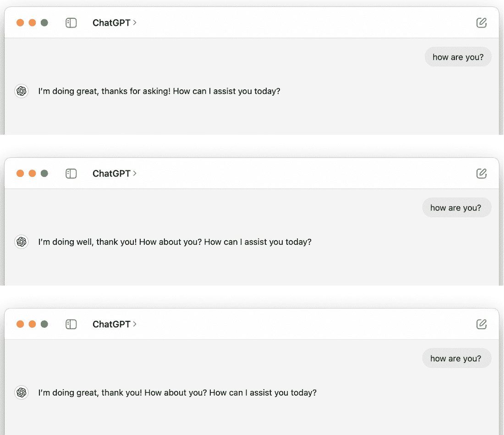
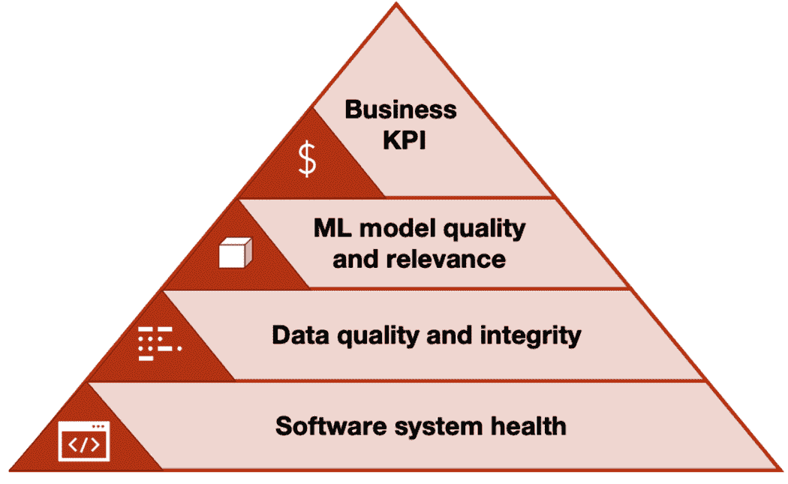
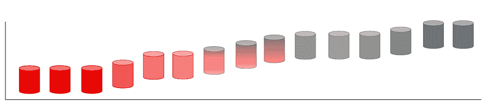

# 第十四章：14 监控和可靠性

### 本章涵盖

+   监控作为机器学习系统设计的一部分

+   软件系统健康

+   数据质量和完整性

+   模型质量和相关性

传统软件开发基于一个简单的原则：一个高质量构建的产品将具有高稳定性、效率和可预测性，这些价值不会随时间改变。相比之下，机器学习（ML）的世界更为复杂，对机器学习系统的工作并不随着其发布而结束。这有一个实际的解释；在前一种情况下，解决方案严格在预设计的算法内执行，而在后一种情况下，功能基于在有限数量的某些输入数据上训练的概率模型。

这意味着模型不可避免地会随着时间的推移而退化，以及经历意外行为的情况，这是由于它在训练时使用的数据与它在实际条件下将接收到的数据之间的差异。

这些是无法消除的风险，但你需要为它们做好准备，并能够减轻这些风险，以确保你的系统在长期内对你的业务保持有效和有价值。

在本章中，我们将探讨监控作为机器学习系统设计的一部分的本质，以及你的机器学习模型在运行过程中可能遇到的问题来源。我们还将探讨你希望如何监控系统行为变化的典型情况，以及你需要如何对这些情况做出反应。

## 14.1 监控的重要性

在生产中拥有一个运行的机器学习解决方案是一种极好的感觉。拥有适当的验证方案、测试覆盖范围以及工作着的持续集成和持续交付 CI/CD 则是一种更好（尽管更罕见）的感觉。不幸的是，这并不能保证你的系统在没有出现混乱的情况下保持稳定。在这里所说的混乱是指模型可能产生的任何意外、不合逻辑、完全错误且无法解释的输出，这些输出可能会严重影响系统输出——任何你不会期望从一个健康、可靠系统中看到的东西（至少在没有通知维护者并切换到回退之前）。

没有适当的监控，即使是最受训练和最准确的模型也可能随着时间的推移因所处理数据的变化而开始退化。这在重大变化时期尤为明显，例如最近的 COVID-19 大流行期间，用于预测商品可用性、信用风险等任务的模型必须面对巨大的挑战。通过实施监控系统，我们可以识别并解决数据质量问题，并确保我们的模型继续做出可靠的预测。

如果有人要求我们对一个通用的机器学习系统进行简化的高级审查，它很可能看起来像图 14.1。


##### 图 14.1 正常机器学习系统的简化结构

只有当所有阶段都固定，确切相同的样本数据通过精确相同的模型（相同的结构和相同的权重），并且该模型是非概率性的（世界上一些最受欢迎的模型，例如生成式 AI 冠军 ChatGPT 和 Midjourney，是概率性的；然而，为了完全严谨，我们可以固定一个随机生成器或种子来提高可重复性），并且具有精确相同的后处理时，我们才能期望得到确定性的（例如，可再现的）输出。实际上，这正是设计适当训练管道的主要原因之一，它有助于创建和维护可重复迭代的条件，从而为改进和实验提供支持。

然而，这种因素组合发生的概率极低，因为我们总是处理着众多可以以不同概率和影响程度改变模型输入。让我们从图 14.1 中的所有四个组成部分开始分析，了解我们可能会遇到哪些挑战。

### 14.1.1 输入数据

不幸的是，我们拥有的系统越复杂，数据输入可重复的可能性就越小（如果是这种情况，我们可以使用简单的缓存），这意味着我们可以假设每个输入都是唯一的。此外，数据中特定特征的分布可能会随时间变化，影响下游阶段。另一种可能性是数据管道中可能会出现故障并损坏数据，或者有人可能会以影响输出的方式处理输入，这种方式可能会产生预期的效果，有时甚至是有害的（然而，这通常与植入后门有关；参见“在机器学习模型中植入不可检测的后门”概述（[`arxiv.org/pdf/2204.06974.pdf`](https://arxiv.org/pdf/2204.06974.pdf)）。如果系统对这些扰动不稳健，事情可能在任何时刻都会适得其反。

### 14.1.2 模型

与输入数据不同，模型的架构（或结构）和权重可以保持稳定。当然，这取决于在线训练的存在（例如，以实时/准实时的方式根据输入数据更新模型）和计划更新（例如，每周在最新批次的数据上重新训练）。无论更新是批量学习还是在线学习，更新后的模型与之前并不完全相同。如果模型不同，相同数据的输出可能会改变，这正是我们重新训练模型的基本原因。尽管如此，我们仍然想要确保重新训练/更新对模型产生了充分的影响，并且是必须做的事情（回想第 13.2 节）。

另一件事是我们拥有的系统可能本质上是概率性的/生成性的。图 14.2 中显示的与 ChatGPT（截至 2024 年 7 月）的对话是一个相当有说明性的例子。



##### 图 14.2 通过让 ChatGPT 感到烦恼来确保它是一个相当非确定性的模型。尽管回复相似，但它们并不完全相同。

截图显示了 ChatGPT 的四个不同（尽管相似）的回复。虽然我们期望它在特定范围内表现，但没有相同的输出对于相同的输入使得检查系统的健康状况更具挑战性。哪个回复是可以接受的，哪个是不可以接受的？截至 2023 年 1 月，我们与 ChatGPT 的经验表明，连续收到几个完全不同或相互矛盾的答案并不罕见，尽管这在后续版本中得到了部分修复。

### 14.1.3 模型输出

这可能是一件相对罕见的事情，但模型的输出可能会因为所谓的*概念漂移*而变得不相关——例如，输入数据和输出结果之间潜在依赖关系的改变，使得模型建立的依赖关系变得过时和不足。这与输入数据分布的变化不同，因为虽然进入的数据分布保持不变，但之前正确分配给它们的标签现在却不同了。例如，根据 2022 年英国最近的一次税收变化，最高的税率现在适用于年收入 125,000 英镑的人，而之前的门槛是 150,000 英镑。现在想象一下，你有一个推广税务服务协助的市场营销活动，并有一个模型被设定为挑选最可能使用该服务的用户以保持在市场营销预算内。这种法律的变化会立即触发对你模型的许多改进。

另一个例子是时间滞后，导致对世界的理解变化发生在引发这些变化的事件之后。一个很好的例子是*麦道夫投资丑闻*，它是在最初的恶作剧几十年后才被揭露的。多年来，来自它的信号被审查为成功的对冲基金信号，但后来发现它是一个庞氏骗局。换句话说，多年来，进入的数据被标记为善意，最终却证明是欺诈的。

### 14.1.4 后处理/决策制定

重要的是要意识到机器学习模型的质量与其预期带来的商业价值之间可能存在不匹配。有几个因素可能导致这种不匹配，包括模型使用环境中发生的变化，以及模型使用方式的变化。

如果模型被设计来支持特定的业务流程，那么随着时间的推移，如果流程发生变化，它可能就不再有效。例如，假设该模型被设置为根据用户的未来收入来优先处理客户支持的新到票务，而新的流程是专注于解决最快的票务。同样，如果模型没有被按照预期的方式使用，或者根本没有被使用，它可能无法实现预期的商业价值。为了减轻这些风险，持续监控机器学习模型的性能和它所提供的商业价值，并在必要时进行调整，以确保模型能够支持预期的商业目标是非常重要的。

在接下来的章节中，我们将讨论可能出现的最常见问题，主要关注前三个阶段。我们将讨论如何监控和检测这些问题，如果发生了变化应该做什么，以及如何将这些内容纳入设计文档，以便您能够在事情发生之前进行规划，而不是在事情发生后。在我们深入探讨潜在的故障和应对方法之前，让我们先讨论监控机器学习系统的主要组件。在 Elena Samuylova 的文章“在生产中监控机器学习系统。你应该跟踪哪些指标？”([`mng.bz/86B2`](https://mng.bz/86B2))中，她强调了机器学习系统监控的四个基本组成部分，如图 14.3 所示。



##### 图 14.3 机器学习系统监控的核心组件（来源：[`mng.bz/86B2`](https://mng.bz/86B2))

正确监控的基础是软件后端，随后是数据质量和完整性、模型质量和相关性，以及业务关键绩效指标（KPIs）。乍一看，最后一个点可能看似无关紧要，因为它本身不是机器学习系统的一部分，但一个被破坏的系统可能对我们的 KPIs 以及最终对业务本身的影响不容小觑。让我们从金字塔的底层开始，逆向分析每一层。

## 14.2 软件系统健康

将软件后端视为设计的基础至关重要。这包括监控软件性能，确保其正常运行、高效执行任务，并快速响应请求。未能优先考虑软件后端的稳定性和性能可能会对机器学习系统的整体有效性产生不利影响。由于本书涵盖了机器学习系统设计的原理，而市面上有许多关于“常规”软件系统设计和其可靠性的书籍，我们不会对此进行深入探讨。然而，这一点自然需要被考虑，因为任何系统都是其最薄弱环节的强度。对于系统健康的更深入分析，请参阅 Chris Jones 等人的文章（[`mng.bz/EOAl`](https://mng.bz/EOAl))。

监控机器学习系统的健康状况是生产部署的重要方面。确保系统正常运行并跟踪其性能特征以满足服务级别目标是至关重要的。许多在传统软件系统中使用的监控实践——例如应用和基础设施监控、警报和事件管理——也可以应用于机器学习系统。这些实践可以帮助确保机器学习系统的健康和性能，并在出现任何问题时进行及时干预。通过使用为传统软件系统开发的工具和实践，可以在生产中有效地监控和管理机器学习系统的健康和性能。

根据机器学习系统的部署架构，可以监控各种指标。这些可以包括服务使用指标，例如模型调用总数、每秒请求数和错误率，以及系统性能指标，例如正常运行时间、延迟、冷启动时间、错误率和资源利用率指标，如内存和 GPU/CPU 利用率。仔细选择几个关键指标来量化服务性能的不同方面，通常被称为*服务级别指标*，这是非常重要的。这些指标可以帮助识别系统问题，并允许及时干预以防止故障或性能下降。

记录事件和预测及其时间戳以监控和调试您的机器学习系统非常重要。在机器学习系统的背景下，如果可行且符合预算（在某些情况下，存储每个中间模型输出可能会严重影响利润率），我们建议记录每个预测的数据，包括输入特征和模型输出。这将使您能够跟踪模型的性能并识别可能出现的任何问题。作为一般规则，除非有特定情况，例如隐私法规或用户设备上边缘模型的使用，阻止您这样做，否则您应该记录每个预测。在这些情况下，可能需要开发解决方案来收集和标记一些数据。

除了预测日志之外，还非常重要地拥有软件系统日志——提供有关您的机器学习应用程序内部发生情况的时间戳事件。访问这些日志对于调试可能出现的问题以及提高模型性能非常有帮助。有多种工具可以帮助您集中和分析这些日志，例如开源工具中的 Prometheus 和 Grafana，或云服务中的 AWS Cloudwatch 或 Datadog。

注意：您可以随时删除后来认为不必要的事件日志，但无法事后添加它们。如果没有提供新的上下文，则不要记录；换句话说，确保日志包含适当的值和 ID，而不仅仅是静态语句。

以下展示了糟糕的日志消息和良好的日志消息的例子：

```py
❌ logger.info("Fraud probability calculated")
✅ logger.info(f"Fraud probability = {score:.3f} for user id {user_id}")
```

领英的模型健康保障平台([`mng.bz/dZEo`](https://mng.bz/dZEo))可以提供一些关于这个主题的想法。谷歌的服务级别目标([`mng.bz/r1eJ`](https://mng.bz/r1eJ))可以提供确保系统健康所需的必要词汇。

日志和指标应存储在系统中，以便进行探索和警报。为此有多种软件解决方案。日志方面，ELK 堆栈（Elasticsearch、Logstash 和 Kibana）是自托管系统的良好例子，而 Prometheus 或 Victoria Metrics 用于指标。类似系统通常由一站式云提供商（例如 AWS Cloudwatch）和更专业的公司（如 Datadog）提供。正如我们在第十三章中提到的，将您的机器学习系统连接到适当的日志/指标工具集是必须的，尽管经验不足的工程师往往低估了这一步骤的重要性。

## 14.3 数据质量和完整性

数据质量监控对于确保用于训练和预测的机器学习模型的数据准确性和可靠性至关重要。使用有缺陷的数据将不可避免地导致模型产生错误的预测。为了保持对数据的信任，可能需要停止并使用备用方案，直到数据质量恢复，或者调查并解决出现的问题。接下来，我们将讨论可能需要备用方案的最常见情况。

### 14.3.1 处理问题

系统通常依赖于各种上游系统来提供输入数据。然而，这些数据源可能会引发问题，影响您的机器学习系统的性能。例如，数据可能无法接收或可能已损坏，这可能是数据管道中存在问题造成的。想象一下，一个为客户端个性化促销活动的机器学习系统可能依赖于来自内部客户数据库、点击流日志和呼叫中心日志的数据，这些数据被合并并存储在数据仓库中。如果这些数据源中的任何一个出现问题时，它可能会影响整个系统的运行。

我们最喜欢的例子之一是，当一项工作处理零行并报告成功（UI 报告中预期的绿色方块表示提取、传输和加载作业的成功执行）时，每个人都感到高兴——直到一周后我们发现上游数据源存在问题。

此外，机器学习管道的数据处理阶段也可能容易出问题。这可以包括数据源问题、数据访问问题、用于提取数据的 SQL 或其他查询中的错误、更改数据格式的基础设施更新以及用于计算特征的代码中的问题。在批量推理系统中，通过重新运行模型可以检测和纠正这些问题。然而，在高负载流模型中，如电子商务或银行中使用的模型，由于处理的数据量很大，并且基于模型输出做出实时决策，数据处理问题的后果可能更为严重。

### 14.3.2 数据源损坏

除了变化之外，数据还可能因为数据源的问题而丢失。这可能是由于错误、物理故障或外部 API 的问题。密切监控数据管道对于早期发现问题至关重要，因为这些问题可能导致未来重新训练数据的不可逆损失。

有时，这些中断可能只会影响数据的一个子集，使问题更难检测。此外，一个损坏的源仍然可能提供数据，但这些数据可能是错误的或误导性的。在这些情况下，跟踪异常的数字和模式以识别潜在问题至关重要。这些故障可以是渐进的，也可以是瞬间的。让我们想象两个用于工业需求的计算机视觉系统：一个用于无菌装配线，在那里拍摄并分析半组装设备的照片，另一个用于巨大的钢铁厂，它监控金属废料如何变成新的合金。第一个系统可能会突然出现灯光故障，因此数据流突然变暗。第二个系统受灰尘和温度的影响；因此，随着时间的推移，相机镜头会退化。

如果检测到数据源问题，重要的是评估损害并采取适当的行动，例如在必要时更新、替换或暂停模型。

一些数据源问题，遗憾的是，是不可避免的。想象一下为一家市场构建推荐系统，其中一些商家填写了他们商品的每个属性，而其他人则忽略了可选字段。在这种情况下，一个明智的选择是在特征工程阶段提前考虑这个问题，使模型忽略这些情况。

让我们来看一个更具体的例子：

```py
def get_average_rating(item):
    # return average rating across all item reviews, 1 - 5 stars
    try:
        # happy case, read from DB and return the number
        ...
    except Exception:
        return -1
```

如果`–1`没有被下游替换，这种方法并不是处理可能缺失或损坏数据的最佳方式。虽然返回一些不可能的值在底层编程中是一种常见做法，但对于机器学习来说，返回其他项目的中值等类似值可能更合适。

### 14.3.3 级联/上游模型

在更复杂的机器学习系统中，可能会有几个相互依赖的模型，其中一个模型的输出作为另一个模型的输入。这可能会形成一个相互连接的模型循环，这可能会使系统容易受到问题的攻击（参见图 14.4）。


##### 图 14.4 输入数据通过一系列模型进行处理；即使第一个模型出现微小的漂移，也可能导致下游累积误差。

阿尔谢尼在一家使用一系列模型的公司的任职；首先，命名实体识别模型提取核心实体；随后它们通过多个内部和外部数据集进行丰富，最终结果用于分类。系统的各个组件由不同的人开发和维护，有时可能导致命名实体识别模型在其自身指标上表现出改进，而下游分类器的性能却下降。幸运的是，在第一次捕捉到问题后，工程师实施了跨栈检查，因此不再可能在上游模型没有进行适当的检查的情况下部署新版本，从而提前捕捉到潜在故障。

例如，在一个内容或产品推荐引擎中，一个模型可能预测产品或商品的流行度。相比之下，另一个模型根据估计的流行度向用户推荐。如果流行度预测模型不正确，这可能导致第二个模型提供的推荐不正确。

类似的问题也可能出现在汽车路线导航系统中，其中模型预测各种路线的预期到达时间，另一个模型对选项进行排序并建议最佳路线。如果预测预期到达时间的模型存在问题，这可能导致错误的路线推荐，进而影响交通模式。

这种类型的互联系统如果其中一个模型出现问题，可能会面临问题，导致整个系统出现连锁反应的负面行动。精心设计和监控这些类型的系统对于确保它们正常运作至关重要。

### 14.3.4 架构变更

数据架构的更改，其中数据的格式、类型或结构发生改变，可能对机器学习系统构成重大挑战。这些更改可能导致模型失去信号，因为它可能无法将新类别与旧类别匹配或处理新特征。这在依赖于基于类别类型的复杂特征的系统中尤其成问题，因为类别的更改可能要求模型重新学习如何解释数据。

例如，在需求预测或电子商务推荐系统中，产品目录的更改可能影响模型对数据的理解。同样，业务系统的更新或新数据源或 API 的引入也可能导致问题，如果模型没有在新数据上训练过的话。（更多信息请见第六章。）

为了减轻数据模式变化的影响，设计模型时必须考虑到这种可能性，并教育业务用户了解这些类型变化可能带来的潜在后果。数据质量监控还可以帮助在问题出现时识别和解决这些问题。

### 14.3.5 训练-服务偏差

训练-服务偏差是指一个机器学习模型在真实世界数据上表现不佳的情况，因为它是在一个人工构建或清理的数据集上训练的，而这个数据集并不能准确代表它将要应用的数据。这可能会发生在训练数据不完整或不足以充分捕捉现实世界的多样性和复杂性时（详见第六章的详细信息）。


##### 图 14.5 这种在沙盒图像集和真实照片之间的巨大差异可能导致模型性能显著下降。

训练-服务偏差的一个例子是，在一个有限的众包图像集上训练的模型，当应用于具有广泛数据格式和图像质量的真实世界图像时表现不佳。同样，在一个实验室环境中使用高质量图像训练的模型可能难以在光线条件较差的真实世界图像上表现良好（见图 14.5）。

##### 营火故事

这个故事是由我们的一位朋友讲述的。有一家公司正在开发一个基于相机数据的计算机视觉增强现实应用程序；公司的办公室位于波罗的海边的俄罗斯城市圣彼得堡。圣彼得堡以其多云天气而闻名——平均每年阳光小时数约为 1,600 小时。工程师们在那里收集了大部分数据并测试了他们的产品。

公司的主要投资者位于地中海国家塞浦路斯，那里每年有 3,400 小时的阳光。因此，当他们在测试产品的预发布版本时，他们感到非常害怕——机器学习组件工作得如此糟糕！经过短暂的调查，工程师们意识到问题是由数据分布不匹配造成的：他们使用的户外场景是在俄罗斯冬天的多云和雨天环境中拍摄的，而投资者在塞浦路斯的夏日烈日下测试了产品。

为了解决训练-服务偏差，可能需要继续开发模型，通过收集和标记新的数据集或根据不成功的试验运行中的数据调整现有模型。有时试验运行可能会产生足够的数据来训练新的模型或调整现有模型。Will Douglas Heaven 在《Technology Review》上发表了一篇关于谷歌医疗人工智能的精彩文章([`mng.bz/V2ay`](https://mng.bz/V2ay))。请注意，这与我们将在下一节中回顾的数据漂移场景有些相似。

### 14.3.6 如何监控和反应

预见危险，一半避免，因此监控的第一步和最重要的步骤是事先知道可能出错的情况。除此之外，我们还试图提供一些可操作的建议。

数据质量监控在机器学习中是特定的，因为它涉及确保我们用于训练和用机器学习模型进行预测的数据满足特定期望。然而，对于其他分析用例也是必要的；在这里，可以重用现有的方法和工具。

传统的数据监控通常在宏观层面进行，例如监控仓库中所有数据资产和流程，但机器学习需要更细粒度的监控，专注于特定的模型输入。在某些情况下，你可以依赖现有的上游数据质量监控。然而，可能还需要进行额外的检查，以控制特征转换步骤、实时模型输入或外部数据源。

可以监控各种指标以确保用于机器学习模型的数据质量。以下是一些常见的指标和检查类型：

+   *检查缺失数据*意味着在特定特征和模型输入中整体缺失数据份额中寻找丢失的数据。通常，一些缺失值是可以接受的，但确保缺失数据的水平保持在可接受的范围内很重要，无论是对于整个数据集还是对于单个特征。你还应该检查缺失数据的各种表达方式，如“N/A”、“NaN”或“undefined”，因为简单的缺失值检查可能无法捕捉到所有情况。你可以使用像图表这样的视觉辅助工具来用你的眼睛识别缺失数据，并设定一个阈值，当缺失值过多时暂停模型或使用回退方案。根据模型特征重要性或 SHAP 值（见第十一章了解更多细节）识别数据集中的关键驱动因素也有帮助，并确保这些数据不是缺失的。这将允许你为关键特征和辅助特征设置不同的监控策略。

+   *重复数据*是前一个问题相反的问题，也可能很危险。重复通常发生在整个数据集的一个子集上，这改变了数据分布，影响了下游模型。

+   *数据模式验证*验证输入模式是否符合预期，以检测错误输入并跟踪新列或类别出现等问题。

+   对个体特征类型的约束确保了特定的特征类型，例如*确保一个特征是数值型的*。这种方法可以捕捉到输入错误，例如一个特征以错误格式到达。

+   重要的是*检查模型调用的次数*以确保模型正常运行。如果预计模型将定期使用，这尤其有用，因为它可以帮助您识别任何突然的变化或偏离典型使用模式。此外，检查模型响应的次数可以帮助您检测模型是否遇到问题或服务本身是否存在问题。这有助于防止服务中断并确保系统继续平稳运行。最后但同样重要的是，这项检查非常容易实施。

+   通过对*单个特征范围*的约束，可以制定关于“正常”特征值的期望，例如合理性检查（例如，“年龄小于 100”）或特定领域的检查（“正常传感器操作条件在 10 到 12 之间”）。约束的违反可能是数据质量问题的症状。它可能从常识性检查开始，但对于更复杂的领域，则需要深入了解问题。

+   特征统计跟踪特定特征的均值、最小-最大范围、标准差、特征之间的相关性、百分位数分布或特定的统计测试。这有助于*揭示不太明显的失败*，例如，在预期范围内某个特征异常行为。对于分类特征，可以使用直方图/类分布进行手动检查；然而，它们对于自动数据质量监控来说并不容易。

+   通过*异常效应*，可以使用异常和离群值检测方法来检测“不寻常”的数据点并捕获损坏的输入。这将允许您专注于检测单个离群值或跟踪它们的总体率。

对于非结构化数据，如图像、文本或音频，可以应用类似的原则。我们无法应用像“客户年龄应在 12 到 100 之间”这样的原始检查，但我们可以引入将在测试中使用的数据之上的简单特征。这些特征不必直接用于模型（因此我们仍然直接将深度学习模型应用于图像），但仅用于数据质量监控。对于图像，可以是亮度或颜色温度；对于文本，可以是长度（字符数）；对于音频，可以是波频分布。

在大多数情况下，对于管道中的每个步骤分别*验证输入和输出*可能是有用的，这样可以更容易地确定问题的来源。如果您的管道复杂且涉及多个步骤，例如合并来自不同来源的数据或应用多个转换，这尤其有帮助。通过在管道的不同阶段运行检查，您可以定位任何问题的来源并更快地进行调试。另一方面，如果您只验证最终计算的输出，并注意到某些特征不正确，那么确定问题的来源可能更困难，您可能需要回溯管道中的每个步骤。

监控指标的选择将取决于各种因素，如模型的部署架构（例如，批量、实时服务或流式工作流程）、数据的特定性和现实世界过程、用例的重要性以及期望的反应级别。例如，如果失败的成本很高，可能需要更详细的数据质量检查，并在采取预测行动之前添加在线数据质量验证的通过/失败结果。在其他情况下，更积极的策略可能就足够了，例如跟踪特定特征的平均值或缺失数据在仪表板上的份额，以监控随时间的变化。

机器学习中数据质量监控的一个挑战是监控过程的执行。确保输入到机器学习管道中的数据质量至关重要，但设置监控系统可能很耗时。这尤其适用于你需要在机器学习团队之外将专家领域知识编码化，或者如果你需要设置许多检查，例如监控原始输入数据和后处理特征值。

另一个挑战是在数据质量监控过程中管理大量触点。设计监控框架以检测关键问题而不被淹没是很重要的。如果你的监控系统每天发送数十个假警报，你最终会忽略其信号，因此找到适当的敏感性平衡至关重要。

最后，追踪数据质量问题根源可能很困难，尤其是当你有一个包含许多步骤和转换的复杂管道时。数据质量监控与数据溯源和追踪紧密相连，设置这一过程可能需要额外的工作。

我们强烈推荐阅读一篇来自谷歌的论文，名为“机器学习中的数据验证”（[`research.google/pubs/pub47967/`](https://research.google/pubs/pub47967/))。

以下是对该论文的高度浓缩总结，其中列出了我们推荐采取以有效监控系统的行动：

+   识别对机器学习用例至关重要的*关键数据质量维度*，例如完整性、准确性、及时性和一致性。

+   为每个维度设置数据质量*约束*，并定义每个约束的可接受范围。例如，你可能设置一个约束，即数据必须是完整的，缺失值不超过 5%。

+   实施一个*数据验证管道*，定期运行以检查数据是否符合定义的约束。该管道应生成一个报告，指出每个维度的数据质量状态。

+   当数据质量超出可接受范围时，设置*可靠的警报和通知*。这将允许你及时采取行动修复任何问题。可靠性是假阳性与假阴性的平衡，这取决于具体情境。

+   *持续监控*并随着时间的推移提高数据质量。这可能涉及根据你对数据和机器学习用例的了解更新约束或添加新的约束。

对于详细审查，请参阅之前提到的谷歌论文。

我们建议建立一个数据治理框架，以确保数据验证系统得到适当维护并与业务目标保持一致。这可能包括建立数据质量管理角色的职责，以及建立数据质量改进和问题解决流程。

## 14.4 模型质量和相关性

即使软件系统运行正常且数据质量高，这也不能保证机器学习模型会按预期执行。可能出现的一个问题是模型退化，这发生在模型开始表现不佳时——要么突然，要么逐渐。

*模型退化*，也称为*模型漂移*或陈旧，指的是模型性能随时间下降的现象。这可能由多种原因引起，例如数据的变化或模型训练所基于的现实世界关系的变化。模型退化的速度可能差异很大；一些模型可能几年都不需要更新，而其他模型可能需要每天在新鲜数据上进行重新训练。监控模型退化的方法之一是定期跟踪关键性能指标，并将它们与历史基线进行比较。如果指标开始显著下降，这可能表明模型退化（见图 14.6）。


##### 图 14.6 定期重新训练可以帮助解决模型漂移问题。

模型漂移主要有两种类型（见图 14.7）：

+   *数据漂移*发生在模型应用于其之前未曾遇到过的输入时，例如来自新人口统计数据的数据。这意味着原始数据集不足以让模型进行泛化。

+   当数据中的关系发生变化时，例如用户行为演变时，会发生*概念漂移*。持续监控模型漂移并采取适当的行动很重要。一种解决方案是重新训练模型以保持其准确性和效率。


##### 图 14.7 在概念漂移中，相同的输入可能导致新的预期输出；在数据漂移中，当模型未适应时，传入的数据发生变化。

模型漂移的可能原因包括

+   全球环境的转变，例如流行病/战争/危机/立法变化的开始。

+   故意的商业变化，例如在新的地点或针对新的用户群体推出应用程序。

+   当恶意行为者试图适应模型的行为时，会发生对抗性适应。

+   模型反馈循环，其中模型本身影响现实。例如，推荐系统使用当前项目流行度作为特征并频繁推荐它，因此该项目变得更加流行，从而实现自我强化。

+   模型退化有时会在模型的设计与其实际使用之间存在不匹配时发生。例如，如果一个潜在客户评分模型被设计用来预测转化概率，但用户开始通过提供不同的输入组合来使用它进行场景分析，以了解不同因素对模型决策的影响，这可能导致模型性能不佳。这些情况可能需要一种更适合预期用例的分析工具。阿森尼在他的职业生涯中也犯了一个类似的错误：在一家叫车公司，他的团队构建了一个模型来估计出租车司机到达目的地所需的时间。模型本身是好的，但他们试图将其应用于一个略有不同的场景（估计整体行程时间），结果模型表现不佳。最初的问题是关于短途旅行（免费司机接乘客），但后者也可能涉及长途旅行。

有些人区分*输出漂移*，它指的是机器学习模型产生的预测、推荐或其他输出的变化。这种变化可以通过使用统计测试或描述性统计将“新”输出数据与“旧”输出数据进行比较来检测。例如，如果一个很少推荐购物者购买太阳镜的模型现在在每一个推荐块中都推动它们，这可能表明输出漂移。

我们将输出漂移视为监控和检测模型漂移的指标之一，因为它可以表明模型性能的变化或输入和输出数据之间关系的变化，这属于概念漂移或数据漂移。通过识别和解决输出漂移，你可以帮助确保模型继续产生可靠和准确的结果。

模型漂移可能导致模型误差增加或预测错误，在严重的情况下，模型可能一夜之间变得不适用。持续监控模型漂移并采取适当的行动以保持模型的准确性和有效性是非常重要的（参见第八章以了解更多背景信息）。

### 14.4.1 数据漂移

*数据漂移*，也称为*特征漂移*或*协变量偏移*，指的是当机器学习模型的输入数据发生变化，以至于模型对新数据不再相关的情况。这可能会发生在数据中变量的分布与模型训练时的分布显著不同时。因此，模型可能在新的数据上表现不佳，即使它在与“旧”数据相似的数据上可能仍然表现良好。

数据漂移的一个例子是，当训练用于预测用户在在线市场购买可能性的机器学习模型应用于通过不同广告活动获得的新的用户群体时。如果新用户来自不同的来源，例如 Facebook，而在训练期间模型没有很多来自这个来源的示例，那么它可能在这个新用户群体上的表现不佳。同样，如果模型应用于新的地理区域或人口统计群体，或者数据中重要特征的分布随时间变化，也可能发生数据漂移。

为了解决数据漂移问题，可能需要在新的数据上重新训练模型或为新的数据段构建一个全新的模型。监控数据和模型性能可以帮助早期发现数据漂移并采取纠正措施，以防止模型性能显著下降。由于数据漂移并非数据本身固有的错误，因此它必须在模型层面上进行修复。

### 14.4.2 概念漂移

当模型学习到的模式不再有效，即使输入特征的分布保持不变时，就会发生**概念漂移**。根据变化规模的大小，概念漂移可能导致模型准确性的下降，甚至使模型完全过时。

存在几种类型的概念漂移：**渐进式概念漂移**、**突发式概念漂移**和**周期性概念漂移**。**渐进式**或**增量式漂移**发生在外部因素随时间变化时，导致模型性能逐渐下降（见图 14.8）。这种漂移通常是可预见的，可能由多种因素引起，包括消费者行为的变化、经济的变化，或者当数据来自物理传感器时设备的磨损。



##### 图 14.8 渐进式概念漂移

为了解决渐进式概念漂移，可能需要在新的数据上重新训练模型，甚至完全重建。为了确定是否需要这样做，监控模型性能随时间的变化是至关重要的，以确保它继续做出准确和可靠的预测。模型性能下降的速度或“老化”速度可能因具体应用和数据而异。

为了估计模型老化速度的快慢，使用较旧的数据进行测试并测量模型在不同重新训练频率下的性能是有帮助的。这可以给出一个指标，表明模型应该多频繁地用新数据更新以保持其准确性。同时，考虑外部因素的影响也是至关重要的，例如市场变化或新产品的推出，这些都可能影响模型输入和输出之间的关系，导致概念漂移。

监控机器学习模型的表现，并在必要时定期重新训练它们，是保持其在生产环境中有效性的关键方面。

*突然的概念漂移*通常是由于突然或剧烈的外部变化引起的，这些变化可能很难忽视。这类变化可能影响各种模型，甚至那些通常被认为是“稳定”的模型。例如，COVID-19 大流行几乎一夜之间影响了移动性和购物模式，导致需求预测模型无法预测某些产品需求的激增或由于边境关闭而取消大多数航班。除了大流行或股市崩盘等事件之外，突然的概念漂移也可能由于中央银行利率的变化、生产线的技术改造或应用程序界面的重大更新而出现。这些变化可能导致模型无法适应未见过的模式，变得过时，或由于用户旅程的变化而变得不相关。

在机器学习系统中，某些事件或模式随时间重复出现是很常见的。例如，人们在假日季节或一周中的某些日子可能会表现出不同的行为。这些重复变化，也称为*反复漂移*，可以在系统设计中预先考虑并加以考虑（见图 14.9）。例如，我们可以构建一组模型，在特定条件下应用，或将周期性变化和特殊事件纳入系统设计，以考虑这种反复漂移并防止模型性能下降。


##### 图 14.9 概念漂移的反复出现

### 14.4.3 如何监控

监控模型质量有两个主要目的：

+   为了让您对模型的可靠性有信心

+   当出现问题时提醒您

一个有效的监控设置应该提供足够的信息，以便有效地识别和修复模型中出现的任何问题。这可能涉及三种主要场景：

+   重新训练模型

+   重建模型

+   使用备份策略

与其他数据模式（如图像或语音）相比，数据漂移对于表格数据可能更为显著。如果预测和真实数据可用之间存在延迟，这可能就是监控数据漂移和预测漂移等代理指标信号的信号。对于高风险或关键模型，您可能会使用更细粒度的监控和特定指标（例如，公平性）。低风险模型可能只需要监控与模型类型相关的标准指标。

有数百种不同的指标可以用来评估机器学习模型的表现（参见第五章）。我们将涵盖这些指标可以分组的几个类别。

*模型质量指标*评估模型预测的实际质量。这些指标可以在获得真实数据或反馈后计算，可能包括

+   回归模型的平均绝对误差和均方根误差

+   分类模型的准确率、精确率和 F1 分数

+   排名模型的 Top-k 准确率和平均平均精度

*按段模型质量*涉及跟踪数据中特定子群体的模型性能，例如地理位置。这有助于识别特定段落的性能差异。

*预测漂移*发生在模型的预测随时间显著变化时。为了检测预测漂移，可以使用统计测试、概率距离度量或模型输出描述性统计的变化。我们建议阅读 Olga Filippova 的文章以获取更多详细信息（[`mng.bz/x60d`](https://mng.bz/x60d)）。

*输入数据漂移*指的是模型使用的输入数据的变化。这可以通过跟踪单个特征的描述性统计变化、运行统计测试、使用距离度量比较分布或识别特征和预测之间的线性相关性变化来检测。监控输入数据漂移可以帮助确定模型何时在陌生的环境中运行。

*异常值*是那些模型可能无法按预期表现的不寻常的个体案例；识别这些并标记它们以供专家审查是很重要的。请注意，这与数据漂移不同，数据漂移的目标是检测整体分布的变化。可以使用统计方法和距离度量来检测异常值。

##### Valerii 的篝火故事

当我在一家著名的加密公司工作时，我变成了其服务的狂热用户，其中当然包括使用法定货币购买加密货币的基本机会。有一天我尝试这样做，并成功了，直到我被反欺诈系统阻止。

为什么我被阻止了？因为我做了太多的交易。那为什么会这样？因为同一团队引入的交易限制迫使我做了比平时更多的交易。这是处理异常值的一种可能方式——在这种情况下，依赖于单一特征（做了太多交易的人）——但这可能不太用户友好，并导致失去这些用户的收入。幸运的是，我们能够进一步改进这个系统，并实施多阶段异常值检测和特定流程（有时可能包括人工审查）来处理它们。

*公平性*也很关键。对于某些用例，你应该确保模型对不同人口群体具有相同的效率。可以使用人口统计学对等性和均衡赔率等指标来评估模型偏差。

监控过程不能没有隐蔽的挑战。这包括

+   *缺乏蓝图**——*这属于仍然没有稳固的即用型解决方案的问题列表，因为适当的指标和启发式方法取决于特定的上下文和模型的目标。因此，了解模型和数据对于选择正确的监控方法很重要。

+   *无真实标签的监控**—*在没有访问真实标签的情况下，评估模型预测的实际质量通常很困难。在这些情况下，一个解决方案是使用代理度量值，同时仔细考虑如何设置阈值和触发警报。

+   *在规模上计算度量值**—*在大型规模上计算复杂的度量值可能会非常耗费计算资源，尤其是在与分布式系统一起工作时。找到一种快速、高效且可扩展的方式来计算度量值是至关重要的。

### 14.4.4 如何反应

要涵盖所有可能的情况和解决数据漂移和概念漂移的方法，需要单独的一本书，但接下来我们将讨论一些情况。

#### 数据漂移

面对数据漂移，你有两种选择。第一种选择是监控模型的性能，寻找准确度、平均误差和欺诈率等指标的变化。如果性能下降，你可能需要重新评估模型，并确定它是否仍然适用于当前数据。第二种选择是将额外的数据或特征纳入模型，以更准确地捕捉数据中的变化模式。在某些情况下，你应该考虑使用更新后的数据从头开始重新训练模型。

如果有新的标签可用且训练管道正在运行，按下重新训练按钮是非常诱人的（你可以在 Emeli Dral 的文章中找到更多信息，[`mng.bz/AaYo`](https://mng.bz/AaYo))。但如果我们深入挖掘，在此之前我们还可以做一些事情。

检查问题是否与数据质量有关，或者是否是模型试图捕捉的模式中的真正变化。数据质量问题可能来自各种来源，例如数据输入错误、数据模式的变化或上游模型的问题。在检测到数据质量问题后，立即采取措施进行监控和处理非常重要（参见第 14.3 节）。

如果数据漂移是真实的，尝试调查变化的原因。这有助于我们了解如何以最佳方式解决问题，并保持模型的准确性和有效性。

开始这个过程的其中一种方式是绘制经历过漂移的特征的分布，因为这可以提供关于变化本质的见解。另一个有帮助的步骤是与领域专家进行咨询，他们可能对可能导致变化的现实世界因素有所了解。

在检测到概念漂移的情况下，特征与模型输出之间的关系可能会发生变化，即使个别特征分布保持相似。可视化这些关系可以进一步了解漂移的性质。例如，绘制特征与模型预测之间的相关性可以突出这些关系的变化。从绘制成对特征相关性的变化中也可能获得额外的见解。

确定观察到的漂移是否具有意义并需要响应是很重要的。这可能涉及为特定用例设置定制的漂移检测阈值，并设置为对可能的重要变化发出警报。

然而，通常需要通过试错来迭代这些阈值，因为很难提前准确预测数据随时间推移将如何漂移。当生产环境中触发漂移警报时，我们需要仔细评估其性质和程度，以及它可能对模型性能产生的影响。这可能涉及咨询领域专家或进行进一步分析，以获得对变化的更深入理解。基于这种评估，你将能够决定是否处理漂移。在某些情况下，你可能能够理解漂移的原因，并决定（暂时）接受这些变化而不是采取行动解决问题。

例如，假设在不久的将来可能会获得额外的标签或数据。在这种情况下，可能值得等到可以考虑到这些信息后再采取行动。如果这是一个误报，我们可以更改漂移警报条件或统计测试，以及丢弃通知，以避免未来收到类似的警报。

在某些情况下，即使存在漂移，模型仍然可能表现良好。例如，如果模型预测中某个特定类别变得更加普遍，但这与观察到的特征漂移和预期行为一致，可能不需要采取任何进一步行动。在这些情况下，可能可以继续使用模型而不需要重新训练或更新它。然而，鉴于这一决策的潜在后果，密切监控模型以确保其有效性至关重要。

*调整*在管道中使用的预处理。例如，假设你的系统使用工厂中相机捕获的图像。在某个时候，工厂经理决定升级灯泡，因此生产线现在照明充足，图像也是如此。一旦由于漂移影响了模型性能，一个解决方案可以是应用人工的“变暗”函数来模拟原始数据分布。

*使用更新或新的数据重新训练模型。* 这通常是最直接的方法，如果可以获得必要的数据，则可能有效。通过使用更新或新的数据重新训练模型，你应该提高其性能并适应数据中的变化模式（如果数据管道中没有出现故障）。如果你遵循第十章中的良好实践，重新训练模型应该相对简单。

而不是点击重新训练按钮，你可以*考虑开发一个对漂移更具鲁棒性的机器学习模型。* 这可能涉及应用更鲁棒的模型架构（例如，为在线学习设计的架构）或使用诸如领域自适应等技术来使模型更能抵御数据分布的变化。以下是一些关于解决数据漂移的选项的额外细节：

+   *重新加权样本**—*这涉及到在训练数据中给予较近样本更多的权重，以优先考虑较新的模式。这可能是一种简单处理数据漂移的方法，但它可能并不总是有效，尤其是在漂移显著时。

+   *为不同的数据段创建单独的模型**—*如果模型在某些数据段失败，你可以考虑为这些段创建一个专门的模型。或者，你可以使用模型集成，其中每个模型负责不同的数据段。 (根据我们的经验，一个模型几乎总是比多个模型好，因为它包含了更多数据，但上下文是王。)

+   *更改预测目标**—*通过更改预测目标，你可能能够提高模型的表现。例如，从每周预测切换到每日预测可能允许模型更好地捕捉数据中的短期变化。或者，你可以更改所使用的模型类型，例如从回归模型切换到分类模型（在某种程度上，这可能是审查问题的更粗略方式）。

+   *将人类专家知识融入模型训练过程**—*你可以使用专家特征或主动学习技术来指导模型训练数据的选取。最终，最有效的方法将取决于你数据的特定特征和你的应用需求。

+   *引入更多正则化**—*包括可以隐式处理漂移的技术。让我们回顾一下增强技术；它们是一种流行的正则化实践，并且你可以设计它们时考虑到可能发生在域中的漂移。例如，对于图像数据，模拟不同的天气条件可能是有用的。

+   *使用更强大的预训练模型作为初始化器**—*在深度学习领域，如果初始模型是在更大、更多样化的数据集上训练的，那么训练自定义模型效果更好，因为它往往具有更好的泛化能力。

处理数据分布变化的一种策略是*识别和隔离表现不佳的数据段*。当变化不是普遍的，只影响数据的一个特定子集时，这特别有用。

要做到这一点，你可以从分析数据的变化特征和识别任何与模型性能的潜在相关性开始。例如，如果你看到某个特征（例如，位置）的分布发生了变化，你可能尝试通过该特征过滤数据，看看它是否导致了低性能。

一旦你能够识别数据中的低性能段，你可以决定如何处理它们。一个选择是为这些段进行不同的预测路由，要么依靠启发式方法，要么手动整理输出。或者，你可以单独识别这些段，直到收集到足够的新标记数据来更新模型。

最后，在单独的工作流程中处理异常值也可以帮助限制数据漂移下的错误。异常值是与其他数据显著不同的单个数据点，单独处理它们可以帮助确保模型可以继续有效运行。

另一种解决数据漂移的选项是在模型之上应用额外的业务逻辑，通过调整模型预测或更改应用程序逻辑来实现。这种方法可能有效，但难以推广，并且如果不小心操作，可能会产生意外的后果。

这种方法的良好例子是手动纠正输出，这在预测需求中很常见。针对特定商品、类别和地区的业务规则可以用来调整模型对促销活动、营销活动和已知事件的预测。在数据漂移的情况下，可以对模型输出应用新的纠正来考虑变化。

另一个例子是为分类问题设置新的决策阈值。模型输出通常是概率，决策阈值可以根据所需的概率进行调整，以分配标签。如果检测到数据漂移，阈值可以改变以反映新的数据。

或者，你可以考虑使用混合方法，将机器学习与非机器学习方法结合起来，特别是如果你数据量较少或者需要在变量关系不断变化的动态环境中进行预测时。在某些情况下，使用非机器学习解决方案可能更稳健且更容易维护，因为它不依赖于数据模式，可以基于因果关系或专家知识。然而，它可能不如机器学习模型灵活或能够适应不断变化的情况。重要的是要仔细考虑权衡并选择适合特定问题的适当解决方案。参见第 13.4 节。

#### 概念漂移

在概念漂移的情况下，有几种重新训练模型的方法，包括使用所有可用数据、为新数据分配更高的权重，以及在收集到足够的新数据后删除旧数据。在某些情况下，简单地重新训练模型可能不足以，并且可能需要调整模型或尝试新的特征、架构或数据源，因为要捕捉的新模式对于现有模型来说过于复杂。

重新训练模型可能意味着对较小模型进行完全重新训练，或者对较大模型进行某种微调，这取决于漂移的严重程度以及计算预算是多少。

可能需要修改模型的范围或业务流程（这可以通过缩短预测时间范围、推迟预测以有更多时间积累数据，或增加模型运行频率来实现）。采用这种方法时，与业务所有者和系统其他消费者保持有效沟通非常重要，确保每个人都为变化做好准备，并能妥善处理。

应特别注意重复出现的漂移或季节性。其可能的原因有很多，例如黑色星期五购物增加、节假日或月底发薪日的出行模式改变。考虑将这些周期性变化纳入考虑，或构建集成模型来处理它们。这有助于防止模型性能下降，因为这些可预测的变化（重复漂移）是预期的，并且可以加以考虑。

为了有效地处理机器学习系统中的季节性，重要的是训练模型以识别和响应这些周期性变化。例如，如果机器学习模型用于预测家居服销售，它应该能够识别并预测周末需求的增加。在这种情况下，模型正确地预测了周末购物增加的已知模式。这样的可预测变化不需要警报，因为它是一种常规发生的事件。

#### 漂移检测框架

在处理漂移时，首先要考虑可能采取的行动，然后设计一个漂移检测框架来监控潜在的变化。这允许你定义将触发警报的变化程度以及如何应对。

为了有效地设计它，考虑模型和数据背后的现实世界过程可能发生的变化方式。根据模型的需求和约束，可能有多种方法来检测和应对漂移。

例如，如果可以使用及时获取的真实标签直接计算模型的质量，则可以忽略分布漂移。相反，可以专注于使用基于规则的数据验证检查来识别和解决诸如输入损坏等问题。

另一方面，如果模型被用于具有延迟真实值和可解释特征的临界应用中，你可能需要切换到更全面的漂移检测系统。这可能包括详细的数据漂移检测仪表板和一系列统计测试，以帮助识别数据分布的变化和特征之间的相关性。如果你知道模型的关键特征以及它们提供的商业价值，你可以为这些特征分配不同的权重，并专注于检测这些特征中的漂移。如果不了解，可以考虑多个弱特征的总体漂移，但在此情况下，将漂移的定义阈值提高，与少数关键特征相比，以避免假阳性。

最终，漂移检测的最佳方法将取决于模型的具体需求和限制，可能涉及不同方法和指标的结合。因此，务必牢记假阳性警报的潜在可能性以及模型失败的后果，并设计一个能够有效检测和响应漂移的系统，同时最大限度地减少中断和停机时间。

#### 关于商业 KPI 的注意事项

由于隔离 ML 系统的影响复杂，以及测量某些指标困难，监控商业 KPI 可能具有挑战性。在这些情况下，找到可以提供对 ML 系统性能洞察的代理指标或可解释的检查是很重要的。还值得注意的是，在模型退化的情况下，监控商业 KPI 可能并不总是提供所需的环境。在这种情况下，可能需要调查其他因素，如模型、数据和软件，以确定任何问题的根本原因。

然而，正如图 14.5 所示，商业 KPI（关键绩效指标）之所以位于金字塔的顶端，是有其原因的。监控商业指标和关键绩效指标对于理解你的机器学习系统（ML system）的商业价值至关重要。跟踪诸如收入和转化率（例如，如果你的模型围绕用户获取展开）等指标，可以帮助你确定 ML 系统是否达到其目标，并对业务产生积极影响。

同样重要的是，在监控过程中涉及数据科学家和业务利益相关者，以确保 ML 系统满足业务需求。我们还建议跟踪绝对值和相对值，以更全面地了解 ML 系统的影响。

最重要的是，无论你为你的 ML 系统定义了什么技术精湛的指标，它们不过是商业 KPI 逐渐累积的结果。因此，任何系统的有效性和可持续性最终都会直接影响你雇主或你自己的业务的成功。

## 14.5 设计文档：监控

监控您的机器学习系统的方法可能因目标、特性和架构而异。我们提供的两个设计文档展示了它们独特的监控方法，因为我们正在设计的系统具有本质的不同和特性。

### 14.5.1 Supermegaretail 的监控

我们在本章的某些部分专门讨论了监控预测系统的特殊性，现在我们准备深入探讨专注于监控 Supermegaretail 模型的实际部分。

#### 设计文档：Supermegaretail

#### 第十一章 监控

#### i. 现有基础设施分析

不幸的是，需求预测是 Supermegaretail 的先驱机器学习项目之一，这意味着没有适当的机器学习监控基础设施。幸运的是，快速初步研究证明是富有成效的，我们发现了 Evidently AI——一个开源的 Python 库（[`github.com/evidentlyai/evidently`](https://github.com/evidentlyai/evidently)），它有助于监控。口号“我们构建工具来评估、测试和监控机器学习模型，这样您就不必这样做”完美地符合我们的目标，直到我们决定建立自己的平台（见第 3.2 节）。根据描述，Evidently AI 覆盖模型质量、数据漂移、目标漂移和数据质量。这意味着我们仍然需要为实施这些功能建立一些基础。

#### ii. 记录

我们将在列式数据库管理系统（DBMS）中保留模型预测日志。我们应该记录每次预测的数据：输入的特征和模型输出以及时间戳。我们将使用开源的 ClickHouse，因为它已经在公司中用于其他类似需求。

此外，我们还将记录基本统计数据：每秒请求数、资源利用率、错误率、p90、p99、p999 延迟以及错误率，以及每小时、每天和每周的模型调用次数，以及模型在同一聚合级别上的平均、中位数、最小值和最大预测值。我们将使用 Kafka + Prometheus + Grafana 来实现这一点。我们将保留最后一个月的数据。我们还将使用这个堆栈进行实时机器学习监控和可视化（[`mng.bz/ZVOR`](https://mng.bz/ZVOR)）。

#### iii. 数据质量

除了基本的提取、转换、加载和数据质量检查之外，我们还将监控以下内容：

+   *缺失数据*，作为整个数据集的百分比，以及根据特征重要性分别作为最重要的特征的百分比（见第 11.2 节）。我们将使用历史数据（清除损坏管道的实例）来计算 z 分数。对于重要特征，我们将设置三个 z 分数的警报，对于其他特征，我们将设置四个 z 分数的警报。此外，我们还将使用 Evidently AI 库中的几个测试套件预设。有一个预设用于检查数据质量，另一个用于检查数据稳定性。

+   *模式合规性*。所有特征都在那里吗？它们的类型匹配吗？有新列吗？

+   *特征范围和统计信息*。为了确保学习模型被提供高质量的数据，我们将手动为每个重要特征定义预期的范围，以及检查无效的统计信息（例如，销售额的负数据，最小值 >= 0）。

+   *相关性*。为了检测数据中的任何异常，我们将绘制特征之间的相关矩阵，并比较两个图表之间的差异。对于高于 |0.15| 的残差，我们将设置一个基本的警报。

#### iv. 模型质量

我们非常幸运，能够以非常小的延迟获取真实标签。事件发生后 15 分钟，我们就能收到每日的销售信息。考虑到这一点，我们将监控 1.5、25、50、75、95 和 99 分位数，以及作为是和权重等于 SKU 价格的情况。此外，我们将监控均方根误差和平均绝对误差，以跟踪均值和中位数。在收到前三个月的数据后，我们将设置最终阈值；我们将根据历史数据和模型在验证集上的性能选择初始阈值。

此外，我们为负值和最大值设置了警报。如果新的最大值比之前看到的最大值高出 50%，则警报会触发。

我们将设置预测漂移监控。我们将将其用作第二天、一周和一个月预测的早期警报。我们将测试两种方法：人口稳定性指数 > 0.2 和 Wasserstein 距离 > 0.1。对于 Wasserstein 距离，我们将对控制数据集应用增长乘数。例如，当比较 2021 年 4 月与 2022 年 4 月时，考虑到整体增长预期为 15%，我们将 2021 年的所有数据乘以 1.15。我们将根据历史数据实验进一步调整这一比例。

#### v. 数据漂移

尽管我们能够以轻微的延迟获取真实数据，但我们不需要将输入漂移作为理解模型相关性的代理。然而，这仍然有助于我们在影响模型质量之前检测到即将到来的变化。在阅读了一篇题为“哪种测试是最好的？我们比较了 5 种在大数据集上检测数据漂移的方法”的文章（[`mng.bz/2g5g`](https://mng.bz/2g5g)）后，我们决定选择 Wasserstein 距离来在数据漂移的情况下提醒我们。我们从平均漂移分数的阈值开始。我们稍后可以尝试应用标题为“特征偏移检测：通过条件分布测试定位哪些特征发生了偏移”的论文（[`mng.bz/RNQZ`](https://mng.bz/RNQZ)）。

#### vi. 业务指标

我们感兴趣的业务指标与我们在 2.1.1 节中描述的相同：收入（预期增加）、库存水平（预期减少或保持不变）和利润率（预期增加），我们将通过一系列 A/B 测试、随时间切换和交换控制组来监控这些指标。

### 14.5.2 对 PhotoStock Inc.的监控

PhotoStock Inc.的系统监控中的动作集合将与之前的示例不同，因为我们在这里处理的是“智能”股票图片搜索引擎的模型设计。

#### 设计文档：PhotoStock Inc.

#### 第十一章 监控

#### i. 软件健康

我们需要确保以下日志可用：

+   原始查询

+   候选文档 ID

+   最终排名的前 20 名

此外，所有负面场景和回退都应该记录下来。

日志应通过三个 ID 进行追踪：

+   *user_id*—可能为空，因为并非所有用户都登录

+   *session_id*—由后端处理；可能包含连续的多个查询

+   *request_id*—与单个搜索/查询相关的日志批次

我们将使用公司内部使用的相同日志存储提供商（AWS Cloudwatch）。

我们应该报告与延迟相关的指标，因为我们假设这对用户体验很重要，并且一些组件可能有些慢。以下是一个样本列表（不一定是全面的）：

+   获取候选

+   最终排名

+   覆盖应用

指标应报告给 AWS Cloudwatch。

#### ii. 数据健康

考虑到我们数据来源，我们对图像数据（照片由我们内部审核团队以及他们的 AI 工具仔细审查）非常有信心，但对搜索查询（从用户处获得）和排名分数（通过众包获得）则信心不足。

搜索查询应过滤以减少总垃圾量（例如，一只猫在键盘上走过）。除此之外，一些愚蠢的查询是可能的，并且应该包含在训练集中，因为那是我们用户的真实输入。过于激进的过滤可能导致训练和服务的偏差。

用于模型训练的排名标签是我们的生计。它们应该尽可能正确，我们应该与标签平台供应商一起投资于它们的质量。这必须包括交叉检查和诱饵来过滤掉不准确的标签员。此外，我们可以考虑使用一些算法验证标签数据，借助基础模型——例如，如果图像描述 + 标签与查询或提示相关，则可以使用提示 GPT API；或者使用像 LLAVA ([`llava-vl.github.io/`](https://llava-vl.github.io/)) 这样的自服务多模态图像 + 文本模型。在未来，我们可以考虑使用模型作为标签的主要来源，而人们作为验证者，根据双方的标签准确性来决定。

#### iii. 模型健康

根据我们的理解，图像搜索问题对漂移问题不太敏感。然而，用户偏好和我们所托管的照片可能会有一些变化：可能出现新的主题，新的图像类型等。此外，我们不输出排名之外的内容，因此很难想象任何灾难性的故障（在最坏的情况下，我们可以切换回之前的非 ML 搜索引擎）。

由于我们假设在之前的步骤（验证、测试）中模型质量得到保证，因此我们不需要在第一版中包含特定的模型健康状况监控。然而，当前搜索引擎已经存在一些监控器：平均点击位置、平均首次点击位置等。保持它们不变应该是第一道防线。如果未来我们意识到与漂移相关的问题对我们造成了真正的伤害，我们可以考虑使用开源解决方案，如 Deepchecks ([`deepchecks.com/`](https://deepchecks.com/)) 进行概念验证。

## 摘要

+   即使是最经过训练和最准确的模型，如果没有适当的监控，随着时间的推移也可能开始退化。这可能是由于输入数据、模型架构或模型输出的变化。

+   正确监控的基础是软件后端，随后是数据质量和完整性、模型质量和相关性以及业务关键绩效指标。

+   确保监控你系统的软件健康状况，因为它对于提供高效的任务执行和及时响应请求至关重要。未能优先考虑软件后端稳定性和性能可能会对机器学习系统的整体有效性产生不利影响。

+   在传统软件系统中使用的许多监控实践——如应用程序和基础设施监控、警报和事件管理——也可以应用于机器学习系统。

+   监控数据质量意味着数据处理阶段（从访问问题到数据格式变化）的问题，或数据源可能因错误、物理故障或外部 API 问题而导致的潜在损坏。

+   在级联模型的情况下，你必须处理相互关联的模型循环，前一个模型的输出数据将迫使下一个模型做出无效预测，从而破坏整个系统。

+   一些模型可以持续数年而不需要更新；而另一些模型可能需要每天在新鲜数据上进行重新训练。定期跟踪关键性能指标，并将它们与历史基线进行比较，以避免模型退化或尽早发现它。

+   当数据中变量的分布与模型训练时的分布显著不同时，就会发生数据漂移。为了解决数据漂移问题，可能需要在新的数据上重新训练模型或为新的数据段构建一个新模型。

+   当模型学习到的模式不再有效时，即使输入特征的分布保持不变，也会发生概念漂移。这可能导致模型准确性的下降或使模型完全过时。

+   面对数据漂移时，你有两种选择：你可以监控模型的性能并寻找准确率、平均误差或欺诈率等指标的变化，或者将额外的数据或特征纳入模型以更准确地捕捉数据中的变化模式。

+   当出现概念漂移时，你可能需要重新训练模型，包括使用所有可用数据，为新数据分配更高的权重，或者如果收集到的新数据足够，则丢弃过去的数据。
