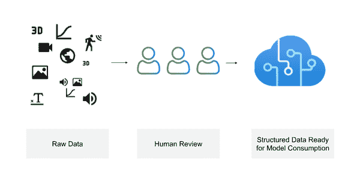
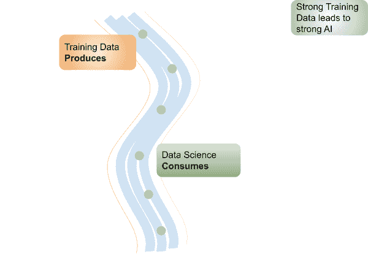
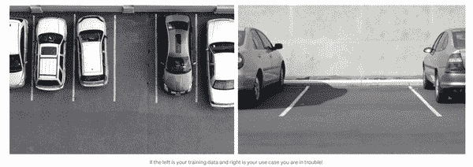
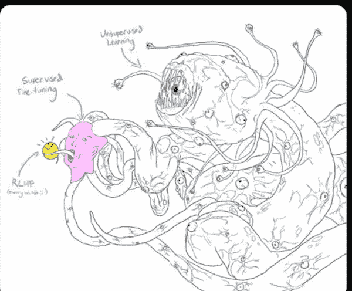

# 第一章：训练数据介绍

数据无处不在。视频、图像、文本、3D、地理空间、文档等等。然而，以其原始形式，这些数据对于监督式机器学习（ML）几乎无用。我们如何利用这些数据？我们如何记录我们的智慧，以便通过 ML 再现它？答案就是训练数据的艺术——使原始数据变得有用的学科。 

在这本书中，您将学到：

+   全新的训练数据特定概念

+   训练数据的日常实践

+   如何提高训练数据的效率

+   真实世界案例研究

+   如何使您的团队更加 AI/ML 中心化

在我们能够涵盖这些概念之前，我们首先必须理解这一章将揭示的基础知识。

训练数据是将原始数据塑造、重塑、形成和消化成新形式的过程。从原始数据中创造新的含义以解决问题。这些创造和破坏的行为处于学科专业知识、业务需求和技术要求的交集。这是一组跨越多个领域的多样化活动。

所有这些活动的核心是注释。注释生成了结构化数据，可供机器学习模型使用。没有注释，原始数据被认为是非结构化且不可用的。这就是为什么现代机器学习用例，包括计算机视觉、自然语言处理和语音识别，都需要训练数据的原因。

要在一个例子中巩固这个概念，让我们详细考虑注释。当我们注释数据时，我们在捕获人类知识。通常，这个过程如下所示：提供一个媒体片段，比如图像、文本、视频、3D 或音频，并附上一组预定义的选项（标签）。人类审查媒体并确定最合适的答案。例如，声明图像的某个区域是“好”还是“坏”。这个标签提供了应用机器学习概念所需的上下文（图 1-1）。

但我们是如何做到的？我们是如何达到这一点的？正确的媒体元素与正确的预定义选项在正确的时间显示给正确的人？导致并随着注释或知识捕获实际发生的许多概念。总之，所有这些概念都是训练数据的艺术。

###### 图 1-1\. 训练数据过程

在这一章中，我们将介绍训练数据是什么，为什么它很重要，并深入探讨将构成本书其余部分基础的许多关键概念。

# 训练数据意图

您可以通过训练数据做什么？它最关心的是什么？人们希望通过训练数据实现什么？训练数据的目的因不同的用例、问题和场景而异。让我们探讨一些最常见的问题。

## 您可以通过训练数据做什么？

培训数据是 AI/ML 系统的基础 - 支撑这些系统运行的基础。

培训数据使您能够构建和维护现代 ML 系统，例如创建下一代自动化、改进现有产品，甚至创建全新产品。

为了有用，数据需要以结构化的方式呈现给 ML 程序。这就是培训数据的作用 - 添加和维护结构，使原始数据有用。如果你有出色的培训数据，你就在通向一个优秀的整体解决方案的道路上。

在实践中，常见的用例集中在

+   改进现有产品（例如性能），即使当前尚未包含 ML 部分

+   制造新产品，包括以有限或“一次性”方式运行的系统

+   研发

培训数据贯穿 ML 程序的所有部分。培训数据在您运行 ML 程序之前就出现了，在运行期间涉及输出和结果，甚至在分析和维护之后也是如此。此外，培训数据的关注点往往是长期存在的。例如，在启动并运行模型之后，维护培训数据是维护模型的重要组成部分。

本书的主要关注点是创建和维护新数据。某一时刻的数据集是培训数据复杂过程的输出。例如，一个训练/测试/验证分割是原始新颖集合的衍生物。而这个新颖集合本身只是一个快照，一个对更大培训数据过程的单一视角。类似于程序员决定打印或记录变量的方式，打印的变量只是输出，它并没有解释获取所需值所需的复杂函数集合。本书的目标之一是解释背后获取可用数据集的复杂过程。

注释，即人类直接注释样本的行为，是培训数据的重要组成部分。然而，它只是其中的一部分，培训数据的过程涉及后面本章中概述的许多其他部分。

## 培训数据最关心什么？

这本书涵盖了各种人员、组织和技术问题。我们将在稍后详细讨论每一个概念，但在此之前，让我们先思考培训数据关注的领域。

例如，模式 Schema 如何准确地表示您的注释与它们在您的用例中的意义之间的映射问题？如何确保原始数据被收集并以与问题相关的方式使用？如何应用人类验证、监控、控制和修正？

在存在如此多的人为因素时，如何重复达到和维持可接受的质量水平？它如何与其他技术集成，包括数据源和您的应用程序？

虽然不完美，为了帮助组织这一点，您可以广泛划分为以下主题：Schema、原始数据、质量、集成和人类角色。接下来，我将深入研究每个主题。

### Schema

Schema 在训练数据的每个方面都是核心。Schema 是人类输入和您用例含义之间的映射。它定义了机器学习程序能够输出的内容。它是至关重要的链接，是将每个人的辛勤工作联系在一起的东西。所以显而易见的是，它很重要。

一个好的 Schema 对您的特定需求是有用和相关的。通常最好创建一个新的、定制的 Schema，然后针对您的具体情况进行迭代。在获取灵感时，从特定领域的数据库借鉴或填写某些详细级别是正常的，但务必在为新的、新颖的 Schema 提供指导的情况下完成。不要期望来自另一个上下文的现有 Schema 能在没有进一步更新的情况下适用于机器学习程序。

那么，为什么根据您的具体需求设计它很重要，而不是某些预定义集？

首先，Schema 既适用于人类注释又适用于机器学习。现有的领域特定 Schema 可能是为不同上下文的人类使用或经典非机器学习上下文的机器使用而设计的。这是其中一种情况，看起来输出很相似，但实际上形成方式完全不同。

就像两个输出相同值的不同数学函数，但运行在完全不同的逻辑上。Schema 的输出可能看起来相似，但其中的差异对于使其友好地用于注释和机器学习至关重要。

第二，如果 Schema 无用，即使很棒的模型预测也是无用的。Schema 设计的失败可能会导致整个系统的失败。这里的背景是，机器学习程序通常只能预测 Schema 中包含的内容。¹ 很少有机器学习程序能够产生比原始 Schema 更好的相关结果。同样罕见的是，它会预测出人类或人类群体在查看相同原始数据时无法预测到的内容。

经常看到有价值存疑的 Schema。因此，停下来仔细思考一下“如果我们自动使用这个 Schema 标记数据，它对我们是否真正有用？”以及“人类查看原始数据时，是否可以合理地从 Schema 中选择符合它的内容？”是非常值得的。

在本书的前几章中，我们将涵盖 Schema 的技术方面，并稍后通过实际示例回到 Schema 的关注点。

### 原始数据

当我们考虑原始数据时，最重要的是以与 Schema 相关的方式收集和使用它。

为了说明相关性的概念，让我们考虑在收听收音机中的体育比赛、在电视上看到它或亲自参加比赛之间的差异。无论使用哪种媒介，这是同一事件，但在每种情境下，你接收到的数据量是非常不同的。收集的上下文框定了数据的潜力。因此，例如，如果你试图自动确定球权，视觉数据可能比收音机数据更适合。

与软件相比，我们人类擅长自动进行上下文相关的相关性推断和处理嘈杂数据。我们做出许多假设，通常依赖于此时并非直接感知到的数据来源。理解上述直接感知视觉、声音等之上的上下文的能力，使得我们很难记住软件在这方面更为有限。

软件只能通过编程到其中的数据或代码获取到上下文。这意味着处理原始数据的真正挑战是克服我们对上下文的人类假设，以便使正确的数据可用。

那么你该怎么做呢？其中一种更成功的方法是从模式开始，然后将原始数据收集的想法映射到其中。它可以被视为一个问题 -> 模式 -> 原始数据的链条。模式的需求总是由问题或产品定义的。通过这种方式，总能轻松检查“给定模式和原始数据，人类能做出合理的判断吗？”

着眼于模式，还鼓励考虑收集数据的新方法，而不仅限于现有或最易获得的数据收集方法。随着时间的推移，模式和原始数据可以共同迭代，这只是一个开始。在产品方面，另一种关联方式是，模式代表了产品。因此，使用“产品市场匹配”的陈词滥调，这是“产品数据匹配”。

要将上述抽象概念具体化，以下是我在行业中最常见到的一些内容：

在开发和生产过程中使用的数据之间的差异是最常见的错误源之一。这是普遍的，因为它在某种程度上是不可避免的。这就是为什么在迭代过程的早期能够达到某种程度的“真实”数据是至关重要的。你必须期待生产数据将会不同，并将其作为你的数据整体收集策略的一部分进行规划。

数据程序只能看到原始数据和注释。只能看到给予它的东西。如果人类标注员依赖于无法从呈现的样本中理解的知识外的知识，那么数据程序可能不会具备这种上下文，它将失败。我们必须记住，所有必需的上下文必须存在，无论是在数据中还是在程序的代码行中。

总结一下：

+   原始数据需要与模式相关。

+   原始数据应尽可能与生产数据相似。

+   原始数据在样本本身应具有所需的所有上下文。

### 质量

训练数据质量自然是一个连续的过程。在一个情境中可接受的东西，在另一个情境中可能就不行了。

那么，影响训练数据质量的最大因素是什么？

我们已经讨论了其中两个：架构和原始数据。例如：

+   一个糟糕的架构可能比糟糕的标注者引起更多的质量问题。

+   如果在原始数据样本中概念不清楚，那么它很可能对机器学习程序来说也不清楚。

通常，标注质量是接下来最重要的一个项目。标注质量很重要，但也许不是你所期望的方式。具体来说，人们倾向于认为标注质量是“它是否被正确标注了”？但是“正确”通常是超出范围的。

要理解“正确答案”通常超出范围的方式，让我们想象我们正在标注交通灯，而你所呈现的样本中的灯是关掉的（例如停电），而我们的架构的选项只有活动交通灯的各种变化。显然，要么架构需要更新以包括“关掉”的交通灯，要么我们的生产系统永远无法在可能会发生交通灯停电的情境中使用。

要进入一个稍难以控制的案例，考虑交通灯是否非常远或者处于奇怪的角度，这也将限制正确标注的能力。通常这些情况听起来应该是容易管理的，但在实践中往往不是这样。因此，标注质量的真正问题往往是围绕着架构和原始数据的问题。因此，标注质量更多地是关于问题的沟通，标注者在架构和数据中表现出问题，而不仅仅是正确地标注。

希望这已经让大家深刻认识到架构和原始数据值得高度关注。然而，正确的标注仍然很重要，其中一种方法是让多人查看同一样本。这通常是昂贵的。必须有人解释对同一样本的多个意见的含义，这会进一步增加成本。对于一个有合理复杂度的架构的行业可用案例来说，对意见进行的元分析将是一个进一步的时间消耗。

想象一群人观看体育比赛的即时重播。试想着统计抽样他们的意见来获取“证据”来确定什么是“更正确”的。与此不同的是，我们有一位裁判单独审查情况并作出判断。这个判断可能是对的，也可能不对，但比试图调查群众更具成本效益，并且实际上运作更好。

类似地，通常更具成本效益的方法是随机抽样数据的百分比进行审查循环，并且标注者在出现问题时提出架构和原始数据匹配的问题。稍后将更深入地讨论这个审查循环和质量保证过程。

如果审查方法失败，并且您认为仍然需要多人参与，那么您可能存在糟糕的产品数据适配性，并且需要更改架构或原始数据收集以修复它。

从架构、原始数据和注释中放大，质量的另一个重要方面是数据的维护和与 ML 程序的集成点。质量包括成本考虑、预期使用和预期故障率。

总结一下，质量首先主要由架构和原始数据形成，然后由注释者和相关流程形成，最后由维护和集成来补充。

### 集成

许多时间和精力集中在“训练模型”上。然而，这经常忽略了一个主要因素，因为训练模型是一个主要的技术概念，主要集中在数据科学上。

那么训练数据的维护呢？ML 程序的输出结果如何，比如抽样、查找错误、减少工作量等，与训练模型无关？那么与结果的应用集成如何？技术如何测试和监控数据集？硬件？人类通知？技术如何打包到其他技术中？

训练模型只是其中一个组成部分。要成功构建一个 ML 程序、一个数据驱动程序，我们需要考虑所有技术组件如何协同工作。为了避免重复发明轮子，我们需要了解不断增长的训练数据生态系统。

关于处理集成的几个关键方面需要记住：

+   只有能够被某物消费的培训数据才有用，通常是在更大的程序中。

+   与数据科学的集成是多方面的，不仅仅是一些最终“输出”的注释。它关乎持续的人类控制、维护、架构、验证、生命周期、安全性等等。一批输出的注释就像是单个 SQL 查询的结果，它是对复杂数据库的单一、有限视角。

+   训练模型只是整体生态系统的一小部分。

### 人类角色

训练数据涉及人类、主题专家和注释者直接参与过程。人类通过数据进行编程、创建和控制。

人类通过控制训练数据来控制数据程序。这包括控制我们到目前为止讨论过的方面：架构、原始数据、质量以及与其他系统的集成。当然还包括注释本身，人类查看每个单独样本。

这种控制在许多阶段和许多人员中进行：从最初的训练数据到对数据科学输出的人类评估，验证数据科学结果。这么多人参与，与传统的机器学习非常不同。

我们有新的指标，比如接受了多少样本，每个任务花费多长时间，数据集的生命周期，原始数据的保真度，模式分布的分布情况等等。这些概念可能与数据科学概念重叠，比如类分布，但值得单独思考。例如，模型指标基于训练数据的地面真实性，因此如果数据错误，指标也会错误。正如在质量保证部分讨论的那样，围绕注释者一致性的指标，错过了模式和原始数据问题的更大点。

人工监督不仅仅关乎定量指标。它关乎定性理解。人类对模式、原始数据、单个样本等的观察和理解至关重要。这种定性视角延伸到业务和用例概念中。此外，这些验证和控制很快从易于定义的形式扩展到更多的艺术形式，成为创造行为。更不用说政治和社会对系统性能和输出的期望了。

处理训练数据是一个创造性的机会。以新的方式捕捉人类智慧和见解。在新的训练数据环境中构建问题。创造新的模式、新的原始数据捕捉和其他特定训练数据的方法。专家可以通过注释直接创建新的数据。

这种创造，这种控制，都是全新的。虽然我们已经为各种类型的人机交互建立了模式，但是对于人机学习程序交互的模式远没有那么成熟。对于人类监督数据驱动系统来说，人类可以直接修正和编程数据。

例如，我们期望普通办公室工作人员知道如何使用文字处理，但我们不指望他们使用视频编辑工具。训练数据需要专家。因此，就像今天医生必须学会使用计算机进行常见任务一样，他们现在必须学会使用标准的注释模式。随着人类控制的数据驱动程序的出现和普及，这些交互将继续增加其重要性和变化性。

# 训练数据机会

现在我们理解了许多基本原理，让我们来构思一些机会。

如果您正在考虑将训练数据添加到您的 ML/AI 程序中，您可能想问的一些问题是：

+   什么是最佳实践？

+   我们是否以“正确”的方式进行？

+   我的团队如何能更高效地使用训练数据？

+   训练数据中心项目可以解锁哪些商业机会？

+   我能把现有的工作流程，比如现有的质量保证流水线，转化为训练数据吗？如果我的所有训练数据都可以集中在一个地方，而不是从 A 到 B 到 C 不停地搬运数据，会怎样？如何更有效地利用训练数据工具？

广义上来说，企业可以：

+   通过推出新的 AI/ML 数据产品增加收入。

+   通过改进现有产品的性能来维持现有收入，通过 AI/ML 数据。

+   减少安全风险 — 降低因 AI/ML 数据暴露和丢失而造成的风险和成本。

+   通过将员工的工作进一步提升至自动化食物链的更高层次来提高生产力。例如，通过不断从数据中学习 — 创建您的 AI/ML 数据引擎。

所有这些元素都可以通过组织来实现转型，我将在接下来详细介绍。

## 业务转型

你团队和公司对训练数据的心态非常重要。在转型章节中我将提供更多细节，但现在，以下是一些开始思考的重要方式。

+   开始将公司所有现有的日常工作视为训练数据的机会

+   认识到未在训练数据系统中捕获的工作将会丢失

+   开始将注释作为每个一线工作人员日常工作的一部分进行转移

+   定义您的组织领导结构以更好地支持训练数据工作

+   在规模上管理您的训练数据流程。适用于单个数据科学家的方式与适用于团队的方式大不相同，而与拥有多个团队的公司更是不同。

为了实现所有这些目标，重要的是在您的团队和组织中实施强大的训练数据实践。为此，您需要在公司内部树立一个以训练数据为中心的思维方式。这可能很复杂，可能需要时间，但现在进行投资是值得的。

为此，要在项目计划讨论中涉及主题专家。他们将带来宝贵的见解，节省您团队未来的时间。使用工具来维护原始数据的收集、摄取和输出的抽象和集成也是非常重要的。您将需要新的库来实现特定的训练数据目的，以避免重复造轮子。确保您和您的团队报告和描述训练数据非常重要。了解做了什么、为什么这样做以及结果是什么，将为未来的项目提供信息。

现在这些可能听起来很困难，所以让我们再深入一步。当您开始使用训练数据时，您将学习到特定的新概念，这将带来心态的转变。例如，添加新数据和注释将成为您日常工作流程的一部分。当您开始获取初始数据集、架构和其他配置时，您将变得更加了解。本书将帮助您更熟悉新工具、新 API、新 SDK 等，使您能够将训练数据工具整合到您的工作流程中。

## 训练数据效率

训练数据的效率取决于多个因素。我们将在接下来的章节中详细探讨这一点，但现在，请考虑以下问题：

+   我们如何创建和维护更好的架构？

+   我们如何更好地捕获和维护原始数据？

+   我们如何更高效地进行注释？

+   我们如何减少相关样本数量，以便一开始就减少注释的工作量？

+   我们如何让人们快速掌握新工具？

+   我们如何将这项工作与我们的应用程序结合起来？有哪些集成点？

与大多数流程一样，有很多可以提高效率的地方，这本书将向您展示如何通过健全的训练数据实践来帮助您。

## 工具熟练度

新工具，如 Diffgram，现在提供了许多帮助实现你的训练数据目标的方法。随着这些工具复杂性的增加，掌握它们的能力变得更加重要。你可能拿起这本书是为了获取广泛的概述，或者优化特定的痛点。工具章节将深入探讨这些问题。

## 常见的痛点

突出一些常见的挑战，比如：

+   注释质量不佳，成本太高，手工操作过多，容易出错。

+   重复工作

+   主题专家劳动成本过高

+   太多例行或乏味的工作

+   很难获得足够的原始数据

+   原始数据量显然超出了任何手工查看的合理能力。

您希望通过训练数据实现什么目标？

# 为什么训练数据如此重要

在本节中，我将讨论为什么训练数据对您的组织如此重要。以及为什么强大的训练数据实践至关重要。这些是本书始终关注的核心主题，在今后的内容中您会再次看到它们。

首先，训练数据决定了你的 AI 程序、你的系统能做什么。没有训练数据就没有系统。有了训练数据，机会只受你的想象力限制。任何你能形成架构并记录原始数据的内容，系统都能重复。它可以学习任何东西。这意味着系统的智能和能力取决于架构的质量，以及你可以教给它的数据的数量和多样性。

其次，训练数据工作是上游工作，即在数据科学工作之前进行。这意味着数据科学依赖于训练数据。训练数据中的错误会影响到数据科学的结果。或者用老生常谈的话说 - 垃圾进，垃圾出。图 1-2 展示了这种数据流在实践中的工作原理。

###### 图 1-2\. 训练数据和数据科学的概念位置

第三，训练数据的艺术代表了如何思考构建 AI 系统的转变。我们不再过度关注改进数学算法，而是与此同时优化训练数据以更好地满足我们的需求。这是 AI 转型的核心，也是现代自动化的核心。知识工作首次被自动化。

## 机器学习应用正在成为主流

在 2005 年，一支大学团队采用了基于训练数据的方法，在一个长达 175 英里的沙漠赛道上实现了自动驾驶，赢得了[DARPA 大挑战](https://www.computerhistory.org/timeline/ai-robotics/)。大约 15 年后的 2020 年 10 月，一家汽车公司在公众中发布了一项具有争议的[全自动驾驶技术（FSD）](https://www.theverge.com/2020/10/22/21528508/tesla-full-self-driving-beta-first-reaction-video)，开启了消费者意识新时代。2021 年，数据标注问题开始在财报电话中被提及。换句话说，主流开始接触训练数据。

这种商业化超越了 AI 研究成果的头条新闻。在过去几年中，我们看到对技术的需求急剧增加。我们期望能与软件进行交流并被理解，自动获得良好的推荐和个性化内容。大型科技公司、初创企业和企业都越来越倾向于利用 AI 来解决这些应用案例组合的爆炸性增长。

AI 知识、工具和最佳实践迅速扩展。过去只有少数人的专属领域现在正在成为常识和预构建 API 调用。我们正处于过渡阶段，从研发演示到早期的真实世界行业使用案例阶段。

自动化期望正在被重新定义。对于新车购买者来说，定速巡航已经不再仅限于“保持恒定速度”，还包括“车道保持、距离保持等”。这些不是未来的考虑，而是当前消费者和企业的期望。这些是明确且迫切的需要，需要制定 AI 战略并在公司中具备 ML 和训练数据能力。

## 成功 AI 的基础

机器学习是关于从数据中学习的。从历史上看，这意味着创建类似日志或类似表格数据的数据集，比如“安东尼观看了一个视频”。

这些系统继续具有显著的价值。然而，它们也有一些限制。它们不能帮助我们做现代训练数据驱动的 AI 可以做的事情，比如构建理解 CT 扫描或其他医学图像的系统，理解足球战术，或者未来驾驶车辆。

这种新型 AI 背后的理念是人类明确地说“这是一个球员传球的示例是什么样子的”，“这是一个肿瘤的样子”，或者“这个苹果的这部分是腐烂的”。

这种表达形式类似于在课堂上老师向学生解释概念的方式：通过文字和例子。老师帮助填补教科书和学生随时间建立的多维度*理解*之间的差距。在训练数据中，标注者充当教师，填补模式和原始数据之间的差距。

数据集（定义）

数据集就像一个文件夹。通常它有一个特殊的含义，即在同一个地方有“原始”数据（例如图像）和注释。例如，一个包含 100 张图片和一个列出注释的文本文件的文件夹。在实践中，数据集是动态的，并部分存储在数据库形式中。

## 训练数据是不可或缺的

训练数据将会在很长一段时间内存在。从概念上讲，我认为训练数据的概念将在几十年甚至一个世纪后仍然存在。我如何能如此自信地说呢？让我们思考一下趋势。

正如前面提到的，现代人工智能/机器学习数据的用途正在从研发转向工业应用。我们处于业务周期的早期阶段。自然地，具体的细节迅速变化。然而，围绕将日常工作视为注释的概念、鼓励人们追求更独特工作的想法，以及监督日益强大的机器学习程序的概念，都将长期存在。

在研究方面，关于如何使用训练数据的算法和想法不断改进。例如，某些类型的模型越来越不需要大量数据就能发挥作用的趋势。模型所需的样本越少，就越重视创造广度和深度更大的训练数据。另一方面，在许多行业应用案例中，通常需要更多的数据才能实现业务目标。在这种商业背景下，需要更多人参与训练数据，进一步增加了工具的压力。

换句话说，研究和工业的扩展方向随着时间的推移越来越重视训练数据的重要性。

## 训练数据控制机器学习程序

任何系统中的问题是控制。控制在哪里？在正常的计算机代码中，这是以人为书写的逻辑形式存在，如循环，条件语句等等。这种逻辑定义了系统。

在经典的机器学习中，第一步包括定义感兴趣的特征和数据集。然后算法生成模型。虽然看起来算法控制一切，但真正的控制在于选择特征和数据。然后算法的自由度由特征和数据控制。

在深度学习系统中，算法自行进行特征选择。算法试图确定哪些特征与给定目标相关。这个目标由训练数据本身定义。事实上，训练数据是目标的*整个定义*。

它是如何工作的呢？算法的内部部分称为损失函数，描述了算法如何学习实现这一目标的关键部分。算法使用损失函数来确定它距离训练数据中定义的目标有多接近。

更技术化地说，损失是我们在训练期间希望最小化的错误。没有一些外部定义的目标（如训练数据），损失函数就无法工作。在某种意义上，这是一个“目标中的目标”。损失函数的目标是优化损失，但它只能通过有些参考点来实现，这些参考点由训练数据定义。

因此，训练数据是模型与人类定义的目标之间关系正确性的“真实情况”。

进一步理解这种情况的原因，考虑到在许多用例中，损失函数与任务密切相关。例如，给定的物体检测方法通常包括对特定损失函数的引用。也就是说，在“无监督”学习的情况下，损失函数可能更与目标相关。虽然这乍一看似乎是矛盾的，但在实际目的上，对于监督案例来说通常不相关。

## 新用户类型

在传统软件开发中，最终用户和工程之间存在一定程度的依赖关系。最终用户无法真正说出程序是否“正确”，工程师也无法。

最终用户很难在建立原型之前表达他们想要什么。因此，最终用户和工程师彼此依赖。这被称为循环依赖。改进软件的能力来自于两者的互动，能够共同迭代。

在训练数据方面，当进行文字监督时，人类控制系统的含义。数据科学家在处理模式时控制它，例如选择抽象化，如标签模板。

例如，如果我作为注释者在实际上一个良性的肿瘤被标记为癌症性，那么我将以有害的方式控制系统的输出。在这种情况下，值得理解的是，不可能完全消除这种控制的验证，工程技术无法做到这一点，既因为数据量，也因为缺乏主题专业知识。

曾经有这样一种假设，认为数据科学家知道什么是“正确”的。理论上，他们可以定义一些“正确”的例子，只要人类监督员大致遵循这一指南，他们就知道什么是正确的。问题是，一个说英语的数据科学家如何知道法语的翻译是否正确？数据科学家如何知道医生对 X 光图像的医学意见是否正确？简短的答案是 - 他们不能。随着 AI 系统角色的增长，学科专家越来越多地在超越数据科学的系统上行使控制。

要理解为什么这超出了“垃圾进，垃圾出”这一短语。考虑到在传统程序中，虽然最终用户可能不会感到满意，但工程师可以通过一个称为单元测试的概念，至少保证代码是“正确的”。这并不意味着它提供了最终用户所期望的输出，而只是代码是否执行了工程师认为它应该执行的操作。

在训练数据的背景下编写这种单元测试是不可能的*——*因为工程师可以控制的控件，如验证集，仍然基于个体 AI 监督员执行的控件。

此外，AI 监督员通常受到工程定义的控制，工程定义了他们允许使用的抽象。最终用户通过数据进行编码。在某种程度上，最终用户被编织到系统本身的结构中。

“内容”和“系统”之间的界限变得模糊是很重要的。

这与传统系统截然不同。例如，在社交媒体平台上，你的内容可能是价值所在，但系统的文字（你输入的框，你看到的结果等）和你发布的内容（文本，图片等）之间仍然清晰可见。

控制的例子包括：

1.  抽象概念，比如模式，定义了一级控制。

1.  标注，字面上看样本，定义了另一级控制。

虽然数据科学可能控制算法，但训练数据的控制通常以“监督”的角色存在，高于算法。

# 野外训练数据

到目前为止，我们已经涵盖了许多概念和理论，但实践中的训练数据可能是一件复杂和具有挑战性的事情。

## 什么使训练数据变得困难？

数据标注的显而易见的简单性掩盖了涉及的广泛复杂性，新颖的考虑因素，新概念和新形式的艺术。可能会出现这样的情况：看起来好像是一个人选择了适当的标签，数据经过了机器处理，然后，哇，我们有了一个解决方案，对吧？嗯，并不完全是这样。以下是一些可能令人困惑的常见元素。

+   当来自各个领域的专家必须紧密合作时。

+   主题专家（SME）正在与技术人员以及反过来的方式进行新的社交互动，这些新的社交互动引入了新的人际挑战。

+   专家有个人经历，信念，固有偏见和先前的经验。

+   用户正在操作具有少量共同期望的新颖标注界面，这些共同期望定义了标准设计的样式。

+   问题本身可能很难，答案不明确或解决方案定义不清晰。

+   即使知识在一个人的头脑中形成，而且该人熟悉标注界面，准确输入这些知识也可能是乏味且耗时的。

+   经常需要大量的数据标记工作，并管理多个数据集以及围绕存储，访问和查询新形式数据的技术挑战。

+   鉴于这是一个新的学科，缺乏组织经验和操作卓越，这些只能随着时间的推移逐步积累

+   拥有强大的传统机器学习文化的组织可能在适应这个基本上不同但在运营上至关重要的领域时遇到困难。这种盲点认为他们已经理解和实施了机器学习，而事实上这是完全不同的形式。

+   缺乏对正确训练数据工具的意识、访问或熟悉

+   作为一种新的艺术形式，一般的想法和概念并不广为人知

+   模式可能非常复杂，包括数千个元素，包括嵌套的条件结构

+   媒体格式带来了一些挑战，如系列、关系和 3D 导航

+   大多数自动化工具引入了新的挑战和困难

而这只是*简短*列表。

虽然挑战是多样的，有时也很困难，但我们将在本书中解决每一个，为您和您的组织提供可以实施以改进训练数据的路线图。

## **监督机器的艺术**

到目前为止，我们已经涵盖了一些关于训练数据的基础知识和一些挑战。让我们暂时远离科学，专注于艺术。注释的表面简单掩盖了所涉及的大量工作。注释对训练数据来说就像打字对写作一样重要。如果没有人的参与和准确执行任务的动作，简单地在键盘上按键并不会提供价值。

训练数据是一个新的范例，正在涌现出一长串思维方式、理论、研究和标准。这涉及技术表示、人员决策、流程、工具、系统设计以及特定于它的各种新概念。

训练数据之所以如此特殊的一点是，它捕捉了用户的知识、意图、想法、概念，*而不是*指定“它们是如何”得到的。例如，如果我标记一个“鸟”，我并没有告诉计算机鸟是什么，鸟的历史等等——只是它*是*一只鸟。这种传达高层次意图的想法与大多数经典编程观点不同。在本书中，我将不断回到这种将训练数据视为一种新形式编码的思想。

## 一种新事物

训练数据不等同于数据科学。它们有不同的目标。训练数据产生结构化数据。数据科学则消费这些数据。训练数据是将人类知识从现实世界映射到计算机中。数据科学则将这些数据映射回现实世界。它们是同一枚硬币的两个不同面。

就像模型嵌入到应用程序中一样，即使是最小的输入/输出，为了有用，训练数据也必须被数据科学消费。事实上，它被这种方式使用不应该减损其差异性。仍然有将概念映射到数据科学可用形式的过程。关键是在它们之间有清晰定义的抽象，而不是在术语上的临时猜测。

把训练数据看作是所有其他专业实践的一种艺术，而不是把数据科学视为一切开始的起点，似乎更合理。考虑到有多少学科专家和非技术人员参与其中，那种相当荒谬的替代假设似乎是认为数据科学高高在上！

尽管称任何事物为新艺术形式可能是自作多情的，但我在于我只是在给已经做的事情贴标签。事实上，当我们将其视为独立的艺术形式并停止把它硬塞到其他已有的类别中时，一切就显得更合理了。

我在第七章“AI 转型”中详细介绍这个问题。

由于训练数据是新的，语言和定义仍然不确定。以下术语都密切相关：

+   训练数据

+   数据标记

+   人机监督

+   注释

+   数据程序

根据上下文，这些术语可以映射到各种定义：

1.  训练数据的整体艺术。

1.  注释行为，例如绘制几何形状和回答模式问题。

1.  在机器学习（ML）系统中我们想要达到的定义，期望的理想状态，对 ML 系统的控制，包括纠正现有系统。

1.  依赖于人类控制的数据系统。

例如，我可以说注释是训练数据整体概念的一个具体子组件。我也可以说“使用训练数据工作”，意味着进行注释的行为。作为一个新兴领域，人们可能会说数据标记，指的只是注释的基本文字意义，而其他人可能指整体的训练数据概念。

简而言之，不值得过多关注这些术语，通常需要了解其使用的上下文来理解含义。

## 媒体类型

数据有许多媒体类型。流行的媒体类型包括图像、视频、文本、PDF/文档、HTML、音频、时间序列、3D/DICOM、地理空间、传感器融合、多模态。虽然流行的媒体类型在实践中通常得到最好的支持，但理论上任何媒体类型都可以使用。注释的形式包括属性（详细选项）、几何形状、关系等。随着本书的进展，我们将详细介绍所有这些内容，但重要的是要注意，如果存在某种媒体类型，可能会有人试图从中提取数据。

## ML 程序生态系统

训练数据与日益扩展的相邻程序和概念生态系统相互作用。通常会将数据从训练数据程序发送到 ML 建模程序。或者在训练数据平台上安装 ML 程序。生产数据，如预测结果，通常会发送到训练数据程序进行验证、审查和进一步控制。这些各种程序之间的联系继续扩展。本书后面将详细介绍数据的摄入和流处理的技术细节。

## 数据中心化机器学习

专业领域专家（SMEs）和数据录入人员可能每天每天花费 4-8 小时在诸如标注之类的训练数据任务上。这是一项耗时的任务，可能会成为他们的主要工作。在某些情况下，整个团队 99%的时间都花在训练数据上，而只有 1%花在建模过程上，例如使用 AutoML 类型的解决方案或拥有大型团队或 SMEs。⁵

数据中心化 AI 专注于将训练数据作为其重要组成部分。通过专业领域专家创建新数据、新架构、新原始数据捕捉和新注释。开发以训练数据为核心，并将训练数据深度整合到程序各个方面的程序。先有移动端优先，现在有数据优先。

在数据中心化的思维模式下，您可以：

1.  使用或添加数据收集点。例如新传感器、新摄像头、捕捉文档的新方法等。

1.  添加新的人类知识。

数据中心化方法背后的理念是：

1.  大部分工作都在训练数据上，数据科学方面超出我们的控制。

1.  在训练数据和建模中，比仅仅改进算法具有更多的自由度。

当我将数据中心化 AI 的这一思想与将训练数据的广度和深度视为一种艺术的想法相结合时，我开始看到广阔的机会领域。您将用训练数据构建什么？

## 失败

任何系统通常都会有各种各样的错误，但总体上“工作”。数据程序也是如此。例如，某些类别的失败是预期的，而其他类别则不是。让我们深入了解一下。

数据程序在其相关的假设集保持真实时运行。例如，关于架构和原始数据的假设。这些假设在创建时通常最为明显，但可以作为数据维护周期的一部分进行更改或修改。

要深入了解一个视觉示例，想象一下停车场检测系统。该系统可能有不同的视角，如图 1-3 所示。如果我们基于顶视图创建一个训练数据集（左侧），然后尝试使用汽车级视图（右侧），我们可能会遇到“意外”的失败类别。

###### 图 1-3\. 比较主要差异的原始数据，可能会导致意外失败

为什么会失败？一个仅训练于如左图所示的顶视图的机器学习系统，在如右图所示的前视图环境中运行时会遇到困难。换句话说，如果在训练期间从未见过这样的图像，系统将无法理解从前视图中看到的汽车和停车场的概念。

尽管这可能显而易见，但一个非常相似的问题导致了美国空军系统的 [一次真实世界失败](https://www.defenseone.com/technology/2021/12/air-force-targeting-ai-thought-it-had-90-success-rate-it-was-more-25/187437/)，使他们认为他们的系统比实际情况好得多。

我们如何预防这样的失败？对于这个具体的例子，重要的是我们使用来训练系统的数据与生产数据尽可能接近。那么，还有哪些未在书中明确列出的失败呢？

第一步是意识到训练数据的最佳实践。之前提到人类角色时，我提到了与标注者和主题专家的沟通的重要性。标注者需要能够标记问题。Schema 和原始数据之间的问题。以及表明指定说明和 Schema 范围之外的问题，例如“常识”，即某些事情不对劲。

管理员需要意识到创建一个新颖且命名良好的 Schema 的概念。原始数据应始终与 Schema 相关。数据的维护将是必要的。

在开发过程中，通过对 Schema、预期数据使用情况的讨论以及与标注者的讨论，会暴露出失败模式。

### 部署系统中的失败示例

鉴于一些系统的新颖性，我们很可能只见到了训练数据中最小的失败案例。

2020 年 4 月，Google 部署了一款医疗 AI 来帮助 COVID-19。⁶ 他们训练了比生产时可用的更高质量的扫描。所以当人们实际使用它时，他们经常不得不重新扫描，以达到预期的质量水平。即使在重新扫描的额外负担下，系统仍然拒绝了大约 25% 的情况。这就像一个电子邮件服务，使您不得不重新发送每第二封电子邮件，并且完全拒绝发送每第四封电子邮件。

当然，这个故事有其细微之处，但概念上显示了开发和生产数据对齐的重要性。系统训练的内容必须与实际使用的内容相似。换句话说，不要在开发集中使用“实验室”级别的扫描，然后期望智能手机摄像头在生产中表现良好。如果生产将使用智能手机摄像头，那么训练数据也需要来自于它。

## 未能实现期望的偏差

当我们考虑经典软件程序时，任何给定的程序都“偏向”于某些操作状态。例如，设计用于智能手机的应用程序具有特定的上下文，并且在某些方面可能比桌面应用程序更好或更差。电子表格应用程序可能更适合桌面使用。

这种偏差可能是有意的。例如，官方的汇款系统需要禁止随机编辑，而个人记事应用程序可能希望方便进行编辑。一旦编写了这样的程序，取消偏见就变得困难。以编辑为重点的程序建立在用户可以（通常）编辑内容的假设上。而汇款应用程序则建立在用户不能“撤销”交易的多个假设上。

训练数据中有一个类似的概念。让我们想象一个作物检查应用程序。假设它主要围绕影响马铃薯作物的疾病设计。对于从“原始”数据（例如，媒体是以某些高度捕获的）到疾病类型再到样本数量的一切做出了假设。它不太可能对其他类型的作物有效。因此，确保模式与你所需的应用目标和所需偏差匹配非常重要。

我将从多个角度讨论偏差，并提供如何利用训练数据来实现你所需偏差的实用技巧。

## 什么是训练数据

训练数据不是一个机器学习算法。它不与特定的机器学习方法捆绑在一起。

它不是我们想要实现的目标的定义。基本挑战在于有效地识别和映射所需的人类含义到机器可读形式。

训练数据的有效性主要取决于其与人类定义的含义的相关性以及其合理地代表实际模型使用方式。实际上，围绕训练数据的选择对有效训练模型的能力有着巨大影响。

# 生成 AI

生成 AI（GenAI）概念，如生成预训练转换器（GPT）和大语言模型（LLMs），在 2023 年初变得非常流行。在这里，我将简要介绍这些概念与训练数据的关系。

注意：在撰写本文时，这一领域正在迅速发展。主要的商业参与者在公开分享方面非常谨慎，因此存在大量猜测和炒作，但缺乏共识。因此，很可能到你阅读本文时，这个生成 AI 部分的一些内容已经过时。

首先，有无监督学习的概念。在 GenAI 的上下文中，无监督学习的广泛声明目标是在不需要新定义的人类制定标签的情况下工作。然而，LLMs 的“预训练”是基于人类来源材料的。因此，你仍然需要数据，通常是人为生成的数据，以获得对人类有意义的内容。不同之处在于，在“预训练”生成 AI 时，数据起初不需要标签来创建输出，亲切地称为无监督的“怪物”。如图 1.4 所示，这个“怪物”仍然需要人类监督来驯服。

###### 图 1-4\. 无监督学习与监督微调及人类对齐的关系

广义上说，这些是 GenAI 与人类监督互动的主要方式：

人类对齐

使用人类监督来构建和改进 GenAI 模型。

效率改进

使用 GenAI 模型改进繁琐的监督任务（如图像分割）。

与监督 AI 协同工作

使用 GenAI 模型来解释、结合、接口和使用监督输出。

AI 的一般意识。

AI 正在被主要新闻媒体和公司的财报电话中每天提及。围绕 AI 的一般兴奋情绪显著增加。

我将在下一小节详细阐述人类对齐的概念。

您还可以利用 GenAI 来帮助提高监督训练数据的效率。通过当前的 GenAI 系统，一些“低挂果实”的例子，如通用对象分割，广泛接受类别的通用分类等，都是可能的（带有一些警告）。我将在第八章更详细地讨论这一点，讨论自动化时。

与监督 AI 协同工作大多超出了本书的范围，除了简要说明几乎没有重叠之外。GenAI 和监督系统都是重要的构建模块。

GenAI 的进展再次成为头条新闻。因此，组织正在重新思考他们的 AI 目标，并在总体上更多地投入 AI 倡议，而不仅仅是 GenAI。要推出一个 GenAI 系统，需要人类对齐（即训练数据）。要推出一个完整的 AI 系统，通常需要 GenAI + SupervisedAI。学习本书中有关处理训练数据的技能将有助于实现这两个目标。

## 人类对齐即人类监督

人类监督，在本书中的重点，通常在 GenAI 背景下被称为人类对齐。本书讨论的大多数概念也适用于人类对齐，有一些案例特定的修改。

目标不是直接学习重复精确的表示，而是“引导”无监督结果。虽然关于人类对齐“引导”方法的具体细节存在激烈的辩论，但当前流行的人类对齐方法具体例子包括：

1.  **直接监督**，例如问答对，排名输出（例如个人偏好从最佳到最差），以及标记明确迭代的关注点，例如不适宜工作。这种方法是 GPT-4 声名鹊起的关键。

1.  **间接监督**，例如最终用户的赞成/反对投票，提供自由形式的反馈等。通常，此类输入必须经过额外的处理才能呈现给模型。

1.  **定义“宪法”** **一套具体的人类监督（人类对齐）原则**，供 GenAI 系统遵循。

1.  **Prompt Engineering**，即定义“类代码”的提示，或者用自然语言编写代码。

1.  **整合**到其他系统以检查结果的有效性。

在这里，最佳方法以及如何衡量结果等问题上没有太多共识。对于我个人而言，我特别想指出许多方法都集中在文本上，有限的多模态（但仍然是文本输出）和媒体生成上。虽然这可能看起来很广泛，但它只是更一般的人类将可重复的含义附加到任意现实世界概念的子集。

除了缺乏共识之外，在这个领域还存在矛盾的研究。例如，两种普遍的极端观点是一些人声称出现了新的行为模式，而另一些人则认为基准测试被精心挑选，这是一个错误的结果（例如，测试集与训练数据混淆）。尽管看起来人类监督对此有所影响，但到底影响到什么程度，以及如何影响，采用什么技术，这些在 GenAI 案例中都是一个开放的问题。事实上，一些结果显示，小型与人类对齐的模型可以与大型模型同样或更好地工作。

虽然您可能会注意到术语上的一些差异，但本书中的大多数原则仍适用于 GenAI 对齐。具体而言，所有形式的直接监督都是训练数据的监督。在总结 GenAI 覆盖范围之前的几点注意事项：本书未特别涵盖提示工程，也未涵盖其他 GenAI 特定概念。但是，如果您打算构建 GenAI 系统，仍然需要数据，而高质量的监督将继续是可预见的未来 GenAI 系统的关键组成部分。

# 总结

本章介绍了机器学习训练数据的高层次概念。

让我们回顾一下为什么训练数据如此重要：

1.  消费者和企业对内置机器学习的期望正在增加，无论是现有系统还是新系统，都增加了对训练数据重要性的认识。

1.  它作为开发和维护现代机器学习程序的基础。

1.  训练数据是一门艺术和一种新的范式。这是一套关于新的、由数据驱动的程序的思想，由人类控制，与传统机器学习分开，由新的哲学、概念和实施组成。

1.  它构成了新 AI/ML 产品的基础，通过 AI/ML 升级取代或改进现有业务线的成本，并且是研发的肥沃土壤。

1.  作为技术专家或主题专家，现在拥有这一技能集是至关重要的。

训练数据的艺术与数据科学有所不同。它是系统的控制。系统学习的目标。训练数据不是一个算法或单一的数据集。它是一个跨越从主题专家、数据科学家到工程师等人的思维方式，开启新用例和机会的范式。

在继续阅读之前，我鼓励您对早些时候介绍的高层次概念感到自在：

+   架构、原始数据、质量、集成以及人类角色都是关键问题。

+   经典训练数据是关于发现，而现代训练数据是关于复制现有知识。

+   深度学习算法生成基于训练数据的模型。训练数据定义了目标，算法定义了如何朝着这个目标努力。

+   在实验室验证的训练数据很可能在现场失败。通过主要使用现场数据作为起点、通过调整系统设计，并期望快速更新模型，可以避免这种情况。

+   对训练数据理念、假设、过程和工具的高层次概念理解。

+   训练数据就像代码。

在下一章中，我们将介绍如何设置您的训练数据系统以及工具的权衡。

¹ 超出我们关注范围的进一步推论。

² 来自 [`en.wikipedia.org/wiki/Stanley_(vehicle)`](https://en.wikipedia.org/wiki/Stanley_(vehicle))，“斯坦利以基于机器学习的方法进行障碍物检测而闻名。在斯坦利早期开发中纠正的一个常见错误之后，斯坦福赛车队创建了一个记录‘人类反应和决策’的日志，并将数据馈送到与车辆控制连接的学习算法中；这一行动极大地减少了斯坦利的错误。人类驾驶的计算机日志还使得斯坦利在检测阴影方面更加准确，这是导致 2004 年 DARPA 大挑战中许多车辆失败的问题。”

³ 防务高级研究计划局（DARPA）

⁴ 有统计方法来协调专家意见，但这些方法始终是“额外的”，仍然需要有一个现有的观点。

⁵ 这里我进行了简化。更详细地说，关键区别在于，虽然数据科学的 AutoML 训练产品和托管本身可能很复杂，但参与的人数较少。

⁶ [`www.technologyreview.com/2020/04/27/1000658/google-medical-ai-accurate-lab-real-life-clinic-covid-diabetes-retina-disease/`](https://www.technologyreview.com/2020/04/27/1000658/google-medical-ai-accurate-lab-real-life-clinic-covid-diabetes-retina-disease/)
