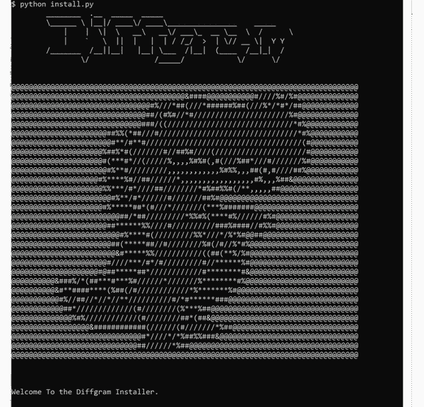
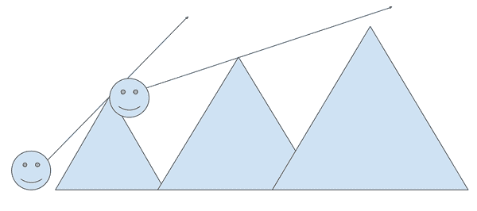
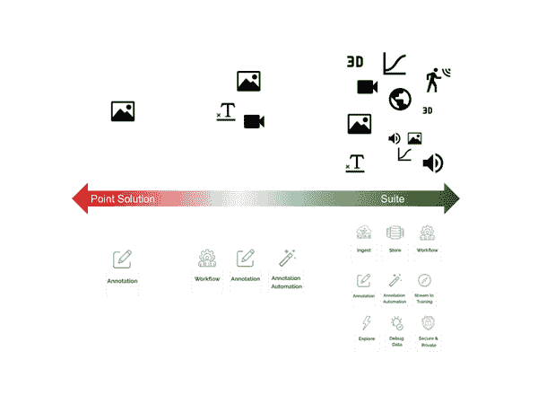

# 第二章：启动和运行

# 介绍

我们有数据库来顺利存储数据。Web 服务器来顺利提供数据。现在还有训练数据工具来顺利处理训练数据。

数据库与应用程序其余部分集成的已建立过程和期望。

那么训练数据怎么样？如何通过训练数据快速启动？从安装、注释设置、嵌入、最终用户、工作流程等方面，我将覆盖所有关键考虑因素。

我之所以说顺利是因为我不必使用数据库。我可以将数据写入文件并从中读取。为什么我需要 Postgres？因为 Postgres 提供了各种功能，比如保证我的数据不会轻易损坏，数据是可恢复的，数据可以高效地查询。训练数据工具也以类似的方式发展。

在这一章中，我将介绍

+   如何快速启动？

+   训练数据工具的范围

+   使用训练数据工具能带来哪些好处？

+   折衷方案

+   历史

大多数内容都集中在今天对您相关的事物上。我还包括一些关于历史和为何这些工具重要的简短部分。我还将回答其他常见问题，例如

+   训练数据工具的关键概念领域。

+   概述训练数据工具在您的堆栈中的位置。

我通常会将*工具*作为词语，即使它可能是一个更大的系统或平台。通过工具，我指的是任何帮助您实现训练数据目标的技术。例如，我认为 Diffgram 是一个系统、一个平台，但它也是一个工具。

# 启动和运行

下面的部分是将您的 ML 程序快速启动的最小可行路线图。出于方便，它被分成几个部分。通常，这些任务可以分配给不同的人员，并且许多可以并行执行。根据多种因素，可能需要数月时间才能完全设置好。

如果您是从一张干净的白纸开始的话，那么所有这些步骤都将适用。如果您的团队已经进展顺利，那么这提供了一个检查表，看看您现有的流程是否全面。

总体来说，总体启动任务包括：

+   安装

+   注释设置

+   最终用户设置

+   数据摄入设置

+   数据目录设置

+   工作流设置

+   初始使用

+   优化

这里的初始部分只是谈论常见的痛点和需要做的事情。稍后在考虑部分下，我将讨论特定项目的权衡。

如果这看起来很多，那么这就是建立成功系统所需的现实。

在大多数这些步骤中，存在一定程度的交叉，例如几乎任何步骤都可以通过 UI/SDK/API 完成，但在适当的情况下，我会注意常见的偏好。

## 安装

您的训练数据安装和配置由技术人员或团队完成。

安装的高级关注点包括：

+   供应硬件（云或其他）

+   执行初始安装

+   配置初始安全项，如身份提供者。

+   选择存储选项。

+   容量规划。

+   维护干预运行，如执行更新。

+   配置初始超级用户。

大多数团队在发布复杂的、影响收入的产品时，都会进行自己的安装。这仅仅是数据重要性和其与终端用户的深刻联系的现实。一般来说，数据设置比训练数据平台本身的安装更为灵活，因此数据设置被视为其自身的部分。例如，开始注释屏幕显示在图 2-1 中。

Diffgram 是商业开源并具有完整功能。您可以从[diffgram.com](http://diffgram.com/)下载 diffgram。

###### 图 2-1\. 示例 Diffgram 开发安装。

## 注释设置。

注释设置通常由管理员完成。

+   初始架构设置。

+   初始人工任务设置。

+   围绕相关方式的架构规划。随着这些工具的增长，选项越来越多，它变得像数据库设计一样。

根据复杂性，模式可以通过 SDK 或 API 加载。

注释在以下章节中有更详细的介绍：架构，第三章，注释管理员设置，第七章，以及注释概念，第八章。

## 终端用户设置。

某种方式，最终用户必须能够向系统输入数据。

这可以通过将数据收集嵌入到您的应用程序中来完成。

或通过专用门户。

+   规划。您将通过直接嵌入应用程序来收集数据吗？还是将其作为独立的门户？

+   开发团队添加数据收集。

+   定制注释门户的外观和感觉。

### 嵌入式。

您的用户通常是提供监督（注释）的最佳人选。您的用户已经具备了他们想要的上下文。您的用户可以“免费”提供监督，这比试图雇佣越来越大的中央注释团队更为可扩展。您或您的工程团队需要向应用程序添加一些代码以此方式收集数据。

### 门户

使用独立的门户通常是最简单的。这意味着注释者直接访问您的安装，例如通过网址进行注释。您可以在应用程序中“深度链接”到注释门户，例如链接到特定任务。

## 数据设置。

您必须以对系统有用的方式加载原始数据。

+   使用摄入工具。

+   集成到您的自定义应用程序中。

+   SDKs/APIs 的使用。

这将在摄入章节中详细介绍。

## 工作流设置。

您的数据必须能够与您的 ML 程序连接。可以通过手动过程或命名工作流的一部分来实现。

+   将多个操作步骤组合以创建表面化的过程。

+   将常见步骤自动化为流水线。

工作流在第五章中讨论。

## 数据目录设置。

某种方式，您必须能够查看注释工作的结果。并且必须以设定级别访问数据。

+   查询语言。领域特定的查询语言在训练数据中变得越来越流行。或者能够充分理解原始 SQL 结构以直接查询。

+   使用特定目标的训练数据库如数据发现、过滤等的训练数据专用库。

+   即使设置了工作流程，仍然需要数据目录类型的步骤。

## 初始使用

总是有一个初始使用期。这是注解者、最终用户、数据科学家、机器学习程序等操作和使用数据的阶段。

+   用户培训，特别是部署到内部用户

+   用户反馈，特别是部署到最终用户

## 优化

一旦基础设置完成，还有许多概念可以进一步优化。

+   日常工作的优化模式、原始数据和训练数据本身

+   注释熟练度、人体工程学等。

+   字面注释熟练度

+   将数据加载到机器学习工具、库和概念中

+   参与开源训练数据项目

+   对可用新工具的一般知识

# 工具概述

训练数据工具是必需的，用于部署您的 AI/ML 程序。关键领域包括

+   注释

+   目录

+   工作流

## 注释

最终用户使用注释工具注释数据。这个领域从注释作为应用程序的一部分到独立的纯注释工具都有涵盖。在最抽象的术语中，这是“数据输入”方面。

+   图像、视频、音频、文本等的字面注释 UI。

+   管理任务，质量保证等等。

## 目录

目录是数据集的搜索、存储、探索、策展和使用。这是“数据输出”方面，通常涉及一定程度的人类参与。例如查看数据集。

+   导入原始数据、预测数据、元数据等。

+   探索：从过滤不感兴趣的数据到视觉化查看等。

+   调试：调试现有数据，如预测和人工注释。

+   数据生命周期包括保留和删除、个人可识别信息、访问控制

## 工作流

工作流是训练数据的流程和数据流。它是注释、目录和其他系统之间的粘合剂。考虑集成、安装、插件等。这既涉及数据的输入又涉及输出，但通常更多是在“系统”级别。

+   技术生态系统。

+   注释自动化：改善注释性能的任何事物，如预标记或主动学习。更多深度请参阅第六章。

+   跨团队协作，涉及机器学习、产品、运营、管理等。

+   流向培训：将数据传送至你的模型。

有些产品在一个平台上涵盖了大多数这些领域。

## 用于机器学习的训练数据

通常机器学习建模和训练数据工具是不同的系统。

预先包含的 ML 程序支持越多，整体系统的灵活性和功能性就越低。

作为类比，在 Word 文档中我可以创建表格。这与电子表格应用程序带来的公式功能显然不同。

通常的解决方法是出色的集成，以便专注于训练数据质量、ML 建模等系统可以成为其自己的系统，但仍与训练数据紧密集成。

本章将重点讨论特定于训练数据的主要子领域，特别是假设模型训练由不同系统处理。

## 日益增多的工具选择

有越来越多显著的平台和工具可供选择。有些旨在提供广泛的覆盖范围，而其他人则涵盖每个领域中深入和特定的用例。每个主要类别都有数十个显著的工具。

随着对这些商业工具的需求继续增长，我预计市场上会涌现出许多新工具，并在一些更成熟的领域中进行整合。标注是其中一个更成熟的领域。在这个背景下，数据探索相对较新。

我鼓励您不断探索可用的选项，这可能会为您的团队和产品带来不同和改进的结果。

## 人、过程和数据

员工时间以任何形式经常是最大的成本中心。

良好部署的工具带来许多独特的效率提升，其中许多可以堆叠以创造数量级的性能提升。继续数据库的类比，把它看作是顺序扫描和索引之间的差异。一个可能永远无法完成，而另一个则快速！训练数据工具将您升级到索引的世界。训练数据工具使您能够：

+   直接将监督嵌入您的应用程序中。

+   在人类计算机监督的背景下增强人员、流程和数据的能力。

+   围绕共同核心规范化您的训练数据工作。

+   显现训练数据问题。

训练数据工具同样提供许多超出处理细枝末节的好处。例如，数据科学家可以查询由标注器训练的数据，而无需下载大量数据集并在本地手动筛选。但是，为了使其工作，必须首先设置训练数据系统。

## 嵌入式

当我们收到垃圾邮件时，我们会将其标记为垃圾邮件，教导系统。我们可以将单词添加到我们的拼写检查器中。这些都是终端用户参与的简单示例。随着时间的推移，越来越多的监督工作将被推动至接近终端用户并嵌入系统中。

## 最佳实践和能力水平

熟练掌握训练数据工具将需要与学习 DevOps 一样多的工作量。

您的训练数据学习是一个持续的旅程，而不是一个目的地。我提出这一点是为了说明，无论您有多熟悉，或者花费多少时间，始终有更多关于训练数据的学习内容 - 我自己也在不断学习！

## 人类计算机监督

你可能熟悉“人机交互”（HCI）的概念。用户如何与计算机程序进行交互和参与。通过训练数据，我引入了一个称为人机监督（HCS）的概念。这个想法是你在监督“计算机”。

“计算机”可以是一个机器学习模型，或者一个更大的系统。监督发生在多个层次上，从注释到批准数据集。

与此相对应，在 HCI 中，用户主要是“消费者”，而在 HCS 中，用户更多地是“生产者”。用户正在生产（在交互之上）的监督，这被 ML 程序所消耗。

这里的关键对比是通常的计算机交互是确定性的。如果我更新了什么，我期望它会更新。而与计算机监督不同，就像人类监督一样，它是非确定性的。存在一定的随机性。作为监督者，我可以提供修正，但对于每个新实例，计算机仍然会做出自己的预测。还有一个时间元素，通常 HCI 是“当下”的事情。而 HCS 在更长时间尺度上运行，在那里监督影响一个更模糊不可见的机器学习模型系统。

出于空间考虑，我不会深入探讨这种区别。随着时间的推移，这里的一般想法是继续区分这种新形式的人机监督工作（HCS）和常规计算机使用（HCI）之间的差异。

## 结束关注点的分离

训练数据工具将最终用户数据捕获问题与其他概念分离。例如，能够添加最终用户数据捕获监督，而无需担心数据流问题。

## 标准化

训练数据工具是有效运送你的机器学习产品的手段。作为这一复杂目标的手段，训练数据工具带有现代软件中任何领域最多样化的观点和假设之一。

工具有助于在噪声中带来一些标准化和清晰度。它们还帮助使本来可能没有比较基准的团队迅速见光。

+   为什么不让最终用户提供一些监督？

+   为什么要手动进行版本控制，当可以自动进行？

+   当可以流式传输所需的数据时，为什么要手动导出文件？

+   当可以使用单一统一数据存储库时，为什么要让不同团队存储具有略有不同标签的相同数据？

+   为什么要手动分配工作，当可以自动完成？

## 广泛的工具支持

尝试想象一下的一种方式是，训练数据工具：

Photoshop + Word + Premiere Pro + 任务管理 + 大数据特性存储 + 数据科学工具

+   标注者们期望能够像最好的绘图工具一样进行标注。

+   工程师们期望能够自定义它。

+   管理者们期望现代任务管理像一个专用的任务管理系统一样。

+   数据工程师希望能够有效地摄取和处理大量数据，实际上是一个完整的提取转换加载工具。

+   数据科学家期望能够像使用商业智能工具一样对其进行分析。

一体化系统。

没有合适的训练数据工具就像试图在没有工厂的情况下建造汽车一样。只有通过使用工具才能实现完全设置的训练数据系统。

我们往往习惯于认为熟悉的东西理所当然。这只是一辆车，或者只是一辆火车，或者只是一架飞机。它们都是各自的工程奇迹。我们同样低估了我们不了解的东西。“销售不能那么难”，工程师说。“如果我是总统”等等。我发现许多人不理解训练数据工具的广度。

+   注释的字面工作和任务管理被整合到一个系统中。

+   一套界面，与 Adobe 套件或 Office 相媲美，集成到一个系统中。

+   许多不同功能的系统必须与其他系统中直接使用的输入和输出以及集成的数据科学工具一起工作。

## 一个发布机器学习软件的范式

与 DevOps 思维方式类似，训练数据思维方式为您提供了一种发布机器学习软件的范式。用非常简单的话来说，这些工具：

+   处理训练数据的基本功能，如注释和数据集。这些事情如果没有工具将会是不切实际的。

+   提供界限以平衡您的项目。您是否真的在遵循训练数据的思维方式？

+   实现训练数据目标的手段，如管理成本、紧密的迭代时间到数据循环等。

# 权衡

如果您正在进行多个工具的生产使用比较的权衡，以下是一些需要考虑的事项。

在本书的其余部分，我们继续涵盖抽象概念。在这一节中，我停下来讨论真实世界行业的权衡，特别是围绕工具的问题。

## 成本

常见的成本包括嵌入式集成、终端用户输入开发和定制、商业软件许可证、硬件和支持。

除了商业成本外，所有工具都有托管和存储数据的硬件成本。此外，某些工具还会对使用特殊工具、计算使用等收费。

常见的成本降低方式：

+   终端用户输入（嵌入式）的成本显著低于雇佣更多注释者的成本。

+   尽可能将自动化推到前端。这样可以减少服务器端计算的成本。

+   将真实的数据科学训练成本与注释自动化分开。

常见的许可模型包括无限、按用户、按集群或其他更具体的度量单位。

一些商业开源产品可能允许试用以建立付费许可证的案例，或者个人或教育用途免费。

大多数 SaaS 训练数据服务在免费层有严格的限制。而且一些 SaaS 服务甚至可能有隐私条款，允许它们使用您的数据来构建对它们有利的“超级”模型。

## 安装版 vs 作为服务的软件

训练数据的数量与其他类型的软件相比非常高。比许多其他典型用例高出十到数千倍。其次，这些数据通常是敏感的，如医疗数据、身份证件、银行文件等。第三，由于训练数据是代码，并且通常包含独特的知识产权和专业知识，保护它非常重要。所以总结训练数据是：

+   高容量

+   敏感

+   包含独特的知识产权

结果是，在你自己的硬件上安装一个工具和使用 SaaS 之间存在巨大差异。

鉴于这些变量，从第一天起就可以在你的硬件上安装训练数据产品确实具有明显优势。请记住，“你的硬件”可能意味着你在流行云提供商中的集群。随着打包选项的改进，越来越容易在你自己的硬件上启动和运行。

这也是开源真正闪亮的另一个领域。虽然 SaaS 提供商有时会有更昂贵的版本可以在本地部署，但检查源代码的能力通常仍然有限（甚至为零！）。此外，这些用例通常相当死板：它是预设的设置和要求集。而那些设计成可以在任何地方运行的软件可以更灵活地满足你特定的部署需求。

## 开发系统

存在一个经典的“建造还是购买”的辩论。我认为这应该真正是定制化、定制化，还是定制化？

因为在这一点上，没有必要从头开始，因为已经有很多很好的选择可以作为起点。

+   一些选项，如 Diffgram，提供完整的开发系统，允许你在基线平台上构建自己的知识产权，包括在你的应用程序中嵌入注释收集。

+   一些选项有不同程度的开箱即用的定制化。

+   开源选项可以构建和扩展

例如，也许你的数据需求意味着某个工具的摄取或数据库不足够。或者你有独特的 UI 需求。真正的问题是：

+   我们应该自己做这件事吗？

+   让供应商为我们做这件事？

### 顺序依赖的发现

我喜欢想象的一个心理画面是站在一个大山或山脉的基地。从基地，我看不到下一个山丘。即使从那个山的顶上，我的视角也被下一个山脉所遮挡，以至于在穿越第二个山之前，我看不到第三座山，如图 2-2 所示。基本上，后续的发现依赖于先前的发现。

###### 图 2-2。山丘上的视线，我只能看到下一个山脉。

训练数据工具帮助你顺利地穿越这些山脉，有时甚至能够“看透角落”，给你鸟瞰全局的视角。为了具体化，我只有在意识到随着时间推移，用于注释数据的组织方法通常与数据科学家的需求不一致时，才更好地理解了查询数据的需求。这意味着，无论最初的数据集组织有多好，仍然有必要事后回过头来探索它。

训练数据工具可能会带来意想不到的机会，以改进你的流程并交付更好的产品。它们提供了一个基准流程。它们帮助避免认为自己已经重新发明了轮子，只是意识到一个现成的系统已经做到了，并且更加精细。它们通过帮助你更快地交付、减少风险和提高效率来改进你的业务关键绩效指标。

当然，这些工具并非万能药。它们也并非没有 bug。像所有软件一样，它们会有小故障。在许多方面，这些工具仍处于早期阶段。

## 规模

迪士尼世界从一个类似于游戏厅的本地娱乐中心运作。对迪士尼有效的方法并不适用于游戏厅，反之亦然。

正如我在自动化章节中所述，在规模的极端端，一个完全设置好的训练数据系统允许你几乎按需重新训练你的模型。改进时间到数据的速度（数据到达后到模型部署之间的时间）接近零，可能意味着战术相关性或毫无价值的差异。

经常我们用于常规软件的规模思考的术语在监督式训练数据中并不像预期那样清晰定义。在这里，我花一点时间来设定一些关于规模的预期。

### 定义规模的有用性是什么？

首先要了解你所处的阶段，以帮助确定你的研究方向。其次，要了解不同规模的工具是为不同规模而设计的。一个粗略的类比可能是 sqlite 与 postgres。从简单到复杂有两个不同的目的。

一个大项目通常会有来自嵌入集合的注释比例最大。一个超大项目可能每月经过数十亿次注释。到了这个阶段，不再是单一模型的训练，而更多是关于路由和定制一组模型，甚至是用户特定模型。

另一方面，对于小项目来说，如果你打算完全使用你的数据，数据发现工具可能并不相关。

对于中等规模及以上的项目，如果团队将全天候地在其上工作，你可能更希望他们经过几个小时的培训，学习更复杂工具的最佳实践。

那么为什么这么难呢？首先，野外大多数数据集并不真正反映商业项目的相关内容，或者是误导。例如，它们可能是以一种对于常规商业数据集不切实际的成本水平收集的。这部分是为什么“数据集搜索”并不真的那么有意义，大多数公共数据集不会与你的用例相关，当然也不会为每个最终用户定制。此外，大多数公司对 AI 项目的深度技术细节保密程度显著高于常见项目。

所有项目仍然面临非常真实的挑战。表 2-1 将项目分为三个桶，并讨论了每个桶的共同属性。

表 2-1. 数据规模比较

| 项目 | 小型 | 中型 | 大型 |
| --- | --- | --- | --- |
| 嵌入式或中央门户 | 中央 | 混合（既嵌入式又中央） | 混合，其中>90%的注释来自嵌入式 |
| 在一定时间内的静态注释量。 | 数千 | 数百万 | 数十亿 |
| 媒体类型 | 单一，例如整个团队都集中在视觉上。 | 多种媒体类型，例如多个项目，如视觉，文本等。 | 多种媒体类型 |
| 注释人员（主题专家） | 单个人或小团队 | 最终用户和中等规模团队 | 主要是最终用户和多个团队的人员 |
| 从事数据工程，数据科学等角色的人员 | 单个人 | 一队人员数据帽子 | 多个人员队伍 |
| 建模概念 | 单一模型 | 一组命名模型。 | 自动将数据“路由”或通道到各种模型。每用户定制和建模。 |
| 模式复杂性 | 几个标签或几个属性。 <100 个元素 | 一组属性，可能有成千上万个元素 | 如产品需求所述复杂 |
| 受影响的收入 | 没有正式附加金额或纯粹研究 | 百万或数亿美元受工作影响 | 数百万美元或数十亿美元受工作影响 |
| 系统负载（每秒查询数）QPS | <1 QPS | <1000 QPS | >1000 QPS |
| 主要关注点 | 起步简单和易用性 工具成本（工具可能无需或低预算） | 工具效果，工具的支持和正常运行时间，开始考虑优化，可能计划转向大规模 | 嵌入式数据收集，数据量（“规模”），定制，安全性，团队间问题，假设每个团队已经在进行他们熟悉的优化。 |

当然，有许多例外和细微差别，但如果你试图确定项目范围，这可能是一个很好的起点。当你倾向于更大的用例时，以下内容变得更为重要：

+   嵌入式，最终用户注释

+   正常的系统扩展问题

+   以标准化方式与多个团队互动，例如对多种数据类型采用相似的流程

### 从小规模过渡到中等规模

这也适用于从零开始规划中等规模系统。

一些需要考虑的事情

+   工作流

+   集成

+   使用更多的数据探索工具

还请参阅关于主要规模的部分，以进行进一步的方向规划。并不是所有这些问题都会适用或可行，但了解它们是很有益的。

### 大规模思考

如果您计划在大规模运作，请记住以下几点：

如何将更多的监督工作交给最终用户？没有嵌入计划的中心团队是一个变动成本，它会随项目范围、质量期望和用户数量的增加而增加。而如果持续维护的重点是与最终用户嵌入，那么中心团队可以被视为固定的启动和质量保证成本。

数据在系统中移动的速度是多少？从新数据到升级的受监督数据，再到新模型需要多长时间？这类似于 DevOps 的速度。

在过去几年里，商业工具市场发生了巨大变化。几年前完全不可用的东西现在可能是现成的选择。现在正是重新思考每个团队的独特增值是什么的好时机。您是否可以更容易地定制一个正在进行的项目，而不是自己处理所有的基础设施？我们真的需要自己建造这个吗？

重新考虑与开源标准对齐对于那些可能在这些标准出现之前形成的大型团队尤其重要。

我们真的需要复制这些数据吗？在数据在这些阶段传输（例如通过事件）或者在静态时复制的情况下，我们是否有更集中的方式可以存储这些数据？如果您绘制出您的 ML 和训练数据的各个部分，您可能会对数据不必要地传输多少次感到非常惊讶。

您是否有现有的经典（以发现为重点）的训练数据系统？那里的概念和意识是否与这种新形式的人工监督相关？极为天真地说，您可以将一个给定的数据存储视为一个基础层，数据在其中分为受监督案例和发现案例。因此，无论您几年前制定的整体 ML 架构计划如何，如果它没有考虑到受监督注释，那么它需要完全重新设计。受监督学习与现有架构不匹配，试图强行塞入并不会很好地工作。相反，团队需要创建一个新的 ML 架构计划，将受监督学习置于其自己的架构中。

有多少人需要发现问题并对模型进行修正？例如，最不好的做法可能是：手动反馈过程，然后是中央人工注释员，然后是 ML 工程师，最后是经理。在这个过程中，可能需要数月才能发布模型的下一个迭代版本。（想象一下，如果每次用户想要向他们的拼写检查词典添加一个单词时都必须召集一个中央团队。）最佳实践是嵌入式数据收集，自动重新训练，自动验证和由中央质量保证团队进行抽查。

您对端用户监督数据分享的政策是什么？是否有声明的流程用于共享数据集投入生产？例如，这可能是您的应用程序中的专用逻辑，其中您的端用户、超级用户等拥有控制权。或者对于系统范围的数据，可能类似于批准拉取请求。您可能已经有了模型部署流程。查看数据实际训练的重要性也是很重要的。

评估数据的投资回报率，特别是增量添加或删除的数据。在较大的规模上，考虑新数据相对于业务目标的投资回报率更为实际和有用。例如：我们实际上使用了存储数据的百分之多少？这个数据集对收入有多大影响？

数据的形状真的是什么样子？例如，如果您为每个图像、音频文件等执行请求/响应循环，这真的有意义吗？相反，可以在一个中心位置查询数据，然后进行流式传输吗？

我的数据治理政策实际上是否在各个团队中得到实施？数据集存储是否像个别元素一样具备相同的过期控制意识？团队之间或工具配置是否对齐？

## 安装选项

选择包、存储和数据库是安装配置的关键部分。

### 打包

训练数据工具有各种包。代码打包的方式有时可以显示其目标受众，比如小型、中型或大型项目。

#### 单一语言特定包

有些工具可能会安装一个单独的包，例如一个 Python 包。通常这些都是单点“插件”，而不是完整的系统。这些工具通常仅适用于小型项目。

#### Docker

许多工具将需要 Docker 容器、多个容器或类似的东西。Docker 是一种软件打包方式。Docker Compose 是一种组合多个包的方式。理论上，只要提供了 Docker 镜像，您可以根据需要管理这些镜像。

#### Kubernetes（K8s）

K8s 编排容器。这是生产环境的默认推荐，尽管还有许多其他选项。主要的云服务提供商在 Kubernetes 的实现上有明显不同。具体来说，某个平台上可能需要数小时的工作，在其他平台上可能更加容易。训练数据通常代表着巨大的数据量，因此关于数据访问、存储和使用的期望是新的，通常与许多预优化的云示例不符合。

### 存储

系统将在何处部署？如果您在另一个国家有用户，这如何影响您的性能和安全目标？如果云存储选项不可用，什么样的本地选项将满足您的需求？

### 数据库

Diffgram 默认使用 PostgreSQL。还有许多其他数据库可用。通常至少有 3 组不同的人参与设置和使用系统。

+   管理员

+   技术（工程，数据科学）

+   注释者

### 数据配置

针对特定媒体类型，有各种配置需要注意。例如，对于视频，按需存储单独的帧与否。更一般地，可能有关于存储何种“工件”的选择，比如缩略图或网页优化版本。

#### 版本解决方案

有多少版本 - 可能是所有之前的注释都需要？每次更改都应记录吗？

在某些系统中，这可能是关键的，或者仅仅是一个有用的功能。作为一个经验法则，启用完整版本控制很可能会导致数据库至少 80%的内容由这些软删除的注释组成。

#### 数据生命周期

是否必须在一定时间内删除数据？或者必须保留一段时间？一段时间后是否可以自动存档一些内容？

## 注释界面

自然而然，需要一个人类使用的接口来指导和监督机器。基于 Portal 和嵌入式注释界面仍在不断发展。在某些方面，界面趋向于具有相对相似的功能集，但这仍然是一个非常主观的领域。在我看来，最重要的一点是接口嵌入和呈现给最终用户的效果如何。用户能够在最相关的上下文中提供有意义的监督是至关重要的。

各种界面类型的复杂性光谱和尚未标准化的期望多样性，使得围绕注释界面的讨论变得具有挑战性。例如，围绕属性的注释（如常规表单）通常比视频和 3D 系统更为直接。然而，“表单”本身可能非常复杂。即使在视频领域内，仅仅播放视频作为参考点、对特定时间点进行注释以及更复杂的情况之间的期望，都有着不同的范围。

回到我们的项目规模概念，对于小规模项目，整体的风格感和开箱即用感可能很重要。对于大规模项目，嵌入式界面将被定制，并且更可能根据特定要求进行工程设计。例如选择哪些组件在何处显示，颜色和样式（CSS）主题等。因此，对于大项目，工具的定制能力、工程设计能力和开发能力很重要。

## 建模集成

您的培训数据系统需要与您的 ML 建模系统进行通信。使用 Diffgram，这通过后续章节中介绍的工作流程完成。虽然有时建模系统可能呈现一些表面上相似的视图，例如具有边界框的输出，但它们通常不支持严肃的培训数据工作。建模集成与流式数据相关，但它们是不同的概念。

## 多用户与单用户

现代系统，如 Diffgram，默认情况下是多用户的。面向单个用户的系统（例如 Sloth）可能不符合现代培训数据范式，并且可能专注于纯用户界面部分。需要多用户的主要原因是专业知识和数据量。系统可以由单个用户操作一个有限的原型，或者可以在单台本地机器上运行以供测试目的。本章大部分内容集中在多用户和团队系统上。

## 集成

有几个广泛的集成类别。

+   系统级、一次性设置

+   插件

+   可安装的东西，在框架上运行或者在您的培训数据平台硬件上运行。

培训数据工具的部分功能被深埋在技术堆栈中，而其他部分则暴露给最终用户。

最基本的概念是您必须能够输入原始数据和预测结果，并获得注释。考虑因素包括：

+   硬件。它能在我的环境中运行吗？能够与我的存储提供商一起工作吗？

+   软件基础设施。我是否可以使用所需的培训系统、分析工具、数据库等？

+   应用和服务。它与我的后端和前端系统集成得如何？

+   插件

+   通过 API 和 SDK 提供哪些类型的自定义集成？

+   如何将数据来回传递到培训数据系统？

一些系统提供更高程度的集成。基于 UI 的集成过程交互，不仅用于设置密钥，而且用于拉取和推送数据。

## 范围

随着这个生态系统的不断发展，在工具设计要处理的用户和数据范围之间存在着不断扩大的界限。一些工具可能涵盖多个范围。通常，工具倾向于向单个用户或真正多个用户倾斜。

如图 2-3 所示，将其视为一个具有两个主要极点的连续体 - 点解决方案和套件解决方案。

###### 图 2-3\. 点解决方案和套件连续体

注：书中解释了一些图标。任何系统自然会有输入输出的概念。因此，当我们有一个“Ingest”图标时，它表示整个团队在大公司上可能会处理的内容。进一步的图标，如“Secure”，指的是安全产品，如模糊、PII 等，而不是安全的一般概念。

### 平台和套件

适用于中型和大型团队以及具有多个团队的公司

从非常高的角度来看，这些系统在心理学上的主要区别：

#### #1 视培训数据为专门的学科

即使他们拥有其他集成的数据科学产品、服务等，他们也清楚地划分了什么是培训数据，什么不是。

#### #2 提供一套媒体类型和横向支持

通常，您可以判断它是否是一个更广泛的系统，因为它将覆盖更多 - 甚至所有 - 媒体类型。同样，对于像存储、流媒体到培训、探索等横向支持，可能会有更多的覆盖。考虑到空间的广泛性，我使用“覆盖”这个词，因为即使是最先进和最大的平台也存在漏洞。

#### #3 广度与深度

进一步扩展＃2，一些解决方案可能在媒体类型上提供了很好的覆盖，但在相对表面的深度上。随着解决方案倾向于这一端，它在每个类别的提供深度继续增长。

#### 定制化

这里的主要产品区别在于，这些工具通常假设它们将被定制化，要么通过配置提供更多内置定制选项，要么通过代码提供更多钩子和端点自然定制化。

一般来说，专为大规模设计的系统

+   定制化。几乎所有内容都可以进行用户配置，从注释界面的外观到工作流的结构等。

+   安装。假设安装将由客户至少监督完成。谁拥有加密密钥，数据在静止时存储在哪里等问题都是讨论的一部分。预期需要专门且明确的安全讨论。

+   进行性能期望和容量规划。任何软件，无论多么可扩展，仍然需要更多硬件来进行扩展。

+   预计有许多用户、团队、数据类型等。

+   不提供集成培训。通常是因为集成培训交付的质量低于期望。通常是因为有一个专门的团队致力于进行培训。

#### 注意事项

+   这些系统可能非常复杂且强大。通常需要更多时间来设置、理解和优化以适应您的用例。

+   有时在特定功能的头对头比较中，较大的系统可能也不公平。一个原因是因为对于点解决方案来说，修复可能是高优先级的事情，而在较大系统的范围内可能是低优先级的事情。

+   即使拥有潜在更强的质量控制的大型系统，也会有更多的错误。由于复杂性，可能在小系统中很难破坏的东西，在大型系统中可能会破坏。

### 点解决方案

#### 区分特征

+   经常混合训练数据和数据科学特性。例如，它可以被宣传为“端到端”或“更快速地训练模型”。

+   专注于单一或少数几种媒体类型。

+   适用于单个用户或小团队。这种使用假设影响到围绕谁创建标签、易用性等功能。

+   作为服务的软件或在一台机器上本地部署

#### 使用

+   最合适的使用方式包括尝试端到端演示，或者如果它工作得足够好且您没有资源使用其他选项。

+   通常由于其简单性质，这些工具设置和获取“结果”更快。它是否会成为您想要的结果通常更加值得怀疑。

+   具有某种形式的内置自动训练。自动训练并不是自动否定，然而，通常中型和较大的团队希望更多控制，因此必须谨慎对待。

+   有时点解决方案在其特定领域的质量非常高。

#### 注意事项

+   这些工具通常限制——无论是技术限制还是有意识的政治限制——可以实现的结果类型。例如，它们可能有一种方法来训练边界框，但没有关键点。反之亦然。这也适用于媒体类型，它们可能有处理图像的方法，但没有处理文本的方法。

+   通常不适合资源更丰富的团队。可能缺少许多主要功能领域，如专用任务工作流功能、摄取、任意存储和查询等。

+   相对于较重的解决方案，通常不太可扩展或定制化。

+   安全性和隐私通常是有限的。具体来说，例如服务条款可能允许这些公司使用您创建的数据来训练其他模型，有时如果不支付，则项目默认为公开等。最终必须信任服务提供商处理您的数据。

+   尽管质量可能很高，但通常需要将点解决方案与其他工具串联起来，这会增加额外的工作量。这在较大的公司尤为突出，其中该工具可能适用于一个团队，但不适用于另一个团队。

#### 成本考虑

+   这些类型的工具通常有成本的“长尾”。它们可能每个标注都有成本。或者训练模型可能是免费的，但提供服务则需要成本（且无法下载）。

### 工具之间的平衡

一般大多数工具趋向于光谱的一端，如前面提到的较小的用例或稍后将涵盖的更大的用例。也有一些工具在这些极端之间。

一般来说，应该寻找的进展是：

+   更多意识到训练数据作为一个独立的、独立的概念。

+   更多意识到多种解决方案路径。不再是“唯一正确的路径”，而是更加灵活。

+   更大的景观覆盖百分比。例如，可能具有更多的集成和灵活性。

+   更具企业友好性的概念。可能提供本地安装或者客户控制的安装。更加关注定制和功能而不是金色路径心态。

+   可能存在一些关于新增数据的合同保证。

+   如果您的团队已经超越了较小的工具但还没有资源使用较大的工具，这些工具可能能够提供严肃的结果并且适用。

一套工具并不自动更好。然而，对于较小的工具来说，“跨越”到更高水平通常更难，而对于大多数较大系统来说，通常只能部分使用，它们在这个中间路径上相当合适。

### 机器学习在哪里？

最好的平台在“脆弱的单一 AutoML”和“无为而治”这两个极端之间提供了解决方案。

本质上这意味着专注于人类计算监督的一面。如何将数据传输到机器学习概念中，如何运行自己的模型，与其他系统集成，例如 AutoML、专用训练和托管系统，资源调度等。

## 隐藏的假设

训练数据工具带来许多好处，并且至关重要。然而，要获得这些好处，您仍然需要考虑这些假设。其中一些通常为 True，其他通常为 False。

在我们讨论常规考虑事项的详细信息之前，了解这些假设是值得的。

### True: Meet the team

最终用户、管理员、专门的注释者、工程师、产品、管理人员等。这是一个许多组织中许多人触及的产品，通常有非常不同的目标、关注点和优先级。

### True: You have someone technical on your team

必须有人安装、设置和维护系统。即使对于最新的全服务工具，也仍然假定至少有一个人具备技术能力，一个人理解训练数据。

### True: You have to do setup.

大多数工具都需要设置。虽然有各种工具可以定义一个狭窄的区域并减少所需的工作量，但这实际上并不是数据编程，而只是消耗一个狭窄定义的服务。

### True: You have a budget

所有工具都有一定的成本。现代商业开源工具有许可成本。所有工具都有硬件和设置成本。

### True: You have time

一些工具的复杂性非常惊人。截至 2022 年，开源的 Diffgram 有超过 1,400 个文件和 500,000 行代码。

### False: You must use graphics processing units GPUs

训练模型通常受益于具备像 GPU 这样的处理加速器。然而，在自动化中实际使用它并不需要 GPU。此外 - 在有限数据集的情况下训练并不会因为 GPU 的强大而获益太多，因为数据集较小。

### False: You must use automations

自动化有时是有用的。但并非必须。不当使用可能会导致负面结果，产生糟糕的反馈循环。

## 安全性

根据 2022 年 Linux 基金会报告，“安全性是影响组织将使用的软件的首要因素。许可合规性是第二优先级。”¹

### 安全架构

对于高安全性安装来说，通常最好托管您自己的训练数据工具。这样可以完全控制设置您自己的安全实践。您可以控制加密访问密钥以及从网络到数据静止的系统所有方面的位置。当然，您还可以设置自己的自定义安全实践。

### 攻击面

安装是起点，因为网络是网络安全的基础。不可访问网络的攻击面较低。例如，如果您已经有一个硬化的集群，您可以在该网络内安装您的软件并使用它。

### 安全配置

您的安全状况取决于您的配置。例如，通过引用存储对象还是直接将其摄入到定义的存储桶中。使用 OIDC 与否。BLOB 签名的具体实现。您可以根据需求进行配置。

### 安装解决方案的安全性益处

+   您可以根据您的实际和当前的安全状况设置真实的安全性，包括所有密钥。

+   您控制网络安全性，注释数据库，原始数据，一切。

+   您控制整个密钥链。

+   您知晓其他威胁，并可以采取行动，例如固定特定版本。

+   您通常可以检查源代码

### 用户访问

最先考虑的一件事通常是用户访问样本的能力。考虑一家拥有智能助手设备的公司。也许在设备误触发并且麦克风意外打开时，审核员会听取音频数据。

或者考虑某人更正系统以检测婴儿照片等内容。同意有多个层次

在消费者端，通常有以下几个主要方面

+   没有同意直接使用（仅匿名化）

+   有同意用于训练模型 - 可能受时间限制

+   具有同意，但数据可能包含可能在模型中敏感的个人身份信息（PII）。

在商业方面，或更多面向企业的应用程序

+   可能包含机密客户数据。这些商业数据可能比任何单个消费者记录“更有价值”。

可能存在像 HIPAA 或其他合规要求的政府法规。

多乱啊？

可能出现的其他日常考虑事项：

+   注释者能否将数据下载到他们的本地机器上？

+   在注释者完成（提交）记录后，他们是否默认被锁定？

在软件方面，通常有两种主要模型，大多数方法都属于其中之一

仅任务可用性

这意味着作为注释者用户，我只能看到当前分配给我的任务（或任务集）。

项目级别

作为注释者，我可以看到一组任务，甚至多组任务。

作为项目管理员，两个重要的决策基本上围绕着

+   构建数据流程，使得只有被标记为已获得同意的数据，和/或满足其他个人身份识别信息（PII）要求的数据，才能进入注释任务流程。

+   决定注释者能够看到任务的层级。

### 数据科学访问

自然地，数据科学必须在某些时候访问这些数据以进行处理。通常，数据科学在“查看”数据方面有相当大的自由。更严格的系统可能只允许发送查询并接收样本，大部分数据直接发送到训练设备，而不经过数据科学家的本地机器或用户特定服务器。

值得考虑的是，数据科学家访问的单个违规行为通常比注释者严重得多，数量级更高。即使注释者能够绕过各种安全机制并存储他们所看到的所有数据，他们可能只能看到大型项目数据的一小部分。而数据科学家可能会有数百倍的访问权限。

### 根级别访问

超级管理员类型的用户，IT 管理员等可能具有某些根系统访问级别。在应用程序中可能被分类为超级管理员，直接访问数据库等。

### 解释性 *侧栏*

麻省理工学院计算机科学与人工智能实验室的教授，Regina Barzialy 说：

> “这就像狗一样，它的嗅觉比我们好得多，解释它为什么能够嗅到某些东西。我们就没有这种能力。我认为随着机器变得更加先进，这是一个重要问题。如果你自己无法解决这个任务，什么样的解释能够说服你？”

[解释性](https://www.technologyreview.com/2020/09/23/1008757/interview-winner-million-dollar-ai-prize-cancer-healthcare-regulation/) 的概念很重要，但通常更多地保留给机器学习模型分析的一侧。

## 开源与闭源

开源与闭源是一个争论已久的问题。我想花点时间来强调一些我在这个培训数据领域看到的具体情况。

开源和闭源注释在快速变化的培训数据景观中需要特别考虑，因为大多数这一新一代工具是闭源的。

已经有许多开源注释工具项目 - 有些已经超过 10 年了。然而，总体而言，大多数这些项目已经不再维护，或者非常专业化，不是通用工具。目前，开源的第二代通用注释工具有 Diffgram 和 LabelStudio。当然，还有许多其他工具 - 但大多数专注于非常特定的考虑或应用。

开源软件在隐私保护领域有很多优势 - 尤其是在这个领域。你可以确切地看到源代码如何处理你的数据，并确保没有任何不正当活动。

开源确实有一些缺点。最明显的是系统本身的初始设置可能更加困难（不是应用程序设置本身，在任何情况下都是类似的，而是整体软件的实际安装）。

开源和闭源的商业成本可能相似，因为代码开源并不意味着许可是无限的。在商业支持项目的上下文中，使用便利性通常也类似。

开源的托管成本由您控制。一般来说，托管成本包含在支付给商业提供者的成本中。这是一个微妙的权衡，在小规模和中等规模上实践中通常是类似的。在大规模上，通常您拥有的控制越多，对您越有利。

开源可能具有更高的兼容性，因为通常有更多免费用户使用，他们可能遇到问题并提交工单。这意味着技术风险较小。

成本也类似。商业支持的开源项目通常在商业使用过程中需要升级到付费版本。有时可能有放弃支付的选项，但至少意味着支持较少。

### 选择一个开源工具，快速启动和运行。

有些工具在开发环境中几分钟内安装，而在生产环境中则需要几小时或几天。大多数都有可选的商业许可证可供购买。这比与销售团队交谈更快，并且提供了比有限的 SaaS 试用更真实的账户。

### 从森林中看到树木。

环境设置和初始期望是最困难的事情之一。很容易在感知的设置/第一印象上过度拟合，而真正的价值往往在长时间内提供给多个用户群体。

### 能力优于优化

对于一些人来说，某种优化可能对其他人来说是次优。例如，在完成任务时额外的“确认”提示可能对某些人来说是一个巨大负担，而对其他人来说则是至关重要的一步。

请考虑，Excel 有超过 200 个流行快捷方式。我猜大多数用户只知道其中的一小部分，但他们完全可以很好地使用 Excel 完成工作。有些人非常关注优化，比如热键的具体细节。

随着注释变得越来越复杂，新用户进入，人们开始远离快捷方式，更多地确保 UI 有能力显示合理的上下文，以便用户能够利用这些功能。

### 在不同流程中的易用性

更新现有数据的便利性往往远不如创建所有新注释。

### 完全不同的假设

我尝试过一个流行的注释 UI，其中删除键会删除所有视频帧中的整个系列。这就像费力地制作整个电子表格，然后不小心按了删除键，结果整个表格都被删除了！即使我只是在测试，当这种情况发生时我也感到震惊！

当然，也有人可能会认为它更容易使用，因为我只需要选择一个对象，点击删除，就不必担心一系列的概念，或者它出现在多个帧中。同样，这里的正确性取决于您的使用情况。如果您有复杂的逐帧属性，可能一次删除几天工作的内容是不好的。相反，如果在某些情况下只有一个简单的实例类型可能是期望的。

再次，通过管理员和用户的定制来解决问题。您是否想在视频的下一帧中看到前一个标注？或者不想？选择适合您的选项，设置好然后忘掉它。

### 看看设置，而不是第一印象。

即使看似简单的事情，如标签标签的字体大小、位置和背景，都极大地依赖于使用情况。对于某些人来说，视觉上看到任何标签可能会妨碍工作进展。对于其他人来说，整个含义在于属性，不显示它会显著减慢进展速度。

同样，多边形大小、顶点大小等也是如此。对于某些用户来说，如果多边形点难以抓取和移动，他们可能会感到不满；另一些用户可能希望根本没有点，这样医学图像上的分割线才能完美显示。

如果有一个持久的主题，那就是在第一眼看到 UI 的外观时少看一些，多考虑哪些设置可以调整或可以添加以满足您的需求。

### 它是易于使用的，还是仅仅缺少功能？

另一个权衡是，一些供应商简单地拒绝默认启用功能，需要计划每一个流程。例如，这可能意味着实例类型在视频中不可用，或者设置可能不存在等等。在评估时，要深思熟虑持续使用和更复杂场景的需求，以及是否能够处理它。

### 定制化是游戏的名字。

越来越多地期望在软件的所有层面进行定制。从嵌入式界面、注释设置、管理员配置，到实际改变软件本身。试着意识到对于您的供应商来说什么是“困难”的，什么是“容易”的。

例如，对于一个闭源提供商来说，添加新的存储后端可能是一个低优先级的事务。而对于开源项目来说，您可以自己贡献这个功能，或者鼓励社区中的其他人来做这件事。此外，您可能能够更好地确定和理解变更的影响和涉及的成本。

从企业角度来看，尝试理解软件在您使用情况下的核心是什么。它是一个完全集成的平台吗？是数据存储和访问层吗？是工作流程或注释 UI 吗？因为这些工具在范围和成熟度上差异如此巨大，很难进行比较。例如，一个工具可能在空间注释 UI 方面更好，但在更新数据、摄取、查询数据等其他维度上严重缺乏。

有个小故事，一个用户注意到，当一个任务已经完成后，按下最近添加的“延迟任务”按钮会导致系统中出现一个定义不清的状态。我同意这是个问题。解决方法只需一行代码 - 一个简单的*if*语句。

另一方面，如果供应商不提供像数据查询、流式传输、基于向导的数据导入等主要功能，那些可能都是多月的项目，多年的史诗级任务，甚至可能永远都不会添加。因为这是一个新领域，有着截然不同的假设和期望，我真的建议你首先考虑这些主要功能，然后再看更新的速度和改进的执行能力。一个能够快速适应的供应商在这个新领域尤为宝贵。

另一位曾经在不同的用户界面中经历过删除单个关键点后无法“恢复”的情况，这意味着，比如手在关键点图上被遮挡，我标记为这种状态后，如果我想撤销，就无法恢复了。在 Diffgram 中，系统设置得很容易就能在每个点上保持这种状态。

# 历史

## 开源标准

据我估计，2017 年全球从事商业可用的训练数据工具的人数可能少于 100 人。到 2022 年，在至少 40 家公司中，有超过 1,500 人专门从事训练数据相关的工作。遗憾的是，绝大多数人在闭源软件中从事独立项目。像 Diffgram 这样的开源项目为无论生活在何国家的个人提供了共享训练数据工具的光明未来。

开源工具也打破了对什么是神奇和什么是标准的幻想。想象一下，为了一个承诺提供 10 倍快速查询的数据库供应商而增加预算，结果发现他们所做的只是注入额外的索引。在某些情况下，这可能有价值，但至少你希望事先知道你为易用性而支付，而不是索引的概念！类似的训练数据概念，如预标记、交互式标注、流式工作流等，也被提到了前台。后面章节会详细讨论这些内容。

## 意识到需要专用工具

作为一个行业，当我们开始处理训练数据时，最初的冲动只是“把事情做完”以开始训练模型。

问题的本质是：“人类究竟需要一个最小的基本用户界面来在数据上注释，并将其格式化为模型可以使用的形式？”这是人们首次意识到现代机器学习方法的强大，并且只是想知道“这样行不行？”“它能做到吗？”“哇！”

问题来得迅速。当我们把项目从研究阶段移到暂存阶段，甚至生产阶段时会发生什么？当标注者与编写代码的人不是同一个人，甚至不在同一个国家时会发生什么？当有数百甚至数千人在进行标注时会发生什么？

在这一点上，人们通常开始意识到他们需要某种专门的工具。早期版本的训练数据工具解决了一些问题，允许远程工作，一定程度的工作流程和规模。然而随着系统压力的增加，很快更多的问题涌现出来。

### 更多的使用，更多的需求

很明显地说，当有大量人全天工作、每天 8 小时在一个工具上时，每个人的期望和压力都会增加。

例如，迭代模型开发，如预标注，对持续改进训练数据施加了压力。虽然这是可取的，但这增加了对工具的压力。因为自动化方法越频繁使用，压力越大。静态预标签只是冰山一角。有些自动化需要交互，进一步加剧了数据科学、注释者和注释工具之间的交互。

已经添加了许多功能来应对这些需求。随着工具提供者增加了更多功能，拥有流畅工作流程的能力成为了一个新问题。功能过多，自由度过多。现在限制自由度的责任增加了。

### 新标准的出现

工具提供者现在已经有了几年的经验，并学到了许多东西。从创建专门针对训练数据的新命名概念到多样化的实施细节。这些现成的工具将压倒性的问题变得可管理。这使您能够使用这些新标准，并在对您和您的项目相关的抽象层次上工作。

是的，我们处于标准训练数据的早期阶段。作为一个社区，我们正在从概念上如模式、预期的注释功能到数据格式等进行开发。在训练数据工具的范围和标准功能上有一些共识，但仍有很长的路要走。

虽然自然会有一些重叠，但大多数功能区域取决于媒体类型的不同。例如，文本、3D 和图像的自动化都不同。

这里的认识是，定制的复杂机器可能会解决一些复杂性，但无法涵盖所需的广阔空间。撇开任何历史兴趣，作为今天做出决策的人，进展的背景有助于理清价值的来源。

我喜欢把这看作是三万英尺的视角。所以，如果你在考虑自动化改进，值得反思的是它是否适用于所有对你有关的媒体类型。这提醒我们，一个领域的任何弱点很可能会造成瓶颈。如果获取和输出数据困难，优秀的注释工作流的价值就会减少。

## 套件

你在需求的旅程中处于哪个阶段？你是否已经看到需要专门工具的需求？是否需要最高质量的工具？是否需要涵盖广泛训练数据空间的套件？

我们都喜欢熟悉的事物。就像办公套件提供一组相似的期望和体验一样，从用户界面到命名约定，训练数据平台的目标也是如此。要在多种格式（文本或图像）中创建熟悉的体验。

在任何特定时刻，单个团队可能专注于特定的数据类型或类型（多模态）。这里的熟悉感帮助远远超出此范围。新加入团队的人可以更快速地适应，共享资源可以更轻松地在项目之间流动。

通常进展从

+   意识到需要专门的工具支持。

+   意识到技术空间的复杂性需要尽可能最好的工具支持 - 不仅仅是任何工具。

+   意识到用户空间的复杂性需要熟悉和共享理解。

正如我将在第七章更详细地解释的那样，如果您考虑成立一个培训数据总监职位，熟悉的工具对团队至关重要。同一个标注者可以轻松地在多种媒体和项目之间转换。这也有助于解决数据科学关注点之间的差异。

为了区分潜在的混淆。拥有一套工具并不意味着“一刀切”解决方案适用于所有事情。数据科学可能有其自己的一套工具用于训练、服务等。这也不排除特定兴趣领域的点解决方案。更像是一个操作顺序的理念，我们希望从最大的操作开始，即主套件，然后根据需要补充。

# 总结

现在你有了路线图。以及建立培训数据系统的过程的一般理解。从安装、标注、嵌入，到 ML 工作流和优化。我提供了对培训数据工具的简要概述。然后更深入地讨论了权衡和考虑因素。

如果你对小型、中型和大型项目之间的区别掌握不够，你感觉舒服吗？如果没有，我建议您在继续阅读之前先查看权衡和规模部分。根据项目大小，训练数据的方法可能有很大不同，因此在开始时明确您当前的学习目标非常重要。

最后，正如您可以从历史部分看到的那样，培训数据工具已经走过了很长一段路。我们继续看到标准的提高。良好设置的工具是考虑模式、原始数据、质量、集成和人类角色实际实施的体现。

现在您已经了解了设置过程、可用工具和权衡，现在是深入研究模式的时候了。标签和属性是什么？空间表示是什么？我们如何在培训数据工具中实现模式？模式与 ML 任务和原始数据的关系是什么？在下一章中找到答案。

¹ [`linuxfoundation.org/wp-content/uploads/LFResearch_SBOM_Report_020422.pdf`](https://linuxfoundation.org/wp-content/uploads/LFResearch_SBOM_Report_020422.pdf) 第 6 页
