# 第三章：模式

# 模式深入介绍

您希望您的 AI 系统做什么？它将如何完成？您将使用哪些方法？

在本章中，我深入探讨了关于模式的一些基础概念。

现实世界很复杂。商业应用需要一种超级领域特定的详细级别。有许多方法可以结构化这些内容。总的来说，这些结构在模式中定义。此外，模式提供了“枢纽点”，以随时间适应和更改子组件，以更好地适应当前需求。

模式很重要，因为系统的其余部分，包括原始数据，都是根据模式定义的。

模式是编码谁、什么、在哪里、如何和为什么的范例。模式是标签、属性及其彼此关系的总体表示。这是我们如何代表某物的意义，它在哪里，以及更多的内容。

这构建在第一章引入的标签和属性的高层概念基础上。之后，我将这些训练数据概念映射回机器学习任务。

在本章中，您将学习

+   心理模型来设置您的第一个模式。

+   对您的模式扩展方向的景观概述。

+   流行方法和任务的权衡。

+   章节 1 中一些高层次思想的具体内容。

让我们深入探讨模式！

# 标签和属性

结构化 where、what 和 how。

## 我们关心什么？

通常，我们关心*某物在哪里*，*它是什么*，以及*它如何*与其他事物相关。

标签和属性是我们用来表达“是什么”某物的工具。在下一节中，我将介绍空间类型以讨论某物的位置在哪里。

代表某物是什么的概念可以通过近乎无限复杂性进行扩展。而空间位置方面通常有更明显的扩展限制。换句话说，正确理解“是什么”是一个更大的持续挑战，而不是文档或图像中某物的机械特定位置。

## 标签介绍

标签是“顶层”语义意义。在基本情况下，它们可能仅代表它们自己。例如，“汽车”标签可能字面上映射为“汽车”。在大多数情况下，标签组织了一组属性。

对于技术读者，为了帮助确立这个想法，我喜欢将其与 SQL 设计进行比较。

表 3-1\. 与 SQL 的比较

| 直观概念 | 训练数据 | SQL |
| --- | --- | --- |
| 集合 | 标签 | 表格 |
| 属性 | 属性 | 列 |

特别需要注意的是，表通常没有“类型”，而列当然有。在同样的意义上，标签没有类型，而属性确实有类型。将标签视为文件夹或属性集的另一种方式。

有趣的是，在 E.F. Codd 的《数据库管理的关系模型》中，他提到*列*最初被认为是*属性*。¹ 虽然这远非完美类比，但有助于传达一般思想。延续这种思路，属性可以在标签之间共享，这大致类似于外键。

当最终用户进行注释时，将属性集合组织到标签中也有助于隐藏无关选项。对于视频来说，标签帮助限制关系并组织顺序。

预计这里讨论的特定组织原则将是特定实施和随时间变化的。总的来说，大致的概念会相似。随着这一新领域的训练数据继续被精化，标准将继续发展。

接下来，我们将讨论属性，这通常是模式定义的主要部分所在。

## 属性介绍

属性代表了“它是什么”的大部分内容。这是人类编码的核心含义和技术定义。属性通常至少包括以下结构：人类问题或提示、表单类型和技术约束。这些人类和机器定义共同构成一个“属性”。

训练数据属性表面上可能看起来简单或类似于其他技术，但实际上在这个人类和机器中心定义的交集处有很多复杂性。

与训练数据是原始数据和人定义的含义的组合相似，属性是技术定义和以人为中心定义的组合。为了对机器学习有用，技术定义和人类定义都是必要的。属性是这两者的联合表示。

更加技术性地说，属性可以被看作是明确定义的表单或“数据类满足 UI 规范”。理解这一点的一种方法是将属性放在表单和类之间的光谱上。表单可以任意复杂，但通常不被认为具有类似类的定义类型。此外，虽然表单的实施可能有验证，但通常是最终用户验证，而不是正式数据库约束。由于机器学习程序依赖训练数据，并且通常希望能够进行查询，属性比典型的表单具有更多的“结构”。相反，由于人类控制的期望，属性通常具有比典型编程类或数据库表定义更多的“类似表单”的行为特征。

实际上，属性填补了训练数据中明显不同于其他技术的需求。随着这一领域的不断发展，我预计属性将继续扩展。

### 典型属性特性

#### 用法

单个注释可能有多个属性。

#### 人类的问题

一个供人类考虑的问题。例如，“这个人开心吗？”。人类会选择这些值或者审查它们。在这种情况下，通常每个组会有额外的信息，例如提示，显示顺序等。

#### 表单类型

例如树，多选，选择，文本，子组，日期等。这跨越了用户界面表单类型和数据类型之间的界线。例如，滑块 UI 控件可以收集浮点或整数数据。在最一般的情况下，属性通常被视为字符串。在需要时可以同时指定 UI 类型和数据类型。

#### 约束（或边界）

进一步可能会有关于表单收集的约束，例如允许选择多少个。继续滑块的例子，它会有一个下限和一个上限。

#### 预定义的选择

预定义的选择。通常，管理员定义有效值。

#### 模板

通常属性被定义为某种模板。值对于每个实例都是唯一的，可以是具体的或者是一个引用。

通常任何类型的数字集合，自由文本，日期等都是具体的，例如`3.14`。而在可能的情况下，如果为选择从 6 个元素列表中提供了已知集合，则可以使用引用 ID。

#### 通用属性的示例

+   遮挡（被阻挡/视野外）和截断（画面外）

+   标签/含义的深度/层次结构。例如，什么类型的动作（移动，跳跃，奔跑）

+   方向向量（例如前/后/侧）

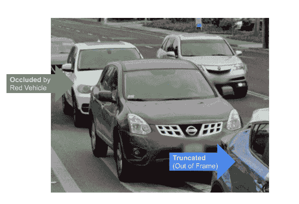

###### 图 3-1. 遮挡和截断的示例

为了使这更容易，我们使用约束。例如，我们可能限制汽车可以有一个方向向量，但人行道不可以。一种疾病可能有多种类型，或者我们可能限制只能选择一种类型。在最简单的情况下，如果我们想象标签“猫”和“狗”是两种选择，我们被限制只能选择这两个选项。

### Schema 复杂性的权衡

Schema 的复杂性影响了 ML 程序和人类监督。总体 Schema 可能与在任何给定时刻向用户展示的监督不同。从这个意义上说，ML 预测和最终用户的校正可能是分离的。

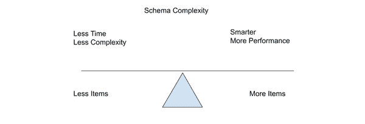

###### 图 3-2. 常见 Schema 权衡考虑的光谱

更多 Schema 的好处通常是一个“更智能”的系统。例如，如果我们没有关于“是否冒犯？”的标记数据，那么我们将无法训练模型。更多的标签也提供了对性能更多的见解。

系统随着时间的推移往往会扩展它们具有的标签和属性的数量。理解 Schema 及其 Schema 使用复杂性的一个好的“餐后餐巾纸”方式是将属性的数量乘以注释的数量。

媒体类型可能会极大地影响复杂性权衡。例如，对于图像，如果每个对象都需要标记，则模式的复杂性可能会因每个图像中的对象数量而增加。在视频环境中，这可能会进一步增加每帧的复杂性。模式越复杂，模型训练的复杂性就越大。

### 属性深度

想象一个杂货店结账系统。可能有多种规格的某个品牌的麦片盒，我们的目标是识别特定的库存编号（SKU）。在这种情况下，我们可能希望对我们的属性进行“数据库回溯”。随着库存的变化，呈现的选项也会发生变化。

此外，我们加载成千上万甚至数百万的选项。撇开关于搜索和选择每个属性的 UI 挑战，这是一个完全合理的解决方案。在撰写本文时，这里没有“正确”的答案。一个系统可能很容易拥有少数属性，也可能有成千上万个。

模式深度也可能受到条件语句和复杂层次结构的影响。在任何时候，我们都可以将一个属性扩展为子节点或节点列表。例如，选择“否”可能会展开一个“否 - 选项”节点。对于任何给定的选择，扩展成为子节点是一个选项。通常，在这里讨论的相同原则适用。

## 空间类型的关系

想象一下，对于我们的体育迷检测器，我们有一个顶层对象“人”。然后，为了检测他们是否穿着冒犯的衬衫或者做出冒犯的动作，我们有一个“is_offensive”属性。

这里的一个考虑因素是，如果选择了像语义分割这样的 ML 任务，并且使用多边形，那么选择的属性是否对应于轮廓中的每个像素？每个实例通常只有一个空间类型。因此，虽然我们在考虑衬衫，但实际数据是关于*整个人*的。

这种风险是因为虽然我们作为人类知道冒犯的部分是衬衫，但我们实际上编码到机器中的是整个区域是冒犯的。为了帮助可视化这一点，请考虑对机器来说，这些东西在功能上是等同的。

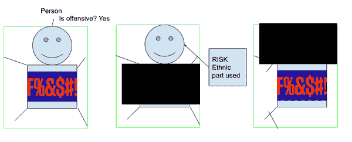

###### 图 3-3\. 不良偏见风险模式示例。最左边的框架是注释时显示的示例。表面上看可能合理。然而，中心和右侧的图像是两个类似的数据示例，但有些部分被遮挡。由于在训练时整个图像被声明为代表冒犯，ML 程序可能仅基于人脸而不是可能假设的 T 恤进行预测。

模型可能会轻松地利用面部的种族特征而不是 T 恤，从而使其有可能将某些具有某些面部或民族属性的人分类为“冒犯”。这种关系在标签中更为明显，因为它们是“顶层”的，但在“隐藏”的属性组中可能更为微妙。

考虑到一些系统（甚至人们）会使用这种类型的训练数据而不看样本，或者没有批判性地分析其模式构建。为了避免这种情况，我们希望确保模式编码的是实际存在的内容，尽可能准确地记录系统周围的假设。

### 避免空间偏见的一种方式

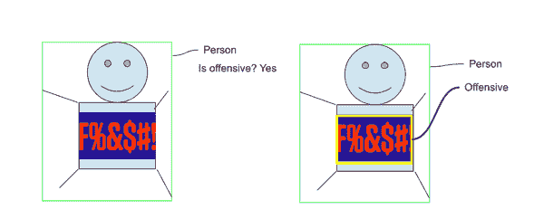

###### 图 3-4\. 使用框来避免空间偏见（右侧，黄色）

想象一下，你在向一个孩子解释这个情况。我会说：“那个人穿了件冒犯性的衬衫”。而不是“那个人很冒犯”。虽然后者可能是真的，但这并不准确描述观察到的逻辑情况。

对此的一种解决方法是将标签拆分为两个部分。然后空间位置（例如黄色框的位置）可以更好地代表标签。关键在于，我们试图使空间位置能够代表我们感兴趣的项目 - 只有我们感兴趣的项目。

现在或许将来某些训练方法会允许这样做。然而，今天我们可以通过在训练数据层次上简单地意识到这一点，并在我们布置类别时更加精确，相对容易地减轻这种风险。

为了进一步理解重要性，想象一个自动警报系统，该系统正在监视{枪支、刀具、炸弹}或其他实时威胁（例如机场安全）。如果系统训练的图像中有人持枪，但没有将人与枪分开，那么当某个特定族裔的人出现时，系统误触发的风险就存在（尽管没有枪！）。

如果注释的空间区域是我们关心的真实对象，理论上所有背景数据都不应该相关。然而，在实践中这可能并非如此，因此对使用的整体数据的意识仍然是一个共同的责任。

### 共同责任

如果你是一名数据专家，你可能认为这与你无关。因为当然这是一个“模式层次”的问题。同样，如果你正在设计模式，你可能会假设数据专家会注意到这一点并发出警报。显然，识别模式有风险生成糟糕数据是一个**共同的**责任。

另一个了解实际数据及其与模式关系的原因是创建更高质量的数据，从而实现更快速、更好的模型。

例如在这里，如果你在个人级别进行识别攻击物品，则可能需要更多的数据。通过将空间位置的范围缩小以更好地匹配所讨论的对象，我们提高了数据的整体质量。

正如前面提到的，这不是一本伦理学书籍。在这里，我概述了选择属性及其相关空间位置的直接技术影响。还有更多的权衡，我鼓励你只把它当作对 Schema 和谁负责的新推理的引入。

## 重要性在于它是什么

我之前简要提到为什么“什么”很重要。进一步考虑，在定义“何处”时往往存在严格的限制。在复杂情况下，可以将多个传感器组合起来表示复杂的三维视图。在分割情况下，每个像素都很重要。

然而，在每种情况下，声明空间位置的能力是相对有限的。只有那么多像素或体素等。要么那里有一个物体，要么没有。

或者不是吗？

部分对象怎么办？通常对于复杂情况，我们看到的是提供了一般的定位，比如一个运动员：

[ 玩家带有边界框的绘图 ]。


###### 图 3-5。即将到来的图例说明

在这种情况下，可以说玩家“奔跑”，或者可能“进攻”？那么如何识别玩家是谁呢？当然我们可以说“肢体”处于某种位置，但这究竟意味着什么呢？

此外，通过各种辅助和基于像素的方法，定位相对来说更容易解决。而在生活中某些概念的“*含义*”则是哲学书籍的主题。

明确的是，在定位新对象时仍然可能面临重大挑战，但通常来说，对于持续的关注点，“它是什么”的“含义”变得更为核心。

### 隐藏的背景案例

当我们考虑某物体的位置时，有时从某物体不在的地方开始更有用。例如，当我们说在某些地方是红绿灯时，我们实际上是说图像的 96% *不是* 红绿灯。这是 *何处* 与 *什么* 的混淆。

在目标检测的情况下，通常通过“对象性”评分来处理，与区域建议方法集成。其实现超出了本书的范围。在与训练数据相关时，通常会创建与使用方式不成比例的训练数据。

例如，对于人类来说，层次化的“嵌套”列表可能更容易显示。但实际实践中可能有多种实现方式。比如“展平”标签（red_occluded_20, red_occluded_40），但结合多个网络，或者使用支持嵌套的架构。

根据实现方式，有可能预测：

+   一个对象在这里

+   对象分类是 x

这些方法可能会在未来发生变化，并且已经有了显著的方法广度。

### 标签之间共享属性的示例

早些时候我介绍了标签作为定义“什么”是某物的最高级语义含义。例如“草莓”或“叶子”。属性则作为“什么”的广度和深度被引入。那么它们如何一起工作呢？

让我们想象我们正在建立一个系统，自动检测体育比赛中有多少粉丝为一队而不是另一队加油。也许它还需要识别“冒犯性”内容。

我们可能想要识别衣物，如 T 恤、裤子和球帽。所有这些物品都有诸如颜色、队徽、是否冒犯等“什么”表现形式是共同的。可能还有某些只与 T 恤或球帽相关的事物。

一种结构化的方法是将 T 恤、裤子和球帽作为标签。然后创建一个名为“颜色”的属性，其中包含诸如“红色”、“蓝色”、“绿色”等不同的属性。所有的标签都可以访问这个属性。

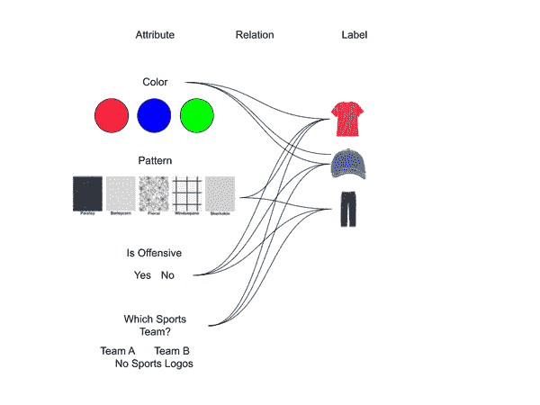

###### 图 3-6\. 属性与标签之间的关系。

在这里思考的权衡的一个高层次示例。确定颜色是否值得？也许穿戴一个队的颜色很常见，但是标志可能看不见。所以也许对颜色有一个良好的理解可能用于进一步的下游处理，以确定这个人正在为哪支队伍加油。

## 技术规格

以下解释了定义和使用属性的技术细节。

### 属性关联到实例的技术示例

例如，一个最小组可能以下面的形式表示，如下所述。

```
"instance_list": [
      {
        "type": "box",
        ... 
        "attribute_groups": {
          id_of_group : {
            "id": id_of_attribute_selected
            "kind": "select"
          }
        }
      },
      {... another instance } 
...
]
```

在这个例子中，有一个名为 `instance_list` 的关键字，其中每个注释都是一个实例。

每个实例都有一个名为 `attribute_groups` 的关键字，其中包含上述定义的属性。例如，如果有 3 组，则在 `attribute_groups` 字典中会有 3 个键。然后，每个属性都有关于其选择状态的信息。例如，所选值的 ID，或者自由文本的原始字符等。

### 表示形式，按引用与按值

这很重要，因为你的模式可能会随时间改变。

如下所示，模式中的某些内容可以定义为引用。例如，在这里，每个选项可以表示为单选按钮选择。然而，对于其他类型的属性，如自由文本，答案可能对每个实例都是唯一的。

有时，为了便于变更管理，即使可以通过引用传递，也将模式或按值传递“锁定”是有用的。从非常高层来看，更容易将标签视为“变动缓慢”的概念，而属性则是“快速变动”的。因为相对容易从标签中添加和删除属性，但更改标签可能会对其他属性引入破坏性更改。对于技术人员来说，在数据库中表（标签）和列（属性）的类比在这里非常适用。

### 高级技术规格：

属性代表人类定义的含义与机器学习可读数据之间的联合。

在实践中，训练数据软件有许多实现细节使其成为现实。作为高层概述，这里有一些常见属性的示例，它们的高层类型和约束。

表 3-2。属性技术规格表

| 属性 | 示例 | 输出类型 | 通过引用或值存储 | 约束 |
| --- | --- | --- | --- | --- |
| 选择（下拉框）或单选按钮（所有选项都显示） | 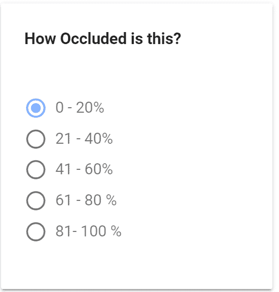 | 字符串 | 参考 | 允许列表 |
| 多选 | 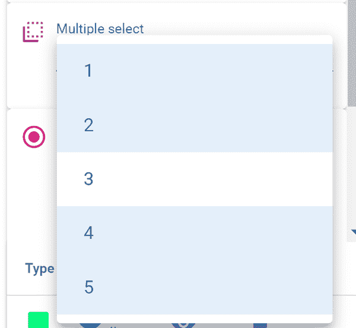 | 列表 | 参考 | 允许列表 |
| 自由输入 |  | 字符串、整数 | 值 |

+   阻止列表

+   强制类型（字符串、整数、浮点数等）

+   强制范围

|

| 滑块 |  |
| --- | --- |
| 日期 |  | 日期字符串或 ISO 8601 | 值 | 是否日期 |
| 子节点 | 扩展另一个属性组 | 例如唯一哈希、整数，例如整数主键 | 参考 |  |

#### 属性 vs 属性组

为了说话方便，有时我将像颜色这样的属性简称为“属性”。更技术上讲，这是一组属性。

### 属性的技术示例

这假设某种映射，即`id_of_group`到关于该组的信息是可用的，例如：

```
"attribute_groups_reference": [
    {
      "id": id_of_group ,
      "options": [
  {
            "id": id_of_attribute_selected
            "name": "option_name"
          }
],
      "prompt": "user defined prompt",
    }
  ]
```

[插图] 例如类似于：


###### 图 3-7。待添加图例说明

# 它在哪里？- 空间表示

在这里，我将介绍常见的空间类型和概念。稍后我们将看到这些如何与机器学习任务相关，并介绍它们之间的一些常见权衡。也被称为定位、空间位置、空间类型、形状、绘图工具。

## 计算机视觉空间类型

分割、框和完整图像是三种流行的方法。

### 完整图像标签

完整的图像标签缺乏空间位置，在某些情况下可能会限制它们的有用性。在模式非常广泛的情况下，标签仍然可能非常有用。然而，在其他情况下，如果我们不知道物品在哪里，或者有多个物品，则价值较低，在这些情况下，存在这样一种错误的假设，即感兴趣的“物品”已经填满了框架，这可能不现实或过于限制潜在的结果。

### 方框

边界框是目标检测中最为“可靠”的方法之一。

一个框由恰好 2 个点定义。它只需要 2 个信息来存储一个框：例如可以定义为（左上点 x,y）和（宽度，高度），或者作为（x_min，y_min）和（x_max，y_max）点对。² 一个框可能会旋转，并由原点和旋转值定义。

[框示例图]


###### 图 3-8\. 即将呈现的图注

### 多边形

逐像素地贴标签可能非常痛苦。因此，为了避免这个问题，使用了各种更高级别的类型。在这种情况下，可以围绕边界绘制多边形。多边形是“在哪里”（空间性）和标签“肝脏”是“什么”。多边形通常由至少 3 个点自然定义。多边形可能有多少点并没有预先定义的限制。通常通过辅助过程创建点，例如拖动鼠标或按住 Shift 键，或“魔棒”类型工具。

[多边形示例图]


###### 图 3-9\. 即将呈现的图注

在上述分割示例中继续，在图像的上下文中，“每像素”标签可用，这里每个绿色像素预测为 CT 扫描上的“肝脏”：

[图像上的像素级注释示例/分割示例/示例]


###### 图 3-10\. 即将呈现的图注

空间位置的一个示例是“每像素”或更常见的“像素级”。

是 2D 定位的“最高”级别。

### Keypoint

Keypoint 是另一种类型。关键点类型是一个带有定义节点（点）和边的图形。例如，人体解剖模型，定义了手指、手臂等。

### 椭圆和圆

由中心点和半径（x,y）定义。这些用于表示圆形和椭圆对象。它的功能类似于框。也可以旋转。

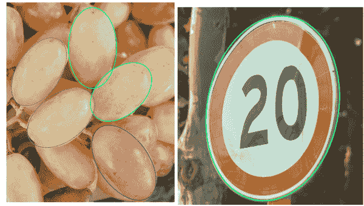

###### 图 3-11\. 椭圆示例

### 长方体

长方体有两个“面”。这是 3D 长方体在 2D 空间上的投影。每个面实质上是一个“框”。


###### 图 3-12\. 长方体示例

## 线和曲线

### 直线

2 个点

### 二次曲线

2 个点和一个控制点。

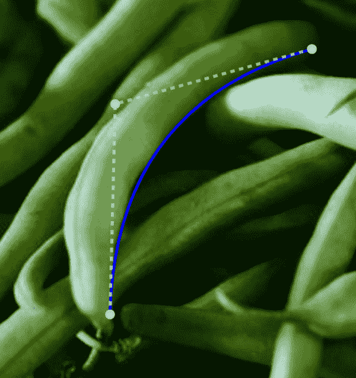

###### 图 3-13\. UI 中二次曲线示例

## 多用途类型

一些类型具有多种用途。多边形可以通过找到最极端的点轻松用作框。并不存在确切的“层次结构”。

## 复杂的空间类型

复杂类型指的是由一组多个“原始”类型（如上面定义的框和多边形）定义的空间位置。这与称为“多模态”的概念类似，但不同。通常，“多模态”指多个原始数据项。

复杂类型的常见用例是复杂多边形。例如，部分由二次曲线段定义，部分由“直”点段定义的多边形。

## 架构和创建类型的权衡

与概念相关性

一般来说，类型必须在某种程度上“匹配”概念。例如，强行使一个八边形形状适用于汽车不太可能产生好处。

注释时间

当然，复杂性越高，所需时间就越长。但通常情况下，它呈现出一种阶梯函数的形式，例如，分割可能比标注框长 10 倍的时间。

图像和视频相关的比较显示在图 2-10 中。在其他媒体类型中增加更多精度时存在类似的权衡。例如文档 > 句子 > 单词 > 字符。

## 用法类型的权衡

+   计算成本

+   研究的完整性

+   输出的复杂性

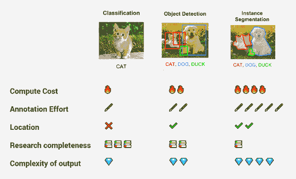

###### 图 3-14\. 不同空间类型的权衡。³

# 什么时候？- 关系，序列，时间序列

## 序列与关系

许多最有趣的案例之间存在某种形式的实例关系。

想象一场足球比赛。一个足球被球员触碰。这可以被视为一个“事件”。在给定的帧，例如第 5 帧。在这种情况下，我们有两个实例，一个是球，一个是球员。它们都在同一帧中。它们可以通过两个实例之间的注释关系进行正式链接，或者可以假定它们在时间上是相关联的，因为它们出现在同一帧中。

## 当

另一个重要的概念是关系。考虑将我们的静态图像示例升级到视频内容。从人类的角度来看，我们知道帧 0 中的“肝脏”与帧 5、10 等中的同一器官是相同的。它在我们的思维中是一个持久的对象。这需要以某种形式表示，通常称为序列或系列。或者它可以用于在更广泛的上下文中“重新识别”对象，例如在不同背景中出现的同一个人。

[插图：不完全是这个，但是展示同一对象的某些内容。（此文本包含插值，这是一个独立的概念）]

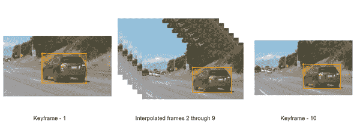

###### 图 3-15\. 插值示例

# 指南，说明

当然，我们如何知道将其标记为“肝脏”？我确实无法仅凭某种形式的指南来弄清楚。那么，肝脏的某些部分被胆囊或胃遮挡了呢？

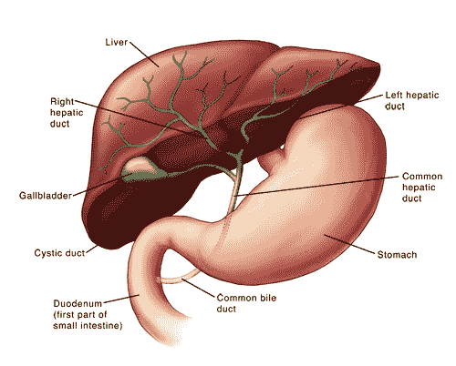

###### 图 3-16\. 标题

在培训数据的背景下，我们正式定义了指南的概念。从严格意义上讲，指南应该像实际的培训数据一样得到尊重，因为培训数据的“含义”由指南定义。在某种意义上，指南解决了“如何”和“为什么”的问题。

我们已经涵盖了一些代表训练数据的高级机制。虽然复杂的情景和约束可能是一个挑战，但真正的挑战通常在于定义有用的指令。例如，NuScences 数据集，每个顶级类别大约有一段文字、项目符号和 5 个以上的例子。

在图 2-13 中，示例图像展示了“自行车架”和“自行车”之间的区别。这将作为给标注者的更大指南的一部分提供。

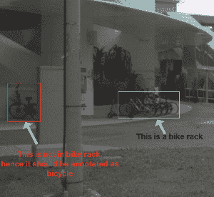

###### 图 3-17\. 为标注者提供的澄清图像示例

## 判断调用

要看看这些问题如何迅速变得棘手，考虑一下“可驾驶表面”与“碎片”的区别。NuScences 将其定义为“放置在可驾驶表面上的碎片或可移动物体，其尺寸太大以至于不能安全通过，例如树枝、满满的垃圾袋等。”⁴

当然，对于半挂车和轿车来说，可以安全驾驶的地面是不同的。甚至还没有涉及像“你是否应该驾驶过碎片以避免追尾”这样的语义选择。

## 选择好的名称

计算机科学有一句经典的话，说计算机科学中有两件难事，其中一件就是命名⁵。在书的后面，我会更详细地介绍好的和坏的训练数据的概念，但现在让我们只考虑它的“结构”。

我们将介绍关键概念，然后深入探讨其技术细节的含义。

在历史上，视觉和自然语言处理（NLP）被视为非常不同的任务。在新的深度学习背景下，它们有更多的重叠。

回到我们猫的例子，把训练数据看作是直接的很诱人 - 特别是在早期历史中，这通常是一个外包任务。然而，复杂性正在迅速扩展。

# 机器学习任务与训练数据的关系

训练数据用于机器学习系统。因此，希望了解常见的 ML 任务及其与训练数据的关系是很自然的。

社区普遍一致认为这些任务的分类是合理的。还有许多其他资源从机器学习的角度提供了对这些任务更深入的了解。在这里，我将从训练数据的角度简要介绍每个任务。

## 任务

### 语义分割

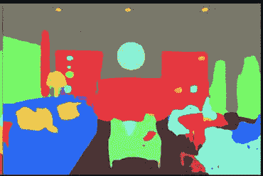

###### 图 3-18\. 图题

每个像素都被分配一个标签。

这种升级版被称为“实例分割”，在这种情况下，原本会被分配相同标签的多个对象被区分开来。例如，如果有 3 个人，每个人都会被识别为不同的个体。

使用训练数据，这可以通过“向量”方法（例如多边形）或“光栅”方法（想象一把画笔）来完成。撰写本文时，趋势似乎更偏向于向量方法，但这仍然是一个悬而未决的问题。从技术角度来看，向量方法要高效得多。请记住，这里的用户界面表示可能与存储方式不同。例如，UI 可能展示一个“桶”类型的光标来选择区域，但仍将该区域表示为向量。

在撰写本文时，另一个选择问题是如何实际使用这些数据。一些新方法预测多边形点，而“经典”方法则是每像素处理。如果用于训练数据的是多边形，并且 ML 方法是经典的，那么多边形必须经过转换过程，变成“密集”掩码（这只是另一种说法，每个像素对应一个类）。反之亦然，如果模型预测了密集掩码，但 UI 要求多边形以便用户更轻松地编辑，则需要将其转换为多边形。

注意，如果模型预测向量（多边形）以满足分割的经典定义，则必须将向量光栅化。光栅化意味着转换为密集像素掩码。根据您的用例，这可能是不必要的。请记住，虽然每像素掩码可能看起来更准确，但如果基于向量方法的模型更精确地捕捉了相关方面，那么这种准确性可能更多是虚幻的而非真实存在的。这对包含有良好记录的曲线的背景尤为重要，这些曲线可以由少数点建模。例如，如果您的目标是获得有用的曲线，直接预测二次曲线的少数值可能比从每像素预测回到曲线更准确。

虽然有许多优秀的资源可用，其中最重要的之一是 Papers With Code 网站，列出了超过 885 个计算机视觉任务、312 个 NLP 任务以及其他类别中的 111 个任务。⁶

让我们来看一个医疗用例的示例。如果目标是进行自动肿瘤分割（例如 CT 扫描），则需要分割训练数据。⁷ 研究人员经常强调训练数据的重要性。*“医学图像语义分割的成功取决于高质量标记的医学图像数据的可用性。”*⁸

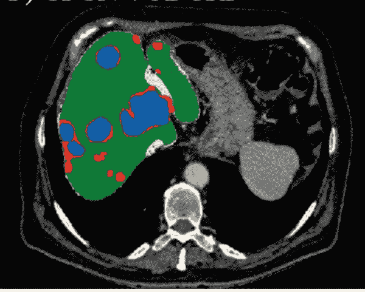

###### 图 3-19\. 肿瘤分割示例（Segmentation 的一个子类）⁹

训练数据是与任务目标同时创建的，例如自动肿瘤分割。在上述示例中，每个像素对应一个分类，这被称为“像素级”。在这张 CT 扫描中，每个绿色像素被预测为“肝脏”。

### 图像分类（标签）

整体图像分类。一幅图像可能有许多标签。虽然这是最通用的方法，但要考虑到其他所有方法本质上都是建立在这个基础上的。从注解的角度来看，这是最直接的方法之一。

### 物体检测

检测多个对象的空间位置并对其进行分类。这是经典的“框绘制”。通常是最快的空间位置注释方法，并提供了获取空间位置的重大进展。如果你不太确定从哪里开始，这是一个很好的“默认选择”，因为它通常是性价比最高的。

尽管大部分研究集中在“框”上，但并没有这样的要求。还可以有许多其他形状，如椭圆等。

### 姿势估计

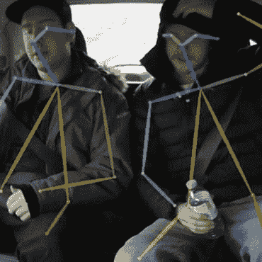

###### 图 3-20\. 标题

在高层次上，这是“复杂物体检测”。与框这样的一般形状不同，我们试图获取“关键点”（图形）。这些点之间存在图形关系。例如，左眼在右眼某些范围内等等。

从训练数据的角度来看，这是通过关键点模板处理的。例如，创建一个包含 18 个点的人体骨架表示，以指示姿势和方向。这与分割/多边形不同，因为我们不是绘制轮廓，而是实际上在形状的“内部”绘制。

## 图表 - 任务与训练数据类型的关系

注解数据与机器学习任务之间没有一对一的对应关系。然而，通常存在松散的对齐，一些任务在没有一定级别的空间数据的情况下是不可能完成的。例如，可以将更复杂的多边形抽象为物体检测的框，但不能轻易地从框转换到分割。

表 3-3\. 空间类型与机器学习任务的映射

| 训练数据空间类型 | 机器学习任务示例 |
| --- | --- |
| 多边形，笔刷 |

+   分割

+   物体检测^(a)

+   分类

|

| 盒子 |
| --- |

+   物体检测

+   分类

|

| 长方体 |
| --- |

+   物体检测

+   3D 投影

+   姿势估计

+   分类

|

| 标签 |
| --- |

+   分类

|

| 关键点 |
| --- |

+   姿势估计

+   分类

|

| ^(a) 技术上来说，它可以用于物体检测，但通常这是一个次要的目标，因为使用通用检测基础的框更快速。 |
| --- |

# 一般概念

以下概念适用于空间和什么

## 实例概念复习

几乎所有讨论的内容都与实例（注解）相关。一个实例代表一个单一样本。例如，这里的每个人都是一个实例。

实例具有标签和属性的引用，还可以存储特定于该实例的具体值，如特定的自由文本。

在视频或多帧上下文中，一个实例使用额外的 ID 来关联不同帧中的其他实例。每帧仍然有一个唯一的实例，因为数据可能不同，例如，一个人可能在一帧中站立而在另一帧中坐着，但他们是同一个人。

为了说明一个微妙的差别，考虑这里的所有 3 个人都有相同的“类别”，但是是不同的实例。如果没有这个实例的概念，那么我们会得到像中间图像那样的结果。

显示如下的图像：

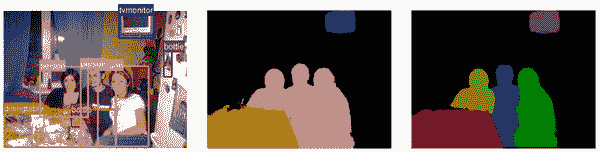

###### 图 3-21。将人们视为一个群体与视为单个人（实例）的比较。¹⁰

考虑到每个实例，可能有*n*个属性，这些属性反过来可能有*n*个子节点，而子节点可能有自己的任意类型/约束（如选择、自由文本、滑块、日期）？是的 - 实际上，每个实例几乎就像是一个小的信息图。如果这还不够复杂，空间位置实际上可能是 3D 的。而且可能会有一系列帧。

现代软件工具很好地处理这些概念之间的关系。挑战在于数据监督必须至少在某种程度上理解目标，以便做出合理的工作。

此外，类型必须与神经网络中的用例保持一致。在构建训练数据时，常见的网络架构有一些需要注意的假设。

## 随着时间的推移升级数据。

在某些情况下，随着时间的推移升级数据是相当合理的。例如，一个常见的模式。

+   运行一个“弱”分类器来标记图像，纯粹意在识别“好”的训练数据。

+   人类创建边界框。

+   在以后的某个时间点，确定需要分割的特定类别。然后可以使用边界框为一旦粗略定位完成（现有边界框），设计的算法“生成”分割数据。

## 建模与训练数据之间的边界。

训练数据与机器学习模型实际使用它的方式经常存在不一致。前面展示的一个例子是，空间位置与机器学习任务没有一对一的映射。其他一些例子包括：

+   机器学习模型使用整数，而人类看到的是字符串标签。

+   一个模型可能“看到”密集的像素掩码（用于分割），但人类很少甚至从不考虑单个像素。通常，分割掩码实际上是通过多边形工具绘制的。

+   机器学习研究和训练数据独立进行。

+   “在哪里与是什么”问题：人类经常混淆某物的位置和它是什么，但这在机器学习程序中可能是两个不同的过程。

+   将人类相关属性转换为模型中使用的属性可能会引入错误。例如，人类查看的是一个层次结构，但模型将该层次结构展平。

+   机器学习程序在本地化方面的努力与人类有所不同。例如，人类可能使用 2 个点来绘制框，而机器可能从一个中心点进行预测¹¹，或者使用其他与绘制的这两个点无关的方法¹²。

基本上这意味着：

+   我们必须不断提醒自己，机器学习建模与训练数据是不同的。整数，而不是人类标签，有不同的本地化过程，不同的关于位置与内容的假设等等。随着训练数据和机器学习建模的独立进展，这种差异预计将会扩大。

+   尽可能捕获关于如何构建训练集的所有假设。如果使用任何类型的辅助方法来构建数据，则这一点尤为重要。

+   理想情况下，管理训练集的人应该了解模型如何实际使用数据。而管理模型的人，也应该了解数据集是如何管理的。

+   训练数据能够根据变化的需求进行更新至关重要。当与训练数据交互的机器学习程序发生变化时，不存在有效的静态数据集。

## 原始数据概念

原始数据指的是字面数据，图像，视频，音频剪辑，文本，3D 文件等等，受到监督。技术上来说，这是附加到人类定义的含义的原始字节或 BLOB。

原始数据是不可变的，而人类定义的含义是可变的。我们可以选择不同的架构，或者选择如何标记它等等，但是原始数据就是原始数据。在实践中，原始数据通常会经历某种程度的处理。这种处理会生成新的 BLOB（二进制大对象）工件。这种处理的目的通常是为了克服实施级别的细节。例如，将视频转换为可流式传输的 HTML 友好格式，或者重新投影 GeoTIFF 文件的坐标以与其他图层对齐。

这些处理步骤通常在训练数据软件中进行记录。有关处理的元数据也应该是可用的。例如，如果在预处理步骤中使用了某种特定的令牌解析方案，机器学习程序可能需要知道这一点。通常这不是一个主要问题，但需要注意。

最好保持数据尽可能接近原始格式。例如，原生渲染 PDF 与 PDF 的图像的对比。或者原生 HTML 与屏幕截图。这是生成新工件的实施细节的补充。例如，视频可以以视频格式播放，并且可能额外生成帧的图像作为工件。

准确性是一组给定测量值与其真实值之间的接近程度。一些机器学习程序的准确性约束可能与训练数据的约束非常不同。例如，在注释期间的分辨率可能与训练时的分辨率不同。这里的主要工具是元数据。只要清楚在 BLOB 被监督时存在哪种分辨率或准确性，其余必须根据具体情况处理。

历史上，模型通常具有固定的分辨率限制（准确性），然而这一点仍在不断发展。从训练数据的角度来看，主要责任是确保机器学习程序或团队在人类监督时知道准确性的水平，并且了解是否存在任何已知的准确性假设。例如，表明假设，例如某个属性需要人类才能达到最低分辨率水平。

一些 BLOBs 提出了额外的挑战。例如，一个三维点云可能包含比图像更少的数据。¹³ 然而，对于最终用户来说，三维注释通常比图像注释更加困难。因此，尽管技术数据可能较少，但人类监督部分可能更加困难。

多个 BLOBs 可能被合并为一个复合文件。例如，多个图像可以作为单个文档相关联。或者一个图像可能与一个单独的 PDF 相关联。相反，一个单一的 BLOB 可能被分成多个样本。例如，将一个大扫描分成多个部分。

BLOBs 可能在不同视图之间进行转换。例如，将一组二维图像投影到一个单一的三维框架中。进一步地，这个三维框架可以从二维视图进行注释。作为相关概念，数据可能在不同的维度空间中标记，而不是它所训练的维度空间。例如，标签可能在二维环境中完成，但在三维空间中进行训练。这里需要注意的主要是区分人类监督和计算或预测值之间的差异。

总结一下，潜在原始数据（BLOB）格式和相关的工件具有高度复杂性。训练数据的主要责任是记录完成的处理步骤，记录人类监督时存在的相关假设，并与数据科学合作，确保人类监督时的准确性与在机器学习程序中的使用之间的对齐。通过这样做，我们承认我们可以做出的假设限制，并提供一切必要的内容来最大程度地利用数据和整体系统的成功。

# 摘要

接下来，我们将从这个高层视角转向数据专家的视角。我们如何确切地监督和注释这些数据呢？

¹ [`dl.acm.org/doi/pdf/10.5555/77708`](https://dl.acm.org/doi/pdf/10.5555/77708) 第 43 页 实际 PDF 第 68 页 “在后续论文中（例如，Codd 1971a, 1971b 和 1974a），我意识到需要进行区分，并引入了作为声明数据类型的域和作为域具体使用的属性（现在通常称为列）。”

² [`medium.com/diffgram/how-do-i-design-a-visual-deep-learning-system-in-2019-8597aaa35d03`](https://medium.com/diffgram/how-do-i-design-a-visual-deep-learning-system-in-2019-8597aaa35d03)

³ [`medium.com/diffgram/how-do-i-design-a-visual-deep-learning-system-in-2019-8597aaa35d03`](https://medium.com/diffgram/how-do-i-design-a-visual-deep-learning-system-in-2019-8597aaa35d03)

⁴ [`github.com/nutonomy/nuscenes-devkit/blob/master/docs/instructions_nuscenes.md`](https://github.com/nutonomy/nuscenes-devkit/blob/master/docs/instructions_nuscenes.md)

⁵ 预测何时使缓存失效是另一个问题。

⁶ [`paperswithcode.com/sota`](https://paperswithcode.com/sota) 于 2020 年 10 月 4 日访问

⁷ arXiv:1702.05970 [cs.CV] 利用级联全卷积神经网络进行 CT 和 MRI 体积的自动肝脏和肿瘤分割 - Patrick Ferdinand Christ 等

⁸ [`arxiv.org/pdf/1902.09063v1.pdf`](https://arxiv.org/pdf/1902.09063v1.pdf)

⁹ arXiv:1702.05970 图 7

¹⁰ [`davidstutz.de/bottom-instance-segmentation-using-deep-higher-order-crfs-arnab-torr/`](https://davidstutz.de/bottom-instance-segmentation-using-deep-higher-order-crfs-arnab-torr/)

¹¹ TODO 我认为我们可以参考一篇特定的中心点论文

¹² TODO 更具体些，我在思考 SSD 以及一些回归点的工作方式

¹³ 点云存储坐标三元组 (x, y, z)，通常有数百万个这些点。而单个 4k 图像包含超过八百万个 RGB（红绿蓝）三元组。
