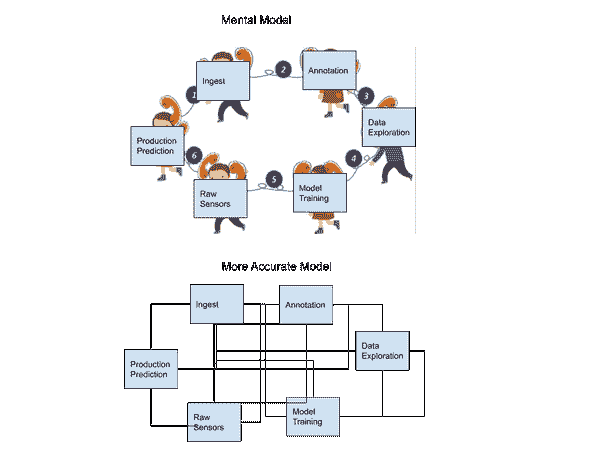
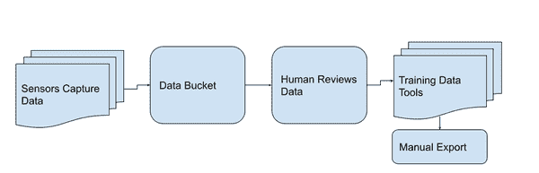
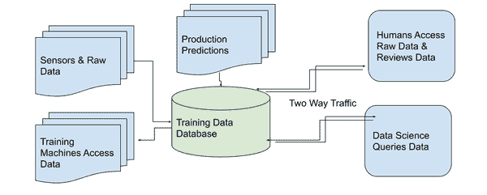
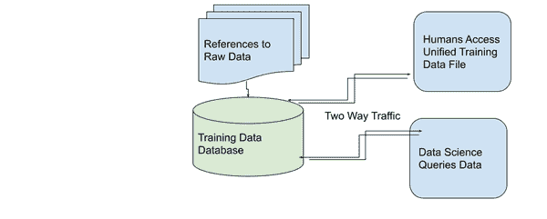
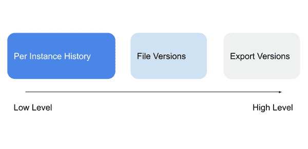
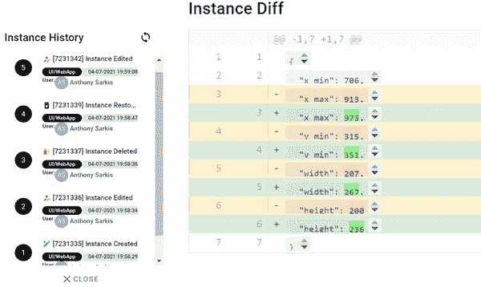
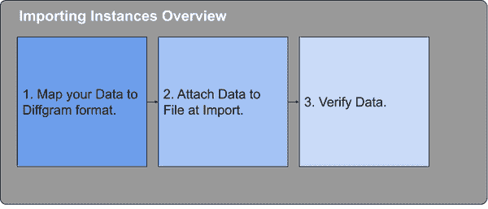
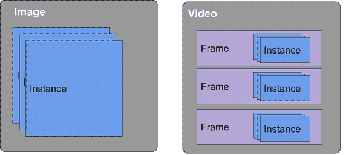

# 第四章：数据工程

# 介绍

在早期章节中，您已经了解了抽象概念。现在，我们将从技术介绍向前迈进，讨论实施细节和更主观的选择。我将向您展示在实践中如何处理训练数据的艺术，我们将通过扩展到更大项目和优化性能来进行缩放。

数据摄取是第一个也是最重要的步骤之一。在高层次上，这意味着将数据导入和导出到您的训练数据数据库中。为什么摄取很难？原因有很多。例如，训练数据是一个相对较新的概念，存在各种格式和通信挑战，数据的体积、多样性和速度各不相同，缺乏良好的建立规范，导致有许多方法可以完成它。

此外，还有许多概念，如使用训练数据数据库以及谁何时想要访问什么，这些对经验丰富的工程师甚至可能不明显。摄取决策最终确定查询、访问和导出考虑因素。

本章分为：

+   谁想要使用数据以及他们何时想要使用数据

+   为什么数据格式和通信很重要，类似于“传声筒游戏”

+   介绍训练数据数据库

+   开始的技术基础

+   存储、特定媒体需求和版本控制

+   格式化和映射数据的商业考虑

+   数据访问、安全性和预标记数据

要实现数据驱动或数据中心化的方法，需要工具、迭代和数据。迭代和数据越多，对处理它的优秀组织的需求就越大。

您可以按照摄取数据、探索数据和标注数据的顺序进行操作。或者您可以直接从摄取转到调试模型。在流式传输到训练之后，您可以摄取新的预测结果，然后调试这些结果，然后使用标注工作流。您越多地依赖您的数据库来进行大量工作，您需要自己完成的工作就越少。

## 谁需要这些数据？

在我们深入探讨挑战和技术细节之前，让我们先谈谈目标和参与其中的人员，并讨论数据工程如何服务于这些最终用户和系统。随后，我将讨论为什么需要一个训练数据数据库的概念性原因。我将通过展示没有它时的默认情况以及有它时的情况来说明这种需求。

为了便于讨论，我们可以将其分为以下几组：

+   标注者和最终用户

+   数据科学

+   ML 程序（机器对机器）

+   应用工程师

+   其他利益相关者

### 标注者和最终用户

最终用户需要在正确的时间以及具有正确权限的情况下获取正确的数据。通常情况下，这是在单个文件级别上完成的，并且受到非常具体范围请求的驱动。强调权限和授权。什么是“正确的时间”？一般来说，这意味着按需或在线访问。这是文件由软件流程（例如任务系统）标识，并且以快速响应时间提供的地方。

### 数据科学

数据科学最常见的是在数据集级别查看数据。更多的重点放在查询能力、处理大量数据的能力和格式化上。理想情况下，还应该能够深入到具体样本，并且定量和定性地比较不同方法的结果。

### 机器学习程序

机器学习程序与数据科学有类似的需求。区别在于权限方案以及什么时候以及如何公开显示内容。通常，机器学习程序可以具有软件定义的集成或自动化。

### 应用工程师

应用工程师关注将数据从应用程序传输到培训数据数据库，以及如何将注释和监督嵌入到最终用户中。每秒查询（吞吐量）、数据量通常是首要关注的问题。有时候会有一个错误的假设，即数据从“摄入”团队或应用程序流向数据科学的过程是线性的。

### 其他利益相关者

安全性、DevMLOps、备份系统等。这些团队通常关注跨领域的问题，并且横切其他用户和系统的需求。例如，安全性关心已经提到的最终用户权限。安全性还关心单个数据科学家不成为关键失败的单一点，例如，在其机器上拥有整个数据集或对远程集有过于广泛的访问权限。

现在您已经对涉及的群体有了概述，它们如何相互交流？它们如何共同工作？

## 电话游戏

没有对培训数据工程的知识，您的最终用户和系统将无法良好地互相配合。

作为类比，可以将其比作电话游戏。电话游戏是“一个游戏，你首先想出一个短语，然后把它耳语给坐在你旁边的人。接下来，这个人必须耳语给下一个人听。这种过程在圈内继续，直到最后一个人听到这个短语。错误通常会在重复中累积，因此最后一个玩家宣布的声明与第一个玩家的声明明显不同，通常具有幽默或滑稽的效果。”¹

在培训数据中，这些累积的错误并不滑稽。累积的错误会导致性能不佳、系统退化和故障。这些错误尤其普遍，因为这不是单向线性的集成，甚至不是双向同步。相反，这是一个类似图形的、非线性结构，连接传感器、人类、模型和其他数据工程系统。

这些问题在较大的、多团队的情境中特别普遍，在没有考虑到所有主要群体的整体需求时尤为突出。作为一个新兴标准的领域，即使是看似简单的事情也定义不清楚。换句话说，数据工程对于培训数据尤为重要。如果您有一个绿田项目，现在是计划您的数据工程的完美时机。

无论您是在规划新项目还是重新思考现有项目，一些信号表明您需要对数据工程采取新的方法包括：

+   每个团队都拥有自己的数据副本。

+   没有真正的培训数据记录系统。

+   您的记录系统并不全面地代表培训数据的状态（例如，将其视为仅仅是标签，而不是流程的重心）。

+   需要进行不合理水平的沟通才能进行更改（例如，更改模式）。

+   变更不能由最终用户流畅进行，而必须作为工程级别的变更进行讨论。

+   整体系统性能未达到预期或模型更新速度缓慢。

如果每个团队都拥有自己的数据副本，就会产生不必要的沟通和集成开销。这往往是“原罪”，因为一旦有多个团队这样做，要更新整个系统就需要进行工程级别的改变，这意味着更新不会顺畅进行，导致整体系统性能达不到预期。

一些试图避免这种情况的方法包括保留一个独立的系统作为数据的记录系统，而不是培训数据系统。这是多个团队拥有数据副本的另一种情况，存在类似的问题。数据将继续混淆，因此，虽然一个工具可能了解 xyz 属性，但下一个工具可能不会导入它，并且可能不会导出其存储或导入的所有属性。无论这些问题在白板上看起来多么微不足道，它们在现实世界中总是一个问题。

用户的期望和数据格式经常变化，以至于抵制过度死板的自动化过程。因此，不要以自动化的方式思考这个问题，而是要以“培训数据的重心在哪里？”来思考。它应该与人类和培训数据数据库一起，以获得最佳结果。



###### 图 4-1\. 整体流程的示例心理模型。

## 规划一个优秀的系统。

那么，如何避免“电话游戏”呢？它始于规划。以下是一些思考的起点，然后我将介绍实际设置的最佳实践。

首先，是建立一个与您的业务相关的有意义的工作单元。例如，对于一家分析医疗视频的公司，可以是单个医疗程序。然后，在每个过程中，考虑有多少模型（不要假设只有一个！），它们将如何更新，数据将如何流动等等。我们将在系统设计问题中更深入地介绍这个问题，但现在，我只是想确保清楚地表明摄取通常不是“一劳永逸”的事情。它是需要持续维护并随时间可能扩展的事情。

第二，考虑数据存储和访问的问题，即训练数据数据库。虽然“自己实现”可能性存在，但全面考虑所有群体的需求却很困难。训练数据数据库使用得越多，管理复杂性就越容易。使用独立存储的越多，就越加压力要“重新发明数据库的轮子”。

特别是在构建一个优秀的摄入子系统方面。通常理想情况是这些传感器直接反馈到训练数据系统中。想象一下在传感器、预测、原始数据与我的训练数据工具之间有多少距离或跳跃？

生产数据通常需要人类审核，以设置级别进行分析，并可能进一步“挖掘”以改进。预测越多，进一步系统校正的机会就越多。如何使生产数据以有用的方式进入训练数据系统？在工具处理过程中数据重复多少次？

我们对数据的各种用途之间的区别有什么假设？例如，在训练数据工具中查询数据比期望数据科学家导出所有数据然后自行查询要更加可扩展。

## 天真与训练数据中心方法

通常有两个主要概念需要注意：

天真方法

认为训练数据只是一系列现有步骤中的一个步骤。

训练数据中心方法

将训练数据视为人类监督系统的“重心”。例如，训练数据数据库具有原始数据、注释、架构和机器之间访问映射的定义和/或文字存储。

方法上自然存在一些重叠。一般来说，天真方法的能力越大，它就越像是训练数据中心方法的再创造。虽然使用其他方法可以实现理想结果，但使用训练数据中心方法可以更容易地持续实现理想结果。

让我们先看看天真方法通常是如何工作的。

### 天真方法

通常在天真方法中，传感器独立地捕获、存储和查询数据，如图 4-2\. 所示。这通常看起来像是一个线性过程，具有预先建立的起始和结束条件。



###### 图 4-2\. 天真数据工程流程示例

最常见的原因是使用天真的方法：

+   项目在训练数据中心方法成熟的工具支持之前就已经开始了

+   工程师们不知道有关训练数据中心方法的存在

+   测试和开发新系统

+   旧的历史数据，不可能有新数据进入（罕见）

+   不实用训练数据中心方法的情况（罕见）

初始方法往往像前面提到的电话游戏一样。由于每个团队都有自己的数据副本，因此随着数据的传递，错误会累积。由于没有记录系统或记录系统不包含训练数据的完整状态，因此难以在用户级别进行更改。总体而言，安全进行更改的难度越大，发货和迭代速度越慢，整体结果也越差。

另外，初始方法往往与隐藏或未定义的人工流程耦合。例如，某个工程师在其本地机器上有一个脚本执行整个流程的某个关键部分，但该脚本未记录或无法合理地供其他人访问。通常是由于对如何使用训练数据数据库的理解不足，而不是故意决定的过程。

在初始方法中，数据不必要地重复的机会较大。这增加了硬件成本，例如存储和网络带宽，除了上述概念上的团队瓶颈之外。它还可能引入安全问题，因为各种副本可能保持不同的安全姿态。例如，团队在处理链中的早期阶段关联数据并绕过安全性。

初始方法的一个主要假设是，人工手动审查数据，以便只导入希望注释的数据。换句话说，只有指定用于注释的数据才会被导入。这种“导入前人工”的假设使得有效监督生产数据、使用探索方法以及通常因隐藏的策展过程的手动和未定义特性而成为过程的瓶颈。

请从概念上考虑这一点，而不是从字面上的自动化角度。软件定义的摄取过程本身对整体系统健康的指示有所帮助，因为它并未涉及到关于使用训练数据数据库的任何真实架构问题。

### 训练数据中心化

另一种选择是使用训练数据中心化方法。如图 4-3 所示，训练数据数据库是训练数据中心化方法的核心。



###### 图 4-3 训练数据数据库

训练数据数据库具有原始数据、注释、架构和映射的定义和/或字面存储，供机器间访问等用途。理想情况下，它是系统的完整定义，这意味着有了训练数据数据库，你可以在不需要额外工作的情况下重新生成整个机器学习过程。

当你将训练数据数据库作为你的记录系统时，所有团队都有一个集中存储和访问训练数据的地方。数据库的使用越广泛，整体结果就越好，类似于在传统应用程序中正确使用数据库被认为是至关重要的。

使用这种方法的最常见原因：

+   它支持向数据为中心的机器学习迁移。这意味着专注于通过改进数据而不仅仅是改进模型算法来提升整体性能。

+   支持在一个流程中使用多个 ML 程序，通过在一个地方定义所有的定义。

+   支持最终用户监督（标注）数据，并支持将最终用户监督嵌入到工作流程和应用程序中。

其他原因包括：

+   将视觉用户界面需求与数据建模（例如查询机制）解耦。

+   可以更快地访问新的数据发现工具、标记方式等。

+   支持用户定义的文件类型，例如将“交互”表示为一组图像和文本，支持流畅的迭代和端用户驱动的更改。

+   避免数据重复，并将外部映射定义和关系存储在一个地方。

+   它解除了团队的阻塞，使其能够尽快工作，而不必等待离散的阶段。

使用训练数据数据库方法的问题：

+   需要知道其存在并理解其概念。

+   有时间、能力和资源使用训练数据数据库。

+   成熟的数据访问模式可能需要重新调整以适应新的上下文。

+   其作为记录系统的可靠性并不具有与旧系统相同的历史。

理想情况下，不是决定发送哪些原始数据（例如从应用程序到数据库），而是将所有相关数据发送到数据库。这意味着改变顺序，首先将所有数据放入数据库中。这有助于确保它是真正的记录系统。例如，可能有一个“标记方式”程序使用所有数据，即使人类只检查其中的一部分。通过训练数据数据库使所有数据对“标记方式”程序可用变得更加容易。记住这一点的最简单方法是将训练数据数据库视为流程的重心。

训练数据数据库承担管理对原始媒体的引用甚至包含文字字节存储的角色。这意味着直接将数据发送到训练数据工具中。在实际实施中，可能会有一系列处理步骤，但核心思想是数据的最终存放地、真实来源位于训练数据数据库内部。

训练数据数据库是系统的完整定义，这意味着给定训练数据数据库，您可以创建、管理和重现所有端用户 ML 应用程序需求，包括 ML 过程，而无需额外工作。这超越了通常更侧重于自动化、建模和单纯 ML 复现性的 MLOps。您可以将 MLOps 视为更战略的训练数据中心方法的子关注点。

训练数据数据库从一开始就考虑了多个用户，并相应地进行规划。例如，一个旨在支持数据探索的应用程序可以在摄入时自动创建用于数据发现的索引。当它保存注释时，可以同时创建用于发现、流式传输和安全性等的索引。

导出数据到其他工具的一个相关主题是。也许您想运行一些进程来探索数据，然后需要将其发送到另一个工具进行安全处理，比如模糊化个人可识别信息。然后您需要将其发送给其他公司进行注释，将结果返回到您的模型中等。在每个步骤中，都存在映射（定义）问题。工具 A 输出的格式与工具 B 的输入格式不同。之前我有过一些关于数据规模的讨论，但是快速提醒一下，这种数据传输通常比其他常见系统的数据传输量大一个数量级。我能想到的最好的经验法则是，每次传输更像是一个微型数据库迁移。

一般来说，传感器与训练数据工具之间的连接越紧密，所有最终用户和工具的潜力就越大。添加到传感器和工具之间的每一步几乎都有可能成为瓶颈。数据仍然可以同时备份到其他服务，但通常意味着从第一天开始组织训练数据工具中的数据。

### 第一步

假设您准备使用训练数据中心化方法。那么，您实际上该如何开始？

首先步骤是

1.  设置训练数据数据库定义

1.  设置数据摄入

让我们先考虑定义。训练数据数据库将所有数据放在一个地方，包括将映射定义到其他系统。这意味着系统记录和与训练数据系统内外运行的模块相关的映射定义都集中在一个地方。这减少了映射错误、数据传输需求和数据重复。

在我们开始实际摄入数据之前，这里有一些需要首先涵盖的术语。

+   原始数据存储

+   原始媒体 BLOB 特定关注点

+   格式化和映射

+   数据访问

+   安全关注点

让我们从原始数据存储开始。

# 原始数据存储

在高层次上，目标是将原始数据，如图像、视频和文本，转换为可用于训练数据工作的形式。

通常使用 Bucket 抽象来存储原始数据。这可以是在云上，也可以是使用像 MinIO 这样的本地存储软件。有些人喜欢把这些云桶看作是“倒入并忘记”，但实际上有很多性能调优选项可供选择。在训练数据规模下，原始存储选择很重要。如果您是一个存储专家，那么可以跳过这个小节。

存储类别

存储层之间的主要差异比初看起来的要大得多。折衷方案包括访问时间、冗余、地理可用性等。不同存储层之间的价格差异有几个数量级。最关键的工具之一是生命周期规则，通常可以通过几次点击设置策略，使旧文件自动转移到更便宜的存储选项。有关最佳实践的更详细例子可以在这里找到 [（更详细的内容）](https://diffgram.readme.io/docs/storage-tier-best-practices)。

地理位置（又称区域、地区）

您是否将数据存储在大西洋的一侧，而注释工具却需要在另一侧访问？值得考虑的是，实际的注释预期发生在何处，以及是否有存储数据更接近的选项。

供应商支持

并非所有注释工具对所有主要供应商的支持程度相同。请记住，通常可以手动集成其中任何一个提供的工具，但这需要比具有本机集成的工具更多的努力。

支持从这些存储提供商访问数据的功能与运行在该提供商上的工具不同。有些工具可能支持从所有三个提供商访问，但作为服务，工具本身只在单一云上运行。如果您在自己的云上安装系统，则通常工具将支持所有三个云。

例如，您可以选择在 Azure 上安装系统。然后，您可以从 Azure 中将数据拉入工具中，这将带来更好的性能。然而，这并不妨碍您根据需要从亚马逊和谷歌中拉取数据。

## 按引用或按值

如果您希望保持文件夹结构，一些工具支持引用文件而不是实际传输它们。这样做的好处是减少数据传输量。缺点是现在可能会出现断开的链接。此外，关注点分离可能是一个问题，例如，其他进程可能会修改注释工具期望能够访问的文件。

即使您对速率数据采用按引用传递的方法，系统的真实数据仍然是培训数据数据库。例如，数据可以在数据库中组织成集合，这些集合在存储桶组织中没有表示。存储桶仅表示原始数据，而数据库则包含注释和其他相关定义。

简单起见，最好将培训数据数据库视为一个抽象，即使原始数据存储在数据库物理硬件之外。



###### 图 4-4\. 如何参考原始 Blob 与培训数据数据库的其他功能。

## 自有硬件上的现成专用培训数据工具

在这种情况下，我们信任训练数据工具来管理已签名的 URL 过程。我们信任训练数据工具来处理 IAM 方面的问题。假设我们信任该工具（也许是因为我们可以检查源代码），唯一真正的问题就是它使用哪个存储桶 - 通常这成为一个一次性问题，因为该工具负责 IAM 的管理。对于高级案例，该工具仍然可以连接到单点登录（SSO）或更复杂的 IAM 方案。

工具不必在硬件上运行。更高级别是信任训练数据工具并信任服务提供商来托管/处理数据。尽管在那时大部分这些讨论已经不太相关，因为真的只是按照说明操作，然而，这是最低级别的控制。

## 数据存储

通过引用或实际移动数据。

## 数据位于何处？

一般来说，任何形式的工具都会生成某种形式的数据，将其添加到“原始”数据中。

这意味着如果我在存储桶 A 中有数据，并且我使用工具在那里处理它，要么在存储桶 A 中会有附加数据，要么我需要一个新的存储桶 B 供工具使用。这对于 Diffgram、Sagemaker 以及据我所知大多数主要工具都是真实的。

根据您的成本和性能目标，这可能是一个关键问题或不太重要的问题。在大多数用例的实际水平上：

+   期望将生成额外数据。

+   知道数据存储在哪里 - 但不要想得太多。

同样，我们并不真的关心例如 Postgres Write Ahead Log（WAL）生成了多少存储空间，我个人认为最好在这方面信任训练数据工具。如果有问题 - 在训练数据工具的抽象领域内解决。

## 存储桶连接

说了上面的所有 - 最好的抽象是从训练数据工具到存储桶创建连接。如何做这件事有各种不同的观点，并且具体细节会根据硬件和云提供商而变化。

[从 Diffgram UI 的文件浏览器中插入示例]

[插入示例解决方案架构，训练数据工具和存储桶]

对于非技术用户，这本质上是“登录”到一个存储桶。换句话说，我创建了一个新的存储桶 A，并且从 IAM 系统获取了用户 ID 和密码（客户端 ID /客户端密钥）。我将这些凭据传递给训练数据工具，并且它会安全地存储这些凭据。然后在需要时，训练数据工具使用这些凭据与存储桶进行交互。

## 原始媒体（BLOB）类型具体

BLOB 是二进制大对象。这是媒体的原始数据。根据您的媒体类型，将存在特定的问题。每种媒体类型都会具有远比这里列出的问题更多的问题。您必须针对您的需求研究每种类型。在这里，我列出了一些最常见的需要注意的问题。训练数据数据库将帮助格式化 BLOB，以便多个最终用户（如标注者和数据科学家）使用。

### 图像

图像通常不需要任何技术数据准备，因为它们是个别文件且足够小。像 TIF 这样的更复杂格式通常会被“展开”，尽管在一些工具中保留图层是可能的。

### 视频

将视频文件分割成较小的片段以便于注释和处理。例如，将一段 10 分钟的视频分割成 60 秒的片段。

采样帧是减少处理开销的一种方法。这可以通过降低帧率和提取帧来实现。例如，将每秒 30 帧的视频转换为每秒 5 或 10 帧。缺点是这使得注释或使用其他相关视频功能（如插值或跟踪）变得更加困难。通常最好保留视频作为可播放的视频，并提取所有所需的帧。这提高了最终用户的注释体验并最大化了注释能力。

针对事件的分析需要准确的发生帧，如果删除了许多帧，这些信息可能会丢失。此外，“查找有趣的亮点”算法可以对完整数据进行采样。这使得注释者可以看到更多“有趣”的事情发生，从而获得更高质量的数据。对象跟踪和插值进一步支持这一点，注释者可能只需要标记少量帧，通常可以通过这些算法免费获取更多帧。虽然附近的帧通常在实践中是相似的，但拥有额外的数据仍然有助于处理。

一个例外是，有时非常高的 FPS 视频（例如 240-480+）仍然需要采样到 120 FPS 或类似的帧率。请注意，尽管有许多帧可以进行注释，但我们仍然可以选择仅在完整视频、完整帧等上训练模型。如果必须对帧进行降采样，请使用全局参考帧以保持降采样帧与原始帧的映射关系。

### 3D

通常，您需要将每个文件系列的 x、y、z 三元组传输到 SDK。

### 文本

分词器

你需要选择你所需的分词器或确认系统使用的分词器是否符合你的需求。分词器将单词分割开来，例如基于空格或更复杂的算法。

### 医疗

如果您的特定医疗文件不受工具支持，可能需要

1.  降低色彩通道的采样率

1.  选择您希望使用的 z 轴或切片

1.  从过大的单个图片中裁剪出图像。

### 地理空间

GEOTiff（以及云 GEOTiff COG）是一种标准格式。请注意，可能需要进行投影映射变换以标准化图层。

# 格式化与映射

原始媒体是一部分，注释和预测是另一个重要部分。考虑设置数据定义，而不是一次性导入。您的定义越好，数据就越容易在机器学习应用程序之间流动，终端用户也能够更新数据而无需工程支持。

## 用户定义的类型（复合文件）

现实世界的案例通常涉及多个文件。例如，驾驶证件有正面和反面。我们可以考虑创建一个新的用户定义类型的“驾驶执照”，然后支持两个子文件，每个文件都是图像。或者我们可以考虑一个“富文本”对话，其中包含多个文本文件、图像等。

## 定义数据映射

数据映射处理应用程序之间的加载和卸载定义。例如，将数据加载到模型训练系统或 What to Label 分析器中。这些定义清晰地定义允许最终用户进行平稳集成，并解耦了需要工程级别更改的需求。换句话说，它解耦了从数据定义本身调用应用程序的时机。例如，声明空间位置格式化的映射 *x_min**,* *y_min**,* *x_max**,* *y_max* 和 *top_left**,* *bottom_right* 之间的映射。或者将模型的整数结果映射回模式。

## 数据导入向导

新的基于 UI 的数据摄取向导项目。最初是为云系统的文件浏览器而设计。并发展成为完全成熟的映射引擎，类似于智能切换应用程序，比如我使用一个应用程序将所有数据从安卓移动到 iPhone 或相反。

在高层次上，映射引擎引导您通过将一个数据源的每个字段映射到另一个数据源的过程。

映射向导提供了巨大的价值。它们避免了进行更加技术性的集成。它们通常提供更多的验证和检查，以确保数据符合您的预期（就像在 Gmail 中查看电子邮件预览之后再决定是否打开电子邮件）。最重要的是，一旦设置了映射，就可以轻松地从列表中切换，而无需任何上下文切换！

这样做的影响难以低估。以前，你可能因为数据的细微差别而犹豫不决，比如尝试新的模型架构、商业预测服务等。这显著减轻了这种压力。

向导的限制是什么？首先，有些工具尚不支持它们，因此可能尚不可用。它可能会施加技术上的限制，这些限制在更纯粹的 API 调用或 SDK 集成中并不存在。

工具中最大的空白之一通常围绕着一个问题：“设置我的数据到系统中并维护它有多难？”

然后是它可以摄入什么类型的媒体？它摄入速度有多快？

这是一个与其他软件有些不同的问题。你知道当你第一次加载一个文档的链接时？或者当你的计算机开始加载一个大文档时？

最近出现了像“导入向导” - 逐步表单 - 这样的新技术，有助于简化一些数据导入过程。虽然我完全预期这些过程随着时间的推移会变得更加简单，但是你了解幕后方面的知识越多，你就越能理解这些新奇的向导是如何实际工作的。

桶

一种存储原始数据（例如图像和视频）的技术。也称为：对象存储

二进制大对象 - BLOB

原始数据，例如图像、视频、文本。又称为：对象

## 组织数据和有效存储

最初的挑战之一通常是如何组织已经捕获（或将要捕获）的数据。这比起初看起来更具挑战性的一个原因通常是这些原始数据集通常存储在远程。

在撰写本文时，云数据存储浏览器通常比本地文件浏览器不够成熟。因此，即使是最简单的操作，例如我坐在屏幕前拖放文件，也可能面临新的挑战。

这里有一些实际的建议：

+   尽量在处理过程中尽早将数据引入注释工具。例如，当新数据进入时，如果我同时将数据引用写入注释工具，就可以在某种程度上“自动”组织它，或者更顺利地邀请团队成员协助进行组织层任务。

+   考虑使用帮助展示“最有趣”数据的工具。这是一个新兴领域 - 但已经明显这些方法虽然不是没有挑战，但具有一定的价值且正在变得更好。

+   使用标签。尽管听起来简单，但使用业务级组织信息标记数据集是有帮助的。例如，数据集“训练传感器 12”可以被标记为“客户 ABC”。标签可以横切数据科学关注点，允许业务控制/组织和数据科学级目标。

## 远程存储

数据通常相对于最终用户是存储在远程的。这是由于数据的规模、安全需求、自动化（例如连接来自集成程序的连接、运行模型推理的实用性、聚合来自节点/系统的数据等）。而且团队成员，负责管理训练数据的人，可能不是收集数据的人（考虑医疗、军事、现场建设等使用案例）。

这对于没有外部互联网连接的解决方案也是相关的，通常称为“空气隔离”秘密级解决方案。在这些场景中，即使端用户与其相隔不足两英尺的物理系统，仍然可能是不同的设备盒。

这意味着我们需要以某种方式访问数据。至少是由正在注释数据的人，很可能还包括某种数据准备流程。

## 版本控制

版本控制对可重现性很重要。也就是说，有时候版本控制会吸引“太多”的注意力。实际上，在大多数使用案例中，注意高级概念、使用快照和良好的定义将使你走得更远。

数据版本控制主要有三个层次，即每个实例（注释）、每个文件和导出。

它们之间的关系如图 4.5 所示。



###### 图 4-5. 版本控制高级比较

在这里，我们从高层次介绍它们。

### 每个实例的历史记录

默认情况下，实例不会被硬删除。对现有实例进行编辑时，Diffgram 将其标记为软删除，并创建其后继的新实例，如图 4.6 所示。例如，用于深入的注释或模型审计。假设软删除的实例不会在默认实例列表中返回文件时返回。



###### 图 4-6. 左：UI 中的每个实例历史。右：同一实例在不同时间点的单个差分比较。

### 每个文件和每组

每组任务可能设置为在处理流水线的每个阶段自动创建每个文件的副本。这自动维护与任务模式相关的多个文件级别版本。

您还可以根据需要编程和手动组织和复制数据到集合中。通过标签筛选数据，例如特定的机器学习运行。跨文件和集合进行比较，查看变更的差异。

将文件添加到多个集合中，用于希望文件始终处于最新版本的情况。这意味着您可以构建多个集合，具有不同的条件，并在注释发生时即时获得最新版本。关键是这是一个动态版本，因此始终处于“最新”状态很容易。

例如，在管理员级别使用这些基本构件灵活管理工作进行版本控制。

### 每次导出的快照

每次导出都会自动缓存到静态文件中。这意味着您可以随时随地为任何查询拍摄快照，并具有访问该准确数据集的可重复方法。结合 Webhooks、SDK 或用户脚本自动生成导出文件。随时按需生成它们。例如，使用此功能确保模型正在访问相同的数据。导出的标题示例如图 4.7 所示。


###### 图 4-7. 导出 UI 列表视图示例

导出和访问模式的权衡将在数据访问中详细介绍。

# 数据访问

到目前为止，我们已经涵盖了整体架构概念，比如使用训练数据数据库来避免电话游戏。还有 BLOBs 和格式的概念。现在我们讨论注释本身。使用以训练数据为中心的方法的好处是，您可以得到最佳实践，比如内置的快照和流式处理。

流式处理是与查询分开的概念，但在实际应用中紧密联系在一起。例如，您可以运行一个查询，结果是文件级别导出的 1/100 数据量，然后在代码中直接流式处理该数据切片。

这里有一些重要的概念需要注意

+   基于文件的导出

+   流式处理

+   查询数据

## 澄清存储、摄入、导出和访问

数据存储

是 BLOBs 的字面存储，而不是假定保存在单独数据库中的注释。

摄入

关于数据的吞吐量、架构、格式和映射。通常在训练数据系统与其他应用程序之间。

导出

在此上下文中通常指从训练数据系统中的一次性基于文件的导出。

数据访问

关于查询、查看、下载 BLOBs 和注释。

一种思考方式是，数据通常以不同于静态存储和查询的方式存储在数据库中。训练数据类似。有摄入数据的过程，将其存储的不同过程，以及查询它的另一种不同过程。

现代训练数据系统将注释存储在数据库中（而不是 JSON 转储），并提供对这些注释的抽象查询功能。

## 基于文件的导出

如版本控制中所述，基于文件的导出是数据的时间点快照。通常仅根据一组非常粗略的标准生成，例如数据集名称。基于文件的导出非常简单，因此我不会在其上花费太多时间。文件导出与流式传输的权衡比较在下一部分中详细讨论。

## 数据流

传统上，注释总是导出到静态文件中。例如 JSON 文件。

而不是生成一次性导出，您可以将数据直接流式传输到内存中。

这是“如何从系统中获取我的数据？”的问题。所有系统都提供某种形式的导出。是静态的一次性导出？是直接到 tensorflow 或 pytorch 内存？

### 流式传输的好处

+   只加载您需要的内容，可能是 JSON 文件的一小部分。

    在大规模情况下，将所有数据加载到 JSON 文件中可能是不切实际的，因此这可能是一个重要的优势。

+   更适合大型团队。避免等待静态文件。您可以在注释开始之前编程和处理预期的数据集，甚至在注释进行时进行工作。

+   更节省内存 - 因为它是流式传输，您无需将整个数据集加载到内存中。这在分布式训练以及在本地机器上处理 JSON 文件将不切实际时尤为适用。

+   避免“双重映射”，例如映射到另一种格式，然后再映射到张量。在某些情况下，解析 JSON 文件甚至比仅更新几个张量更费力。

+   更灵活，格式可以由最终用户定义和重新定义。

### 流式传输的缺点

+   在代码中定义。如果数据集发生变化，可能会影响可重复性，除非采取额外步骤。

+   需要网络连接。

+   一些传统的训练系统/自动机器学习提供商可能不支持直接从内存加载，可能需要静态文件。

这与导出不同，它意味着直接连接。

有一件事要牢记，即我们不希望静态选择文件夹和文件。我们真正要做的是设置一种流新数据的过程，以事件驱动的方式。为此，我们需要将其视为组装管道，而不是获取单个现有已知集合的机制。

### 示例

在此示例中，我们将使用 Diffgram SDK 获取数据集并进行流式处理。

```
!pip install diffgram
from diffgram import Project
# Public project example
coco_project = Project(project_string_id='coco-dataset')
default_dataset = coco_project.directory.get(name = 'Default')
# Let's see how many images we got
print('Number of items in dataset: {}'.format(len(default_dataset)))
# Let's stream just the 8th element of the dataset
print('8th element: {}'.format(default_dataset[7]))
pytorch_ready_dataset = default_dataset.to_pytorch()
```

## 查询介绍

每个应用都有自己的查询语言。这种语言通常具有特定于训练数据上下文的特殊结构。它还可能支持与其他查询构造的抽象集成。

为了帮助框架，让我们从这个简单的例子开始，获取所有有超过 3 辆车且至少 1 名行人的文件。

```
dataset = project.dataset.get('my dataset')
sliced_dataset = dataset.slice('labels.cars > 3 and labels.pedestrian >= 1')
```

## 与生态系统集成

在进行模型训练和操作时有许多应用程序。在撰写本文时，这个类别中有数百种工具。正如前面提到的，您可以在训练数据工具中设置定义格式、触发器、数据集名称等映射。我们将在后面的章节中更深入地讨论这些概念。

**模型运行** 也称为：预测

在样本或数据集上运行机器学习模型。例如，给定模型 X，输入图像 Y，并返回预测集合 Z。在视觉案例中，这可能是对象检测器、道路图像和一组边界框类型实例。

# 安全性

训练数据的安全性非常重要。通常，原始数据在安全视角下受到更严格的审查。例如，关键基础设施的原始数据、驾驶执照、军事目标等。

安全是一个广泛的主题，必须进行彻底研究，与本书分开。我特别关注数据工程背景下最常见的安全事项。请注意，在其他章节中，我们已经讨论了更广泛的安全主题，如整体训练数据系统的安全性。

+   访问控制

+   签名 URL

+   个人可识别信息

## 访问控制

一个能帮助我们区分这一点的重要问题是：

+   哪个系统在处理数据？在系统级处理和存储时，身份访问管理（IAM）权限方面有哪些问题？

+   有哪些用户访问方面的问题？

### 身份验证和授权

生产级系统通常会使用 Open ID Connect (ODIC)。这可以与基于角色的访问控制（RBAC）和基于属性的访问控制（ABAC）结合使用。

这些都是复杂的主题，一般性的处理超出了本书的范围。特别是对于训练数据，通常原始数据的访问是最具有紧张感的地方。在这种情况下，通常可以在每个文件或每个集合级别进行处理。在每个文件级别，访问必须由一个能够识别 {用户、文件、策略} 三元组的策略引擎控制。这在每个文件级别进行管理可能会比较复杂。通常在集合（数据集）级别上更容易实现。在集合级别，这是通过 {用户、集合、策略} 实现的。

一个例子

在这个代码示例中，我们将创建一个新数据集，一个新的安全顾问角色，并允许在该角色上抽象对象对 {view, dataset} 权限进行操作。

```
restricted_ds1 = project.directory.new(name='Hidden Dataset 1', access_type='restricted')
advisor_role = project.roles.new(name='security_advisor')
advisor_role.add_permission(perm='dataset_view', object_type='WorkingDir')
```

然后我们将用户（成员）分配给受限数据集。

```
member_to_grant = project.get_member(email='security_advisor_1@example.com')
advisor_role.assign_to_member_in_object(member_id=member.get('member_id'), object_id=restricted_ds1.id, object_type='WorkingDir')
```

或者，这可以通过外部策略引擎完成。

## 签名 URL

签名 URL 是提供安全访问资源的技术机制，最常见的是原始媒体 BLOBs。签名 URL 是涉及身份验证和授权步骤的安全流程的输出。签名 URL 最具体地被认为是对资源的一次性密码，常见的附加条件是在预设的时间后过期。此过期时间有时短至几秒，通常不超过一周，并且很少“几乎无限期”，如多年。签名 URL 并非训练数据的特有内容，因此在研究它们时必须仔细检查，因为它们看似简单但包含许多陷阱。在这里，我们仅在训练数据的上下文中提到签名 URL。

需要注意的最关键的一点是，由于签名 URL 是临时的，将签名 URL 作为一次性事务传输并不是一个好主意。这样做会在 URL 过期时有效地瘫痪训练数据系统。这也不够安全，因为要么时间太短而无法使用，要么时间太长而不够安全。相反，最好是与您的身份验证和授权系统集成。这样一来，特定的 {用户，对象/资源} 对可以按需生成已签名的 URL。特定用户可以获取一个短暂的即将过期的 URL。

换句话说，只要服务直接集成到训练数据系统中，您可以使用训练数据系统外的服务生成已签名的 URL。再次强调，将实际组织逻辑和定义移至训练数据系统内部非常重要。单点登录（SSO）和身份访问管理（IAM）集成通常跨越数据库和应用程序，因此这是一个单独的考虑因素。

训练数据系统提供了新的安全数据保护方式。这包括直接将训练数据传输给 ML 程序，绕过单个人员不必要的访问权限。我鼓励您阅读您的训练数据系统提供商的最新文档，以了解最新的安全最佳实践。

### 云连接和签名 URL

任何需要监督数据的人都需要查看它。这是最低限度的访问级别，基本上是不可避免的。准备系统，如删除个人可识别信息（PII）的系统、生成缩略图、预标记等，也需要查看数据。此外，为了系统之间的实际通信，通常更容易传输仅 URL / 文件路径，然后让系统直接下载数据。这特别适用于许多终端用户系统的上传速率远远低于下载速率的情况。例如，想象一下说：“使用此路径上的 48 GB 视频”（KB 的数据量），而不是试图从您的家用机器传输 48 GB 的数据。

有许多方法可以实现这一点，但签名 URL - 每资源密码系统 - 是当前普遍接受的方法。它们可以“在幕后”使用，但通常总会以某种形式使用。

有时因为好坏各种原因，这可能成为一个有争议的领域。我将在这里突出一些权衡来帮助您决定对您的系统而言什么是相关的。

SignedURLs

一个包含资源位置（比如图片）和集成密码的 URL。类似于 Google Docs 中的“分享此链接”。签名 URL 也可能包含其他信息，并且通常会有时间限制，即密码会过期。例如，签名 URL 的一般形式为：sample.com/123/?password=secure_password（实际的签名 URL 通常非常长，大约与这段文字的长度或更长）。

我们在这里做出一些区分并且如此具体地讨论 IAM 的原因是因为训练数据存在一些不寻常的数据处理问题：

+   人们以不同于其他系统的“原始”数据方式查看数据。

+   管理员通常需要相当广泛的权限来处理数据 - 这在传统系统中是不常见的方式。

+   虽然在某种程度上可能与传统上并无多大差异，但数据大小和处理上存在一些关注点，而且对于什么是合理的规范也没有很明确的建立。

### 个人可识别信息（PII）

处理 PII 的两种最常见方法是删除它，或创建一个符合 PII 的处理链。

#### PII 删除

PII 可能包含在元数据中（例如 DICOM）。您可能希望完全清除这些信息，或者仅保留一个单一的 ID，将其链接回包含所需元数据的单独数据库。

PII 可能包含在数据本身中。例如，对于图像，这可能涉及模糊化面部和识别房屋编号等标识。这将根据您所在地的法律和用例而显著变化。

#### PII 识别与培训

数据集包含 PII，且不能或不会更改。也许 PII 对于训练是必要或有用的。这需要有 PII 合规的数据链，员工的 PII 培训，并通常适当的标记以识别包含 PII 元素。

# 预标签

监督模型预测是常见的。它用于衡量系统质量，改进训练数据（注释）并警示错误。我们将在后续章节中讨论预标注的利弊。这里是对技术细节的简要介绍。预标注的主要思想是，我们从已运行的模型输出中获取结果，并将其提供给其他流程，例如人工审核。

## 更新数据

开始更新案例可能看起来有点奇怪，但由于记录通常会被机器学习程序更新，因此在运行模型和机器学习程序之前了解更新计划是很有必要的。

如果数据已经存在于系统中，则需要引用文件 ID 或其他形式的标识符，如文件名，以与现有文件匹配。对于大量图像、频繁更新的视频等，更新已知记录比重新导入和重新处理原始数据要快得多。

最好将定义放在机器学习程序和训练数据之间，在训练数据程序中定义。

如果不可能，那么至少要将训练数据文件 ID 与模型训练的数据一起包含。这样做将使您能够更轻松地使用新结果更新文件。这个 ID 比文件名更可靠，因为文件名通常只在目录内唯一。

## 预标注的注意事项

例如，视频序列等格式可能有点难以理解。如果您有复杂的模式，这一点尤为真实。为此，我建议确保该过程适用于图像，并/或者在尝试真正的多序列之前，该过程适用于单个默认序列。SDK 函数可帮助进行预标注工作。

一些系统使用相对坐标，而另一些则使用绝对坐标。只要知道图像的高度和宽度，就很容易在它们之间进行转换。一个转换为相对坐标的示例定义如下

`x / width` 和 `y / height`。例如：一个点 x,y (120, 90) 与宽度/高度 (1280, 720) 将具有相对值 120/1280 和 90/720 或 (0.09375, 0.125)。

如果这是您首次导入原始数据，则可以在导入原始数据时同时附加现有实例（注释）。如果无法附加这些实例，则将其视为更新。

最常见的问题是：“是否应将所有机器预测发送到训练数据数据库？”答案是是，只要可行。噪声就是噪声。发送已知的噪声预测毫无意义。许多预测方法生成多个预测，并设有某种包含阈值。通常，对这些数据进行过滤的任何机制也需要在此应用。例如，仅采用最高“置信度”预测。同样，在某些情况下，包括这种“置信度”值或其他“熵”值可以帮助更好地过滤训练数据。

## 预标注数据准备过程

现在我们已经涵盖了一些抽象概念，让我们深入探讨一些选择的媒体格式的具体示例。我们无法在本书中涵盖所有可能的格式和类型，因此您必须[查阅文档](https://diffgram.readme.io/docs)，了解您特定的训练数据系统、媒体类型和需求。

如图 4-8 所示，预标注过程涉及以下步骤：

1.  将您的数据映射到您的注释工具的格式。

1.  在导入时将数据附加到注释工具的文件中

1.  验证数据



###### 图 4-8\. 块图示例

通常会有一些高级格式，比如说一个图像可能与许多实例相关联，或者一个视频可能有许多帧，每个帧可能有许多实例，如图 4-9 所示。



###### 图 4-9\. 原始媒体和实例之间关系的视觉概述

示例 python 代码：

```
def mock_box(
            sequence_number: int = None,
            name : str = None):
    return {
        "name" : name,
        "number": sequence_number,
        "type": "box",
        "x_max": random.randint(500, 800),
        "x_min": random.randint(400, 499),
        "y_max": random.randint(500, 800),
        "y_min": random.randint(400, 499)
        }
This is one “instance”. So for example running the function `mock_box()` will yield:
instance = {
 	 "name" : “Example”,
        "number": 0,
        "type": "box",
        "x_max": 500,
        "x_min": 400,
        "y_max": 500,
        "y_min": 400
}
We can combine instances into a list to represent multiple annotations on the same frame.
instance = {}
instance_list = [instance, instance, instance]
```

¹ 来自 Google Answers
