# 第五章：工作流程

# 介绍

训练数据是关于用数据创建人类意义的。人类自然是其中至关重要的组成部分。在本章中，我将介绍训练数据的人工工作流的具体细节。

首先，我将简要概述工作流程如何是技术与人员之间的胶水。我强调了为何需要任务的动机，并转向核心主题：

+   入门

+   质量保证

+   分析和数据探索

+   数据流

+   直接标注

在《人工任务入门》中，我将讨论基础知识，为什么模式通常会持续存在，用户角色，培训等。理解的下一个最关键的事情是质量保证。我专注于结构层次的事物，考虑需要注释者信任的动机，标准的审阅循环，以及常见的错误原因。

一旦您开始并进行了基本的质量保证，您将希望开始了解如何分析您的任务、数据集等。这一部分将引导您如何使用模型来调试您的数据，以及更一般的与模型的工作方式。

数据流，将数据移动并放在人类面前，然后到模型中，是工作流程的关键部分。

最后，我将通过深入研究直接标注本身来结束本章。这将涵盖像业务流程集成，监督现有数据和交互式自动化这样的高层概念。以及视频标注的详细示例。

# 技术与人员之间的胶水

在数据工程和人工任务本身之间，我将在这里提到的一个概念是工作流。

工作流程是在技术数据连接和人工任务之间发生的所有定义和“胶水”。

例如，数据工程可能会将一个存储桶连接到您的训练数据平台。但是如何决定何时将数据拉入任务中？何时拉入任务中？这些任务完成后该怎么做？

实施这些管理员决策所需的代码，这种“胶水”，通常由临时笔记、一次性脚本和其他相当脆弱的过程组成。进一步复杂化的是越来越多的中间步骤的选择，例如运行隐私过滤器、预标注、路由或排序数据以及与第三方业务逻辑集成。

相反，一个良好的工作流通常会旨在设置：

1.  明确定义的流程，展示在各个阶段之间的所有胶水代码。

1.  包括人工任务

1.  对于什么是手动操作，什么是自动化的以及两者之间的所有内容有充分的理解时间。

1.  有一个明确定义的导出步骤。包括使用哪些数据集或数据的切片（例如数据查询）。

1.  展示所有第三方步骤和集成，如 webhook、训练系统、预标注等。

1.  有一个明确的“离开”点，例如大型编排系统或模型训练系统

1.  足够灵活，管理员可以在最小的 IT 支持下进行重大更改（例如，将数据连接从工作流程中使用的方式抽象出来）。

您可以在训练数据平台中定义这些步骤的一部分或全部。在这种情况下，可能会有内置选项来控制工作流程的时机，例如每个步骤在子步骤完成时完成、整个步骤完成时完成、按预定时间表完成或手动触发完成。

这个工作流程的具体实现细节自然高度依赖于您的特定组织、工具选择、不断变化的系统等。鉴于这种粘合的本质，在几乎每种情况下都会有所不同。因此，关键是简单地意识到存在这样的粘合和工作流程，以及工作流程的骨架的各个方面可以直接放置在训练数据系统中。

在本章中，我将主要关注工作流程的任务部分，因为这是最关键和最清晰定义的部分。我将简要回顾一些其他常见的工作流程步骤和所需的“粘合”。

这里的关键要点是

1.  您可以把工作流程看作是训练数据中其他所有部分的“粘合剂”。

1.  在工作流程中，大部分持续的精力都集中在与人类任务相关的概念上。

1.  技术集成、自动化、数据连接等都是工作流程原则中的子步骤。

1.  无论在单一系统中明确定义了多少，工作流程（例如手动脚本和特定人员的一次性手动步骤）始终存在。

1.  训练数据系统可以提供工作流程的架构结构，但每个子步骤都是不同的，具体到您的案例。

请注意，粘合还可以存在于技术与技术之间。

在训练数据系统中，良好定义的“粘合”代码是一个相对较新的领域。考虑到这个领域变化迅速，本书不会详尽涵盖，请参阅您提供者的文档以获取更多信息。

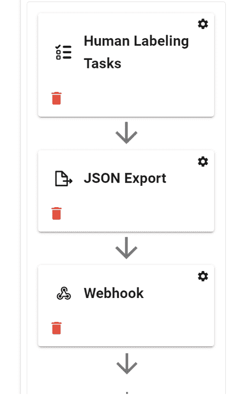

###### 图 5-1。工作流程示例

### 为什么需要人类任务？

对此有几种思考方式。首先，通常存在大量的一线人员，他们审查、塑造并消化原始数据成为新形式。这自然导致需要某种形式的组织。其次，大多数现有的通用任务系统简单地没有足够的支持水平，无法与数据紧密合作，并在人类和 AI 所需的技术定义之间跳跃。

## 以新的方式与非软件用户合作

注释数据类似于执行任何技术上要求高的任务。管理员面临一些重大挑战，需要组织和管理这项工作。

如果您也是一个专业主题专家，那么您可能能够基本上独自创建和更新模式。然而，可能存在一个理解如何将模式与所需的数据科学建模需求匹配的差距，需要更多地与数据科学进行接口。相反，如果您是一名数据科学家，您可能需要在很大程度上依赖于您的专业主题专家来构建准确的模式。无论哪种方式，您都将与您的注释者合作共同创建一个“代码库”。

通常，像规模化管理这样的项目的负责人将与所有利益相关者紧密合作，从工程到专业主题专家和数据科学。

# 开始使用人工任务

要从本章中获得最大价值，非常重要的是您已经阅读了前四章。

大多数工作流设置可以在没有深入的技术知识的情况下完成，但是，这仍然假定有一个已准备好并可供配置的系统。因此，我还将假设您已经拥有一个运行良好的训练数据平台，并且技术项目，例如数据工程章节中涉及的那些项目，已经准备就绪。

## 基础知识

要设置您的人工任务，必须完成以下关键步骤：

1.  命名

1.  模式选择

1.  谁能进行注释

1.  数据流

1.  发布

还有许多可选步骤，例如审查循环、UI 定制等。

我将本章重点放在人工任务本身上。我将在这里解释为什么所有这些步骤实际上应该非常快速和简单，因为大多数配置工作应该已经完成。

前两个步骤是为你的任务选择一个好名字和谁能够进行注释。

这两个步骤将依赖于你具体的业务背景。名称自然被用来组织工作，并且大多数系统将支持某种形式的额外任务标记，例如成本中心或其他项目元数据。

简而言之，模式是编码“谁、什么、在哪里、如何和为什么”的范式。由标签、属性及它们彼此之间的关系构成的含义表达。选择模式，意味着从已经创建的模式中选择，例如我们在第三章中深入讨论的内容。

虽然在简单情况下，项目经理或管理员可能会在创建任务的过程中编辑模式或创建新的模式。但是对于大多数现实世界的业务案例来说，模式的创建是一个复杂的过程，例如可能由 API/SDK 填充，涉及多人签署，并且可能需要几小时、几天甚至几周的时间。因此，对于管理员创建人工任务的范围而言，理想情况下应该只选择现有的模式。

数据流意味着在训练数据程序中选择一个已定义的数据集。这可以是已经有数据的数据集，也可以是预期将来通过技术集成接收新数据的空集。在数据流部分，我将详细介绍数据集选择，以及它与人工任务的关系。

如数据工程章节所述，数据流的技术集成应已设置好。我重申这个主题，以强调涉及人员的不同角色。在这里，管理员可能正在选择一个数据集，但是数据工程已经在系统中定义了该数据集的含义。数据科学将在多个集合和人工任务中切片和查看数据，因此理想情况下，他们在任务阶段对数据流应该只有最小的关注。

如工作流程简介中所述，人工任务可以被视为工作流程中最主要的构建块。其他构建块，如自动化概念，将在第八章中介绍。从更高层次来看，围绕 AI 转型主题的概念性想法将在第七章中讨论。

## 模式的持久力

模式具有很强的持久力，因为：

1.  需要大量时间来创建并获得重要初始模式的政治签字批准。

1.  对模式的任何重大更改可能会使之前的部分工作无效。

1.  一般来说，模式通常可以扩展。

例如，考虑我标记了一个“果树”，然后标签被更改为“苹果树”。在标记时，我标记的是“任何果树”，而不是“*苹果*树”！添加新属性或新的深度级别。例如，树的标签可以有一个带有可选属性类型的“树”标签，因此如果尚未确定树的类型，则其将为空。

早些时候我解释过，管理员只需选择一个模式。所以，作为管理员，你为什么需要关注模式的持久力？因为任务完成的时间很大程度上取决于你。因此，当你启动或发布任务时，你需要知道模式是否完整并且可以使用，或者是否有预期的模式变更即将到来。

## 用户角色

通常有两个主要的系统角色桶需要考虑。预定义角色和自定义角色。

最常见的预定义角色包括：

超级管理员：

安装范围管理员

管理员

对项目的所有访问权限

编辑器

数据工程和数据科学访问权限

标注员

注解访问

观察者

仅查看权限

一般来说，大多数用户都会被分配注释权限，因为他们只需要进行注释。

角色仅适用于特定项目默认设置。

预定义角色仍然可以与 SSO 系统集成，例如将一线工作人员的访问权限映射到标注员角色。

自定义角色更为复杂。自定义角色可以通过策略引擎或外部系统强制执行权限。您还可以在培训数据系统内创建自定义角色，然后将权限附加到特定对象上。自定义角色可能会变得非常复杂，详细的处理超出了本书的范围，请参阅您的培训数据平台的文档。

## 培训

对于大多数企业，您需要与一线员工，特别是标注者进行某种类型的培训。一种方法是由管理员或一线员工的经理进行培训。

一个示例培训计划，使用本书作为推荐阅读，可能看起来像这样：

1.  培训数据介绍（10 分钟）

    从第一章中阅读节选或特定领域的摘要

1.  模式（10 分钟）

    从第三章中阅读节选

1.  注释工具（15 分钟）

    +   演示如何使用特定的注释工具软件。

    +   快捷键和属性快捷键

1.  业务特定期望（5 分钟）

1.  常见问题解答（10 分钟）

1.  支持（10 分钟）

    如何访问帮助台

1.  计划下一次期望的会话（5 分钟）

### 黄金标准培训待定在新的框架上进行审查

让我们从这样一个假设开始，即标注者是出于善意，并且通常会根据呈现的数据做出良好的选择。在这种情况下，管理员仍然负责提供“正确”的定义。这可以是一个灵活的定义。可以由最资深的主题专家完成。这种方法可以与“审查”类型任务的随机抽样结合使用。它也可以作为一种考察。例如，向标注者展示一幅图像，他们进行标注，然后将结果与黄金标准进行比较。

与共识相比，成本大约低了三分之一。然而，通常可以获得类似或甚至更好的结果。共识中存在一种强制性的匿名方面。而这种方法则更具明确的“对/错”之分。它具有更多的问责制 - 如果我创建了一个任务，并且它被审查后出现问题，那就是一个明确的信号。这种机制可以凸显出模式、数据等方面的问题。它还有助于鼓励个人学习经验 - 例如标注者的改进。

这是一个发展中的领域，未来可能会出现其他方法。这个领域也有些争议。通常最好从黄金标准方法开始，除非您有明确的原因或理由使用共识。

## 任务分配概念

最常见的任务分配选项：

1.  自动，“按需”由标注者默认执行

1.  预定的，例如轮流分配

1.  手动执行

您可能需要基于您特定的业务逻辑建立更复杂的任务分配和重新分配系统。

我在这里要补充的主要评论是，这应该基于您特定的业务需求，并没有“对”或“错”的方法。通常情况下默认是“按需”的。

## 您需要定制界面吗？

大多数工具假设您将自定义架构。有些还允许您自定义 UI 的外观和感觉，例如元素的大小或位置。其他则采用“标准”UI，类似于办公套件即使文档内容各不相同也具有相同的 UI。

定制界面的原因包括希望将其嵌入应用程序以及具有特殊的注释考虑因素。

大多数工具假设将使用像台式机或笔记本电脑这样的大屏幕设备。

## 平均标记者将使用多长时间？

一个简单的例子是热键。如果一个主题专家每个月只使用工具几个小时，那么热键可能并不那么重要。然而，如果有人每天工作 8 小时，每周 5 天，那么热键可能非常重要。

明确一点，大多数工具提供热键，因此特定的例子可能不值得担心。更普遍地说，关键是，由于历史或意图的偶然性，大多数工具确实是为某些类别的用户优化的。很少有工具能够同样适用于休闲用户和专业用户。没有对错之分，只是需要注意权衡。

## 任务和项目结构

首先，让我们理解一下一般的组织结构。一个项目包含多个任务，如图 5.2 所示。

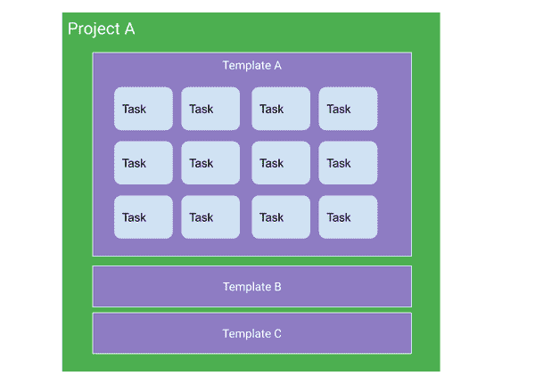

###### 图 5-2 任务结构

## 进行中的工作

在处理任务时，您将使用分析功能、数据探索、模型集成、质量保证和数据流概念。

# 质量保证

对于对训练数据新手来说，通常会有这样一种假设，即质量保证肯定不会那么难吧？

我的意思是，看看数据对吧？

主要问题在于，单个管理员可以看到的数据量通常只是整个注释集的一个小部分。在某些情况下，即使是对注释数据的小样本，也可能超出管理员一生中可能审查的范围。这对许多人来说是一个奇怪而难以接受的事实。看起来“查看几张图片”似乎是件很容易的事情。

如图 5-3 所示。一个人在合理时间内看到的数据量通常只是整个数据集大小的一个微小部分。实际上，在实践中，这种差异往往是数量级的差异。数据量实在是太多了！

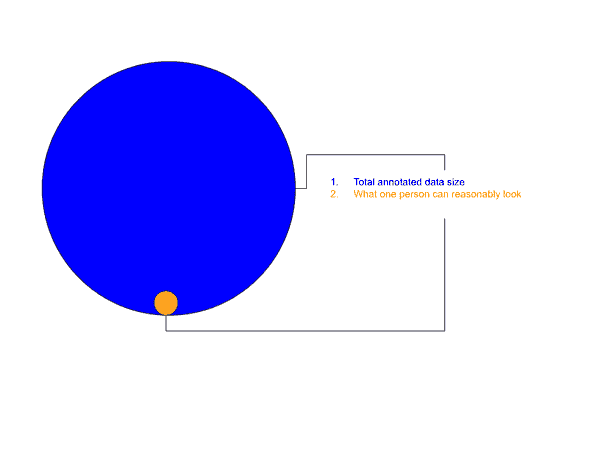

###### 

解决这个问题的通常方法包括让更多的人参与其中以及更多的自动化。我们将在后面的章节中介绍自动化。当更多的人参与其中时，下一个重要问题实际上是“我对我的标记者有多少信任？”。

## 标记者的信任

计算机视觉的许多早期尝试通常假定注释者是“异教徒”。基本上，他们无法单独信任。这导致了很多验证众包智慧的研究。从高层次来看，这归结为让多个人完成同样的任务，然后分析聚合结果。但这是最佳方法吗？让我们仔细看看。

## 注释者是合作伙伴

注释者是 QA 循环的关键部分。我经常看到人们对此采取“我们与他们”思维方式。虽然理解 QA 目标和重要性，在更大的项目中，严谨性尤为重要，但我们都是一个团队。

我认为对于注释者的一致性和质量的担忧往往是夸大的。对于许多当前的注释案例，人们在高层次上通常对其含义达成一致。通常情况下，当存在分歧时，方案、数据的分辨率、隐藏的假设等更多地归咎于单个注释者。在项目开始之前共同定义项目规范并在过程中建立反馈循环，将提供最高质量和最准确的结果。

### 谁监督数据

这本书的范围远远超出了人类心理元素，但考虑到这里的***人类***背后还有人是值得思考的。

类比一下，考虑到程序员参与其代码的编译。到了最后，它要么运行要么不运行。她会得到对她努力的反馈。然而，在这里，一个人可能永远不会得到同样程度（或速度）的关于他们注释工作的反馈。也可能永远不会得到关于他们对 ML 模型影响的反馈。

想象一下几乎像做“代码审查”一样 - 但在正式的代码审查中，我们所做的所有努力是为了保护感情、情绪和新生的想法。

### 所有的训练数据都有错误

训练数据质量至关重要。就像代码质量一样。同样，所有的计算机程序都有 bug，所有的训练数据都有某种形式的错误。注释者只是错误的一个来源。从我看到的情况来看，最好将精力集中在系统性问题和流程上，而不是“一次性”的问题。ML 模型对偶尔出现的坏训练数据非常鲁棒。如果有 100 个“真正正确”的例子，和 5 个“误导”，一般情况下模型仍然能如预期工作。

对于那些真正重要的情况，100/100 都正确的情况我认为要么我们在自欺欺人，要么这种情况非常少见。是的 - 如果一个机器学习模型正在执行火星任务，当然，培训数据需要三重检查。但否则，我们试图过度优化系统中的每一个“错误”，这是精打细算而愚蠢的。

### 注释者的需求

人们的心理和一般工作态度往往至少与任何具体的 QA 过程一样重要。如果人们受到尊重、得到补偿和培训，他们的表现自然会与“最低投标者”方法不同。

+   究竟是谁在注释数据？

+   他们是否熟悉这些工具？常见的期望（例如缩放）即使对专业人士来说，除非解释，也可能不清楚。不要假设！

+   他们的技术设置是否适当？他们看到的是否与我看到的一样？（例如，常见的屏幕分辨率可能在不同国家之间有所不同。）

+   他们接受过什么样的培训？

+   他们是否有个人帐户，我们可以跟踪他们的具体关注点和绩效指标？

+   绩效指标是否准确反映了个人？

视频会议示例：作为一个快速的插曲，考虑一下对于训练数据和工具的了解并不等同于注释者的智能，可以考虑视频会议。我知道当我加入一个我不熟悉的平台的视频会议时，即使是简单的操作如静音和取消静音也可能很难找到或被忘记。注释工作也是如此。一个工具可能会轻松地完成某些操作，甚至是自动化的，而另一个工具则可能不行。一个有 30 年心脏病学经验的医生可能不知道一个特定的工具具有某种特定的功能。

## 训练数据错误的常见原因

+   低分辨率的原始数据。如果数据正推动人类能合理看到的极限，请记住这一背景。

+   此特定部分的模式不够理想。注释者无法合理地在模式中表达他们的知识。

+   指南不够理想或包含错误，例如矛盾之处。

+   高度具体的标签和属性

+   自由形式标签和属性（注释者输入自己的新文本/标签）

+   更复杂的空间类型。或者过于具体的空间类型（像素特定）。

+   任何形式的“隐藏”信息，例如遮挡

+   任何自然具有争议性的内容（例如政治、言论自由/仇恨言论、安全类运动、面部识别）

## 任务审查循环

两种最流行的审查选项是标准审查循环和共识。

### 标准审查循环

每个任务被发送进行审查的概率都有一定百分比。如果被发送进行审查并被拒绝，则将返回进行审查。如果被接受，则将被视为“已完成”。

1.  进行中

1.  审查中

1.  如果未通过审查，则返回进行中状态。

1.  如果通过审查，则完成。

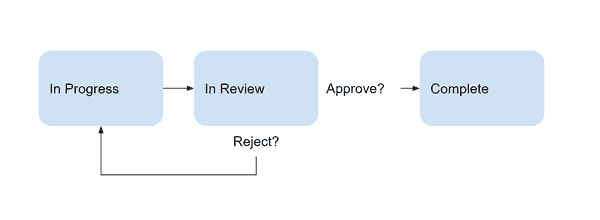

###### 图 5-4\. 审查循环流程图。

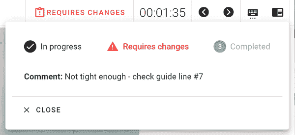

###### 图 5-5\. 需要的更改的图表

### 一致性

例如，在图 5-6 中，我们展示了三个人画了一个类似的框，并将其合并结果分析为一个结果。

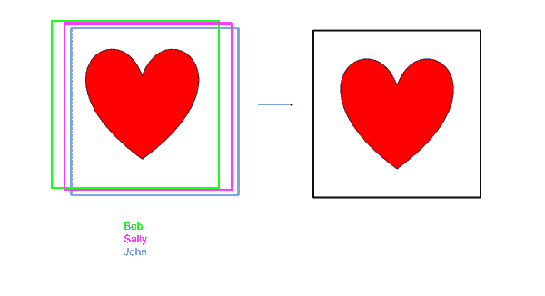

###### 图 5-6\. 标题待定

如果让多人做同样的事情并尝试合并结果听起来有点压力山大 - 你是对的！ - 的确是这样！一般来说，这至少**将三倍**涉及的成本。这还引入了关于分析数据的一堆挑战。我个人也认为这导致了错误类型的分析。通常更好的方法是简单地获取更多的样本，由不同的人监督，而不是试图对单个样本得出某种结论。例如，如果存在极大的分歧 - 你该怎么做？

粗略地类比一下，想象一下让三名工程师编写一个应用程序，然后尝试*自动*判断哪个代码“更好”。这完全没有意义！相比之下，让三名工程师各自负责不同部分，然后共同讨论特定设计折衷问题，这更合理。

这引入的第二个主要问题是，大多数真实世界的情况比单个实例复杂得多。属性、视频等。如果一个人说这是第 12 帧，另一个人说是第 13 帧 - 你怎么处理？尽管在这个领域确实有一些非常真实的研究 - 但通常随着挑战的复杂性增加，以及标注者的“严肃性”增加，共识的需求减少了。

# 分析

和任何任务管理系统一样，报告和分析对于理解标注者和专业主题专家的表现至关重要。它也可以用于分析数据集本身、模式等。

## 注释指标示例

+   每项任务的时间。注意：任务可能有很大的差异。这个度量单独使用可能非常危险。建议与质量指标结合使用。

+   “已接受”任务的数量。已接受可能意味着通过了审查，没有审查，或类似的度量。

+   更新或创建的实例计数。

+   每个任务或每个帧的实例数量统计

+   完成的任务计数。同时考虑任务的难度和类型。

### 数据探索

在某种程度上，探索可以被看作是在普通文件浏览器上查看文件的“超级版”。通常这意味着利用专为该特定领域设计的各种工具的帮助。

类比一下，在营销系统中查看营销联系人和在电子表格中查看是一样的。你可能在电子表格中看到相同的“基础”数据，但在营销工具中它将提供其他链接的信息并提供可以执行的操作，比如联系这个人。

数据探索包括手动编写查询和查看数据。还可以包括运行自动化流程来遍历数据，例如发现见解或过滤其中的大量内容。可以用于比较模型性能，调试人工等等。

虽然在常规的文件浏览器中手动查看原始数据可能会进行一些有限的探索，但这并不是我在这里所指的。

要探索数据，必须先将其导入到一个训练数据工具中。数据探索工具有很大的差异，特别是在专有的自动化过程和分析深度方面。

数据通常可以一次查看一组样本或单个样本。

在反思探索时需要考虑的一个重要问题是：

1.  进行探索的人可能参与或不参与标注过程。更一般地说，进行探索的人可能与进行上传、标注等任何其他过程的人不同。

1.  将数据组织和工作流程用于实际模型训练的人可能不实用。

1.  即使您直接参与所有过程，数据也是**分隔的时间**。例如，您可能在几个月内进行标注工作流程，然后在第三个月进行进一步的探索，或者可能在一年后探索数据等。

具体来说，如果我关心标注，我会关心“批次 #7”的状态如何？

当我探索数据时，我可能希望看到所有 1-100 批次的工作。在那时，我不一定关心是哪个批次创建的，我只想看到某些标签的所有示例。更广义地说，这部分是数据的不同视角，横跨多个数据集。

简单地说，探索过程可能在时间和空间上与标注分开。

探索几乎可以在任何时候进行。

1.  您可以在批次标注之前检查数据，例如组织开始的位置。

1.  在标注过程中，您可以检查数据以进行质量保证，简单地检查示例等。

通常的目标是

1.  发现数据问题。

1.  确认或否定假设。

1.  根据在过程中获得的知识创建新的数据切片。

### 数据探索工具示例。

训练数据目录可以让您：

+   访问数据的一个切片而不必下载全部数据。

+   比较模型运行。

探索流程。

1.  运行查询、过滤器或程序以切片或标记数据。

1.  观察数据。

1.  选择或分组数据。

1.  采取一些行动。

探索示例。

1.  对文件或一组文件进行标记，以进一步进行人工审查。例如，缺少的标注。

1.  生成或批准数据的新切片。例如，可能更容易标注的缩减数据集。

让我们深入了解类似图像减少的例子。

### 类似图像减少。

如果您有许多相似的图像，您可能希望运行一个过程将其减少到最有趣的十分之一。这里的关键区别通常是它是一个*未知*的数据集，这意味着几乎没有或没有标签可用。您可能知道 90%的数据是相似的，但您需要使用一个过程来识别哪些图像是独特的或有趣的以进行标注。

一旦您将数据放入训练数据工具作为第一个摄入步骤，从那里添加图像缩减步骤变得很容易。实际上，这一步骤是自动探索数据，对其进行切片，然后呈现该切片以进行进一步处理。

在创建和维护训练数据时所需的组织方法通常与创建模型不太相关。创建训练数据的人员可能不是创建数据集的人员。而其他人可能会接管这些数据集并实际训练模型。

# 模型

使用机器学习模型是您的训练数据工作流的一部分。

## 使用模型调试人类

导入数据的一个关键额外方面是标记实例所属的“模型运行”。这是为了允许比较，例如视觉上如图 X 所示，在模型运行之间进行比较。它还可用于质量保证。我们实际上可以使用模型来调试训练数据。其中一种方法是按地面真相和预测之间的最大差异进行排序。对于性能优异的模型，这可以帮助识别无效的地面真相和其他标注错误。

Fig 5-7 示例：模型预测（实线）检测到地面真相中未检测到的汽车（虚线）。这种类型的错误可以自动推送到人工审查列表的顶部，因为该框远离任何其他框。 （例如算法示例是将最近的交并比（IoU）与某个阈值进行比较，在这种情况下，由于该框几乎与任何绿色框重叠，阈值会很高。

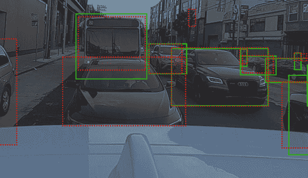

###### 图 5-7\. https://dashboard.scale.com/nucleus/ds_bwhjbyfb8mjj0ykagxf0/di_bwhjbzzb8mjj0ykagzzg

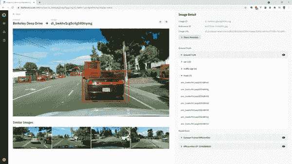

###### 图 5-8\. 显示建模集成的界面示例 - 比较 2 个模型和地面真相

为了更好地帮助理解这里的关系，考虑地面真相变化的频率比模型预测慢。确实，地面真相的错误可能会被纠正，添加更多地面真相等。但对于给定样本，一般来说地面真相是静态的。而在开发过程中，我们期望会有许多模型运行。甚至单个自动化过程（AutoML）可能会采样许多参数并生成许多运行，如图 5.9 所示。

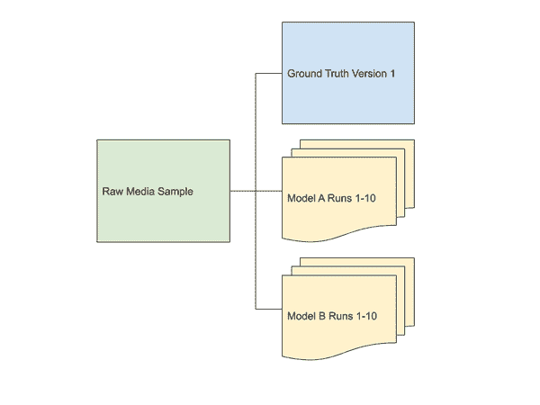

###### 图 5-9\. 一个文件可能与许多模型运行和地面真相集相关联。

这里需要记住几点实际注意事项。没有必要将所有模型预测结果加载回训练数据系统。一般来说，训练数据已经在更高级别的评估过程中使用，例如确定准确性或精度等。例如，如果有一个自动机器学习过程生成了 40 个模型并确定了“最佳”模型，您可以通过该模型进行过滤，并只将最佳预测发送到比较系统。

同样地，一个现有的人类监督数据集也不是严格必需的。例如，如果一个生产系统在新数据上进行预测，那么就不会有可用的真实数据。即使如此，通过单个模型进行可视化调试仍然是有用的，并且在其他情况下也很灵活，例如在开发过程中同时运行新版本模型并进行抽查。

### 数据集、模型和模型运行的区别

“数据集”和“模型”之间没有严格的关系或层次结构 - 最好将其视为每个样本级别的情况。例如，样本 1 和样本 2 可能在同一个集合中，但模型版本 1 可能只在样本 1 上运行过。一个模型运行可能会生成一组预测，真实数据集是所有预测以及地面真相等的结合。这种结构更多地由其他需求定义，而不是仅仅是运行了哪些样本或批次样本的结果。虽然在某些情况下这种差异可能只是一种言辞上的区别，在我看来，最好在这种情况下保留“数据集”的概念以表示一个真正“完整”的数据集，而不是某些过程的部分产物。

一个模型通常是原始权重，也称为 - 训练过程的直接输出。而模型运行则添加了上下文，例如在运行时使用了什么设置（例如分辨率、步幅）。因此，最好将每个模型运行视为唯一的标识符。因为当然，结构相同但训练方式不同（数据、参数等）的模型是不同的。而静态模型仍然是独特的，因为上下文（例如分辨率或其他准备工作）可能已经改变，并且模型的“运行时”参数（例如步幅、内部分辨率设置等）可能已经改变。这可能会很快具体到上下文特定。总的来说，为每组 {模型、其运行的上下文、设置} 设置一个唯一的标识符可以避免很多混乱。

## 将数据传递给模型

其中一个重要的概念是持续改进模型。这是通过重复更新训练数据和模型来实现的。在理想情况下，通过“流式”机制来完成，例如如果满足某些条件，新模型预测会自动推送到审查系统。我们稍后会详细讨论“MLOps”过程。现在要考虑的主要问题是：任务完成后我希望数据去哪里？我希望做哪些阶段？接下来我将涵盖包括将数据传递给模型在内的数据流。

# 数据流

有两个主要概念需要注意：  

1.  整体工作流程，例如包括摄入、任务、模型训练等。

1.  任务特定数据流。

在本节中，我将专注于仅谈论数据流。

您可能会有许多不同上下文的管道。例如，您可能会有一个用于人员任务的训练数据管道。然后可能会有一个模型管道 - 训练过程如何工作，最佳模型如何进入生产等等。在所有这些过程中可能会有一种通用的 Airflow 类型的管道，用于将数据从其他系统移动到首先的训练数据系统。我们已经讨论了围绕永续改进模型的概念。但我们如何实现它呢？这里有几个想法，我将逐一详细说明。

## 流媒体概述。

流媒体的一万英尺视角目标是“按需”自动获取人类注释。虽然人们经常跳到实时流媒体的思维中，但实际上这是一个不同（尽管相关）的想法。相反，想象一个项目，团队中的一人定义了标签模式。但数据还没有准备好 - 或许因为需要加载数据的工程师还没有加载它 - 或者因为这是尚未被传感器捕获的新数据。虽然听起来很不同 - 从训练数据的角度来看，这是同一个问题：数据尚未可用。

解决方法是提前设置好一切，然后让系统在数据可用时自动生成“具体”任务（从模板配置中）。

## 数据组织。

与任何数据项目一样，数据集本身也需要组织，与人类任务完成分开。常见的方法包括：

1.  文件夹和静态组织。

1.  过滤器（切片）和动态组织。

1.  管道和流程。

### 文件夹和静态组织。

当我思考管理时，我经常想到组织。对于计算机数据，我想象桌面上的文件和文件夹。文件通过放入文件夹中来进行组织。例如，如果我把 10 张图片放入一个名为“cats”的文件夹中，我在某种意义上创建了一个猫图片的数据集。


###### 图 5-10。[插图，显示桌面文件浏览器和猫的图像]

### 过滤器和动态组织。

数据集也可以由一组规则定义。例如，我可以将其定义为“所有不足 6 个月的图像”。然后让计算机根据我选择的某种频率动态创建该集合。这与文件夹有重叠。例如，我可能有一个名为“annotated_images”的文件夹，我进一步筛选只显示最近*x*个月的内容。

## 管道和流程。

这些定义也可能变得更加复杂。例如，医疗专家的成本比初级人员高。而运行现有的 AI 的成本则更低。因此，我可能希望创建一个数据管道，按顺序进行：AI，初级，专家。

纯粹按日期排列在这里可能不太有用，因为一旦 AI 完成其工作，我希望入门级人员立即查看它。当入门级人员完成他们的工作时也是如此，依此类推。

在处理过程的每个阶段，我可能希望输出一组数据的“文件夹”。例如，假设我们从 AI 看到的 100 张图像开始。在某一时刻，一个入门级的人员监督了 30 张图像。我可能希望只取这 30 张图像并将其视为一个“集合”。当然，一旦有人标注了第 31 张图像，现在这个集合应该有 31 张图像了。

换句话说，它所处的处理阶段，数据的状态及其与其他元素的关系有助于确定其集合。在某种程度上，这类似于文件夹和过滤器的混合，还增加了状态等“额外信息”。

管道的实施有时可能很复杂。例如，标签集可能是不同的。

### 数据集连接

我们如何知道数据何时可用？首先，我们需要发送某种信号来警示系统，表明有新数据存在。但是我们如何知道如何将数据路由到正确的模板呢？

### 空数据集

让我们暂时转向代码来思考一下。想象一下，我可以创建一个新的数据集对象

Python

```
my_dataset = Dataset(“Example”)
```

这是一个空集合。没有原始数据元素。

### 发送单个文件到该集合

在这里，我创建一个新的数据集，一个新文件，并将该文件添加到集合中。

```
dataset = Dataset(“Example”)
file = project.file.from_local(“C:/verify example.PNG")
dataset.add(file)
```

### 将数据集与模板相关联

我创建一个新模板。请注意，这个模板没有标签模式。- 现在它只是一个空壳。然后我让这个模板“监视”我创建的数据集。这意味着每当我向该集合更新文件时，该操作将创建一个“回调”，自动触发向该集合创建任务。

```
template = Template(“First pass”)
template.watch_directory(my_dataset, mode=’stream’)
```

### 将整个示例整合在一起

```
# Construct the Template
template = Template(“First pass”)
dataset = Dataset(“Example”)
template.watch_directory(dataset, mode=’stream’)
file = project.file.from_local(“C:/verify example.PNG")
dataset.add(file)
```

在这里，我为人类创建了一个新模板，并创建了新的数据集，我打算将数据放在这里。我指示它监视变化。然后我向系统中添加了一个新文件 - 在这种情况下是一个图像。请注意，在这一点上，文件存在于系统中，无论默认数据集是什么 - 但是在我想要的数据集中。因此，在下一行中，我具体调用了该数据集对象，并将文件添加到其中，- 从而触发了一个具体的人工审查任务的创建。

注意：从实际角度来看，这些对象中的许多可能是.get()（例如，现有的集合）。您可以在导入时将数据集定位到特定时间（无需稍后单独添加）。这些技术示例遵循 MIT 开源许可证下的 Diffgram SDK V 0.13.0。

### 扩展示例

```
template_first = Template(“First pass”)
template_second = Template(“Expert Review”)
dataset_first = Dataset(“First Pass”)
dataset_ready_expert_review = Dataset(“Ready for Expert Review”)
template_first.watch_directory(dataset_first , mode=’stream’)
template_first.upon_complete(dataset_ready_expert_review, mode=’copy’)
template_second.watch_directory(dataset_ready_expert_review, mode=’stream’)
```

这里我创建了一个 2 遍模板。之所以称为“2”，是因为数据将首先由第一个模板查看，然后稍后由第二个模板查看。这在很大程度上是重用之前示例中的元素，只有`upon_complete`是唯一的新功能。本质上，该功能表示“每当个别任务完成时，复制该文件，并将其推送到目标数据集。”然后，像往常一样在该模板上注册观察器。

这些示例可以无限组合 - 如果需要，可以有一个 20 步骤的流程。

### 非线性示例

```
template_first = Template(“First pass”)
dataset_a = Dataset(“Sensor A”)
dataset_b = Dataset(“Sensor B”)
dataset_c = Dataset(“Sensor C”)
template_first.watch_directories(
[dataset_a, dataset_b, dataset_c], mode=’stream’)
```

这里我创建了 3 个数据集，由一个模板监控。组织的重点在于展示，虽然模式可能相似，但数据集可以按您喜欢的方式组织。

### 钩子

要完全控制此过程，您可以编写自己的代码以在不同点控制此过程。这可以通过注册 Web 钩子、用户脚本等方式完成。

例如，当发生完成事件时，可以通过 Webhook 通知一个 Webhook，然后您可以通过（例如按值过滤，例如实例数量）手动处理事件。然后，您可以通过编程方式将文件添加到集合中。（这本质上扩展了复制/移动操作`upon_complete()`的功能。）

如何在用户界面中实现`upon_complete()`的示例显示在图 5-10 中。

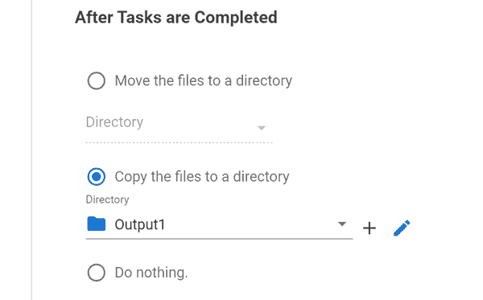

###### 图 5-11. 任务完成界面示例

# 直接注释

管理员绝对有必要了解注释员的日常使用情况。一个希望领导团队、进入管理员角色或者只是对整体情况感到好奇的注释员可以从管理员部分获益。

作为注释员，您正在监督为 AI 提供动力的数据（编写代码）。您有责任将嘈杂的现实世界数据映射到由他人定义的模式中。在您的旅程中，我们将涵盖一些实际进行注释的核心概念。包括视频系列、图像和机械结构。

注释员对数据有一个基础视图。这意味着您通常可以就模式的效果相对于实际数据提供宝贵的见解。如果您是一个主题专家，您可能还需要额外的努力来设置和维护模式。通常在开始进行注释时，初始模式已经被定义。在遇到问题时，仍然有很多机会来帮助维护和更新它，例如我们之前提到的自行车架与自行车的例子。

每个应用程序都有具体的要求，例如按钮、热键、步骤顺序等，这些要求可能略有不同。用户界面也会自然演变和变化。某些媒体类型的用户界面可能直观或更容易学习。其他可能需要大量培训、实践等才能掌握。

重要的一点是，本节重点介绍了复杂注释的一个小片段。甚至简单的注释，通过正确的人在正确的时间添加，通常会增加很大的价值，因此本节可能与您的项目无关。

接下来我将讨论两种常见的注释复杂性，即监督现有数据和交互式自动化。然后，我将通过深入探讨视频注释来确立所有这些内容。虽然有许多媒体类型，用户界面也在不断变化等等，但视频为了良好的注释而复杂。

## 业务流程集成

一个新兴的选择是将现有的日常工作框架化为注释。通过将特定于业务线的工作流程重新定义为注释，您可以以很少的额外成本获得注释。一般来说，这需要能够以匹配业务流程的方式配置注释用户界面。一个注释既可以完成现有的业务流程，同时还可以同时创建培训数据。

## 属性

注释属性的复杂性不断增加。从理论上讲，您可以想象任何可以放入表单中的东西都可以被定义为属性。尽管历史上空间注释（物体在哪里）曾经是一个重点，但属性越来越重要。我见过一些项目有数十甚至数百组属性。

## 标注深度

如图 4.3 所示，渲染像 YouTube 这样的视频，并提出有关整个视频的问题，与特定帧的标注非常不同。然而，这两者通常都被归类为“视频标注”。仔细探索您的用例所需的支持深度。在某些情况下，稍微增加深度可能很容易，在其他情况下，它可能会完全改变 Schema 的整体结构。

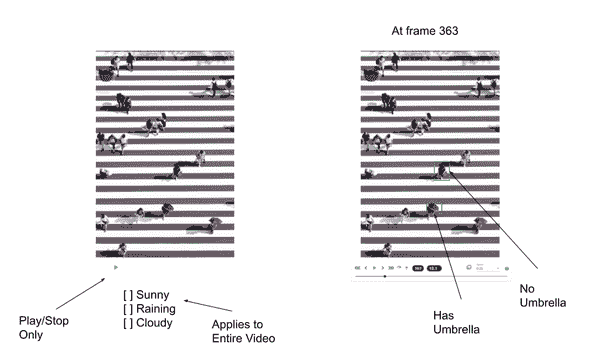

###### 图 5-12. 标注深度比较 - 整体视频与帧图像来源：[`unsplash.com/photos/n31JPLu8_Pw?utm_source=unsplash&utm_medium=referral&utm_content=creditShareLink`](https://unsplash.com/photos/n31JPLu8_Pw?utm_source=unsplash&utm_medium=referral&utm_content=creditShareLink)

## 监督现有数据

一个流行的自动化方法是预标注。这是模型已经做出预测的地方。根据使用情况，您可能会被要求纠正静态自动化，为其添加更多细节，或以其他方式与其交互。一个示例过程是审核文件，更新它，并标记为完成。

每当您看到一个模式，这是一个改进模型的绝佳机会。您是否总是在纠正类似的错误？将其传达给管理员或数据科学团队可以大大改善模型。即使模式是正确的，这也可能是模型内部出现问题需要修复的情况。

## 交互式自动化

监督现有预测与交互式自动化不同，您可以不断地处理更复杂的过程，通常是实时的，直到达到某个结果。

交互式自动化的一个例子是在感兴趣区域周围画框，并自动得到一个紧密围绕对象的多边形。或者点击关键点并得到分割掩码。

更一般地说，交互式自动化是您向系统添加更多信息，然后基于您添加的新信息运行某些过程。有时可以迭代地进行，直到达到某个期望的状态。有时这可能是一种“重试”的情况，您可以不断尝试绘制框，直到得到正确的多边形，或者它可以是一个基于您持续输入的“记忆”系统，继续变化。

通常作为注释者，您不需要实际“编码”任何这些交互。它们通常会提供为 UI 工具或热键。您可能需要了解一些自动化的操作参数。当它们工作良好时，当它们工作不佳时，何时使用哪种自动化（如果有多种可用）等。

一些常见的方法需要注意：

+   点击框/点/某物到多边形/分割

+   完整文件一般预测

+   领域特定的，如对象跟踪或帧插值

### 例如，语义分割自动边界

让我们放大到一个具体的例子，自动边界。这是系统检测边缘以创建 100% 覆盖掩码的地方。这通常比手动绘制边界更快，更准确。

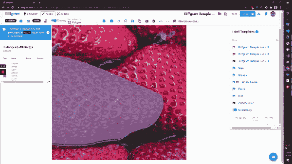

###### 图 5-13\. 显示自动边界处理的 UI 示例

步骤：

1.  在交叉形状上选择一个点。

1.  选择交叉形状上的出口点

1.  或

1.  “覆盖绘制”，例如，覆盖现有对象，并期望它将自动绘制周围点的交叉。

## 视频

现在让我们涵盖一些更复杂的视频示例。

### 运动

我们注释视频以捕捉动态中的含义。汽车移动，投篮，工厂设备操作。由于这种动态，注释时的默认假设是每帧都不同。

考虑这个原始视频：[`youtu.be/ZciIT7BmKFk`](https://youtu.be/ZciIT7BmKFk)

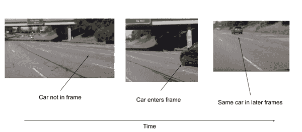

###### 图 5-14\. 标题即将到来

汽车不在初始帧中。它移入画面。然后随着时间的推移，它仍然在画面中。

更一般地说，对象在帧之间进出。这发生在不同的时间点

车辆的属性也可能会发生变化 - 例如，在一帧中它可能完全可见，而在下一帧中它可能部分被遮挡。

### 通过时间跟踪对象的示例（时间序列）

目标是在多个时间点（通常是帧或时间戳）之间创建一些关联的注释。

又称为：序列，轨道。

在用户界面中通过时间跟踪对象的方法的示例包括

+   “幽灵帧”，其中前一帧的位置被标记，并且用户移动该帧以表示当前状态

+   “按住并拖动”，用户按住对象并随着对象移动

+   “点选并预测”，用户标记关键点，跟踪算法猜测移动方式。

一种方法是：

创建（或选择）一个系列。每个系列可以是视频独有的，也可以是一组视频（例如多台摄像机）独有的，或者在所有视频中全局唯一。

一般情况下，这迫使每个对象都是序列的一部分。如果对象通常出现在多个帧中，这样做效果很好，但如果对象通常只出现在一个帧中，这可能会有些繁琐。

一般来说，一个序列还会额外强加一些约束。

1.  一个序列在同一帧中只能出现一次。例如，序列 12 不能在同一帧中出现两次。这可能并不总是正确 - 例如，一个对象可能部分被遮挡，并且可以由两个或更多空间类型表示。（想象一辆公共汽车被柱子挡住）

1.  序列必须是相同的标签类型。虽然属性可能会改变，“顶层”概念在帧之间通常应保持一致。

### 静态对象

有时，视频中会有一个静态对象，例如一个不移动的零售店货架或其他展示物，或者一个不经常移动的交通信号灯的路口。

您可以通过以下方式表示这一点：

1.  单个关键帧，即在第 x 帧（例如#898）。

1.  起始和结束关键帧，即（9，656）。假设对象在第 9 帧进入，并在第 656 帧退出。更一般地说，这种模式是（进入帧，帧列表，退出帧）。

1.  一个属性，比如“进入”或“可见性”（或% 可见性）。

这些都是有效将其标记为“静态对象”的方法。

### 持久对象 - 足球示例

一个视频中可能会有多个对象。例如，2 辆不同的汽车，苹果，足球运动员等。

从人类的角度来看，我们知道一个足球运动员，比如图 5-14 中的球员，在 0 帧、5 帧、10 帧等中都是同一个人，他仍然是罗纳尔多。


###### 图 5-15 一名足球运动员在一帧中 来源：https://unsplash.com/photos/ztwaJXBWCC0

但对于计算机来说，这并不清晰。因此，为了帮助它，我们创建一个序列对象。即“罗纳尔多”。由于这是我们创建的第一个对象，它被分配为序列号#1。

如果另一个球员“梅西”也出现在帧中，我们可以为他创建一个新的序列，他将获得#2。另一个球员将获得#3，依此类推。

关键点是每个序列代表一个现实世界的对象（或一系列事件），并且每个视频都有一个唯一的编号。

### 系列示例

我们可以创建一个新的“系列”来随时间创建意义。

想象一个有 3 个感兴趣对象的视频。为了表示这一点，我们创建了 3 个系列。

1.  系列＃1 有帧（0、6、10），因为对象在第 0 帧进入视频，第 6 帧有所变化，然后在第 10 帧离开视频。对象在每个关键帧中随时间变化。

1.  系列＃2 有帧（16、21、22…）。对象也在变化。

1.  系列＃3 只有帧（0）。这是一个静止的对象，不会移动。

一个系列可能有数百个实例。

### 视频事件

表示事件的几种方式

1.  为每个事件创建一个新的系列

1.  为每个事件创建一个新帧。例如（12、17、19）表示 3 个事件，发生在第 12、17 和 19 帧。

1.  使用属性声明“事件”发生的时间。

从用户界面的角度来看，这里的主要权衡是您期望多少事件以及模式其余部分的复杂性。作为一个经验法则，如果事件少于 50 个，将它们全部保留为单独的系列*可能*更加“清晰”。如果事件超过 50 个，则通常最好使用单一序列，并使用帧或事件。

对于复杂事件案例，属性可以很好地工作。主要缺点是，与关键帧相比，它们通常不那么“可发现”，而关键帧在视频中更容易“跳转”到特定点。

就注释速度而言，要密切关注视频事件的快捷键。通常可以使用快捷键创建新序列，更改序列等等。

在常见的注释错误方面，确保您处于所需的序列上。缩略图通常可以帮助您在视觉上确定这一点。您还可以跳转到序列中的其他帧来验证它。

### 检测序列错误

想象一下，您正在审查一个预先标记的视频（无论是由另一个人还是算法完成的）。为了帮助做到这一点，像 Diffgram 这样的工具会自动改变序列的颜色。这意味着您可以播放视频，并观察序列中的颜色变化。通过这种方式，捕捉错误可能会非常容易。对于真实世界中有重叠实例的情况，经常使用这种颜色功能播放视频是检测问题最简单的方法。您还可能通过自动化流程或其他注释人员对其提出的问题票据来提醒潜在的系列错误。

这是一个例子，同一辆车的序列号被错误地更改。

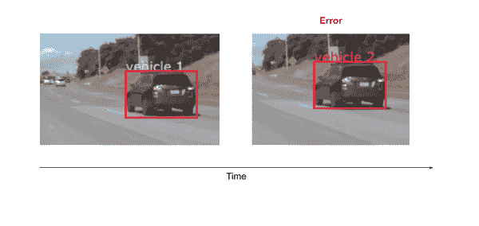

###### 图 5-16\. 标题即将到来

要更正它，我打开实例的上下文菜单，并选择正确的序列。如图 5-17 所示。

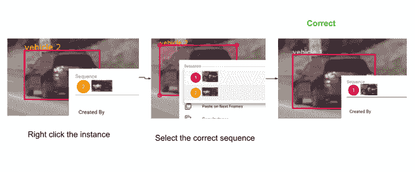

###### 图 5-17\. 修正无效序列的过程示例。

在这个例子中，我知道是正确的，因为

1.  这辆车与其前一帧最相似。

1.  这辆车在视觉上与系列的缩略图相似。

### 视频标注中的常见问题

作为人类，我们可能会观察到一个给定的场景，比如驾驶的道路，并评估路肩/植被的位置。而仅仅看图片像素时，并没有显著的可见证据支持这一点！更普遍地说，这涉及宣称“应该”存在的内容与你实际能看到的内容之间的差异。其他常见问题包括：

+   反射，比如窗户中的人的倒影

+   透明但有障碍物的物体，比如栏杆

+   对象检测预测的是矩形形状，而大多数现实世界中的物体并非矩形。

+   非驾驶视图之外的繁忙区域，例如拉斯维加斯大道

+   视频帧中物体出现和消失的问题。
