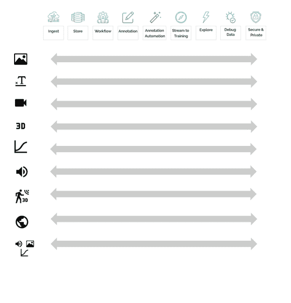

# 第六章：工具

# 引言

训练数据工具的选择和种类非常丰富。有如此多的选择，选择最合适的工具通常是最困难的选择。现代训练数据工具从全面的平台到特定用途的工具各不相同。在这里，我将讨论一些工具的范围，从个人学习到大团队。

为什么我们需要专门的训练数据工具？这些工具是由与训练数据合作的团队的迫切需求驱动的。例如，当我第一次推出 Diffgram 的最早版本时，我希望我的远程工作的同事能够帮助进行注释，但所有现有的工具都无法做到这一点 - 它们都必须为每个用户单独安装。最近，随着工具选择的增加，团队开始对必须将许多简单工具串联在一起感到沮丧，并渴望一个集成所有功能的应用程序。

这些工具真正能做什么？当您购买一辆汽车时，您可能不确定它的驾驶感受，但您相当确信您将使用它从 A 点到 B 点。在训练数据中，A 到 B 真的是什么？使用训练数据工具自动获得哪些好处？您需要为此付出什么努力？当您完全上手时，它是什么样子？

阅读本章，您将清楚地了解可用工具的一般分段。从这个高层次的地图来看，我将深入探讨围绕不同目标范围的权衡。自然而然地，需要考虑规模、每秒查询、团队和数据类型。我将探讨在规划现实世界系统时最关注的问题。从单个用户开始，然后是小团队，逐步扩展到大公司的大团队。

开源还是闭源？自我安装还是软件即服务？这些争论就像天长地久一样。我将从训练数据及其周围的细微差别出发，提供一个观点。我还将涵盖训练数据定制、安全性、开源、部署、成本、易用性、安装、硬件、配置、偏见、神话和元数据。

在本章的结尾，您将清楚地了解到最关键的问题、需要考虑的关键权衡，并对这些工具能带您到哪里有一个高层次的理解。

# 为什么要使用训练数据工具

我们有数据库来顺利存储数据。Web 服务器用于顺利提供数据。现在有了训练数据工具，可以顺利处理训练数据。

我之所以说流畅，是因为我不一定要使用数据库。我可以把我的数据写入文件，然后从中读取。我为什么需要*postgres*？因为 Postgres 带来了各种各样的功能，比如保证我的数据不会轻易损坏，数据是可恢复的，数据可以高效查询。训练数据工具也以类似的方式发展。

下面我将提供一种思想的进展，它与行业中发生的事情相吻合，并且希望对你现在正在经历的事情有所帮助。

任何形式的员工时间往往是最大的成本中心。良好部署的工具带来许多独特的效率改进，其中许多可以叠加在一起，创造出许多数量级的性能提升。继续使用数据库的类比，将其视为顺序扫描和索引之间的区别。其中一个可能永远不会完成，而另一个很快！训练数据工具将你升级到索引的世界。

## 数据训练工具有什么用？

从战略角度来看，训练数据工具是发货机器学习系统的先决条件。稍微放大一点，训练数据工具包括：

+   提供进行文字标注的接口

+   工具可以在人机监督的背景下赋予人们、流程和数据力量

+   带来清晰的并表面出整体的训练数据关注点

为了更好地理解这一实践，让我们回到我们的数据库类比中。我是否感觉被迫使用数据库？虽然我知道我基本上必须使用数据库，但我可以更多地关注所理解的好处，以了解为什么我应该使用数据库。“哇，Postgres 允许我存储数百万条记录并在毫秒内查询它们！”

类似地，训练数据工具提供了许多超越处理细枝末节的好处。例如，“哇，我的数据科学家可以查询由标注者训练的数据，而不必下载大量数据集并在本地手动过滤”。

## 最佳实践和能力水平

对训练数据工具的高度熟练至少需要与学习 DevOps 一样多的工作量。

就我个人而言，多年后我仍在学习 DevOps……因此值得考虑，你的训练数据学习可能更像是一个旅程，而不是一个目的地。

我提出这个问题是为了让每个人都明白，无论你有多熟悉，或者花了多少时间，关于训练数据总有更多的东西要学习 - 我自己也一直在学习！

## 人机监督

你可能熟悉“人机交互”（HCI）的概念。对我来说，这意味着我作为用户如何与程序相关联。它易于使用吗？我如何与它互动？

谈到训练数据，我想介绍一个叫做人机监督（HCS）的概念。这个想法是你正在监督这台“计算机”。这台“计算机”可以是一个机器学习模型，也可以是一个更大的系统。这种监督发生在多个层面，从文字标注到批准数据集。

这与互动形成了对比，在互动中用户是“消费者”，而在此系统中用户是“生产者”。用户生成的监督被计算机消费。这里的关键对比在于，通常情况下，计算机互动是确定性的。如果我更新了某些内容，我期望它被更新。而在计算机监督中，就像人类监督一样，是非确定性的。存在一定程度的随机性。作为监督者，我可以提供修正，但对于每一个新实例，计算机仍然会做出自己的预测。

为了节省空间，我不会深入讨论这个区别，如果现在不清楚也不要担心。随着时间的推移，这里的一般思路是继续区分这种新形式的人机监督工作和常规计算机使用。

## 工具带来清晰度。

训练数据工具是有效出货你的机器学习产品的一种手段。作为这一复杂目标的手段，训练数据工具带有现代软件领域中最多样化的观点和假设之一。这就像 No-SQL vs SQL 时代的论战一样。

工具帮助在噪音中带来一些标准化和清晰度。它们还帮助那些本来无法进行比较基准的团队，迅速进入视野。

+   为什么要手动导出文件，当可以实时流式传输所需的数据呢？

+   为什么不同的团队使用稍有不同标签存储相同的数据，而不是使用单一统一的数据存储呢？

+   为什么要手动分配工作，当可以自动完成？

## 理解工具的重要性

如果没有合适的训练数据工具，就像在没有工厂的情况下建造汽车一样。只有通过使用工具才能实现完全设置的训练数据系统。

我们有一种倾向去认为熟悉的东西理所当然。它只是一辆车，或者只是一辆火车，或者只是一架飞机。它们都是各自领域的工程奇迹。同样地，我们也低估了我们不理解的东西。“销售不可能那么难”，工程师说。“如果我是总统”等等。我发现很多人不理解训练数据工具的广泛性。

尝试形象化的一种方式是：

训练数据工具是：

Photoshop + Word + Premiere Pro + 任务管理 + 大数据特性存储 + 数据科学工具

这是一个大胆的声明。让我们详细分析一下。

+   人们期望能够像最好的绘图工具一样注释。

+   人们期望现代任务管理像一个专门的任务管理系统一样。

+   他们希望能够摄取和处理大量数据，实际上是一个完整的 ETL 工具。

+   还有在其上进行像商业智能工具一样的分析。

一个系统集成了所有功能。这几乎没有可比性！

很少有系统可以...

+   字面上的工作和工作的管理都在同一个系统中完成。

+   该系统涵盖了许多用户和不同的角色。

+   系统执行多个不同的功能，但除了报告之外，这些功能之间没有任何有意义的交互。

然而，在训练数据工具中...

1.  注释的实际工作和任务管理被整合到一个系统中

1.  一套界面，类似于 Adobe 套件或办公套件，被整合到一个系统中

1.  多个独立功能的系统必须与直接用于其他系统的输入和输出以及集成的数据科学工具协调工作

## 意识到需要专门的工具

作为一个行业，当我们首次开始处理训练数据时，最初的冲动是简单地“完成任务”以开始训练模型。

问题的核心是：“对于人类而言，最简单的 UI 是什么，可以在数据之上进行注释，然后将其转换为模型可以使用的格式？” 这时人们开始意识到现代机器学习方法的强大，只是想知道“这能行吗？” “它能做到吗？” “哇！”。

问题迅速出现。当我们将项目从研究阶段转移到暂存或者甚至生产阶段时会发生什么？当标注者与编写代码的人不是同一个人，甚至不在同一个国家时会发生什么？当有数百甚至数千人在进行标注时会发生什么？

在这一点上，人们通常开始意识到他们需要某种形式的专门工具。早期版本的训练数据工具回答了其中一些问题，允许远程工作，一定程度的工作流程和规模。然而，随着系统压力的增加，更多问题迅速浮现。

## 更多使用，更多需求

非常明显地说，当有大量人员每天八小时全职工作在一个工具上时，每个人的期望和压力都会增加。

迭代模型开发，例如预标注，对持续改进训练数据施加了压力。虽然这是可取的，但它也增加了对工具的压力。因为自动化方法使用得越频繁，压力就越大。静态预标签只是冰山一角。一些自动化需要交互，进一步加剧了数据科学、标注者和标注工具之间的互动压力。

为了解决这些需求，添加了许多功能。随着工具提供商增加了更多功能，拥有流畅工作流程的能力成为了一个新问题。功能过多，自由度过多。现在，限制自由度的责任增加了。

## 新标准的出现

工具提供商如今已经积累了一些年的经验，并且学到了许多东西。从创建特定于训练数据的新命名概念到多种实现细节。这些即插即用的工具将压倒性问题变成了可管理的问题。这使您能够使用这些新标准，并在与您和您的项目相关的抽象级别上工作。

是的，我们处于标准训练数据的早期阶段。作为一个社区，我们正在开发从概念上的模式到预期的注释功能和数据格式的一切。关于训练数据工具的范围和标准功能的范围已经有了一些共识，但还有很长的路要走。

要理解涉及的广阔空间，请考虑图 6-1\. 在左轴上，您可以看到各种类型的媒体，大约有 9 种主要类型。然后读者可能熟悉第四章涵盖的 9 个主要领域。

###### 图 6-1\. 训练数据工具景观

虽然自然存在一些重叠，但大多数功能区域根据媒体类型而有所不同。例如，文本、3D 和图像的自动化处理方式各不相同。

这里的领悟是，定制的复杂机器可能可以解决一些复杂性问题，但未能覆盖所需的广泛空间。一些工具提供者的进展看起来像图 6-1\. 置历史兴趣于不顾，作为今天做出决策的人，进展的背景有助于确定价值来自哪里。

为了充分利用图 6-1，我喜欢将其视为 30,000 英尺的视角。因此，如果您正在考虑自动化改进，值得反思它是否适用于所有与您相关的媒体类型。这是一个提醒，任何一个领域的弱点可能会导致瓶颈。如果获取和输出数据困难，优秀的注释工作流的价值就会减少。

## 套件之旅

在您的需求旅程中，您在哪里？您是否已经看到需要专门的工具？需要最优质的工具？需要涵盖广泛训练数据空间的套件？

我们都喜欢熟悉的东西。正如办公套件从界面到命名约定提供了类似的期望和体验一样，训练数据平台也致力于在多种格式中创建熟悉的体验，无论是文本还是图像。

自然而言，在任何给定时刻，单个团队可能会专注于特定的数据类型或多种数据类型（多模态）。这里的熟悉感不仅仅在这个领域有所帮助。新加入团队的人员可以更快地适应，共享资源可以更轻松地在项目之间流动等等。

如图 6-2 所示，一般而言，进展是从哪里开始？

1.  认识到需要专门的工具化

1.  认识到技术空间的复杂性需要最好的工具 - 而不是什么都可以。

1.  认识到用户空间的复杂性需要熟悉和共享理解。

###### 图 6-2\. 训练数据提供者的进展

正如我将在第七章中详细解释的那样，如果您考虑成立一个培训数据主管职位，熟悉的工具对团队至关重要。同一位标注员可以轻松在多种媒体和项目之间转换。这也有助于解决数据科学关注点之间的差异。

为了区分潜在的混淆。拥有一套工具并不意味着对所有事情都是“一站式”解决方案。数据科学可能有其自己的一套工具，用于训练、服务等。这也不排除针对特定兴趣领域的单点解决方案。这更像是一个操作顺序的想法，我们希望从最大的操作开始，即主要套件，然后根据需要进行补充。

## 开放源码标准

据我估计，2017 年全球商用培训数据工具的从业人员可能不到 100 人。到 2022 年，至少有 40 家公司的超过 1,500 人直接从事专门针对培训数据的公司工作。遗憾的是，其中绝大多数个体在封闭源软件中单独工作。像 Diffgram 这样的开放源码项目为培训数据工具的共享访问提供了光明的未来，无论生活在哪个国家，财务状况如何。

开放源码工具也打破了关于什么是魔法和什么是标准的幻想。想象一下，为了一个数据库供应商承诺的 10 倍更快的查询而花费更多预算，结果发现他们只是注入了额外的索引。在某些情况下，这可能有价值，但您至少希望事先知道您是为了使用便捷性而支付，而不是索引的概念！类似地，培训数据概念如预标注、交互式标注、流式工作流等被提到了前台。在本章后面会详细讨论这些内容。

## 一个传递机器学习软件的范例

就像 DevOps 思维方式提供了交付软件的范式一样，培训数据思维方式提供了交付机器学习软件的范式。说得非常直白，这些工具：

1.  与培训数据一起工作的基本功能，如注释和数据集。如果没有工具，这些事情可能是不切实际的。

1.  提供保障以使您的项目达到水平。您实际上是在遵循培训数据的思维方式吗？

1.  实现培训数据目标的手段，如管理成本、紧密的迭代时间到数据循环等。

我喜欢想象的一种心理画面是站在一个大山或小山的基地。从基地上，我看不到下一个山。即使站在山顶上，我的视野也被下一个山脉遮挡，以至于我不能看到第三座山，直到我穿越第二座山，如图 6-3 所示。

对于视频游戏的粉丝来说，这就像技术树，后续的发现依赖于早期的发现。

###### 图 6-3. 远眺山丘，我只能看到下一个山峰。（依次依赖的发现）

训练数据工具帮助您在获得它们时顺利地穿越这些障碍，有时甚至能够“看到转角”，为您提供鸟瞰地形的视角。具体来说，我只有在意识到随着时间推移，用于注释数据的组织方法通常与数据科学家的需求不一致，特别是在较大的团队中时，才更好地理解了查询数据的必要性。这意味着，无论初始数据集的组织有多好，仍然需要事后回顾和探索。

训练数据工具可能会让您对提升流程和发布更好产品的机会感到意外。它们提供了一个基本的流程。它们有助于避免认为自己重新发明了轮子，只是后来才意识到一个现成的系统已经这样做，并且更加精细。它们通过帮助您更快地、更少风险地、更高效地发布产品，来改善您的业务关键绩效指标。

当然，这些工具并非万能药。它们也不是无 bug 的。与所有软件一样，它们也会出现问题。在许多方面，这些工具还处于发展的早期阶段。

# 规模

工程师喜欢讨论规模问题。对于不熟悉工程学的读者来说，可以将迪士尼乐园与像街机一样的本地娱乐中心进行比较。迪士尼适用的方法不一定适用于街机，反之亦然。

正如我在自动化章节中所讲述的，在规模的极端端口，一个完全设置好的训练数据系统可以让您几乎随时重新训练模型。缩短数据到达和模型部署之间的时间（即时间到数据的速度）接近零，这可能意味着战术相关性与无用之间的差异。

我们通常习惯于思考常规软件规模的术语，在受监督训练数据方面并没有那么明确定义。在这里，我花点时间设定一些关于规模的预期。

## 为什么定义规模很有用？

首先要理解您所处的阶段，以帮助确定您的研究方向。其次，要理解不同规模的各种工具的构建目的。粗略的类比可以是 sqlite 与 postgres。两者从简单到复杂有不同的用途。

谈到复杂性，如果您在进行一个小项目并且真的计划百分之百地使用您的数据，那么一个大型数据发现工具可能就不相关了。

或者，对于中等规模及以上的情况，如果团队打算每天处理复杂工具，可能更倾向于经过几个小时的培训，学习最佳实践。

那么，为什么这么难呢？首先，许多大公司保持对 AI 项目的深度技术细节保密，这与更常见的项目明显不同。另一个原因是，在实际应用中，许多公共数据集并不真实反映商业项目所需的内容，或者会误导，例如，它们可能在收集时的开销水平对于常规商业数据集来说是不切实际的。

## 经验法则

要记住，小型项目可能仍然面临非常真实的挑战。

| 项目与规模方向 | 小型 | 中型 | 大型 |
| --- | --- | --- | --- |
| 静止数据量（注释）在一个滑动窗口期内 | 数千 | 百万 | 十亿 |
| 支持的数据类型 | 只需支持与您用例相关的内容 |  | 最可能需要支持所有类型 |
| 注释人员（专业主题人员） | 单人或小团队 | 中型团队 | 多个团队 |
| 具有数据工程、数据科学等等技能的人员 | 单人 | 数据帽子团队 | 多个团队的人员 |
| 受影响的收入 | 没有附加的金额或预收入 | 数百万美元的受影响 | 数十亿美元的受影响 |
| 系统负载（每秒查询次数）QPS | <1 QPS | <30 QPS | 数千 QPS |
| 主要关注点 | 轻松开始和易用性的成本（可能没有或低预算的工具成本） | 工具的效果、支持和正常运行时间、开始考虑优化、可能计划过渡到主要规模 | 数据量（“规模”）、定制化、安全性、团队间问题，假设每个团队都在进行他们熟悉的优化。 |

当然，有很多例外和细微差别，但如果您试图确定项目范围，这可能是一个很好的起点。

## 从小型到中型的过渡

同样适用于从零开始规划中型系统。

在您继续前进时，请考虑一些事项。

1.  工作流

1.  集成

1.  使用更多的数据探索工具

还请参阅关于主要规模的进一步定向规划部分。并非所有这些问题都适用或可操作，但了解它们是很有好处的。

## 构建、购买还是定制？

“构建还是购买”的经典辩论。

我认为这个论点应该真正是定制化、定制化还是定制化？因为在此时从头开始，已经有很多很好的选项可作为起点。

+   许多选项具有越来越多的即用即定制功能。

+   开源选项可以进行构建和扩展。

例如，也许您的数据需求意味着某个工具的摄取或数据库不足够。或者您可能有独特的 UI 需求。真正的问题是：

+   我们应该自己做这件事吗？

+   让供应商为我们做这件事？

## 主要规模思考

如果您在主要规模上运作，那么可能已经有系统和团队在运行中。

在您继续前进时，请考虑一些事项。

1.  数据在系统中的**速率**是多少？从新数据到升级的监督数据再到新模型需要多长时间？这类似于 DevOps 的速度。

1.  我们真的需要内部开发这个吗？在过去几年里，商业工具市场发生了巨大变化。五年前完全不可得的东西现在可能已经是现成的选项。现在正是重新思考每个团队的独特价值所在的好时机。你是否更容易定制一个正在进行的项目，而不是自己处理所有的事务？

1.  我们真的需要复制这些数据吗？在数据在这些阶段间移动时，是否有更集中的方式来存储这些数据？

1.  经典训练数据的概念和认识（发现系统）是否适用于这种新形式的人类监督自动化？

1.  多少人需要发现并对模型进行修正？人类注释员、ML 工程师、经理？

1.  是否有形式化的数据集签署流程类似于代码提交的签署流程？人工审查员对数据集做出“提交”的门槛是什么？您可能已经有了模型部署流程，但可以更早开始查看实际训练数据。

对主要规模的几个假设进行反转：

1.  数据的实际形状是什么样子？如果我需要为每个图像、音频文件等提供请求/响应循环，那么可能会爆炸成千上万的查询每秒。但这真的有意义吗？数据是否可以进行查询（一个循环），然后进行流式处理？

1.  我的数据治理政策实际上是否在各团队中得到了执行？数据集是否像单个元素一样存储，并具有相同的过期控制意识？团队之间或工具配置方面是否存在对齐？

# 范围

随着这个生态系统的持续发展，工具设计为与用户和数据范围有广泛边界。一些工具可能涵盖多个范围。总体而言，工具倾向于单个用户或真正的多用户。

如图 6-4 所示，将这种方式视为一个具有两个主要极点的连续体 - 点解决方案和套件解决方案。

###### 图 6-4。点解决方案和套件连续体

注意：本书中解释了一些图标。当我们有一个摄入图标时，这意味着整个团队会在一个大公司上进行处理。更进一步的图标如安全指的是安全产品，如模糊处理、PII 等，而不是安全的一般概念。

## 点解决方案

### 显著特征：

1.  常常混合训练数据和数据科学特性。例如，可以作为“端到端”或“更快地训练模型”来推销。

1.  集中精力在单一或少数几种媒体类型上。

1.  针对单个用户或小团队。这种使用假设影响了关于谁创建标签、易用性等功能的设计。

1.  软件作为服务或本地部署在一台机器上

### 使用：

1.  最适合的使用情况包括尝试端到端演示，或者如果它表现得足够好而你没有资源使用其他选项。

1.  通常由于它们更简单的本质，这些工具更快速地设置并获得“结果”。但是否会得到你想要的结果通常更具有疑问性。

1.  具备某种形式的内置自动训练。自动训练并不一定是负面的，然而，通常中型和大型团队希望有更多的控制权，因此必须持谨慎态度。

1.  有时点解决方案在其特定领域的质量可以非常高。

### 注意事项：

1.  这些工具通常严格限制 - 无论是技术上还是有意的政治限制 - 可以实现的结果类型。例如，它们可能有一种方法来训练边界框，但没有关键点。或者反之亦然。这也适用于媒体类型，它们可能有一种处理图像的方法，但没有处理文本的方法。

1.  通常不适合资源更丰富的团队。可能缺少许多主要功能区域，如专用任务工作流功能、摄取、任意存储和查询等。

1.  相对于更重的解决方案，通常不太可扩展或可定制。

1.  安全性和隐私通常是有限的。具体来说，例如服务条款可能允许这些公司使用你创建的数据来训练其他模型，有时项目默认是公开的，如果不支付等等。最终必须信任服务提供商处理你的数据。

1.  虽然质量可能很高，但是需要将点解决方案与其他工具串联起来，通常会增加额外的工作量。这在大型公司特别普遍，其中工具可能适合一个团队但不适合另一个团队。

### 成本考虑

1.  这类工具通常有成本的“长尾”。它们可能有每个注释的成本。或者训练模型免费，但提供服务的成本（并且没有下载选项）。

## 介于两者之间的工具

一般来说，大多数工具趋向于两个极端之一，即较小的如前所述，或者我将在下面介绍的较大用例。还有一些工具处于这些极点之间。

一般来说，需要寻找的进展是：

1.  更加意识到训练数据作为一个独立的、独立的概念。

1.  更加意识到多种解决方案路径。少了“唯一正确路径”的思维，更加灵活。

1.  更大比例的覆盖范围。例如，可能具有更多的工作流功能。人工任务管理概念。

1.  更适合企业的概念。可以提供本地安装或客户控制的安装。更注重定制和功能，而不是黄金路径心态。

1.  可能会有一些关于添加数据的合同保证。

1.  如果你的团队已经超出了较小工具的范围，但还没有资源来使用更大型的工具，这些工具可能能够提供严肃的结果并且是合适的。

一套并不自动更好。然而，对于较小的工具来说，“跨越”到更高级别通常很困难，而大多数较大的系统通常只能部分使用，它们在这种中间路径上非常合适。

## 平台和套件

适用于中型、大型团队和拥有多个团队的公司

从非常高的角度来看，这些系统在心理学上的主要区别：

### #1 视培训数据为一个专门的学科。

即使它们有其他集成的数据科学产品、服务等等，它们也明确界定了什么是培训数据，什么不是。

### #2 提供一套媒体类型和横向支持。

通常，您可以通过它涵盖更多 - 或甚至所有 - 媒体类型来判断它是一个较广泛的系统。同样，对于像存储、流媒体到培训、探索等横向支持，可能会有更多的覆盖面。考虑到空间的广阔性，我使用覆盖这个词，因为即使是最先进和最大的平台也会存在缺漏。

### #3 面包和深度

进一步扩展第二点，一些解决方案可能在媒体类型上提供了很好的覆盖，但深度相对较浅。随着解决方案向这一端倾斜，它在每个类别中的提供深度继续增长。

### 定制化

这里的大产品区别在于，通常这些工具假设它们将被定制化，要么通过更多的内置配置选项进行定制化，要么通过更多的钩子和端点自然地通过代码进行定制化。

一般来说，专为大团队和规模设计的工具

1.  定制化。几乎所有东西都可以由用户进行配置，从注释界面的外观，到工作流程的结构等等。

1.  安装。通常假设安装将由客户至少监督。谁拥有加密密钥，在哪里存储数据等都是讨论的一部分。预期有专门和明确的安全讨论。

1.  性能期望和容量规划已完成。任何软件，无论多么可扩展，仍需要更多的硬件来扩展。

1.  预计会有许多用户、团队、数据类型等等。

1.  不提供集成培训。通常是因为集成培训的质量低于预期。通常是因为有一个专门的团队负责进行培训。

### 注意事项：

1.  这些系统可能非常复杂和强大。它们通常需要更多时间来设置、理解和优化以适应您的用例。

1.  有时，在特定功能的头对头比较中，更大的系统可能也不公平。其中一个原因是因为对于一个点解决方案来说可能是一个高优先级去修复的事情，在更大范围的系统中可能是一个较低的优先级。

1.  大型系统，即使可能有更强的质量控制，也会有更多的错误。在一个简单系统中可能很难破坏的东西，由于复杂性，在一个更大的系统中可能会破坏。

## 机器学习在哪里？

最佳平台在“脆弱的单一 AutoML”和“什么都不做”之间提供了一个解决方案。

本质上，这意味着专注于人机监督方面。如何将数据传输到机器学习概念中，如何运行自己的模型，与其他系统集成，如 AutoML，专用训练和托管系统，资源调度等。

# 工具快速入门

因为**Diffgram**是开源且功能齐全的，是理想的训练数据平台入门选择。你可以从[diffgram.com/install](http://diffgram.com/install)下载 Diffgram。

欲了解其他选择，请访问 trainingdatabook.com/tools。

更广泛地说，要开始使用工具，这里有一个入门指南：

## #1 选择一个开源工具快速上手。

一些工具可以在几分钟内在开发环境中安装，几个小时或几天内完成适度的生产环境设置。大多数都有可选的商业许可证可供购买。这没有坏处，如果需要，你可以很容易地升级许可证。这比与销售团队交谈更快，并提供更真实的账户，而不是有限的 SaaS 试用。

## #2 尝试多种选择，最终选择一个。

一个训练数据工具和一个数据科学训练工具。有无数的优化方法，很容易在甚至还没有基准的情况下就陷入早期优化的陷阱。选择两个主要的危险在于，它们太容易为了被认为容易设置/第一印象而过度拟合，而当价值大部分在长期内交付时，这可能会导致错失机会。

## #3 尽可能使用基于 UI 的向导。

即使你是一位精英程序员，这也减少了心理负担。

在本地设置工具可以节省远程服务和成本。稍后很容易过渡到完整部署。

# 训练数据工具的隐藏假设

训练数据工具带来许多好处，并且至关重要。但要想实现这些好处，你仍然需要考虑这些假设。其中一些通常是真实的，而其他一些则通常是错误的。

在我们讨论常规考虑事项之前，值得注意这些假设。

## 真实：与团队见面

管理员、注释者、工程师等。这是一个被组织中许多人接触的产品，通常有着非常不同的目标、关注点和优先事项。

## 真实：你的团队有技术人员

需要有人安装、设置和维护系统。即使对于 100%基于服务的工具，最新的向导也仍然假设至少有一名技术人员和一名理解训练数据的人员。

## 真实：你有一个正在进行的项目

大部分工具都需要进行一些设置。这些设置可能对于正在进行的项目来说是必需的。

## 真实：你有预算

正如我们在成本部分探讨的那样，即使对于开源工具也有硬件和设置成本。

## 真实：你有时间

这些工具的复杂性相当惊人。截至 2022 年，开源的 Diffgram 拥有超过 1,200 个文件和 500,000 行代码。

## 错误：您必须使用图形处理单元 GPU

训练模型通常受益于具有处理加速器（如 GPU）。然而，实际在自动化中使用这一点并不需要 GPU。此外，在有限数据集的情况下进行训练并不像大数据集那样受益于 GPU 功能，因为数据集较小。

## 错误：您必须使用自动化

自动化非常有用 - 但并非必需。

## 错误：一切都关乎注释 UI

注释编辑器仍然是注释编辑器，无论其品牌如何。当然，质量各异。在比较过程中，要小心不要过分强调注释 UI。就像购买任何东西一样，任何单一特性在某种程度上都很重要，但必须考虑整体背景。

# 安全性

根据 2022 年 Linux 基金会的报告，“安全性是影响组织将使用的软件的首要考虑因素。许可合规性是第二优先考虑因素。”¹

## 安全架构

对于高安全性的安装，通常最好是托管自己的训练数据工具。这样可以完全控制设置自己的安全实践。您可以控制加密访问密钥和系统各方面的位置，从网络到静态数据。当然，您还可以设置自己的自定义安全实践。

## 攻击面

安装是起点，因为网络是网络安全的基础。一个无法访问的网络的攻击面很低。例如，如果您已经有一个强化的集群，您可以在该网络中安装您的软件并使用它。例如，Diffgram 可以使用 helm 或 docker 进行安装。每个 Diffgram 安装都有自己的云存储桶和数据库。这是存储所有媒体和注释的地方。根据您的需求，您可以为所有项目安装一个安装，或者如果需要，可以为每个项目单独安装。

## 数据访问

每个 Diffgram 安装都有两个主要的数据访问点

+   所有内容都存入的云存储桶

+   数据库

在应用程序内部，Diffgram 允许用户根据用户添加的凭据添加和配置云数据访问。除此之外，在安装时，定义了一个单一的云存储桶，所有从其他来源摄取的媒体都存储在其中。您可以根据自己的需求进行配置，并将其用作进一步的控制机制，因为在这里更改访问将使所有原始存储访问失效。

## 人类访问

Diffgram 具有基于角色的访问控制概念。这是在“每个项目”基础上设置的。有一个超级管理员/根角色，可以绕过大部分访问概念。除非您已经具有系统的根级访问权限（例如设置系统的管理员），否则无法创建超级管理员用户。这个超级管理员概念也可以被禁用。

## 身份访问管理（IAM）桶委派方案

基于桶的 IAM 委派不是一个好主意，以下是其中的一些原因的小样本：

1.  这是安全混淆 - 这意味着这不是真正的安全。由于应用程序对数据具有 IAM 访问权限，因此它可以随时访问数据并将其存储在其他地方。因此，在安全事件中，撤销访问权限只能部分有效。

1.  网络安全如何？注释（数据库）怎么样？桶 IAM 只解决了问题的一小部分。

1.  大多数 IAM 方案生成签名 URLS，这些 URLS 很难或不可能在事后失效。而且，使它们失效的行为可能涉及数天的工作和破坏性的变更，例如将所有文件移动到不同的目录中。桶 IAM 方案甚至不解决它们本应该解决的问题。

1.  数据访问只是一个威胁向量。所有应用程序都存在漏洞，所有变更都可能引入漏洞。攻击者可能并不打算外泄数据。他们可能希望改变您的训练数据。或者拒绝您的访问。

1.  众所周知，开源软件在长期运行中比大多数闭源软件更安全。

## 与安装解决方案相比

1.  您可以设置真正的安全性，包括所有密钥，基于您的真实和当前的安全形势。

1.  您控制网络安全、注释数据库、原始数据，一切。

1.  您控制整个密钥链。

1.  您意识到其他威胁，可以采取行动，例如固定特定版本。

1.  您可以选择开源解决方案

## 注释者访问

通常第一件事是注释者访问样本的能力。考虑一家拥有智能助手设备的公司。也许在设备误触发并意外打开麦克风时，审核员会听音频数据。

或者考虑某人在纠正系统以检测婴儿照片等方面所做的努力。同意有许多层次。

在消费者端，通常存在这些大桶

1.  没有直接使用的同意（仅匿名化）

1.  是否获得使用数据来训练模型的同意 - 可能受时间限制

1.  已获得同意，但数据可能包含可识别个人信息（PII），如果包含在模型中可能敏感。

在商业方面，或更多业务对业务类型的应用程序中

1.  可能包含机密客户数据。这些商业数据可能“比任何单个消费者记录更有价值”。

可能存在 HIPAA 或其他合规要求等政府监管。

真是一团糟对吧？

可能出现的其他日常考虑：

1.  注释者能否下载数据到他们的本地机器？

1.  注释者在完成（提交）后是否能够访问记录？或者默认情况下他们被锁定了？

在软件方面，通常有两种主要模型，大多数方法都落入其中之一

1.  仅任务可用性。这意味着作为注释者用户，我只能看到当前分配给我的任务（或任务集）。

1.  项目层次。作为注释者，我可以看到一组任务，甚至多组任务。

作为项目管理员，两个重要决策基本上围绕着

1.  结构化数据流，只有标记为具有同意或符合其他个人身份信息要求的数据，才能进入注释任务流程。

1.  决定注释员看到任务的级别。

## 数据科学访问

自然地，数据科学必须在某个时候访问这些数据才能对其进行工作。通常情况下，数据科学在“查看”数据方面有相当大的自由。更严格的系统可能会记录数据，或者仅记录查询的具体规范，并且数据可能直接发送到训练设备，绕过数据科学家的本地机器。

值得考虑的是，数据科学家访问权限的单一违规行为往往比注释员严重程度高出几个数量级。即使注释员能够绕过各种安全机制并存储他们所看到的所有数据，他们可能只能看到大项目中的一小部分数据。而数据科学家可能会有数百倍的访问权限。

## 根级别访问权限

超级管理员类型的用户，IT 管理员等，可能具有某些级别的系统根访问权限。这在应用程序中可能被分类为超级管理员，可以直接访问数据库等。

# 开源和闭源

开源与闭源之争由来已久。我想花点时间来突出一些相对于这个培训数据领域我所见到的具体问题。

开源和闭源注释在快速变化的训练数据景观中具有特殊考虑因素，因为大多数新一代工具的闭源。

已经有许多开源注释工具项目 - 有些已有超过 10 年历史。然而，总体而言，这些项目大多数已不再维护，或者非常专门化，不是通用工具。目前，开源的两个“第二代”通用注释工具是 Diffgram 和 LabelStudio。当然还有许多其他工具 - 但大多数专注于非常具体的考虑或应用。

开源软件有很多优势 - 尤其是在这个注重隐私的领域。你可以清楚地看到源代码如何处理你的数据，并确保没有任何不当活动。

开源确实有一些劣势。尤其是系统本身的初始设置可能更加困难（不是设置或数据摄入，而是整体软件的实际安装）。

开源和闭源的商业成本可能相似，仅仅因为代码是开源的，并不意味着许可是无限的。在商业支持项目的背景下，易用性通常是类似的。

托管开源的成本由你控制。一般来说，托管成本包括在支付给商业提供商的费用中。这是一个微妙的权衡，但实际上在小中型规模上通常是类似的。在大规模上，通常你拥有的控制越多，对你越有利。

开源可能更具兼容性，因为通常有更多的免费用户使用，他们仍然会遇到问题并提交工单。这可能意味着技术风险较小。

成本也是相似的。商业支持的开源项目通常在商业使用期间需要升级到付费版本。有时可能会有放弃付费的选择，但至少这意味着支持较少。

# 部署

最常见的部署选项之一通常可以捆绑为客户端安装或软件即服务。

## 客户端安装部署与软件即服务

虽然本地与远程讨论如同老话一般，但我将注意力集中在对训练数据至关重要的具体细节上。

首先，训练数据的量通常非常大，比许多其他典型软件用例高出十到一千倍。其次，数据通常非常敏感，以至于“空隔离”——意味着硬件被空气物理隔离，这不是一个罕见的词组。第三，因为完成的训练数据是代码，最好将其保护与保护常规软件源代码类似地考虑。

由此带来的净效果是，你可以在自己的硬件上安装工具，与使用免费层的服务有着巨大的差异。例如，与我可以免费使用 gmail 一样，大多数训练数据服务在免费层上有严格的限制。而且一些服务甚至可能有隐私条款，允许它们使用你的数据来构建对它们有利的“超级”模型。

考虑到这些变量，可以清楚地看出，能够从第一天开始在你的硬件上安装的训练数据产品具有明显的优势。请记住，“你的硬件”可能意味着你在流行云提供商上的集群。本地部署有其不足之处，但随着打包选项的改进（例如 docker），在自己的硬件上启动和运行变得越来越容易。

这也是开源真正优秀的另一个领域。虽然许多以服务为重点的提供商通常有更昂贵的版本可以本地部署，但检查源代码的能力通常仍然有限（甚至为零！）。此外，这些用例通常相当刻板：它是一个预设的设置和要求集。而设计用于在任何地方运行的软件可以更灵活地适应你的特定部署需求。

# 成本

除了商业监听成本外，所有客户端安装的工具都有托管和存储数据的硬件成本。此外，一些工具还收取使用特殊工具、计算使用等的费用。

常见的许可费用通常是最大的成本。减少成本的几种方法包括：

1.  尽可能将推送自动化工作负载到客户端。这可以降低服务器端 GPU 的成本。

1.  将真正的数据科学培训成本与注释自动化分开。

常见的许可模型包括按用户、按集群或其他更具体的度量方式。

# 注释接口

自然地，需要某种人类使用的接口来指导和监督机器。早期的开源项目几乎完全集中在这一点上。指向原始数据，添加某种基本标签，然后开始标注！主要的界面类别沿着计算机视觉和自然语言处理的线路分布。大多数具有图像界面的工具也会具有视频界面。大多数文本工具没有全面的图像或视频界面。

这可能是一个非常主观的领域。总体而言，界面正在趋向于在这里具有相对相似的功能集，例如相似的热键。

部分原因是因为这通常是最容易和最显著的差异，对于界面必须具备的主要子主题有一个日益增长的共识。虽然肯定存在差异，但我认为这一领域的核心方面随着时间的推移将变得更加相似。

关于用户界面的一件事需要注意的是其深度，尤其是与您的用例相关的功能。例如，在某些界面中，改变顶点大小、线宽等可能很容易。如果您有一个需要这样功能的医疗用例，这可能是一个大问题。

要小心确保标注界面的某些方面通常不会被夸大。有些人会对图像占屏幕百分比或完成某项任务需要点击的次数感到非常兴奋。虽然这些确实很重要，但过度关注这些方面会忽视其他许多重要的问题。

一些平台允许自定义用户界面本身。在本章后面，这在标注人体工程学下进行了更深入的讨论。如果您有一个非常独特的数据类型，确定所需的支持水平可能是您的第一步之一。

## 用户体验

在其“边界”使用应用程序的体验通常是最棘手的领域之一。一旦进入系统的封闭花园，您可以期待它的正常工作。通常在这里，最好的工具已经付出了很大的努力，使得将数据导入系统并将其取出的体验尽可能简单。

## 建模集成

想象一下观看成品电影与用于制作电影的编辑套件的区别。总体而言，训练数据系统需要支持从建模系统接收某种数据，并以面向训练数据的方式支持它。

大多数建模系统对于呈现和编辑训练数据的支持相对有限。这往往会令人困惑，因为这些系统通常可以呈现合格的基本视觉效果。

建模集成与流数据相关，但它们是不同的概念。

## 多用户与单用户

所有现代系统都是多用户的。一般来说，如果一个系统是单用户的，那么它可能不是现代训练数据范式的一部分，而是可能专注于纯用户界面部分。需要多用户的主要原因是专业知识和数据量。

话虽如此，许多系统可以由单个用户成功操作有限的原型，或者可以在单个本地机器上运行进行测试。本章的重点大部分放在多用户和团队基础系统上。

# 集成

训练数据工具的部分是埋在技术堆栈中而另一些则暴露给最终用户。

最基本的概念是，您必须能够输入原始数据和预测，输出注释。考虑因素包括：

+   硬件。它能在我的环境中运行吗？它能与我的存储提供商配合使用吗？

+   软件基础设施。我可以使用我想要的训练系统、分析、数据库等吗？

+   应用和服务。它与我的系统后端和前端集成得如何？

+   可用的 API 和 SDK 通过自定义集成的类型有哪些？

+   如何在训练数据系统和数据之间传输数据？

这里有很多变化。许多工具提供很少的集成方式。很多强制集成为 API 或者技术团队驱动。一般而言，越现代化的系统提供基于 UI 的交互与集成过程，不仅用于设置密钥，还有数据的拉取和推送。

# 易用性

易用性有很多形式。有 API 和 SDK，还有安装、超级管理员用户、管理员用户、标注者使用等。根据您的使用情况，这些可能都有不同的重要性。

## 标注者易用性

对于注释工具的第一个考虑是标注者的易用性。也许您有些人每个月只使用几个小时这款软件。或者有些人除了绝对安全的操作需要培训外对其他的东西都不感兴趣。或者你可能更在乎效率。关于注释界面有一点是明显的，那就是每个人的看法都不一样。问十个注释项目的经理最佳的 UI 是什么你会得到二十个不同的答案。有几个似乎变得更加清晰的趋势。

作为一个小的比较，考虑到 Git - 一款流行的编码工具 - 有许多不同的 UI 查看方式。其中两种流行的是分割和统一视图，如图 6-5 所示。如果您之前习惯于始终使用一种视图，但不同的注释 UI 默认为另一种视图（或仅提供它），可能会感觉不对。由于注释覆盖的广泛功能空间，这只是一个方面，通常会有许多不同的期望，希望 UI 看起来如何。

###### 图 6-5。Git 数据两种不同视图的示例。

### 任务经理指定整体 UI 外观的规范

标注经理正在增长的趋势是指定 UI 整体外观在任务中。这意味着标签模式和用户界面的模式。这可能包括显示/隐藏按钮、按钮排序、UI 元素的大小等。

## 标注者的人机工程学

第一件要尝试的事情是调整标注流程的原因很难，因为标注有许多不同的流程。作为一个宽泛的类比，可以考虑一下 git diff 和统一以及分割视图之间的区别。两者都展示相同的内容，但以不同的方式展示。

标注工具类似，取决于您的使用情况，或者特别是您熟悉的工具，您可能对什么是好的和坏的有强烈的需求和看法。

### 特定上下文的工具化

一个增长的趋势是各种 UI 元素、菜单等都严重依赖于标注的上下文。这始于数据类型（图像、视频等），现在深入到实例类型，甚至具体标注的上下文。例如，一个在视频标注上的用户，右键单击带有多边形标注的情况，可能会看到一个与右键单击新创建的边界框时完全不同的菜单。

[待插入的图像] [插入显示不同类型 UI 的示例（3D、视觉、文本）]

[待插入的图像] [插入显示自动边框变更上下文菜单的示例...]

### 对能力的关注超过快捷方式

考虑到 Excel 拥有超过 200 个常用快捷键。我猜大多数用户只知道其中很少一部分，但仍然可以完美地运用 Excel 完成工作。有些人非常关注快捷键（热键），虽然快捷键很重要，但随着功能层级的迅速增加，超过一个人能记住的快捷键的能力，上下文和 UI 设计开始发挥更重要的作用。对我来说，记住在谷歌文档中标题 1 是 `Ctrl+Alt+1` 的速度要比直接点击 UI 上的标题 1 慢。我只是没有经常使用它，以至于记不住它。

许多因素可能影响标注的效率。其中一些可以由标注管理员选择 - 或许在某些情况下，在完成任务时额外的“确认”提示可能会感觉像是一个巨大的负担，而在其他情况下，这是一个关键步骤。随着标注变得越来越复杂，新用户的加入，快捷键的使用逐渐减少，更多地是确保 UI 具有这些功能，并显示一个合理的上下文，以便用户可以利用这些功能。

### 不同数据类型的易用性

作为一个小故事，有一天，一位用户向我解释了他们需要界面在全球文件评估中更简单的需求。这意味着作为用户，我可以使多项选择问题在文件加载时立即出现，无需进一步的用户交互。我同意了这一点。

同一天，另一位用户表达了对无法放大到 3,000% 的不满（限制是 1,000%），因为他们需要识别 4K 分辨率图像上的特定像素。我也同意这种需求。

我在这里的观点很简单，易用性在很大程度上取决于您的视角。如果您的注释者因为每个文件需要额外点击两次或者因为无法放大而眯起眼睛而感到困扰，这两者都可能成为问题。

### 不同流程中的易用性

更新现有数据的易用性往往与创建所有新注释有很大不同。

### 截然不同的假设

我尝试过一个流行的注释 UI，其中删除键会删除所有视频帧中的整个系列。这就像精心制作整个电子表格，然后碰到删除键将其全部删除一样！即使我只是在测试，当这种情况发生时我也会感到震惊！

当然，也有人会说这更容易使用，因为我只需选择一个对象，点击删除，就不必担心连续的概念，或者它出现在多个帧中。再次强调 - 这里的正确性取决于您的使用情况。如果您有复杂的每帧属性，一个单一的删除可能会浪费掉*数天*的工作。相反，如果在某些情况下只有一个简单的实例类型，也许这是期望的。

同样，由管理员和用户定制化来拯救。您希望在下一个视频帧中看到上一个注释吗？还是不想看到？选择对您合适的选项，设置好，然后忘记它。

### 看设置而不是第一印象

即使是看似简单的事物，比如标签标签的字体大小、位置和背景，实际上都非常依赖于使用情况。对于一些人来说，任何视觉上的标签可能会妨碍视线。对于其他人来说，整个意义在于属性，不显示它会显著减慢进度。

多边形大小、顶点大小等也是如此。对于一个用户来说，如果多边形点难以抓取和移动，他们可能会感到不满意；另一个可能希望根本没有点，这样医学图像上的分割线可以完美显示。

如果有一个持久的主题，那就是不要在第一眼看到的 UI 外观上花太多时间，而是看看可以调整哪些设置 - 或者可以添加哪些设置 - 来满足您的需求。

### 它是易于使用，还是只是缺乏功能？

另一个权衡是，一些供应商默认情况下可能拒绝启用功能，需要计划每个流程。例如，这可能意味着视频中不存在实例类型，或者设置可能不存在等等。在评估时，认真考虑持续使用和更复杂场景的需求，以及它是否能够处理。

### 定制化才是游戏规则的名字

越来越多地期望在软件的各个层面进行定制。从注释设置到管理员配置，再到实际改变软件本身。试着意识到对于您的提供者来说什么是“难”的，什么是“容易”的。

例如，对于封闭源提供商来说，添加新的存储后端可能不是一个重要的优先事项。对于开源项目，您可以自己贡献这个功能，或者鼓励社区中的其他人这样做。此外，您可能能够更好地范围和理解变更及相关成本的影响。

就企业方面而言，试图理解软件核心真正用于你的用例。它是一个完整的集成平台吗？是数据存储和访问层吗？是工作流或注释 UI 吗？由于这些工具在范围和成熟度上差异巨大，因此很难进行比较。例如，一个工具可能在空间注释 UI 方面表现更好，但在数据更新、摄入、查询等其他方面明显不足。

作为一个小故事，一个用户注意到，当一个任务已经完成时，按下最近添加的“推迟任务”按钮会导致系统中的状态定义不清。我同意这是一个问题。修复只需一行代码 - 单个*if*语句。

另一方面，如果供应商不提供像数据查询、流式传输、基于向导的摄入等主要功能，那么这些可能都是需要多个月甚至多年的项目，或者甚至根本不会被添加。由于这是一个新的领域，具有完全不同的假设和期望，我真的鼓励您首先考虑主要功能，然后看看更新速度和改进执行的速度。在这个新领域，能够快速适应的供应商尤为宝贵。

另一个在不同的 UI 中经历过的用户发现，删除单个点是不可“恢复”的，意味着如果例如一个手遮挡了关键点图上的一个点，我标记为这样，如果我想撤销就无法找回。在 Diffgram 中，系统设置成易于在每个点基础上维护这一点。

# 安装和组织

这涵盖了安装和常见技术权衡所使用的常见技术。

## Docker

Docker 镜像是打包软件的标准方式。

## Docker Compose

一种将多个 Docker 镜像进行分组的标准方式。

## Kubernetes

这通常是推荐用于生产的技术，尽管还有许多其他选择。理论上，任何时候提供 Docker 镜像，您都可以根据自己的需要管理这些镜像。

主要的云服务提供商在 Kubernetes 的实现上有明显不同。具体而言，某些平台上可能需要几个小时的工作，而在其他平台上可能更加简单。鉴于 Kubernetes 是开源的，这可能有些令人意外，但有些平台对其的抽象程度要高于其他平台。

为什么我要谈论这个？嗯，正如我们之前讨论过的，培训数据通常代表着其他计算情况无法比拟的数据量。此外，关于数据访问、存储和使用的期望是新的，通常与许多预优化的用例不一致。

### 选择 BLOB 存储

1.  系统将部署在何处？如果您在另一个国家有注释者，这对您的性能和安全目标有何影响？

1.  如果没有云存储选项，什么类型的本地选项能满足您的需求？

### 选择数据库

Diffgram 默认使用 PostgreSQL。还有许多其他数据库可用。

# 配置选择

数据存储位置

根据您的用例，您可能会看到：

1.  原始数据

1.  网络优化版本。类似于 YouTube 创建同一视频的多个分辨率的方式。

1.  数据的子段 - 如帧。

1.  数据集的复制

1.  由于错误导入而重复，比如两次导入相同的数据。也许是有意为之的预标注。

所有这些基本上是为了看到某种形式的重复是不可避免的。一般情况下，选择如下：

1.  在创建优化版本后删除原始数据。

## 存储单独的帧（视频特定）

是否需要根据需求访问每个单独的帧，或者只需知道帧号？

## 版本分辨率

需要多少版本（可能是所有）之前的注释？是否需要记录每一次更改？

在某些系统中，这可能是关键的，或者只是一个有用的功能。作为一个经验法则，打开完整版本控制很可能导致数据库至少包含这些软删除注释的 80%。

## 保留期限

需要存储数据多长时间？是否可以在一段时间后自动归档部分数据？

# 训练数据中的偏差

存在多个层面的偏差

1.  人为偏差

1.  技术偏差

## 技术上的偏差概念

偏差是添加到计算中更可变部分的固定值。例如，如果您希望模型在权重总和为 0 时返回 3，可以添加一个偏差为 3。³ 尽管这对研究人员可能有用，但我们关注的偏差不同。

## 这不是您祖父的偏差

在经典机器学习中，我们经常遇到“不平衡数据集”的说法。从训练数据的角度来看，这并不像看起来那么简单。例如，考虑我们为机场 3D 扫描仪设计威胁检测系统的情况。

[IMAGE TO COME] [插入 3D 毫米波扫描仪的视觉]

我们可能有“前臂”和“威胁”等类别。我们需要多少前臂的例子？我们需要多少威胁的例子？在这种情况下，前臂的变化非常小。这意味着我们可能只需要一个小的样本集来构建一个优秀的模型。然而，威胁的定位和故意模糊化的努力意味着我们可能需要更多的例子。乍一看，在这种情况下，“前臂”可能比“威胁”不平衡，但实际上是可取的。另一种方法是将威胁细分为更小的类别。这忽略了“威胁”作为一个概念比“前臂”更难的问题的观点。也许它需要多出 10 倍或者 100 倍的数据，这并不重要，重要的是它在这个类别上的性能 *。

这带来了一个稍微微妙的问题。例如，我们一直假设所有“威胁”的例子都是相等的。但如果训练数据不代表真实生活中的数据呢？

问题是，纠正“明显”的偏见有各种技术解决方案（例如硬负采样），但纠正数据与现实世界的关系则没有。这类似于例如，一个经典程序可以通过 100 个“单元测试”，但仍然无法满足最终用户的需求。

## 期望的偏见

模型需要“偏向”于检测你希望它检测的内容。因此，请记住从这个角度来看，你试图让模型“偏向于”理解你的数据世界观。

## 偏见很难摆脱。

想象这种情景。

1.  数据集在第 1 个月创建。

1.  为了保持新鲜度，只使用过去 6 个月的“新”数据。

1.  为了优化模型，会对输出和错误进行抽样并由人工审核和纠正。

但这实际上意味着，每个“新”示例都被再次引入模型。换句话说，预测和随后的修正发生在第一天。我们假设这种“新鲜”的修正在 6 个月内有效。但这是真的吗？

实际上，即使它是“正确的”，它的基础也是一个现在过时的模型。这意味着，即使我们重新训练模型，只使用了在过去 6 个月内校正过的数据，旧模型中的偏见仍然可能渗入其中。

这是一个极其难以建模的问题。我不知道这里有科学的解决方案。这更多的是一个需要注意的过程，今天做出的决定可能明天很难完全撤销。

在编码中，类似的情况可能是系统架构。一个函数可能相对容易“修正”，但更难的是意识到这个函数是否应该存在。实际上，一个工程师在努力修正一个现有函数时可能会从现有函数开始，因此即使是修正后的函数，也会包含旧函数的“精神”，即使每个字符都发生了变化。

除了文字数据和实例外，进一步的例子是标签模板。如果假设始终使用现有的预测，那么很难意识到这些模板实际上是否仍然相关。

# 元数据

想象一下，你花费了成千上万小时（可能花费了数十万美元）来创建多个数据集。只是意识到在创建时存在什么假设并不清楚。有许多原因，下面描述了一些，一个技术上完整的数据集可能会变得几乎无法使用。

一个令人惊讶地常见的问题是丢失关于数据集构建方式的信息。例如，想象一个数据监督员对一个项目有疑问，并通过电子邮件或聊天等渠道发送过来。问题，例如“当发生某种情况时我们如何处理”，得到了解决，生活继续下去。然而，几个月后...

数据集的元数据（定义）

数据集中未直接被模型使用的数据。例如，数据集的创建时间，创建者是谁。⁴

## 丢失的元数据

数据集中常见“丢失”的元数据示例：

+   这组数据的最初目的是什么？

+   元素最初是由机器还是由人类创建的？使用了什么辅助方法（如果有的话）？

+   数据是什么时候捕获的？它何时受到监督？

+   传感器类型和其他数据规格

+   元素是否被多个人类审查过？

+   创建它的人类是谁？

+   人类创建它的背景是什么？

+   还有哪些其他选项（例如每个属性组）被提出？

+   在设置构建过程中，模板架构是否有所更改？如果是，是在什么时候？

+   这组数据与“原始”数据相比有多代表性？

+   数据集是什么时候构建的？例如，原始数据可能有一个时间戳，但这很可能不同于人类查看时的时间（每个样本可能也不同）。

+   督导员看到了什么指南？这些指南是否被修改过，如果修改过，是在何时？

+   这个数据集中有哪些标签，以及这些标签的分布情况是怎样的？

+   将原始数据与注释相关联的模式是什么？例如，有时注释以“00001.png”这样的文件名存储在静态位置。但这假设它在文件夹“xyz”中。因此，如果由于某种原因发生了更改，或者没有在某个地方记录下来，就不清楚哪些注释属于哪些内容。

+   这只是“完成”的数据吗？这里缺少注释是否意味着概念不存在？

这可以通过在创建过程中尽可能多地捕获信息来避免。通常情况下，使用专业的注释软件将有助于解决这个问题。

¹ [`linuxfoundation.org/wp-content/uploads/LFResearch_SBOM_Report_020422.pdf`](https://linuxfoundation.org/wp-content/uploads/LFResearch_SBOM_Report_020422.pdf) 第 6 页

² [`www.technologyreview.com/2020/09/23/1008757/interview-winner-million-dollar-ai-prize-cancer-healthcare-regulation/`](https://www.technologyreview.com/2020/09/23/1008757/interview-winner-million-dollar-ai-prize-cancer-healthcare-regulation/)

³ 示例灵感来自于[`medium.com/fintechexplained/neural-networks-bias-and-weights-10b53e6285da`](https://medium.com/fintechexplained/neural-networks-bias-and-weights-10b53e6285da)

⁴ 旁注：有些人将注释称为“元数据”。我不这么认为，因为注释是整体数据结构的主要组成部分。如果你愿意把注释称为元数据，那么这里的一切都是*元*-元数据。
