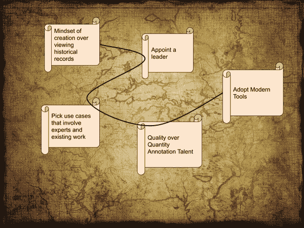
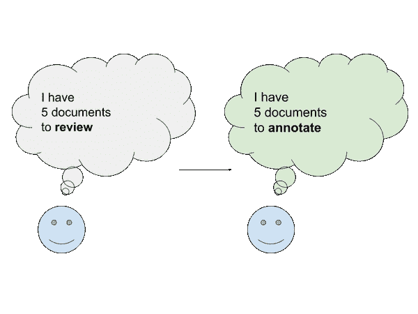
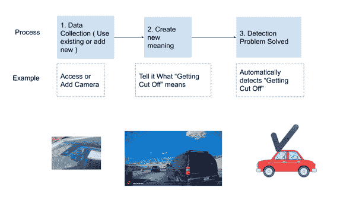
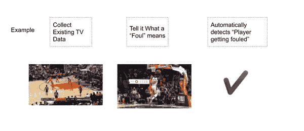
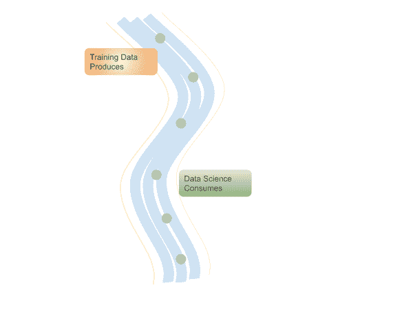
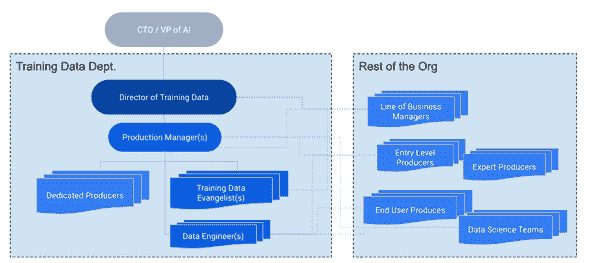
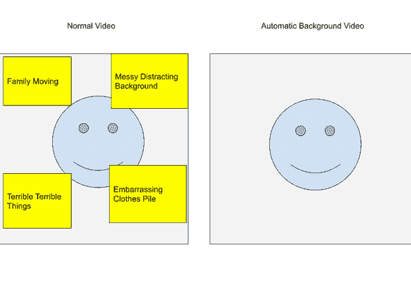
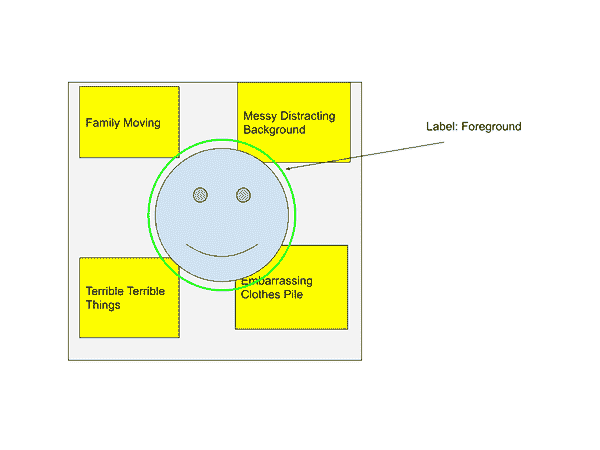

# 第七章：AI 转型

# AI 转型简介

超越数字转型，这是人工智能转型时代的开始。

在这里最成功的公司不会是那些拥有一个单一的“AI 团队”，其中有神秘的术士。成功的将是那些最广泛地将 AI 概念嵌入并将培训 AI 系统的责任推广到公司能力最低的层级的公司。

AI 转型是希望将公司转型为 AI 优先的商业领导者的答案。今天就可以开始，由你来主导。到目前为止，我们已经介绍了训练数据的基础知识，并深入探讨了诸如自动化之类的特定领域。现在，让我们放眼望去，看看整体局势。在您的公司如何实际开始使用训练数据？

在本章中，我将分享五个关键步骤。从思维方式和领导力开始，然后进入具体的问题定义，并最终完成两个解决步骤：标注人才和训练数据工具。请将计划仅视为起点，以适应您的需求。

要快速开始在您的公司采用现代人工智能，以下是五个关键行动：

1.  创造新意义而不是分析历史 - 创意革命

1.  指定某人来领导这项工作

1.  针对涉及专家、现有工作和大量工作的使用案例

1.  重新思考 AI 标注人才 - 质量高于数量

1.  采用现代训练数据工具

###### 图 7-1 AI 转型地图

创意革命是利用人类指导创造新数据点来解决问题的一种思维方式。打开这一潜力的巨大潜力将有助于为您和您的团队定义最佳使用案例。

接下来是指定某人来领导这项工作 - 训练数据主管。在大多数公司中，这个职位都是新的。考虑到这些 AI 成本中大部分是训练数据的人工成本，自然需要有人来负责。

然后是用例发现。我提供了一个草图的画布，用于勾画您的想法。例如要问的问题和要避免的常见错误。转向实施，设置人才愿景至关重要。重新思考标注人才将使您能够以成本有效的方式实现您的使用案例。

当你拥有思维方式、领导者、使用案例和人才愿景时，你可以使用现代训练数据工具将其变为现实。过去几年里，训练数据工具已经有了显著进展，有很多东西值得学习！

# 入门

## 将您的日常工作视为标注

在过去的十年左右，AI 的重大突破主要集中在经典案例上，如前几章所述。现在最大的商业机会在于监督学习、非结构化数据，这需要标注。早期的工作常常是进行“标注项目”。这意味着把数据丢给某个团队，然后希望一切顺利。

这就像点外卖。当然，它会帮助你解决即时的饥饿感，但这并不是一个健康的长期解决方案。真正的 AI 转型就像健康饮食一样，需要努力。这是一种思维转变，从把标注视为一次性项目，到把你的日常工作视为标注。

为了框架化这一点，考虑这个陈述与你公司相关：

> *你公司的日常工作都可以被视为标注。*

没错。你的大多数员工每天采取的每一个行动，从字面上和比喻上都是标注。这里真正的问题是，我们如何将这些行动从每天“丢失”转变为以可以重复且自动完成的方式捕获，达到相同的质量水平。

###### 图 7-2 思维转变：从审查到标注

要颠覆这一点，每当员工做某事而没有被记录为标注时，就意味着丢失了生产力。如果能够通过标注捕获这些工作中的大部分，你的生产力就会更高。

| 之前 | 之后 |
| --- | --- |
| 所有的日常工作都是“一次性的” | 日常工作是处理尚未被捕获在标注中的异常情况 |
| 培训只适用于人类 | 培训也适用于机器 |
| 如果不在计算机中，则不存在 | 如果不在训练数据中，则不存在 |

这里有一个粗略的类比，就像在数字化的运动中，如果没有以数字形式存在，那么它就不存在（无论是否真实）。现在同样，如果在训练数据中不存在，它就等于不存在，因为它不会帮助你的公司提高生产力。

AI 转型有两种主要类型：

1.  在传统公司，激励所有相关运营方面考虑 AI，并建立新的报告单位。

1.  在 AI 产品公司，激励以培训数据为先的思维方式，并重新组织报告关系。

# 数据中心 AI 的创新革命

数据中心的 AI 可以被视为专注于训练数据，而不仅仅是数据科学建模。但这个定义并没有完全表达它的真正含义。相反，可以考虑数据中心的 AI 更多地是关于创造新数据来解决问题。

## 关键的认识：你可以创造新的数据。

在以数据为中心的思维模式下，你可以：

1.  使用或添加数据收集点。

    1.  新的传感器。新的摄像头，新的文档捕捉方式等。

1.  添加新的人类知识。

例如，对于自动驾驶案例，如果你想检测被切断的人，你可以创建“被切断”的含义，如图 7-3 所示。

###### 图 7-3\. 数据中心人工智能创建新数据的第一个例子

或者，如果你想自动检测“犯规”是什么意思，你也可以创建这样的功能。

###### 图 7-4\. 创建新数据的第二个例子

## 你可以改变你收集的数据

这可能是显而易见的。让我们考虑一下这有多么不同。经典的数据科学中，你无法改变你收集的数据。例如，如果你正在收集销售数据，销售历史就只是历史。细微的具体细节除外，销售就是什么样子就是什么样子。你不能创造新的销售，或者真正改变数据。

使用训练数据，你可以收集全新的数据。你可以放置新的摄像头。发射更多的卫星。安装更多的医学成像设备。增加更多的麦克风。改变收集的频率。提高质量，例如相机的分辨率。

通过专注于你可以控制的数据，你可以直接改善性能。更好的摄像头角度？更好的人工智能。更多的摄像头？更好的人工智能。更多……？我想你明白了。

## 你可以改变数据的含义

回到我们的销售例子。一笔交易就是一笔交易。试图在电子表格中扩展一行来使其意义更加深刻，很少有价值。

使用训练数据，你实际上创造了以前完全不存在的含义。你看着一段媒体，比如一张图片，在计算机以前没有任何有意义的结构 - 并且真正地说“这是一个人”，“这是一罐健怡可乐”，“这是一条车道线”。这种注释的行为将你的知识映射到计算机中。

限制只存在于你的创造力之中。你可以说“这个人很难过”，或者“这罐健怡可乐有一个凹痕”。你塑造和调整它以满足你的需求。这些无限的自由度正是它如此强大的原因。

## 你可以创造！

所以下次有人对你说“数据中心的人工智能是提高模型性能的一种方式”时，你会知道这不仅仅是如此！这意味着你可以改变你收集的数据，以及数据的含义。这意味着你可以以全新的方式编码问题的理解。这意味着即使之前没有解决方案，你也可以定义解决方案。你可以 *创造*！

## 考虑步函数改进

考虑零售购物。我们可以监督机器告诉它们人们的样子和食品杂货的样子。

这打开了完全替代收银员的所有新用例。这不是 *5%* 更好的定价。这是我们购买食品杂货和设计商店方式的根本转变。

| 概念 | 之前 | 之后 |
| --- | --- | --- |
| 购物 | 每次我购物时，每次收银员为我结账时，那份工作都会消失。 | 人们购物的注释 |

| 驾驶 | 每次我驾驶时，投入的努力和工作都是“消失”的。 | 驾驶的注解。专业的注解者会注解常见场景。

我的驾驶被记录下来，以帮助这项工作。

| 文档审阅（比如贷款、请求等） | 我审阅的每份文件，工作都会丢失 | 文件的注解。工作被捕捉以减少将来类似的工作。 |
| --- | --- | --- |

关键的洞察力需要重复：任何您可以注解的事情都可以重复。

当然，这种方法也有其局限性。上述一些努力需要很多人和多年来实施。但从概念上讲，这个想法是存在的。

# 指定一位领导者：培训数据总监

所有革命都需要领导者。有人传播新的信息。团结士兵。消除疑虑。而领导者必须有一个团队。在本节中，我将阐述最佳实践、常见的职位角色，并讨论它们如何共同形成支持您的培训数据革命的最佳团队结构。

团队组织概念是训练数据成功的关键。从公司的视角来看，有什么改变？培训数据与数据科学之间的差异反映在组织中吗？需要什么新的组织结构？即使你已经处于以人工智能为中心的组织中，也有特定于训练数据的细微差别可以帮助加快你的进展。

## 从工作池转变为所有人的标准期望

目前，聚集一群人来做注解的事实标准过程，类似于旧式的打字池。一支大军，做着相对类似的工作，为了将信息从一种媒介转换到另一种。这显然是低效的。

相反，如果每个新的或更新的流程首先考虑 AI 转型，会怎样呢？如果每个新的应用程序首先考虑如何将工作捕捉为注解，会怎样呢？如果每位业务领导者首先考虑注解如何影响他们的工作，会怎样呢？

| 之前 | 之后 |
| --- | --- |
| 雇佣一支新的独立工人队伍（通常外包）。 | 您现有的专家和数据录入人员（主要是） |
| 单次项目，分开的一次努力 | 每天的工作一部分，比如使用电子邮件或文字处理 |
| “附加”思维方式 | “AI 优先”假设 AI 将存在或要求它整合到现有工作流中 |
| 将 AI“强加”给人们 | 人们将 AI“吸引”到组织中 |

是的，那些培训人工智能而不只是做他们正常工作的人可能会要求更高的工资。然而，资本回报仍然更好，即使支付一个人的工资高出百分之几，当这个人与人工智能结合时，就像 2-3 个人一样高效。

在过渡期间，你可能仍然需要额外的帮助。根据你的业务需求，可能存在需要外包的有效用例。与任何劳动力一样，需要各种注释劳动。但这里的关键区别在于，注释被视为正常工作，而不是“那些人”专门要做的一个单独项目。一系列人才的存在与你获取这些人才的方式是不同的概念。专门被雇佣“来做注释”的工人池，没有与你的业务的任何其他上下文联系，与直接被雇佣进入你的业务的工人水平是截然不同的。

另一种表述方式是，想象一家有 250 名员工的公司。一夜之间雇佣 50 人将是一件大事。然而，同一家公司可能认为雇佣 50 名注释员是可以接受的。尝试将其视为真正将 50 名人员纳入公司。

你可能已经在思考哪些领域将是良好的目标，和/或“好吧，这听起来很好，但我只是找不到一种方法来注释这样的过程”。我提出这个打字池的概念的原因是，虽然 AI 是一个附加的、事后的过程，但总会有这样的障碍。组织越多地拉拢 AI，把注释看作他们日常工作的一部分，直接参与注释，机会就越多。

## 有时是提议和更正，有时是替代

你可能已经使用过的集成提议和更正的简单示例是电子邮件。例如，在 Gmail 中，当你输入时，它会提示你一个建议的短语。可以接受或拒绝该短语。此外，建议可以标记为“不好”，以帮助纠正未来的推荐、提议、预测等。

###### 图 7-5\. AI 提议用户示例

###### 图 7-6\. 集成训练数据收集示例：

这突显了你在未来购买所有产品时需要考虑的重要因素。它也回到了使某人更加高效而不是直接取代他们的主题。

## 上游生产者和下游消费者

训练数据工作在数据科学的上游。训练数据流的失败会影响到数据科学（如图 7-8 所示）。因此，确保训练数据正确非常重要。

为什么要区分训练数据和数据科学？

因为有明显的区别，即人们*生产*训练数据和*消费*数据科学。

###### 图 7-7\. 训练数据生产与数据科学下游使用之间的关系

我认为它是生产者和消费者之间的关系。

### 生产者与消费者比较

| 训练数据 - 生产者 | 数据科学 - 消费者 |
| --- | --- |
| 捕捉业务理解和需求，以可被数据科学使用的形式。将非结构化数据转换为结构化数据 | 创建将新数据映射回业务需求的模型 |
| 负责注释工作流 | 使用注释输出 |
| 管理数据集的创建、策展、维护 | 使用数据集，轻度策展 |
| 监督数据科学的输出 | 生成预测输出 |

| 示例：KPIs^(a)：数据覆盖的业务需求的百分比

注释重做所需的百分比

注释的数量、种类和速度

注释深度 | 示例 KPIs：模型性能，例如召回率或准确度

推理运行效率

GPU/硬件资源效率 |

| ^(a) 关键绩效指标 |
| --- |

### 生产者与消费者心态

作为一名数据科学家，思维往往沿着“我们已经有哪些关于*x*的数据集？”或者“如果我有了 x 数据集，我们就可以做 y”的方向。几乎可以说是一种短路，项目一开始，一旦有了某种想法，问题就是“我们能多快拿到这个数据集？”。

类比几乎就像我饿了，我想吃点什么。我现在就想吃。我不想担心农作物或收割机或任何其他事情。这没有什么错 - 我们都需要吃饭，但我们必须意识到这种区别。农民（训练数据的生产者）同样对此感到困惑。

现在，一个农民在这里受到了自己的错觉困扰。一个人越了解训练数据，越强调生产，就越远离如何实际使用数据的关注。

举个例子，我曾与一位领先的训练数据生产总监交谈过，他正试图弄清如何获取一种特定类型的旋转框。我建议将其注释为一个 4 点多边形，并且可以基于多边形的边界提供该框。对他来说，这是一个惊喜 - 他之前认为框和多边形是两种完全不同的注释形式。这里的重点是，你越深入训练数据领域，就越不会记住（或了解）数据的实际最终使用方式，而更多地关注顶层类型和人与数据的交互。

### 为什么需要新的结构？

首先，*坏数据将导致糟糕的 AI*。糟糕的 AI 意味着在 AI 项目中的投资被浪费。这个上游角色对 AI 项目的成功非常关键，必须给予适当的角色。

第二，作为 AI 转型目标的一部分，必须有一个主要负责人来带领。虽然副总裁或 CEO 在战略层面上也可以扮演这个角色，但总监负责执行这一战略。

第三，随着涉及的人数增加，简单的现实是，这是一个团队的团队，有许多不同特征的人。即使是最简单的团队，也很可能至少有一两个生产经理，以及二十到五十名注释生产者。

这可能很容易增长到数百人。在一个非常大的组织中，可能会有数百甚至数千名兼职注释生产者。¹

这是一支需要管理的人力大军。

总结一下：

1.  坏数据=坏 AI

1.  AI 变革领导者需要

1.  注释者的大军

### 反向预算

关于数据科学和训练数据组织最令人困惑的事情之一是预算编制。通常情况下，相对于一个更大的训练数据团队，只需要一个非常小的数据科学专业团队。从成本的角度来看，训练数据成本可能比数据科学成本高一个数量级。然而，数据科学的行项目经常是最高级的项目。

改进后的设置是：

1.  AI/ML

    1.  培训数据

    1.  数据科学

    1.  数据工程

    1.  等等。

历史上，导致数据科学部分负担如此巨大硬件成本的一个原因是这样的。值得注意的是，从方向上来看，预计随着时间的推移，这种 AI 训练和运行成本会减少。此外，从资源的分工与征服的角度来看，由于数据科学已经被管理这些硬件成本所负担，进一步用训练数据问题来困扰他们显然是没有多大意义的。

### 总监的背景

有几种必须考虑的技能集

1.  这是一个人员领导角色

1.  这是一个变革推动者的角色

1.  这个人必须与业务需求保持一致

1.  理想情况下，这个人能够横跨公司的多个部门，也许已经是一个公司级别的分析师。

1.  必须具备一定的技术理解水平，以便与工程部门进行讨论。

背景不需要是什么

1.  正式的教育要求。这更像是一个实战角色。尽管这个人可能拥有工商管理硕士学位、本科或研究生科学学位等，但最有可能的是他们还会及时了解机器学习领域的最新复习和在线课程。

1.  一个“数据科学家”。事实上，这个人的数据科学背景越多，他们越会倾向于关注算法方面，而不是这种新创意的人类驱动方面。

### 总监的预算

1.  人员

1.  工具

### 培训数据总监

首先，建立一个培训数据总监职位是最理想的。

例如，这个人可以向 AI 副总裁、工程副总裁或首席技术官汇报。即使这个角色被融入某种 AI 总监角色中，其责任水平也是一样的。

图 7.9 展示了培训数据总监的职责以及关键团队成员角色的样本描述。请注意，这些并不是完整的工作描述，只是突出该角色的一些关键结构元素。

###### 图 7-8\. 新组织图示例

## 阅读此图表

这里谈到了“团队”或复数的“工程师”。当然，您的组织不会完全匹配这一点。可以将每个方框视为一个*角色*。一个人可能会扮演所有或大部分角色。

### AI 专注的公司修改

1.  可能会有较少或零传教士

1.  业务线经理可能是整体产品经理

1.  制作人员仍将根据公司而异。例如，专家可能是最终用户，或者他们可能是兼职和外部的，但仍然是具体的合作伙伴，而不是通用的“池子”。

### 经典公司修改

1.  可能会有较少的专职制作人员和更多的传教士

## 培训数据团队参与的范围

1.  咨询和培训

1.  维护其他团队制作人员使用的工具集

    1.  数据摄取/访问

    1.  支持注释生产

1.  积极管理注释数据的生产

关于主要组织将 AI 引入其中的想法并不排斥存在一个专门的培训数据团队或部门的概念。在一个 AI 成熟的组织中，该团队可能主要是作为顾问存在，紧跟最新的趋势，并维护整体工具。

正确的方法将取决于您特定的组织，我在这里的主要目的是传达一般范围的概念，即即使不是直接生成注释数据的团队，也需要一个独立的团队。

## 专职制作人员和其他团队

专职制作人员是生产经理的直接报告对象。这适用于工作量如此之大，以至于一个人的全职工作是注释生产，且他们不隶属于任何特定的业务单位的情况。长期来看，这可能是罕见的，但对于刚刚开始、转型以及没有其他生产能力的各种项目而言，这是现实。

为了简化图表，在图中外包团队可以被视为专职制作人员。

## 组织其他团队的制作人员

其他业务单位的制作人员从入门级到专家级。

最终用户可能不同，也可能会产生自己的注释。通常情况下，最终用户的注释更多是“偶然”的，作为使用应用程序的一部分，或提供某种形式的最小反馈。

在这里我将覆盖：

1.  培训数据总监

1.  培训数据传教士

1.  培训数据生产经理（们）

1.  注释生产者

1.  数据工程

让我们深入探讨！

### 培训数据总监的责任

主要负责**整体培训数据的生产**。这包括：

1.  将业务需求转化为成功生成的培训数据。

1.  通过将业务需求映射到培训数据概念来生成培训数据生产的工作。

1.  管理每天协助注释生产的生产经理团队。

1.  管理与业务经理合作，确定培训数据和 AI 机会的传教士。特别是关于注释的可行性问题。在由业务经理提出的各种想法中，可能只有少数几个在那个时刻真正具有成本效益。

1.  管理培训数据平台。

除了对注释工作的一般效率和可见性，这个人必须将注释的生产力映射回业务用例。*如果可能的话*，*传教士*可能也会这样做，而总监则是第二层。

并：

1.  与数据科学紧密协作，确保产品按预期被消耗。

1.  间接地，作为对数据科学的检查和平衡，充当对业务结果和超出纯量化统计的数据科学输出的监督。

1.  普通的主管级职责，可能有某种形式的损益责任、关键绩效指标、供应商和供应关系、报告 - 示例报告关系如图 X.x.所示，规划、招聘、解雇等。

当然，总监可以根据需要填补下面任何一个角色。

### 培训数据传播者

这个角色是教育者、培训师和变革者。

主要职责包括：

+   与业务经理密切合作，确定关键的培训数据和 AI 机会。

+   在生产经理之前“预先”工作，确定即将到来的工作，并充当业务经理与生产经理之间的纽带。

在一家专注于 AI 产品的公司

+   教育人们如何最佳地运用现代监督学习实践。

在一个经典的企业

+   教育组织内的人员对 AI 转型的影响。在实际操作中，将兴趣转化为可行的注释项目。

+   招募注释员从业务线。从实际角度来看，这意味着将一名正常工作的员工转变为将其工作的 20%捕捉到注释系统中的人员。

+   培训。特别是在兼职注释员的背景下，这个人负责解释如何使用工具和解决问题。这与专门培训全职注释员的生产经理有所不同。这是因为你培训医生的方式与培训初级员工的方式是不同的。

### 培训数据生产经理

这个人主要关注实际完成注释工作的任务执行者。

1.  与数据科学界面，设置模式，设置任务和工作流程 UI，管理培训数据工具（通常非技术性）的管理。

1.  培训注释员

1.  管理日常注释过程

1.  在某些情况下，此人也可以执行基本的数据加载和卸载。

1.  在变更管理类型的讨论中，这个人负责向对该问题新手解释注释工作的合理性。

1.  使用数据筛选工具。

### 注释生成器

注释生成者通常分为两类：

1.  全职，专门受过培训的人员。

    1.  这可能是新招聘的人员或从现有工作重新分配的人员

1.  兼职，这将逐渐成为每个人工作的一部分

### 数据工程

1.  负责数据加载和卸载，训练数据工具的技术方面，管道设置，预标注等。

1.  特别是组织从各种来源包括内部团队获取数据

1.  规划和架构设置新数据元素

1.  组织集成以了解捕获注释的技术细微差别

数据工程师将定期与数据科学团队接口

历史回顾——以前不需要的几个原因：

1.  经典机器学习数据集已经存在（即使凌乱），因此没有必要“生成”数据集。

1.  早期的努力与日常业务目标更分离。这意味着有更多理由进行一次性规划，一次性项目，孤立项目等。随着 AI 转型成为业务主流，这种分离成为一个人为的障碍。

## 保护您的 AI 未来

除了关于数据是新油的陈词滥调，让我们从实际出发来思考这个问题。如果你投资 1 美元来培训一个员工，你将得到那个单个员工的 1 美元培训。如果你投资 1 美元来捕捉注释工作，它将随着时间的推移带来许多美元的回报（或者是失去的价值）。多少？让我们来探讨一下。

# 用例发现

我们如何确定可行的用例？需要什么，什么是可选的？在本节中，我提供了一个基本的标准来识别有效的用例。然后，我进一步扩展到更多的背景，以帮助进一步确定良好的用例。

这一节从最具体到最抽象组织。

+   用于良好用例的标准

+   与标准比较的示例用例

+   概念效应，二阶效应和持续影响

简化的标准可能是日常工作中的一种选择，而其余部分可以作为支持知识。虽然您可以完全按照这些标准使用它们，但我鼓励您将所有内容视为思考的起点，仅仅是用于思考训练数据用例的介绍。

## 良好用例的标准

从最高层次的视角来看，一个良好的用例必须有一种方法来捕获原始数据，并且至少*一个*：

+   经常重复

+   涉及专家

+   添加新的功能

存在越多这些因素，用例的价值可能越大。

简化的标准看起来像这样：

| 问题 | 结果（带有示例答案） | 要求 |
| --- | --- | --- |
| 我们能获取原始数据吗？ | 是/否 | 需要 |
| 它经常重复吗？ | 是/有时/否 | 至少需要一个 |
| 需要专家参与吗？ | 是/有时/否 |
| 添加新功能？ | 是/有时/否 |

就是这样！这可以成为一个常用的参考标准，并在需要时使用更详细的下面的标准来支持它。

### 详细标准

现在我们已经有了大致的想法，让我们进一步扩展它。这里我提供了更详细的问题，特别是扩展和区分新能力概念。我添加了例子、反例和一些关于为什么重要的文字，以帮助

| 测试 | 示例 | 反例 | 为什么重要 |
| --- | --- | --- | --- |
| 数据已经被捕获了吗？还是有明显的机会添加更多传感器以捕获数据（全部）？（必须） | 现有文件（例如发票）、现有传感器、添加传感器 | 人员销售互动汽车经销商 |

+   获取原始数据捕获是必要的一步。

+   如果无法获得原始数据，则其余内容无关紧要！

|

| 它是否涉及到专家？ | 医生，工程师，律师，一些专家 | 杂货购物 |
| --- | --- | --- |

+   使受限资源能够更多地（可能更频繁地，在更多情况下）提供给更多人。

+   专家意见具有很高的价值。

+   更容易获得的数据，通常已经以数字形式存在。

|

| 工作重复频率高吗？每分钟多次？每天？每小时？每周？ | 自动背景去除/模糊

客户服务和销售

行政文件审查 |   |

+   至少对人类而言，已经有一个良好理解的模式。

+   可能已经相对受限。

+   经常重复的任务，从总体上看，具有很高的价值。

+   现有的原始数据可能已经被捕获。

|

#### 增加了新的能力

解锁超越增强或替代的新用例。（增加新的能力）

| 测试 | 示例 | **反例** |
| --- | --- | --- |

| 由于费用昂贵而很少完成工作吗？

增加频率会非常有价值吗？ | 检查 | 体育场建设 |

| 我们能将近似过程转变为更精确的过程吗？

这个过程是否因为当前不切实际而对某些内容进行了忽略？

我们当前是在用某种更通用的东西替代我们真正想弄清楚的东西吗？

如果改进这个过程的准确性是否会带来更多好处而不是伤害？ | 水果成熟度。产生霉变或瘀伤检测，

检测凹陷的罐头

一个只检测金属的机场检测系统，与能够检测特定威胁的系统相比 | 贷款承销 |

| 有些事情因为量大而被完全跳过了吗，或者因为其他原因不切实际？（例如，由于数量）

如果我们能做到，这会非常有价值吗？

任何事情都相对耗时（即使很少发生）。 | 视频会议和销售电话的分析

视频上传中的色情检测，评论审核

保险财产审查^(a) |   |

| ^(a) 可能每小时花一些时间，但可能只需要每年或每十年做一次 |
| --- |

主要区别在于，这是一些否则不会发生的事情。例如，目前可能每年检查一次的桥梁，每天检查是不切实际的。因此，自动桥梁检查系统将增加新的能力。尽管目前这种情况并不经常发生（每年一次），而且可能或可能不涉及直接的专家劳动，例如实际的检查人员可能正在寻找裂缝并测量它们，而工程分析则由其他人完成。但无论如何，对于任何人来说，每天检查都是不切实际的。

#### 关于重复用例的注释

1.  不要立即假设替换——首先考虑增强。

1.  对于表单来说，普通编码是可以接受的。但是要考虑“当人们获得信息时，他们会怎么做？”

1.  要了解一个好主意，看看公司中有多少“重复”角色。有成千上万的人在做大致相同的事情吗？这是一个很好的起点。

#### 关于专家和专业人士的说明

所有工作都涉及一定程度的专业化和培训。与其在特定情况下提供“低成本的机会”，不如看看通常具有最多机会的领域（不一定是最容易的）。专家案例通常意味着某些方面实际上相当困难才能掌握的技能。当然，专家的定义因人而异，我的心智模型是指“在正常教育后，需要 5-10 年才能达到基本熟练水平的技能，或者是如此尖端以至于能力池有限的领域”。

## 根据评分表评估用例

在这里，我们详细介绍一个示例用例，然后将其与评分表进行比较。

### 自动背景去除

最近有进行过视频通话，并注意到某人的背景被模糊了吗？或者您自己已经在使用这个功能。无论哪种方式，很可能您已经与这款由训练数据驱动的产品互动过。

特别是当您参加视频会议（例如 Zoom）时，您可能正在使用“背景去除”功能（图 7.10）。这将混乱分散注意力的背景转换为自定义背景图像或平滑模糊的背景——看起来像魔法般。

###### 图 7-9\. 普通视频与自动背景去除视频的比较

为了背景，这过去需要绿幕、定制照明等。对于高质量的制作（如电影），通常需要人工手动调整设置。

那么培训数据如何参与？

首先，我们必须能够检测什么是“前景”和什么是“背景”。我们可以采用视频示例，并在图 7.11 中标记前景数据。我们将使用这些数据训练模型来预测“前景”的空间位置。其余部分将被视为背景，并进行模糊处理。

###### Figure 7-10\. 标记前景示例

这里的要点是模型正在找出构成“背景”的模式。我们并没有明确声明杂乱的衣服堆看起来像什么。

如果我们限定问题，假设只有人类会出现在视野中，我们可以采用“现成的”模型来检测人类，并简单地使用它。

为什么像这样的功能很重要？

+   增加了更多的平等。现在无论我是否有花哨的背景都没关系。

+   提高隐私和会议效率。有助于减少干扰的影响（例如某人进入呼叫区域的边缘）。

如果这看起来非常简单 - 这就是重点。这就是训练数据的力量。以前在没有绿幕的情况下*真正不可能*的事情现在变得像给视频贴标签一样简单。

现在要注意的一些事项：

+   在写作时，获得一个高效的模型来进行“像素分割”仍然有些具有挑战性。

+   已经有一些公共数据集可以很好地识别人类。然而，如果您必须从头开始标记“缩放通话”数据集，这将是一项巨大的工作。

### 评估

| 问题 | 结果 | 要求 |
| --- | --- | --- |
| 我们能获取数据吗？ | 是的，视频流已经数字化捕获。 | ✔️ |
| 它经常重复吗？ | 是的，一个视频通话可能会删除数千个背景帧，一个用户可能每天有多个通话，而且有许多视频通话者。 | ✔️ |
| 需要专家参与吗？ | 有时候。设置绿幕效果需要一些专业知识，但远非专业医疗或工程知识。 |
| 增加了新的能力吗？ | 有时候。以前可以获取绿幕，但在旅行等情况下，即使是拥有绿幕的人也无法使用它，因此在这种情况下增加了新的能力。 |

总体而言，这得分相当不错。它满足了获取数据的要求。在“重复”类别中得到了巨大的肯定。而且根据您想评估的用例子集，它潜在地避免了必须拥有专家并增加了一个新的能力。例如，我无法想象在咖啡馆或机场中间轻松获取自定义背景。

关于用例的说明：概念效果区域列出了一小部分用例。为了这个评分标准和时间，我只深入探讨了一个用例。我的目的是传达任何用例都会很好的条件，并提供思考增值和整体效果的工具。考虑到潜在的用例广泛性，我认为这比尝试迭代所有已知用例列表更有价值，许多这样的最新列表可以通过在线搜索找到。

## 用例的概念效果

这与上文的思想相当类似，但角度略有不同。在上文中，我们从“什么是一个好的用例”的角度来看待这个问题。现在我要看的是“这些用例在做什么”。我还包括了一些表面水平的显而易见的二阶效应 - 技术采纳在技术范围之外引起的效应。我只是希望这是一个让人们开始思考二阶和三阶效应的起点。

| 概念 | 示例 | 二阶效应 |
| --- | --- | --- |

| **放松问题本身的限制**（在先前解决的问题上） |

|

+   绿幕 -> 任何背景

+   我必须到一定年龄才能开车

+   拼写检查 - > 语法检查

|

+   我的背景不被用来评估我参加工作面试的资格

+   如果父母不驾驶，那么“带孩子去 x”会有新的含义。

+   正确语法的期望发生了变化（除了正确拼写之外）。

|

| **替代或增强常规工作** |
| --- |

+   人类数羊 -> 自动数羊

+   人类驾驶 -> 车辆驾驶（与人类表现相当）

+   将人类路由通信到部门 -> 基于意图的自动通信报告（销售、支持等）

|

+   工作的含义改变了

+   数百万个工作岗位将被创造和转移。人们将需要学习新技能。

+   郊区可能进一步扩展

+   没有效使用 AI 的公司将具有更差的成本结构，如同没有有效使用数字一样。

|

| **使人类“超人类”** |
| --- |

+   机场安全扫描

+   体育分析

+   自动驾驶（事故减少）

+   在常规医疗工作上充当“第二双眼”

|

+   机场安全检查可能变得更加有效和快速（希望如此！）

+   由于人们对精英级教练期望扩展到更多人，体育运动的强度可能会增加。

+   事故可能变得更加罕见，甚至更加值得关注

|

| **使受限资源可供更多人使用**^(a)（或者没有那么多限制） |
| --- |

+   放射科医师的时间。在此之前，放射科医师一天只能看到有限数量的人，现在一个良好设置的医疗系统几乎可以看到无限数量的患者。***很多星号，但基本思想在这里***

+   这还消除了地理限制

+   自动驾驶（由于共享资源导致出租车费用降低，因此更多人能够移动）

|

+   医疗护理可能会更加可及。

+   “第二意见”的意义可能会改变。

+   新的危险将出现，例如增加的群体思维，数据漂移，减少对人类专家意见的重视。

|

| ^(a) 这与“放松限制”类似，但示例相当不同，因此将它们保持在不同的类别中。 |
| --- |

### 案例使用的持续影响

在其核心，这个想法是通过训练数据更轻松地将人类知识编码到机器中。

“复制”人类理解的成本接近于零。以前，放射科医生的时间是稀缺资源，现在它将变得丰富。以前绿幕只出现在电影工作室，现在它随身可带，无论身处世界何处。（参见 2）

这带来了互联网的所有优势

这带来了以下的后续影响。

+   可以显著增加项目的**频率**。例如，以前视觉桥梁检查可能一年或十年才能进行一次。现在，类似级别的分析可能每几秒钟就能完成。

+   以前“随机”的流程将变得相对“固定”。我们都知道车祸会发生。但最终 - 它们将会很少发生。将以前随机的过程（你到家后给我打电话）变成几乎肯定的事情（国际新闻，过去 24 个月内的第一次车祸发生了）。

+   以前不可能的事情将会变得可能。例如，把“牙医放进你的口袋”，最终你将能够用手机传感器对准你的口腔，获得一种以前需要看牙医才能得到的洞察力水平。

+   增加“个人”辅助的个性化和效果将会增加。

# 重新思考 AI 注释人才 - 质量胜过数量

+   首先购买培训数据，数据为中心的首要思维方式是一件事情

+   实际上在做注释的是一个不同的决定

+   密切相关

+   事实上并不存在争议的想法 - 只是意识问题（例如，一旦意识到，8/10 的人会同意它）

    +   通过逻辑步骤。可以引起共鸣。

谁在注释和培训数据文化紧密相关。了解培训数据的人越多，机会就越多。您自己的员工和专家参与的越多，质量就越高。

## 培训数据投资回报率的关键杠杆

+   **才能，或者谁在注释。**引用一位管理 100 名注释员团队的人的话：“注释质量的最大决定因素是创建注释的人。”

+   **培训数据文化的程度。**这可以是一种阶梯函数类型的差异。人们要么意识到某些东西可以转化为培训数据，要么不意识到。

这些因素最终将决定培训数据的“寿命”，以及其转化为实际生产力改善的能力。

## 让我们考虑一下注释数据代表什么

1.  您的业务知识、商业机密、流程、能力

1.  大量的人力投资用于创建、更新、保护和维护它

1.  在 AI 转型期间保持竞争力的关键

在这种背景下考虑您的注释进一步支持需要有专门的业务部门专注于此。它还展示了在购买过程的所有阶段都需要意识。例如，如果您购买一个系统来自动化某些任务，并且供应商负责注释的日期，这对您的未来意味着什么？

## 控制您自己的培训数据的好处

1.  A better cost model by using your existing team

1.  Control over the economics and quality of the output

1.  A better cost model by creating a shareable, reusable library of training data

## The Need for Hardware

First let’s get some sticker shock out of the way. Big, mature AI companies spend $10s-100s+ of millions of dollars on AI compute (e.g. GPUs, ingestion, Storage). This means that hardware cost is a key consideration.

Second, training data is your new gold. It’s one of your most important assets. People may be your most important asset, but this is a literal embodiment of people. It’s important. How do you protect it?

Realistically, if you aren’t controlling the hardware, there is very little way to protect that data. What happens if there is a contract dispute? What if the vendor’s controls aren’t as good as you thought? You have your key business data and records under your control - and training data must be the same way. To be clear here - I don’t just mean say the annotation tooling. Any data that any of your vendors are capturing that’s used for training AI must be considered here.

This means that while a SaaS solution may be ok for getting started, proof of concept etc, for training data the hardware costs, and degree of importance to the company is too great to not take control of it.

Practically speaking, if you leave any type of prediction, annotation automation, etc. in the hands of a vendor’s server (unless it’s being run on the client) this means you will be actually negotiating a huge amount of hardware costs hidden inside the annotation tooling cost.

## Common Project Mistakes

Under Resourcing is especially prevalent here. I have seen a number of solo professionals from pathology to dentistry be curious about AI. While this curiously is naturally great, the reality is you need a strong team effort and substantial resources to build something that will be even true prototype level or production.

+   Under Resourced. A single Dr is unlikely to make a general purpose AI, even for their niche area.

+   Mistakes on volume of data needed. For example a major dental office’s x-rays for all time for all patients may be substantial, but on its own still probably is not enough data for a general purpose dentist AI.

+   Most AI projects have a very very long time horizon. It takes on the order of months to years to build reasonable systems. And often the expected lifetime and maintenance is measured in years or even longer.

# Adopt Modern Training Data Tools

**Usage of Training Data tools.** Effective usage can have orders of magnitude differences. The first step is to gain awareness of what high level concepts exist. If you have read all the way through you have already taken a big step in this direction, getting this book and other material in front of your team is a great way to help accelerate this process.

Software can help provide guard rails and encouragement to a transformation, but it is only a part of the overall transformation.

训练数据专注的软件旨在扩展至所需的广度和深度复杂性，以真正捕捉所需的业务流程的细节。标记整个图像与复杂属性的多边形经过专门的审核流程后的区别巨大。

训练数据软件经过了漫长的发展并吸引了数百万美元的投资，远非其起初的简朴。现代训练数据软件更像是一套办公软件，具备多个复杂的应用程序相互交互。也许在逐行复杂性上还不及，但在方向上，几年后将会是如此。

## 商业模式

工具销售的两种主要商业模式

+   按用户付费

+   按使用量付费

TODO 进一步扩展这一点

## 考虑学习曲线而非完美

有一种倾向是在训练数据软件中寻求完美和熟悉性。特别是如果现有的早期团队熟悉某种模式。简单的事实是，所有软件都有漏洞。就在前几天，我使用谷歌搜索时，它重复了菜单和搜索结果。这是一个经过数十年数万亿工程努力的产品！

如果我们回顾早期的计算机应用程序，它们的用户界面非常晦涩。人们必须学习许多概念才能执行简单的任务。在这里也适用同样的基本原则。

另一个需要理解的事实是，这些应用和使用案例的复杂性不断增加。我刚开始时可以在半小时内演示大部分关键功能。现在，即使我将演示范围限定于特定角色（比如标注员）和特定媒体类型（比如图像），仍可能需要半小时！一个完整的端到端覆盖将需要数天…… 就像对从未使用过文字处理或电子表格的人进行基础培训课程可能需要数天一样。

### 放慢速度

虽然 UI 设计和定制化很重要，但过分关注可能会忽略重要点。如果 SEM（搜索引擎营销专员）们太忙以至于无法进行基础培训（或仅是时间问题），那么实际上他们能提供质量高的标注吗？

### 定制化和配置

进一步地，虽然现成的软件无疑是起点，我们必须认识到总会有一定程度的定制化和配置需求。

## 新的培训和知识是必需的

### 每个人

1.  介绍：关于监督式人工智能的高层概述及其与贵公司业务的关系。

1.  保证：它将提高生产力 - 提议和更正 - 而不是取代他们的工作。

1.  概念：监督导致更高效的工作。

1.  请求：提出适合此类监督的流程想法。

### Annotators

1.  标注工具的基础知识。继续办公类比，掌握标注工具的使用将成为现代学习文字处理的等价物。

1.  更深入的培训，比如在部分阅读这本书，以及进一步培训关于偏见等敏感问题。

### 管理人员

上述所有内容以及：

1.  如何询问有关新流程和更新流程的问题

1.  如何识别在财务上可行的训练数据机会

1.  反思在 AI 注释新世界中的生产力目标。在注释中未记录的每一时刻的工作都是一时的损失。

### 高管们

1.  反思公司组织，比如创建一个新的训练数据单位

1.  反思、培养和保护围绕培训的文化

1.  谨慎考虑供应商选择，以确保未来 AI 目标的安全性

## 生产和消费训练数据

这其中最令人困惑的一个方面是：“是谁在制作消耗训练数据的软件？”“谁在产生训练数据？”。这里我见过的主要情况有：

1.  一个专注于软件的公司生产了一款 AI 驱动的产品，而训练数据的大部分或全部也由他们产生。该公司将软件发布给消费者或其他公司购买软件并成为最终用户。

1.  一家拥有内部训练数据生产能力的公司为其自己内部使用创建软件。通常这可能涉及依赖外部合作伙伴或非常大的投资。

1.  一个软件公司生产了一款 AI 驱动的产品，但把大部分训练数据留给了购买软件的最终用户来产生。

唯一的情况是最终用户公司不参与训练数据的生产是 1）。一般来说，这要么将企业的核心竞争力转移到软件提供商，要么意味着提供的产品相对静态。这里的类比可以是购买一个无法更新的“网站”。由于很少有人想要一个无法更新的网站，总的趋势可能会是公司始终能够以某种方式产生自己的训练数据。

从高管的角度来看，从某种意义上说，这真的是最关键的问题：“你想要自己生产训练数据吗？”。

## 避免的陷阱：在训练数据优化过早

| 陷阱 | 发生原因 | 警告信号 | 避免 |
| --- | --- | --- | --- |
| 认为一个受训模型==完成 |

1.  努力训练模型。

1.  它有点起作用，人们感到兴奋。

1.  假设只需要做些小的调整

1.  认识到这还远远不够。

|

+   “受过训练的模型”被讨论为最终目标。

+   不讨论持续进行的注释。

+   谈论迭代，但在有限的时间窗口内。

|

+   教育人们的目标是建立一个持续改进的系统，而不是一个一次性的模型

+   提前讨论什么性能水平足以发布第一版。例如，对于自动驾驶，有些人采取了“等同于人类就足够好”的方法。^(a)

|

| 过早承诺模式 |
| --- |

1.  耗费大量资源进行注释

1.  意识到标签、属性、整体架构等与他们的需求不匹配。例如，一直在使用边界框，但意识到需要关键点。

|

+   在早期试点工作和更重要的工作之间，架构没有显著变化。

+   架构是在几乎没有数据科学参与的情况下确定的。

+   “最终”架构是在没有证据表明成功实现会解决下游问题的情况下确定的。

|

+   期望架构会变化

+   尝试许多不同的架构方法与实际模型一起，看看什么实际上有效 - 不要假设任何人都有足够的背景知识提前知道答案。

+   问：如果模型能够完美预测，这是否真正解决了我们的下游用例？例如，如果它完美地预测了这个钢筋上的盒子，那是否解决了整体问题？

|

| 过早承诺自动化 |
| --- |

1.  查看人类标注可能需要多少资源

1.  寻找自动化解决方案

1.  起初对自动化结果感到满意

1.  意识到自动化并没有完全做他们认为它在做的事情

|

+   不切实际的期望。例如，期望自动化几乎可以解决所有标注的问题。

+   探索自动化，而没有涉及数据科学

+   在进行任何重要的人类标注工作之前，详细讨论自动化计划。

+   在虚假假设下，管理思想中对训练数据的减少，认为自动化可以处理它。

|

+   意识到不需要太多的人类标注就可以开始获取对需求的方向性理解。

+   在完成大量手动人类标注之前，最好使用最少甚至零自动化。

+   做比你认为需要的人类标注更多。之后，你将能够选择最有效的自动化。

+   把自动化视为过程的一个预期部分。而不是一个灵丹妙药。

|

| 错误计算工作量的数量 |
| --- |

1.  查看整体数据集大小

1.  项目需要多少标注

1.  假设会需要所有这些工具

|

+   假设所有可用的数据都需要被标注（数据可以根据最有价值的项目进行过滤）

+   不考虑数据的持续积累或生产数据

+   不考虑边际效益递减。例如，每进一步注释的项目都会比前一个项目增加的价值少。

|

+   获取足够大的实际工作样本，了解每个样本通常需要多长时间。

+   意识到这总是一个不断移动的目标。例如，随着模型变得更好，每个样本的工作可能会变得更加困难。

|

| 没有花足够的时间来使用工具 没有获得正确的工具 |   |
| --- | --- |

+   过度关注“获取数据集的标注”，而不是实际结果。

+   不切实际的期望。把它看待得更像是一个随便逛逛的购物网站，而不是一个严肃的新生产力工具套件。

|

+   意识到这些新平台就像是 Photoshop 进入酒吧，遇到一个兼职作为数据工程师的严格任务大师。它是复杂而新颖的。

+   工具越强大，理解的需求越大。把它看待得更像是学习一个新的学科领域，一门新的艺术。

|

| ^(a) I’m not commenting if this approach is right or wrong. |
| --- |

## No Silver Bullets

There are no silver bullets to Annotation. Annotation is work. For that work to have value it must be literally labored at. All of the means to improve the productivity of annotation must have some base that exists.

Training data must be relevant to your business use case. To do this, it needs the insights from your employees. Everything else is noise, or in depth expert, situationally specific concepts.

Instead of looking at some of these optimizations as true gains, rather see missing out on them as being functionally illiterate.

This caution is important because, being such a new area, the norms are poorly established.

## Culture of Training Data

One of the biggest mis-conceptions about modern training data is that it is exclusively the realm of data science. This misconception really holds teams back.

True data science is very hard work.

However, the context in which that hard work must be employed is often confused.

If the AI projects are left as “that’s the data science teams’ responsibility” then how likely do you think success company wide will be?

It’s very clear that:

1.  Non-data science expertise, in the form of subject matter knowledge, is the core of training data.

1.  The ratio of people who are SEMs to data scientists is of vast fields to a single grain.

1.  Data science work is increasingly becoming automatic and integrated into applications

The great thing here is that most data scientists would be happy if other people knew more about training data. As a data scientist, I don’t want to worry about the training data for the most part, I have enough of my own concerns.

Not everything, at least right away, is a good candidate for training data. Being able to recognize what will likely work and what won’t work is a key part of this culture. The more bottom-up the ideas for this, the less likely it will be something that appears easy but is actually terribly hard and fails.

Getting everyone involved with training data is at the heart of AI transformation. In the same way that the IT team doesn’t magically recreate every business process on their own. Each line of business manager brings a growing awareness of the capabilities of digital tools, what questions to ask, etc.

## New Engineering Principles

The first step is to recognize the intersection of the business need, and the expert annotators, with the day to day concerns about data.

Creating Embedded Annotation Experiences

Creating annotation experiences embedded into existing and new applications. User interfaces, data extraction to training data systems, receiving predictions etc.

Making the Training Data system a Standard central component

要运行 Web 服务器，我们使用标准的 Web 服务器技术。训练数据也是如此。随着这一领域的复杂性和投资持续增长，将训练数据转移到专用系统或一组系统中变得越来越合理。

从数据科学中抽象训练数据

将数据集创建作为一个简单的断点。如果数据集不再是静态的东西，而是允许训练数据自行创建，并由数据科学查询，我们就能得到一个更强大的责任分离。当然，在实践中会有一些相互作用和沟通，但从方向上来看，这提供了一个更清晰的责任范围。

¹ 关于外包的一点快速说明，即使注释者中有一部分是外包的，但涉及的预算如此庞大，可能更合适的思考方式是将它们视为兼职甚至全职等价物。

² 从技术上讲，这是“更高维度的空间”，在这个空间中我们无法合理地进行视觉表示。许多机器学习模型具有数百个维度，而我们只能合理地绘制四维（空间（x，y，z）和时间（t））。
