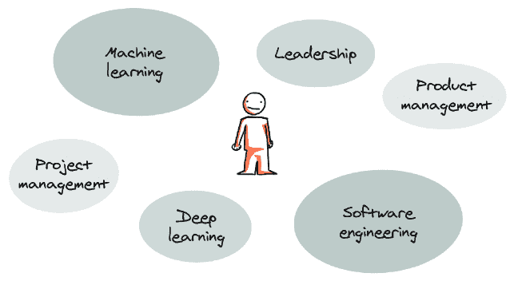
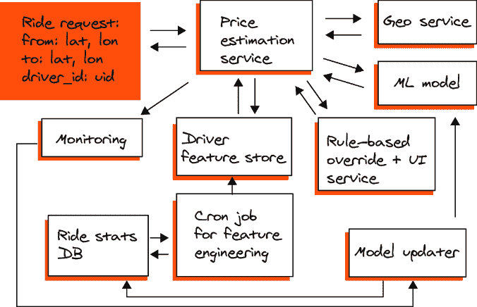

# 1 机器学习系统设计的基本要素

### 本章涵盖

+   机器学习（ML）系统设计是什么，为什么它如此难以定义，你可能在何处首次遇到它

+   我们认为谁将最从阅读这本书中受益，我们将提供哪些信息，以及它的结构将如何安排

+   机器学习系统设计有哪些原则是有帮助的，以及何时应用它们最合适

机器学习（ML）系统设计是一个相对较新的术语，常常让行业人士感到困惑。许多人发现很难确定这个术语背后的特定职责范围，更不用说尝试为相应的角色或职位找到一个合适的名字了。根据其职责范围的不同，这项工作可能由机器学习工程师、软件工程师，甚至数据科学家以不同的效率完成。

虽然所有这些观点都是有效的，但我们认为，要成为一名经验丰富的机器学习系统设计专家，你必须将每个背景领域的专业知识封装起来。请注意，虽然本书中我们讨论的一些内容是针对机器学习系统的，但其他内容对于那些已经构建过非机器学习软件系统的读者来说可能很熟悉（你可以在第二章、第十三章和第十六章中找到这些信息）。这是因为机器学习系统设计，尽管是一种新的现象，但仍然基于软件开发的经典基础。

但首先，我们需要发现机器学习系统设计作为一个整体究竟是什么。在本章的开头，我们将提出我们对机器学习系统设计定义的看法，并用我们自己和同事的个人经验中的例子来支持它；我们将描述这个职位的理想人格，并分享我们个人经验中的案例，说明为什么采用连贯一致的方法来设计机器学习系统将节省你大量的时间，并有助于实现短期业务胜利，这对于在早期阶段赢得同事对这种新工作方法的信任至关重要。

## 1.1 机器学习系统设计：你是谁？

如果你曾经尝试过在深度技术/大科技公司（第一个术语通常指初创公司或大公司内部从事或开发尖端技术的研发部门，第二个术语指世界上最大、最具主导地位的科技公司，它们通常以人才招聘的高标准和先进的工程文化而闻名）的机器学习工程师/经理职位面试，那么你可能会对机器学习系统设计感到熟悉。我们两人都有丰富的深度技术经验，所以在计划写这本书的时候，我们确信定义对每个人来说都很清晰，没有必要过多地纠结于此。

然而，在向各种人征求他们对大纲的意见后，我们发现这个术语本身在意见和解释上引起了分歧。也许这是因为该行业长期以来一直有一个明确的职位列表，这为求职者提供了一个相对清晰的理解，即他们申请的是哪些功能和责任。软件工程师、研究工程师、机器学习工程师等职位都包含了一定经典的功能集合，这些功能在教科书中被神圣化，并在职位描述中被巧妙地陈述。

因此，是否存在与“机器学习系统设计”直接相关的职位？目前，没有完全符合我们将在本书中描述的范围的职位，但如果遇到符合这一范围的人，他们的职位肯定会是数据科学家。

在我们试图理解这种联系的本质时，我们接触了在数据科学家职位上工作的人，最终意识到这个角色意味着一个非常广泛且模糊的责任列表。确实，你可以在 10 家不同的公司找到 10 个不同的数据科学家，并询问他们做什么——你最终会听到 10 件完全不同的事情：

+   在 Excel 中创建数据透视表。

+   设置一个 10 PB 的分布式集群。

+   构建实时计算机视觉系统。

+   部署众多聊天机器人。

+   在 Tableau/Metabase/Looker/PowerBI 中可视化数据。

+   编写 SQL 脚本。

+   进行 A/B 测试。

+   创建推荐系统。

+   处理与利益相关者的沟通。

+   回答来自高层管理的问题。

如您所见，一个简短、听起来清晰明了的标题包含了一系列相当混乱的功能，它已经成长为一个“万能手”的术语，用于任何超出数据工程师、机器学习工程师和研究工程师通常工作范围的事情。

在思考这个问题时，我们发现，在机器学习系统设计（或者更确切地说，后来得到这个名字的情况）中，情况正好相反：存在一种没有共同名称但具有明确的功能和责任的现象，需要做的是组织它们，并将它们纳入一个相互关联的功能结构中。

在接下来的章节中，我们将提供我们自己对机器学习系统设计的看法，甚至提出非传统想法和解决方案，但在深入探讨之前，我们想提出我们自己的定义：

> 机器学习系统设计是一个复杂的多步骤过程，涉及设计、实施和维护基于机器学习的系统，这需要结合来自各个领域和角色的技术和技能，包括机器学习、软件工程、项目管理、产品管理和领导力。

图 1.1 展示了此定义。

##### 图 1.1 成功进行机器学习系统设计所需具备的各种技能

我们之所以用斜体强调“维护”，是因为我们认为机器学习系统设计并不随着机器学习系统的发布而结束。除了提供准确的预测和确保高效的决策外，你的系统必须足够可扩展和灵活，以便能够轻松适应不断变化的企业环境或任何其他内部和外部因素。因此，在你上线后，维护和微调你的机器学习系统将确保其在长期内的效率，这在严格预算或容量限制下尤其重要。

但质疑的不仅仅是书简介或浏览目录的人对“机器学习系统设计”这个术语本身。我们收到了大量关于本书各个方面的提问；以下是我们认为最引人注目的几个问题：

+   “数据科学家、机器学习工程师和软件工程师是不同的角色；为什么你要将它们融合在一起？”

+   “我对一本关于机器学习系统的书涵盖数据收集和报告等内容感到有些困惑，因为这正是将传统机器学习与数据科学区分开来的地方。”

+   “我很惊讶在概述中没有提到 MLOps，这是描述你描述的许多组件（可重复性、测试、管道等）的通用行业术语。”

对于我们来说，这些问题成为了公众对机器学习与数据科学之间，以及机器学习工程师和数据科学家之间混淆的额外指标。我们对此有自己的看法，但首先，让我们尝试澄清我们的观点。

来自深度技术公司，我们习惯了称呼那些做机器学习的人为“机器学习工程师”，但机器学习工程师和软件工程师之间的区别正在缩小，尤其是在一些显赫人物将机器学习称为“软件 2.0”([`mng.bz/yoNe`](https://mng.bz/yoNe))之后。同时，“数据科学家”这个职位通常与那些从事产品分析和与指标、见解等工作的人相关联。（请注意，我们在这里谈论的是我们在深度技术公司的经验，但由于这些公司雇佣了数千名高素质的专业人士，并逐渐为整个行业设定标准，我们倾向于将这种方法作为基准。）

当人们面试机器学习工程师职位时，他们通常会走过软件工程师招聘流程，并在此基础上增加额外的部分，其中机器学习系统设计是最重要的之一。这被用来提取关于候选人专业知识、成熟度和概述复杂系统以及将其分解为相互依赖的任务块的能力的信号。这并不是一件容易的事情，因为候选人只有 40-45 分钟的时间来展示由面试官随机挑选的系统设计。

现代人工智能作家和哲学家埃利泽·尤德科夫斯基写道：“学校里教授的最危险的思想习惯是，即使你真的不理解某件事，也应该鹦鹉学舌地把它复述出来” ([`mng.bz/r1Zy`](https://mng.bz/r1Zy))。这在一些公司的技术面试流程中非常适用：面试官提供一个谜题，并期望应聘者鹦鹉学舌地给出特定答案。应聘者被录用并成为自己公司的面试官后，这种不良习惯得到强化，公司继续招聘那些从各个领域零散记忆的知识片段的人。这些人是否真正理解全局没有保证，这正是我们在进行面试时遇到的情况。

我们为多家公司面试和招聘机器学习工程师。有些人处于职业生涯的初期，有些人是有经验的专家，还有一些人是从软件工程师转向机器学习的。然而，那些未能通过面试的人中有一个共同点：在机器学习系统设计部分工作时，他们过于关注细节，从未触及更大的图景。

对我们来说，这些失败表明了期望不匹配；作为年轻的招聘经理，我们坚信，一个了解所有算法、工具和模式的人会自然而然地适合这个角色。但后来我们发现，有时人们无法将他们的知识碎片整合成一个整体愿景。

此外，在现实环境中构建系统与在面试中讨论它们截然不同。一个人可以学习数十个流行的机器学习系统设计问题（“你将如何为 LinkedIn 类似的网站设计一个职位推荐系统？”），当类似的问题在实际工作中出现时，可能会感到困惑。

但让我们暂时忽略面试的部分。雇佣机器学习专家是有原因的：公司需要他们来构建、维护、运营和改进系统——而不仅仅是编写一些代码或关闭 Jira 工单。企业需要可靠的机器学习系统来实现目标和解决问题。

构建机器学习系统需要广泛的技术技能。简单来说，负责人必须能够回答以下三个问题：

1.  我们在构建什么？

1.  系统的目的是什么？

1.  它应该如何构建？

实际上，这需要多个角色的技能组合：一点产品经理的技能来理解主要目标并将其传达给同事和利益相关者，相当一部分机器学习研究者的技能来赋能系统，当然，还需要坚实的软件工程背景来使产品可用、可维护和可靠。机器学习系统设计专家应该能够全局思考，并在必要时深入到足够的地方。

很少有人能够以适当水平结合所有这些技能。然而，如今正在构建大量机器学习系统，而有人必须设计它们。根据我们的经验，机器学习系统通常由一位聪明的机器学习专家（因为它是机器学习）或一位经验丰富的软件工程师（因为它是系统）设计。他们完成了这项工作，但往往在他们的强项之外领域感到挣扎。

总结来说，围绕机器学习系统设计的困惑对于一方面缺乏专业知识的人才和另一方面寻找全能手型招聘经理或招聘人员来说更为典型。然而，如果我们从高级管理人员或专家的角度来看，就会出现一个更广阔的图景。他们知道你聘请这些专家来构建、维护和改进机器学习系统，他们在机器学习系统上的最终表现成为他们职业成长的终极标准。

我们认为，数据科学家和软件工程师的结合，以及他们在学术机器学习方面的经验，构成了机器学习系统设计方面的专家。最终设计机器学习系统的人可能来自各种背景——软件、实践机器学习、学术机器学习、数据研究——我们希望我们的小块理论辅助的实践经验能帮助他们填补差距，系统化他们在熟悉领域的知识，并在缺乏宝贵经验的地方更加自信。

### 1.1.1 为什么机器学习系统设计如此重要

当你拥有 MLOps 作为一套用于构建和维护你的机器学习系统的工具集时，你可以将机器学习系统设计视为一个蓝图，你可以在任何时刻依赖和参考它，这将为你提供可扩展性和灵活性（对构建块及其连接的正确理解有助于识别瓶颈和流畅地解决其他问题）。然而，最重要的是，它提供了一个框架，将你的整个系统焊接在一起。

有些项目足够简单，以至于不需要那么彻底的方法。以建筑为例。你可能不需要初始蓝图就能建造一个棚屋。但当你雄心勃勃地扩展到房屋或摩天大楼的水平时，你不能不使用预先安排的详细计划。机器学习系统设计是一种工程方法，它结合了数百位在数十家公司和众多项目上工作的专家的经验，用于构建机器学习系统。

### 1.1.2 机器学习系统设计的根源

构建复杂的软件系统一直是一个挑战，组织必须以某种方式使过程结晶化。人们使用一个通用原则来通过抽象管理复杂性：构建低级块，将复杂性封装在其中，将它们视为魔法黑盒，使用它们来构建更高级的块，依此类推。

这个流程是有效的，但它有一个弱点：有人必须决定所有这些块的结构（最高级别的组件是什么，它们内部的结构是什么，等等，直到最低层的实现）。最负责任的决策是由软件架构师做出的——经验丰富的工程师，他们与许多系统一起工作。

这种方法通常与瀑布方法和“大设计前期”范式相关联。换句话说，它假设软件项目开始缓慢，在真正系统代码的第一行被编写之前，进行深入的分析和文档记录。这种方法曾经并且继续是可靠的，但却是惰性和官僚的。在一个快速变化的世界里，项目在完成之前可能会失去其最初的意义。

这种缓慢但稳定方法的反对者通常是敏捷软件开发范式的热衷者。《敏捷软件开发宣言》（[`agilemanifesto.org/`](https://agilemanifesto.org/））的作者提出了四个主要价值观：

+   个人和互动胜过流程和工具

+   工作软件胜过全面文档

+   客户协作胜过合同谈判

+   对变化的响应胜过遵循计划

换句话说，这些人公正地指出，许多软件系统在试图规划和记录一切时无法有效运作。当然，有时这种官僚主义是有道理的——例如，在构建控制医疗设备或飞机的软件时。但大多数软件工程师从事其他类型的应用——办公软件、娱乐、网站和移动应用。这就是软件架构师的角色与缓慢且过时的东西相关联的原因——与迅速改变世界的黑客相反，他们不需要整个架构师、经理和其他专家的软件规范批准。这种敏捷方法被硅谷黑客文化和数千家成功的初创公司普及。甚至像 Meta 这样的大公司也试图保持这种文化——他们的内部座右铭是“快速行动，打破事物。”

让我们总结一下这个小历史概述：在某个时刻，工业界面临了一系列的软件工程流程，从由软件架构师领导的严格监管的流程，到混乱的无政府主义“无视等级”黑客风格的构建方式。而且，正如常发生的那样，事情变得复杂。更多传统公司倾向于变得更加敏捷，而大多数无政府主义初创公司成熟起来，引入了流程和独立的角色。

这种混合导致了一种共识，这种共识现在主导着科技公司：我们不会将所有决策委托给专门的软件架构师等人，我们将保持常规软件工程师的责任；让他们既设计系统*又*为这些系统编写代码。但这种自由程度并没有消除最初对决策的需求：仍然有人必须对事物的结构做出最终决定。有人必须对系统设计负责。每个工程师都可能在这里或那里参与其中，但看到整体图景是至关重要的。

实现设计系统低级组件的技能与设计适当系统的技能不同。这就是为什么深度技术公司往往有单独的面试部分来检查候选人在编写有效代码（即算法部分）和设计系统方面的技能：预计工程师将同时扮演这两个角色。这两个角色之间的划分可能不同：通常，初级工程师是设计文档的沉默读者，而高级工程师是作者或积极贡献者。

简而言之，有一个共识：一个优秀的软件工程师应该能够在不同的抽象级别上操作，从低级实现到高级架构决策。

我们到目前为止所说的关于系统设计定义的一切都适用于任何软件——我们没有提到与机器学习相关的内容。然而，并非每个人都能成功设计软件系统，就能成功设计机器学习系统——这是一个非常特定的系统子集。在设计机器学习系统时，负责人应该牢记许多与常规软件无关的方面。在这本书中，我们将关注这些方面；对更普遍的系统设计问题感兴趣的读者可以查阅其他文献。

## 1.2 本书结构

覆盖系统设计的书籍有几本，但关于机器学习系统设计的文献却很少。我们决定为这个领域做出贡献，弥合供需之间的差距。我们的目标是分享我们的知识和经验，帮助你将你所知道的各种事物转化为一个完整的系统。

这本书的结构是一个全面的实用指南，介绍了如何在各个领域构建复杂、功能正常的机器学习系统，无论你所在公司的规模大小。本指南包括

+   整体格局，概述一般结构原则和构成这些系统的所有组件，以及你可能陷入的陷阱

+   在每个步骤中可能派上用场的工具的低级清单，以及简要说明为什么它们很重要

书的结构类似于清单或手册，融入了我们自己经验中的篝火故事。它可以一次性阅读，也可以在工作过程中针对机器学习系统的特定方面随时使用。

每一章都是每个机器学习系统必须遵守的高级清单。请注意，虽然并非所有项目都必须完成，但每个项目都必须记住并考虑。

此外，每一章都回答了为什么以及何时给定项目重要的问题。它还包括对该领域（适合该项目的技术和工具）的描述。描述是系统化的（不仅仅是 100 个流行词汇的列表），尽管不一定详尽，因为我们相信有经验的读者能够将示例案例与他们的背景进行比较，并得出自己的结论。同时，我们尽量避免陷入典型的教科书或经典机器学习或深度学习课程。

我们来自截然不同的（因此，非常互补的）背景：我们两人都参与了超过 20 年的机器学习项目，涉及各种角色、公司和环境——从种子前初创公司到价值数十亿美元的国际公司。有时我们作为个人贡献者工作很长时间。其他时候，我们的工作主要意味着快速团队增长和指导有才华和有抱负的年轻工程师。我们见证了成功和失败、大规模收购和大量裁员。当然，我们也与朋友们讨论了许多机器学习项目的成功和失败。

但无论我们的背景有多么不同，有一点我们强烈认同：机器学习项目几乎从未因为参与者无法正确使用算法而失败。失败可能有多个原因：一个误导性的或完全不必要的任务、数据处理不当、一个无法扩展且没有增长潜力的解决方案——这个列表可以一直列下去。

存在一个如此流行的模式，以至于我们不得不在不同的部分重复一些故事：一个在狭窄领域的深度专家过于关注他们的专业领域——可能选择一些类似领域，但仍然没有看到大局。结果，一些重要的细微差别被忽略，导致项目失败、错过截止日期和违反预算。

尽管机器学习方面的书籍通常提供“正确”的答案，但我们的主要目标正好相反。我们想要教给你的，是如何提出正确的问题。这些问题可能是你问自己的、问你的队友、用户、利益相关者——无论是什么。作为科技行业的专业人士，我们每个人都积累了大量的宝贵信息，但并不总是能够将这些信息串联起来。这就是及时提问有助于构建我们周围所有知识结构的地方。

我们将本书分为四个主要部分，以便其结构与任何系统的生命周期保持一致——研究、创建、改进和维护。

前两部分基于机器学习系统设计的早期阶段。在整个第一部分中，我们将关注你对系统需要解决的问题的整体意识和理解，并定义在系统开发开始之前所需的步骤。这个阶段很少涉及编写代码，主要关注小型原型或概念验证。第二部分深入探讨了早期工作的技术细节。这个阶段需要大量的阅读和沟通，这对于理解问题、定义可能的解决方案的范围以及与其他项目参与者协调期望至关重要。如果我们把一个机器学习系统比作人体，那么它就是形成骨骼的过程。

第三部分专注于中间步骤。在系统生命周期的这个阶段，负责工程师的时间表通常会被颠倒。在这个阶段，研究和沟通较少，而实际操作、实施和改进系统的工作更多。在这里，我们关注的问题是如何使系统在多个维度上变得强大：坚实、准确和可靠。继续使用人体比喻，系统正在增长肌肉。

最后的部分全部关于整合和增长。对于一个没有经验的观察者来说，系统可能看起来已经准备就绪，但这种印象是复杂的。在系统成功上线之前，需要考虑多个（主要是工程方面）的方面。在软件领域，系统故障很少像土木工程那样是一场灾难，但它仍然是一个不受欢迎的场景。因此，在这个阶段，你将学习如何使你的系统可靠、可维护和面向未来。如果你不厌倦使用人体比喻，那么这就是系统获得思维和智慧的地方，因为不受控制的强大只会带来麻烦。

总体而言，开篇章节将包含更多一般性信息，尽管如此，这些信息对于界定问题和构建一个高效运行的机器学习系统的基础核心至关重要。然而，随着你深入阅读本书，内容将变得更加复杂和深入，为你提供实际案例和练习。从下一章开始，我们将介绍两个截然不同的虚构案例，我们将贯穿整本书来探讨它们。这两个案例都需要机器学习系统来解决问题，并且随着你继续探索，这两个案例也将不断演变。

在本书的每一部分，我们总是更倾向于直观性而不是全面性。构建机器学习系统有许多方面，每个方面都值得一本自己的书。然而，我们并不打算写一本关于数据收集和准备的书，另一本关于特征工程的书，还有一本关于指标的书。相反，我们描述冰山一角，并回顾景观结构，同时用指向值得注意论文的链接来支持我们的思想和观点，这样读者既可以熟悉高级示例，也可以将他们自己的特定知识添加到提供的框架中。我们也不旨在解释与特定库或引擎相关的细节。我们将在某些章节中提到值得注意的例子，但它们只是为了说明更高层次的抽象。

实际系统总是比我们在博客文章、会议演讲和当然还有访谈中看到的例子要复杂得多。对于所有这些场景，人们都在谈论高级抽象，但在现实中，魔鬼藏在细节中。这就是为什么我们认为对问题解决有一些直观理解如此重要的原因：一个成功的机器学习系统设计师不仅应该能够从烹饪手册中识别出一些食谱并重现它，而且应该能够适应公司特定的细节，这些细节有时可能会颠覆一切。

我们希望这本书对以下人群有用：

+   准备面试机器学习工程师/经理职位的求职者

+   与现有复杂系统一起工作的软件工程师、工程经理和机器学习实践者，他们想要理解或改进它

+   计划设计自己的机器学习系统或已经设计了一个系统并想要确保他们没有忘记任何关键内容的人

由于这里描述的哲学，这本书并不适合初学者。我们期望我们的读者熟悉机器学习基础知识（例如，你可以理解一本本科生机器学习教科书），并且精通应用编程（例如，你在学习沙盒之外面临过一些真实的编程挑战）。否则，这本书最好在学习基本材料之后再阅读。

## 1.3 机器学习系统设计原则何时有用

正如我们之前所说的，应用这些原则对于构建一个具有多种故障模式的复杂系统至关重要。忽视它们会导致有很大可能性交付一个有缺陷的系统——一个现在可能工作得很好，但不足以在现实世界的动态环境中生存下来的系统。挑战可能是纯粹的技术性的（如果我们面临 10 倍多的数据怎么办？），与产品相关的（我们如何适应变化后的用户场景？），由商业驱动的（如果系统在收购后要集成到第三方软件堆栈中怎么办？），法律方面的（如果政府提出关于个人数据管理的新规定怎么办？），或者任何其他方面。近年来只证明我们无法预见每一个可能的风险。

改进系统甚至更重要。正如我们将在接下来的章节中更详细地描述的那样，从头开始构建系统是一个相对罕见的事件。行业外的人可能认为软件工程师大部分时间都在写代码，而实际上，正如我们所知，更多的时间是花在*阅读*代码上。对于系统也是如此：通常，更多的努力是花在改进和维护现有系统上（这需要深入了解系统内部），而不是从头开始构建。

改进和维护之间的区别有些模糊。为了清晰起见，我们在这里将*改进*定义为添加新功能或显著改变现有功能，而*维护*则是指在不断变化的环境中保持现有功能运行（新客户、新数据集、基础设施演变等）。

书中包含的一些原则主要关注机器学习系统改进。它们有助于识别系统的薄弱环节和增长点，有时甚至能发现新的应用。

最后，一些原则更倾向于面向机器学习系统维护。一个令人悲伤的事实是，很多时候系统是由那些没有参与构建它们的团队来维护的。因此，这是一把双刃剑：构建团队应该牢记一些原则，以简化后继者的生活，而维护团队应该理解这些原则，以便能够及时理解整个系统逻辑，并找到适当的解决方案，以使系统能够长期运行。

可以说，近 100%的没有良好设计文档的机器学习项目都失败了，而绝大多数经过充分规划的系统都取得了成功。虽然它不一定是复杂的多页文档，通常几页浓缩的信息就足够了，但在这个案例中，设计文档扮演了两个主要角色。它不仅在一个项目中设定了适当的优先级，还帮助解释你是否真正需要这个项目，并使你的注意力从核心想法（你可能过于专注于项目本身）转移到整体图景。请参阅第四章以获取详细信息。

在为多家企业工作后，我们可以肯定地说，一旦有了描述系统功能所有方面的结构化文档，任何活动，从入职新员工到应用核心变更，都可以实施得更快。你不必寻找那个唯一的知识大师，他把自己所有的知识都保留在自己手中（但仍然不能保证精确性），你可以在图书馆中找到特定的文档。

##### 来自阿列克谢的篝火故事

很久以前，我为一家打车公司工作。它的一个雄心勃勃的项目是建立一个用于打车费用估算的系统。常规定价模型与老式出租车用于向乘客收费的模型完全一样：费用 = X * 时间 + Y * 距离。公司在实际乘车发生之前需要估算费用，以便通知司机和乘客。

项目一开始看起来就很清晰直接。我们所需做的只是拟合一个简单的模型，该模型使用来自地图服务的地理特征，并将其封装为微服务。这看起来如此简单，以至于我甚至没有考虑过写一个设计文档。

##### 系统最初在阿列克谢想象中的样子：一个简单的逐步算法

实际上，存在多个陷阱（我们将在以下章节中分别介绍大部分）：

+   地理特征不足以进行精确估计，更复杂的特征需要先进的基础设施（即*特征存储库*，尽管在当年，这并不是一个流行的词汇或模式）。这将在第十一章中介绍。

+   随着模型变得更加复杂，其预测的可靠性降低（一定数量的结果最终会变成异常值——要么太大，要么太小）。

+   错误并非均匀分布，因此模型存在偏差。我们将在第九章中讨论这个话题。

+   高管们有时想用一些促销活动或基于启发式算法的捷径来覆盖费用估算。这个话题将在第十三章中讨论。

+   过多的时间被花在了构建一个实际上并没有解决确切问题的模型上。我们将在第二章中讨论这个话题。

+   整个问题容易受到分布漂移的影响，因此需要智能监控。我们将在第十四章中更详细地介绍这个话题。

+   基础设施没有准备好应对这种情况，导致高峰时段的延迟无法接受。这个话题将在第十五章中介绍。

+   一些其他团队并不知道系统正在开发中，这导致了 API 不匹配。这个话题将在第十六章中讨论。

##### 系统在多次迭代后的样子

最终系统并没有部署——在所有问题都得到解决之前，市场情况发生了显著变化，对初始系统的需求减弱。虽然系统最初的想法很棒（一些竞争对手使用了类似的想法），但我和我的同事们未能以适当的方式实施它：一些关键方面，无论是技术还是产品相关的，都被完全忽略了，直到项目后期才发现，这时改变的成本已经飙升。同时，如果一些方面在早期阶段就被考虑到，解决它们将变得微不足道。如果只有我、我的老板或我的队友读过这样一本书，我们本可以避免这次失败。

然而，对于每几个失败的案例，总有一个成功的案例。接下来的故事可能没有太多戏剧性，看起来可能有些无聊，但为了平衡起见，分享它是值得的。回想起来，瓦列里曾经在一家人工智能巨头 Yandex 工作，当时它收购了一家提供实时推荐服务的初创公司。在这种情况下，当发生这样的合并时，需要时间来微调现有单位和新单位之间的合作，吸纳新员工，同步业务流程等。然而，在这种情况下，他惊讶地发现，一个新业务是如何如此顺利和无缝地融入一个大型企业的。背后的原因是有一个精心构建的设计文档，使得这种过渡成为可能。

总结来说，我们坚信，在正确引导问题的指导下安排设计文档，并设定适当的目标，是机器学习系统成功的关键——或者说是尽早取消项目的理由，这也是一个积极的成果，考虑到你可以通过取消一项不受欢迎的活动来节省多少时间、精力和金钱。我们将至少用三章的篇幅来探讨这个项目阶段，因为这是你必须应对的最关键的部分。

## 摘要

+   虽然这是一个相对较新的术语，但*机器学习系统设计*基于软件开发的传统基础，结合了相关学科现有的知识。在这本书中，我们将尝试将这个知识库重新组织成一套工作算法。

+   虽然 MLOps 可以被视为构建和维护你的机器学习系统的一套工具，但将机器学习系统设计视为一个将整个系统焊接在一起的框架。

+   要在机器学习系统设计中取得成功，至关重要的是在机器学习、软件工程、项目管理、产品管理和领导力等学科中拥有同等经验。

+   在设计一个机器学习系统之前，你应该清楚你正在构建什么，系统的目的是什么，以及它应该如何构建。

+   一个成功设计的机器学习系统的支柱是一致的途径、周密的路线图以及一系列初步行动，这些行动将组织你的工作并在长期内节省时间。
