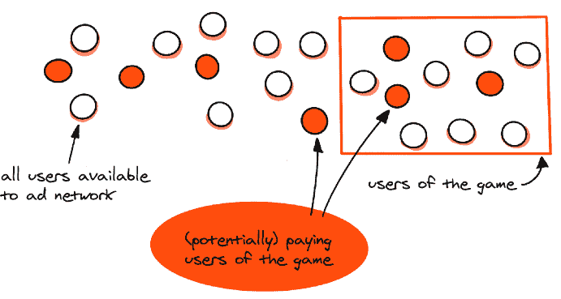
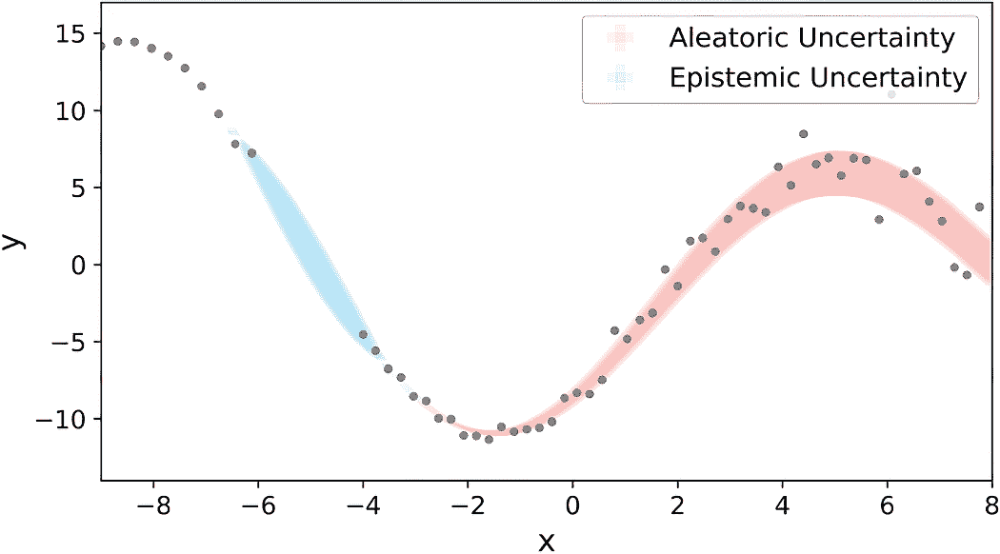

# 6 收集数据集

### 本章涵盖了

+   数据来源

+   将原始数据转换为数据集

+   区分数据和元数据

+   定义多少才算足够

+   解决冷启动问题

+   寻找健康数据管道的特性

在前面的章节中，我们已经涵盖了构建机器学习（ML）系统准备中的固有步骤，包括问题空间和解决方案空间，识别风险，以及找到合适的损失函数和度量标准。现在我们将讨论你的机器学习项目没有它就无法起飞的一个方面——数据集。我们将把它们与我们生活中的重要元素进行比较。就像你需要燃料来启动你的汽车或一顿营养早餐来在忙碌的工作日之前充电一样，机器学习系统需要一个数据集才能正常工作。

有一个关于房地产的古老流行谚语：最重要的是位置，位置，还是位置。同样，如果我们只能选择三个在构建机器学习系统时需要关注的事情，那么这些将是数据，数据，还是数据。计算机科学世界中的另一个经典谚语说“垃圾进，垃圾出”，我们无法怀疑其正确性。

在这里，我们将从寻找和处理数据源到正确处理你的数据集和构建数据管道的工作本质进行分解。作为本章的总结，我们将使用 Supermegaretail 和 PhotoStock Inc.的例子，将数据集视为设计文档的一部分。

## 6.1 数据来源

你可以使用任何来源来寻找数据集的数据。这些来源的可用性和质量将取决于你的工作环境，你公司的传统，以及许多其他因素。首先应该解决什么问题，主要取决于你的机器学习系统的目标。在这里，我们列出了最流行的数据来源或其类别，同时附上现实世界的例子：

+   *全球活动**—*这是一个庞大的数据来源类别，包括任何单一实体中定期记录并持续存储的活动。例如，在股票交易业务中，全球的贸易商在股票市场上采取行动，他们的行动结果（交易和价格）后来对其他各方可用。

+   *物理过程**—*这些是我们正在谈论的全球变化，发生在我们星球上。这些变化可以在各种层面上进行监测，从卫星图像到农田上的微传感器。

+   *外部数据库**—*某些第三方公司通过他们专有的方法和知识收集特定领域的数据而蓬勃发展。如果你需要的数据符合你的需求和标准，你将想要与他们打交道。

+   *本地业务流程**—*这里我们从全球转向本地。业务本身在运营和成长过程中可以产生大量数据。如果你从事电子商务，购买历史可以成为你的主要数据来源。

+   *由专业团队标注**——*您的公司可以雇佣一支专家团队为特定问题生成标签。

+   *由最终系统用户标注**——*这是一种类似的方法，其中公司可能为最终用户提供一个用户界面。在那里，他们将指定您机器学习系统的输入。

+   *人工生成数据集*——这是数据由科学模拟器、渲染环境或其他合成来源创建的地方。使用生成式 AI（例如，图像生成器或大型语言模型）创建的项目也可以归入这一类别。

一些数据源是独特的，能够访问它们可能是一个重要的竞争优势。许多大型科技公司，如谷歌和 Meta，之所以成功，主要是因为它们用于广告定位的有价值用户行为数据。另一方面，其他数据集很容易获取；信息要么可以免费下载，要么可以以非限制性价格（许多数据提供商销售的数据集相对便宜）创建。但这并不意味着便宜等于低质量，因为这完全取决于你需要什么类型的数据。可能结果是这个免费来源恰好完美地符合你的机器学习系统。然而，在这个光谱上也有中间点，但这并不是指价格。在某些地区，数据访问可能受到限制，或者从法律角度来看处于“灰色地带”。成熟的公司倾向于遵守法律（我们也建议您这样做！），而拥有 YOLO 心态的年轻初创公司有时会考虑轻微的违规行为。

一些数据集在丰富或标注/标记后变得有价值。*标注*意味着将原始数据集与适当的标签相结合，或者换句话说，创建一个紧密相关的数据集并将其与一个新的数据集连接起来。这是一种将独特的专有数据集与公共数据源混合，从而得到更有价值的数据集的流行模式。

之前提到的广告技术公司也可以从加入数据集中受益。让我们看看一个经典的例子。一家公司运营一款免费游玩的游戏，这意味着它拥有大量玩家，但只有其中一部分玩家付费。付费客户的人数和名单是保密的，只有游戏的出版商可以访问。同时，它的合作伙伴广告网络拥有数百万个详细用户档案，这些档案来自行为数据。当这些数据集结合在一起（见图 6.1）时，它开辟了一个巨大的营销机会：公司可以将新的广告定位到与其付费玩家相似的可能客户。这种类型的数据交换提高了在线营销的效率，因此是推动现代网络发展的力量之一。

##### 图 6.1 将两个完全不同业务的数据源结合起来，最终可能对双方都有益。

当我们谈论合并数据集时，并不总是像在两个表之间进行 SQL 连接那样简单地将相似数据集连接起来。这里的一个重要概念是多模态，它是一个数据集中各种模态的交集。简单来说，模态是我们接收到的信息的一种类型；对于人类来说，通常将世界描述为多模态（我们听到声音，看到颜色，感受到运动等）。在机器学习相关的文献中，多模态数据集是指结合各种类型的数据来描述一个问题的数据集。想想看，一个正在出售的商品的图片和它的文字描述。将不同来源和模态的数据集结合起来是一种强大的技术。

谈到合并数据源，阿森尼曾经作为顾问帮助启动了一家初创公司。该公司在农业技术领域工作，帮助农民和相关公司提高运营效率，其秘密配方基于数据集。其工作方式如下。一个数据源是公开的，使用 NASA 的 Landsat 和 ESA 的 Copernicus 等几个太空倡议提供的地球卫星图像（你可以获取无数农业用地的图像）。但仅仅拥有这些图像并不能提高初创公司的效率，因为它缺乏描述这些农业用地的信息。主要问题是大多数农业公司缺乏创新，没有关于种植了哪些作物、产量结果等单一可靠的数据来源。这类数据数字化程度较低，但对于多种商业需求来说确实非常有价值：它可以用来减少使用的肥料量，估计食品商品的未来价格，等等。最终，团队实施了智能的方法来收集此类数据并将其与庞大的照片数据库合并。建立在这些联合数据集之上的机器学习系统帮助公司迅速发展。

定义数据源及其相互连接的方式是解决系统数据问题的第一个基石。但原始数据通常几乎毫无用处，直到我们使其对系统和机器学习模型可用，对其进行过滤，并以其他方式进行预处理。

## 6.2 数据集的加工

有经验的工程师知道，在绝大多数情况下，原始数据过于原始，无法有效地进行处理。因此，我们称之为“原始数据”，意味着这是一个混乱编译、无组织的巨大信息块。因此，最初的原始数据集很少处于足够好的状态，可以直接使用。你需要对数据集进行加工，以便以最有效的方式将其应用于你的机器学习系统。

我们已经收集了一份您可以用来正确处理数据集的技术列表，每个技术都在一个单独的小节中介绍。这个列表并不是严格有序的，而且根据您的领域，操作顺序可能会有所不同，因此没有唯一的通用答案。在某些情况下，您可能需要在标记之前过滤数据，而在某些情况下，过滤可能会在整个处理过程中多次发生。让我们简要地探讨这些技术。

### 6.2.1 ETL

ETL，即“提取、转换、加载”，是一个数据准备阶段，例如从外部数据源获取信息并将其结构调整为满足您的需求。作为一个简化的例子，您可以从第三方 API 获取 JSON 文件，并将它们存储为 CSV 或 Parquet 文件到本地存储。

注意：ETL 的高级目标是解决数据可用性问题。

在这个阶段，数据可用性意味着两件事：

+   数据可以轻松有效地用于训练过程（例如，如果目标数据集是来自多个来源的多次交互的结果，了解如何通过单次点击、命令或调用使其可获取是有用的）。

+   数据将在训练阶段和运行时阶段可用。我们目前不关心获取数据是否对推理有效（我们将在第十一章中讨论这个问题），但我们需要保证推理时可以使用相同的数据源。

注意：设计一个有效的 ETL 流程是一门艺术，因为它需要很好地理解各种数据存储和数据处理工具。我们在本书中仅触及了这个话题的皮毛，并建议您查阅其他资料以获得更深入的了解。

这里的重要问题是：“我是否应该在这个阶段关心数据存储和结构？” 这个问题的答案在于以下范围：

+   有时数据集足够小，突然增长多个数量级的可能性极小。这意味着您可以选择几乎任何存储方式（例如，已经在您的组织中积极使用的存储方式，或者您最熟悉的存储方式）。您可能会惊讶地发现，不经验证的 ML 工程师往往倾向于过度设计，例如为具有数千行和数十列的静态表格数据集设计分布式多集群存储。

+   有时从一开始就很明显，您的数据集将会非常大并且会迅速增长，因此在设计数据模型时您应该特别关注。我们不认为自己是这种类型的数据工程的世界级专家，如果您的情况是这样，我们建议您查阅其他书籍。我们最喜欢的关于这个主题的作品是马丁·克莱普曼的《设计数据密集型应用》。

### 6.2.2 过滤

没有数据源是绝对完美的。当我们说*完美*时，意味着数据是干净的、一致的，并且与你的问题相关。在本章开头的故事中，我们提到了提供卫星图像的 API，但公司只需要那些不太多云且与农业区域相关的图像；否则，存储无关数据将显著增加成本。这意味着选择合适的卫星照片的大量初步工作必须作为第一步完成。

数据过滤是一个非常特定领域的操作。在某些情况下，它可以完全基于一组规则或统计自动完成；在其他情况下，它需要大规模的人类关注。经验表明，最终的方法通常位于这两个极端之间。人眼和自动化启发式方法的结合是最佳选择，以下算法是一个流行的方法：检查数据的一个子集（可以是随机选择，也可以基于一些初始洞察或反馈），寻找模式，在代码中反映这些模式以扩展覆盖范围，然后检查更窄的子集。

虽然缺乏数据过滤会导致数据集中出现大量噪声，从而降低整个系统的性能，但过于激进的过滤也可能产生负面影响：在某些情况下，它可能会扭曲数据分布，导致在真实数据上的性能更差。

### 6.2.3 特征工程

*特征工程*意味着以某种方式转换数据视图，使其对机器学习算法最有价值。我们将在本书的后续章节中更详细地介绍这个主题，当讨论到中间步骤时，因为在机器学习系统设计的早期阶段，它很少被详细讨论。在这个阶段，我们倾向于关注如何获取初始数据以构建基线模型的问题，这需要当前阶段一定程度的抽象。

有时特征不是通过手动工程创建的，而是由一个更复杂的模型创建的；与“常规”特征不同，它们可以是不可读的向量。在这些情况下，使用术语*表示*更准确，尽管在某种抽象层面上，它们是同一件事：机器学习模型本身的输入。

例如，在一个以机器学习为核心的大组织中，可能有一个核心团队构建一个模型，该模型可以大规模地生成用户、商品或其他项目的最佳表示。他们的模型并不直接解决业务问题，但应用团队可以使用它来生成满足他们特定需求的表示。当我们谈论图像、视频、文本或音频等数据时，这是一个流行的模式。

### 6.2.4 标注

在许多情况下，数据集本身并不太有价值，但添加额外的标注，在机器学习世界中通常被称为*标签*，却是一个转折点。决定使用哪种类型的标签非常重要，因为它决定了后续许多其他选择。

让我们假设你正在构建一个医疗辅助产品，一个帮助放射科医生分析患者图像的系统。这是医学中非常复杂但仍然非常受欢迎的机器学习应用之一。一个用例可能看起来很简单：医生查看图像并判断是否存在恶性，因此你希望医生对数据集进行标注。

有许多方法可以对其进行标注（见图 6.2），包括

+   *二分类风格*——图像中是否存在恶性？

+   *多类分类风格*——图像中是否存在某种恶性，如果有？

+   *检测风格*——如果存在，图像中包含恶性的区域是什么？

+   *分割风格*——如果存在，图像中哪些像素代表恶性？

##### 图 6.2 数据标注的各种方法

这些数据标注方法需要不同的标注工具和来自标注团队的不同专业知识。它们在所需时间上也有所不同。方法会影响你可以为问题使用的模型类型，最重要的是，它限制了产品。除非你遵循第二章的步骤并收集足够的产品目标和需求信息，否则在这种情况下做出正确的决定是不可能的。

在某些情况下，使用适当的详细程度标注数据几乎是不可能的。例如，可能需要太多时间，可能没有足够的专家来覆盖足够的数据，或者工具集尚未准备好。在这些情况下，考虑使用弱监督方法是有价值的，这些方法允许使用不准确或部分标签。如果你不熟悉这个机器学习技巧分支，我们推荐阅读“弱监督学习简介”（[`mng.bz/75My`](https://mng.bz/75My)）以获得概述；更多阅读链接可在 Awesome-Weak-Supervision ([`mng.bz/mRp2`](https://mng.bz/mRp2))找到。

高效的数据标注需要选择一个标注平台，正确分解任务，编写易于阅读和遵循的任务说明，易于使用的任务界面，质量控制技术，汇总方法的概述，以及定价。此外，在设计说明和界面、设置不同类型的模板、培训和评估执行者以及构建评估标注流程的管道时，应遵循最佳实践。

当需要手动标注数据集时，主要有两种选择：内部标注团队或第三方众包服务。简而言之，前者提供了一种更加控制和一致的标注流程，而后者可以快速扩展标注过程，可能成本更低。选择其中一种方式而放弃另一种的最简单的方法是基于标注的复杂性：一旦需要特定的知识或技能，组建一个内部的专业团队是有意义的；否则，使用外部服务是一个不错的选择。

可用的众包平台有数十个；最流行的大概是亚马逊机械师。由于我们在本书中更注重广度而非深度，我们将不会关注不同平台的功能。相反，我们关注众包标注的通用属性：

+   标注者往往即使在最简单的任务中也容易出错，例如对常见物体的二分类。平台上的大多数标注者为多个客户工作，因此他们很少有机会记住您提供的标注说明的细微差别。因此，应将标注者视为可互换的，并且说明应尽可能简单和非歧义。

+   一些标注者比其他标注者更细心，您可能希望激励他们更多地投入到您的任务中，而不是其他零工。有些标注者可能不够细心或具有对抗性；例如，他们可能会尝试使用生成未经验证标签的机器人，而不是依赖自己的判断。能够区分这两者至关重要。最流行的方法是在标注过程中包含测试。选择一个您对标签有信心的数据集的一部分，并用于标注任务，这样您就可以衡量每个特定标注者的准确性和其他指标。您还可以记录标注过程的某些细节，以获得更清晰的了解。如果标签生成得非常快，这可能是一个机器人或其他非法自动化工具的强烈信号。

+   标注任务应设计成减少众包工作者引起的方差。考虑以下场景：一家公司正在开发聊天机器人，并雇佣标注者来评估响应（问题和几个可能的答案）。这里最直接的评价方法就是要求标注者用一个数字（例如，1 到 5）对每个答案进行评分。然而，这样的标签可能不一致。在这种情况下，一个基本的改进就是引入多个评价标准，以便根据事实正确性、语气等因素单独评估每个答案。这些标签将更加一致，但仍然远非完美。另一个改进是要求进行成对比较。而不是给每个答案分配一个数字，标注者会根据标准（版本 A 优于版本 B/版本 B 优于版本 A/版本 A 和版本 B 相等）进行三元比较。这些标签更容易收集，并且标注者输出之间的预期方差较低。

在 18 世纪，法国数学家和哲学家 Marquis de Condorcet 提出了一个适用于政治学的定理。De Condorcet 揭示了以下观点：如果一个群体需要基于多数投票做出二元决策，并且每个群体成员正确决策的概率为 p > 0.5，那么群体做出正确决策的概率将随着群体成员数量的增加而呈指数增长。这可能是法国大革命初期集体决策的正式原因，而现在，同样的完美逻辑也适用于机器学习系统！

让我们假设我们有三个标注者对同一个二元分类的物体进行标注。这个问题很棘手，所以每个人在 70%的情况下是正确的。因此，我们可以预期三个标注者的多数投票在 78.4%的情况下是正确的（0.7 * 0.7 * 0.7 + 0.3 * 0.7 * 0.7 + 0.7 * 0.3 * 0.7 + 0.7 * 0.7 * 0.3）。这是一个很好的提升！

这些数字应该谨慎解读。Condorcet 的陪审团定理隐含了一些在这里并不完全成立的假设：标注者并不完全独立，他们的错误来源是相关的（这可能是当数据样本嘈杂且难以阅读时的情况）。但即便如此，标注者群体的标注比单个标注者的标注更准确，并且这项技术可以用来提高标注结果。

这个想法可以被修改以降低成本。我们面临的一个算法修改如下：

+   使用两个标注者对物体进行标注。

+   如果他们意见一致，则接受该标签。

+   如果不一致，则增加三个额外的投票，并使用多数投票作为标签。

通过这次修改，更复杂的样本需要更多的投票来保证一致性，而简单情况则需要的投票较少。

这里描述的启发式方法简单但强大。然而，如果你的问题中数据标注是一个关键因素，并且你需要投入一些努力，那么有许多研究致力于更好的设计。我们推荐的一些材料包括“关于众包任务分配的调查”（[`arxiv.org/abs/2111.08501`](https://arxiv.org/abs/2111.08501)）和众包供应商 Toloka.ai 的教程（[`web.archive.org/web/20240309071018/https:/toloka.ai/events/tutorial-wsdm//`](https://web.archive.org/web/20240309071018/https:/toloka.ai/events/tutorial-wsdm/)）。

标注者的一致性和相互同意应该被衡量。虽然机器学习从业者通常倾向于使用常规的机器学习指标来估计它，但那些有统计学背景的人可能会回忆起一个叫做*评分者间可靠性*的概念及其单独的指标集（例如 Cohen 的 kappa、Scott 的 pi 和 Krippendorff 的 alpha 等）。这些指标有助于保持标注团队工作的可靠性，过滤掉不诚实的标签（从而大大提高整体系统性能），并且在某些情况下，为你的模型性能提供一个坚实的上限（回想一下我们在第三章中提到的接近人类水平的表现）。

标注团队需要适当的工具，这可能会提高效率并改善创建标签的质量。如果你选择第三方工具，它很可能会有针对最常见问题的工具集；对于你自己的团队，你需要设置或创建自己的工具。选择现有解决方案或构建全新的解决方案的方面非常特定于领域，尽管一般的方法是：你的问题在机器学习公式中越受欢迎，你找到现代高质量工具集的机会就越大。以一个例子来说，有多个软件解决方案可以用于大规模图像检测的标签创建，但一旦你需要用 3D 多边形网格标注视频，你很可能需要定制化的解决方案。

大型基础模型在标注过程中的最新进展已经成为一个游戏规则的改变者：它们通常可以在几轮设置中收集初始标签，其准确性高于非专家人类标注员。用于大型语言模型标注的工具之一是 Refuel Docs ([`docs.refuel.ai/`](https://docs.refuel.ai/))，它以专注于文本数据而著称；然而，在其他领域（例如，处理像 Segment Anything [[`segment-anything.com/`](https://segment-anything.com/)]这样的通用分割模型或像 LLaVA [[`llava-vl.github.io/`](https://llava-vl.github.io/)]这样的多模态解决方案）时，也可以使用基础模型。

有各种算法技巧可以帮助简化/减少构建系统所需的数据标注方面的努力，但在这本书中我们不会深入探讨这些技巧，因为它们太特定于领域了。我们还想强调的是，在数据标注过程和工具上投入的努力往往可以成为你机器学习系统成功的关键驱动因素。

## 6.3 数据和元数据

当我们构建机器学习系统时，数据集被使用，但在这之上还有一个信息层——让我们用“元数据”这个词来指代它。元数据是描述你的数据集某些属性的信息。以下是一些例子：

+   *时间相关属性**—*这些包括事件发生的时间和它被处理及存储的时间。

+   *来源属性**—*来源属性说明数据是否来自多个来源。

+   *用户属性**—*如果一个用户以某种方式参与了数据集的生成，这种情况并不少见，他们的元数据就变成了相关数据样本的重要元数据。

+   *版本**—*如果数据被处理，了解参与处理软件的版本可能是有用的。

元数据对于数据流至关重要，并保证了它们的连续性。让我们回到之前的医疗应用场景。想象一下，一家公司雇佣了 10 名医疗专业人员为你的系统标记数据。经过一年多的工作，他们终于标记了一个大数据集。突然，你收到一封邮件：其中一名标记者被发现是骗子，他的文凭是假的，他的执照已被吊销。这是一个不可接受的情况，因为数据的一个有形部分可能被认为不可靠，这会危及整个数据集。因此，你采取了唯一合适的解决方案，即立即停止在模型中使用他的标记。虽然这个例子有些夸张，但你的系统中随着时间的推移可能会出现许多不那么严重的问题。数据源问题、监管干预和尝试解释模型错误将使你定期参考元数据。

正如我们之前讨论的，虽然数据集的配方可能不同，但你的数据集很可能会被正确处理。揭示问题的新的方面，从而随着时间的推移调整数据集结构，并在处理数据集的方式中相应地反映出来，这是可以的。所有这些差异都应该反映在元数据中。

另一个变化来源是测试和错误修复。想象一下，你为一家共享出行公司工作，需要解决从 B 点到 A 点需要多长时间的问题。你从公司生成的历史数据开始，有一个预处理作业从日志中提取信息并将其存储在你最喜欢的数据库中，所以你最终得到一个像`latitude_from`、`longitude_from`、`datetime_start`、`datetime_finish`、`distance`、`data_source`这样的表格。

在某个时候，公司收购了一个竞争对手，你决定将其数据添加到你的 ETL 流程中。团队中的新工程师开始编码，新的来源被附加，新的数据点以相同的模式添加到你的数据集中，突然你的模型性能下降。发生了什么？

快进：你的公司在存储距离时使用千米，而收购的团队使用英里。处理集成的工程师知道这一点，并为新的数据源实现了英里支持，但意外地也为旧的数据源启用了它。因此，新的数据样本对于新的数据源是正确的，但对于旧的数据源则不是。如果你有一个像`preprocessing_function_version`这样的元数据字段，你可以轻松地找到受影响的样本。如果没有，你需要在发现代码缺陷后从头开始收集数据集。

这种缺陷并不是唯一可能需要揭示数据样本来源日期的场景。一些机器学习系统可能会影响数据来源，产生一种称为*反馈循环*的现象。反馈循环的一个非常常见的例子是推荐系统：假设一个市场销售许多商品，网站上有“你可能也感兴趣的商品”这样的板块。作为一个简单的基线，公司可能会放入最受欢迎的商品。但是当这个基线被机器学习系统取代时，新的商品会出现，而旧的商品领导者会失去其受欢迎程度，转而被新的推荐商品所取代。这种系统的设计不佳，可能会让一些并不那么好的商品在热门商品中占据一席之地，并长期占据主导地位。存储样本生成时的信息和当时活跃的相关系统版本至关重要（尽管还不够！）以避免反馈循环。

与元数据相关的一个重要场景是*分层*，这是一种数据抽样过程，它塑造了各种子组的分布。例如，假设一家公司在国家 X 开始运营，收集了大量与 X 国客户相关的数据。后来，公司进入了一个新的市场 Y，并希望为两个国家的客户提供相同水平的服务，包括机器学习模型的准确性。这需要在训练和测试数据集中以适当的平衡来表示 X 和 Y 国的客户。

分层对于验证设计和抵抗算法偏差至关重要，这两个主题将在未来的章节中讨论。

## 6.4 需要多少数据才算足够？

在我们讨论了数据集的重要性之后，缺乏经验的机器学习从业者可能会认为，建立一个可以流式传输大量样本的数据管道就足以构建一个良好的系统。嗯，这就是我们无法自信地说是或否的地方。

首先，并非所有数据样本都具有同等的重要性。增加数据集的大小只有当新的对象有助于模型学习与问题相关的新知识时才有用。添加与现有样本非常相似的数据样本是没有意义的；对于极其嘈杂的数据也是如此。这就是为什么有一个流行的研究方向是寻找数据集扩展的最优样本，称为*主动学习*。最简单的直觉是，通过添加模型错误的样本（这种信号通常通过人工在循环处理中获取）或表现出最低置信度的样本来丰富数据集。学术界已经开发了与主动学习相关的数十种方法；有关更多信息，请参阅最近的调查（例如，Xueying Zhan 等人撰写的“深度主动学习比较调查”，[`arxiv.org/abs/2203.13450`](https://arxiv.org/abs/2203.13450)）。

与数据集大小相关的一个更多方面是*采样*。虽然大多数情况下我们问自己的问题是“我们如何获取更多数据？”，但有时问题是“我应该使用数据集的哪一部分来提高效率？”这种情况通常发生在数据集不需要手动标记且由定义的过程生成时——例如，在流行的 B2C 网络服务（搜索引擎、市场）中的点击流。

当数据集不仅巨大，而且往往不平衡和/或可能包含大量重复项时，采样是有效的。这里可以适用不同的策略，其中最常见的是基于分层的方法，即根据关键特征或算法定义的簇将数据分成组，并限制每个组使用的数据量。这些数量不必相等——例如，如果时间成分与你的问题相关，你很可能希望优先考虑新鲜数据而不是旧组。

另一点是关于*数据噪声*。不久前，机器学习社区中有一个强烈的共识，认为几个干净样本比多个噪声样本要好。然而，最近情况发生了变化；像 GPT-3 和 CLIP 这样的大型模型的进展表明，在某个规模上，手动过滤几乎是不可能的（处理 5000 亿个文本标记或数百万张图像将花费巨额资金），但使用大量弱监督或自监督（自动使用启发式方法）的数据是有效的，因此对于某些任务，大量不完美的数据集比小量精心挑选的数据集更适合。

备注：虽然训练数据中存在一些噪声是可以接受的，但在验证/测试数据集中，这要低得多。我们将在第七章中详细讨论。

你可能期望模型的性能随着数据集大小的平方根而渐进地提高，无论使用什么指标。这种估计非常粗略，并不一定完全符合你的问题，但它可能给你一些直觉（见图 6.3）。

并非每个模型都可以通过添加新数据来改进，因为其来源的不确定性。不确定性主要来自两个核心来源：

+   知识或信息缺乏（称为*认识不确定性*）

+   在给定数据本身中发现的*随机不确定性*（也称为*随机不确定性*）

随机不确定性主要源于数据中存在的复杂性，如重叠的类别或加性噪声。数据不确定性的一个关键特征是，无论收集多少额外的训练数据，它都不会减少。

##### 图 6.3 展示了一个真实项目中模型指标随数据集大小变化的图表。每条线都展示了目标指标在数据集大小增长时的动态变化。

另一方面，当模型遇到训练数据覆盖薄弱或超出训练数据范围的区域时，就会发生认知不确定性（参见图 6.4）。

##### 图 6.4 随机不确定性和认知不确定性之间主要差异的示意图（来源：“基于深度学习的分子性质预测的可解释不确定性量化”由 ChuI Yang 和 YiPei Li 撰写，[`mng.bz/n0ZV`](https://mng.bz/n0ZV))

一旦你收集了一些数据并形成了一个训练管道（详见第十章），它就解锁了做出关于你需要多少更多数据的知情决策以及估计新数据的经济效率的选项。当与昂贵的数据（例如，由高度熟练的专业人士标注的数据）一起工作时，这尤其合理。一个高级算法如下：

+   将数据集分成桶，使得桶的大小接近均匀，并且不同桶之间的样本相似性最大化。这样，每个用户的样本都流向由用户 ID 确定的相同桶（这使我们回到了之前提到的分层方面）。

+   如果适用，固定计算预算。无论数据集的大小如何，你都要为 N 个批次训练模型。

+   在从数据集的一小部分到全部的数据子集范围内训练模型，确保使用的子集是累积的（例如，如果在训练 10%的子集时使用了样本 X，那么它必须在 20%、30%等情况下使用）。

+   计算每个训练模型的键指标，并使用数据集大小作为水平轴，指标本身作为垂直轴绘制图表。

+   通过一些想象力的激发，推测还需要多少数据才能使指标变化再增加 1%。

这个指标的精度较低，并且没有考虑系统性的方面（例如，第十四章中我们将讨论的概念漂移），尽管即使这个精度对于做出关于我们应该在数据标注管道中投入多少的重要决策也是至关重要的。

## 6.5 鸡生蛋还是蛋生鸡的问题

你在数据集方面可能遇到的最困难的问题之一是一个冷启动问题（也称为鸡生蛋还是蛋生鸡的问题）：当你需要数据来构建系统，但数据直到系统启动后才可用。陷入这样一个可怕的循环是多么可怕啊！

这通常是初创公司或试图在新的市场或垂直领域推出产品的公司遇到的问题。在机器学习世界中，常见的解决方案是近似。由于我们没有与我们的问题完美匹配的数据，我们需要找到尽可能接近的数据。哪些数据会接近取决于问题，让我们看看一些例子。

在这个例子中，让我们想象一家专注于员工安全的公司，该公司生产的产品用于监控工人在各种环境中的安全规则遵守情况。新产品应检查工厂地面上是否佩戴了安全帽。当产品可用时，将会有大量来自同意分享数据的客户的数据，但在那之前，公司的客户摄像头是不可用的。

那么，我们如何解决这个问题呢？

+   *方法 1*—让我们使用计算机图形世界。我们取一叠 3D 人体模型，并在工厂背景上渲染它们，有的戴帽子，有的不戴。

+   *方法 2*—让我们使用公共来源。我们在公共来源（从谷歌图片到图片库）中寻找相关的图片，并抓取或购买它们。

+   *方法 2.5* *(混合)*—让我们进行交叉：我们从工厂中取一些人的照片，并在其中一些照片上绘制/渲染帽子。

+   *方法 3*—让我们尝试表演！你的团队购买安全帽，去一个废弃的工厂，并戴着帽子进行一次拍照。

+   *方法 4*—让我们偷懒。我们找到一个公共数据集，其中人们戴着非常相似的帽子，但户外，在建筑工地上——不太近，但仍然有。

+   *方法 5*—让我们构建一个非常简单的基础线，没有实际机器学习在幕后，并将其建议给客户以打破循环。这样一个基础线的例子可能是使用现有的面部检测器找到人头，然后裁剪这些面部，并添加一个简单的启发式方法尝试定位帽子（例如，一个明亮的封闭块）。

+   *方法 6*—如果可用，我们将集成一个大型供应商提供的解决方案。如果从法律角度来看，可以重用供应商的标签，这个选项将工作得更好。然而，代理供应商的输出可以为你提供具有自身价值的初始未标记数据。

这些例子可能并不总是合理和适用的，但它们代表了解决这个问题的几种方法：

+   生成合成数据

+   使用类似情况下的可用数据

+   手动创建数据

+   从类似问题中获取数据并尝试调整

+   使用虚拟基线模型或第三方进行启动

我们应该指出，并非每个场景都适用于每个问题。显然，你不会用脑部扫描的图像来构建用于肺癌检测的医疗系统，而一个天真的基线作为医疗顾问是完全不合适的。但是，使用相同设备从其他医院获取扫描数据可能是一个值得考虑的好主意；虽然每个扫描仪的校准可能略有不同，但它们一起可以提供一些泛化（在 A、B 和 C 医院的数据库上训练的模型可能对 D 医院也很有用）。在尊重的公众公司中，很少会批准抓取其他网站，尽管这在小型初创公司中是一种流行的技术。通过简单的渲染管道获得的合成图像通常不是最佳选择，因为它们不够真实（不完美的光照、阴影等）。但是，通过一些秘密配方，你可以使它们变得逼真。在论文“MobilePose：具有弱形状监督的未见物体实时姿态估计”（Hou 等人，2020 年，[`arxiv.org/abs/2003.03522`](https://arxiv.org/abs/2003.03522)）中，研究人员在增强现实记录上渲染了物体（使用准确估计的光照），从而使图像更加逼真，因此对模型更有价值。

在任何情况下，我们都需要记住，当系统上线时，数据并不是我们所要处理的实际分布的代表样本。这意味着验证结果应该持保留态度，用更现实的样本替换这样的代理数据集是首要任务。在讨论健康数据管道的特性时，我们再详细讨论这个问题。

## 6.6 健康数据管道的特性

数据收集和预处理需要具备三个重要特性：

+   可重现性

+   一致性

+   可用性

让我们逐一回顾这些特性。

可重现性意味着如果需要，你应该能够从头开始创建数据集。在你的存储中不应该有由一位聪明的工程师用一点黑暗魔法制作出来的“金数据文件”。但必须有一个软件解决方案（一个简单的脚本、更高级的管道或大型系统），允许你使用与之前相同的来源重新创建这样的文件。这个解决方案需要得到良好的文档和测试，以便每个项目合作者都能在需要时运行它。

可重现性的推理与 DevOps 社区中流行的基础设施即代码范式类似。是的，最初手动创建初始数据集可能看起来更容易，但从长远来看，它并不具有可扩展性，并且容易出错。下次——当准备添加新批次数据时——你可能会忘记运行预处理步骤，从而导致隐式数据不一致，这是一个难以检测的问题，会影响整个系统的性能。

一致性本身是关键。机器学习问题通常存在标签部分不明确的情况，定义一个严格的分离平面是不可能的。在这种情况下，进行标签的专家往往意见不一致。

来自我们背景的一个非常典型的例子与信用卡交易分类问题相关。客户被期望为每一笔交易提供一个标签，描述支出的目的。初始的标签分类包括“食品和饮料”、“酒吧和酒庄”和“咖啡屋”。一个修辞问题出现了：在一家酒吧订购咖啡和三明治的支付，哪个标签更合适？这个例子的一个部分解决方案可能是制定某种协议来决定如何打破平局以及如何解决模糊的边界（例如，“当商家类型和购买物品类型冲突时，首先打开的优先”）——这极大地简化了模型训练，特别是验证。

一致性不仅关乎标签。数据的各个方面都应该是一致的：数据的来源是什么，数据是如何预处理的，应用了哪些过滤等。当系统在一个小型公司内部构建时相对容易，而对于跨国公司来说则更具挑战性，一些正式的定义可能会有所帮助。一旦你感觉有可能误解数据管道中使用的核心术语，将其添加到设计文档中可能是有用的，以确保整个团队在同一个页面上。

一致性的另一个方面是在系统构建阶段数据的收集方式和系统使用期间的系统输入。这是一个常见问题，在机器学习的术语中，它导致分布不匹配，这是一个影响模型性能和公平性的问题，在系统上线之前很难检测到。

我们最近提到了反馈循环现象——模型影响数据来源，从而违反了一致性假设。我们也描述了数据在系统启动后才可用的情况，这也可能导致不匹配。这类问题仍然是应用机器学习中最具挑战性的方面之一，在设计系统时你永远不能忽视它们。

数据一致性始终是一个开放性问题，因此在机器学习系统开发的每个阶段，从最初的草稿到长期的维护，你都应该关注它。我们将在第十四章讨论监控和漂移检测时回到这个方面（甚至会有一个来自我们朋友的一个简短但相当酷的篝火故事）。

最后但同样重要的是可用性。这个属性实际上涵盖了两个想法：系统的可用性和工程师的可用性。第一个也可以称为*可靠性*；系统设计者应该对不可靠的数据源非常批判。这里是一个很好的负面例子——事情最终可能会出错。想象一下，一个依赖于第三方 API 丰富你的数据流的系统，一切都很顺利，直到它不再顺利——一个为 API 提供动力的公司失去了其关键站点可靠性工程师，因此无法处理基础设施。如果你的系统对这个数据源的依赖是关键的，他们的问题就变成了你的问题。

当然，这并不意味着使用第三方 API 不是一个选择。正如我们之前提到的，使用外部解决方案通常是一种好做法——不仅由像亚马逊、谷歌和微软这样的巨头提供。但数据可用性很重要，这些风险应该被认真考虑。有些服务提供商提供的服务可能不太可靠（我们无法想象一个由实验性可视化工具故障引起的高优先级问题），但数据源不是其中之一。

同样的哲学也适用于内部系统（例如，由其他团队中的同事控制的系统）。外部和内部系统有不同的控制齿轮：对于前者，使用服务级别协议来评估风险，而内部系统仅存在于成熟组织中。同时，在较小的公司中，与维护系统的团队保持一致并有效降低相关风险更容易。

值得注意的是，与数据可用性相关的问题并不严格属于软件相关。即使所有相关系统都得到适当的构建和维护，也可能存在更复杂起源的问题——例如，由信息安全和个人隐私权（例如影响使用个人数据的新法律法规或你的关键客户 CEO 的决定，即他们的数据不应再离开他们的基础设施）引起。

工程师的可用性可能被高估：你可能会听到类似这样的话，“来吧，即使这不是一个简单的操作，我们的工程师也能获取数据——他们是专业人士，如果有的话，会处理技术难题。”很可能是真的——我们假设我们的读者和他们的同事都是杰出的专业人士，但你不能忽视时间限制。想象一下，一个工程师和他的另一个团队的伙伴一起去吃午餐；他们讨论了与工作相关的事情，喝了一杯咖啡后，一个与当前感兴趣的系统相关的新假设突然出现。

如果数据容易获取，你可以通过拉取数据集、汇总一些统计数据，甚至运行基本实验，相对快速地做出信息丰富的决策。如果第一个简单的方法得到证实，它可以被优先考虑，这意味着应该分配更多资源。谁知道呢，这可能会在未来带来重大的改进。

否则，如果拉取数据和做出数据驱动的决策耗时，那么假设很可能会被忽视（“嗯，这可能很有趣，但我有很多事情要做，找到数据会花费很长时间！”）。为了避免这些情况，我们建议将一部分工程努力投入到构建工具中，使数据集对应该使用数据的人更容易获取。虽然这适用于任何工程生产力工具，但当工具提高数据可用性时，投资回报率尤其高。正如我们一开始所说的，很难高估高质量数据对机器学习系统的重要性，因此平滑与数据集的交互是长期的良好投资。

在本书的这个阶段，关于一致性和可用性的信息已经足够深入。我们将在第十章中更详细地讨论这两个管道属性。同时，现在是时候进入本章的实践部分：设计文档。

## 6.7 设计文档：数据集

当我们描述数据问题的步骤时，它自然地引导我们回答设计文档中需要回答的额外问题。以下是我们建议在这个阶段问自己的问题清单。

+   ETL：

    +   数据来源是什么？

    +   我们应该如何表示和存储我们系统的数据？

+   过滤：

    +   好的和差的数据样本的标准是什么？

    +   我们可以预期哪些边缘情况？我们如何处理它们？

    +   我们是自动过滤数据还是设置手动验证的过程？

+   特征工程：

    +   特征是如何计算的？

    +   表示是如何生成的？

+   标签：

    +   我们需要哪些标签？

    +   标签的来源是什么？

如同经常发生的那样，回答这些问题可能会产生更多问题。给自己自由去思考这些问题。在机器学习系统设计中，投入时间回答与数据相关的问题总是有出色的投资回报。

### 6.7.1 超级大零售的数据集

现在，让我们回到准备设计文档。这次我们正在准备一个专门针对我们虚构公司数据集的部分。像往常一样，我们将从超级大零售开始。

#### 设计文档：超级大零售

#### III. 数据集

数据集的原子对象是一组（日期、产品、商店），我们旨在预测的目标变量是销售的单位数。

#### i. 数据来源

我们可以利用多个数据来源来实现我们的目标。

#### 内部来源

+   *购买历史数据（即，交易历史）*是从 Supermegaretail 连锁店收集的，并保存到集中式数据库中。它将成为我们的*主要真实来源*：销售数量、花费的金额、应用的折扣、交易 ID 等。

+   *库存历史*是我们问题的第二个重要真实来源，因为它直接决定了每个商店可以销售多少个产品单位。这个来源可以帮助估计每天开始时有多少产品可供销售，以及有多少已经过期并被撤出销售。

+   *每个产品、商店和交易的元数据*。

+   计划的*促销活动*日历。这是一个影响未来销售的重要因素，肯定需要考虑。

#### 外部来源：手动收集的数据

+   *价格监控*。从我们的竞争对手那里收集的价格和其他产品信息。他们每天从不同竞争对手的子集中手动收集。这可能是由我们内部团队或第三方（外包）完成的。也可以采用混合方法。每个产品也应包含一个全球产品标识符（条形码），这样我们就可以轻松地将收集到的数据与我们的产品匹配。了解汇总的竞争对手价格及其动态有助于我们了解市场正在发生什么。

#### 外部来源：购买数据

+   *气象服务购买的历史和预测天气*。天气是直接影响消费者行为的一个重要因素。

+   *顾客流量*估计（来自电信提供商）。

+   *全球市场指标*。

#### 移动应用和网站数据（可选）

+   Supermegaretail 有一个*配送服务*（即使它产生的收入不到 5%）。我们将收集关于特定地点特定销售的*额外数据*。有时这些信息可以是一个有价值的预测因素。

+   此外，移动和网站服务收集关于用户活动的隐式反馈，包括查看、点击或添加到购物车，这些也可以预测实体店的销售额。

#### ii. 数据标注

由于我们处理的是一个需求预测问题，我们不需要直接从交易历史中派生的额外数据标注。

#### iii. 可用元数据

我们根据每个商店级别的 SKU 进行需求预测，有三个关键要素：产品、商店和交易。

#### 产品

+   产品 ID 和条形码。

+   不同级别的类别代码（1，2，3）。我们可以使用类别层次结构来对产品之间的相似性进行基于规则的测量。此外，其他分类信息，如品牌、制造商或定价组。

+   储存期限，它决定了过度预测该产品销售的糟糕程度。

+   产品被添加到连锁店组合矩阵中的日期。

+   产品的尺寸和重量。

#### 商店

+   店铺 ID。

+   位置（坐标），在第三方来源的支持下——我们可以用它来添加有关天气、人流、到关键点的距离以及其他相关事项的信息，如城市、地区和相关的物流中心。

+   最接近的竞争对手的商店（包括它们的 ID 和距离）。

+   商店的大小及其格式。它们决定了在这个商店的品种中会有哪些产品和多少独特的商品。

+   商店开闭的日期。

#### 交易

+   *时间戳*。这使我们能够通过添加诸如假日等信息来丰富数据集。

+   *客户 ID*（如果使用了忠诚度卡）。尽管数据集的最终单元是（产品，商店），但可以捆绑（客户，产品）用于单独的数据管道，通过聚合交易到一个用户-项目矩阵及其分解来计算产品嵌入。嵌入将包含购买行为模式。

+   *商店 ID* 和 *产品 ID*。

#### iv. 可用历史

对于 Supermegaretail 来说，需求预测并不新鲜。关键的 ETL 流程已经到位。Supermegaretail 已经收集了超过 3 年的数据。

这个历史对于我们的预测模型学习模式、捕捉销售的季节性、估计趋势等至关重要。同样适用于产品和商店元数据。天气数据（我们从外部来源获取）在过去一段时间内一直可用，只要我们需要。

股票历史和促销活动也已收集。

竞争对手的价格监控数据已经收集了两年。

#### v. 数据质量问题

交易、库存和促销数据可能包含缺失或重复的值，因此在聚合之前需要额外的过滤或预处理。

我们购买的外部数据在到达我们这里之前已经过清洗并通过了某些质量控制。然而，需要实施必要的检查。

竞争对手的价格覆盖了大约 25%的 SKU，存在差距。

#### vi. 最终 ETL 管道

最高级方案如下：

1.  交易数据是按日汇总的。

1.  新汇总的分区被添加到交易汇总表的表中。

1.  （可选）我们不仅重写了最后一天，还重写了前 2 到 3 天，以修复数据中可能存在的损坏（重复、不完整数据、重复数据等）。

1.  我们根据数据、产品 ID 或商店 ID 将其他内部/外部数据源合并。

1.  最后，我们根据合并后的数据集计算特征。

如果需要，我们可以添加一个产品嵌入的数据管道，如第 III 节所述。

### 6.7.2 PhotoStock Inc.的数据集

现在让我们切换到 PhotoStock Inc.的设计文档。

#### 设计文档：PhotoStock Inc.

#### III. 数据集

#### i. 数据集和来源

可以用于为 PhotoStock Inc. 搜索引擎收集信息的潜在数据源之一是库存库中每张照片相关的数据。这些数据可能包括与照片相关的标签、标签和描述等信息，这些信息可以为照片内容提供有价值的背景。此数据集还应包含实际照片的 URL 和我们使用的缩略图的 URL。我们建议将此数据集命名为“描述数据集”。

另一个潜在的数据源是用户提交给 PhotoStock Inc. 平台上的搜索查询。这些查询可以提供关于用户正在寻找的图片类型的洞察，并可用于帮助指导机器学习模型的发展。当与用户点击相结合时，它们提供了关于相关性和用户兴趣的强烈信号。此数据集的扩展可能包含有关这些点击相关的会话的进一步信息：用户在照片页面上花费了多长时间，以及他们之后是否购买了该照片？我们建议将此数据集命名为“点击数据集”。

此外，我们可以雇佣标签员手动为查询和图像对分配相关性评分。标签员将获得一组搜索查询和 PhotoStock Inc. 库中的一组图像选择，并要求根据图像与查询内容匹配的紧密程度为每个查询-图像对分配相关性评分。最初，查询-图像对应从过去用户查询和库存库中可用的照片池中随机选择；然而，以后可以改进，涉及一些主动学习方法，并为模型不太自信或容易出错的对提供信号。我们建议将此数据集命名为“标签数据集”。

我们可以考虑一些公共文本/图像数据集（例如，COCO—Microsoft Common Objects in Context）用于模型启动。然而，鉴于有用户交互的坚实历史，使用我们自己的数据应该没问题，而公共数据集将仅间接使用——我们可以从在这些数据集上预训练的模型开始。

描述和点击数据集是通过 PhotoStock Inc. 业务的主体流程自然生成的。因此，目前我们不需要过多关注，除了构建适当的 ETL 流程和存储。由于标签数据集需要雇佣标签团队或使用第三方服务，因此需要为其分配专门的预算。

#### ii. 元数据、过滤和子采样

由于照片描述由内容质量团队审核，因此预期描述数据集将足够干净，因为他们的质量已经是我们的产品核心部分。点击数据集可能会因为用户行为的不同模式和爬虫的存在而嘈杂；我们需要提出启发式方法来处理这些问题。包含购买数据的扩展版本可能不太嘈杂，但考虑到点击到购买的转换率，它也可能小得多。考虑到这些方面，我们预计点击+购买和标签数据集对于验证更有价值，而描述和没有购买的点击数据可能更嘈杂，因此更适合用于训练。

为了解决过滤过程中出现的质量问题，我们应该注意元数据。描述数据集应该标注卖家信息和变更日期；点击数据集应该标注用户信息、点击项卖家信息和额外的搜索会话信息。在这个阶段，没有必要聚合所有关于用户和卖家信息。这可能是进一步的特征工程步骤的一部分，但至少我们需要确保存储`相关用户 _id`、`卖家 _id`、`会话 _id`和`购买 _id`，以保持将来使用这些数据的能力。

考虑到 PhotoStock Inc.的搜索和购买量，我们可能不需要为了纯粹的技术需求进行额外的子采样；可以处理完整的数据集。然而，我们可能需要运行子采样来调整类别平衡：点击的物品比购买的物品多，搜索结果页面显示的物品比点击的物品多等。

#### iii. ETL 和数据准备

训练数据应该定期（目前为每日）以批量方式获取。我们建议使用 Flyte 框架来编排任务，因为它已经是 PhotoStock Inc.中其他批量任务的首选框架。

这里不需要任何花哨的东西——只需从生产数据库中收集数据，并以 Parquet 文件的形式单独存储，以便于读取即可。目前我们预计不需要进行复杂的预处理。

#### iv. 标注

我们不清楚应该优先考虑哪个平台进行人工标注；是否应该使用内部团队（例如，我们的客户支持和审核团队）或雇佣第三方服务也是一个悬而未决的问题。这个问题需要与这些团队经理一起解决。此外，我们还应该从一些第三方服务中获得成本估算，以比较内部标注与他们的成本。

我们需要标注（查询，图像）对，并将它们分为三个类别：

+   相关

+   不相关

+   无法回答

我们应该准备好将“相关”细分为“非常相关”和“有些相关”，以获得更高的粒度；对于“不相关”也是如此。至于“无法回答”，我们需要要求标注者输入他们无法标注的原因——标注的早期迭代可以为我们提供关于数据集的新见解。

## 摘要

+   不要仅限于使用单一的数据源。确定你是否拥有足够内部来源，或者是否需要超出你业务生态系统的范围来扩展你的搜索范围。

+   访问独特的数据集可以给你带来显著的竞争优势。反过来，如果处理得当，易于获取的数据集也能带来巨大的价值。

+   在处理数据集时，不要忽视元数据，这对于数据流至关重要，并保证了其一致性。

+   请记住，在准备数据集时没有严格的技巧顺序。操作的最后顺序将取决于你系统的业务目标、你所在的领域和其他因素。

+   避免将数据集填充与已存在的样本相似的样本。相反，应该填充那些模型未能正确工作的样本。

+   在运行系统之前，确保你有可以喂给系统的数据。

+   记住，数据管道必须满足三个标准：可重复性、一致性和可用性。
