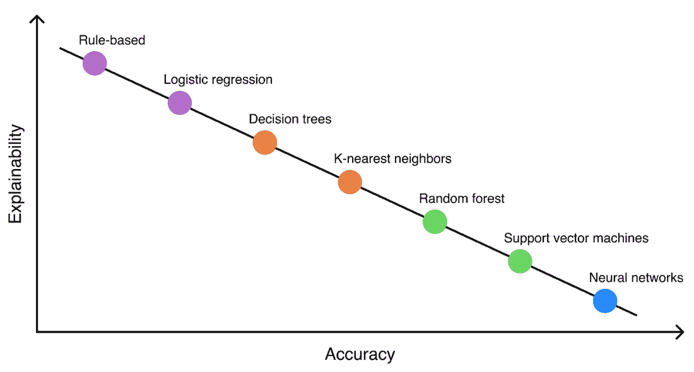
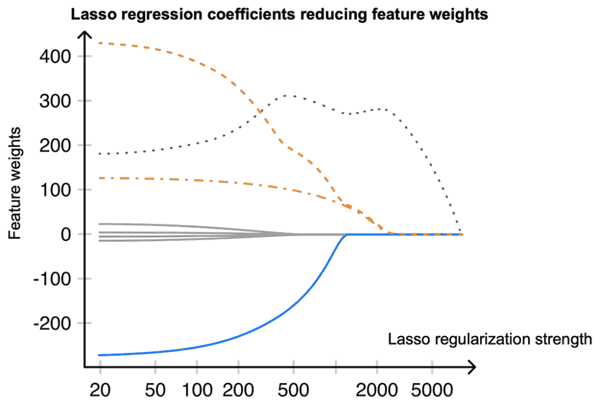
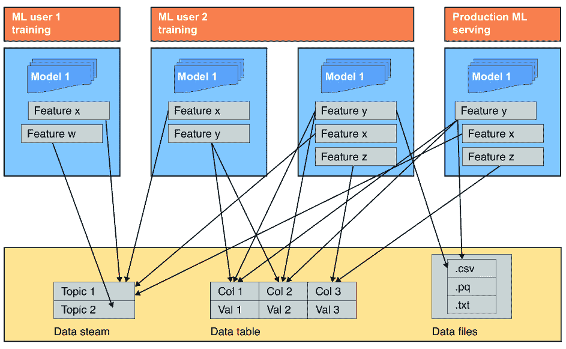
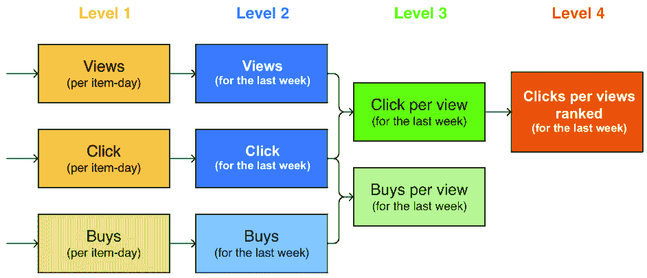

# 11 特征与特征工程

### 本章涵盖

+   特征工程的迭代过程

+   分析特征重要性

+   为您的模型选择合适的特征

+   特征存储的优缺点

人们常说，一个具有出色特征的平庸模型将优于一个具有糟糕特征的出色模型。根据我们的经验，这个说法再正确不过了。特征是您系统的关键输入；它们驱动您的算法，为模型提供基本模式，并为学习做出预测所需的数据提供营养。没有好的特征，模型就是盲目的、聋的、哑的。

虽然在以深度学习为核心设计的系统中，特征工程的作用并非至关重要，但任何机器学习（ML）从业者都不能忽视其作用。从某种意义上说，将一些复杂的多模态数据框架化为深度学习模型，甚至为大型语言模型制作提示，都是特征工程的一种特定方式，这就是为什么经典的特征相关技术，如特征重要性分析，仍然非常相关。

本章探讨了创建有效特征的艺术和科学。我们将介绍帮助确定系统最有价值特征的工具，我们可能面临的工程挑战，在选择合适的特征子集时应该考虑的因素和权衡，以及如何确保所选特征是可靠和健壮的。

## 11.1 特征工程：你是谁？

特征工程是一个迭代的过程，涉及创建和测试新的特征或转换现有特征以提高模型性能。这个过程需要领域专业知识、创造力和数据工程技能来为系统构建新的数据管道。鉴于其耗时和迭代的特点，特征工程通常会消耗掉分配给建模的大量资源。

为了确保建模过程富有成效且流程顺畅，您在设计系统时始终应确保制定一个有效的特征工程策略。这个计划将成为一个指南，引导团队在识别和工程最具影响力的特征的同时，最大限度地减少浪费努力的风险。通过优先考虑适当的迭代顺序并规划路线，我们可以避免潜在陷阱并确保我们的行动为最终目标增加价值。

机器学习中的特征工程类似于在生成模型中构建提示结构，例如大型语言模型和文本到图像生成器。特征和提示都作为增强输入，引导模型的“注意力焦点”（字面或比喻）转向最相关的数据方面。

注释：通过开发适当的特征和提示，我们向模型注入一个特定的视角、上下文或“归纳偏差”，使其倾向于特定的结果。尽管它们的性质不同，特征和提示有一个共同的目标，即用我们的领域知识来上下文化模型，并指导它朝着我们希望实现的结果发展。

当谈到强大的深度学习模型时，在音频和图像处理等特定领域，特征工程曾经是一个复杂的问题。然后深度学习革命发生了，其从业者感到非常高兴，因为他们现在可以委托给一个端到端训练的深度学习模型，而不是工程无尽的、几乎不可靠的特征。甚至有机器学习从业者从未在研究项目之外进行过特征工程！这种趋势可以解释为一种信号，表明我们可以安全地跳过这一章。然而，我们认为即使是基于深度学习的管道也可能从特征工程和相关技术中受益。一个很好的例子来自阿尔申尼的经验。

##### 阿尔申尼的篝火故事

我曾经在一个机器学习系统中工作，该系统内部有一个深度学习模型。该系统会接收一个图像，用深度学习模型处理它，并应用无机器学习的后处理来输出一个特定的数字。然而，第一步中存在的不准确性极大地影响了最终结果，由于性能不佳，该系统被认为不适合生产。由于严重的数据限制（该系统必须在几样本设置中工作——这是一种正式的说法，即模型应该只使用每个类别的几个标记样本就能发挥作用），改进第一个组件非常困难。但最终拯救了这一天的技巧是一个简单的回归模型，它细化了最终输出。多亏了利用手工制作的特征，模型并不那么需要数据。因此，深度学习用于重负载工作，而简单的基于特征的模型用于归纳偏差的组合，足够强大，足以使系统适合生产并最终被积极使用。

### 11.1.1 优秀和不良特征的准则

让我们分解一些特征特性以及我们应该注意的权衡：

+   **模型的性能**——特征应与业务问题一致，并捕捉数据的相关方面，以提供与目标变量的有意义的依赖关系。与领域专家合作有助于开发正确的特征集，以及生成新的特征。当涉及到特征重要性分析时，它有助于精确评估给定特征的贡献，并深入了解哪些特征使我们更接近项目的目标。

+   *历史数据的数量**—*有限的历史数据可能导致缺失值，降低数据集的整体质量。通过一次性的数据工程努力回顾性地重新创建缺失数据似乎是一个不错的解决方案，但并不总是可行。另一方面，缺乏足够的历史数据可能阻止预测模型捕捉特征值中的趋势和季节性。

+   *特征数量和质量之间的权衡**—*虽然拥有更多特征可以提高机器学习模型的预测能力，但过多的无关或冗余特征会导致过拟合，并最终降低性能。我们总是更喜欢模型专注于一小组强大且多样化的特征，而不是分散其关注于许多生成的和相关的特征。

+   *可解释性和可说明性**—*在设计特征时，这些是必须考虑的关键因素。虽然复杂的特征可能提高模型的表现，但它们也可能降低可解释性，使得解释预测背后的推理变得困难。另一方面，简单的特征可能更易于解释，但它们只能捕捉到数据中的一部分细微差别。在可解释性和性能之间取得平衡是至关重要的，并且可能因特定系统和领域而异。

+   *特征的开发复杂性**—*复杂的特征可能需要更多的时间来开发。它们可能依赖于其他特征和复杂的数据管道，或者依赖于新的数据源，这使得它们的实现和维护更具挑战性。它们需要更多的数据工程努力来创建和维护数据管道。因此，仔细考虑每个特征的代价和收益，并决定额外的复杂性是否值得投资，是非常重要的。

+   *特征成本和服务级别协议（SLA）**—*除了考虑单个特征的计算复杂度外，你还必须考虑计算所有特征所需的总时间，以及支持不断增长负载所需的 RAM。这包括计算每个特征所需的时间以及它们之间的任何依赖关系。特征交互决定了特征计算的顺序以及它们并行化的可能性。例如，对于实时应用，由于 SLA 的限制，可能无法实现计算时间较长的特征。此外，考虑训练和推理管道中的数据可用性也很重要。如果在服务过程中无法获取所有必要的数据，模型最终将产生不准确或不完整的预测。

+   **设计不良特征的**风险**——**脆弱的特征会导致整个系统的脆弱性。它们可能对数据或模型变化敏感，导致不稳定或不可预测的行为。依赖于外部数据源或 API 的特征可能受到变化或中断的影响，影响模型的可靠性。为了防止这种情况，我们应该在将特征集成到模型之前仔细测试和验证它们，并监控它们随时间的性能，以确保它们继续提供业务价值。

特征工程旨在持续进行，因为业务目标和数据分布会随时间变化。我们必须不断评估和更新我们的特征集，以确保它保持相关性和有效性，以解决业务问题。在开发特征时，跟踪对每个特征所做的更改很重要，包括它们的版本和相互依赖关系。这使系统可重复和可维护。

### 11.1.2 特征生成 101

以所提到的标准和限制作为我们的指南，我们准备发现生成新特征的共同方法。

获取新特征最明显的方法是向您的数据管道添加新的数据源或使用之前未包含在数据集中的列。这个数据源可以是内部的（例如，数据库中的现有表）或外部的（例如，从第三方提供商购买数据）。一方面，这些新特征是低垂的果实，对模型性能有宝贵的贡献。另一方面，它们需要大部分数据工程工作，需要花费大量时间来管理，并可能导致基础设施问题，因为更大的复杂性总是需要更多的维护努力。

如果不使用新的来源，有两种替代方案——转换现有特征或基于现有特征的两个或更多组合生成新特征。

转换数值特征包括缩放、归一化和数学函数（例如，使用对数来改善分布偏斜）。模型的类型决定了转换的适用性。例如，在对其特征应用单调变换后，梯度提升度量通常不会增加，因为算法的核心元素——决策树——对输入的单调变换是不变的。

在处理时间序列数据时，通常利用诸如滞后（将特征的值向后移动以创建新特征）、聚合（计算特定时间窗口内的平均、最大或最小值等度量）或从过去数据生成统计特征（如不同时间段的平均值、标准差或方差）等转换。

*分位数桶划分*（或*量化*）是转换的一个特例。它通过根据其值将它们分组到离散的桶中，将连续特征转换为类别特征。例如，Uber 在其 DeepETA 网络中应用了这种方法（[`mng.bz/zn6B`](https://mng.bz/zn6B)；参见图 11.1）。


##### 图 11.1 DeepETA 模型流程概述：结合基础特征工程和深度学习模型的示例（来源：[`mng.bz/0MoN`](https://mng.bz/0MoN)）

该网络采用 transformer 架构来预测到达时间的估计值，处理一系列表格数据。这些数据包括连续、类别和地理空间特征，全部转换为离散的标记，然后转换为适合 transformers 的可学习嵌入。您可以在 Xinyu Hu 等人的论文“DeeprETA：大规模 ETA 后处理系统”中了解更多关于 DeepETA 的信息（[`arxiv.org/pdf/2206.02127.pdf`](https://arxiv.org/pdf/2206.02127.pdf)）。

分类别特征通常需要转换，这可以通过诸如独热编码、均值目标编码、顺序编码（该方法根据某些内在顺序对类别进行排序）或哈希技巧等方法实现，后者允许处理大规模的类别数据。需要注意的是，虽然均值目标编码功能强大，但如果实施不当，很容易导致数据泄露，因为它使用目标变量的信息来创建新特征。

对于文本等顺序数据，我们可以使用诸如词袋模型、词频-逆文档频率（TF-IDF）和 BM25 等技术，将数据转换为可以由 ML 算法处理的形式。值得注意的是，这些方法会丢失关于词序的信息；这种缺点可以通过使用比单词（单语元）更长的 N-gram 部分地解决。我们还可以使用预训练的语言模型，如 BERT，在低维嵌入空间中表示输入数据，然后将其输入到最终模型中。

记住，我们可以将几乎任何顺序数据表示为标记，而不是文本。例如，在在线零售和媒体流媒体服务等行业中，我们可以将用户会话解释为访问的产品页面或观看的视频的序列。每个访问的页面都将有其可学习的表示（一个嵌入）。之后，我们可以将这些嵌入用于我们的推荐系统中，作为“下一页预测任务”的提示，以了解用户正在寻找的产品/视频。

如果我们想在表格数据集中使用产品嵌入，一个常见的选项是利用产品之间的距离。这里的特征示例包括

+   产品 X 的前五个邻居有多接近？

+   产品 X 的前五个最近产品的平均/最低价格是多少？

+   产品 X 和产品 Y 的价格之间的绝对/相对差异是多少？

尽管这些复杂特征确实增加了训练和推理管道的复杂性，但它们提供的信号可能会导致模型性能的重大进步。

那么将多个特征的信号合并为一个特征呢？当我们数据集中有多个特征时，我们可以将它们结合起来创建一个对我们模型更有信息量或更有意义的特征。例如，我们可以在电子商务网站上为用户的点击次数和购买次数创建一个新特征，而不是为它们分别设置特征，例如“购买-点击率”，这可能会成为用户购买意图的更好指标。

在出租车聚合公司的案例中，我们可以在“行程数”和“总行程距离”之间创建一个新特征，例如“每程平均距离”，这可能为司机和乘客的行为提供更有价值的见解，而不是为它们分别设置单独的特征。

我们还应该考虑现有特征之间的关系。例如，某一时期的绝对产品销售额可能提供的信息很少。然而，将它们与其他同一类别的产品销售或前期销售进行比较，可能会揭示有价值的行为模式或趋势。结合多个特征中的信号可以创建新的特征，这些特征可以捕捉数据中的更复杂关系，并提高模型的性能。

将多个特征结合的技术通常被称为*特征交互*或*特征交叉*。这种技术对于线性模型尤为重要，因为这些特征可能会解锁数据点的线性可分性。

### 11.1.3 将模型预测作为特征

如我们之前讨论的，如果一个特征依赖于另一个特征，那么对后者的任何更改或更新都可能需要对应的前者进行相应的更改或更新。这会带来维护/调试挑战，并随着时间的推移增加系统的复杂性。

可以将模型预测视为一个特征的具体情况，其中模型的输出被用作另一个模型或系统的输入。这种方法有时被称为*模型堆叠*。虽然将模型预测作为特征可能非常强大和有效，但它也带来了一些工程挑战和风险。

使用模型预测作为特征的最简单例子是目标编码([`maxhalford.github.io/blog/target-encoding/`](https://maxhalford.github.io/blog/target-encoding/))。在这种方法中，分类特征通过目标值的平均值（带有一定程度的正则化）进行编码，并作为模型中的特征使用。然而，存在数据泄露的风险，编码基于训练数据中的信息，这些信息在推理期间不可用。如果我们不使用如嵌套交叉验证等高级验证技术，这可能导致过拟合，并在新数据上表现不佳（参见第七章）。

另一个例子是使用第三方模型（例如，将天气预报作为需求预测模型中的特征）。虽然天气数据可以非常有信息量，但存在风险，即预测可能需要必要的历时性。在这种情况下，具有必要历时性的预测比具有更高精度的预测更可取。此外，依赖外部数据源可能会引入超出机器学习团队控制范围之外的额外依赖和风险。

最后，在深度学习系统中使用第三方或开源模型作为特征提取器也可能存在风险。虽然生成的嵌入可以吸收数据中的有用模式，但如果外部模型在没有适当版本控制的情况下更新，或者相反——没有更新，模型可能会因为数据漂移而失去其价值，这可能会导致意外的行为，并大幅降低你的机器学习系统的性能。

为了减轻这些风险和挑战，设计特征工程管道非常重要，并应实施稳健的测试和监控程序（前者在第十章和第十三章中描述；后者可在第十四章中找到）。这可能包括使用交叉验证和其他技术来防止泄漏，验证外部数据源和模型，并建立监控和随时间更新特征的流程。

## 11.2 特征重要性分析

一旦为模型选择了初始的基线特征集，了解哪些特征对模型预测影响最大，可以提供有关模型如何做出决策以及可以进一步改进的地方的宝贵见解。

机器学习模型通常被视为黑盒，它们无法提供关于如何得出预测的见解。这种缺乏透明度对于必须理解给定模型提供决策背后的理由的工程师、利益相关者或最终用户来说可能是个问题。

在追求模型透明度的过程中，我们采用了两个关键概念：可解释性和可解释性。这两个概念都旨在揭示机器学习模型的工作原理：

+   *可解释性* 围绕着理解模型的内部机制，阐明它是如何以及为什么生成其预测的。

+   然而，*可解释性* 是关于用人类可以理解的语言来阐述模型的行为，即使模型的内部机制复杂或难以理解（[`mng.bz/KDvj`](https://mng.bz/KDvj)）。

特征重要性分析作为实现可解释性和可解释性的工具，因为它有助于确定对模型预测有很大贡献的特征。特征重要性分析的结果作为训练管道工件的一部分收集，可能在模型验证过程中发挥作用，为模型的新版本提供“部署或不部署”的裁决（更多细节请见第十三章）。这里的一个好例子是确定出租车聚合应用程序中行程成本的系统，如图 11.2 所示。


##### 图 11.2 一个出租车聚合应用程序的 UI 示例，说明了为什么其动态定价算法在这个区域和这个时间选择这个特定的价格

在幕后，该应用程序与所有关键特征一起工作，并在确定最终价格时分析当前的实时数据，如交通密度、天气状况等。然而，它还以方便且用户友好的形式提供建议价格背后的理由。通过这种交付方式，用户可以理解为什么他们通常定期乘坐的便宜车突然价格上涨。

此外，特征重要性分析可以增加我们对机器学习系统的信任。这在医学和金融等高风险领域尤为重要。尽管通用数据保护条例([`gdpr.eu`](https://gdpr.eu))并没有严格强制可解释性，但它确实建议在自动化决策中保持一定程度的透明度，这在许多机器学习应用中可能是有益的，甚至是必不可少的([`mng.bz/9oX7`](https://mng.bz/9oX7))。

识别最重要的特征可以解释驱动模型预测的变量及其背后的原因。这些信息可以帮助优化这些特征以提升模型的表现，并移除无关或冗余的特征以提高效率。此外，它还可以通过例如检测过拟合或评估新添加特征的实用性等方式，引导我们进行调试。

### 11.2.1 方法的分类

让我们探讨特征重要性分析的方法以及它们如何应用于提高机器学习系统的透明度和性能。

在特征重要性分析的地形中导航可能会令人畏惧，但拥有一个可用方法的地图可以向我们展示正确的方向。这些方法可以根据它们的属性进行广泛分类，例如模型类型、模型可解释性级别以及所利用的特征类型。

#### 经典机器学习与深度学习

用于特征重要性分析的方法在经典机器学习和深度学习模型之间可能存在很大差异。对于经典机器学习模型，其中特征通常是根据领域知识或统计分析手动选择的，确定特征重要性是直接的——我们可以直接检查模型权重和决策规则，或者排除/修改一个单独的特征来调查其对模型预测的贡献。

另一方面，深度学习模型，它们自动从数据中学习特征表示，在重要性分析方面提出了独特的挑战。鉴于复杂的非线性变换和高层次抽象，理解特征重要性不仅仅是查看模型参数，而是需要依赖像显著性图、激活最大化（详见 Aravindh Mahendran 等人撰写的“使用自然预图像可视化深度卷积神经网络”，[`arxiv.org/abs/1512.02017`](https://arxiv.org/abs/1512.02017)）或层相关传播（详见 Alexander Binder 等人撰写的“具有局部归一化层的神经网络层相关传播”，[`arxiv.org/abs/1604.00825`](https://arxiv.org/abs/1604.00825)）及其后续研究等高级技术来理解神经网络内部发生的事情。请注意，这个例子列表并不全面，而且它们都不是真正通用的，因为可解释深度学习问题在一般情况下尚未解决，并且仍然处于活跃的研究阶段。

#### 模型特定与模型无关

模型特定方法使用模型的结构和参数来估计特征重要性。例如，在基于树的模型中，我们可以在训练时间计算特定特征被分割的次数或它在所有分割中提供的总增益。同样，对于线性模型，我们可以查看分配给每个特征的系数的幅度和符号。

相应地，模型无关方法将模型视为黑盒。它们通常涉及扰动输入数据并观察对模型输出的影响。模型无关方法的例子包括

+   *排列特征重要性**—*通过在数据集中随机排列每个特征值并观察模型性能的下降程度来衡量每个特征的重要性

+   *SHapley Additive exPlanations (SHAP) 值*—通过平均所有可能的特征组合来估计每个特征对特定预测的贡献

#### 单个预测与整个模型解释

另一个重要的区别是方法是否是为单个预测而设计，还是为了解释整个模型（见图 11.3）。专注于单个预测的方法会估计特定输入的特征重要性，深入探究模型为何做出特定决策。另一方面，解释整个模型的方法在更广泛的意义上估计特征的重要性，详细阐述模型的总体行为。

一些专注于单个预测的方法的例子包括局部可解释模型无关解释（LIME）；参见 Marco Tulio Ribeiro 等人撰写的论文“Why Should I Trust You?”（[`arxiv.org/abs/1602.04938`](https://arxiv.org/abs/1602.04938)），该论文使用更简单、更可解释的模型（例如线性回归）来近似特定输入周围的决策边界，以及锚定解释（在 Marco Tulio Ribeiro 等人撰写的论文“Anchors: High-Precision Model-Agnostic Explanations”中了解更多信息，[`mng.bz/j0vr`](https://mng.bz/j0vr)），该论文确定了一条足够“锚定”决策的规则，使其对人类可解释。


##### 图 11.3 模型解释方法的分类

通常，我们会使用多种方法的组合来减轻单个方法的局限性，并更全面地理解模型。但请记住，没有一种方法可以提供对所有特征重要性问题的明确答案，方法的选择应针对具体问题和情境进行调整。

### 11.2.2 准确性与可解释性权衡

高度可解释的模型可能会牺牲准确性以换取透明度，反之亦然——达到高准确性的模型往往是以牺牲可解释性为代价的（见图 11.4）。基于 transformers 的现代大型语言模型，如 GPT，提供了一个生动的例子。它们通过在广泛的自然语言处理任务中实现最先进的性能，彻底改变了机器学习领域。然而，它们也往往非常复杂，拥有数十亿个参数，这使得理解它们如何做出决策变得困难。



##### 图 11.4 我们使用的模型越复杂（因此通常越准确），其可解释性就越低。

随着新未探索的架构的出现，准确性与可解释性权衡仍然是一个具有挑战性的问题。方法的选择应针对具体问题情境进行调整，考虑因素包括可解释性的重要性、模型的复杂性以及所需的准确度水平。

### 11.2.3 深度学习中的特征重要性

对于处理表格数据的模型，特征重要性分析是一个可以理解的问题，有明确的解决方案；我们有易于分离的特征和已知工具来衡量每个特征如何影响模型、目标变量或最终指标。

然而，在深度学习的背景下，特别是对于图像、音频或文本等数据类型，特征重要性可能会变得不那么清晰，更具挑战性。深度学习模型本质上会自动从数据中学习层次化的表示，通常以高度抽象和非线性的方式进行。在这些情况下，“特征”可以指从图像中的一个像素到文本中的一个单词或字符，或音频信号中的特定频率，以及复杂的属性，如图像中物体的位置、文本中句子的情感或语音记录中的特定声音模式。

尽管如此，我们仍然可以深入了解模型在原始输入数据中认为重要的内容以及它关注哪些模式。让我们探索一些深度学习中特征重要性分析的技术：

+   *SHAP 值**—*与经典特征类似，SHAP 值估计模型输出中每个标记或像素的贡献，提供了一种模型无关的解释，说明哪些输入部分的个别部分对模型影响最大。

+   *显著性图**—*显著性图是一种局部解释形式，突出显示对模型输出敏感的输入图像区域。本质上，它们计算输入的输出梯度，结果是一个热图，其中每个像素表示改变该像素会对输出产生多大影响。显著性图方法的例子包括 GT、SalNet、SALICON 和 SalClassNet。图 11.5 取自 Francesca Murabito 等人的论文“由视觉分类驱动的自上而下显著性检测”([`arxiv.org/abs/1709.05307`](https://arxiv.org/abs/1709.05307))，可以提供关于显著性图如何工作的基本直觉。


##### 图 11.5 不同方法生成的输出显著性图示例（来源：[`arxiv.org/abs/1709.05307`](https://arxiv.org/abs/1709.05307)）

+   *基于扰动的技术**—*这些方法通过观察当特征被改变或移除时对模型输出的影响来确定特征的重要性。基于扰动的技术的一个好例子是遮挡，它主要应用于视觉模型，其中图像的一部分被系统地遮挡（覆盖），随后输出中的变化被跟踪。遮挡的想法最初出现在 Matthiew D. Zeller 等人的一篇论文中，“可视化和理解卷积网络”([`arxiv.org/abs/1311.2901`](https://arxiv.org/abs/1311.2901))，并在像“RISE：随机输入采样用于黑盒模型解释”这样的新发展中得到积极应用，由 Vitali Petsiuk 等人提出([`arxiv.org/abs/1806.07421`](https://arxiv.org/abs/1806.07421))。这有助于可视化模型认为对预测最相关的图像部分。

+   *注意力机制在转换器中**—*在转换器中，注意力机制是一种自然的形式，用于表示特征的重要性。注意力分数表示模型为预测赋予序列中每个标记的权重。这些注意力权重可以可视化并解释为模型的重点，强调模型（特别是特定的注意力头）如何“阅读”和理解输入文本（见图 11.6）。


##### 图 11.6 编码器-解码器转换器中注意力头的可视化

正如你所见，我们开始观察到与经典机器学习的相似之处。尽管深度学习模型在特征重要性分析方面提出了独特的挑战，但仍然有方法可以提供关于模型如何做出决策以及哪些模式是目标变量基本预测者的见解。

## 11.3 特征选择

> 完美最终不是在已经无法添加任何东西的时候达到，而是在已经无法再删减任何东西的时候实现。—— 安东尼·德·圣埃克苏佩里

在前面的章节中，我们学习了特征工程的艺术以及如何将原始数据转换为有意义的特征。然而，并非所有特征都同等有用；有些可能是不相关的、冗余的，或者对我们模型的处理来说过于复杂。

这就是特征选择发挥作用的地方。通过仔细选择最有信息量的特征，我们可以提高系统的性能和可解释性，同时降低其复杂性和训练时间。我们将探讨特征选择的技术、最佳实践和潜在陷阱，并学习如何为我们的特定机器学习问题选择正确的特征。

### 11.3.1 特征生成与特征选择比较

机器学习中的特征生成和特征选择过程可以比作园艺。与在土壤中种植各种种子的园丁一样，我们生成一系列特征，探索新的数据源，尝试不同的特征转换，并头脑风暴可能提高模型性能的新想法。

然而，正如花园中并非所有植物都能茁壮成长一样，并非所有特征都会对模型有益，在某个时候，我们不得不修剪掉枯死或不结果实的植物（在我们的情况下，丢弃不相关或冗余的特征）以维持健康生长。这种培养和修剪、增加和减少的循环是机器学习系统生活中的一个常态，因为我们不断地精炼和改进我们的特征集。

古希腊哲学家赫拉克利特曾说过：“对立产生和谐。从冲突中产生最美好的和谐。”这在机器学习（ML）中同样适用，我们通过在生成新特征和精心选择最有信息量的特征之间保持平衡，来实现最佳性能。

### 11.3.2 目标和可能的缺点

你可能会问，“好吧，但为什么一开始就如此关注特征选择？”这其中有某些好处：

+   *更高的准确性和更少的过拟合**—*选择最有信息量的特征有助于模型专注于最重要的信号。移除无关或冗余的特征可以降低模型变得过于复杂时过拟合的风险，此时模型会拟合训练数据中的噪声而不是潜在的模式。

+   *更容易解释**—*由 10 个有意义的特征做出的决策比由 100 个特征做出的决策更容易解释和理解，即使在后一种情况下模型的性能更高。

+   *更容易构建和调试**—*如果在特征选择阶段，我们收集到三个数据源中现在有五是冗余的见解，我们可以通过从训练和推理管道中移除它们来节省大量时间和计算资源。一个更简单的数据管道需要更少的努力来维护和故障排除。

+   *更快的训练和推理时间**—*随着我们减少特征的数量，模型的复杂性降低，导致训练时间缩短和计算成本降低。

为了方便起见，我们将特征选择的所有好处汇总到图 11.7 中。


##### 图 11.7 特征选择的原因

在实时应用中，速度的需求往往优先考虑，即使这意味着为了满足服务水平协议（SLAs）而牺牲模型的准确性。例如，在虚拟助手等语音识别系统中，用户期望他们的口语能够即时且准确地转录成文本。即使是微小的延迟也可能破坏用户体验，并使系统看起来效率低下。

如果完美的个性化导致预测速度慢了 300 毫秒，造成负面印象，那么它就变得毫无价值。因此，具有适度质量的轻量级个性化比一个积累用户所有可能输入但让他们等待的模型更合适。

##### 案例研究

亚马逊进行了一系列的 A/B 测试，以纯数字的形式制定这种权衡：每 100 毫秒的延迟会损失 1%的销售额。对于一个年收入 5000 亿美元的企业来说，1%的下降意味着 50 亿美元——这不是它承受的损失（[`mng.bz/WVga`](https://mng.bz/WVga)）。

除了在计算时间和准确性之间进行平衡之外，特征选择也存在潜在的风险和缺点：

+   *潜在有价值信号的丢失**—*移除特征可能会导致失去未来可能改进模型的重要信息。我们可能会忽略一些合理的预处理或聚合，并草率地得出特征没有有用信号的结论。

+   *不可预见的关系**—*移除某些特征可能会在特征之间产生不可预见的关系，导致意外的行为和模型性能下降。在选择特征时，考虑特征之间的关系以及可能出现的潜在交互是至关重要的。

+   *偏差**—*某些特征可能比其他特征更受重视，导致特征选择产生偏差预测。想象一下，如果我们只选择与目标变量高度相关的特征。在这种情况下，我们可能会将偏差引入模型，并无法捕捉到虽然与目标变量关联度不高但仍然与预测任务相关的关键信息。

+   *过拟合风险**—*与超参数优化类似，特征选择也是一个学习过程。任何需要摄入目标变量的学习过程都需要一个适当的验证方案（详见第七章的详细说明）。假设我们使用相同的数据来选择特征并评估模型的性能。在这种情况下，存在高度过拟合测试数据的风险，导致对性能估计过于乐观。

除了这些问题之外，如果定期进行，特征选择会给训练流程增加一个计算密集的阶段，我们也应该考虑这一点，尤其是在使用贪婪包装器方法时。

### 11.3.3 特征选择方法概述

可用于特征选择的方法有很多，每种方法都有其优缺点（见图 11.8）。最常见的方法是过滤器、包装器和嵌入式方法。让我们更详细地看看这三种方法。


##### 图 11.8 特征选择方法系列

*过滤器方法*通过独立于模型过滤特征，使用基于单个特征（单变量方法）或与其他特征的关联（多元方法）的统计属性的单个简单排名规则来工作。这些方法易于扩展（即使是对于高维数据）并且在主要任务之前快速进行特征选择。

在单变量过滤器方法中，特征排名的顺序由内在属性决定，如特征方差、粒度、一致性、与目标的关联等。之后，我们保留前 N 个特征作为我们的子集，或者拟合模型，或者应用更高级、计算密集的特征选择方法作为第二特征选择层。

在多元方法中，我们通过比较特征来分析它们（例如，通过估计它们的秩相关或互信息）。如果一对特征代表相似的信息，其中之一可以被省略而不会影响模型的表现。例如，特征交互评分（无论其测量方式如何）可以纳入自动报告中。当评分较高时，会在训练开始之前触发对模型性能可能降低的警告。

*包装方法*专注于有助于提高模型结果质量的特征子集，基于所选指标进行选择。我们这样称呼它们，因为学习算法实际上是被这些方法“包装”起来的。它们还要求设计正确的验证方案，并将其嵌套在外部验证中（有关选择正确验证方案的信息，请参阅第七章）。

包装算法包括顺序算法和进化算法。顺序算法的例子包括顺序前向选择，从空集开始逐个包含特征；SBE（顺序后向消除），逐个排除特征；以及它们的混合版本——当我们允许包含被排除的特征时，以及相反的情况。在进化算法中，我们随机采样特征子集以供考虑，有效地“跳跃”通过特征空间。进化算法的一个常见例子是在二进制特征掩码空间中运行差分进化的变体，其中“1”表示包含的特征，“0”表示排除的特征。

这些方法的主要缺点是它们都具有计算密集性，并且往往趋向于收敛到局部最优解。尽管如此，它们提供了对子集如何影响目标指标的最准确评估。请谨慎使用它们，尤其是如果你的硬件规格有限。

在嵌入式方法中，我们使用一个额外的“嵌入式”模型（这个模型可能与我们的主要模型属于同一类别，也可能不属于），并根据其特征重要性做出决策。一个很好的例子是 Lasso 回归，由于 L1 正则化能够将不相关的系数转换为零，如图 11.9 所示。



##### 图 11.9 Lasso 回归通过将系数减少到零来逐个消除特征，随着 L1 正则化项的增长。

另一个广泛使用的特征选择算法是递归特征消除（RFE），它基于嵌入式模型的特征重要性，在每一步训练和移除最差的 K 个特征。

在所需计算和选择质量方面，嵌入式方法介于过滤方法和包装方法之间。

当涉及到选择起始方法时，我们更倾向于使用粗略的截止值来减少特征数量，而不是使用 Lasso 选择器或 RFE，这取决于哪一个输出的子集更有意义。计算密集型方法可能具有更好的性能，但快速方法对于初始特征剪枝来说通常已经足够好，尤其是如果你怀疑某些特征完全是垃圾。

有许多虚拟但仍然有用的方法，也充当合理的特征选择基线。例如，我们可以取一个特征，将其值打乱，将其连接到初始数据集，并训练一个新的模型。如果给定特征的重要性低于这个随机特征（通常称为*影子特征*）的重要性，那么它很可能与问题无关。我们可以将这个算法标记为包装方法的平凡实例。

##### Valerii 的篝火故事

Valeri 之前的一个与动态定价相关联的项目，使用了一个需要改进的模型。原因很简单——该模型的表现并没有达到预期的精确度，在进行了基本的错误分析后，他意识到大多数错误都是由销售数量庞大的 SKU 引起的。进一步的调查发现，尽管某些特征，特别是基于价格历史的特征，是关键的，但其他特征几乎不显著，使用 Lasso 回归过滤掉这些特征简化了模型。当特征数量减少时，由于整体特征数量（10² 是 100，而 20² 是 400）的减少，使用简单的特征交互（存活特征的多项式组合）变得更加可行。由于特定的预处理，一开始并没有帮助，但一旦改变了预处理，就产生了明显的积极效果；输入数据被归一化到（0..1），由于一个组件等于零，无论第二个组件如何，一些交互可能会变成零，所以 0*0 和 1*0 产生相同的输出，但实际上它们非常不同。因此，通过将缩放范围调整为（1..10）来解决乘以零的问题，将数字转换为 float16 以减少 RAM 消耗，应用多项式特征交互（从内存角度来看，在 1–10 范围内的数字上更容易进行），然后再将其缩放到 1–10，并在新特征上训练一个简单的岭回归，我能够将错误减少 30%。值得注意的是，之前尝试改进模型的方法主要集中在使用更复杂的模型，如梯度提升和神经网络，但投资于特征工程似乎是一条更短的路径，比更复杂的方法更有效。

##### Arseny 的篝火故事

Arseny 曾经在一个系统上工作，这个系统实际上是一个文本分类系统：给定交易描述（一个充满首字母缩略词的半截字符串）及其附加属性（例如，转账金额），系统需要对交易进行分类。基于 Transformer 的模型在文本处理中展示了它们的威力；然而，处理额外的属性并不那么简单。

最终解决方案基于一个类似 BERT 的 transformer 模型，以多组件提示作为输入。这个提示包含了文本输入和从交易属性中手工制作的各种特征。与这些特征（包括特征重要性分析和特征选择）一起工作，有助于在目标指标方面比典型的深度学习模型改进（如骨干预训练或复杂的损失函数）更进一步。

## 11.4 特征存储

现在我们已经到达了一个强大的设计模式，将章节中提到的许多技术整合到一个单一实体中——一个*特征存储*。它使团队能够在一个集中的中心计算、存储、汇总、测试、记录和监控其 ML 管道中的功能。

想象一下，你投入了数周的时间来构建复杂的功能特征，却在咖啡休息时间偶然与同事交谈，发现另一个团队已经实现了并测试了完全相同的功能。或者，一个同事来找你，寻求特定功能的实现。当你确认其存在时，你意识到你的代码由于过度依赖存储库中的其他代码而缺乏适当的文档和可重用性。因此，你的同事决定采取更简单的方法，重新发明轮子并开发自己的实现。这种不一致性可能导致每个工程师都独立实现和计算每个功能，导致公司浪费了无法接受的大量资源（见图 11.10）。



##### 图 11.10 缺乏特征存储可能导致不一致和过度支出。

这些场景仅展示了使用特征存储可以解决的挑战的一小部分。通过采用它，我们摆脱了每个团队独立实现和计算功能的碎片化方法。相反，我们拥抱了一个统一的系统，最大限度地提高了功能的可重用性，如图 11.11 所示。


##### 图 11.11 一个最大化以统一方式实现的功能的可重用性的特征存储

### 11.4.1 特征存储：优点与缺点

设计、构建和管理特征存储可能会带来一些挑战，但其好处可能会远远超过缺点。让我们来探讨一下拥有特征存储的一些优点（图 11.12 展示了从拥有特征存储中受益最大的 ML 领域）：

+   *可重用性和协作**——*特征存储通过允许团队在不同项目和管道之间共享和重用功能来促进可重用性。这节省了宝贵的时间和精力，并促进了团队之间的协作，因为他们可以使用彼此的工作并在现有的功能实现之上构建。

+   *简化工作流程**—*而不是每次新项目都从头开始，团队可以基于可重用特征的基础进行构建，从而加速开发过程。这种简化的工作流程允许更快地进行迭代和实验，从而更快地获得见解并提高模型性能。特征存储使团队能够通过最小化重复性任务并提供结构化框架来专注于交付模型。

+   *一致性和标准化**—*有了特征存储，特征工程有一个统一和标准化的方法。这确保了特征计算的连贯性，降低了在不同模型、管道或管道阶段出现不一致或差异的风险。通过遵守预定义的标准，团队能够更无缝地协作，并提高整体系统稳定性。

+   *文档和透明度**—*特征存储促进了特征的适当文档记录（或自动文档记录），包括其数据来源和计算方法。它增强了透明度，使团队能够更容易地发现和评估可用的特征。它还有助于故障排除和调试，因为文档提供了对特征工程过程的宝贵见解。

+   *可扩展性和可维护性**—*一个设计良好的特征存储架构允许可扩展性，能够适应大量数据和不断变化的需求。它简化了添加新特征或修改现有特征的流程，使团队能够在不造成重大中断的情况下适应变化的需求。此外，特征存储的集中化特性有助于更轻松地维护和监控特征，从而提高机器学习管道的整体可靠性。


##### 图 11.12 具有各种特征存储需求的人工智能问题景观

拥有特征存储的缺点是显而易见的：

+   在不同团队中收集需求、设计满足所有需求的特征存储，以及实施它（或集成第三方解决方案如 Tecton、Feast、Feathr 或 Databricks Feature Store）需要花费时间。

+   这降低了我们在处理特征时的灵活性，同时增加了机器学习团队之间相互依赖的程度。

+   如果从头开始开发，成本会很高。我们不推荐重新发明轮子，建议使用现成的解决方案（例如，Tecton）。

+   特征存储可能不适合您的特定项目。

让我们详细关注最后一个缺点。并非所有机器学习问题都可以通过特征存储进行优化。拥有特征存储的一个典型有益领域主要是具有多种数据源和不同粒度以及 SLA 的表格数据（结构化数据）。大多数纯深度学习问题（通常是具有一个或两个非结构化数据源，如文本或图像的问题）不太适合特征存储。然而，鉴于多模态数据使用越来越普遍，特征存储的概念已经变得更加通用。想象一个典型的在线市场；几年前，机器学习系统会基于表格数据，如销售历史和点击记录，而现在，包括商品图片、描述和用户评论已成为一种常见的模式。包含此类数据的最简单方法是通过预训练神经网络（例如，CLIP 用于图像或 SentenceTransformers 用于简短文本）提取嵌入，并将它们作为特征。这种方法闭合了循环：这些特征可以像“经典”特征一样存储在特征存储中，从而节省处理时间并确保系统的一致性。作为额外的好处，将此类特征存储在集中式存储中解锁了额外的使用模式。例如，使用向量数据库（如 Qdrant 或 Faiss）进行存储，可以快速检索类似的项目并用于下游模型。

开始的最佳方式是分析所有团队的现有提取、转换和加载管道。以下是你应该准备好提出的问题：

+   每个团队使用哪些数据源？他们有多少？

+   它们与功能和用法模式有何交集？

+   他们计算哪些类型的特征，或者他们希望计算哪些？

+   哪些团队需要实时响应（“在线功能”）？

如果我们得出结论，许多团队将受益于拥有特征存储，那么这是一个投资于设计和构建集中式特征存储的信号。

我们想再次强调，构建自己的定制特征存储是一个庞大且昂贵的项目。这是那些你应该考虑重用开源解决方案或第三方供应商产品的案例之一。一些流行的选项包括 Feast、Tecton、Databricks Feature Store 和 AWS Sagemaker Feature Store。

### 11.4.2 特征存储的理想属性

在本节中，我们将讨论设计特征存储中的有用模式和属性，并强调你必须解决的重要问题。并非所有这些问题都会出现在你的特定特征存储中，但我们的目标是确保书中涵盖每个问题。

#### 读-写偏差

写入和读取是任何特征管理系统两个基本方面，因此在设计阶段，我们需要了解读写操作的负载大小（以及数据量）。我们读取的延迟是多少？我们应该多久重新计算现有特征一次？通常，在运行时计算一个特征比从存储中检索一个要快或相当。

写入通常以批量方式进行。当我们能够同时完成时，我们不喜欢计算整个数据集，尽管这是一个广泛使用的反模式。此外，更新最近几天的特征有助于我们覆盖数据仓库侧可能发生的某些临时损坏或不可用情况，这些情况可能就在我们每天的特征更新之前。值得注意的是，“通常”并不是一个常见的情况——特征可以以不同的时间表附加或更新。例如，有些是每天通过长时间作业计算的，而有些则足够轻量，可以近乎实时地流式传输。

读取特征的关键方面通常是延迟。我们必须确保为我们特征存储构建的基础设施满足我们的非功能性需求。有时我们可以在读取操作期间将预计算的特性和实时特征（那些需要最新事件的特征）结合起来，如图 11.13 所示。


##### 图 11.13 在特征存储中，在线特征和批量特征以不同的方式写入，但以相同的方式消费。

#### 预计算

编程中的 DRY 原则代表“不要重复自己”。这个原则引导我们到达任何优化背后的基本启发式方法：如果可能避免计算某些东西，那么应该避免它。

尤其是其中最直接的模式是计算特征，这些特征应该提前计算，但不是在我们请求特征存储收集数据集时。例如，更新特征的好时机是当我们的数据库完成前一天订单的处理。

一种紧密相关的优化技术是将计算分成多个步骤：

1.  我们预先聚合原始数据（例如，点击量、价格、收入）到项-日总和。

1.  我们将这些总和聚合到期望的窗口中（例如，7/14/30/60 天）。

这种方法帮助我们重用昨天或 N 个月前计算的特征（而不是每天几乎进行相同的计算）并将相似特征的计算与部分相同谱系或重叠聚合窗口合并，如图 11.14 所示。


##### 图 11.14 在特征存储中使用的聚合层次结构

#### 功能版本化

一个好的经验法则是，每个特征的更新应该被视为一个新的特征（这并不是最佳解决方案，每次微小优化后都会生成许多类似特征，并弄乱你的代码）或一个旧特征的版本。但为什么这很重要呢？

假设某个工程师实现了一个新版本的功能，而你的系统将其视为与之前相同的功能，没有任何区别。如果你很幸运，计算结果完全相同但速度更快，例如。但如果计算原理发生变化（即使只是一点点）——或者更糟糕的是，如果工程师更改了相同功能的源数据——这会导致预先计算的功能不一致。更新前后功能的值可能显著不同，你不想将旧方法和新方法的值混合在一起。一个设计良好的功能存储库将自动覆盖更新的功能，或者更好的是，在回填所有可用历史记录的同时将其写入新表。

每个数据集在其元信息中不仅应该捕获它包含哪些特征以及给定时间戳范围内的特征，还应该捕获这些特征在计算时的版本。这使我们能够轻松回滚到旧版本的数据集，并完全重现例如两个月前开发的旧模型的成果。这种模式类似于我们应用程序中库的版本冻结。

#### 功能依赖或功能层次

并非所有功能都可以轻松地从我们的数据仓库的原始数据中计算得出。这可能会导致计算成本高昂的查询，并且再次，它没有重用先前计算的结果。这使我们得出了功能依赖或功能层次的概念，其中每个功能都依赖于其他功能和数据源。

我们之前讨论过的一种模式，即预聚合，可以被视为最终功能的父功能。我们在图 11.15 中突出显示了它们（第 1 级功能）以及它们的子功能（第 2 级功能等）。



##### 图 11.15 功能依赖关系图

我们从数据源获取每个功能的方式称为“线索”，这实际上是一个有向无环图（我们在第六章中讨论过）。我们跟踪每个功能的线索，以了解在运行功能计算时的顺序，是否需要在更改其父功能之一（这触发了功能版本更新的浪潮）后更新其子功能，或者是否需要任何其他类型的功能版本更新、损坏或删除。

线索跟踪也有助于工程师和分析人员快速探索每个功能的来源，从而简化调试并提高他们对异常值或其他意外行为的起源的理解。

#### 功能包

我们经常将相同的转换和过滤器应用于来自相同数据源的相关列（例如，折扣前的价格、折扣后的价格和促销后的价格）。这些类似的功能具有相同的键和相同的线索。

这意味着没有必要将特性作为独立的列来处理，并为每个特性编写单独的数据管道。我们自然更喜欢以这种方式实现我们的特性存储库，即它将来自相同数据源的特性计算进行整合。因此，单个计算实体将是一批特性，而不是单个特性：

```py
<day, user_id, item_id, f1, f2, f3, f1 / f2, …>
```

尽管合并了它们的计算图，但我们更倾向于在 API（或 UI）上以整体相似特性的集合为单位进行操作，以便同时将它们添加到数据集中。

### 11.4.3 特性目录

与 UI 相关，特性存储库的最终秘密成分是一个特性目录。特性目录是一个具有 Web UI 的服务，ML 工程师、分析师甚至你的非技术同事都可以在其中搜索特性并检查它们的实现细节。

其他可以向用户展示的内容有特性重要性、值分布、类别、所有者、更新计划（每日、每小时）、关键（用户、项目或用户-项目，或项目-日，类别-日）、特性血统、消耗此特性的 ML 服务以及其他元信息。

## 11.5 设计文档：特性工程

正如我们在本章引言中提到的，特性是您 ML 系统预测能力的骨架，仅就此而言，它们在设计文档中占有一席之地。我们将在我们的设计文档中涵盖它们。

### 11.5.1 Supermegaretail 的特性

在构建我们的基线解决方案之后，我们需要确定其改进的下一步。做到这一点的主要方法之一是使用有助于模型从原始数据中提取有用模式和关系的特性。

#### 设计文档：Supermegaretail

#### VIII. 特性

我们选择合适特性的关键标准（除了预测质量之外）包括

+   *预测质量**—*我们得到的预测越准确，越好。

+   *可解释性和可说明性**—*我们更喜欢易于描述和解释的特性（“黑盒”解决方案既不透明也不值得信赖，尤其是在项目的初期阶段）。

+   *计算时间* *(以及计算复杂度)*—需要大量时间来计算的特性（以及来自多个数据源和具有复杂依赖关系的特性）除非它们在预测质量上的改进值得，否则不太受欢迎。这是因为它们会减慢训练周期并减少我们可以测试的假设数量。

+   *风险（和特性稳定性）*—需要外部/多个数据源、辅助模型（或简单地设计不佳的特性），以及基于数据质量低的数据源的特性会使管道更加脆弱，这应该避免。

如果一个特性对模型性能的提升具有统计学上的显著改进，但违反了其他标准之一（例如，计算需要 2 天时间），我们更倾向于不将此特性添加到管道中。

新特性的主要来源是

+   添加更多内部和外部数据源（例如，监控竞争对手）

+   转换和组合现有特征

以下是我们将实验的特征列表，这将指导我们在初始部署后进一步改进模型的步骤：

+   竞争对手的价格以及它们与我们价格的差异（外部来源）

+   特殊促销和折扣日历

+   价格（原价、折扣价）

+   渗透率（SKU 销售额与品类销售额之间的比率）

+   SKU 的属性（品牌、不同级别的品类）

+   线性弹性系数

+   SKU 在过去 N 天内的销售额总和/最小值/最大值/平均值/标准差

+   SKU 在过去 N 天内的销售额的中位数/分位数

+   预测天气（外部来源）

+   店铺的客流量（外部来源）

+   店铺的销售额

+   一年前该 SKU 的销售额

+   经济指标（外部来源）

我们将它们表述为一个假设。例如，使用促销日历可以帮助模型捕捉到营销活动中的需求瞬时增加，这将在该期间减少过剩库存。

我们将使用模型无关（SHAP、LIME、洗牌重要性）和内置方法（线性模型的系数、梯度提升中的分割数）来衡量特征重要性。主要目标是理解每个特征对模型结果的贡献。如果一个特征贡献不大，我们将删除它。

在第一阶段自动特征选择（在我们尚未确定基本特征集之前），我们使用 RFE。

此外，我们在训练模型之前和之后在训练管道中包含特征测试：

+   测试特征范围和异常检测器（例如，0.0 <= discount < X）

+   测试任何一对特征之间的相关性小于 X

+   测试该特征的系数/分割数是否大于 0

+   测试任何特征的计算时间是否小于 6 小时

为了更容易地计算和访问特征，我们可以重用集中式特征存储，该存储从数据仓库中的不同来源收集数据，经过不同的转换和聚合后，合并成一个数据集市（SKU、店铺、日）。它每天重新计算特征，使得实验新特征和跟踪它们的版本、依赖关系和其他元信息变得容易。


### 11.5.2 PhotoStock Inc. 的特征

PhotoStock Inc. 的潜在特征集将与 Supermegaretail 的完全不同。

#### 设计文档：PhotoStock Inc.

#### VIII. 特征

如前所述，在基线部分，我们旨在通过测量查询与文档（图像及其描述）之间的距离来启动一个纯内容相关性系统：

relevancy_score = query 与 image 的距离 + query 与 description 的距离

虽然这可能导致没有特征工程参与的结论，但这至少有两个原因并不完全正确：

+   图像描述和元数据应通过某种方式转换，以便用作模型输入。因此，我们需要提出一种稳健且可扩展的方法来实现这一点。

+   我们可能在稍后阶段想要引入表示用户和文档的额外信号源。此类文档特征的例子包括文档点击率、平均购买率和在文档页面上的时间。此类用户特征的例子可以是他们的点击历史记录的汇总、他们配置文件的明确设置或通过类似协同过滤的方法计算的特征。这是搜索引擎的典型场景。最后，我们可能想要使用与照片作者相关的特征——例如，他们的平均评分或售出的商品数量，以隐式推广我们的核心贡献者。然而，这是一项重大的工作范围，所以我们不想立即进行。尽管如此，我们想要设计一个系统，稍后可以轻松扩展。

考虑到我们预计会出现新的特征类型，我们应该设计一个系统，能够有效地使用来自多个来源的信号并输出一个统一的相关性评分——例如：

relevancy_score = distance_function(query_to_image_distance, query_to_description_distance, user_features, document_features, any_other_features_we_want_to_add_later)

在这个基线示例中，我们建议距离函数是距离的简单总和。然而，这并非唯一的选择。一个直接的选择是使用加权总和，这实际上意味着在距离之上训练一个小型线性模型。

#### i. 编码照片元数据

考虑到我们考虑的是多模态 CLIP 风格的编码器，我们可以利用它可以使用任何文本作为输入的事实。因此，我们可以将元数据编码为文本并输入到编码器中。我们建议收集照片的所有重要属性并将它们连接成一个字符串——例如，按照以下模板：

“描述：{description}, 标签：{tags}, 位置：{location}”

生成此类提示是一种通用方法。我们确信描述和标签是元数据的重要组成部分，但我们可能还能制作更多。例如，在这里我们建议如果坐标是照片 EXIF 数据的一部分，则使用位置。可能还有更多类似的低垂果实——例如，从日期（以便反映季节）、相机型号等中构建特征。此外，我们可能需要过滤标签——例如，通过修剪标签列表到最有信息量的标签。

如前所述，从元数据创建特征有一定的灵活性。然而，我们拥有的特征越多，复杂性就越高。即使添加一个虚拟特征不会影响模型在指标方面的性能，它也可能增加训练和推理时间，因为基于 transformer 的模型在输入长度方面是二次的。因此，我们需要小心使用我们使用的特征数量，并应用特征选择技术以保持复杂性在控制之下。鉴于特征的性质，我们不能直接使用过滤方法，并且鉴于它们的数量较少，我们建议使用精确但较慢的方法（例如，顺序贪婪特征选择）。

#### ii. 特征重要性

我们至少需要在以下两种场景下访问特征重要性：

+   我们需要对模型有一个整体的理解，以便为未来的工作设定优先级。例如，如果我们发现模型高度依赖于元数据特征，我们可能希望在该元数据特征工程管道上投入更多。同时，我们可能希望所有组件都对最终得分做出贡献，以减少过拟合和创作者利用模型弱点（例如，过度优化他们上传的图片的标签）的机会。

+   对于排名质量，可能会有投诉，我们需要了解其原因。因此，我们需要能够解释特定查询和特定文档的排名。这可能会揭示未来改进的新机会，并检测到一些系统性问题。

幸运的是，我们不需要为这里描述的解决方案添加一个新组件，例如特征存储。然而，如果我们开始使用用户行为数据作为特征来源，这种需求可能会出现。在这种情况下，我们需要预先计算并将特征存储在某个地方，而特征存储是一个自然的选择。

## 摘要

+   运行特征重要性分析将有助于实现可解释性和可说明性，确定对模型预测有显著贡献的特征，并指示模型是否已准备好部署。

+   仔细的特征选择将使你能够提高模型的预测能力，最终提出一个准确、易于解释和说明，并且具有更快的训练和服务的解决方案。

+   即使在与图像或文本等多模态数据一起工作时，也不要忽视特征工程的想法。

+   考虑使用特征存储，因为它使团队能够在一个集中的中心计算、存储、汇总、测试、记录和监控他们机器学习管道中的特征。

+   如果你正在处理多个来源的表格数据，拥有一个特征存储将特别有益。另一方面，纯深度学习问题不适合使用特征存储。
