# 12 衡量和报告结果

### 本章涵盖

+   衡量结果

+   从 A/B 测试中受益

+   报告收到的结果

在前面的章节中，我们讨论了构成机器学习（ML）系统骨架的构建块，从数据收集和模型选择开始，继续到指标、损失和验证分割，最后是全面的错误分析。在管道中确立了所有这些元素后，现在是时候回到系统的初始目的，并考虑如何恰当地报告所取得的结果。

报告包括根据我们的机器学习系统的最终目标评估其性能，并将结果与团队成员和利益相关者分享。在第五章中，我们介绍了两种类型的指标：在线指标和离线指标，它们生成两种类型的评估：离线测试和在线测试。虽然离线测试相对直接，但在线测试意味着在现实世界场景中运行实验。通常，最有效的方法涉及一系列 A/B 测试，这是开发一个高效、正常工作的模型的关键程序，我们将在第 12.2 节中介绍。这有助于捕捉与我们业务目标直接匹配或高度相关的指标。

在离线测试（有时称为*回测*）中衡量结果是一种尝试评估我们可以在在线测试阶段期望捕捉到的效果，无论是直接还是通过代理指标。然而，在线测试通常是一个更复杂的故事。例如，推荐系统严重依赖于反馈循环，因此训练数据取决于我们在上一个时间戳所做的预测。此外，我们不知道如果我们向用户 A 展示了项目 X 或 Y 而不是在时间戳 T 的历史数据中出现的项目 Z，会发生什么。

最后，当实验完成时，我们准备好报告模型对我们感兴趣的业务指标的影响。我们报告什么？我们如何展示结果？关于系统细化的下一步，我们应该得出什么结论？在本章中，我们回答在过程中可能出现的疑问。

## 12.1 衡量结果

在实施机器学习系统之前，我们应该完全理解我们旨在实现的目标——这就是为什么我们的设计文档应该从目标描述开始。同样，在运行实验以检查变化如何影响我们的系统（在本章中，我们主要关注 A/B 测试）之前，我们设计它并概述一个假设，该假设涵盖了我们对给定变化预期如何影响指标的看法。这就是离线测试发挥作用的地方，因为使用离线评估作为在线评估的代理是一种有效且有益的方法。其目标是迅速确定新（修改后的）解决方案是否优于现有解决方案，如果是这样，则尝试通过多大差距来量化它。

如我们之前提到的，指标在层次结构中相互关联。对于我们的兴趣指标，存在其他代理指标的代理指标（请参阅第五章）。因此，有大量的方式进行离线评估。

### 12.1.1 模型性能

评估的第一层通常涉及对机器学习指标的基本估计，这些指标我们在第七章中介绍过。我们假设，除了离线指标（如均方根误差、平均绝对百分比误差或归一化折现累积增益等常见指标）之外，我们还提高了业务指标（平均每用户收入或点击率[CTR]）。

预测评估是检查模型质量并迭代不同版本的最快方式，但它通常与业务指标（预测质量与在线指标之间的关系往往远非理想）相去甚远。

离线评估程序是可信的，对于评估质量非常有价值。然而，离线和在线指标之间很少存在直接联系，了解离线指标 A、B 和 C 的增加如何影响在线指标 X、Y 和 Z 本身就是一个问题。为了弥合离线和在线指标之间的差距，并使离线测试更加稳健，我们可以收集在线测试和在线指标以及相关的离线指标的历史数据，以计算离线和在线结果之间的相关性。

### 12.1.2 转换到业务指标

在某些情况下，我们可以从模型预测过渡到现实世界的业务指标。为了说明这一点，让我们考虑预测航空公司票务销售的例子。通常，我们用于预测的基本模型性能指标是加权平均百分比误差（WAPE）和偏差：

假设我们有两个模型，每个模型在预测特定航班特定小时的票务销售时都有±10%的偏差。在这个例子中，我们预测在给定时间段内售出 110 张票，而实际售出的票数是 100 张。此外，让我们假设我们拥有每天的实际票价。

我们的目标是避免过度预订（由于提供过多折扣票而错过的收入）并最小化未售出的座位（损失的收入）。假设售出的票数反映了乘客的实际需求，并且我们在每天开始时根据我们的预测调整价格。为了说明起见，我们对此粗略估计是可以接受的。

实际上，在 4 天内售出的票数是[120, 90, 110, 80]。预测的票务销售情况如下

+   *模型 A*—[90, 90, 90, 90]

+   *模型 B*—[110, 110, 110, 110]

模型的偏差是

+   *模型 A*—

+   *模型 B*—

模型的 WAPE 值是

+   *模型 A*—

+   *模型 B*—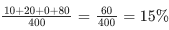

这两个模型具有相同的 WAPE 和偏差，但模型 A 具有 10%的负偏差（并倾向于低估），而模型 B 具有 10%的正偏差（并倾向于高估）。

每天的票价为[$200, $220, $230, $210]。

总收入（我们选择每天已售和预测票数的最低值）为

+   *模型 A*—90 * $200 + 90 * $220 + 90 * $230 + 80 * $210 = $75,300

+   *模型 B*—110 * $200 + 90 * $220 + 110 * $230 + 80 * $210 = $83,900

如您所见，模型 B 在短短 4 天内（而总飞行成本保持不变）就为单次航班带来了$8,600 的收入。当乘以数百次航班和天数时，这种差异将导致显著的收入增长。

当然，我们在现实世界的背景下过于简化了模型进行预测和影响决策的情况（例如，销售多少张票，如何动态调整价格）。在这里，整个过渡过程是通过乘以价格和可选地减去飞行成本来完成的。

尽管如此，这个例子说明了我们如何从可能不完全捕捉预测实际效果的模型性能指标，过渡到如收入这样的业务指标。这些业务指标可以在运行 A/B 测试之前报告给团队。

### 12.1.3 模拟环境

当风险很高时，投资于更复杂、计算成本更高但更稳健的离线测试程序是合理的。为手头的问题构建在线环境的模拟器并对该模拟器运行算法可以成为这样的投资。

这种环境的良好例子是时间序列预测，由于标签、辅助信息（例如，历史成本或库存商品的周转）和结果中的消歧的可用性，这种模拟相对简单。这通常不适用于在线推荐系统，如新闻、广告或产品推荐，在这些系统中我们处理部分标记的数据；我们只知道我们向特定用户展示的内容项的印象（查看、点击和转化），而那些我们没有展示的内容则没有用户反馈，因为总有可能，如果我们产生了不同的印象顺序，一切可能都会非常不同。

让我们回顾一下在推荐系统的情况下，如何创建这样的环境。

有时，在线推荐系统是通过多臂老虎机和上下文多臂老虎机方法解决的（通常，这个推荐系统子集被称为*实时竞价*，但简而言之，其目标保持不变——从多种选择中提供最佳选择以最大化特定奖励）。有一个代理，即我们的算法，它与环境“互动”。例如，它消耗有关用户上下文（他们的近期历史）的信息，并选择显示哪个广告横幅以最大化点击率（CTR）、转化率（CVR）或每英里有效成本（eCPM）。这是一个典型的强化学习问题，具有强大的反馈循环影响：之前显示的广告会改变未来的用户行为，并为我们提供有关他们偏好的信息。

所说的“重放”算法是一种简单（但不是最直观）的方法来为实时推荐构建模拟，该方法源于李红等人在论文“基于上下文多臂老虎机的新闻文章推荐算法的无偏离线评估”中的描述（[`arxiv.org/abs/1003.5956`](https://arxiv.org/abs/1003.5956)）。在这里，我们总结了这篇论文，因为它具有实用性：

1.  假设我们选取一个历史数据集，该数据集包含用户上下文（用户特征）、推荐广告（比如说我们一次可以推荐一个项目），以及用户反馈（可以是二进制或连续的）。此外，对于数据集中的每一行，我们知道在特定时刻可以为该用户推荐的所有可用项目（项目是上下文多臂老虎机中的臂）。

1.  此外，我们还有一个第二数据集，我们将其称为虚拟数据集。在模拟开始时，它是空的。

1.  我们将历史数据集分成批次（例如，每次迭代的 1 小时间隔）。

1.  对于单个批次中的每一行，我们根据提出的用户上下文和可用项目预测我们的算法可能会推荐哪个广告。我们的算法在初始为空的虚拟数据集上训练。因此，我们开始于随机的“探索”。

1.  对于模型生成的推荐与历史选择广告相等的行，将保存到虚拟数据集中（包括他们的反馈）。

1.  我们根据更新的虚拟数据集重新训练模型。

1.  我们重复步骤 4 到 6，直到达到历史数据集的末尾。

对于步骤 4 和 5 也有一个优化版本：不是像真实环境中的一个项目，而是为每一行推荐三个或五个项目，如果推荐的项目与其中之一匹配，我们就将这一行追加到虚拟数据集中。这允许模型更有效地学习，同时减少随机性。

在图 12.1 到 12.5 中，一个视觉示例被分成几个部分，展示了无偏估计器的工作，其中图 12.1 显示了事件的真实历史，而图 12.2 到 12.5 展示了基于历史数据的模拟事件。

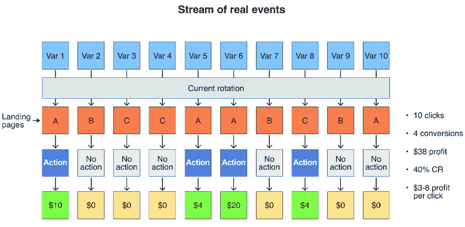

##### 图 12.1 无偏估计器（离线验证）：真实事件流

对于这里的模拟事件，我们通过实际事件的历史来筛选，只考虑那些新模型（选择的着陆页）的输出与旧模型输出相等的事件。在图 12.2 中，模拟的用户行为显示了从横幅到着陆页的五个转换，其中有两个成功的购买和每点击预测利润 6 美元。

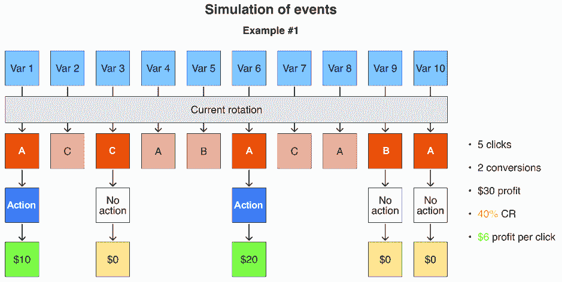

##### 图 12.2 无偏估计器（离线验证）：事件模拟，示例 1

仅展示用户查看的四种商品，图 12.3 表明了最低可能的利润（10 美元）和每点击利润（2.5 美元）。

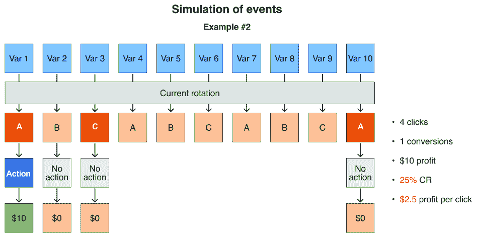

##### 图 12.3 无偏估计器（离线验证）：事件模拟，示例 2

图 12.4 提供了另一个模拟用户行为的示例，具有相当高的转化率（50%），但由于购买成本低，每点击利润值（仅为 3%）却很低。

##### 图 12.4 无偏估计器（离线验证）：事件模拟，示例 3

最后，图 12.5 中的模拟环境表明了最佳可能的 CVR（60%）和每点击利润（7 美元），而整体利润仅比真实事件流低 3 美元（见图 12.1）。

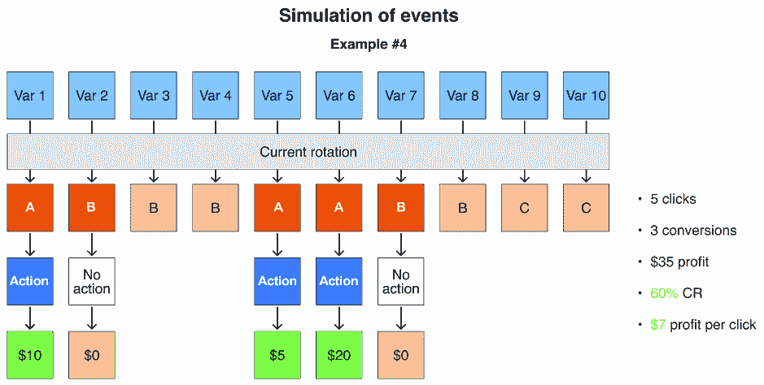

##### 图 12.5 无偏估计器（离线验证）：事件模拟，示例 4

我们最终得到一个虚拟数据集，这是我们的模型与模拟数据流交互产生的。基于它，我们可以计算所有列出的指标：

+   CTR = 点击数/查看数（总行数）

+   CVR = 转化数/点击数

+   eCPM = 收入/点击数 * 1000

虽然不是理想的解决方案，但通过这个程序运行不同的模型将使从产品指标的角度评估它们成为可能，并理解这些在线指标估计与预测准确性之间的关系，然后向更广泛的受众提供这些信息。

### 12.1.4 人工评估

在将系统部署到生产之前，有时值得提及的最终选项是评估者的验证，或人工评估。如果模拟计算成本高且慢，由于带宽有限、延迟更长、人为引起的模糊性以及更高的成本，这可能会变得更糟。然而，在适用人工介入的情况下，这通常是测试模型最精确和最可靠的方式，除了直接在真实数据上在线测试之外。

例如，在构建搜索引擎管道的新版本后，我们可以要求一组专家对某些基准查询的搜索结果的相关性进行 1 到 5 的估计，或者选择哪个输出更相关，比较新旧版本的搜索结果。第二种（比较）方法往往会产生更稳健的评估，因为它排除了评分估计的主观性。在生成大型语言模型的情况下，人工评估和混合方法（基于人类反馈的辅助“评论”模型）是最受欢迎的选项来衡量生成的质量。

虽然人工评估的吞吐量低，成本高，可能会阻碍频繁使用，但其产生高度精确和可靠的评估（与快速但有限的自动化方法相比）的能力不容小觑。

## 12.2 A/B 测试

在包括市场营销、广告、产品设计在内的多个领域被广泛使用，A/B 测试是因果推断的金标准，它有助于做出基于数据的决策，而不是仅仅依赖直觉。你可能会有一个合理的问题：我们一直在讨论如何衡量和报告结果，现在我们突然跳上了因果推断的船；这是为什么？从某种意义上说，衡量结果是因果推断的一部分，因为我们想确保这些结果是由我们影响的因素（在我们的情况下，是一个机器学习系统）引起的。当然，我们可以将我们的系统部署到生产环境中，并测量所有感兴趣的指标，但我们很少这样做，主要原因如下：

+   这很危险。如果出了问题，将其部署给所有人会导致进一步的损坏。因此，我们应该先将其部署给一小部分人。

+   即使我们对前面的观点不关心（可能不是，但仍然如此），如果在我们控制范围之外发生了变化，影响了整体性能，但我们认为是我们自己导致了这种情况，从而得出错误的结论，那会怎样呢？

+   这两个观点结合起来，使我们需要对照组（现状）和实验组（我们的变化），这有助于我们处理两者；一方面，我们可以改变实验组的大小，控制受影响的分数，另一方面，我们可以有对照组来比较对实验组产生影响的改变。

在 A/B 实验期间，我们将实体（在大多数情况下，是用户）分为两组：

+   使用我们系统现有版本的对照组

+   使用新版本的测试组

这使我们能够在控制可能影响结果的外部因素的同时，隔离变化对关键指标的影响（见图 12.6）。

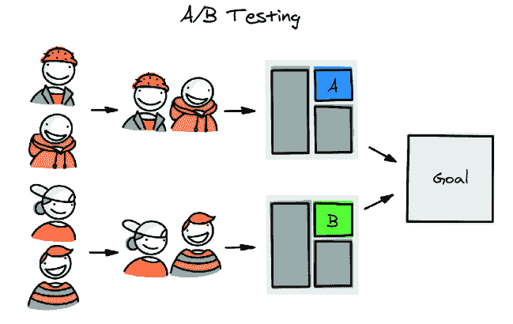

##### 图 12.6 A/B 测试分割阶段

### 12.2.1 实验设计

每个实验都从一个假设开始：

> *如果我们执行[行动 A]，它将帮助我们实现/解决[目标/问题 P]，这将反映在基于[研究/估计 R]的[指标 M]的[X%]预期提升上。*

让我们分解一下假设中提到的变量：

+   *行动* 是部署一个新的解决方案来与现有的一个进行比较。例如，目标可能是减少 Supermegaretail 的缺货情况数量，并缩小预测销售和实际销售之间的差距。

+   *指标* 为我们提供了一种量化我们目标进展的手段。例如，健身应用中的“减重”指标可以展示用户向其设定的目标体重进度的进展。参见第五章以获取更多见解。

+   *预期提升* 可以从我们以往的经验、可用的基准、经验法则，甚至美好的愿望（这种情况很常见！）中得出。通常，离线测试提供的数据用于使其更加精确。

在运行 A/B 测试之前，至少有三个超参数我们必须定义：

+   *最小可检测效应*（MDE），也称为最小可检测变化（MDC），是在给定研究设计和样本量的情况下，两组之间可以可靠检测到的最小差异。MDE 必须等于或小于预期提升，以避免忽略它。

+   *I 型错误*（假阳性）是在效应不存在时错误地得出效应存在的结论的概率。这种错误的典型阈值是 5%（用 *α* = 0.05 表示）。

+   *II 型错误*（假阴性）是在效应存在时未能识别出效应的概率。通常使用的阈值是 20%（用 *β* = 0.2 表示）。

随着数据的变动，这会影响测试所需的样本数量（因此，考虑到一些季节性因素，所需的测试时间），所有这些因素加在一起导致以下方程：

其中 *n* 是每组所需的样本量，*Z**[α]* 是对应于所需显著性水平的 Z 分数（对于 I 型错误率），*Z**[β]* 是对应于所需功效的 Z 分数（对于 II 型错误率），*s**²* 是指标估计的方差，*MDC* 是最小可检测变化。正如我们之前提到的，非常常见的样本单位是 *用户*，但它也可能是 *会话*、*交易*、*店铺级别* 等等。

在制定假设和我们的期望之后，我们选择一个 *分割策略*，这主要取决于我们部署的系统性质以及它将如何影响现有流程。

接下来，我们决定**统计标准**并执行模拟测试，包括 A/A（我们比较相同的系统以检查 I 型错误率）和 A/B（我们通过添加期望大小的噪声来模拟期望的效果），作为对历史数据的合理性检查。这有助于我们确认我们是否达到了预定义的 I 型和 II 型错误水平。关于这一点的全面描述超出了本书的范围，但如果你对更多细节感兴趣，一个很好的起点是 Ron Kohavi 等人所著的《可信在线受控实验：A/B 测试实用指南》([`mng.bz/86Qz`](https://mng.bz/86Qz))。

最后，我们拥有了启动我们的 A/B 测试所需的一切。记住，实验的设计是在事先固定的，不能在过程中改变。接下来，我们简要概述 A/B 测试的基本阶段。

### 12.2.2 分裂策略

问题在于，我们如何分割数据？通常的答案是“按用户”。例如，我们有一个控制组用户与现有的搜索引擎互动，一个实验组使用新版本。然而，当我们不能按用户分割（例如，没有一致的用户 ID）或者按用户分割对我们服务完全无关时，事情就变得更加复杂。

为了更深入地了解，让我们考察在不同领域应用的不同假设定价系统：

+   在**线下零售**中，在同一个商店内向客户展示不同的价格标签在物理上是不切实际的。因此，一个更适合分割的单位是商店而不是单个客户。

+   在**在线零售**中，虽然技术上可以向不同的用户显示不同的价格，但这也可能导致法律问题，因为许多国家都有法律禁止在电子商务中对用户进行歧视。

+   在**共享出行**中，用户可以通过应用程序下订单来分离，但我们必须考虑潜在的负面用户体验。如果我们按用户分割，并且两个用户决定一起骑滑板车，一个用户可能在他们的应用程序中看到每小时 5 美元的价格，而另一个用户则是每小时 6 美元。这种差异可能导致令人困惑和负面的用户体验和反馈。

+   当涉及到应用于**贷款和信贷利率**的动态定价时，提供的利率预计将非常个性化，就像抵押贷款一样。因此，即使两个用户在同一房间里，不同的“价格”也不会引起注意。在这种情况下，按用户分割相对安全。

+   广告网络提供了一个理想的用户测试案例，因为它们提供了大量多样化的、相对低成本的独立数据点，并且每个用户的点击成本既常见也预期。这种设置通常允许更传统的基于用户的分割。

如果按单个用户分割数据不可行，我们可以使用更高级别的实体作为原子单位。对于线下零售，我们可以使用整个商店；对于电动滑板车，可以根据停车区、社区、城市甚至地区来划分行程。然而，这种策略可能会改变数据分布，造成样本大小不均或缺乏代表性，这在选择合适的统计测试时应该予以考虑。

当按非典型键分割时，追求组（桶）相似性至关重要。例如，如果你被迫按地理划分，所选区域应该是相似的，并具有可比的经济指标（它们应该相互匹配）。

最后，还有一种更高级的分割策略，称为*回溯测试*。这种技术将数据分为区域-时间桶，并在不同模型之间随机且持续地切换（见图 12.7）。它确保每个区域将在控制组和测试组中大约相等的时间内。有关更多详细信息，请参阅 Iavor Bojinov 等人撰写的“回溯实验的设计与分析”（[`arxiv.org/abs/2009.00148`](https://arxiv.org/abs/2009.00148)）。

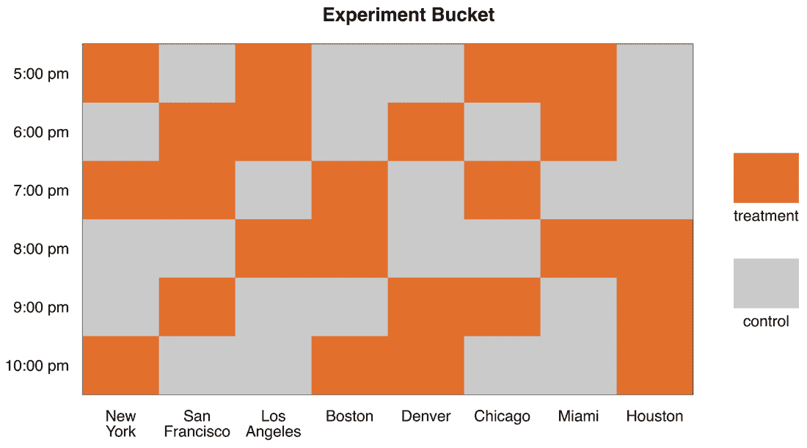

##### 图 12.7 回溯分割模式，表示时间-区域单元格分配

### 12.2.3 选择指标

在设计 A/B 测试时，选择指标是一个关键步骤，它可能是测试成功或失败的决定性因素。我们更喜欢在线测试中可信赖、敏感、可解释的指标，并且反馈延迟低。

每个实验通常都有三种类型的指标：

+   *关键指标*是实验旨在改进的主要指标。这些指标直接影响我们商业目标的成功，并用于确定实验的最终结果。例如，电子商务网站的关键指标可能是转化率（CVR）、平均订单价值（AOV）或总商品价值/收入。

+   *控制指标*在实验期间预期保持不变，作为对其有效性的检验。例如，如果网站访问量（或页面加载时间）的控制指标显示出显著的下降（或上升），这可能表明实验设计存在问题或外部因素的变化，这些因素可能会影响结果。

+   *辅助指标*提供了关于实验的额外信息，但不用于确定最终结果。这些指标有助于更深入地了解实验结果，并可用于识别潜在问题或改进的机会。例如，电子商务网站的辅助指标可能是产品查看次数或网站上的时间花费。

所有三个组在 A/B 测试实验的设计和执行中都发挥着重要作用。关键指标决定了实验的成功，控制指标确保实验的有效性，辅助指标提供额外信息以支持结果并指导未来的实验。

### 12.2.4 统计标准

任何 A/B 实验的第三个基本要素是统计测试，它做出最终决定，即是否捕捉到显著效果。

简而言之，统计标准用于量化在特定假设下获得特定结果的概率。例如，获得等于或大于 3 的 t 统计值的概率通常将小于 0.01（如果两组之间没有差异，并且满足 t 测试的假设）。

在 A/B 测试中最常用的统计测试是我们刚才提到的 t 测试。它有许多修改。例如，Welch 的 t 测试相对容易解释，类似于 Student 的 t 测试，但它可以在两组的方差不相等的情况下使用。Welch t 测试的统计量计算如下：

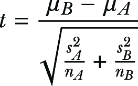

对于 Welch t 测试的*零假设*（测试结果的默认假设）意味着两组之间的均值没有差异；在这里，两组之间的捕获差异是偶然出现的，是由噪声引起的。备择假设是捕获的差异不是由噪声引起的，差异是统计显著的。

通过统计显著性，我们指的是在假设零假设为真的情况下（我们称之为*p 值*），捕捉到特定统计值或更极端值的概率小于*显著性水平* *α*（实际上，等同于第一类错误；通常，*α* = 0.05）。p 值，连同显著性水平，是标准化任何统计测试结果并将其映射到单一参考点的方法，而不是为每个特定的测试定义临界值。

尽管有许多不同的统计测试可用，但特定测试的选择取决于实验的背景和数据性质。尽管如此，提供选择最合适的测试的详细指南超出了本书的范围。关于选择合适的统计测试进行 A/B 测试的更详细讨论，我们再次推荐 Ron Kohavi 等人所著的《可信在线受控实验：A/B 测试实用指南》(*Trustworthy Online Controlled Experiments: A Practical Guide to A/B Testing*) ([`mng.bz/EOKd`](https://mng.bz/EOKd))。

t 检验被广泛使用，因为它是一种稳健的测试，可以处理各种情况，易于实现，并且提供易于解释的结果。然而，选择特定的测试应该始终考虑到你处理的数据类型、实验的性质以及每个测试所需的假设。

### 12.2.5 模拟实验

我们可以通过模拟来检查我们是否成功设计了一个实验。我们在不同的样本和时间段上多次复制整个流程。

一个*模拟的 A/A 测试*涉及随机抽取两组没有产生差异的样本，并应用选择的测试统计量。我们重复这些动作很多次（比如说 1,000 或 10,000 次），并期望 p 值遵循均匀分布（如果一切正常）。例如，在 5%的模拟中，测试将以*α* = 0.05 拒绝零假设。测试确实捕捉到两组差异的确切百分比是一个*模拟的第一类错误率*。

一个*模拟的 A/B 测试*做的是类似的事情，但现在我们给第二组 B（我们假设 A 组和 B 组的大小与真实 A/B 测试时相同）增加一个特定大小的提升（通常是感兴趣的 MDE）。再次，我们应用我们的测试统计量，并运行它 1,000 到 10,000 次。之后，我们重新检查结果的 p 值分布，并计算我们拒绝了零假设（“p 值通过了阈值”）的次数。选择测试拒绝零假设的案例百分比是敏感度的估计（1 – *β*），即测试在存在差异时捕捉到差异的概率。如果我们从敏感度中减去 1，我们得到*第二类错误率*（当存在 A 和 B 之间的差异时忽略差异的概率）。如果计算出的 I 型和 II 型错误率符合预定义的水平，那么统计测试就被正确选择，样本大小也被正确估计（见图 12.8）。

##### 图 12.8 模拟提供了一个最终的验证，确保一切正确设置，可以运行 A/B 测试。

### 12.2.6 当 A/B 测试不可行时

有一些情况下，运行经典的 A/B 测试是不可行或不理想的——可能是因为法律限制（某些行业，如医疗保健和金融，有严格的法规，禁止对客户进行实验），物流限制（可能很难将客户基础随机分成两组进行测试），或其他原因。

有不同的方法来解决这个问题，但由于这是一个超出本书范围的主题，我们不会详细讨论。为了您的方便，我们在这里列出它们，以便您可以将它们用作更深入研究的关键词：

+   因果效应

+   差分法

+   合成控制

+   中断时间序列分析

+   回归不连续设计

+   因果推断

## 12.3 报告结果

监控正在进行中的实验对于确保其顺利运行并产生可靠的结果至关重要。如果在实验过程中出现问题，及时识别和解决问题以避免负面影响的扩大至关重要。有时可能排除特定用户、项目或段落的实验，并继续进行。然而，如果这不是在初始设计中考虑的，则不建议这样做。在其他情况下，我们更喜欢完全终止实验并调查导致失败的因素。

##### 来自阿列克谢的营火故事

在一个额外灵活的初创环境工作的那些人可能会认为所有的报告都只适用于大公司，但这并不正确；即使在小型公司，也应投入足够的努力以确保适当的报告和实验管理。我通过艰难的方式学到了这个教训：我曾经在一个相对较小的公司工作，那里只有三名机器学习工程师，我的任务是提高一个模型的核心性能。经过数月的研发和实验，我设法取得了良好的成果，得到了我的经理和公司 CTO 的高度赞赏。当我准备将新模型投入生产实施时，CTO 的一条消息弹了出来：“嘿，我们明天要开董事会会议，我想在幻灯片上突出你的成就。请给我提供关于 X 的详细信息和 Y 的粒度。”

我按照要求尝试制作了一份报告，但突然，经过仔细分析，数字显示新模型的性能实际上比旧模型差！看起来很糟糕，但我绝对不打算通过报告不存在的更好结果来欺骗 CTO。鉴于这是我在这家公司的第一个大项目，这看起来非常可疑。我们三个人——CTO、我的经理和我——开始深入调查这个问题。

直到快到午夜，我才找到了根本原因：在运行额外实验时，我意外地用一些不成功的实验覆盖了最佳模型的结果，并使用这些数据为董事会会议报告。因为我是在处理这个问题的唯一一个人，我没有足够注意这一点，而且缺乏适当的报告和实验管理（只是在开发机上存储的半随机数据块）导致了这一事件。

### 12.3.1 控制和辅助指标

在 12.2.1 节中，我们提到了在测试期间应监控的控制和辅助指标。它们可以在关键指标出现显著下降之前提示出问题。例如，跟踪用户反馈很重要——如果你注意到用户参与度显著下降或用户流失率激增，这是一个明显的故障指标。在这种情况下，这可能表明实验组对推入的变化反应不佳。这些信息可以轻易导致实验提前终止。

此外，在进行 A/B 测试时，我们应该考虑不同用户群体之间的公平性和偏见，这可能会影响目标和辅助指标。这种分析与我们第九章中深入探讨的内容相似。关于进一步阅读，我们推荐 Guillaume Saint-Jacques 等人所著的《Fairness through Experimentation: Inequality in A/B Testing as an Approach to Responsible Design》（[`arxiv.org/pdf/2002.05819.pdf`](https://arxiv.org/pdf/2002.05819.pdf))。

### 12.3.2 提升量监控

在 A/B 实验期间，最有价值的测量指标是提升量，即 A 组和 B 组关键指标之间的相对差异。实验运行时间越长，测试的敏感性就越高，我们能够检测到的效果（无论是正面还是负面）就越小。

图 12.9 显示了表示我们无法以统计显著性检测到的效果范围的漏斗。如果提升量移动到这个漏斗之外，那么效果是显著的。请注意，如果没有具体的设计，你不能像你希望的那样频繁地查看测试，直到看到期望的结果。关于这个主题的进一步阅读，我们推荐 Oleg Ya 的《Peeking Problem—The Fatal Mistake in A/B Testing and Experimentation》（[`gopractice.io/data/peeking-problem/`](https://gopractice.io/data/peeking-problem/)) 和 Mårten Schultzberg 等人所著的《Sequential A/B Testing, Further Reading Choosing Sequential Testing Framework—Comparisons and Discussions》（[`mng.bz/NBon`](https://mng.bz/NBon))。

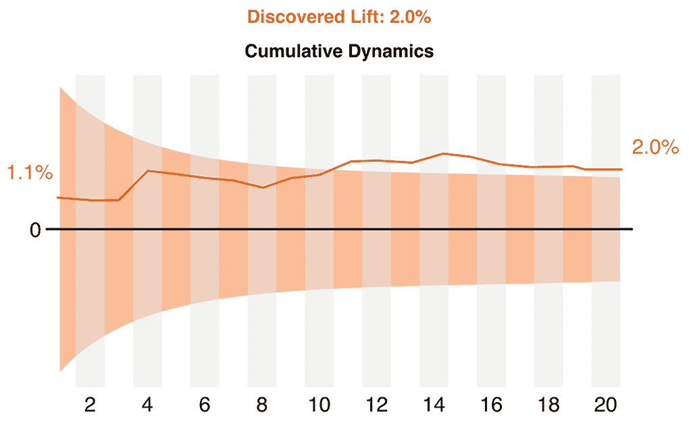

##### 图 12.9 时间累积提升动态示例，以及具体的置信区间

这个漏斗可以根据 MDC 计算得出。在这里，我们需要解决之前看到的相同方程——然而，这次是针对不同的时间段——但我们不能在没有提前计算出的时间段过去之前做出决定。你可能会问：那么使用它的意义在哪里呢？答案是，为了有一个紧急停止标准，如果结果超出了漏斗并且是负面的——这是最不期望、最不希望和最不可能的结果，我们可以终止实验。对于之前提到的任何顺序测试框架（例如，mSPRT），我们可以在结果超出漏斗或实验时间结束时立即做出决定。

### 12.3.3 何时结束实验

基于中间结果提前停止或延长 A/B 测试可能会很有诱惑力。然而，如果没有采用顺序测试，这可能导致由于统计功效的变化以及假阳性或假阴性的风险而得出错误的结论。所以，如果我们没有进行顺序测试，我们应该在什么时候停止实验？

通常情况下，实验应该按照预定的设计进行，除非关键指标出现灾难性的下降（显著的负面效果），如果实验继续进行，这将导致有意义的财务损失。

另一方面，如果你在关键指标中看到积极的效果，最佳实践是坚持初始计划，让实验完整运行。这让你可以确认这些积极效果随着时间的推移而持续，并且不是短期波动的结果。

对于那些边界案例，一些指标是正的，一些是负的，还有一些在 MDE 周围徘徊的情况怎么办？在实验设计阶段，决定你将如何解释这些混合结果，并在不同的关键指标之间设定优先级是至关重要的。

如果你迫不及待地想看到最终结果，考虑使用如顺序测试等方法，这允许在实验的不同阶段进行重复的显著性测试。这些方法有其自己的假设和考虑因素，所以在进行之前确保你完全理解它们。

决定是否停止或继续实验是一个复杂的任务，需要仔细考虑指标、潜在结果及其影响。在你的实验方案中记录这些决定，包括可能的早期终止标准。

### 12.3.4 应报告的内容

实验完成后，是时候开始我们的分析了。在这里，我们需要计算所需的指标，双重检查监控，并为每个测量提供置信区间。

并非每个实验都是成功的。根据我们的经验，有 20%的 A/B 测试显示出统计学上的显著差异是相当不错的（记住，通常如果假阳性率为 5%，则差异为 15%）。并且记住：如果测试在统计学上是显著的，并不意味着结果是积极的或巨大的。

假设我们决定 A/B 测试是成功的，效果是显著的。在这种情况下，我们有两种选择：

+   *报告点估计效果—*“效果是显著的，等于 X，”其中 X 是实验组和对照组指标值计算出的差异。

+   *估计效果置信区间—*如果效果的最悲观估计等于差异的下置信界限，保守估计等于点估计差异，乐观估计等于差异的上置信界限。

我们已经提供了报告的核心信息（当然，报告的指标应该对观众来说是可理解的，最好用赚取或节省的钱、更长的用户会话等来表示）。此外，深入分析指标的变化，分析它如何影响不同的用户或项目细分，并概述进一步步骤（如果我们汇总到 100%，整体指标可能会如何变化）是很好的。表 12.1 显示了报告表中可以包含的字段示例。

##### 表 12.1 报告表中可以包含的字段示例

| 指标 | 组 A | 组 B | MDE | 提升率 | p 值 | 结论 |
| --- | --- | --- | --- | --- | --- | --- |
| CVR  | 75.2%  | 79.8%  | 5%  | 6.12%  | 0.0472  | +4.2–6.9% (显著)  |
| AOV  | $232.2  | $242.8  | 11%  | 4.57%  | 0.3704  | 无显著影响  |
| …  | …  | …  | …  | …  | …  | …  |

一旦提升被报告，可能的积极场景可能包括在更大比例的数据上进行一个额外的实验，或者完全切换到新系统——或者全面推出、暂停和反向的 A/B 测试。一系列成功的 A/B 实验将为您提供坚实的基于数据的论据，这将作为在决定是否批准进一步步骤时的充分支持。

### 12.3.5 简报文档

编写简报文档对于透明地沟通 A/B 实验结果以及提高未来实验的质量都是很有价值的。它应该在实验期间或实验结束后立即创建，以总结关键发现，包括捕获的见解、检测到的问题和建议。与团队分享此文档确保每个人都处于同一页面上，并能够持续学习和改进系统。

如果实验成功，简报文档将包括对其他产品中类似实验的建议。如果实验失败，讨论在未来的测试中应该做些什么不同，应该避免哪些错误，以及开发新的控制指标以防止在实验早期发生类似的失败，这些都是非常重要的。

## 12.4 设计文档：测量和报告

由于在准备设计文档的预生产阶段无法设计报告，因此默认情况下应跳过。然而，我们已将其包括在内以供演示目的。

### 12.4.1 Supermegaretail 的测量和报告

作为设计文档的一部分，对 Supermegaretail 的测量和报告有其独特的特点，其中之一是，由于我们正在预测未来，我们只能在未来到来时评估系统的质量；最终，我们希望了解我们将能够产生多少利润，但我们只能事后知道这一点，而评估这一点的唯一方法是通过某些与直接相关的指标无关的指标。

#### 设计文档：Supermegaretail

#### IX. 测量和报告

#### i. 测量结果

作为提高已部署的销售预测模型预测质量的第一步，我们计划尝试将现有的模型（每个类别一个）合并成一个。背后的理由是，我们将编码关于物品组的信息，而不会损失具体性，但将获得更多数据，从而实现更好的泛化。即使没有质量上的改进，维护一个模型也比维护多个模型容易得多。

作为离线指标，我们考虑了不同的分位数、百分比误差和偏差。但我们不仅评估整体得分，还检查了特定类别的指标和错误分析。这些离线测试产生了以下中间结果：

+   在所有指标上，一般预测质量稳步提高，并且在切换到分割模型时，大多数验证折都得到了提高。

+   与基线（多）模型相比，产品数量较少的类别在离线指标上有所增加。他们拥有的数据量不足以学习到有意义的模式。大型类别在切换到统一模型时，改变了很多胜利。结果在不同季节和关键地理区域都是可重复的。

以前，A/B 测试基于离线指标提供了一些对每个主要类别预期提升的估计。如果我们将产品 P 的指标 M 减少 X%，将导致缺货（缺货）的利润减少 Y%，并减少由于过剩库存情况造成的损失 Z%。根据我们的估计，试点组的总收入预期将增加 0.3%至 0.7%。

#### ii. A/B 测试

+   *假设*—实验假设是根据离线指标的改进，我们预计收入至少会增加 0.3%。

+   *关键指标*—在 A/B 实验中，我们可以使用的最佳代理指标是平均检查金额。它与收入（假设检查次数没有变化）完美相关。统计测试的原子观察将是单个检查。

+   *分割策略*—我们按配送中心进行分割，并通过它们获取两组商店，因为每个中心服务于一组商店。从这些集合中，我们选择彼此代表性的子集，并将它们用作组 A 和 B。

+   *附加指标*—实验的控制指标是

    +   *每天检查次数*—检查销售量是否有显著下降。

    +   *模型的更新频率*—模型是否定期积累新收集的数据？

    +   *模型的离线指标*—分位数指标、偏差、WAPE。

+   *辅助指标*—

    +   *每日收入*

    +   *每日利润*

+   *统计标准*—我们将使用 Welch 的 t 检验来捕捉样本之间的差异。

+   *错误率*—我们将显著性水平设定为 5%，II 型错误为 10%。

+   *实验持续时间*—根据我们的计算，两周时间足够检查结果。然而，考虑到配送中心的补充节奏为一周，我们将此期限延长至整整一个月。

#### iii. 报告结果

应提供包含以下章节的报告：

+   *结果*—以主要和辅助指标的 95%置信区间表示

+   *图形表示*—特定日期特定指标的值，以及来自控制组和处理组的所有指标的值，以便于消费

+   *绝对数字**—*例如，每组商店的数量、总检查次数和总收入

+   *方法**—*例如，如何选择代表彼此的组，运行模拟以检查 I 型和 II 型错误等。（见附录以获取更多详细信息）

+   *推荐/进一步步骤**—基于收到的结果下一步该做什么

### 12.4.2 为 PhotoStock Inc.测量和报告

我们将这一阶段作为 PhotoStock Inc.案例的模板。

#### 设计文档：PhotoStock Inc.

#### IX. 测量和报告

#### i. 测量结果

以下是我们基线列表中的离线指标：

+   *NDCG@10（人工）*—*我们使用人工标记的相关性分数作为搜索结果页面（SERP）中每张照片的相关性评分。

+   *NDCG@30（隐式）*—我们使用隐式反馈作为相关性评分：

    +   *3*—购买的图片

    +   *2*—添加到收藏夹的图片

    +   *1*—点击的图片

    +   *0*—无交互的浏览

+   *MRR（人工）*—被标记为相关性的第一张照片的平均位置。

+   *MRR（点击）*—*在搜索结果页面（SERP）中首次点击的照片的平均位置。

+   *MRR（购买）*—在搜索结果页面（SERP）中首次购买的照片的平均位置。

我们回顾性地将这些指标应用于当前的非机器学习搜索算法，通过收集每个查询显示的搜索结果页面（SERP）。然后，我们在不同的时间段内测量我们的在线指标（点击率 CTR 和转化率 CVR）。之后，我们计算 Spearman 等级相关系数，并选择与每个在线指标相关性最强的离线指标。所选的离线指标随后用于一个简单的回归模型，以提供一个 A/B 实验中 MDE 的初始估计。

由于这是第一次 A/B 测试，我们还没有用于更精确 MDE 估计的比较数据。然而，对于未来的测试，我们提出了一种系统性的方法，我们将收集和关联每个 A/B 测试中 A 和 B 变体之间的离线和在线指标差异。最终目标是建立一个近似的关联：对于离线指标 C 的 X%改进，我们观察到在线指标 D 的 Y%提升。

进一步细化我们的在线指标估计可能涉及构建用户行为模拟。然而，这将是一个更复杂的任务，我们相信当前的方法为我们测试提供了一个坚实的基础。

除了上述的自动化离线测试方法外，我们还可以结合评估者的反馈。我们提出了两个评估任务：

+   给定查询 Q 和新搜索引擎建议的前 20 张照片，评估者将根据其相关性将整体搜索结果页面（SERP）从 1 到 5 进行排名。

+   在展示查询 Q 和两个不同搜索引擎（一个是当前版本，另一个是新版本）的前 20 张照片后，评估者将确定哪个搜索结果页面（SERP）更相关。

第二个任务允许进行比较评估，这通常通过减少个人评分偏差的影响，产生更稳健的评价。

#### ii. A/B 实验设计

假设我们已经收到了离线指标中最低预期效果的近似估计：点击率（CTR）+5% 和转化率（CVR）+20%。我们的*实验假设*如下：

+   如果我们将当前的搜索引擎切换到我们的基于机器学习的解决方案，它将提供更相关的搜索结果，这将在点击率（CTR）至少提高 5% 和转化率（CVR）至少提高 20% 的基础上反映出来。

因此，我们的*关键指标*是点击率（CTR）和转化率（CVR）。

*控制指标*在实验期间不应发生变化

+   *每个变体的浏览量*—如果不相等，要么是分割策略有问题，要么我们在测试组中极大地影响了用户体验。

+   *响应延迟*—这不应该增加太多，至少要符合服务等级协议（SLAs）。

+   *每秒查询数*—如果这个值低，搜索引擎似乎变得不可用。

+   *每日查询数和从搜索栏开始的会话百分比*—两者都反映了用户参与度；我们预计这些数字不会下降。

+   *客户支持报告的数量*—如果出现峰值，可能意味着有问题。

*辅助指标*提供额外的信息，但不直接参与决策

+   *在 SERP 上花费的平均时间*—如果增加，这可能表明搜索引擎变得更差，用户需要花费更多时间，进行更多查询，滚动更多页面来找到他们想要的东西。

+   *每个变体的点击数和购买数*—两者都将报告导致转化率提高的因素（分子、分母或两者以不同的比率）。

+   *总利润和每笔购买的平均利润*。

+   *点击照片在搜索结果页面（SERP）中的平均位置和每次会话的平均查询数*—这是一个棘手的指标，在某些假设下，其下降可能表明用户导航变得更容易，找到所需内容所需的动作和时间更少。

+   *会话结束时的购买率*—这是转化率（CVR）的一个不太敏感的版本。

+   *分割策略*—新的搜索引擎不会向用户体验添加额外的依赖，所以我们不会因为用户的唯一 ID 而以标准方式分割用户，没有任何东西阻止我们这样做。

+   *统计标准*—考虑到我们的目标是提高点击率（CTR）和转化率（CVR）（两者都是比例指标），我们选择比例 Z 测试。

我们将使用保守的错误率来处理第一类和第二类错误：*α* = 0.01 和 *β* = 0.05：

+   *样本大小*—在测试之前，让我们分析一下我们拥有的数据：

    +   PhotoStock Inc. 网站每日有 100,000 次访问

    +   平均每次访问的搜索查询数：1.5

    +   每次查询后平均查看的照片数量：20

    +   平均查看照片的点击率：10%

    +   平均点击照片的购买率：1%

因此，我们每日有 100,000 × 1.5 × 20 = 3,000,000 次浏览：

+   基准点击率（每浏览次数点击数）为 10%

+   基准 CVR 是 10% * 1% = 0.1%（每浏览次数的购买数）

因此，我们每日有 300,000 次点击和 3,000 笔购买。

之前，我们讨论了为了避免可能的风险，我们希望逐步推出。所以对于第一个 A/B，我们将只对两组各取 10%（组 A 为 5%，组 B 为 5%）。这意味着我们每天每个组有 3,000,000 × 2.5% = 150,000 次观看。

实验应该持续多长时间？以下是基于所需 MDE 和错误率的样本大小估计公式：

这里*p**[A]*和*p**[B]*是旧和新的比例（在我们的情况下，是 CTR 或 CVR），而*Z**[x]*是给定水平的 Z 统计量的临界值。

我们有 10%和 10.5%作为旧和新的 CTR 值：

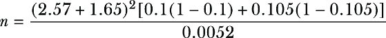

这导致需要 131,095 次观看，而我们每天每个组有 150,000 次观看。这意味着我们只需要 1 天就能收集到检测到显著增加（5%或更高）所需的数据量。

关于转化率呢？旧版本为 0.1%，新版本为 0.12%。再次应用前面的公式将导致需要 978,693 次观看。因此，我们需要 7 天来收集这些数据。

总结来说，实验将持续一周以满足两个指标。一周也是好的，因为它将涵盖整个周的季节性周期，如果有的话（例如，对于 PhotoStock Inc.，工作日可能有更多专业用户，周末可能有更多业余用户）。

为了检查我们是否一切都做得正确，我们将多次运行模拟的 A/A 和 A/B 测试，从估计大小为二项分布的样本中生成，并具有所需的 CTR 和 CVR 值，以确保计算出的错误率低于期望值。

#### iii. 报告模板

在实验期间，我们主要监控 MDE 动态。正如预期的那样，CTR 效果在第二天就具有统计学意义。相比之下，在实验的第四天才检测到 CVR 的统计学意义。

##### CTR 效果

##### CVR 效果

到最后，我们收集了以下指标值：

+   组 A 的 CTR 为 9.91%，组 B 为 10.51%（相差 6%）。

+   组 A 的 CVR 为 0.10%，组 B 为 0.13%（相差 29%）。

我们得出初步结论：

+   新的搜索引擎仅略微增加了每观看一次的点击次数（+6%）；然而，可点击的图片结果证明更加相关（转化为购买的转换率增加了 29%）。因此，A/B 实验是成功的。

#### 消耗效果报告

我们应用了自举程序，从点估计效应转换为分布。我们将 95%置信区间的下限和上限视为悲观和乐观的效应估计。我们使用原始的点估计作为保守估计。

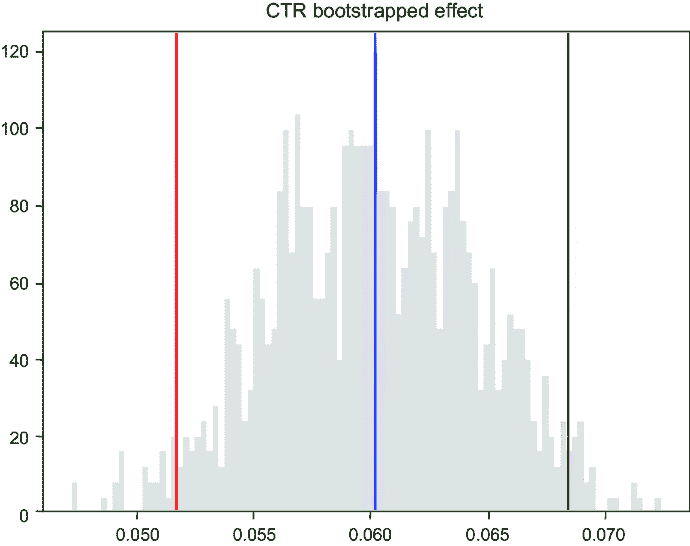

##### 自举 CTR

我们报告以下 CTR 效果：

+   悲观估计为+5.1%（新点击率是 10.4%）。

+   保守估计为+6%（新 CTR 为 10.5%）。

+   乐观估计为+6.8%（新 CTR 为 10.6%）。

##### 自举 CVR

我们报告以下 CVR 的效果：

+   悲观估计为+19.2%（新 CVR 为 0.12%）。

+   保守估计为+29%（新 CVR 为 0.13%）。

+   乐观估计为+39.4%（新 CVR 为 0.14%）。

#### 扩大效果

当我们将新测试的基于机器学习的搜索引擎扩展到所有流量时，让我们以收入来评估这些收益，假设平均照片利润（$3.0）和每日访问量（300 万）保持不变。

基线 CVR 为 0.1%。乘以每日流量和费用，我们得到每日收入$9,000 或每年$3.3 百万：

+   悲观估计给我们带来每日$10,800（+$1,800）或每年$3.9 百万（+$600,000）。

+   保守估计给我们带来每日$11,700（+$2,700）或每年$4.3 百万（+$1 百万）。

+   乐观估计给我们带来每日$12,600（+$13,600）或每年$4.6 百万（+$1.3 百万）。

这些数字完全证明了我们所有的努力和时间。

进一步的步骤将需要运行两个到三个较短的 A/B 实验，以覆盖更大比例的用户（例如，20% -> 30% -> 50%），以确保系统安全，效果可重复，实验结果可靠。

考虑以下旁注：

+   控制指标在实验期间未检测到任何事件。

+   平均搜索时间略有下降，这是一个好兆头。这意味着用户体验得到了改善，用户可以更快地找到他们需要的东西。

+   以购买结束的会话数量增加。SERPs 变得更加相关。

+   每张照片的平均利润保持不变（约$3.0）。

实验结束后，我们还回顾性地估计了在新模型中点击的照片中有多少在顶部 1,000 名之内。结果是，这些点击的 Recall@1000 为 97%。这一重要发现暗示了系统进一步改进的可能性，特别是通过添加检索阶段（候选模型）转向两阶段管道。

## 摘要

+   在部署和运行在线测试阶段之前，使用离线评估来获取您机器学习系统预期效果的近似值。

+   有各种方法可以推导出离线和在线指标之间的关系，包括基准和之前运行的 A/B 测试及其相应的离线指标。

+   要关于新模型是否优于旧模型（或基于机器学习的解决方案是否优于非机器学习解决方案）做出数据驱动的决策，行业标准是 A/B 测试（然而，还有其他选项可以推导出因果关系）。

+   为了顺利且安全地运行 A/B 测试，我们需要制定一个合理的假设，选择正确的关键/控制/辅助指标，估计预期的提升和实验持续时间，并在进行实际测试之前，有时进行模拟的 A/A 和 A/B 测试。

+   在向利益相关者和团队成员报告实验结果时，我们需要传达捕捉到的效果，如果推出服务，预期会产生什么效果，不同细分市场看到的效果是什么，实验过程中发现了什么问题，以及下一步和进一步改进的建议。
