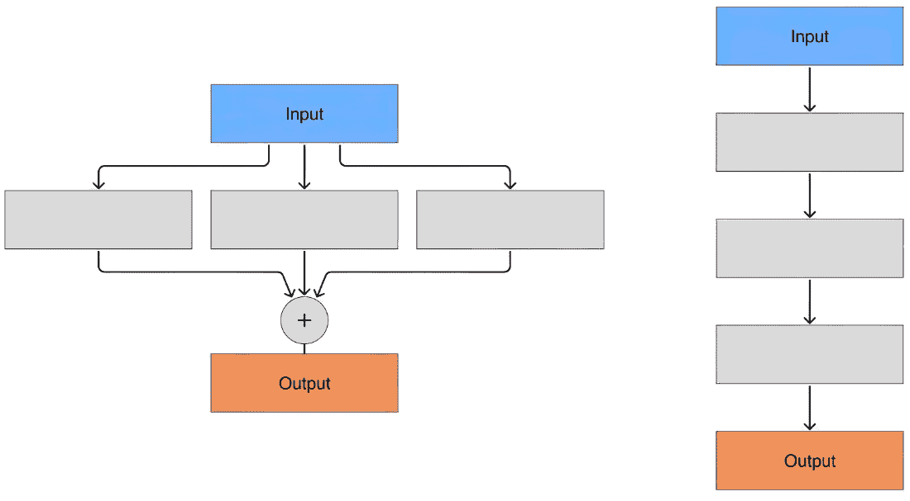
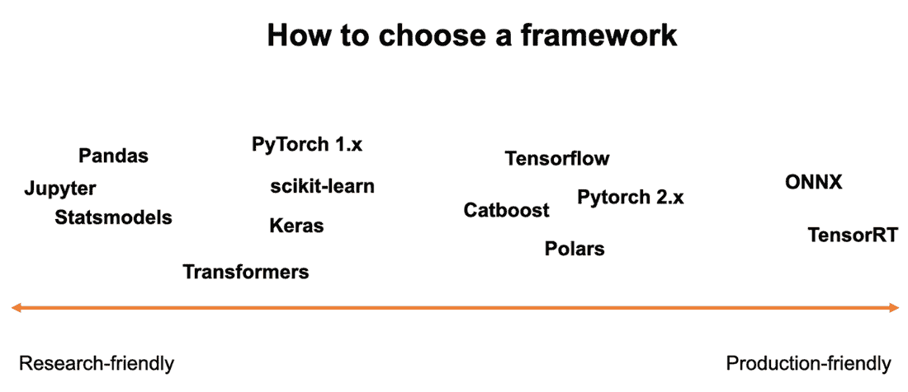

# 15 服务和推理优化

### 本章涵盖

+   在服务阶段和推理阶段可能出现的挑战

+   将派上用场的工具和框架

+   优化推理管道

在生产环境中运行你的机器学习（ML）模型是达到系统高效运行生命周期所需的最后一步。一些机器学习从业者对此方面表现出较低的兴趣，更愿意专注于模型开发和训练。然而，这可能是一个错误的决定，因为模型只有在部署并有效利用于生产中时才能发挥作用。在本章中，我们讨论了部署和推理机器学习模型的挑战，以及回顾了优化推理过程的不同方法。

正如我们在第十章中提到的，推理管道是一个序列（在大多数情况下）或更复杂的无环图，它以原始数据为输入，产生预测作为输出。除了 ML 模型本身外，推理管道还包括特征计算、数据预处理、输出后处理等步骤。预处理和后处理是有些通用的术语，因为它们可以根据特定系统的具体要求以不同的方式构建。让我们举几个例子。典型的计算机视觉管道通常从图像缩放和归一化开始；典型的语言处理管道，反过来，从标记化开始；而典型的推荐系统管道则从从特征存储中提取用户特征开始。

正确调整推理的作用可能因领域而异。高频交易公司或广告技术企业一直在寻找最优秀的人才以优化其极低延迟的系统。移动应用和物联网（IoT）开发者将高效的推理置于优先事项之首，追求更高效的电池消耗，从而改善用户体验。那些在其产品中使用高负载后端的人感兴趣的是在不花费大量资金的情况下保持负载。同时，有许多场景下模型预测并不是瓶颈。例如，每周一次，我们需要运行一个批量作业来预测下周的销售情况，生成报告，并将其分发给采购部门。在这些情况下，如果报告需要在周一早上通过公司电子邮件发送，那么它是在周日晚上编译需要 10 分钟还是 3 小时，并没有太大的区别，只要它被安排在周日晚上即可。

通常，本章主要关注基于深度学习的系统。这并不令人惊讶，因为重型模型在生产部署前需要更多的工程努力，而只要你的特征基础设施（在第十一章中描述）到位，提供一些轻量级解决方案，如逻辑回归或小型树集成，并不会太复杂。同时，这里描述的一些原则和技术适用于任何机器学习系统。

## 15.1 服务和推理：挑战

就像在系统设计中经常发生的那样，我们的第一步在于定义需求。有几个关键因素需要牢记，我们将在下面逐一讨论：

+   *延迟**—*这定义了我们对系统在提供预测方面的响应速度的期望。对于需要即时响应的实时应用，延迟通常以毫秒计算（在某些极端情况下，即使 1 毫秒也太长了！），而在某些场景中，等待数小时甚至数天是完全可接受的。

+   *吞吐量**—*这指的是系统在给定时间内可以处理的任务数量或数据量。在机器学习的世界里，它意味着模型每单位时间可以产生的预测总数。在需要短时间内处理大量数据的场景中，如大型数据集的批量处理，优化吞吐量通常至关重要。

+   *可扩展性**—*我们需要了解系统可能面临的预测数量以及这个数量如何增加或减少。负载模式通常是季节性的，可能因行业而异。对于零售业，在假日季节或像黑色星期五或网络星期一这样的巨大折扣日，通常会看到销售额的激增。对于广告技术行业，由于互联网上的活动增加，负载可能会更高。虽然这里提到的某些峰值是可以预测的，但其他一些可能会突然出现；一个应用程序的病毒式流行或一个大客户的突然使用激增是我们无法提前准备的。系统应具备足够的可扩展性，以处理峰值负载，而不会降低延迟和吞吐量。

+   *目标平台—*您的模型可以在仅 CPU 或 GPU 加速的服务器上运行；在 AWS Lambda 或 Cloudflare Workers 等无服务器环境中；在桌面、移动或物联网设备上；甚至可以在浏览器中运行。除了优势之外，每个平台都有其自身的局限性和要求，在构建系统之前，我们必须对这些有深刻的理解。如果我们正在构建移动应用，我们需要考虑模型的大小，因为它应该足够小，可以放入应用包中，同时足够高效，可以在用户的设备上运行而不耗尽电池。如果我们正在开发后端系统，在硬件选择上我们有更多的自由度，这为系统的复杂性和规模提供了大量的机会。如果我们目标平台是异构的物联网硬件，我们可能无法设计一个功能齐全的复杂模型，因此坚持最简单的架构成为主要的技术要求。

当我们必须为我们的产品使用多个平台时，事情可能会变得更加复杂。在某些情况下，我们可能会决定在用户设备上运行小批量，其余的发送到后端，或者在将模型发送到用户设备进行推理之前，在后台进行微调。这样，就遵循了两个平台的综合要求。此外，我们可能需要在单个平台上使用各种计算单元。阿列克谢曾经需要加速一个运行在低端 GPU 设备上的系统。在底层，该系统使用一个小模型来处理多个并发请求，这导致那些廉价的 GPU 无法处理负载。阿列克谢提出的解决方案引入了一个混合设备会话池：每次 GPU 过载时，下一个请求由 CPU 处理，从而在设备之间提供更平衡的负载，并满足延迟要求。

+   *成本—*机器学习系统通常是公司中最资源密集型的解决方案，随着重型生成模型越来越受欢迎，成本已经成为一个至关重要的因素，就像以前从未出现过一样。随着机器学习基础设施成本成为一个不断增长的关注点，企业被迫寻找智能的推理管道决策，这可以带来巨大的财务效益。在构建系统之前，了解基础设施的成本以及它将如何根据增加的负载进行扩展是很重要的。甚至可能导致基础设施成本最终高于系统产生的收入。在其他情况下，如果推理是在用户设备上进行的，这可能不会成为一个问题。例如，对于移动应用或物联网设备，随着用户基础的不断增长，它不会以任何显著的方式影响基础设施成本（我们无法断言它根本不会影响；如果用户从您的内容分发网络下载模型，每增加 1,000 名新用户将使您额外花费几分钱）。

+   *可靠性**—*当你在选择推理平台时选择了便宜的选择，可靠性可能会成为一个问题。仅仅为了在炎热的季节中突然出现故障而选择最便宜的硬件供应商，有时可能比投资更多在经过时间考验的可靠解决方案上更糟糕。想想在意外负载高峰期间可能发生的所有灾难，模型中的错误，或硬件故障，最重要的是，系统将如何（以及是否）处理这些问题。

+   *灵活性**—*即使一个新发布的系统显示出稳定的表现和效率，我们也不能确定未来的需求和我们将需要实施的想法。因此，系统应该足够灵活，能够消化变化和改进。这些可能包括一个新的模型（甚至可能使用不同的框架进行训练！），额外的预处理或后处理，新功能，额外的 API 等。始终记住，系统将不断发展，并且应该易于修改，而不会影响现有的功能。

+   *安全和隐私**—*这个主题的范畴远不止一段文字，但在这个章节的范围内，我们只能提到安全需求在很大程度上依赖于目标平台。例如，当你的系统完全运行在你的后端，预测从未离开组织的边界时，你几乎不需要考虑超出当前协议的安全问题。另一方面，如果你正在开发一个将在用户设备上运行的移动应用，你需要认真考虑保护模型免受逆向工程。在某些情况下，模型甚至需要保护用户本身，其中最显著的例子是 2023 年流行的针对大型语言模型（LLMs）的越狱，当时用户试图通过它们来获取敏感问题的答案。

## 15.2 权衡和模式

这里提到的一些因素往往是相互冲突的，甚至是相互排斥的。因此，我们无法同时优化所有这些因素，这意味着我们将在这些因素之间找到妥协。然而，在寻找各种场景中的公平平衡时，我们可以倾向于某些模式。

### 15.2.1 权衡

让我们从*延迟*和*吞吐量*开始。两者都是非常受欢迎的优化候选者，其中之一得到改进可能会带来另一个的改进或退化。

真实的生产系统通常是在给定的延迟预算内优化最佳吞吐量。延迟预算由产品或用户体验需求决定（用户是否期望实时/近实时响应，或者他们是否可以容忍延迟？），在这个预算下，目标是通过改变模型架构或推理设计（例如，通过批处理，如我们在 15.3 节中描述的）来最大化吞吐量（或最小化预期吞吐量所需的服务器数量）。

让我们来看一些例子。想象一个简单的深度学习模型——一个像 Resnet 这样的卷积网络或者一个像 BERT 这样的 Transformer。如果你只是减少块的数量，无论你的推理设置如何，你的延迟和吞吐量数字都有很大可能得到改善，所以事情非常直接（模型的准确率可能会下降，但在当前例子中并非如此）。但想象一下有两个模型，它们具有相同数量的块和每个块相同的参数数量，但使用了两种不同的架构：模型 A 以并行方式运行它们并进行进一步聚合（类似于 ResNeXt 架构），而模型 B 则按顺序运行每个块。由于模型 B 架构的顺序性，其延迟将高于模型 A，但与此同时，你可以并行运行多个模型 B 的实例，或者以大批次大小运行它，因此模型 A 的吞吐量并不比模型 B 差。因此，并行性是影响延迟和吞吐量的内部因素之一。在实践中，这意味着参数数量或块的数量不能成为比较模型的最终因素，我们对架构在推理平台背景下的理解帮助我们识别瓶颈，如图 15.1 所示。



##### 图 15.1 宽度与深度模型的示例。虽然它们具有相同的参数数量，但深度模型在并行计算方面更为受限

另一个权衡与模型准确度（或用于系统的其他 ML 特定指标）以及相关的延迟/吞吐量/成本有关。ML 工程师常常倾向于通过升级到更大的模型来解决模型的不足。这偶尔可以提供一些好处，但最初这是一种昂贵且扩展性差的解决问题的方式。同时，试图仅通过选择最简单的模型来优化成本也不是一个好主意。计算成本与模型价值之间的关系不是线性的，在大多数情况下，都有一个甜点，模型足够好，成本相对较低，而光谱边缘的激进解决方案效率较低。如果我们回顾第 9.1 节，可以以同样的想法构建：我们可以将模型的准确率作为计算成本的函数进行绘制，并为我们特定的问题找到合适的平衡（详见图 15.2 的详细信息）。


##### 图 15.2 同一家族的不同大小模型及其在 ImageNet 数据集上的相应准确度值。图表表明，较大的模型通常具有更高的准确度，但这种效应趋于饱和。（来源：[`mng.bz/QVzG`](https://mng.bz/QVzG)。）

最后，一个可能不是那么明显但仍然值得提到的权衡是基于研究灵活性生产级服务性能之间的联系。一方面，我们可以从构建一个易于从实验沙盒直接迁移到生产的模型中受益。另一方面，研究团队和生产系统之间有明确的分离，将允许研究团队在不影响生产系统的情况下实验新想法。但随着我们进一步深入，实验代码和真实系统推理之间的差异将放大，从而增加面对由环境差异引起的缺陷的机会，没有适当的监控和集成测试投资，这将很难追踪（请参阅第十三章关于部署方面和第十四章关于可观察性的内容）。

当面临两种选择时，你可能需要考虑某些工具和框架。因为你选择的路线将显著影响你系统的可持续性，所以接下来的部分将完全致力于这个非常重要的主题。

### 15.2.2 模式

一旦我们确定了为了优化我们的模型需要做出的权衡，就到了选择合适的模式来实施的时候了。我们再次将范围限制在一个小的列表中，并提及三种不同的模式。尽管这个列表并不完整，但你很可能会在你的系统中使用这些模式之一。

值得首先提到的第一个模式是**批处理**，这是一种用于提高吞吐量的技术，需要提前考虑。如果你知道系统可以以批处理模式使用，你应该相应地设计它。批处理不仅仅是一个二元属性（使用或不使用），它具有多个细微差别。想象一下一个典型的网页 API：客户端（我们无法控制）发送一些数据，后端返回一个预测。这并不是典型的离线批处理预测，但存在动态批处理的余地：在后端，我们等待一个短暂的时间（例如，20 毫秒或，比如说，32 个请求，哪个先到就先处理）并收集这个时间段内到达的所有请求，然后对它们进行批推理。这样，我们可以减少客户端的延迟，同时仍然保持系统的响应性。这种方法在 Nvidia 的 Triton 推理服务器和 Tensorflow Serving 等框架中得到实现。智能批处理的另一个例子与语言模型相关：模型的典型输入大小是动态的，对多个不同大小的输入进行批推理需要填充到最长输入的大小。然而，我们可以根据大小对输入进行分组，并分别对每个组进行批推理，从而减少填充开销（以较小的批次或更长的批次累积窗口为代价）。你可以在 Graphcore 的博客上了解更多关于这项技术的信息（[`mng.bz/XVEv`](https://mng.bz/XVEv))。

我们接下来要讨论的第二种模式是**缓存**，它已经获得了优化终极级别的地位（我们将在本章后面讨论推理优化）。缓存的使用源于一个显而易见的思想：永远不要两次计算相同的东西。有时这就像在更传统的软件系统中一样简单：输入数据与一个键相关联，并使用一些键值存储来保存之前计算的结果，这样我们就不必重复进行昂贵的计算。

##### 列表 15.1 展示了最简单的内存缓存示例

```py
class InMemoryCache:
    def __init__(self):
        self.cache = {}

    def get(self, key: str, or_else: Callable):
        v = self.cache.get(key)
        if v is None:
            v = or_else()
            self.cache[key] = v
        return v
```

在现实中，机器学习模型的输入分布可能有一个长尾，因为大多数请求都是唯一的。例如，根据谷歌的数据，所有搜索查询中有 15%是完全独特的（[`mng.bz/yoeB`](https://mng.bz/yoeB)）。鉴于缓存的有效期通常远低于整个谷歌历史，任何合理的时间窗口内，独特（不可缓存的）查询的比例都会很高。这意味着缓存没有用吗？不一定。一个原因是，即使是很低的计算节省比例也能在节省资金方面带来巨大的好处。另一个概念是使用模糊缓存的想法：我们不必检查键的直接匹配，我们可以放宽匹配条件。例如，Arseny 看到过一个系统，其缓存键基于正则表达式，因此结果可以被多个匹配相同正则表达式的相似请求共享。更激进的缓存可以基于键的语义相似性构建（例如，[`github.com/zilliztech/GPTCache`](https://github.com/zilliztech/GPTCache)使用这种方法来缓存 LLM 查询）。作为关注可靠性的从业者，我们建议在使用这种缓存时三思而后行：其模糊程度很高，因此缓存容易产生错误的缓存命中。

最近在 LLM 领域出现了一种第三种模式：**模型间的路由**。受“专家混合”架构（[`mng.bz/M1qW`](https://mng.bz/M1qW)）的启发，这被证明是优化的一大步：一些查询很困难（并且应该由昂贵的服务端高级模型处理）；一些则更简单（因此可以委托给更复杂且成本更低的模型）。这种方法主要用于通用 LLM、机器翻译和其他主要针对自然语言处理任务的领域。这种实现的一个很好的例子在 Alireza Mohammadshahi 等人撰写的论文“Leeroo Orchestrator: Elevating LLMs Performance Through Model”中有详细阐述（[`arxiv.org/abs/2401.13979v1`](https://arxiv.org/abs/2401.13979v1)）。

这种模式的变体是*使用两个模型*（一个快速但不完美；另一个慢但更准确）。在这种组合中，第一个较小的模型（因此可以以低延迟渲染）快速响应，随后被第二个较重的模型的输出所取代。与之前的模式不同，它并不节省总的计算需求，但它优化了一种特殊的延迟，即初始响应时间。

## 15.3 工具和框架

推理过程高度依赖于工程。幸运的是，有许多工具和框架可供使用。遵循本书采用的方法，我们不旨在提供每个可能需要构建可靠推理流程的框架的全面概述；相反，我们专注于原则，并提及一些流行的解决方案以供说明。

### 15.3.1 选择框架

一种常见但并非立即显而易见的启发式方法是分离你的训练和推理框架。通常，在研究、原型设计或训练过程中，人们会使用像 Pandas、scikit-learn 和 Keras 这样的工具，因为它们在灵活性、简单性方面提供了便利。然而，由于灵活性和简单性之间不可避免的权衡，它们并不适合推理。这就是为什么在同一个框架中训练模型，然后将其转换为另一个框架进行进一步推理的做法变得流行。此外，尽可能地将训练框架与推理框架解耦是至关重要的，这样如果需要切换到具有新特性的不同训练框架，它就不会影响推理流程。这对于预期在几年内保持运行和演变的系统来说尤为重要。

从另一个角度来看，一些以研究为先导的框架，如 Torch，倾向于缩小研究和生产之间的差距。Torch 2.0 中引入的编译功能允许从用于训练和相关实验的相同代码中生成相当优化的推理流程。因此，无论您是想使用通用框架，还是为了不同的目的而结合两个甚至更多的解决方案，这两种范式都是可行的，具体取决于您选择哪种方法（有关最流行框架的信息，请参阅图 15.3）。



##### 图 15.3 一系列工具，它们专注于研究或生产服务目标

在研究灵活性和生产环境中的高性能之间取得平衡可能需要一种跨框架的格式。为此，ONNX 是一个流行的选择，它被许多训练框架支持，用于将它们的模型转换为 ONNX。另一方面，推理框架通常与 ONNX 格式一起工作，或者允许将 ONNX 模型转换为它们自己的格式，使 ONNX 成为 ML 世界中的通用语言。

这里应该提到，ONNX 不仅仅是一种表示格式，而是一个生态系统。它包括一个可用于推理的运行时以及一组用于模型转换和优化的工具。ONNX 运行时非常适合各种后端，并且几乎可以在任何平台上运行，并为每个平台提供特定的优化。这使得它成为多平台系统的绝佳选择。根据我们的经验，ONNX 运行时在灵活性（尽管不如直接服务 PyTorch 或 scikit-learn 模型灵活）和性能（尽管不如为特定组合的模型、硬件和使用模式量身定制的解决方案性能好）之间取得了流行的平衡。

对于服务器 CPU 推理，一个流行的引擎是英特尔的开源 VINO。对于 CUDA 推理，通常使用英伟达的 TensorRT。这两个引擎都针对其目标硬件进行了优化，并且也作为 ONNX 运行时后端提供，这使得它们可以像 ONNX 运行时一样使用。另外两个值得提及的是 TVM（[`tvm.apache.org/`](https://tvm.apache.org/)），这是一个能够为各种硬件目标生成代码的深度学习模型编译器，以及 AITemplate（[`github.com/facebookincubator/AITemplate`](https://github.com/facebookincubator/AITemplate)），它甚至可以通过 ROCm 软件堆栈在不太常见的 AMD GPU 上运行模型。

对于熟悉 iOS 模型部署的人来说，CoreML 可能并不陌生，这是一个用于 iOS 推理的引擎，它使用自己的格式。Android 开发者通常选择 TensorFlow Lite，尽管由于 Android 的碎片化程度更高，Android 上可用的选项更多。这个列表远非完整，但它提供了一个关于可选项多样性的概念。

当我们说“引擎 X 在设备 Y 上运行”时，这可能并不完全准确。例如，即使整体推理旨在在 GPU 上运行，某些操作可能也会转发到 CPU，因为这样做效率更高。GPU 擅长大规模并行计算，这使得它们非常适合矩阵乘法或卷积等任务。然而，与控制流或稀疏数据相关的某些操作更适合由 CPU 处理。例如，CoreML 会动态地将执行图分割到 CPU、GPU 和 Apple Neural Engine 之间，以最大化效率。

各种推理引擎通常附带优化器，可用于提高模型性能。例如，ONNX 运行时提供了一套优化器，可以通过修剪图中的未使用部分（例如，仅在训练中用于损失计算的）或通过将多个操作融合为一个来减少操作的数量。这些优化器通常是用于准备模型以供推理的独立工具，但不是推理引擎本身的一部分。

到这本书出版时，这个部分可能会过时，因为这个领域正在快速发展。例如，当我们开始写这本书时，很少有人关注大型语言模型（LLMs），而现在它们无处不在。人们经常争论哪种推理引擎对他们来说更好——是 VLLM ([`github.com/vllm-project/vllm`](https://github.com/vllm-project/vllm))，TGI ([`mng.bz/aVG7`](https://mng.bz/aVG7))，还是 GGML ([`github.com/ggerganov/ggml`](https://github.com/ggerganov/ggml)))。LLM 推理整体上是一个特定的主题——与大多数更传统的模型不同，LLMs 通常受限于大的内存占用和自回归范式（在预测了标记 T 之前，你不能预测标记 T + 1，这使得在没有额外技巧的情况下并行化几乎不可能）。如果你对 LLM 推理感兴趣，我们建议阅读博客文章 [`vgel.me/posts/faster-inference/`](https://vgel.me/posts/faster-inference/) 和一些真正深刻的研究成果（例如，在润色这一章节的时候，我们被 Song 等人撰写的“PowerInfer: 使用消费级 GPU 的快速大型语言模型服务”所打动 ([`arxiv.org/abs/2312.12456`](https://arxiv.org/abs/2312.12456)))。

虽然 *推理引擎* 和 *推理框架* 这两个术语经常被互换使用，但它们并不完全相同。推理引擎是一个用于推理的运行时，而推理框架是一个更通用的术语，可能包括一个引擎、一组用于模型转换和优化的工具，以及其他辅助服务各个方面的组件，例如批处理、版本控制、模型注册、日志记录等。例如，ONNX Runtime 是一个推理引擎，而 TorchServe ([`pytorch.org/serve/`](https://pytorch.org/serve/))) 是一个推理框架。

对于是否需要一个功能齐全的框架或仅仅是在推理引擎之上添加一个小的包装层，并没有一个唯一的答案。根据我们的经验，一旦你的需求达到高度确定性，并且你通常倾向于使用更先进的设备同时拥有足够的人力资源来维护它，框架就是最佳选择。另一方面，一旦你处于初创公司阶段，需要以某种方式交付系统，但又知道你的需求将在接下来的几个月内才会明确，选择更精简的方式，即使用推理引擎和一些通信层（例如，Web 框架）的简单组合来部署模型，并将更可靠的解决方案推迟到下一个版本，这是有意义的。

### 15.3.2 无服务器推理

无服务器推理是一种新兴的方法，与传统基于服务器的模型相比，具有独特之处。AWS Lambda 的推广使得这种无服务器范式现在在多个主要云服务提供商的替代方案中得到了体现，例如 Google Cloud Functions、Azure Functions 和 Cloudflare Workers，以及 Banana.dev 和 Replicate 等初创公司。截至本文撰写时，主要提供商主要提供有限的 GPU 能力，主要提供 CPU 推理，尽管随着初创公司继续在该领域突破边界，这种情况可能会改变。

主要云服务提供商如 AWS Sagemaker 作业的更高级产品也可以被视为无服务器。它们共享核心无服务器属性（管理基础设施、按使用付费定价、自动扩展），但追求更高层次的抽象：运行时间较长的函数和更多容器化作业。

需要注意的是，术语*无服务器*可能会有些误导。它并不意味着系统中没有服务器。相反，这意味着工程师无法直接控制服务器，因为它们被云服务提供商隔离开来，所以他们不需要担心服务器管理。

对于无服务器推理的态度通常是严格正面或严格负面，因为其显著的优缺点。让我们突出一些优点和缺点：

+   *无需管理基础设施或为闲置资源付费**—*您只需为使用的资源付费。虽然无服务器倡导者强调这一点，但现实是可能仍需要一定程度的设施管理，尽管可能处于更高层次且复杂性降低。

+   *易于扩展，特别是对于间歇性负载**—*然而，它并非万能的解决方案。云服务提供商可能会对并发请求施加限制，防止无限和快速扩展。此外，“冷启动”问题，即大型模型初始化可能需要几秒钟，对于低延迟要求的应用程序来说是一个关注点。一些无服务器提供商，如 Runpod，在这方面提供了更多控制，允许您设置最小和最大工作员数量以及自定义扩展规则。冷启动被视为无服务器计算的一个重大问题，因此提供商开发了特定的解决方案来解决它，例如 AWS 的 SnapStart([`mng.bz/gAWV`](https://mng.bz/gAWV))和 Runpod 的 Flashboot([`mng.bz/eV9Q`](https://mng.bz/eV9Q))。当目标是无服务器推理时，冷启动时间也成为选择推理引擎时的一个因素，因为我们应旨在使用更精简的工件（如 Docker 镜像）和更低的加载时间。

+   **低负载的成本效益**——然而，对于中等低但一致且可预测的工作负载，专用机器可能比无服务器解决方案更经济高效。定价和延迟的组合也可能令人困惑。例如，如果模型在热状态下处理需要 100 毫秒，而在冷状态下（即休息后）需要 5,000 毫秒（即，冷请求），并且定价基于处理时间，那么冷请求的成本将是热请求的 50 倍。优化这种场景并不总是简单直接。低负载的一个特殊情况是各种测试环境：避免与更传统架构相关的成本，只为在您的预发布环境中发生的罕见测试调用付费是很不错的。

+   **本地测试更困难**——正如之前提到的，尽管无服务器推理可能更便宜，但它的整体开发基础设施复杂性往往会增加。这不仅仅是“没有互联网连接我就无法测试了。”一旦无服务器推理深入到我们的系统中，它可能会带来额外的问题（例如，需要重新部署测试工件以进行微小的更改，确保测试环境有适当的权限等）。

一些无服务器提供商，如 Replicate，提供了一系列开箱即用的预训练基础模型。这在启动新项目时尤其有利，尤其是用于原型设计或研究目的。

我们观察到了在小型宠物项目和高压生产环境中无服务器推理的成功和失败案例。毫无疑问，这是一个可行的选择，但在完全接受它之前，仔细考虑和彻底的成本效益分析是至关重要的。我们遵循的规则如下：当自动扩展是一个显著优势（例如，请求数量的高变异性）且模型本身不是过大（尽管 LLMs 有时也可以在仅 CPU 的无服务器环境中部署；[`mng.bz/pxnz`](https://mng.bz/pxnz)）时，考虑使用无服务器推理。另一个好主意是在你对未来负载不确定时考虑无服务器推理：它可以在项目初期适应多种负载模式，给你足够的时间在情况变得清晰后重新设计推理部分。

## 15.4 优化推理管道

> 过早的优化是万恶之源。——唐纳德·克努特

优化推理管道是一个广泛的话题，它本身并不是机器学习系统设计的一部分；然而，它仍然是机器学习系统工程的一个关键部分，值得单独成章，至少应该列出常见的方法和工具作为概览。在本质上，优化推理管道通常归结于模型的速度和准确性与所需资源容量之间的权衡，这暗示了多种优化技术，这些技术主要取决于模型的特点和架构。

一个可能在这里出现的合理问题是，“优化应该从哪个步骤开始？”我们在面试中向许多机器学习工程师提出了类似的问题，并收到了各种答案，提到了诸如*模型剪枝*、*量化*（参见“用于深度神经网络加速的剪枝和量化：综述” [`arxiv.org/abs/2101.09671`](https://arxiv.org/abs/2101.09671)）和*蒸馏*（参见“知识蒸馏：综述” [`arxiv.org/abs/2006.05525`](https://arxiv.org/abs/2006.05525)）等术语，并引用了论文的状态（我们只提到了几篇综述，以便您可以用它们作为起点）。这些技术在机器学习研究社区中广为人知；它们是有用的并且通常适用，但它们只关注模型优化，而没有让我们控制整个局面。最实际的回答是，“我会从性能分析开始。”

### 15.4.1 从性能分析开始

*性能分析*是一个衡量系统性能和识别瓶颈的过程。与前面提到的技术相比，性能分析是一种更通用的方法，可以应用于整个系统。就像战略在战术之前一样，性能分析是一个很好的起点，它允许我们确定最有可能的优化方向，并选择最合适的技巧。

你可能会惊讶于看似最明显的因素可能并不是模型的瓶颈。以延迟为例，有些情况下它并不是瓶颈（特别是当提供的服务模型不是最新的生成式事物，而是更传统的事物时），问题可能隐藏在其他地方（例如，数据预处理或网络交互）。此外，即使模型是管道中最慢的部分，这也并不意味着它应该是优化的目标。这可能看起来有些反直觉，但我们应该寻找最可优化的部分，而不是最慢的部分。想象一下，整个运行需要 200 毫秒，其中 120 毫秒是模型所需的。但事实是，模型已经是最优化的了；它通过一个高性能的引擎在 GPU 上运行，没有太多改进的空间。另一方面，数据预处理需要 80 毫秒，这是一段任意的 Python 代码，可以通过多种方式优化。在这种情况下，最好从数据预处理开始，而不是模型。

另一个例子来自 Arseny 的经验；他曾经被要求降低一个系统的延迟。该系统是一个相对简单的流水线，依次运行了数十个简单的模型。提高时间的第一想法是将顺序运行替换为批量推理。然而，分析证明结果相反：与数据预处理花费的时间相比，推理本身（大约 5%）微不足道，批量推理不会有所帮助。真正有帮助的是优化预处理步骤，它不能从批处理中受益，并且最终与最初设计的顺序运行相结合。最终，Arseny 通过不触及核心模型推理，将系统速度提高了 40%，而像线程管理、IO 以及序列化和反序列化函数、级联缓存等元素才是真正的低垂之果。

在这里我们应该提到，由于广泛使用 GPU、异步执行、在高性能原生代码之上使用薄的 Python 包装器等原因，对 ML 系统的分析略不同于对常规软件的分析。而且，由于整个过程可能包括更多的变量，因此在解释分析结果时应谨慎，因为很容易被问题的复杂性质所迷惑。

GPU 执行可能会特别令人困惑。典型的 CPU 负载很简单：数据被加载到内存中，CPU 执行代码：完成。可能会有与 CPU 缓存、单指令多数据指令或并发执行相关的细微差别，但在大多数情况下，它是直接的。尽管 GPU 是一个独立的设备，但它通常带有内置的内存，并且在执行之前必须将数据复制到 GPU 内存中。复制过程本身可能成为瓶颈，而且并不总是明显如何衡量它。GPU 执行的高度并行性也导致了非线性效应。最简单的例子是，如果你在单个图像上运行一个模型，它可能需要 100 毫秒，但如果你在 64 个图像上运行它，处理时间只会增加到 200 毫秒。这是因为当只处理一个项目时，GPU 并没有得到充分利用，这导致了将数据复制到 GPU 内存中的显著开销。在模型架构的较低级别也是如此：减少卷积层中的滤波器数量可能不会减少延迟，因为 GPU 没有得到充分利用，并且底层使用相同的 CUDA 内核。总的来说，为 CUDA 和其他通用 GPU 框架编程是一个独立且极其深奥的领域；我们唯一想强调的是，典型程序员对什么快什么慢的直觉对于基于 GPU 的计算可能是完全无关的。

因此，适当的性能分析方法需要手头有一系列工具，从 Python 标准库中的基本分析器 cProfile 开始，到更高级的第三方工具，如 Scalene ([`github.com/plasma-umass/scalene`](https://github.com/plasma-umass/scalene))、memray ([`github.com/bloomberg/memray`](https://github.com/bloomberg/memray))、py-spy ([`github.com/benfred/py-spy`](https://github.com/benfred/py-spy))，以及特定于机器学习框架的工具（如 PyTorch Profiler），最后是低级 GPU 分析器如 nvprof ([`mng.bz/OmqE`](https://mng.bz/OmqE)))。最后，当与如张量处理单元或物联网处理器等异构硬件一起工作时，您可能需要使用供应商特定的工具。

在解释了性能分析结果之后，我们可以开始优化系统，解决最明显的瓶颈。典型的方法分布在不同的层级：

+   *与模型相关的优化*，如架构变化、剪枝、量化、蒸馏、特征选择等。

+   *与服务器相关的优化*，如批处理、缓存、预计算等。

+   *与代码相关的优化*，如更有效的低级算法，使用更有效的范式（如使用向量化算法而不是 for 循环），或者用更快的库/框架（例如，numba 用于数值计算）甚至语言（例如，用 C++或 Rust 的替代方案替换 Python 的瓶颈）重写。

+   *与硬件相关的优化*，如使用更强大的硬件，垂直/水平扩展（请参阅第十三章）等。

### 15.4.2 最佳优化是最小优化

如果我们从操作级别退一步，从整体设计角度概述优化，如果在设计阶段根据原始要求对系统进行了彻底的处理，那么在维护阶段出现的一些问题可以避免。如果我们意识到严格的延迟要求，我们应该最初选择一个足够快的模型以适应目标平台。当然，我们可以通过量化或剪枝来减少内存占用，或者通过蒸馏来减少延迟，但最好从接近目标要求的模型开始，而不是在系统准备就绪时尝试加速它。根据我们的经验，迫切需要优化是系统生命周期初期（例如，使用重模型作为基线）的糟糕选择、意外成功案例（一家初创公司快速构建了一个原型并突然需要扩展）或计划中的技术债务（“好吧，我们构建了一些现在虽然不最优但很快的东西；如果它能生存并帮助我们找到产品市场匹配，我们将清理它”）的结果。

选择优化级别是有效推理的关键决策。一个初创公司的创始工程师，需要将他们的最小可行产品扩展到第二个客户，通常只需通过简单租用额外的云计算资源进行扩展。另一方面，一个大科技公司的平台工程师可能会从阅读“现代硬件算法”（[`en.algorithmica.org/hpc/`](https://en.algorithmica.org/hpc/))并应用大规模的低级优化中受益。

## 15.5 设计文档：服务和推理

设计文档中专门针对推理优化的一个部分应该涵盖维护阶段预期的操作。让我们来探讨两个相当不同的机器学习系统在推理优化方面的共性和差异。

### 15.5.1 Supermegaretail 的服务和推理

基于以零售为中心的机器学习系统的关键特性和要求，Supermegaretail 的解决方案将不需要实时参与，允许批量修改模型；尽管如此，它仍将涉及大量工作。

#### 设计文档：Supermegaretail

#### XII. 服务和推理

服务和推理的主要考虑因素是

+   高效的批量吞吐量，因为预测将每天、每周和每月在大量数据上运行

+   敏感库存和销售数据的安全性

+   可扩展的、成本效益的架构，可以扩展批量作业

+   监控数据和预测质量

#### i. 服务架构

我们将使用 Docker 容器在 EC2 机器上通过 AWS Batch 来处理批量需求预测任务。AWS Batch 将允许定义资源需求，动态调整所需容器数量，以及排队处理大量工作负载。

批量作业将按计划触发，以处理来自 S3 的输入数据，运行推理，并将结果输出回 S3。如果需要，一个简单的 Flask API 将允许按需批量推理请求。

所有数据传输和处理都将发生在安全的 AWS 基础设施上，与外部访问隔离。将使用适当的凭证进行身份验证和授权。

#### ii. 基础设施

批量服务器将使用自动扩展组来匹配工作负载需求。可以使用 Spot 实例来降低灵活批量作业的成本。

在这个阶段不需要专门的硬件或优化，因为批量吞吐量是优先考虑的，批量性质允许充分的并行化。我们将使用 AWS Batch 和 S3 提供的水平扩展选项。

#### iii. 监控

需要跟踪的批量作业的关键指标包括

+   作业成功率、持续时间和失败率

+   每个作业处理的行数

+   服务器利用率：CPU、内存、磁盘空间

+   与实际需求相比的预测准确性

+   数据验证检查和警报

这种监控将有助于确保批处理过程保持高效和可扩展，并产生高质量的预测。我们可以根据生产数据在未来评估优化需求。

### 15.5.2 PhotoStock Inc. 的服务和推理

搜索引擎优化包括两个主要组件：

+   实时处理用户请求，其中用户总数容易受到季节性波动（例如，昼夜差异）的影响，可能出现剧烈的峰值。

+   用于照片搜索的索引本身，应定期更新。类似于 Supermegaretail 案例，不需要实时方法，但将需要处理大量数据。

#### 设计文档：PhotoStock Inc.

#### XII. 服务和推理

由于我们的搜索引擎基于向量相似性，有两个方面我们需要关注：为可搜索项生成向量（更新索引）和搜索用户查询（查询索引）。这两个方面有不同的要求和约束，因此我们将分别设计它们。

#### i. 索引更新

更新索引是一个每天发生一次的批处理过程（如第十三章所述）。除了常规更新外，我们还需要支持在核心模型更新时进行初始索引创建或重新创建。尽管这是一个相对罕见的事件，但拥有一个可以按需运行的流程是很重要的。

这两种情况具有相同的特征：

+   轻度延迟要求

+   严格的吞吐量要求

我们需要在合理的时间内以合理的成本处理大量项目。对于粗略估计，我们应该支持在几小时内支持每天重新索引约 10e5 个项目。如果核心模型更新，我们还需要能够在合理的时间内重新索引约 10e8 个项目。

#### ii. 索引查询

查询索引是一个实时过程，涉及每个用户查询。我们需要最小化查询的延迟，以便我们的吞吐量要求不是太高，因为我们的平均搜索量每天约为 150,000 次（请参阅第十二章），大约每秒 2 个查询。然而，查询数量并不均匀分布，我们需要能够处理每秒约 100 个查询的峰值负载，以及在流量峰值时能够快速扩容和缩容。

我们建议使用转换为 ONNX 的相同模型，用于批量和实时推理。这不是强制要求，但它将简化系统的设计和维护。然而，推理过程对每个批次都是不同的，鉴于不同的要求，实时推理应该分开。

#### iii. 框架和硬件

从软件角度来看，我们将使用 Nvidia Triton 推理服务器作为服务框架。它是一个高性能的开源推理服务软件，支持 ONNX，并具有许多简化服务过程的特性。我们将使用 Triton 推理服务器的 HTTP API 从我们的应用程序与其通信。我们将使用相同的模型进行批量和实时推理，但实时推理将使用更优化的配置版本（例如，动态批次的参数`max_queue_delay_microseconds`应低于 10 毫秒）。

对于批量推理，我们将使用云提供商的默认解决方案：AWS Sagemaker。它是一种托管服务，允许我们在可配置的实例上运行批量推理，如果需要，易于扩展，并且与其他我们使用的 AWS 服务集成。我们可以考虑在底层使用 spot 实例以降低批量推理的成本。批量作业本身将是在实时推理之上的简单脚本，它添加了一个 IO 层，从队列中读取数据并将结果写入 S3 和数据库。

对于实时推理，如果能有一个无服务器解决方案，在无查询时可以扩展到零，那将很理想。然而，鉴于我们高负载和低延迟的要求，使用像 AWS Lambda 这样的主要提供商可能难以实现；因此，我们将采用更传统的方案，在负载均衡器后面使用服务器池。我们将使用 AWS EC2 实例作为服务器，AWS 应用程序负载均衡器作为负载均衡器。我们可以使用 spot 实例在底层降低实时推理的成本，因为每个工作器是无状态的，如果它被 AWS 终止，我们可以轻松地用一个新的替换它。我们需要确保系统有合理数量的可用工作器保证，并在需要时启用额外的扩展。

批量和实时作业的精确硬件配置是未来实验的主题；显然，我们需要使用 GPU 实例，但确切的 GPU 类型和其他资源尚不明确。鉴于预处理相对简单，我们预计不会出现大量的 CPU 使用，但我们需要确保我们有足够的 CPU 并避免它成为瓶颈；需要彻底监控资源使用（CPU/RAM/GPU）。负载均衡器下的实例数量也是未来实验的主题。

#### iv. 辅助基础设施

我们将使用默认的 float32 精度开始模型服务，但稍后我们将尝试使用更低的精度（例如，float16）以降低服务成本。对模型本身进行延迟优化也可以稍后进行，尽管目前我们预计不会有特定的瓶颈，因为 CLIP 模型相对简单。

由于查询比其他操作更受欢迎，我们可以使用缓存来减轻推理服务器的负载。我们可以使用 AWS Elasticache 来实现这一点；它是一个支持 Redis 和 Memcached 的托管服务。我们可以使用一个简单的键值缓存，其生存时间（确切数字取决于数据分析）。缓存对于运行时推理很有用，但不适用于批量推理；尽管如此，如果键已更改，批量推理应负责更新缓存。

我们需要确保系统可以扩展以处理峰值负载。这部分设计应与站点可靠性工程团队和 AWS 专家进一步细化。在初始阶段，我们希望确保实时推理启用了自动扩展，并且所有相关指标（例如，资源使用情况、请求数、活动实例数）都进行了监控+配置了警报。

由于服务系统没有暴露在互联网上，并且只能从我们的应用程序访问，因此不需要额外的安全措施。我们需要确保对服务系统的访问仅限于我们的应用程序，并且仅授予所需的资源访问权限（例如，我们不需要给服务系统提供对数据库的任何访问权限）。

## 摘要

+   虽然将精力限制在开发和训练系统上可能很有吸引力，但推理优化同样是一个重要的步骤，它将确保你在进入运营阶段时获得稳定的性能。

+   影响你为系统设计推理优化过程的关键因素包括延迟、吞吐量、可扩展性、目标平台、成本、可靠性、灵活性和安全性与隐私。

+   上述因素可能存在冲突，甚至相互排斥。因此，同时优化所有这些因素是不可能的，这不可避免地会迫使你进行权衡，以尽可能最佳地微调你的模型。

+   记得在一个框架上训练你的模型，然后再将其转换为在另一个框架上进行进一步推理。这一步尤其重要，因为一旦你需要切换到具有新特性的不同框架，它就不会影响推理流程。

+   你的主要目标之一将是实现研究灵活性和生产环境中高性能之间的平衡。然而，请记住，这需要跨框架的介质。

+   最重要的是，最佳优化是最小优化。如果在维护阶段，系统已经根据初始要求得到适当设计，那么可以避免一些问题的出现。
